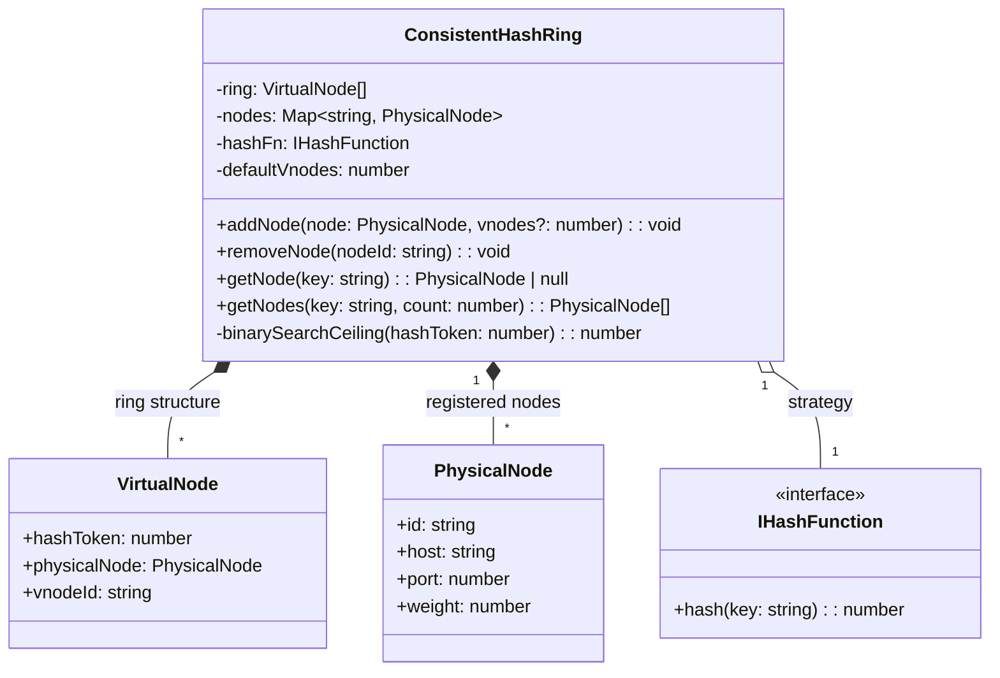
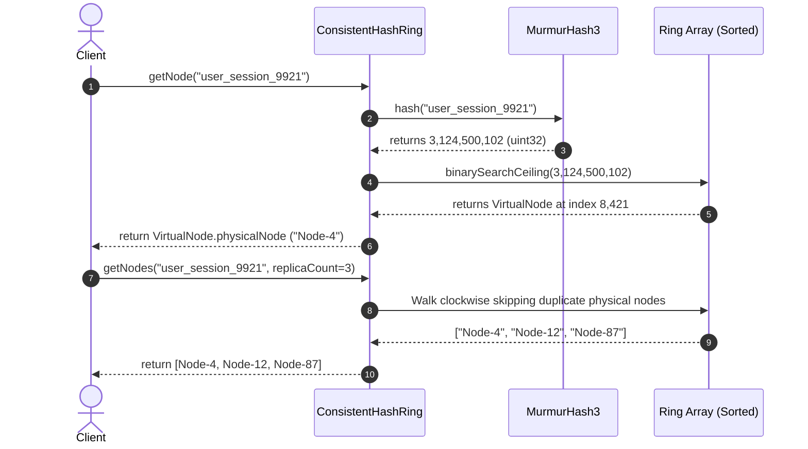
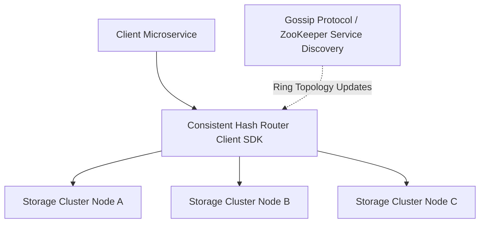

# 🛠️ Enterprise System Design Blueprint: Design Consistent Hash Ring

> **Target Role:** Principal / Staff Architect / Senior LLD & HLD Engineers  
> **Product Perspective:** Building an enterprise distributed routing consistent hash ring with virtual nodes (vnodes) and $O(\log(N \times V))$ binary search ring lookups to achieve uniform data distribution across heterogeneous storage nodes while minimizing key re-allocations during node additions and failures.  
> **Navigation:** ⬅️ [Back to Data Structures & Search Index](./README.md) | 📅 [Problem Bank Index](../README.md)

---

## 1. 🎯 Requirements & Product Scope

### 📋 Functional Requirements (FR)
1. **Dynamic Node Management:** `addNode(node: PhysicalNode, vnodeCount?: number): void` and `removeNode(nodeId: string): void` dynamically modify hash ring topology.
2. **Minimal Key Remapping:** When node topology changes, only $1/N$ keys on average are migrated.
3. **Key Location Routing:** `getNode(key: string): PhysicalNode` maps an arbitrary string key to its target physical server in $O(\log(N \times V))$ time.
4. **Virtual Node Factor:** Each physical node maps to $V$ virtual nodes distributed randomly around a $2^{32}-1$ integer ring to prevent hotspots.
5. **Replication Factor Support:** `getNodes(key: string, replicaCount: number): PhysicalNode[]` returns $R$ distinct physical nodes clockwise on the ring for high availability data replication.

### ⚡ Non-Functional Requirements (NFR)
1. **Sub-Millisecond Routing Latency:** Key lookup routing $<50\mu\text{s}$ at 1,000,000 QPS.
2. **Uniform Distribution:** Standard deviation of key load per physical node $<5\%$.
3. **Scalability:** Handle up to 1,000 physical nodes with 500 virtual nodes per node (500,000 total ring entries).

---

## 2. 🧮 Scale & Quantitative Estimates

```
Hash Space: 32-bit Integer Ring [0, 2^32 - 1] (4,294,967,295 positions)
Physical Nodes (N): 100 Servers
Virtual Nodes Per Physical Node (V): 150 Virtual Tokens
Total Virtual Tokens on Ring: 100 * 150 = 15,000 Virtual Nodes

Ring Data Structure Memory:
- Virtual Node Entry: token (4B uint32) + node reference pointer (8B) + vnodeId string (32B) = ~44 Bytes
- Total Ring Memory: 15,000 * 44B = ~660 KB RAM (Ultra-lightweight, fits in CPU L3 cache!)

Target Throughput: 1,000,000 QPS Key Lookups
```

---

## 3. 🛠️ Tech Stack & Architectural Justifications

| Component | Technology Choice | Architectural Rationale |
|:---|:---|:---|
| **Hash Algorithm** | MurmurHash3 / MD5 (32-bit truncated) | Provides high uniform avalanche distribution, fast hash computation, and minimal collision probability. |
| **Ring Storage** | Sorted Array (`VirtualNode[]`) | Enables fast $O(\log(N \times V))$ binary search (`ceiling`) with contiguous CPU memory cache prefetching. |
| **Node Indexing Map** | Hash Map (`Map<string, PhysicalNode>`) | $O(1)$ node lookup for management operations. |

---

## 4. 📐 Visual UML Diagrams

### 🏗️ Class Diagram



### 🔄 Sequence Diagram: Key Routing Lookup & Replication



---

## 5. 🧱 OOP & SOLID Principles Mapping

- **Single Responsibility Principle (SRP):** `ConsistentHashRing` handles ring token placement and lookup; `PhysicalNode` stores network node state; `Murmur3Hash` abstracts hashing calculation.
- **Open/Closed Principle (OCP):** Hash algorithms can be swapped by passing any class implementing `IHashFunction`.
- **Dependency Inversion Principle (DIP):** `ConsistentHashRing` depends on the `IHashFunction` abstraction.

---

## 6. 🎨 Design Patterns Selection

1. **Virtual Node Pattern:** Solves hotspotting and cluster skew by scattering $V$ virtual replicas of each physical node across the hash space.
2. **Strategy Pattern:** `IHashFunction` allows runtime selection of MurmurHash3, FNV-1a, or MD5 hashing engines.
3. **Proxy Pattern:** Virtual nodes act as distributed proxies routing key traffic to actual physical storage instances.

---

## 7. 💻 Production Code Blueprint (TypeScript)

```typescript
import * as crypto from 'crypto';

export interface PhysicalNode {
  id: string;
  host: string;
  port: number;
  weight?: number;
}

export interface VirtualNode {
  hashToken: number;
  physicalNode: PhysicalNode;
  vnodeId: string;
}

export interface IHashFunction {
  hash(key: string): number; // Returns unsigned 32-bit integer [0, 2^32 - 1]
}

/**
 * High-performance 32-bit MD5-based Hash Function implementation.
 */
export class MD5HashFunction implements IHashFunction {
  public hash(key: string): number {
    const md5Hex = crypto.createHash('md5').update(key).digest('hex');
    // Extract first 8 hex characters -> 32-bit unsigned integer
    return parseInt(md5Hex.substring(0, 8), 16) >>> 0;
  }
}

/**
 * Enterprise Production Consistent Hash Ring.
 */
export class ConsistentHashRing {
  private ring: VirtualNode[] = [];
  private nodesMap: Map<string, PhysicalNode> = new Map();

  constructor(
    private hashFn: IHashFunction = new MD5HashFunction(),
    private defaultVnodes: number = 150
  ) {}

  /**
   * Adds a physical server node to the hash ring with virtual node replication.
   */
  public addNode(node: PhysicalNode, vnodeCount?: number): void {
    if (this.nodesMap.has(node.id)) {
      this.removeNode(node.id); // Re-add node to update configuration
    }

    this.nodesMap.set(node.id, node);
    const count = vnodeCount || this.defaultVnodes;

    for (let i = 0; i < count; i++) {
      const vnodeId = `${node.id}-vnode-${i}`;
      const hashToken = this.hashFn.hash(vnodeId);
      this.ring.push({
        hashToken,
        physicalNode: node,
        vnodeId,
      });
    }

    // Keep ring sorted by hashToken for O(log N) binary search lookups
    this.ring.sort((a, b) => a.hashToken - b.hashToken);
  }

  /**
   * Removes a physical node and all its virtual tokens from the ring.
   */
  public removeNode(nodeId: string): void {
    if (!this.nodesMap.has(nodeId)) return;

    this.nodesMap.delete(nodeId);
    this.ring = this.ring.filter((vnode) => vnode.physicalNode.id !== nodeId);
  }

  /**
   * Routes key to its target physical server node in O(log(N * V)).
   */
  public getNode(key: string): PhysicalNode | null {
    if (this.ring.length === 0) return null;

    const hashToken = this.hashFn.hash(key);
    const index = this.binarySearchCeiling(hashToken);
    return this.ring[index].physicalNode;
  }

  /**
   * Returns R distinct physical nodes clockwise on ring for data replication.
   */
  public getNodes(key: string, replicaCount: number): PhysicalNode[] {
    if (this.ring.length === 0 || replicaCount <= 0) return [];

    const hashToken = this.hashFn.hash(key);
    const startIndex = this.binarySearchCeiling(hashToken);
    const results: PhysicalNode[] = [];
    const visitedNodeIds = new Set<string>();

    let currentIndex = startIndex;
    let steps = 0;

    while (
      results.length < replicaCount &&
      visitedNodeIds.size < this.nodesMap.size &&
      steps < this.ring.length
    ) {
      const targetNode = this.ring[currentIndex].physicalNode;
      if (!visitedNodeIds.has(targetNode.id)) {
        visitedNodeIds.add(targetNode.id);
        results.push(targetNode);
      }
      currentIndex = (currentIndex + 1) % this.ring.length;
      steps++;
    }

    return results;
  }

  /**
   * Binary search ceiling: Finds smallest hashToken >= target token.
   * Wraps around to index 0 if target > all ring tokens.
   */
  private binarySearchCeiling(targetToken: number): number {
    let low = 0;
    let high = this.ring.length - 1;

    if (targetToken > this.ring[high].hashToken) {
      return 0; // Ring wrap-around clockwise
    }

    let resultIndex = 0;
    while (low <= high) {
      const mid = Math.floor((low + high) / 2);
      if (this.ring[mid].hashToken >= targetToken) {
        resultIndex = mid;
        high = mid - 1;
      } else {
        low = mid + 1;
      }
    }

    return resultIndex;
  }

  public getVirtualNodeCount(): number {
    return this.ring.length;
  }

  public getPhysicalNodeCount(): number {
    return this.nodesMap.size;
  }
}
```

---

## 8. 🌐 High-Level Design (HLD) & Scale Bottlenecks



1. **Topology Synchronization Latency:** When nodes join/fail, client router SDKs must receive updated ring states. **Solution:** Integrate **Gossip Protocol / ZooKeeper Watchers** to broadcast topology updates in $<100\text{ms}$.
2. **Ring Rebalancing Load Spikes:** Re-routing $1/N$ keys during node additions can cause network I/O spikes. **Solution:** Perform **Rate-Limited Data Migration** in background worker threads.

---

## 9. 🎙️ Senior/Staff Level Grill Q&A

<details>
<summary><strong>Q1: How does Consistent Hashing minimize key migration compared to standard modulus hashing (hash(key) % N)?</strong></summary>

**Answer:**
In standard modulus hashing (`hash(key) % N`), changing $N$ to $N+1$ changes the denominator for every calculation, forcing **nearly 100% of all keys** to relocate to different nodes.
In Consistent Hashing, keys and nodes share the same 32-bit integer ring space. When a new node is added, it takes ownership of only the keys located between its token and its immediate counter-clockwise neighbor. Exactly $1/(N+1)$ of total keys are migrated, leaving the remaining $N/(N+1)$ keys completely untouched.
</details>

<details>
<summary><strong>Q2: Why are Virtual Nodes necessary, and how many virtual nodes per physical node should be configured?</strong></summary>

**Answer:**
Without virtual nodes ($V=1$), physical nodes produce non-uniform key distribution with huge hotspots (standard deviation up to 100%).
Virtual nodes ($V > 100$) scatter multiple token entries per server uniformly across the ring:
- $V = 100 \dots 200$ reduces variance to $<5\%$ standard deviation.
- Heterogeneous capacity can be modeled by assigning higher $V$ (e.g. $V=300$) to beefier servers with more RAM/CPU.
</details>

<details>
<summary><strong>Q3: How do you handle network partitioning (Split-Brain) on a consistent hash ring?</strong></summary>

**Answer:**
Combine Consistent Hashing with **Quorum Consensus ($R + W > N$)**:
1. When routing key writes/reads across $R$ replicas, require write acknowledgement from $W$ nodes and read acknowledgement from $R_d$ nodes.
2. If $W + R_d > R$, read operations are guaranteed to see the latest written value even during network partitions.
</details>
