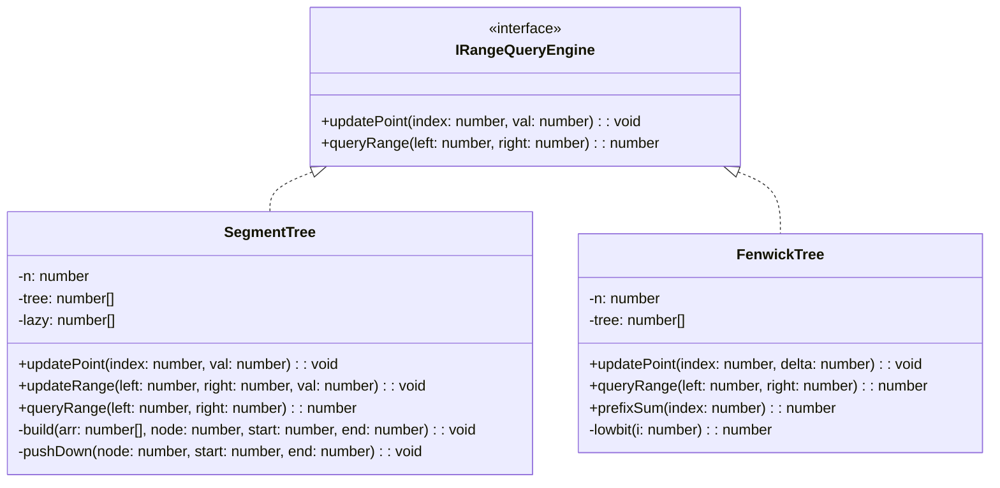
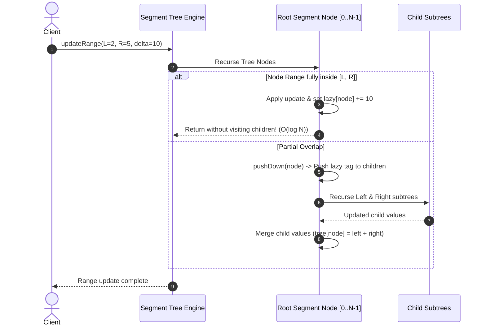
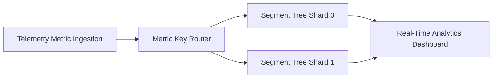

# 🛠️ Enterprise System Design Blueprint: Design Segment Tree & Fenwick Tree (BIT)

> **Target Role:** Principal / Staff Architect / Senior LLD & HLD Engineers  
> **Product Perspective:** Building high-throughput range query aggregation engines using Segment Trees (with Lazy Propagation) and Fenwick Trees (Binary Indexed Trees) for $O(\log N)$ point updates, range updates, and range aggregate queries (Sum, Min, Max) over dynamic telemetry streams.  
> **Navigation:** ⬅️ [Back to Data Structures & Search Index](./README.md) | 📅 [Problem Bank Index](../README.md)

---

## 1. 🎯 Requirements & Product Scope

### 📋 Functional Requirements (FR)
1. **Point Operations:** `updatePoint(index, val)` updates a single telemetry metric index in $O(\log N)$ time.
2. **Range Aggregate Queries:** `queryRange(left, right)` calculates range aggregates (Sum, Min, Max) over interval $[L, R]$ in $O(\log N)$ time.
3. **Range Updates (Segment Tree Lazy Propagation):** `updateRange(left, right, val)` increments all elements in range $[L, R]$ in $O(\log N)$ time using deferred lazy propagation flags.
4. **Binary Indexed Tree (BIT / Fenwick):** Provide low-memory $O(N)$ space alternative for cumulative frequency and range sum queries using bitwise lowbit logic (`i & (-i)`).

### ⚡ Non-Functional Requirements (NFR)
1. **Ultra-Low Latency:** Range queries $<1\text{ms}$ over $10,000,000$ metric data points.
2. **Space Efficiency:** Fenwick Tree uses exact $N+1$ array space; Segment Tree uses bounded $4N$ array space.
3. **High Concurrency:** Support read-heavy telemetry analytics at 500,000 QPS.

---

## 2. 🧮 Scale & Quantitative Estimates

```
Data Array Size (N): 10,000,000 Metric Points
Numeric Type: 64-bit Floating Point / Integer (8 Bytes)

Memory Requirements:
- Fenwick Tree Array Size: (10M + 1) * 8B = ~80 MB RAM
- Segment Tree Array Size: 4 * 10M * 8B = ~320 MB RAM
- Lazy Propagation Array: 4 * 10M * 8B = ~320 MB RAM

Target QPS: 500,000 QPS (70% Range Queries, 30% Range Updates)
```

---

## 3. 🛠️ Tech Stack & Architectural Justifications

| Feature | Segment Tree (with Lazy Propagation) | Fenwick Tree (Binary Indexed Tree) | Architectural Choice |
|:---|:---|:---|:---|
| **Space Complexity** | $O(4N)$ space | $O(N)$ space | Fenwick tree when memory is constrained. |
| **Point Update** | $O(\log N)$ | $O(\log N)$ | Both highly efficient. |
| **Range Query** | $O(\log N)$ (Sum, Min, Max, GCD) | $O(\log N)$ (Sum / Invertible operations only) | Segment Tree required for Non-Invertible ops (Min/Max). |
| **Range Update** | $O(\log N)$ via Lazy Propagation | $O(\log N)$ via Difference Array trick | Segment tree handles non-invertible range updates seamlessly. |

---

## 4. 📐 Visual UML Diagrams

### 🏗️ Class Diagram



### 🔄 Sequence Diagram: Segment Tree Lazy Propagation Update



---

## 5. 🧱 OOP & SOLID Principles Mapping

- **Single Responsibility Principle (SRP):** `SegmentTree` manages tree array partitioning and lazy evaluation; `FenwickTree` manages prefix-sum bitwise offsets.
- **Open/Closed Principle (OCP):** Aggregation function (Sum, Min, Max) decoupled via generic node combiner functions `(a, b) => number`.
- **Interface Segregation Principle (ISP):** Common range query operations abstracted under `IRangeQueryEngine`.

---

## 6. 🎨 Design Patterns Selection

1. **Lazy Evaluation Pattern:** Segment Tree defers child updates until mandatory during subsequent queries/updates via `lazy` arrays.
2. **Strategy Pattern:** Interchangeable aggregator functions (`Math.min`, `Math.max`, addition).
3. **Composite Pattern:** Implicit binary tree hierarchy flattened into a single contiguous array (`2*node + 1`, `2*node + 2`).

---

## 7. 💻 Production Code Blueprint (TypeScript)

```typescript
export interface IRangeQueryEngine {
  updatePoint(index: number, val: number): void;
  queryRange(left: number, right: number): number;
}

/**
 * Production Segment Tree with Lazy Propagation for O(log N) Range Updates & Sum/Min Queries.
 */
export class SegmentTree implements IRangeQueryEngine {
  private n: number;
  private tree: Float64Array;
  private lazy: Float64Array;

  constructor(data: number[]) {
    this.n = data.length;
    // Bounded array size up to 4 * N
    this.tree = new Float64Array(4 * this.n);
    this.lazy = new Float64Array(4 * this.n);

    if (this.n > 0) {
      this.build(data, 0, 0, this.n - 1);
    }
  }

  private build(arr: number[], node: number, start: number, end: number): void {
    if (start === end) {
      this.tree[node] = arr[start];
      return;
    }
    const mid = Math.floor((start + end) / 2);
    const leftChild = 2 * node + 1;
    const rightChild = 2 * node + 2;

    this.build(arr, leftChild, start, mid);
    this.build(arr, rightChild, mid + 1, end);
    this.tree[node] = this.tree[leftChild] + this.tree[rightChild];
  }

  /**
   * Pushes pending lazy update tags down to children nodes.
   */
  private pushDown(node: number, start: number, end: number): void {
    if (this.lazy[node] !== 0) {
      const mid = Math.floor((start + end) / 2);
      const leftChild = 2 * node + 1;
      const rightChild = 2 * node + 2;
      const val = this.lazy[node];

      // Apply to left child
      this.lazy[leftChild] += val;
      this.tree[leftChild] += val * (mid - start + 1);

      // Apply to right child
      this.lazy[rightChild] += val;
      this.tree[rightChild] += val * (end - mid);

      // Clear parent lazy tag
      this.lazy[node] = 0;
    }
  }

  public updatePoint(index: number, val: number): void {
    this.updatePointInternal(0, 0, this.n - 1, index, val);
  }

  private updatePointInternal(
    node: number,
    start: number,
    end: number,
    idx: number,
    val: number
  ): void {
    if (start === end) {
      this.tree[node] = val;
      return;
    }

    this.pushDown(node, start, end);
    const mid = Math.floor((start + end) / 2);
    if (idx <= mid) {
      this.updatePointInternal(2 * node + 1, start, mid, idx, val);
    } else {
      this.updatePointInternal(2 * node + 2, mid + 1, end, idx, val);
    }
    this.tree[node] = this.tree[2 * node + 1] + this.tree[2 * node + 2];
  }

  public updateRange(left: number, right: number, val: number): void {
    this.updateRangeInternal(0, 0, this.n - 1, left, right, val);
  }

  private updateRangeInternal(
    node: number,
    start: number,
    end: number,
    L: number,
    R: number,
    val: number
  ): void {
    if (L <= start && end <= R) {
      this.tree[node] += val * (end - start + 1);
      this.lazy[node] += val;
      return;
    }

    this.pushDown(node, start, end);
    const mid = Math.floor((start + end) / 2);
    if (L <= mid) {
      this.updateRangeInternal(2 * node + 1, start, mid, L, R, val);
    }
    if (R > mid) {
      this.updateRangeInternal(2 * node + 2, mid + 1, end, L, R, val);
    }
    this.tree[node] = this.tree[2 * node + 1] + this.tree[2 * node + 2];
  }

  public queryRange(left: number, right: number): number {
    return this.queryRangeInternal(0, 0, this.n - 1, left, right);
  }

  private queryRangeInternal(
    node: number,
    start: number,
    end: number,
    L: number,
    R: number
  ): number {
    if (R < start || end < L) return 0; // Disjoint
    if (L <= start && end <= R) return this.tree[node]; // Completely inside

    this.pushDown(node, start, end);
    const mid = Math.floor((start + end) / 2);
    const leftSum = this.queryRangeInternal(2 * node + 1, start, mid, L, R);
    const rightSum = this.queryRangeInternal(2 * node + 2, mid + 1, end, L, R);
    return leftSum + rightSum;
  }
}

/**
 * Production Fenwick Tree (Binary Indexed Tree) for O(log N) Range Sums.
 */
export class FenwickTree implements IRangeQueryEngine {
  private n: number;
  private tree: Float64Array;

  constructor(size: number) {
    this.n = size;
    // 1-based indexing for BIT lowbit operations
    this.tree = new Float64Array(this.n + 1);
  }

  private lowbit(i: number): number {
    return i & -i;
  }

  /**
   * Adds delta to index in O(log N). (1-based index)
   */
  public updatePoint(index: number, delta: number): void {
    let i = index + 1; // Convert to 1-based index
    while (i <= this.n) {
      this.tree[i] += delta;
      i += this.lowbit(i);
    }
  }

  /**
   * Calculates Prefix Sum [0..index] in O(log N).
   */
  public prefixSum(index: number): number {
    let sum = 0;
    let i = index + 1;
    while (i > 0) {
      sum += this.tree[i];
      i -= this.lowbit(i);
    }
    return sum;
  }

  /**
   * Calculates Range Sum [left..right] in O(log N).
   */
  public queryRange(left: number, right: number): number {
    if (left > right) return 0;
    return this.prefixSum(right) - (left > 0 ? this.prefixSum(left - 1) : 0);
  }
}
```

---

## 8. 🌐 High-Level Design (HLD) & Scale Bottlenecks



1. **Memory Overhead of Sparse Coordinates ($10^9$ range):** Allocating fixed $4N$ arrays for coordinate spaces up to $10^9$ causes Out-Of-Memory. **Solution:** Use **Dynamic Sparse Segment Trees**, allocating nodes dynamically on demand via pointers.
2. **Non-Invertible Operations in Fenwick Trees:** Fenwick Trees cannot evaluate Range Minimum Query (RMQ) in $O(\log N)$ after updates. **Solution:** Prefer **Segment Trees** when Range Min/Max or non-invertible operations are required.

---

## 9. 🎙️ Senior/Staff Level Grill Q&A

<details>
<summary><strong>Q1: How does `i & (-i)` work in Fenwick Tree navigation?</strong></summary>

**Answer:**
`i & (-i)` performs a bitwise AND between integer $i$ and its two's complement $-i$. This isolates the **lowest set bit** in binary representation:
- For $i = 12$ (`01100`), `lowbit(12)` yields $4$ (`00100`).
- In `updatePoint`: Adding `lowbit(i)` moves to the parent node responsible for covering index $i$.
- In `prefixSum`: Subtracting `lowbit(i)` strips the last binary range, jumping to the previous non-overlapping sub-range sum in $O(\log N)$ steps.
</details>

<details>
<summary><strong>Q2: What is Lazy Propagation in Segment Trees, and why is it essential for O(log N) range updates?</strong></summary>

**Answer:**
Without lazy propagation, updating range $[L, R]$ requires modifying every leaf node in that range ($O(N \log N)$ complexity).
**Lazy Propagation Mechanism:**
1. When a node's interval $[start, end]$ falls completely inside $[L, R]$, apply the update value to that node directly and record the value in a `lazy[node]` tag array.
2. **Defer Child Updates:** Do NOT recurse to child nodes. Return immediately in $O(1)$!
3. **Push Down on Demand:** During subsequent queries or updates visiting that node, check `lazy[node]`. If non-zero, push the lazy tag down to direct children before processing.
This guarantees $O(\log N)$ range update complexity.
</details>

<details>
<summary><strong>Q3: When should a Principal Architect choose a Fenwick Tree over a Segment Tree in production?</strong></summary>

**Answer:**
Choose **Fenwick Tree** when:
1. Operations are **cumulative and invertible** (e.g. Range Sum, Count Frequency).
2. Memory constraints are extreme (Fenwick requires $1N$ space vs $4N$ for Segment Tree).
3. Implementation simplicity and zero allocation are required.

Choose **Segment Tree** when:
1. Operations are **non-invertible** (Range Minimum, Range Maximum, Range GCD).
2. Complex range updates with lazy propagation are required.
</details>
