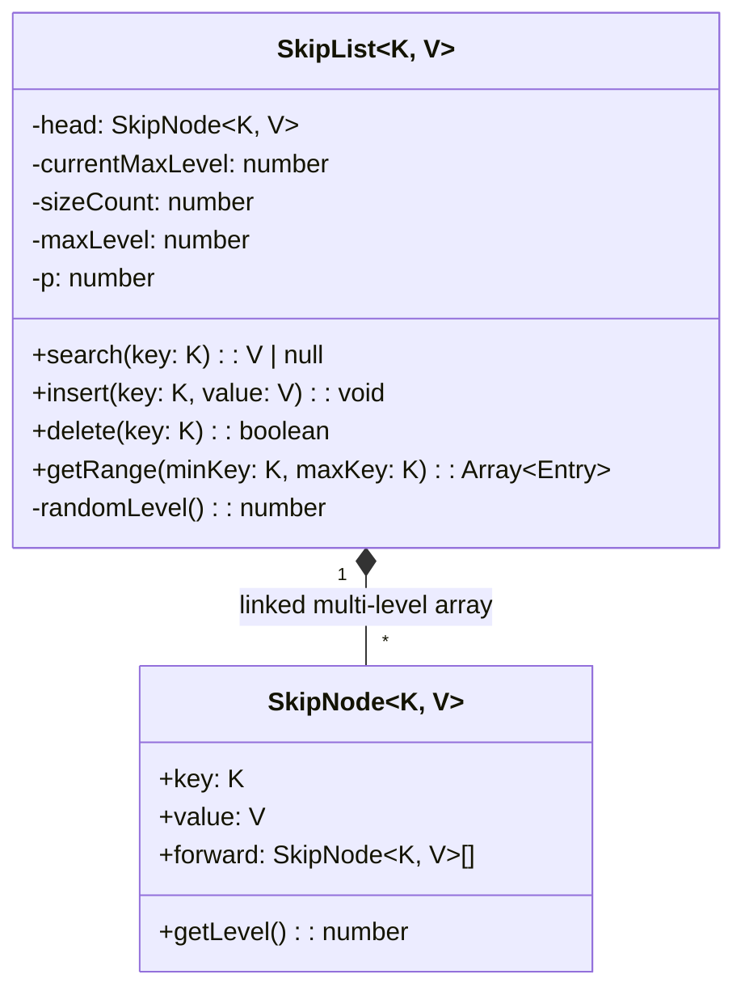
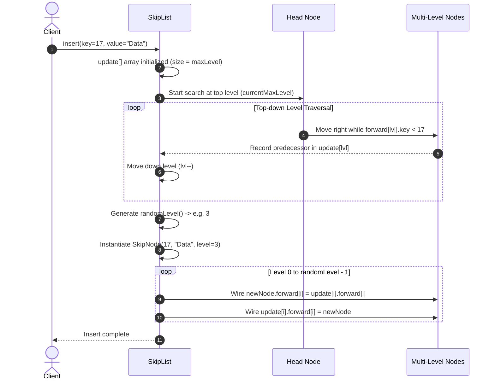
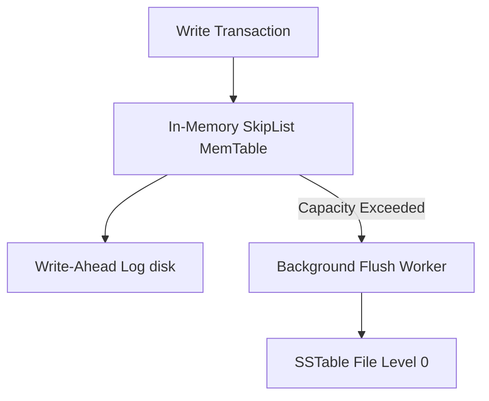

# 🛠️ Enterprise System Design Blueprint: Design Probabilistic Skiplist

> **Target Role:** Principal / Staff Architect / Senior LLD & HLD Engineers  
> **Product Perspective:** Building an enterprise-grade probabilistic multi-level SkipList in memory, providing expected $O(\log N)$ search, insertion, deletion, and continuous range scanning capabilities, serving as the core data structure behind LevelDB/RocksDB MemTables and Redis Sorted Sets (ZSET).  
> **Navigation:** ⬅️ [Back to Data Structures & Search Index](./README.md) | 📅 [Problem Bank Index](../README.md)

---

## 1. 🎯 Requirements & Product Scope

### 📋 Functional Requirements (FR)
1. **$O(\log N)$ Search:** `search(key: K): V | null` retrieves key value in expected $O(\log N)$ average time.
2. **$O(\log N)$ Insertion:** `insert(key: K, value: V): void` inserts or updates nodes, generating dynamic level promotion using coin-flip probability $p=0.5$ up to `maxLevel`.
3. **$O(\log N)$ Deletion:** `delete(key: K): boolean` rewires forward pointer arrays across all active levels.
4. **Range Scanning:** `getRange(minKey: K, maxKey: K): Array<{key: K, value: V}>` scans bottom Level 0 linked list sequentially.
5. **Level Statistics:** Expose stats regarding node count, height distribution, and total forward pointer links.

### ⚡ Non-Functional Requirements (NFR)
1. **Low Memory Overhead:** Average forward pointers per node $= 1 / (1-p) = 2.0$.
2. **Lock-Free Readiness:** Superior lock-free concurrency characteristics compared to Red-Black / AVL trees due to isolated pointer adjustments.
3. **Ultra-Low Latency:** Sub-millisecond operational latency ($P_{99} < 1\text{ms}$) across 5,000,000 active nodes.

---

## 2. 🧮 Scale & Quantitative Estimates

```
Total Items (N): 5,000,000 Nodes
Probability (p): 0.5 (Coin Flip)
Max Level (L_max): 32 Levels (Supports up to 2^32 elements)

Average Level Distribution:
- Level 0: 5,000,000 nodes (100%)
- Level 1: 2,500,000 nodes (50%)
- Level 2: 1,250,000 nodes (25%)
- Level 3: 625,000 nodes (12.5%)
Total Forward Pointers: ~10,000,000 pointers across all nodes

Memory Calculations:
- Key + Value: 32B + 64B = 96 Bytes
- Forward Pointer Array (Avg 2 pointers): 2 * 8B = 16 Bytes
- SkipNode Overhead: ~112 Bytes
Total System Memory: 5,000,000 * 112B = ~560 MB RAM
```

---

## 3. 🛠️ Tech Stack & Architectural Justifications

| Component | Technology Choice | Architectural Rationale |
|:---|:---|:---|
| **SkipList Hierarchy** | Multi-level Forward Pointer Arrays | Allows skipping large node sub-sequences at upper levels before fine-tuning search at lower levels. |
| **Level Promotion** | Geometric Distribution (`p=0.5`) | Guarantees balanced $O(\log N)$ depth probabilistically without complex tree rotations. |
| **Level 0 Baseline** | Doubly/Singly Linked List | Enables contiguous sequential range scans without depth-first tree traversals. |

---

## 4. 📐 Visual UML Diagrams

### 🏗️ Class Diagram



### 🔄 Sequence Diagram: `insert()` with Predecessor Array Search



---

## 5. 🧱 OOP & SOLID Principles Mapping

- **Single Responsibility Principle (SRP):** `SkipNode` stores data and array pointers; `SkipList` coordinates predecessor tracking, insertion, deletion, and random level generation.
- **Open/Closed Principle (OCP):** Range iterators (`ISkipListIterator`) can be customized for descending vs ascending scans without modifying core pointer structures.
- **Interface Segregation Principle (ISP):** Read-only lookups (`ISearchable<K, V>`) separated from mutation interfaces (`IDataStore<K, V>`).

---

## 6. 🎨 Design Patterns Selection

1. **Probabilistic Data Structure Pattern:** Replaces rigid structural balancing invariants (Red-Black balance rules) with lightweight pseudo-random number generator coin flips.
2. **Iterator Pattern:** Level 0 linked list provides flat sequential iterator traversal.
3. **Chain of Responsibility Pattern:** High-level forward pointers delegate search responsibility down to granular lower levels.

---

## 7. 💻 Production Code Blueprint (TypeScript)

```typescript
export class SkipNode<K, V> {
  public forward: Array<SkipNode<K, V> | null>;

  constructor(
    public key: K,
    public value: V,
    level: number
  ) {
    // Array of forward pointers indexed by level [0..level-1]
    this.forward = new Array<SkipNode<K, V> | null>(level).fill(null);
  }

  public get level(): number {
    return this.forward.length;
  }
}

/**
 * Enterprise Production Probabilistic SkipList implementation.
 */
export class SkipList<K, V> {
  private head: SkipNode<any, any>;
  private currentMaxLevel: number = 1;
  private sizeCount: number = 0;

  constructor(
    private readonly maxLevel: number = 32,
    private readonly p: number = 0.5
  ) {
    if (maxLevel <= 0 || p <= 0 || p >= 1) {
      throw new Error('Invalid SkipList configuration parameters.');
    }
    // Dummy sentinel head node initialized with maxLevel capacity
    this.head = new SkipNode<any, any>(null, null, this.maxLevel);
  }

  /**
   * Generates random level for node using geometric distribution.
   */
  private randomLevel(): number {
    let lvl = 1;
    while (Math.random() < this.p && lvl < this.maxLevel) {
      lvl++;
    }
    return lvl;
  }

  /**
   * Searches for a key. Time Complexity: O(log N) expected.
   */
  public search(key: K): V | null {
    let current = this.head;

    for (let i = this.currentMaxLevel - 1; i >= 0; i--) {
      while (current.forward[i] !== null && current.forward[i]!.key < key) {
        current = current.forward[i]!;
      }
    }

    current = current.forward[0]!;
    if (current !== null && current.key === key) {
      return current.value;
    }
    return null;
  }

  /**
   * Inserts key-value pair. Time Complexity: O(log N) expected.
   */
  public insert(key: K, value: V): void {
    const update: Array<SkipNode<K, V>> = new Array(this.maxLevel).fill(this.head);
    let current = this.head;

    // Track predecessors across all levels
    for (let i = this.currentMaxLevel - 1; i >= 0; i--) {
      while (current.forward[i] !== null && current.forward[i]!.key < key) {
        current = current.forward[i]!;
      }
      update[i] = current;
    }

    current = current.forward[0]!;

    // Key exists -> Update value
    if (current !== null && current.key === key) {
      current.value = value;
      return;
    }

    // Key does not exist -> Insert new node
    const rLevel = this.randomLevel();
    if (rLevel > this.currentMaxLevel) {
      for (let i = this.currentMaxLevel; i < rLevel; i++) {
        update[i] = this.head;
      }
      this.currentMaxLevel = rLevel;
    }

    const newNode = new SkipNode<K, V>(key, value, rLevel);

    for (let i = 0; i < rLevel; i++) {
      newNode.forward[i] = update[i].forward[i];
      update[i].forward[i] = newNode;
    }

    this.sizeCount++;
  }

  /**
   * Deletes a key. Time Complexity: O(log N) expected.
   */
  public delete(key: K): boolean {
    const update: Array<SkipNode<K, V>> = new Array(this.maxLevel).fill(this.head);
    let current = this.head;

    for (let i = this.currentMaxLevel - 1; i >= 0; i--) {
      while (current.forward[i] !== null && current.forward[i]!.key < key) {
        current = current.forward[i]!;
      }
      update[i] = current;
    }

    current = current.forward[0]!;

    if (current === null || current.key !== key) {
      return false; // Key not found
    }

    // Rewire pointers across all levels matching current's level
    for (let i = 0; i < this.currentMaxLevel; i++) {
      if (update[i].forward[i] !== current) break;
      update[i].forward[i] = current.forward[i];
    }

    // Lower currentMaxLevel if top levels are empty
    while (
      this.currentMaxLevel > 1 &&
      this.head.forward[this.currentMaxLevel - 1] === null
    ) {
      this.currentMaxLevel--;
    }

    this.sizeCount--;
    return true;
  }

  /**
   * Range search scan on Level 0 linked list.
   */
  public getRange(minKey: K, maxKey: K): Array<{ key: K; value: V }> {
    const results: Array<{ key: K; value: V }> = [];
    let current = this.head;

    for (let i = this.currentMaxLevel - 1; i >= 0; i--) {
      while (current.forward[i] !== null && current.forward[i]!.key < minKey) {
        current = current.forward[i]!;
      }
    }

    current = current.forward[0]!;

    while (current !== null && current.key <= maxKey) {
      results.push({ key: current.key, value: current.value });
      current = current.forward[0]!;
    }

    return results;
  }

  public size(): number {
    return this.sizeCount;
  }

  public getLevel(): number {
    return this.currentMaxLevel;
  }
}
```

---

## 8. 🌐 High-Level Design (HLD) & Scale Bottlenecks



1. **MemTable Storage Engine Choice:** Why Redis & LevelDB/RocksDB choose SkipList over Red-Black Tree. **Reason:** SkipList implementation is lock-free ready (using fine-grained CAS atomic pointer swaps), whereas tree rotations (AVL/Red-Black) require lock-free tree restructuring which is notoriously difficult to implement correctly.
2. **Sequential Memory Cache Misses:** Forward pointer jumps across memory can cause L1/L2 cache misses. **Solution:** Unroll Level 0 nodes into **Unrolled LinkedLists / Chunked Node Arrays** to increase CPU cache locality.

---

## 9. 🎙️ Senior/Staff Level Grill Q&A

<details>
<summary><strong>Q1: Why do LevelDB, RocksDB, and Redis use SkipLists instead of Red-Black Trees for ordered data?</strong></summary>

**Answer:**
1. **Lock-Free Concurrency:** Mutating a SkipList requires changing only local forward pointers (`update[i].forward[i]`). This can be done lock-free using atomic Compare-And-Swap (CAS). Red-Black trees require complex rotations affecting parents, siblings, and children up to the tree root, requiring global locking.
2. **Range Queries:** Range scanning in SkipList is simple sequential iteration along the Level 0 linked list ($O(K)$ time). In Red-Black trees, range traversal requires $O(K \log N)$ tree search calls or parent pointer traversals.
3. **Simplicity:** SkipList code is significantly shorter and less bug-prone than rotational BST rebalancing code.
</details>

<details>
<summary><strong>Q2: How do you choose probability parameter $p$ and maximum height $L_{max}$?</strong></summary>

**Answer:**
- **Max Height $L_{max}$:** Set $L_{max} = \log_{1/p}(N_{max})$. For $N = 2^{32} \approx 4\text{ Billion}$, $L_{max} = 32$ with $p=0.5$.
- **Probability $p$:**
  - $p = 0.5$: Faster search ($2$ comparisons per level on average), average $2.0$ pointers per node.
  - $p = 0.25$: Reduced pointer memory overhead (average $1.33$ pointers per node), with slightly more search comparisons ($1/p = 4$).
</details>

<details>
<summary><strong>Q3: How does lock-free insertion work in a concurrent multi-threaded SkipList?</strong></summary>

**Answer:**
Lock-free SkipLists use **Marked Atomic References**:
1. Insert node at Level 0 first using a CAS pointer swap (`CAS(pred.forward[0], oldNext, newNode)`).
2. Wire upper levels from Level 1 up to `rLevel` via CAS.
3. If another thread modifies `pred.forward[lvl]` mid-flight, retry the predecessor search for that level and CAS again.
4. Deletions use a 2-step process: logical deletion (marking the node's forward pointer bit) followed by physical link rewiring.
</details>
