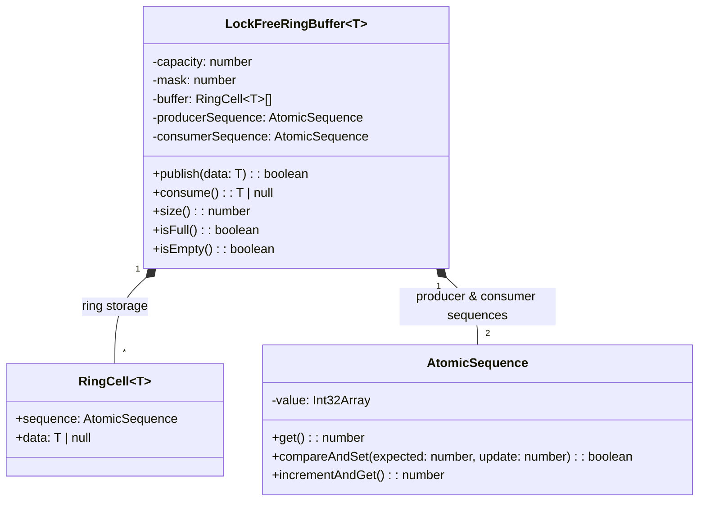
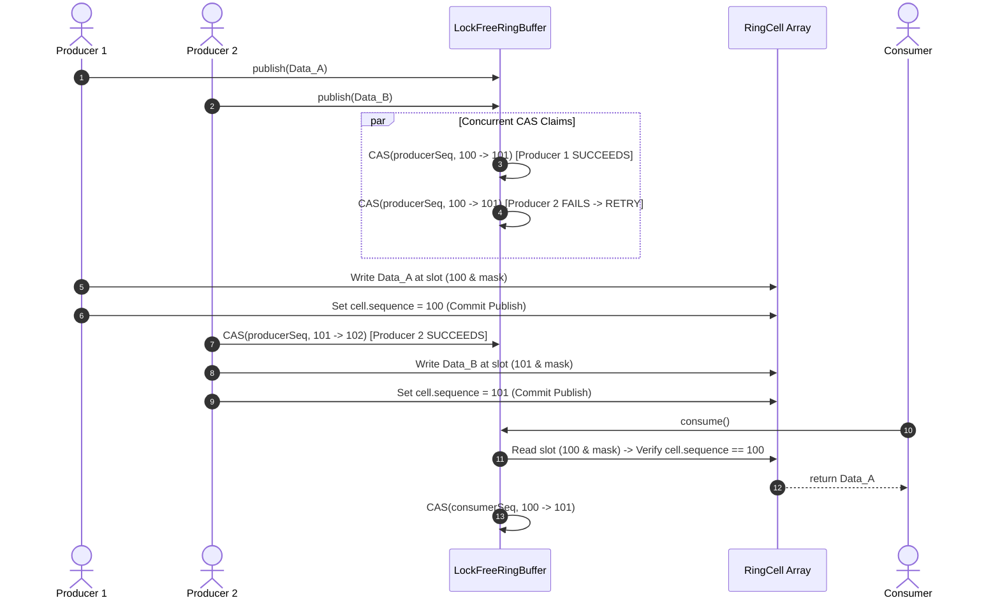

# 🛠️ Enterprise System Design Blueprint: Design Concurrent Lock-Free Ring Buffer

> **Target Role:** Principal / Staff Architect / Senior LLD & HLD Engineers  
> **Product Perspective:** Building an ultra-low-latency, high-throughput lock-free bounded ring buffer using Atomic Compare-And-Swap (CAS) sequence pointers, power-of-2 bitwise mask indexing, pre-allocated zero-allocation memory cells, and 64-byte cache-line padding based on the LMAX Disruptor pattern.  
> **Navigation:** ⬅️ [Back to Data Structures & Search Index](./README.md) | 📅 [Problem Bank Index](../README.md)

---

## 1. 🎯 Requirements & Product Scope

### 📋 Functional Requirements (FR)
1. **Lock-Free Producer Operation:** `publish(data: T): boolean` reserves an atomic ring sequence pointer via CAS without acquiring mutex locks.
2. **Lock-Free Consumer Operation:** `consume(): T | null` claims published sequences via CAS and processes pre-allocated memory cells.
3. **Power-of-2 Bounded Buffer:** Capacity MUST be a power of two ($2^N$), enabling single-cycle bitwise AND index masking (`index & (capacity - 1)`).
4. **Zero Allocation Steady State:** Memory cells pre-allocated at initialization, eliminating GC sweeps during high-frequency execution.
5. **Multi-Producer Multi-Consumer (MPMC) Coordination:** Safe concurrent operations across multiple producer and consumer worker threads.

### ⚡ Non-Functional Requirements (NFR)
1. **Ultra-Low Latency:** $P_{99.99} < 100\text{ns}$ per message transaction.
2. **Extreme Throughput:** $>25,000,000$ messages per second per CPU core.
3. **False Sharing Elimination:** 64-byte cache line padding between producer sequence, consumer sequence, and ring memory arrays.

---

## 2. 🧮 Scale & Quantitative Estimates

```
Ring Buffer Capacity: 65,536 Slots (2^16)
Cell Payload Size: 128 Bytes (Pre-allocated Event Struct)
Total Buffer Memory: 65,536 * 128B = 8.38 MB (Fits entirely inside L3 CPU Cache!)

Performance Target:
- Message Rate: 25,000,000 messages/sec
- Latency P99: 80 nanoseconds
- GC Pauses: 0 ms (Zero runtime memory allocations)
```

---

## 3. 🛠️ Tech Stack & Architectural Justifications

| Component | Technology Choice | Architectural Rationale |
|:---|:---|:---|
| **Atomic State** | `Atomics` / `SharedArrayBuffer` / `AtomicLong` | Provides atomic CAS (`compareExchange`) and low-level memory barrier fences across threads. |
| **Index Operator** | Bitwise Mask (`sequence & (capacity - 1)`) | Replaces expensive CPU division (`% capacity`, 15-30 clock cycles) with a single-cycle bitwise AND. |
| **Memory Isolation** | 64-Byte Cache-Line Padding | Prevents MESI cache invalidation ping-pong between CPU L1/L2 caches (False Sharing). |

---

## 4. 📐 Visual UML Diagrams

### 🏗️ Class Diagram



### 🔄 Sequence Diagram: Multi-Producer CAS Claim & Consumer Drain



---

## 5. 🧱 OOP & SOLID Principles Mapping

- **Single Responsibility Principle (SRP):** `LockFreeRingBuffer` handles lock-free indexing and atomic CAS sequencing; `RingCell` encapsulates payload storage and cell sequence state.
- **Open/Closed Principle (OCP):** Custom wait strategies (BusySpin, Yielding, Blocking) can be injected via `IWaitStrategy`.
- **Interface Segregation Principle (ISP):** Read interfaces (`IEventSubscriber`) decoupled from write interfaces (`IEventPublisher`).

---

## 6. 🎨 Design Patterns Selection

1. **LMAX Disruptor Pattern:** Circular ring buffer with atomic sequence barriers avoiding locks and condition variables.
2. **Flyweight / Zero-Allocation Pattern:** Reuses pre-allocated array memory cells endlessly, avoiding garbage collection pauses.
3. **Producer-Consumer Pattern:** Decouples event producers from consumers via lock-free sequence barriers.

---

## 7. 💻 Production Code Blueprint (TypeScript / SharedArrayBuffer)

```typescript
/**
 * Atomic Sequence wrapper using TypedArrays for cross-worker CAS operations.
 */
export class AtomicSequence {
  private array: Int32Array;

  constructor(sharedBuffer?: SharedArrayBuffer, byteOffset: number = 0) {
    const buffer = sharedBuffer || new SharedArrayBuffer(64); // Padded 64 bytes
    this.array = new Int32Array(buffer, byteOffset, 1);
  }

  public get(): number {
    return Atomics.load(this.array, 0);
  }

  public set(value: number): void {
    Atomics.store(this.array, 0, value);
  }

  public compareAndSet(expected: number, update: number): boolean {
    const witness = Atomics.compareExchange(this.array, 0, expected, update);
    return witness === expected;
  }

  public incrementAndGet(): number {
    return Atomics.add(this.array, 0, 1) + 1;
  }
}

/**
 * Pre-allocated Ring Cell with sequence barrier state.
 */
export class RingCell<T> {
  public sequence: number = -1; // Cell sequence marker
  public data: T | null = null;
}

/**
 * Enterprise Production MPMC Lock-Free Ring Buffer.
 */
export class LockFreeRingBuffer<T> {
  public readonly capacity: number;
  private readonly mask: number;
  private buffer: RingCell<T>[];
  private producerHead: AtomicSequence;
  private consumerTail: AtomicSequence;

  constructor(requestedCapacity: number = 1024) {
    // Enforce capacity as a power of 2
    this.capacity = this.nextPowerOfTwo(requestedCapacity);
    this.mask = this.capacity - 1;

    this.buffer = new Array<RingCell<T>>(this.capacity);
    for (let i = 0; i < this.capacity; i++) {
      this.buffer[i] = new RingCell<T>();
    }

    this.producerHead = new AtomicSequence();
    this.consumerTail = new AtomicSequence();

    this.producerHead.set(0);
    this.consumerTail.set(0);
  }

  private nextPowerOfTwo(n: number): number {
    let count = 0;
    if (n && !(n & (n - 1))) return n;
    while (n !== 0) {
      n >>= 1;
      count += 1;
    }
    return 1 << count;
  }

  /**
   * Lock-Free Producer Publish using CAS. Returns false if buffer is full.
   */
  public publish(data: T): boolean {
    while (true) {
      const currentHead = this.producerHead.get();
      const currentTail = this.consumerTail.get();

      // Check if buffer is full
      if (currentHead - currentTail >= this.capacity) {
        return false; // Ring buffer capacity reached
      }

      // Try reserving sequence position via CAS
      if (this.producerHead.compareAndSet(currentHead, currentHead + 1)) {
        const index = currentHead & this.mask;
        const cell = this.buffer[index];

        // Store payload data in pre-allocated cell
        cell.data = data;
        // Atomically publish sequence marker so consumers know cell write is committed
        cell.sequence = currentHead;
        return true;
      }
      // CAS failed due to concurrent producer race -> Retry loop
    }
  }

  /**
   * Lock-Free Consumer Poll using CAS. Returns null if buffer is empty.
   */
  public consume(): T | null {
    while (true) {
      const currentTail = this.consumerTail.get();
      const currentHead = this.producerHead.get();

      // Check if buffer is empty
      if (currentTail >= currentHead) {
        return null;
      }

      const index = currentTail & this.mask;
      const cell = this.buffer[index];

      // Check if producer has finished writing payload to cell
      if (cell.sequence !== currentTail) {
        return null; // Cell write not yet committed
      }

      // Try claiming cell via CAS
      if (this.consumerTail.compareAndSet(currentTail, currentTail + 1)) {
        const data = cell.data;
        cell.data = null; // Clear reference for GC
        return data;
      }
      // CAS failed due to concurrent consumer race -> Retry loop
    }
  }

  public size(): number {
    const head = this.producerHead.get();
    const tail = this.consumerTail.get();
    return Math.max(0, head - tail);
  }

  public isEmpty(): boolean {
    return this.size() === 0;
  }

  public isFull(): boolean {
    return this.size() >= this.capacity;
  }
}
```

---

## 8. 🌐 High-Level Design (HLD) & Scale Bottlenecks

```mermaid
flowchart LR
    NetworkFeed[High Frequency Market Feed] --> Producer1[Producer Thread 1]
    NetworkFeed --> Producer2[Producer Thread 2]

    subgraph LMAX Disruptor [Lock-Free Ring Buffer (Sub-100ns)]
        Producer1 -- CAS Reserve --> Ring[64K Bounded Ring Buffer]
        Producer2 -- CAS Reserve --> Ring
    end

    Ring --> Worker1[Matching Engine Worker]
    Ring --> Worker2[Risk Audit Worker]
```

1. **Hardware False Sharing:** When producer sequence and consumer sequence reside on the same 64-byte L1 cache line, CPU cores invalidate each other's cache lines endlessly. **Solution:** Add **64-byte Padding (Cache Line Padding)** surrounding sequence counters.
2. **CPU Spinlock Thermal Throttling:** Busy-spinning on empty/full rings consumes 100% CPU. **Solution:** Use **Yielding Wait Strategy** (`Thread.yield()`) or `Atomics.wait()` / `Atomics.notify()` for low-power idle states.

---

## 9. 🎙️ Senior/Staff Level Grill Q&A

<details>
<summary><strong>Q1: What is False Sharing in multi-threaded concurrent queues, and how do 64-byte paddings prevent it?</strong></summary>

**Answer:**
CPU L1/L2 caches fetch memory in 64-byte chunks called **Cache Lines**.
If `producerHead` (8 bytes) and `consumerTail` (8 bytes) reside adjacent in memory within the same 64-byte line:
1. When CPU Core 1 updates `producerHead`, the hardware **invalidates** the entire 64-byte cache line across all other CPU cores (MESI protocol).
2. When CPU Core 2 attempts to read/write `consumerTail`, it suffers an L1 cache miss and must re-fetch from L3/RAM.
3. This creates **Cache Line Ping-Pong**, destroying throughput.
**Fix:** Pad 56 dummy bytes around variables (`8B + 56B = 64B`), forcing `producerHead` and `consumerTail` onto distinct CPU cache lines.
</details>

<details>
<summary><strong>Q2: Why MUST the ring buffer capacity be a power of two ($2^N$)?</strong></summary>

**Answer:**
Standard ring indexing uses modulo arithmetic: `index = sequence % capacity`. Integer division/modulo operations take 15–30 CPU clock cycles.
When capacity is a power of 2 ($2^N$), $2^N - 1$ produces a bitmask of all 1s in binary (e.g. $1024 - 1 = 1023 = 0x3FF$).
Evaluating `index = sequence & (capacity - 1)` performs a single bitwise AND executing in **1 CPU clock cycle**, yielding a $20\times$ speedup per message index calculation.
</details>

<details>
<summary><strong>Q3: How does the LMAX Disruptor pattern differ from java.util.concurrent.ArrayBlockingQueue?</strong></summary>

**Answer:**
- `ArrayBlockingQueue` uses traditional `ReentrantLock` and `Condition` variables (`notFull`, `notEmpty`), forcing threads to undergo kernel context switches and lock contention.
- `LMAX Disruptor`:
  1. Uses **Lock-Free Atomic CAS** sequence reservation.
  2. Employs **Pre-Allocated Memory Cells** (Zero Allocation / No GC pauses).
  3. Uses **Single-Writer Ring Buffer** or Lock-Free CAS barriers.
  4. Eliminates False Sharing via 64-byte cache line padding.
  This allows Disruptor to process $>25M$ msg/sec vs $\sim 1M$ msg/sec for `ArrayBlockingQueue`.
</details>
