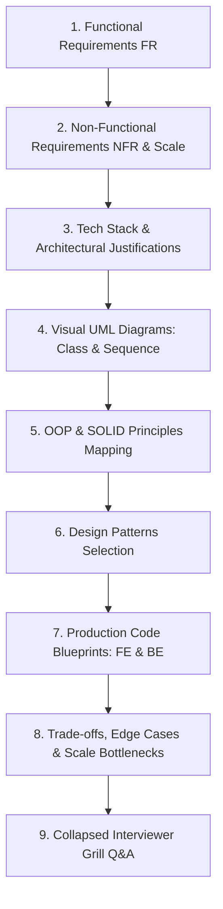

# 🌿 Master System Design Problem Bank — Data Structures & Search

> **Target Role:** Principal / Staff Architect / Senior LLD & HLD Engineers  
> **Framework:** Standardized 9-Step Breakdown (Functional Requirements, Scale & Estimates, Tech Stack, Visual UML Diagrams, OOP & SOLID Mapping, Design Patterns, Code Blueprints, Scale Bottlenecks, and Collapsed Grill Q&A).  
> **Navigation:** ⬅️ [Back to Master Problem Bank](../README.md) | 📅 [8-Week Roadmap](../../ROADMAP.md)

---

## 🧭 Category Overview: Data Structures & Search (11 Master Problems)

| # | Problem Blueprint | Level | Key System Challenges & Architecture Focus | Master Guide Link |
|:---:|:---|:---:|:---|:---:|
| 1 | 📖 **Design LRU Cache** | `Easy` | $O(1)$ Hash + Doubly LinkedList Eviction, Lock Partitioning, TTL Expiration | [01-Design-LRU-Cache.md](./01-Design-LRU-Cache.md) |
| 2 | 📖 **Design Bloom Filter** | `Easy` | Bit Vector Allocation, Kirsch-Mitzenmacher Hashing, 0% False Negatives | [02-Design-Bloom-Filter.md](./02-Design-Bloom-Filter.md) |
| 3 | 📖 **Design Search Autocomplete System** | `Easy` | Trie (Prefix Tree), Pre-computed Top-K Suggestion Nodes, Sub-20ms Keystroke Latency | [03-Design-Search-Autocomplete.md](./03-Design-Search-Autocomplete.md) |
| 4 | 📖 **Design Simple Search Engine** | `Medium` | Inverted Index Posting Lists, TF-IDF Relevance Ranking, Tokenization & Stemming | [04-Design-Simple-Search-Engine.md](./04-Design-Simple-Search-Engine.md) |
| 5 | 📖 **Design LFU Cache** | `Hard` | $O(1)$ Least Frequently Used Eviction via Frequency Hash Map + Doubly LinkedList Buckets | [05-Design-LFU-Cache.md](./05-Design-LFU-Cache.md) |
| 6 | 📖 **Design Trie with Fuzzy Search** | `Medium` | Wildcard `.` Matching, Levenshtein Edit Distance Backtracking, Prefix Query Traversal | [06-Design-Trie-Fuzzy-Search.md](./06-Design-Trie-Fuzzy-Search.md) |
| 7 | 📖 **Design Streaming Median Finder** | `Hard` | Two-Heap Balance Strategy (MaxHeap for Lower Half, MinHeap for Upper Half), $O(1)$ Median Lookup | [07-Design-Streaming-Median-Finder.md](./07-Design-Streaming-Median-Finder.md) |
| 8 | 📖 **Design Consistent Hash Ring** | `Medium` | Virtual Nodes Distribution, Binary Search Ring Token Lookup, Minimal Key Resharding | [08-Design-Consistent-Hash-Ring.md](./08-Design-Consistent-Hash-Ring.md) |
| 9 | 📖 **Design Segment Tree & Fenwick Tree** | `Hard` | Range Minimum/Sum Queries, $O(\log N)$ Point Updates & Range Aggregations | [09-Design-Segment-Tree-BIT.md](./09-Design-Segment-Tree-BIT.md) |
| 10 | 📖 **Design Skiplist Data Structure** | `Medium` | Probabilistic Multi-level Tower LinkedList, $O(\log N)$ Search, Insertion, & Deletion | [10-Design-Skiplist.md](./10-Design-Skiplist.md) |
| 11 | 📖 **Design Concurrent Lock-Free Ring Buffer** | `Hard` | Atomic CAS (Compare-And-Swap), Memory Barriers, Sequence Pointers, LMAX Disruptor Pattern | [11-Design-Concurrent-Lockfree-Ring-Buffer.md](./11-Design-Concurrent-Lockfree-Ring-Buffer.md) |

---

## 📐 Standardized 9-Step Problem Breakdown Framework

Every problem in this module strictly follows the enterprise 9-step system design workflow:

