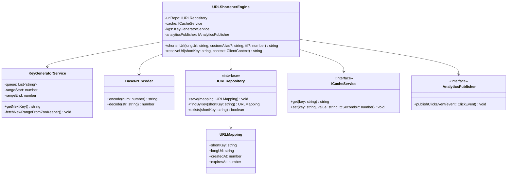
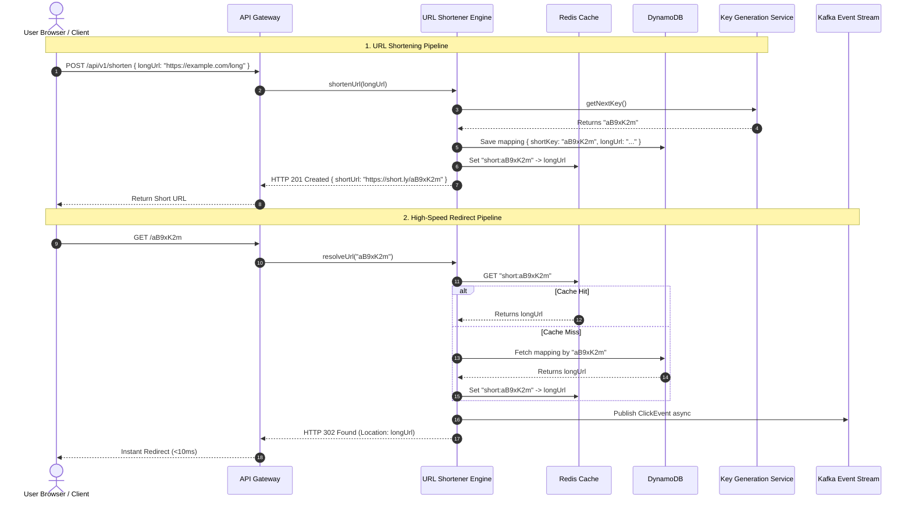
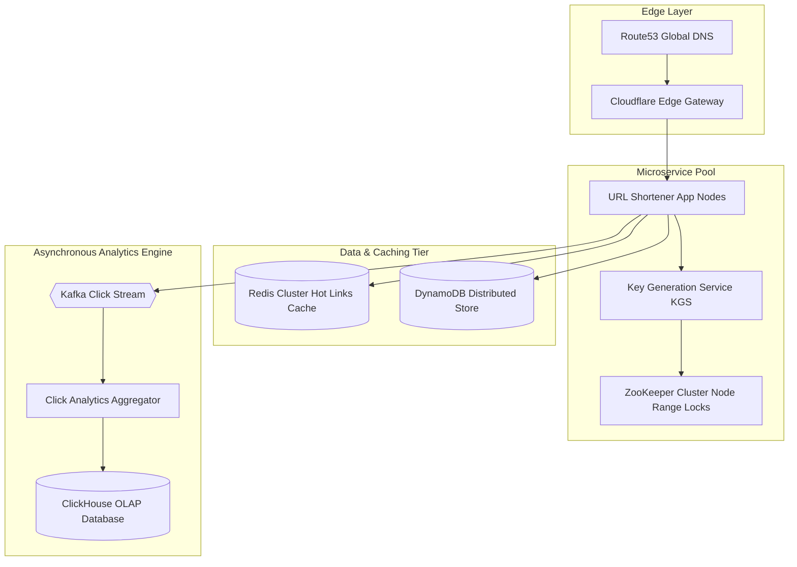

# 🛠️ Enterprise System Design Blueprint: Design URL Shortener

> **Target Role:** Principal / Staff Architect / Senior LLD & HLD Engineers  
> **Product Perspective:** High-throughput, low-latency URL shortening & redirection engine processing 10B+ redirects/month with sub-10ms response times.  
> **Navigation:** ⬅️ [Back to Developer Tools & Infrastructure Index](./README.md) | 📅 [8-Week Roadmap](../../ROADMAP.md)

---

## 1. 🎯 Requirements & Product Scope

### 📋 Functional Requirements (FR)

1. **Shorten URL:** Convert long HTTP/HTTPS URLs into unique, minimal Base62 encoded short links (e.g., `https://short.ly/aB9xK2m`).
2. **URL Redirection:** Accessing a short URL immediately redirects the client to the original long URL with minimal latency (HTTP 301 or HTTP 302).
3. **Custom Aliases:** Allow users to request custom short aliases (e.g., `https://short.ly/tech-talk-2026`).
4. **Expiration & TTL:** Support optional Time-To-Live (TTL) expiration timestamps for generated short links.
5. **Real-time Click Analytics:** Track click count, timestamp, user agent, referrer, and rough geographical location asynchronously without blocking redirects.

### ⚡ Non-Functional Requirements (NFR)

1. **Ultra-Low Latency:** Redirection lookup latency $P_{99} < 10\text{ms}$.
2. **High Availability:** $99.999\%$ uptime (5.26 minutes max downtime per year) across multi-region deployments.
3. **Collision Resistance:** $100\%$ uniqueness guarantee for short keys without runtime lock contention.
4. **Read-Heavy Scale:** Optimized for a 100:1 read-to-write ratio (10 Billion reads vs 100 Million writes per month).
5. **Security & Abuse Prevention:** Anti-spam link scanning, malware domain blocking, and rate-limiting long URL submissions.

---

## 2. 🧮 Scale & Quantitative Estimates

```
System Throughput Metrics:
- Read / Write Ratio: 100:1
- New URLs Created / Month: 100 Million
- Write QPS: 100M / (30 days * 86,400s) = ~38.5 writes/sec (Peak Write QPS = ~100 writes/sec)
- Redirect Reads / Month: 10 Billion
- Read QPS: 10B / (30 days * 86,400s) = ~3,858 reads/sec (Peak Read QPS = ~10,000 reads/sec)

Capacity & Storage Estimates (5-Year Horizon):
- Base62 Characters: [0-9, a-z, A-Z] (62 possible characters)
- Short Key Length: 7 characters -> 62^7 = 3.52 Trillion unique keys (eliminates collisions for centuries)
- Average Payload Size per Mapping: 
  - short_key (7 B) + long_url (500 B) + user_id (16 B) + created_at (8 B) + expires_at (8 B) = ~540 Bytes
- Storage per Year: 100M * 12 * 540 Bytes = ~64.8 GB / year
- 5-Year Storage Total: 64.8 GB * 5 = ~324 GB (Easily fits in managed NoSQL cluster like DynamoDB / Cassandra)

Memory & Caching Estimates (Pareto 80/20 Rule):
- Daily Redirects: 10B / 30 = 333 Million redirects/day
- Hot URLs (20%): 66.6 Million URLs
- RAM for Redis Cache: 66.6M * 540 Bytes = ~36 GB RAM (2-node Redis cluster)
```

---

## 3. 🛠️ Tech Stack & Architectural Justifications

| Component | Technology Choice | Architectural Rationale |
| :--- | :--- | :--- |
| **API Gateway** | Envoy / Nginx | Multi-region SSL termination, rate limiting, and geo-proximity routing. |
| **Microservice Runtime** | Node.js / TypeScript | Event-loop non-blocking I/O ideal for high-throughput read redirects. |
| **Key Generation Service (KGS)** | Dedicated In-Memory Service + ZooKeeper | Pre-allocates range keys (e.g., node 1 takes `0-1M`, node 2 takes `1M-2M`) to guarantee $O(1)$ key generation without DB locking. |
| **Primary Data Store** | DynamoDB / Apache Cassandra | Distributed Key-Value store partitioned by `short_key` for sub-5ms lookup latency. |
| **Caching Layer** | Redis Cluster (LRU Eviction) | Caching top 20% hot links to eliminate database read load during viral traffic events. |
| **Analytics Stream** | Apache Kafka + ClickHouse | Asynchronous event streaming to prevent click logging from adding latency to HTTP redirect responses. |

---

## 4. 📐 Visual UML Diagrams

### 🏗️ Class Diagram (Low-Level Core Entities & Interfaces)



### 🔄 Sequence Diagram: Shortening & Redirect Flows



### 🧩 Component & System Architecture Diagram (HLD)



---

## 5. 🧱 OOP & SOLID Principles Mapping

- **Single Responsibility Principle (SRP):** `KeyGeneratorService` solely handles unique key allocation; `Base62Encoder` converts integers to Base62 representation; `URLShortenerEngine` coordinates workflow.
- **Open/Closed Principle (OCP):** `EncodingStrategy` interface allows introducing dynamic hash encoding (e.g. SHA-256 truncated) without modifying core engine logic.
- **Liskov Substitution Principle (LSP):** `RedisCacheService` and `InMemoryCacheService` can be swapped interchangeably in the engine without altering redirect guarantees.
- **Interface Segregation Principle (ISP):** Read-only clients depend strictly on `IURLResolver` interface, preventing exposure to administrative write operations.
- **Dependency Inversion Principle (DIP):** `URLShortenerEngine` depends on `IURLRepository` abstraction rather than concrete DynamoDB or Cassandra drivers.

---

## 6. 🎨 Design Patterns Selection

1. **Strategy Pattern:** `EncodingStrategy` interface allows toggling between Base62 range encoding, MD5 truncated hash encoding, and custom alias validation strategies.
2. **Singleton Pattern:** `KeyGeneratorClusterManager` guarantees a single thread-safe instance managing local in-memory key buffer blocks per application container.
3. **Observer / Publisher-Subscriber Pattern:** Asynchronous analytics tracking dispatches redirect events to Kafka without blocking client HTTP responses.
4. **Repository Pattern:** `URLRepository` decouples domain model persistence from physical NoSQL queries.

---

## 7. 💻 Production Code Blueprint (TypeScript)

```typescript
// Core Interfaces
export interface URLMapping {
  shortKey: string;
  longUrl: string;
  createdAt: number;
  expiresAt?: number;
}

export interface ClientContext {
  userAgent: string;
  ipAddress: string;
  referrer: string;
}

export interface IURLRepository {
  save(mapping: URLMapping): Promise<void>;
  findByKey(shortKey: string): Promise<URLMapping | null>;
  exists(shortKey: string): Promise<boolean>;
}

export interface ICacheService {
  get(key: string): Promise<string | null>;
  set(key: string, value: string, ttlSeconds?: number): Promise<void>;
}

export interface IAnalyticsPublisher {
  publishClickEvent(event: { shortKey: string; timestamp: number; context: ClientContext }): void;
}

// 1. Base62 Encoder Implementation
export class Base62Encoder {
  private static readonly CHARS = '0123456789abcdefghijklmnopqrstuvwxyzABCDEFGHIJKLMNOPQRSTUVWXYZ';
  private static readonly BASE = 62;

  public static encode(num: number): string {
    if (num === 0) return Base62Encoder.CHARS[0];
    let result = '';
    let current = num;
    while (current > 0) {
      result = Base62Encoder.CHARS[current % Base62Encoder.BASE] + result;
      current = Math.floor(current / Base62Encoder.BASE);
    }
    return result.padStart(7, '0');
  }
}

// 2. Key Generation Service (Pre-Allocated Memory Range Buffer)
export class KeyGeneratorService {
  private keyBuffer: string[] = [];
  private currentCounter: number;
  private maxCounter: number;

  constructor(rangeStart: number, rangeEnd: number) {
    this.currentCounter = rangeStart;
    this.maxCounter = rangeEnd;
    this.refillBuffer();
  }

  private refillBuffer(): void {
    const batchSize = Math.min(1000, this.maxCounter - this.currentCounter);
    for (let i = 0; i < batchSize; i++) {
      this.keyBuffer.push(Base62Encoder.encode(this.currentCounter++));
    }
  }

  public getNextKey(): string {
    if (this.keyBuffer.length === 0) {
      if (this.currentCounter >= this.maxCounter) {
        throw new Error('KGS Key range exhausted for node!');
      }
      this.refillBuffer();
    }
    return this.keyBuffer.shift()!;
  }
}

// 3. Core Engine Implementation
export class URLShortenerEngine {
  constructor(
    private repository: IURLRepository,
    private cache: ICacheService,
    private kgs: KeyGeneratorService,
    private analytics: IAnalyticsPublisher
  ) {}

  public async shortenUrl(longUrl: string, customAlias?: string, ttlSeconds?: number): Promise<string> {
    let shortKey: string;

    if (customAlias) {
      const exists = await this.repository.exists(customAlias);
      if (exists) throw new Error(`Custom alias '${customAlias}' is already in use.`);
      shortKey = customAlias;
    } else {
      shortKey = this.kgs.getNextKey();
    }

    const mapping: URLMapping = {
      shortKey,
      longUrl,
      createdAt: Date.now(),
      expiresAt: ttlSeconds ? Date.now() + ttlSeconds * 1000 : undefined,
    };

    await this.repository.save(mapping);
    await this.cache.set(`short:${shortKey}`, longUrl, ttlSeconds);

    return shortKey;
  }

  public async resolveUrl(shortKey: string, context: ClientContext): Promise<string> {
    // 1. Check Redis Cache
    let longUrl = await this.cache.get(`short:${shortKey}`);

    if (!longUrl) {
      // 2. Cache miss -> Database lookup
      const mapping = await this.repository.findByKey(shortKey);
      if (!mapping) throw new Error('Short URL not found');

      if (mapping.expiresAt && Date.now() > mapping.expiresAt) {
        throw new Error('Short URL has expired');
      }

      longUrl = mapping.longUrl;
      await this.cache.set(`short:${shortKey}`, longUrl, 86400); // 24h cache TTL
    }

    // 3. Asynchronous Analytics Dispatch
    this.analytics.publishClickEvent({
      shortKey,
      timestamp: Date.now(),
      context,
    });

    return longUrl;
  }
}
```

---

## 8. 🔀 High-Level Design (HLD) & Scale Bottlenecks

- **HTTP 301 vs 302 Redirect Trade-Offs:**
  - *HTTP 301 (Moved Permanently):* Browser caches the target URL locally. Reduces backend server traffic to zero for repeat visits, but completely bypasses analytics tracking.
  - *HTTP 302 (Found / Temporary):* Every click reaches the API Gateway, ensuring $100\%$ accurate analytics capturing at the expense of higher read server QPS.
- **KGS Node Failure & ZooKeeper Recovery:** If a node crashes, unused keys pre-allocated to its memory buffer are discarded. Because Base62 supports $3.5$ Trillion keys, wasting $100,000$ keys on crash recovery has negligible impact.
- **Database Partitioning Strategy:** Partition DynamoDB by `short_key` partition key hash. This guarantees perfectly uniform key distribution across all storage nodes.

---

## 9. 🧠 Collapsed Senior/Staff Level Grill Q&A

<details>
<summary>❓ How do you handle cache stampedes when a short link for a viral news story expires?</summary>

**Answer:**  
Implement **Mutex Locking with Redis Single-Flight / Probabilistic Early Expiration (XFetch)**. When a hot key expires in Redis, only the first worker acquiring a lightweight lock (`SET key lock NX EX 5`) queries DynamoDB while other concurrent requests wait or temporarily serve stale data. Alternatively, set background worker revalidation tasks before absolute cache expiration occurs.

</details>

<details>
<summary>❓ What happens if a user submits a custom alias that collides with auto-generated KGS keys?</summary>

**Answer:**  
Custom aliases and auto-generated keys share the same namespace in the storage layer (`short_key` primary key). Custom aliases require an explicit synchronous existence check (`repository.exists(alias)`). If valid, it is written immediately. To prevent KGS overlap, pre-allocated KGS numerical ranges can be prefixed or isolated from custom user strings.

</details>

<details>
<summary>❓ How do you prevent malicious actors from using your URL shortener for phishing campaigns?</summary>

**Answer:**  
Integrate an asynchronous security pipeline. When a long URL is submitted, pass it through Google Safe Browsing API / VirusTotal webhooks via background worker queue. If flagged, update the URL status in database to `SUSPENDED` and replace redirect targets with a warning landing page.

</details>
