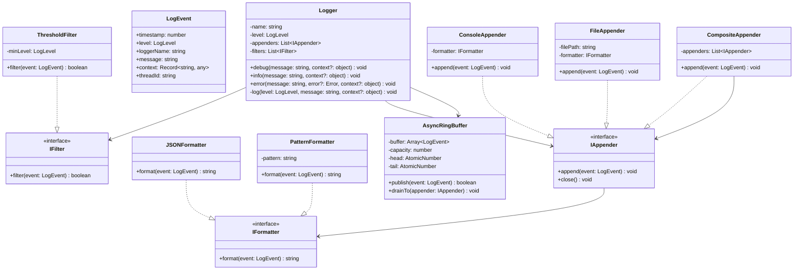
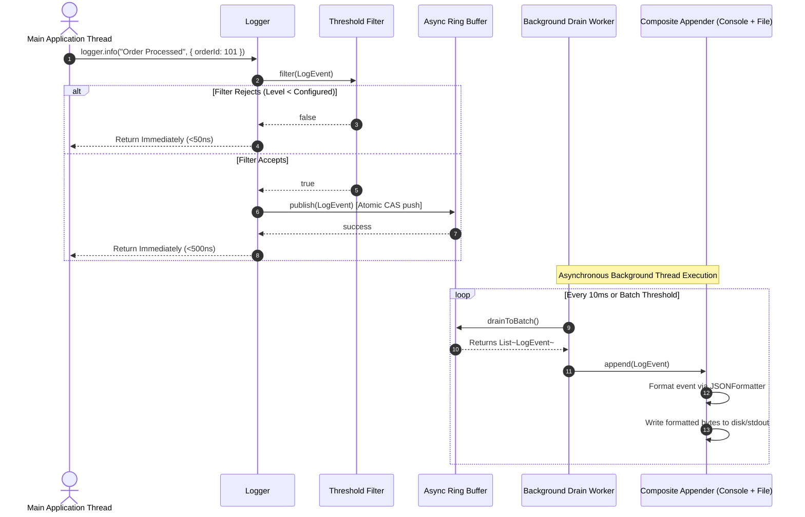
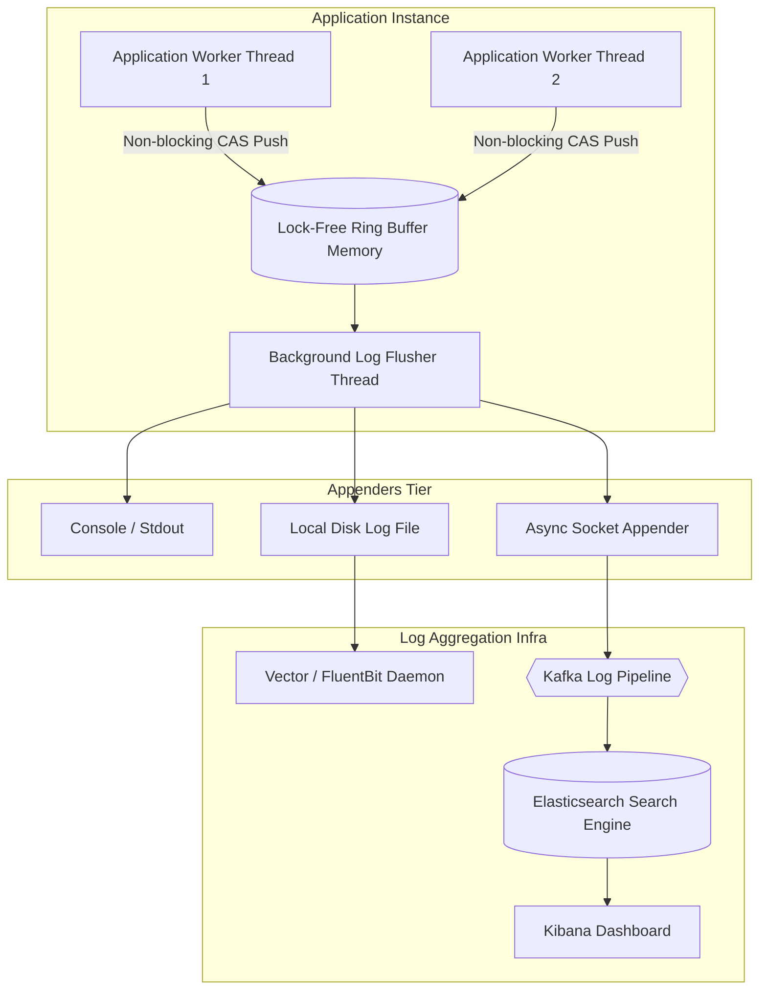

# 🛠️ Enterprise System Design Blueprint: Design Logging Framework

> **Target Role:** Principal / Staff Architect / Senior LLD & HLD Engineers  
> **Product Perspective:** Ultra-low latency, non-blocking, zero-lock logging engine capable of processing 100,000+ logs/sec per node with microsecond execution overhead.  
> **Navigation:** ⬅️ [Back to Developer Tools & Infrastructure Index](./README.md) | 📅 [8-Week Roadmap](../../ROADMAP.md)

---

## 1. 🎯 Requirements & Product Scope

### 📋 Functional Requirements (FR)

1. **Multi-Level Logging:** Support standard severity levels (`TRACE`, `DEBUG`, `INFO`, `WARN`, `ERROR`, `FATAL`) with dynamic runtime threshold filtering.
2. **Pluggable Output Appenders:** Route log events to multiple destinations (Console, File System, Async Socket, Database, Remote Aggregators like ELK/Datadog).
3. **Flexible Formatter Engine:** Transform structured log events into human-readable strings, JSON payloads, or custom XML/Structured log schemas.
4. **Contextual Diagnostic Metadata (MDC):** Support Mapped Diagnostic Context (e.g., `traceId`, `spanId`, `userId`, thread/worker info) across async execution contexts.
5. **Configurable Filtering Pipeline:** Filter events based on level thresholds, package prefixes, or custom regex matchers.

### ⚡ Non-Functional Requirements (NFR)

1. **Microsecond Latency:** Main application thread execution overhead $< 1\mu\text{s}$ per log statement.
2. **Non-Blocking Architecture:** Asynchronous, lock-free ring buffer (LMAX Disruptor pattern) preventing disk I/O or network bottlenecks from stalling app execution.
3. **High Throughput:** Handle $\ge 100,000$ log entries/sec per container node without thread contention.
4. **Thread Safety & In-Order Guarantee:** Thread-safe log appending while maintaining chronological sequence ordering per thread/worker.
5. **Graceful Shutdown & Resilience:** Flush pending memory buffer contents to disk upon application SIGTERM/SIGINT.

---

## 2. 🧮 Scale & Quantitative Estimates

```
Microsecond Latency Budget & Buffer Sizing:
- Target Logging Overhead: < 1 microsecond (1,000 ns) per logger call.
- Peak Log Rate: 100,000 log messages / sec per application instance.
- Average Log Payload: 256 Bytes (Timestamp + Level + Message + MDC Trace context).
- Bandwidth per Instance: 100,000 * 256 B = ~25.6 MB/sec log generation rate.

Ring Buffer Capacity:
- Ring Buffer Slots: 65,536 slots (2^16 power-of-two size for fast bitwise modulo operations).
- Buffer Memory Size: 65,536 * 256 B = ~16.7 MB RAM per process.
- Ring Buffer Drain Frequency: Dedicated background worker flushes buffer every 10ms or when batch size hits 1,000 logs.
```

---

## 3. 🛠️ Tech Stack & Architectural Justifications

| Component | Technology Choice | Architectural Rationale |
| :--- | :--- | :--- |
| **Concurrency Core** | Lock-free Ring Buffer (Disruptor) | Uses Atomic CAS (Compare-And-Swap) sequence barriers instead of mutex locks to achieve sub-microsecond non-blocking execution. |
| **I/O Engine** | Memory-Mapped Files (`mmap`) / Buffered Streams | Eliminates user-space to kernel-space context switching overhead during file writes. |
| **Formatting Engine** | Zero-Allocation JSON Serializer | Pre-allocates buffer byte arrays to avoid trigger Garbage Collection (GC) pauses under heavy log pressure. |
| **Context Propagation** | Async Local Storage / ThreadLocal (MDC) | Automatically carries trace identifiers (`traceId`, `spanId`) through async promise chains. |

---

## 4. 📐 Visual UML Diagrams

### 🏗️ Class Diagram (Low-Level Core Architecture)



### 🔄 Sequence Diagram: Non-Blocking Logging Flow



### 🧩 Component & System Architecture Diagram (HLD)



---

## 5. 🧱 OOP & SOLID Principles Mapping

- **Single Responsibility Principle (SRP):** `Logger` constructs events; `IFilter` validates events; `IFormatter` renders text; `IAppender` handles destination transport.
- **Open/Closed Principle (OCP):** New appenders (e.g. `SlackAlertAppender`, `DatadogAppender`) are added via `IAppender` interface without altering core logging code.
- **Liskov Substitution Principle (LSP):** `FileAppender` and `ConsoleAppender` can be substituted seamlessly anywhere an `IAppender` abstraction is expected.
- **Interface Segregation Principle (ISP):** Formatter interface `IFormatter` is kept compact with a single `format(event)` responsibility.
- **Dependency Inversion Principle (DIP):** High-level log invocation logic depends entirely on `IAppender` and `IFormatter` abstractions rather than hardcoded file I/O operations.

---

## 6. 🎨 Design Patterns Selection

1. **Chain of Responsibility Pattern:** Filter pipeline (`LevelFilter` -> `PackageFilter` -> `RegexFilter`) evaluates log event admissibility sequentially.
2. **Composite Pattern:** `CompositeAppender` encapsulates multiple downstream appenders (Console, File, Socket), treating a collection of targets as a single `IAppender`.
3. **Strategy Pattern:** `IFormatter` allows selecting formatting algorithms (`JSONFormatter` vs `PatternFormatter`) dynamically per appender.
4. **Singleton Pattern:** `LoggerFactory` provides centralized, thread-safe access to named logger instances.

---

## 7. 💻 Production Code Blueprint (TypeScript)

```typescript
export enum LogLevel {
  TRACE = 0,
  DEBUG = 1,
  INFO = 2,
  WARN = 3,
  ERROR = 4,
  FATAL = 5,
}

export interface LogEvent {
  timestamp: number;
  level: LogLevel;
  loggerName: string;
  message: string;
  context?: Record<string, any>;
  error?: Error;
}

// 1. Interfaces
export interface IFilter {
  filter(event: LogEvent): boolean;
}

export interface IFormatter {
  format(event: LogEvent): string;
}

export interface IAppender {
  append(event: LogEvent): void;
  close(): Promise<void>;
}

// 2. Formatters
export class JSONFormatter implements IFormatter {
  public format(event: LogEvent): string {
    return JSON.stringify({
      timestamp: new Date(event.timestamp).toISOString(),
      level: LogLevel[event.level],
      logger: event.loggerName,
      message: event.message,
      context: event.context || {},
      error: event.error ? { name: event.error.name, message: event.error.message, stack: event.error.stack } : undefined,
    });
  }
}

export class PatternFormatter implements IFormatter {
  constructor(private pattern: string = '[{timestamp}] [{level}] [{logger}]: {message}') {}

  public format(event: LogEvent): string {
    return this.pattern
      .replace('{timestamp}', new Date(event.timestamp).toISOString())
      .replace('{level}', LogLevel[event.level].padEnd(5))
      .replace('{logger}', event.loggerName)
      .replace('{message}', event.message);
  }
}

// 3. Appenders
export class ConsoleAppender implements IAppender {
  constructor(private formatter: IFormatter = new PatternFormatter()) {}

  public append(event: LogEvent): void {
    const formatted = this.formatter.format(event);
    if (event.level >= LogLevel.ERROR) {
      console.error(formatted);
    } else {
      console.log(formatted);
    }
  }

  public async close(): Promise<void> {}
}

export class CompositeAppender implements IAppender {
  private appenders: IAppender[] = [];

  public addAppender(appender: IAppender): void {
    this.appenders.push(appender);
  }

  public append(event: LogEvent): void {
    for (const appender of this.appenders) {
      appender.append(event);
    }
  }

  public async close(): Promise<void> {
    await Promise.all(this.appenders.map(a => a.close()));
  }
}

// 4. Lock-Free Async Ring Buffer Engine
export class AsyncRingBufferLogger {
  private buffer: LogEvent[];
  private capacity: number;
  private head: number = 0;
  private tail: number = 0;
  private isProcessing: boolean = false;

  constructor(
    private name: string,
    private levelThreshold: LogLevel,
    private appender: IAppender,
    capacityPowerOfTwo: number = 16 // 65536 slots
  ) {
    this.capacity = 1 << capacityPowerOfTwo;
    this.buffer = new Array<LogEvent>(this.capacity);
    this.startFlusher();
  }

  public log(level: LogLevel, message: string, context?: Record<string, any>, error?: Error): void {
    if (level < this.levelThreshold) return;

    const event: LogEvent = {
      timestamp: Date.now(),
      level,
      loggerName: this.name,
      message,
      context,
      error,
    };

    // Non-blocking push into Ring Buffer slot
    const nextTail = (this.tail + 1) & (this.capacity - 1);
    if (nextTail === this.head) {
      // Buffer Overflow Strategy: Fallback direct sync append or drop message
      console.warn(`[Logging Engine] Ring buffer full! Dropping log: ${message}`);
      return;
    }

    this.buffer[this.tail] = event;
    this.tail = nextTail;
  }

  private startFlusher(): void {
    setInterval(() => this.flush(), 10); // Flush every 10ms
  }

  public flush(): void {
    if (this.isProcessing) return;
    this.isProcessing = true;

    while (this.head !== this.tail) {
      const event = this.buffer[this.head];
      if (event) {
        this.appender.append(event);
      }
      this.head = (this.head + 1) & (this.capacity - 1);
    }

    this.isProcessing = false;
  }
}
```

---

## 8. 🔀 High-Level Design (HLD) & Scale Bottlenecks

- **Ring Buffer Overflow Policy:** When the ring buffer fills up under massive spike conditions:
  - *Drop Strategy:* Drop lowest priority (`DEBUG`/`TRACE`) messages to save main thread execution.
  - *Block Strategy:* Block main thread (causes application latency spike).
  - *Fallback File Strategy:* Write directly to an unbuffered fallback emergency log file.
- **MDC Context Leakage in Async Promise Pools:** In node.js/Go, async tasks pick up recycled threads. MDC values (`traceId`) must be cleared using `AsyncLocalStorage.run()` wrappers to prevent cross-request context leakage.
- **Garbage Collection (GC) Pressure:** Instantiating millions of `LogEvent` short-lived objects per second triggers frequent V8/JVM GC pauses. Use object pooling (`LogEvent` object pool) to reuse allocated instances.

---

## 9. 🧠 Collapsed Senior/Staff Level Grill Q&A

<details>
<summary>❓ How does the LMAX Disruptor Ring Buffer achieve non-blocking concurrency without mutex locks?</summary>

**Answer:**  
It relies on **Atomic CAS (Compare-And-Swap)** instructions operating on monotonically increasing sequence numbers, paired with power-of-two array capacities. Array index calculation uses lightning-fast bitwise AND (`sequence & (capacity - 1)`). Multiple producer threads update sequence numbers via atomic hardware operations without kernel mutex lock acquisition.

</details>

<details>
<summary>❓ How do you handle graceful shutdown so queued log entries are not lost on process kill?</summary>

**Answer:**  
Register process signal handlers (`SIGTERM`, `SIGINT`). Upon receipt, stop accepting new incoming log statements, disable the interval timer, execute a final synchronous ring buffer `flush()`, and invoke `close()` on all appenders to flush underlying file descriptor operating system OS page caches.

</details>

<details>
<summary>❓ Why use memory-mapped files (`mmap`) for high-speed file appenders?</summary>

**Answer:**  
Standard `write()` syscalls copy log buffers from user space to kernel page cache. `mmap` maps a disk file directly into process virtual memory space. Log writes become simple memory assignments (`memcpy`), allowing OS page flusher threads to handle disk writes asynchronously without context switches.

</details>
