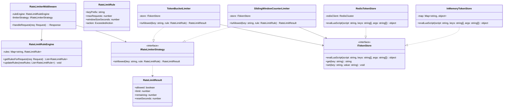
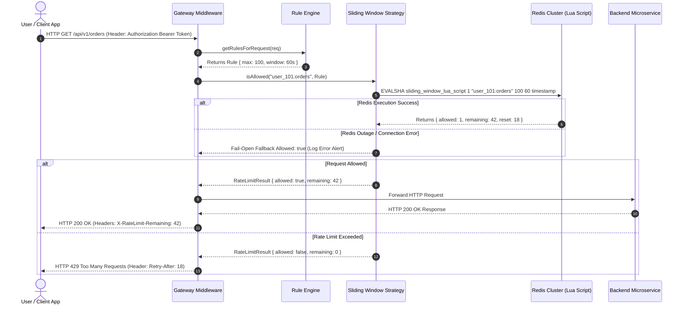
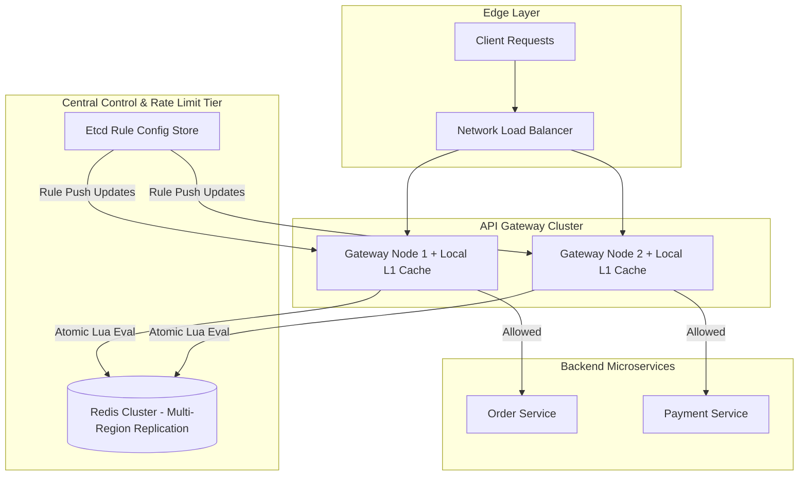

# 🛠️ Enterprise System Design Blueprint: Design Rate Limiter

> **Target Role:** Principal / Staff Architect / Senior LLD & HLD Engineers  
> **Product Perspective:** Distributed rate limiter processing 1,000,000+ requests/sec across multi-tier API Gateways with sub-millisecond execution overhead.  
> **Navigation:** ⬅️ [Back to Developer Tools & Infrastructure Index](./README.md) | 📅 [8-Week Roadmap](../../ROADMAP.md)

---

## 1. 🎯 Requirements & Product Scope

### 📋 Functional Requirements (FR)

1. **Multi-Key Rate Limiting:** Limit requests based on Client IP, Authenticated User ID, API Token, or Route Endpoint (`GET /api/v1/checkout`).
2. **Multiple Algorithm Strategies:** Support Token Bucket, Leaky Bucket, Fixed Window Counter, Sliding Window Log, and Sliding Window Counter algorithms.
3. **Standard Rate Limit HTTP Headers:** Return standard response headers (`X-RateLimit-Limit`, `X-RateLimit-Remaining`, `X-RateLimit-Reset`, `Retry-After`).
4. **Configurable Actions on Limit Exceeded:** Support HTTP 429 Too Many Requests, Drop Connection, Queue Request, or Soft Throttling.
5. **Multi-Tier Granularity:** Enforce nested rate limit rules simultaneously (e.g. Max 10 req/sec AND Max 1,000 req/hour).

### ⚡ Non-Functional Requirements (NFR)

1. **Sub-Millisecond Overhead:** Rate limiting evaluation latency $< 1\text{ms}$ ($P_{99} < 2\text{ms}$).
2. **Distributed Synchronization:** Synchronize rate limit state accurately across horizontal gateway instances without race conditions.
3. **High Availability & Fail-Open Resilience:** Gateway MUST fail-open (allow traffic) if distributed rate limiter cache (Redis) becomes completely unavailable.
4. **Memory Efficiency:** Minimal memory footprint per active user key ($< 64$ Bytes per client).
5. **Dynamic Rule Updates:** Support real-time configuration rule updates without restarting API Gateway instances.

---

## 2. 🧮 Scale & Quantitative Estimates

```
System Traffic & Memory Metrics:
- Global Traffic Volume: 1,000,000 Request / sec Peak
- Active Daily Unique Clients: 10 Million Users / IPs
- Evaluation Latency Budget: < 1 millisecond per request

Memory Footprint Calculation:
- Algorithm: Sliding Window Counter (Redis Hash)
- Redis Key: "rate:{user_id}:{endpoint}:{window_timestamp}" -> Size: ~48 Bytes
- Hash Fields: current_count (4 B) + previous_count (4 B) = ~56 Bytes total
- Total Redis RAM for 10M active keys: 10,000,000 * 64 Bytes = ~640 MB RAM
- Redis Cluster Bandwidth: 1,000,000 Ops/sec distributed across 10-node Redis Cluster (~100,000 ops/sec per Redis node using Pipeline/Lua).
```

---

## 3. 🛠️ Tech Stack & Architectural Justifications

| Component | Technology Choice | Architectural Rationale |
| :--- | :--- | :--- |
| **API Gateway Layer** | Envoy Proxy / Kong | High-performance C++/Lua proxy enforcing rate limit policy at the network edge. |
| **In-Memory Store** | Redis Cluster + Lua Scripts | Atomic, single-threaded execution of sliding window logic prevents race conditions without heavy distributed locks. |
| **Local L1 Cache** | Guava / Memory LRU Cache | In-memory local cache on Gateway nodes buffers local counters to reduce Redis network roundtrips for ultra-hot IPs. |
| **Rule Sync Service** | Etcd / Consul | Provides instant push-notifications to API Gateways when rate limit rules change. |

---

## 4. 📐 Visual UML Diagrams

### 🏗️ Class Diagram (Low-Level Core Entities)



### 🔄 Sequence Diagram: Distributed Evaluation with Lua Script



### 🧩 Component & System Architecture Diagram (HLD)



---

## 5. 🧱 OOP & SOLID Principles Mapping

- **Single Responsibility Principle (SRP):** `RateLimitRuleEngine` manages configuration rules; `IRateLimiterStrategy` evaluates mathematical windows; `ITokenStore` interacts with data storage.
- **Open/Closed Principle (OCP):** Implement new algorithms (`LeakyBucketStrategy`, `FixedWindowStrategy`) without modifying `RateLimiterMiddleware`.
- **Liskov Substitution Principle (LSP):** `RedisTokenStore` and `InMemoryTokenStore` can be swapped interchangeably without breaking middleware rate limiting behavior.
- **Interface Segregation Principle (ISP):** Client middleware depends strictly on `IRateLimiterStrategy` interface methods.
- **Dependency Inversion Principle (DIP):** Gateway middleware relies on abstract `IRateLimiterStrategy` rather than concrete Redis Lua classes.

---

## 6. 🎨 Design Patterns Selection

1. **Strategy Pattern:** `IRateLimiterStrategy` interface allows runtime selection of algorithms (`TokenBucketLimiter` vs `SlidingWindowCounterLimiter`).
2. **Chain of Responsibility Pattern:** Multi-tier rate limiting checks requests across nested handler layers (Global IP limit -> Tenant limit -> API Endpoint limit).
3. **Singleton Pattern:** Centralized `RateLimitRuleEngine` instance synchronizes rules from Etcd.
4. **Decorator Pattern:** `RateLimiterMiddleware` decorates standard HTTP handlers to inject rate limit checks seamlessly.

---

## 7. 💻 Production Code Blueprint (TypeScript)

```typescript
export interface RateLimitRule {
  keyPrefix: string;
  maxRequests: number;
  windowSizeSeconds: number;
}

export interface RateLimitResult {
  allowed: boolean;
  limit: number;
  remaining: number;
  resetSeconds: number;
}

export interface ITokenStore {
  evalSlidingWindow(key: string, limit: number, windowSec: number, nowMs: number): Promise<RateLimitResult>;
}

// 1. In-Memory Token Store with Sliding Window Counter Math
export class InMemoryTokenStore implements ITokenStore {
  private windows: Map<string, { currentWindow: number; prevCount: number; currentCount: number }> = new Map();

  public async evalSlidingWindow(key: string, limit: number, windowSec: number, nowMs: number): Promise<RateLimitResult> {
    const windowMs = windowSec * 1000;
    const currentWindowBucket = Math.floor(nowMs / windowMs);
    const windowOffset = (nowMs % windowMs) / windowMs;

    let entry = this.windows.get(key);
    if (!entry || entry.currentWindow !== currentWindowBucket) {
      const prevCount = entry && entry.currentWindow === currentWindowBucket - 1 ? entry.currentCount : 0;
      entry = { currentWindow: currentWindowBucket, prevCount, currentCount: 0 };
      this.windows.set(key, entry);
    }

    // Sliding Window Counter Formula:
    // estimated_requests = prev_count * (1 - window_offset) + current_count
    const estimatedCount = Math.floor(entry.prevCount * (1 - windowOffset) + entry.currentCount);

    if (estimatedCount >= limit) {
      return {
        allowed: false,
        limit,
        remaining: 0,
        resetSeconds: Math.ceil((windowMs - (nowMs % windowMs)) / 1000),
      };
    }

    entry.currentCount++;
    return {
      allowed: true,
      limit,
      remaining: limit - (estimatedCount + 1),
      resetSeconds: Math.ceil((windowMs - (nowMs % windowMs)) / 1000),
    };
  }
}

// 2. Sliding Window Strategy
export interface IRateLimiterStrategy {
  isAllowed(key: string, rule: RateLimitRule): Promise<RateLimitResult>;
}

export class SlidingWindowCounterStrategy implements IRateLimiterStrategy {
  constructor(private store: ITokenStore) {}

  public async isAllowed(key: string, rule: RateLimitRule): Promise<RateLimitResult> {
    const nowMs = Date.now();
    const fullKey = `${rule.keyPrefix}:${key}`;
    return this.store.evalSlidingWindow(fullKey, rule.maxRequests, rule.windowSizeSeconds, nowMs);
  }
}

// 3. Multi-Tier Rate Limiter Middleware Engine
export class RateLimiterEngine {
  constructor(
    private strategy: IRateLimiterStrategy,
    private failOpen: boolean = true
  ) {}

  public async evaluate(clientIdentifier: string, rules: RateLimitRule[]): Promise<RateLimitResult> {
    try {
      for (const rule of rules) {
        const result = await this.strategy.isAllowed(clientIdentifier, rule);
        if (!result.allowed) {
          return result; // Immediately reject on first rule violation
        }
      }
      return { allowed: true, limit: rules[0].maxRequests, remaining: 1, resetSeconds: 0 };
    } catch (error) {
      console.error('[RateLimiterEngine] Storage error during evaluation:', error);
      if (this.failOpen) {
        // High-Availability Fallback: Allow request on cache outage
        return { allowed: true, limit: 0, remaining: 0, resetSeconds: 0 };
      }
      throw error;
    }
  }
}
```

---

## 8. 🔀 High-Level Design (HLD) & Scale Bottlenecks

- **Race Conditions in Distributed Environments:** Multiple concurrent API Gateways accessing Redis can cause read-modify-write race conditions.
  - *Solution:* Encapsulate the calculation inside an **Atomic Redis Lua Script**. Redis executes Lua scripts as a single atomic unit, blocking other commands until completion.
- **Fail-Open vs Fail-Closed Policy:**
  - *Fail-Open:* If Redis cluster fails, allow requests through. Prevents complete API outage for payment/checkout services.
  - *Fail-Closed:* If Redis fails, block requests. Used for high-security endpoints (e.g. login brute-force protection).
- **Memory Optimization: Sliding Window Log vs Counter:**
  - *Sliding Window Log:* Stores raw timestamp set (`ZADD`). High memory ($O(N)$ requests), accurate.
  - *Sliding Window Counter:* Stores 2 static integer counters (previous and current window). Low memory ($O(1)$ space), $99.7\%$ accuracy. Preferred for production scale.

---

## 9. 🧠 Collapsed Senior/Staff Level Grill Q&A

<details>
<summary>%❓ Why is Sliding Window Counter preferred over Fixed Window Counter in enterprise gateways?</summary>

**Answer:**  
Fixed Window Counter suffers from **Boundary Spike Bursting**. If a limit is 100 req/min, a client can send 100 requests at 00:59 and another 100 requests at 01:01, resulting in 200 requests within a 2-second window. Sliding Window Counter computes a weighted average of the previous window, effectively smoothing out boundary traffic spikes.

</details>

<details>
<summary>❓ How do you synchronize rate limits across multi-region data centers without cross-region latency?</summary>

**Answer:**  
Use **Local Rate Limiting with Batch Token Sync**. Each regional API Gateway maintains a local Token Bucket. A background process asynchronously requests bulk tokens (e.g. 1,000 tokens) from the central Redis store every 500ms. If a region loses cross-region connectivity, it falls back to operating independently on its local quota allocation.

</details>

<details>
<summary>❓ What Lua script optimization prevents Redis CPU saturation under 1M QPS?</summary>

**Answer:**  
Use `EVALSHA` instead of `EVAL` to avoid sending the full Lua script string over the network on every request. Pre-load the script SHA1 digest into Redis memory using `SCRIPT LOAD`. Additionally, partition Redis keys using `{user_id}` Hash Tags to ensure requests for a single user land on the same Redis cluster shard.

</details>
