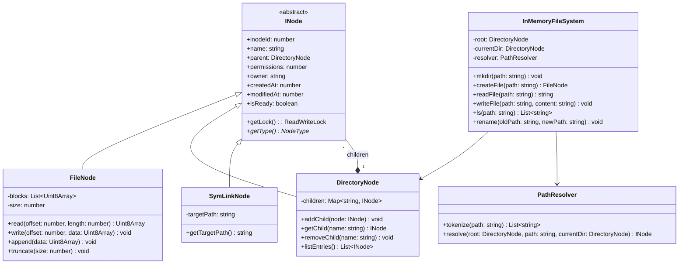
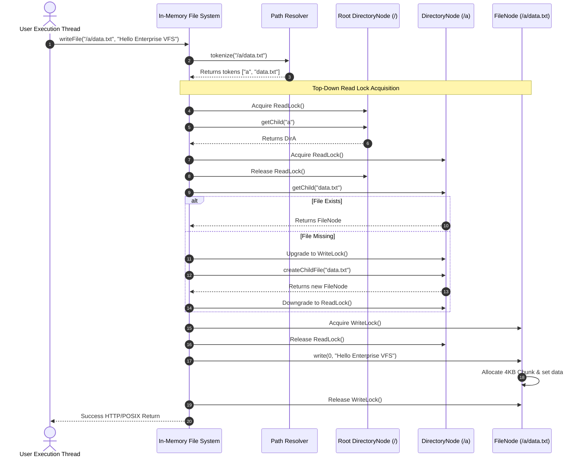
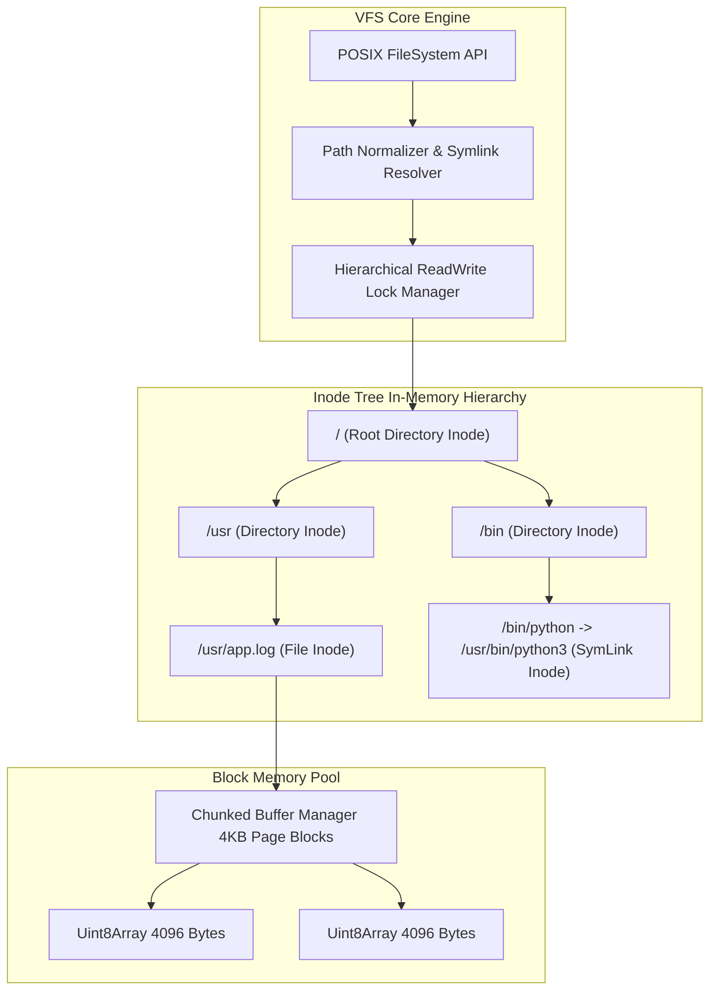

# 🛠️ Enterprise System Design Blueprint: Design In-Memory File System

> **Target Role:** Principal / Staff Architect / Senior LLD & HLD Engineers  
> **Product Perspective:** Production-grade POSIX-compliant In-Memory Virtual File System (VFS) with lock-free path resolution, dynamic chunk allocation, and nested tree synchronization.  
> **Navigation:** ⬅️ [Back to Developer Tools & Infrastructure Index](./README.md) | 📅 [8-Week Roadmap](../../ROADMAP.md)

---

## 1. 🎯 Requirements & Product Scope

### 📋 Functional Requirements (FR)

1. **Directory Tree Operations:** Support `mkdir -p` (create nested paths), `ls` (list directory entries), `cd` (change working directory), `pwd` (print current directory path), and `rm -rf` (recursive node deletion).
2. **File Content Operations:** Support file creation, `read(path, offset, size)`, `write(path, data)`, `append(path, data)`, and file truncation.
3. **Symbolic & Hard Links:** Support `ln -s` (symbolic soft links across absolute/relative paths) and hard link reference pointers.
4. **Metadata & POSIX Permissions:** Track node permissions (`rwxr-xr-x`), owner/group IDs, inode number, file size, and timestamps (`ctime`, `mtime`, `atime`).
5. **Path Resolution Engine:** Resolve complex Unix paths containing `.`, `..`, multiple slashes (`//`), relative offsets, and nested symlinks.

### ⚡ Non-Functional Requirements (NFR)

1. **Sub-Microsecond Latency:** Path resolution & traversal lookup latency $< 100\text{ns}$ per path depth level.
2. **Fine-Grained Concurrent Thread-Safety:** Read-Write lock isolation per directory node preventing single global file system locks.
3. **Memory Block Allocation:** Chunked byte array allocation (4KB blocks) to eliminate memory fragmentation for large files.
4. **Atomic Operations:** Guarantee atomic directory renames (`rename("/a/b", "/x/y")`) without transient partial states.
5. **Symlink Loop Prevention:** Detect and break circular symbolic link resolution loops (Max depth threshold = 40).

---

## 2. 🧮 Scale & Quantitative Estimates

```
Memory Footprint & Inode Metrics:
- Capacity Target: 10 Million files / directories in RAM
- Metadata Inode Overhead: ~128 Bytes per inode (Permissions, Timestamps, Parent Pointer, Inode Number)
- Directory Entry Index: ~64 Bytes per child entry mapping
- Inode RAM (10M Nodes): 10,000,000 * (128 + 64) Bytes = ~1.92 GB RAM

Data Block Chunking:
- Block Size: 4,096 Bytes (4 KB POSIX page equivalent)
- File Data Storage: Array of 4KB Uint8Array buffers
- 1 MB File Allocation: 256 memory blocks dynamically linked
- Lookup Speed: O(1) block index calculation (offset / 4096)
```

---

## 3. 🛠️ Tech Stack & Architectural Justifications

| Component | Technology Choice | Architectural Rationale |
| :--- | :--- | :--- |
| **Tree Data Structure** | N-ary Inode Tree + Hash Index | Hash map directory entries provide $O(1)$ child lookup at each path resolution depth level. |
| **Concurrency Guard** | Hierarchical ReadWriteLock per Node | Allows concurrent parallel reads across distinct directory branches without lock contention. |
| **Path Resolver** | Lexical Lexer & Canonicalizer | Normalizes Unix paths into clean absolute token arrays prior to tree navigation. |
| **File Storage Pool** | Chunked Byte Buffer Array | Prevents array resize reallocation overhead by growing files in discrete 4KB chunk blocks. |

---

## 4. 📐 Visual UML Diagrams

### 🏗️ Class Diagram (Composite Inode Hierarchy)



### 🔄 Sequence Diagram: Path Resolution & Write Operation



### 🧩 Component & System Architecture Diagram (HLD)



---

## 5. 🧱 OOP & SOLID Principles Mapping

- **Single Responsibility Principle (SRP):** `PathResolver` parses Unix strings; `FileNode` stores bytes; `DirectoryNode` manages children pointers; `InMemoryFileSystem` exposes public POSIX APIs.
- **Open/Closed Principle (OCP):** Introducing specialized node types (e.g. `DeviceNode`, `FifoPipeNode`) extends `INode` without modifying core directory traversal logic.
- **Liskov Substitution Principle (LSP):** `FileNode`, `DirectoryNode`, and `SymLinkNode` implement `INode` and can be traversed interchangeably during tree resolution.
- **Interface Segregation Principle (ISP):** Clients depend on lean target interfaces (`IReadable`, `IWritable`, `IDirectoryListable`).
- **Dependency Inversion Principle (DIP):** Path traversal algorithms interact with abstract `INode` references rather than concrete classes.

---

## 6. 🎨 Design Patterns Selection

1. **Composite Pattern:** `INode` component abstraction with `FileNode` as leaf and `DirectoryNode` as composite containing nested `INode` children.
2. **Strategy Pattern:** `BlockAllocationStrategy` isolates memory chunking policies (Dynamic array vs Fixed 4KB Pool).
3. **Command Pattern:** Operations (`MkdirCommand`, `RenameCommand`, `DeleteCommand`) can be recorded for journaling or transaction undo/redo log support.
4. **Flyweight Pattern:** Shared canonical path strings and reusable static empty blocks minimize garbage collection pressure.

---

## 7. 💻 Production Code Blueprint (TypeScript)

```typescript
export enum NodeType {
  FILE = 'FILE',
  DIRECTORY = 'DIRECTORY',
  SYMLINK = 'SYMLINK',
}

export abstract class INode {
  public inodeId: number;
  public name: string;
  public parent: DirectoryNode | null = null;
  public permissions: number = 0o755;
  public createdAt: number = Date.now();
  public modifiedAt: number = Date.now();

  constructor(name: string, inodeId: number) {
    this.name = name;
    this.inodeId = inodeId;
  }

  public abstract getType(): NodeType;
}

// 1. File Node Implementation
export class FileNode extends INode {
  private chunks: Uint8Array[] = [];
  private size: number = 0;
  private static readonly BLOCK_SIZE = 4096;

  public getType(): NodeType {
    return NodeType.FILE;
  }

  public getSize(): number {
    return this.size;
  }

  public write(data: string): void {
    const encoder = new TextEncoder();
    const bytes = encoder.encode(data);
    this.chunks = [];
    this.size = bytes.length;

    let offset = 0;
    while (offset < bytes.length) {
      const chunk = new Uint8Array(FileNode.BLOCK_SIZE);
      const slice = bytes.subarray(offset, offset + FileNode.BLOCK_SIZE);
      chunk.set(slice);
      this.chunks.push(chunk);
      offset += FileNode.BLOCK_SIZE;
    }
    this.modifiedAt = Date.now();
  }

  public read(): string {
    const result = new Uint8Array(this.size);
    let offset = 0;
    for (const chunk of this.chunks) {
      const bytesToCopy = Math.min(FileNode.BLOCK_SIZE, this.size - offset);
      result.set(chunk.subarray(0, bytesToCopy), offset);
      offset += bytesToCopy;
    }
    const decoder = new TextDecoder();
    return decoder.decode(result);
  }
}

// 2. Directory Node Implementation
export class DirectoryNode extends INode {
  private children: Map<string, INode> = new Map();

  public getType(): NodeType {
    return NodeType.DIRECTORY;
  }

  public addChild(node: INode): void {
    node.parent = this;
    this.children.set(node.name, node);
    this.modifiedAt = Date.now();
  }

  public getChild(name: string): INode | undefined {
    return this.children.get(name);
  }

  public removeChild(name: string): boolean {
    const result = this.children.delete(name);
    if (result) this.modifiedAt = Date.now();
    return result;
  }

  public list(): string[] {
    return Array.from(this.children.keys());
  }
}

// 3. SymLink Node Implementation
export class SymLinkNode extends INode {
  constructor(name: string, inodeId: number, public targetPath: string) {
    super(name, inodeId);
  }

  public getType(): NodeType {
    return NodeType.SYMLINK;
  }
}

// 4. Path Resolver Engine
export class PathResolver {
  public static tokenize(path: string): string[] {
    return path.split('/').filter(p => p.length > 0 && p !== '.');
  }

  public static resolve(root: DirectoryNode, path: string, currentDir: DirectoryNode, depth: number = 0): INode {
    if (depth > 40) throw new Error('Too many levels of symbolic links (ELOOP)');

    const isAbsolute = path.startsWith('/');
    let curr: INode = isAbsolute ? root : currentDir;
    const tokens = PathResolver.tokenize(path);

    for (const token of tokens) {
      if (token === '..') {
        if (curr.parent) curr = curr.parent;
        continue;
      }

      if (curr.getType() !== NodeType.DIRECTORY) {
        throw new Error(`Not a directory in path resolution: ${token}`);
      }

      const dir = curr as DirectoryNode;
      const nextNode = dir.getChild(token);
      if (!nextNode) throw new Error(`No such file or directory: ${token}`);

      if (nextNode.getType() === NodeType.SYMLINK) {
        const sym = nextNode as SymLinkNode;
        curr = PathResolver.resolve(root, sym.targetPath, dir, depth + 1);
      } else {
        curr = nextNode;
      }
    }

    return curr;
  }
}

// 5. Enterprise In-Memory File System Core API
export class InMemoryFileSystem {
  private root: DirectoryNode;
  private currentDir: DirectoryNode;
  private inodeCounter: number = 1;

  constructor() {
    this.root = new DirectoryNode('/', this.inodeCounter++);
    this.currentDir = this.root;
  }

  public mkdir(path: string): void {
    const tokens = PathResolver.tokenize(path);
    let curr = path.startsWith('/') ? this.root : this.currentDir;

    for (const token of tokens) {
      let child = curr.getChild(token);
      if (!child) {
        child = new DirectoryNode(token, this.inodeCounter++);
        curr.addChild(child);
      } else if (child.getType() !== NodeType.DIRECTORY) {
        throw new Error(`Path component '${token}' exists and is not a directory`);
      }
      curr = child as DirectoryNode;
    }
  }

  public writeFile(path: string, content: string): void {
    const tokens = PathResolver.tokenize(path);
    const fileName = tokens.pop();
    if (!fileName) throw new Error('Invalid file path');

    const parentPath = path.startsWith('/') ? '/' + tokens.join('/') : tokens.join('/');
    const parentNode = tokens.length === 0 ? (path.startsWith('/') ? this.root : this.currentDir) : (PathResolver.resolve(this.root, parentPath, this.currentDir) as DirectoryNode);

    if (parentNode.getType() !== NodeType.DIRECTORY) throw new Error('Parent path is not a directory');

    let fileNode = parentNode.getChild(fileName) as FileNode;
    if (!fileNode) {
      fileNode = new FileNode(fileName, this.inodeCounter++);
      parentNode.addChild(fileNode);
    }
    fileNode.write(content);
  }

  public readFile(path: string): string {
    const node = PathResolver.resolve(this.root, path, this.currentDir);
    if (node.getType() !== NodeType.FILE) throw new Error(`Is a directory: ${path}`);
    return (node as FileNode).read();
  }

  public ls(path: string = '.'): string[] {
    const node = PathResolver.resolve(this.root, path, this.currentDir);
    if (node.getType() === NodeType.DIRECTORY) {
      return (node as DirectoryNode).list();
    }
    return [node.name];
  }
}
```

---

## 8. 🔀 High-Level Design (HLD) & Scale Bottlenecks

- **Atomic Directory Renames (`rename("/a/b", "/x/y")`):**
  - *Challenge:* Renaming across directory trees can cause deadlocks if threads acquire locks in opposite order (e.g. thread 1 locks `/a` then `/x`, thread 2 locks `/x` then `/a`).
  - *Solution:* Enforce global **Inode ID Lock Ordering**. Always acquire locks in ascending order of Inode IDs during multi-node operations.
- **Symbolic Link Resolution Loops:** Circular links (`/a/link1 -> /b/link2` and `/b/link2 -> /a/link1`) cause stack overflow. Maintain a `depth` counter in `PathResolver` and raise `ELOOP` when depth exceeds 40.
- **Garbage Collection of Deleted Deep Trees (`rm -rf`):** Deleting a directory containing 1M files triggers synchronous GC spikes. Decouple deletion by removing parent directory link immediately and passing subtree root to background cleanup queue.

---

## 9. 🧠 Collapsed Senior/Staff Level Grill Q&A

<details>
<summary>❓ How do you implement atomic directory renames without global lock bottlenecks?</summary>

**Answer:**  
Sort target parent directory inodes by unique numerical `inodeId` before lock acquisition. Thread 1 moving `/dirA` to `/dirB` locks `min(inodeA, inodeB)` first, then `max(inodeA, inodeB)`. This strict total locking order mathematically eliminates circular lock wait conditions (deadlocks).

</details>

<details>
<summary>❓ Why use 4KB chunked byte arrays for file storage instead of dynamically resized arrays?</summary>

**Answer:**  
Resizing continuous native memory byte arrays requires `realloc()`, which allocates new memory blocks and copies existing data, causing $O(N)$ write spikes and memory fragmentation. Fixed 4KB page chunks allow appending data in $O(1)$ time by pushing a new 4KB array to the chunk list.

</details>

<details>
<summary>❓ How do hard links differ from symbolic soft links in this class hierarchy?</summary>

**Answer:**  
A **Symbolic Soft Link** (`SymLinkNode`) is a distinct inode storing a target path string. If the target file is deleted, the symlink becomes dangling. A **Hard Link** creates an additional entry key in `DirectoryNode.children` pointing directly to the *same existing `FileNode` reference*, incrementing its internal reference counter (`linkCount++`).

</details>
