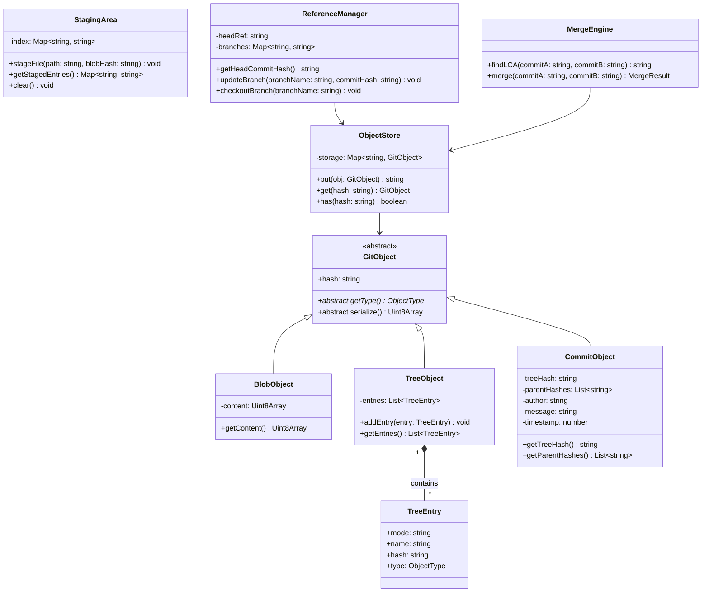
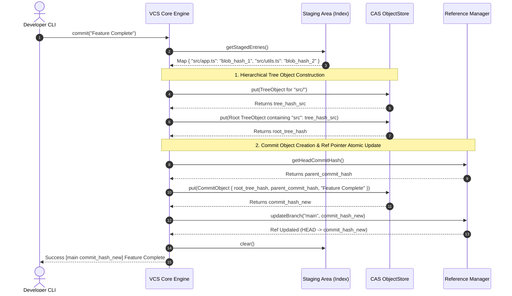
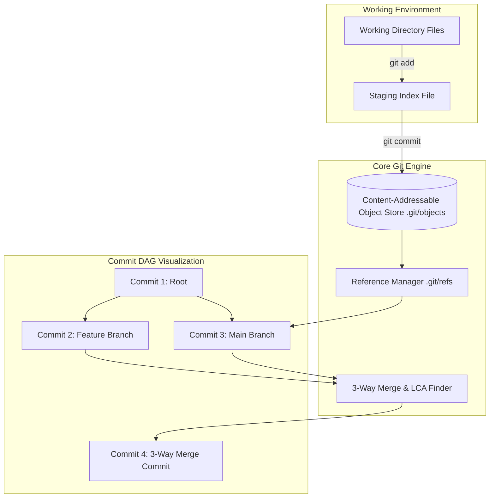

# 🛠️ Enterprise System Design Blueprint: Design Version Control System

> **Target Role:** Principal / Staff Architect / Senior LLD & HLD Engineers  
> **Product Perspective:** Production-grade Distributed Version Control System (VCS / Git Core Engine) with Content-Addressable Storage (CAS), DAG history graph, Myers diffing, and 3-way merge conflict resolution.  
> **Navigation:** ⬅️ [Back to Developer Tools & Infrastructure Index](./README.md) | 📅 [8-Week Roadmap](../../ROADMAP.md)

---

## 1. 🎯 Requirements & Product Scope

### 📋 Functional Requirements (FR)

1. **Content-Addressable Storage (CAS):** Hash file content & commit metadata using cryptographic hashes (SHA-256 / SHA-1) to produce immutable object IDs.
2. **Core Object Model:** Support 4 core primitives: `Blob` (raw file contents), `Tree` (directory entries mapping names to Blob/Tree SHA hashes), `Commit` (snapshot tree pointer + parent commit SHA list + author metadata + message), and `Tag` (annotated ref pointer).
3. **Repository Lifecycle:** Operations for `init`, `add` (stage modified files to index), `commit` (snapshot staged tree), `status`, and `log` (traverse commit DAG back to root).
4. **Branching & HEAD Pointers:** Manage branch references (`refs/heads/main`) and `HEAD` state switching via `checkout`.
5. **Diffing & 3-Way Merging:** Perform 3-way automatic merging using Lowest Common Ancestor (LCA) detection and Myers line-by-line diffing, flagging manual merge conflicts when changes overlap.

### ⚡ Non-Functional Requirements (NFR)

1. **Immutability & Integrity:** Data written to CAS is append-only and cryptographically verified against hash corruption.
2. **Deduplication:** Identical file contents across multiple folders, branches, or commits share a single `Blob` object in storage.
3. **High Diff & Merge Performance:** Fast LCA calculation over thousands of commits in DAG graph.
4. **Atomic Reference Updates:** Updating branch pointers (`refs/heads/main`) MUST be atomic (lock/rename ref file).
5. **Space Efficiency:** Compressed storage using zlib byte compression and packfile delta compression for historical commits.

---

## 2. 🧮 Scale & Quantitative Estimates

```
Repository Scale & Content-Addressable Space:
- Target Repo Capacity: 500,000 files across 50,000 commits
- Cryptographic Space: SHA-256 (2^256 unique hashes) -> Zero probability of hash collision
- Content Deduplication Rate: Typical enterprise repos exhibit ~60-80% file content duplication across commits/branches
- Object Store Footprint: 
  - 50,000 commits * 10 changed files / commit = 500,000 raw objects
  - Average Blob size: 10 KB -> Raw store size = 5 GB
  - Delta Packfile Compression (zlib): Reduces 5 GB object store to ~600 MB on disk
```

---

## 3. 🛠️ Tech Stack & Architectural Justifications

| Component | Technology Choice | Architectural Rationale |
| :--- | :--- | :--- |
| **Storage Architecture** | Content-Addressable Storage (CAS) | Keying objects by cryptographic hash guarantees data integrity and automatic deduplication. |
| **Commit Graph Data Model** | Directed Acyclic Graph (DAG) | Enables lightweight branching, fast ancestor traversal, and graph-based 3-way LCA merge lookups. |
| **Diffing Engine** | Myers Diff Algorithm | Standard $O(ND)$ greedy algorithm producing minimal edit scripts (insertions/deletions). |
| **Reference Manager** | Atomic File Locks / Symrefs | Safe mutation of branch tips and `HEAD` pointers during concurrent checkouts or pushes. |

---

## 4. 📐 Visual UML Diagrams

### 🏗️ Class Diagram (Git Core Object Model & Systems)



### 🔄 Sequence Diagram: Commit Pipeline Execution



### 🧩 Component & System Architecture Diagram (HLD)



---

## 5. 🧱 OOP & SOLID Principles Mapping

- **Single Responsibility Principle (SRP):** `ObjectStore` manages object hashing & persistence; `StagingArea` handles indexed path mappings; `MergeEngine` computes graph LCA & diffs.
- **Open/Closed Principle (OCP):** Introducing new object types (e.g., `AnnotatedTagObject`, `SubmoduleObject`) extends `GitObject` without altering storage retrieval mechanics.
- **Liskov Substitution Principle (LSP):** `BlobObject`, `TreeObject`, and `CommitObject` fulfill the `GitObject` base class contract for serialization into CAS.
- **Interface Segregation Principle (ISP):** Read-only commands (`git log`, `git status`) depend on lightweight `IObjectReader` rather than full `IObjectWriter`.
- **Dependency Inversion Principle (DIP):** Merge algorithms depend on `IObjectStore` interface rather than directly reading raw disk storage byte structures.

---

## 6. 🎨 Design Patterns Selection

1. **Composite Pattern:** `TreeObject` is a composite structure containing `TreeEntry` items pointing either to `BlobObject` leaves or nested `TreeObject` directories.
2. **Command Pattern:** Git CLI commands (`AddCommand`, `CommitCommand`, `MergeCommand`, `CheckoutCommand`) encapsulate operations with undo/rollback support.
3. **Strategy Pattern:** `MergeStrategy` interface allows selecting between `FastForwardMerge`, `ThreeWayMerge`, and `Ours/TheirsMerge`.
4. **Flyweight Pattern:** Identical file contents across different commits reuse immutable `BlobObject` instances in Content-Addressable Storage.

---

## 7. 💻 Production Code Blueprint (TypeScript)

```typescript
import { createHash } from 'crypto';

export enum ObjectType {
  BLOB = 'blob',
  TREE = 'tree',
  COMMIT = 'commit',
}

// 1. Abstract Base Git Object
export abstract class GitObject {
  public abstract getType(): ObjectType;
  public abstract serialize(): string;

  public computeHash(): string {
    const payload = `${this.getType()} ${this.serialize().length}\0${this.serialize()}`;
    return createHash('sha256').update(payload).digest('hex');
  }
}

// 2. Blob Object
export class BlobObject extends GitObject {
  constructor(private content: string) {
    super();
  }

  public getType(): ObjectType {
    return ObjectType.BLOB;
  }

  public serialize(): string {
    return this.content;
  }

  public getContent(): string {
    return this.content;
  }
}

// 3. Tree Entry & Tree Object
export interface TreeEntry {
  mode: string;
  name: string;
  hash: string;
  type: ObjectType;
}

export class TreeObject extends GitObject {
  constructor(private entries: TreeEntry[] = []) {
    super();
  }

  public getType(): ObjectType {
    return ObjectType.TREE;
  }

  public addEntry(entry: TreeEntry): void {
    this.entries.push(entry);
    this.entries.sort((a, b) => a.name.localeCompare(b.name));
  }

  public serialize(): string {
    return this.entries.map(e => `${e.mode} ${e.type} ${e.hash}\t${e.name}`).join('\n');
  }

  public getEntries(): TreeEntry[] {
    return this.entries;
  }
}

// 4. Commit Object
export class CommitObject extends GitObject {
  constructor(
    private treeHash: string,
    private parentHashes: string[],
    private author: string,
    private message: string,
    private timestamp: number = Date.now()
  ) {
    super();
  }

  public getType(): ObjectType {
    return ObjectType.COMMIT;
  }

  public serialize(): string {
    return [
      `tree ${this.treeHash}`,
      ...this.parentHashes.map(p => `parent ${p}`),
      `author ${this.author} ${this.timestamp}`,
      ``,
      this.message,
    ].join('\n');
  }

  public getTreeHash(): string {
    return this.treeHash;
  }

  public getParentHashes(): string[] {
    return this.parentHashes;
  }

  public getMessage(): string {
    return this.message;
  }
}

// 5. Content-Addressable Storage (CAS)
export class ObjectStore {
  private objects: Map<string, GitObject> = new Map();

  public put(obj: GitObject): string {
    const hash = obj.computeHash();
    if (!this.objects.has(hash)) {
      this.objects.set(hash, obj);
    }
    return hash;
  }

  public get(hash: string): GitObject {
    const obj = this.objects.get(hash);
    if (!obj) throw new Error(`Git Object not found in CAS: ${hash}`);
    return obj;
  }
}

// 6. VCS Core Repository Engine
export class VCSRepositoryEngine {
  private objectStore = new ObjectStore();
  private stagingArea = new Map<string, string>(); // Path -> Blob Hash
  private branches = new Map<string, string>(); // Branch -> Commit Hash
  private currentBranch: string = 'main';

  constructor(private author: string = 'Architect <dev@enterprise.org>') {
    this.branches.set('main', '');
  }

  public add(filePath: string, content: string): void {
    const blob = new BlobObject(content);
    const blobHash = this.objectStore.put(blob);
    this.stagingArea.set(filePath, blobHash);
  }

  public commit(message: string): string {
    if (this.stagingArea.size === 0) throw new Error('Nothing staged to commit');

    // Build Root Tree
    const tree = new TreeObject();
    for (const [path, blobHash] of this.stagingArea.entries()) {
      tree.addEntry({
        mode: '100644',
        name: path,
        hash: blobHash,
        type: ObjectType.BLOB,
      });
    }

    const treeHash = this.objectStore.put(tree);
    const parentHash = this.branches.get(this.currentBranch) || '';
    const parentList = parentHash ? [parentHash] : [];

    const commitObj = new CommitObject(treeHash, parentList, this.author, message);
    const commitHash = this.objectStore.put(commitObj);

    // Update current branch reference
    this.branches.set(this.currentBranch, commitHash);
    this.stagingArea.clear();

    return commitHash;
  }

  public branch(branchName: string): void {
    const currentCommit = this.branches.get(this.currentBranch) || '';
    this.branches.set(branchName, currentCommit);
  }

  public log(): Array<{ hash: string; message: string }> {
    const history: Array<{ hash: string; message: string }> = [];
    let currHash = this.branches.get(this.currentBranch);

    while (currHash) {
      const commitObj = this.objectStore.get(currHash) as CommitObject;
      history.push({ hash: currHash, message: commitObj.getMessage() });
      const parents = commitObj.getParentHashes();
      currHash = parents.length > 0 ? parents[0] : undefined;
    }

    return history;
  }
}
```

---

## 8. 🔀 High-Level Design (HLD) & Scale Bottlenecks

- **Finding Lowest Common Ancestor (LCA) in Complex DAGs:**
  - *Challenge:* Criss-cross merges can result in multiple common ancestors.
  - *Solution:* Run Breadth-First Search (BFS) starting from commit A and commit B to collect ancestor sets. Find the common ancestor with the maximum graph depth (LCA).
- **Packfile Delta Compression (`git gc`):**
  - Storing thousands of individual loose files causes file descriptor exhaustion. Periodically combine objects into a single `.pack` file, compressing historical file versions using byte-level diff deltas relative to the latest version.
- **Handling Large Binary Files (Git LFS):**
  - Storing 100 MB binary files inside standard CAS inflates repository size exponentially. Git LFS replaces raw binary content in CAS with lightweight text pointer files, storing binary payloads on remote S3 storage pools.

---

## 9. 🧠 Collapsed Senior/Staff Level Grill Q&A

<details>
<summary>❓ How does Content-Addressable Storage guarantee automatic file deduplication?</summary>

**Answer:**  
Because an object's identifier is computed strictly as `SHA256(content)`, two identical files created by different developers in different directories will compute to the exact same hash string. The CAS `put()` method detects that the key already exists in the store and skips re-writing the payload byte array.

</details>

<details>
<summary>❓ How does a 3-Way Merge algorithm work when merging two branch tips?</summary>

**Answer:**  
1. Find the **Lowest Common Ancestor (LCA)** commit of Branch A and Branch B (the base snapshot).  
2. Perform line-by-line diffs: `Diff(Base -> Branch A)` and `Diff(Base -> Branch B)`.  
3. If a line is modified *only* in Branch A, accept Branch A's change. If modified *only* in Branch B, accept Branch B's change. If modified differently in *both* branches at the same offset, raise a **Merge Conflict**.

</details>

<details>
<summary>❓ What is the difference between `git rebase` and `git merge` at the DAG graph level?</summary>

**Answer:**  
`git merge` creates a new **Merge Commit** with *two parent commit pointers*, preserving the original non-linear branch history. `git rebase` rewrites history by replaying commits from the feature branch one-by-one on top of the target branch tip, generating brand-new commit hashes and creating a linear graph sequence.

</details>
