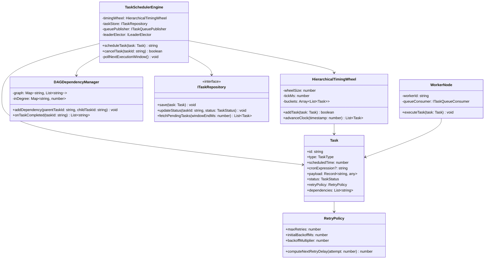
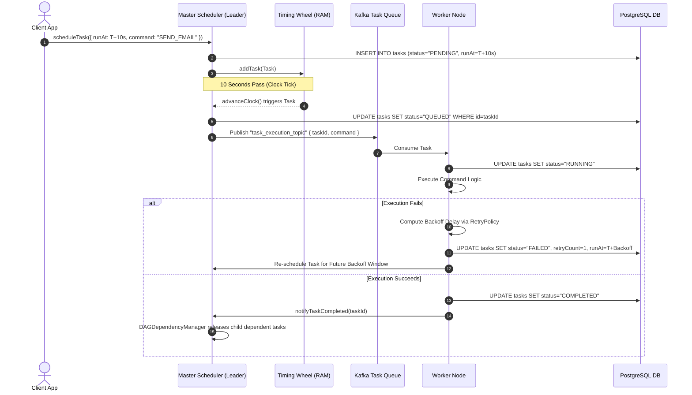
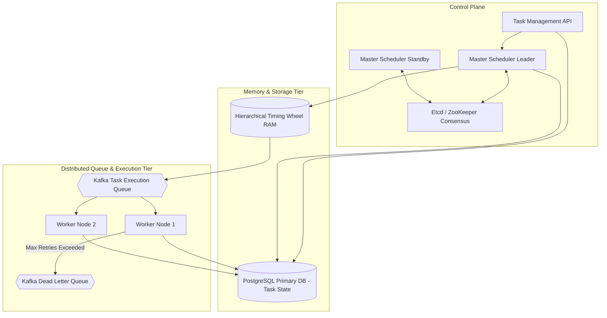

# 🛠️ Enterprise System Design Blueprint: Design Distributed Task Scheduler

> **Target Role:** Principal / Staff Architect / Senior LLD & HLD Engineers  
> **Product Perspective:** High-precision, fault-tolerant distributed task scheduling engine processing millions of scheduled tasks per day with sub-second accuracy and DAG dependency resolution.  
> **Navigation:** ⬅️ [Back to Developer Tools & Infrastructure Index](./README.md) | 📅 [8-Week Roadmap](../../ROADMAP.md)

---

## 1. 🎯 Requirements & Product Scope

### 📋 Functional Requirements (FR)

1. **Multi-Type Task Scheduling:** Support One-time delayed tasks (`runAt: T`), Recurring Cron tasks (`cron: "0 */5 * * *"`), and Instant high-priority tasks.
2. **DAG Dependency Resolution:** Support Directed Acyclic Graph (DAG) task chains where Task B and Task C run concurrently after Task A completes successfully.
3. **Execution Guarantees:** Ensure At-Least-Once execution with optional Exactly-Once processing using client-provided Idempotency Keys.
4. **Fault Recovery & Retry Policies:** Configurable retry policies with Exponential Backoff with Jitter, failing over to a Dead Letter Queue (DLQ) after max retries.
5. **State Tracking & Lifecycle Operations:** Expose task state query APIs (`PENDING`, `QUEUED`, `RUNNING`, `COMPLETED`, `FAILED`, `CANCELLED`) and cancellation control.

### ⚡ Non-Functional Requirements (NFR)

1. **Sub-Second Schedule Accuracy:** Trigger execution within $\pm 10\text{ms}$ of requested execution timestamp.
2. **High Scale Throughput:** Support 10,000,000 scheduled tasks per day with peak throughput $\ge 5,000$ executions/sec.
3. **Distributed Leader Election & Fault Tolerance:** Active-Passive Master Scheduler leader election (via ZooKeeper / Etcd) to prevent double-scheduling upon master node crash.
4. **No Double-Execution (Concurrency Guard):** Distributed lock or DB row lock (`SKIP LOCKED`) to ensure distinct workers do not pick the same task.
5. **Dynamic Worker Auto-Scaling:** Worker pool scales dynamically based on queue depth metrics.

---

## 2. 🧮 Scale & Quantitative Estimates

```
Throughput & Scale Metrics:
- Daily Tasks Scheduled: 10 Million tasks / day
- Average Execution Rate: 10M / 86,400s = ~115 tasks/sec
- Peak Trigger Volume: 5,000 tasks / sec (e.g. top of the hour Cron spikes)
- Target Execution Delay Accuracy: < 10 milliseconds

Memory & Storage Estimates (30-Day Persistence):
- Task Payload Size: ~1 KB per task (ID, Schedule, Command payload, Retry metadata)
- DB Storage per Day: 10M * 1 KB = ~10 GB / day
- 30-Day Total Storage: 10 GB * 30 = ~300 GB (PostgreSQL / DynamoDB)
- Active Memory Index (Timing Wheel / Min-Heap for upcoming 60s window):
  - 5,000 tasks/sec * 60 seconds = 300,000 active entries in RAM ~ 30 MB RAM
```

---

## 3. 🛠️ Tech Stack & Architectural Justifications

| Component | Technology Choice | Architectural Rationale |
| :--- | :--- | :--- |
| **Scheduler Core Data Structure** | Hierarchical Timing Wheel / Min-Heap | Hierarchical Timing Wheel provides $O(1)$ task insertion and expiration, replacing $O(\log N)$ heap pops under high concurrency. |
| **Persistence Store** | PostgreSQL (`FOR UPDATE SKIP LOCKED`) | Relational transactional safety allows multiple master schedulers to safely claim tasks without lock contention. |
| **Worker Queue Stream** | Apache Kafka / Redis Streams | High-throughput distributed message queue decoupling scheduler trigger loops from worker execution. |
| **Consensus & Coordination** | Etcd / Apache ZooKeeper | Distributed leader election for Master Schedulers and worker node cluster membership heartbeats. |

---

## 4. 📐 Visual UML Diagrams

### 🏗️ Class Diagram (Core Scheduler & Execution Infrastructure)



### 🔄 Sequence Diagram: Scheduling, Triggering & Retry Loop



### 🧩 Component & System Architecture Diagram (HLD)



---

## 5. 🧱 OOP & SOLID Principles Mapping

- **Single Responsibility Principle (SRP):** `HierarchicalTimingWheel` tracks timing buckets; `DAGDependencyManager` resolves task graph dependencies; `RetryPolicy` calculates backoff delays; `WorkerNode` executes business logic.
- **Open/Closed Principle (OCP):** Introducing new execution triggers (e.g. `EventDrivenTaskTrigger`, `CronTrigger`) extends `TaskTrigger` without modifying core timing wheel code.
- **Liskov Substitution Principle (LSP):** `OneTimeTask` and `CronTask` can be stored and processed interchangeably in the timing wheel.
- **Interface Segregation Principle (ISP):** Worker nodes access lean `ITaskExecutor` interface, avoiding administrative schedule management APIs.
- **Dependency Inversion Principle (DIP):** Scheduler engine depends on abstract `ITaskRepository` and `ITaskQueuePublisher` rather than concrete SQL/Kafka drivers.

---

## 6. 🎨 Design Patterns Selection

1. **PriorityQueue / Min-Heap & Timing Wheel Pattern:** Fast $O(1)$ temporal task lookup for upcoming execution windows.
2. **Command Pattern:** Encapsulates scheduled tasks as executable command objects holding complete execution contexts and payload data.
3. **State Pattern:** `TaskStatus` state machine (`PENDING` -> `QUEUED` -> `RUNNING` -> `COMPLETED` / `FAILED` -> `RETRYING` / `DLQ`).
4. **Observer Pattern:** DAG completion events trigger notification callbacks that automatically increment in-degree counters for child tasks.
5. **Singleton Pattern:** Active Master Scheduler leader instance coordinates cluster scheduling via ZooKeeper locks.

---

## 7. 💻 Production Code Blueprint (TypeScript)

```typescript
export enum TaskStatus {
  PENDING = 'PENDING',
  QUEUED = 'QUEUED',
  RUNNING = 'RUNNING',
  COMPLETED = 'COMPLETED',
  FAILED = 'FAILED',
  CANCELLED = 'CANCELLED',
}

export interface TaskPayload {
  command: string;
  args: Record<string, any>;
}

// 1. Exponential Backoff Retry Policy
export class RetryPolicy {
  constructor(
    public maxRetries: number = 3,
    public initialBackoffMs: number = 1000,
    public backoffMultiplier: number = 2
  ) {}

  public getNextRetryDelayMs(attempt: number): number {
    const delay = this.initialBackoffMs * Math.pow(this.backoffMultiplier, attempt - 1);
    const jitter = Math.random() * 200; // Jitter to prevent thundering herd
    return delay + jitter;
  }
}

// 2. Task Entity Model
export class Task {
  public retryCount: number = 0;
  public status: TaskStatus = TaskStatus.PENDING;

  constructor(
    public id: string,
    public scheduledTimeMs: number,
    public payload: TaskPayload,
    public retryPolicy: RetryPolicy = new RetryPolicy(),
    public dependencies: string[] = []
  ) {}
}

// 3. Hierarchical Timing Wheel (High-Speed O(1) Scheduling Engine)
export class HierarchicalTimingWheel {
  private buckets: Map<number, Task[]> = new Map();

  constructor(
    private tickMs: number = 1000, // 1 Second ticks
    private wheelSize: number = 60 // 60 Seconds wheel
  ) {}

  public addTask(task: Task): void {
    const bucketIndex = Math.floor(task.scheduledTimeMs / this.tickMs) % this.wheelSize;
    if (!this.buckets.has(bucketIndex)) {
      this.buckets.set(bucketIndex, []);
    }
    this.buckets.get(bucketIndex)!.push(task);
  }

  public advanceClock(currentTimestampMs: number): Task[] {
    const bucketIndex = Math.floor(currentTimestampMs / this.tickMs) % this.wheelSize;
    const tasks = this.buckets.get(bucketIndex) || [];
    this.buckets.delete(bucketIndex);

    // Return tasks due for execution
    return tasks.filter(t => t.scheduledTimeMs <= currentTimestampMs);
  }
}

// 4. DAG Dependency Manager
export class DAGDependencyManager {
  private inDegree: Map<string, number> = new Map();
  private childGraph: Map<string, string[]> = new Map();

  public addDependency(parentTaskId: string, childTaskId: string): void {
    if (!this.childGraph.has(parentTaskId)) {
      this.childGraph.set(parentTaskId, []);
    }
    this.childGraph.get(parentTaskId)!.push(childTaskId);
    this.inDegree.set(childTaskId, (this.inDegree.get(childTaskId) || 0) + 1);
  }

  public onTaskCompleted(completedTaskId: string): string[] {
    const readyChildren: string[] = [];
    const children = this.childGraph.get(completedTaskId) || [];

    for (const childId of children) {
      const currentInDegree = (this.inDegree.get(childId) || 1) - 1;
      this.inDegree.set(childId, currentInDegree);
      if (currentInDegree === 0) {
        readyChildren.push(childId);
      }
    }

    return readyChildren;
  }
}

// 5. Distributed Task Scheduler Engine Core
export class TaskSchedulerEngine {
  private timingWheel = new HierarchicalTimingWheel();
  private dagManager = new DAGDependencyManager();
  private taskStore = new Map<string, Task>();

  public scheduleTask(task: Task): void {
    this.taskStore.set(task.id, task);

    if (task.dependencies.length > 0) {
      for (const parentId of task.dependencies) {
        this.dagManager.addDependency(parentId, task.id);
      }
    } else {
      this.timingWheel.addTask(task);
    }
  }

  public tick(currentTimestampMs: number): Task[] {
    const dueTasks = this.timingWheel.advanceClock(currentTimestampMs);
    for (const task of dueTasks) {
      task.status = TaskStatus.QUEUED;
    }
    return dueTasks;
  }

  public handleTaskCompletion(taskId: string): Task[] {
    const task = this.taskStore.get(taskId);
    if (task) task.status = TaskStatus.COMPLETED;

    const readyChildIds = this.dagManager.onTaskCompleted(taskId);
    const readyTasks: Task[] = [];

    for (const childId of readyChildIds) {
      const childTask = this.taskStore.get(childId);
      if (childTask) {
        childTask.scheduledTimeMs = Date.now(); // Schedule immediately
        this.timingWheel.addTask(childTask);
        readyTasks.push(childTask);
      }
    }

    return readyTasks;
  }

  public handleTaskFailure(taskId: string): Task | null {
    const task = this.taskStore.get(taskId);
    if (!task) return null;

    task.retryCount++;
    if (task.retryCount <= task.retryPolicy.maxRetries) {
      const backoffMs = task.retryPolicy.getNextRetryDelayMs(task.retryCount);
      task.scheduledTimeMs = Date.now() + backoffMs;
      task.status = TaskStatus.PENDING;
      this.timingWheel.addTask(task);
      return task;
    } else {
      task.status = TaskStatus.FAILED;
      console.error(`[Scheduler] Task ${taskId} exceeded max retries. Sent to Dead Letter Queue (DLQ).`);
      return null;
    }
  }
}
```

---

## 8. 🔀 High-Level Design (HLD) & Scale Bottlenecks

- **Min-Heap vs Hierarchical Timing Wheel Comparison:**
  - *Min-Heap:* $O(\log N)$ insertion and deletion. Under millions of concurrent tasks, heap rebalancing creates severe lock contention.
  - *Hierarchical Timing Wheel:* $O(1)$ insertion and expiration by bucketing tasks into time slots (Seconds, Minutes, Hours wheels), reducing CPU overhead dramatically.
- **Master Node Failure Recovery:** Active-Passive Master Schedulers maintain Etcd heartbeats. If the active leader fails, standby nodes elect a new leader. The new leader scans PostgreSQL for tasks with `status IN ('PENDING', 'QUEUED')` and populates its local Timing Wheel.
- **Preventing Double Execution (Database Claim Locking):** Multiple worker instances consume messages from Kafka. To prevent concurrent processing of duplicate messages, workers perform an atomic claim query:  
  `UPDATE tasks SET status='RUNNING', worker_id=$1 WHERE id=$2 AND status='QUEUED'`

---

## 9. 🧠 Collapsed Senior/Staff Level Grill Q&A

<details>
<summary>❓ How does a Hierarchical Timing Wheel achieve O(1) task scheduling efficiency?</summary>

**Answer:**  
Instead of sorting all tasks in a global binary heap, a Timing Wheel uses a circular array of buckets representing time slots (e.g. 60 1-second buckets). Inserting a task calculates `slot = (execution_time / 1000) % 60` in $O(1)$ time. When the clock ticks to a slot, all tasks in that bucket are expired simultaneously in $O(1)$ pointer operations.

</details>

<details>
<summary>❓ How do you guarantee Exactly-Once task execution in a distributed network with retries?</summary>

**Answer:**  
Network retries guarantee At-Least-Once delivery. To achieve **Exactly-Once processing**, require each task payload to carry a unique client **Idempotency Key**. Workers wrap execution logic inside a database transaction that verifies and writes the idempotency key to an `executed_tasks` table. If the key exists, the worker skips re-execution and immediately returns the previous cached result.

</details>

<details>
<summary>❓ How do you handle cyclic dependency deadlocks in user-defined DAG workflows?</summary>

**Answer:**  
Run **Kahn's Algorithm (Topological Sort)** or DFS cycle detection during DAG task graph submission (`scheduleTask`). If in-degree processing detects a cycle (a node visited twice without resolving in-degree to 0), reject the entire submission synchronously with a `InvalidDAGException("Cyclic dependency detected: Task A -> B -> A")`.

</details>
