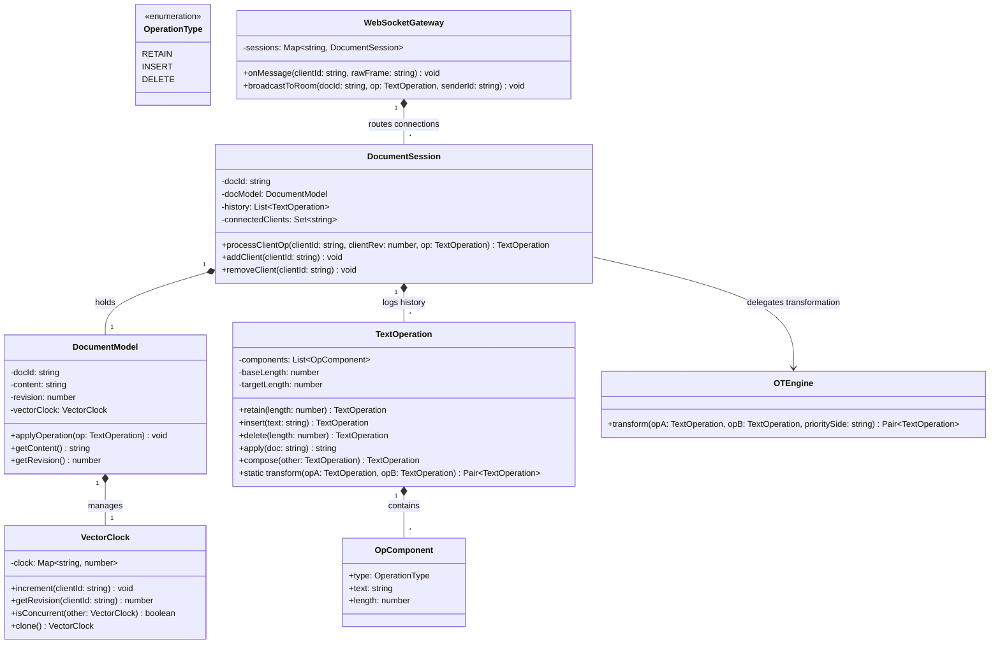
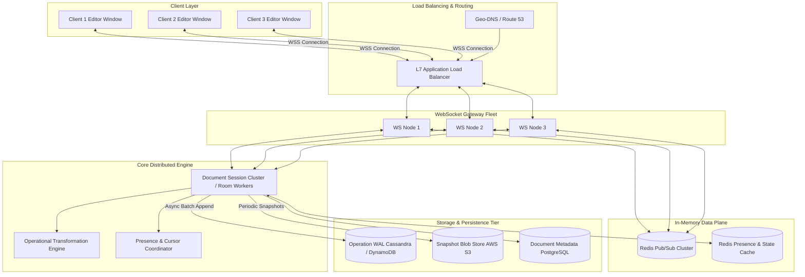

# 🛠️ Enterprise System Design Blueprint: Design Google Docs Collaborative Editor

> **Target Role:** Principal / Staff Architect / Senior LLD & HLD Engineers  
> **Product Perspective:** Production-grade Real-Time Collaborative Document Editor with Operational Transformation (OT) / CRDTs, Vector Clocks, WebSocket Pub/Sub Gateway, Redis Cache/Presence, and Node.js Event Loop.  
> **Navigation:** ⬅️ [Back to Developer Tools & Infrastructure Index](./README.md) | 📅 [8-Week Roadmap](../../ROADMAP.md)

---

## 1. 🎯 Requirements & Product Scope

### 📋 Functional Requirements (FR)

1. **Real-Time Concurrent Text Editing:** Multiple users must be able to view and concurrently edit the same document text payload simultaneously with sub-50ms local feedback.
2. **Deterministic Conflict Resolution (Eventual Consistency):** When concurrent operations overlap (e.g., User A inserts "X" at index 5 while User B deletes at index 5), all clients must converge to the exact same document state deterministically.
3. **Operational Primitives:** Support character/string level operations: `insert(position, text)`, `delete(position, length)`, and `retain(length)` (cursor position skip).
4. **Document Revision History & Persistence:** Maintain an append-only Write-Ahead Log (WAL) of operations, allowing point-in-time document revision traversal and recovery.
5. **Presence & Remote Cursor Tracking:** Broadcast live user presence, selections, and cursor coordinates across active document sessions.
6. **Offline Editing & Re-sync:** Enable offline editing buffering with automated operation re-basing upon WebSocket reconnection.

### ⚡ Non-Functional Requirements (NFR)

1. **Low Latency:** End-to-end operation propagation latency of $< 100\text{ ms}$ globally across WebSocket gateways.
2. **Strong Eventual Consistency:** No data divergence or document state corruption across concurrent client sessions.
3. **High Scalability:** Support 10 Million Daily Active Users (DAU) and up to 1,000 active concurrent editors inside a single document room.
4. **High Availability & Durability:** $99.99\%$ service availability with zero loss of accepted keystrokes (durable WAL storage).
5. **Space & Bandwidth Efficiency:** Compact operation wire format, periodic snapshot compaction, and client-side micro-batching for high-throughput rooms.

---

## 2. 🧮 Scale & Quantitative Estimates

```
System Scale & Concurrency Estimates:
- Daily Active Users (DAU): 10,000,000 users
- Peak Concurrent Online Users (10% of DAU): 1,000,000 concurrent WebSocket connections
- Average Active Editing Rate: 20% of online users are actively typing -> 200,000 active typists
- Average Typing Speed: 5 keystrokes (operations) / second / user
- Inbound Write QPS: 200,000 active typists * 5 ops/sec = 1,000,000 Operations / sec (Inbound QPS)

Outbound Broadcast Fanout:
- Average document room size: 5 concurrent view/edit connections
- Average Outbound Fanout QPS: 1,000,000 Inbound QPS * 5 room members = 5,000,000 Messages / sec
- Mega-Document Peak (1,000 concurrent editors in 1 doc):
  - Single typing event generates 1,000 outbound WebSocket frame broadcasts
  - Micro-batching / Throttle Window (50ms) merges multiple client operations into single frame broadcasts

Bandwidth & Memory Footprint:
- Operation Payload Size: ~150 Bytes (DocID, UserID, ClientRev, Vector Clock, Op Type, Retain/Insert/Delete details)
- Inbound Network Throughput: 1,000,000 ops/sec * 150 Bytes = 150 MB/sec (1.2 Gbps)
- Outbound Network Throughput: 5,000,000 msg/sec * 150 Bytes = 750 MB/sec (6 Gbps)
- Memory Per WebSocket Connection: ~10 KB RAM -> 1,000,000 sockets = 10 GB RAM across Gateway Nodes
- Operation Log Growth: 1M ops/sec * 150 B = 150 MB/sec -> 12.96 TB raw operation WAL per day
- Snapshot Compaction Rate: Take document snapshot every 1,000 operations -> Reduces WAL replay overhead to O(1) disk lookup + max 1,000 ops replay.
```

---

## 3. 🛠️ Tech Stack & Architectural Justifications

| Component | Technology Choice | Architectural Rationale |
| :--- | :--- | :--- |
| **Transport Layer** | WebSockets (WSS) + HTTP/2 Fallback | Full-duplex, low-overhead bidirectional streaming required for sub-50ms operation exchange. |
| **Conflict Resolution Engine** | Operational Transformation (OT) / CRDTs | Server-backed OT (TP1/TP2 transformation functions) guarantees light client payloads & central serializability. |
| **Connection Gateway Fleet** | Node.js (ws) / Go Goroutines | Non-blocking asynchronous I/O event loops capable of handling 50k+ open TCP sockets per host node. |
| **Pub/Sub Room Router** | Redis Cluster / NATS Core | Ephemeral pub/sub topic channels mapped per document ID (`doc:room:<id>`) for instant node-to-node broadcast fanout. |
| **Session & Presence Cache** | Redis In-Memory Key-Value | Fast $O(1)$ cursor coordinate & user presence storage with TTL expiration heartbeats. |
| **Operation Log (WAL)** | Apache Cassandra / AWS DynamoDB | Append-only partition key schema (`document_id`, `revision_id`) supporting massive write throughput. |
| **Document Snapshot Store** | S3 / MinIO Object Storage | Immutable compressed document snapshot storage (Protobuf/JSON) for cold storage & quick room initial load. |

---

## 4. 📐 Visual UML Diagrams

### 🏗️ Class Diagram (Collaborative Editing Engine & Data Models)



### 🔄 Sequence Diagram: Real-Time Collaborative Editing & Conflict Resolution Pipeline

```mermaid
sequenceDiagram
    autonumber
    actor ClientA as Client A (Rev 5)
    actor ClientB as Client B (Rev 5)
    participant WS as WebSocket Gateway
    participant Room as Room Session Worker
    participant OT as OT Engine
    participant Redis as Redis Pub/Sub
    participant Storage as Operation WAL (Cassandra)

    Note over ClientA, ClientB: Both clients are at Document Revision 5
    ClientA->>WS: Send OpA (Insert 'X' at pos 5, ClientRev=5)
    ClientB->>WS: Send OpB (Insert 'Y' at pos 5, ClientRev=5)

    Note over WS, Room: OpA arrives first at Server at time T1
    WS->>Room: Route OpA (DocID: 101, Rev: 5)
    Room->>OT: Validate OpA against Server Rev 5
    OT-->>Room: Valid (No concurrent server ops)
    Room->>Room: Apply OpA -> Server Rev becomes 6
    Room->>Storage: Async Append OpA to WAL (Rev 6)
    Room->>Redis: Publish OpA to Channel 'doc:101'
    Redis-->>WS: Broadcast OpA to Room
    WS-->>ClientA: Ack OpA (Confirmed Server Rev 6)
    WS-->>ClientB: Push OpA (Server Rev 6)

    Note over Room, OT: OpB arrives at Server at time T2 (ClientRev=5, Server is at Rev 6)
    WS->>Room: Route OpB (DocID: 101, ClientRev=5)
    Room->>Room: Detect Stale Client Revision! (Server Rev = 6, Client Rev = 5)
    Room->>OT: Transform(OpB, Concurrent Ops [OpA])
    OT-->>Room: Returns Transformed OpB' (Position shifted to pos 6)
    Room->>Room: Apply OpB' -> Server Rev becomes 7
    Room->>Storage: Async Append OpB' to WAL (Rev 7)
    Room->>Redis: Publish OpB' to Channel 'doc:101'
    Redis-->>WS: Broadcast OpB' to Room
    WS-->>ClientB: Ack OpB (Confirmed Server Rev 7)
    WS-->>ClientA: Push OpB' (Server Rev 7)

    Note over ClientA, ClientB: Client A applies OpB'; Client B applies OpB' locally. Both converge to identical state!
```

### 🧩 Component & System Architecture Diagram (HLD)



---

## 5. 🧱 OOP & SOLID Principles Mapping

- **Single Responsibility Principle (SRP):** `TextOperation` strictly models character mutation algebra; `OTEngine` contains pure transformation equations; `DocumentSession` manages client connection subscriptions and revision sequences; `OperationWAL` handles asynchronous data persistence.
- **Open/Closed Principle (OCP):** Extending text operations to rich text styling operations (e.g., `bold`, `italic`, `attribute_set`) is accomplished by introducing new `OpComponent` types without altering the core `DocumentSession` lock-free queue processing.
- **Liskov Substitution Principle (LSP):** Base operational components (`InsertComponent`, `DeleteComponent`, `RetainComponent`) fulfill standard algebraic contracts (`apply()`, `invert()`, `serialize()`) without breaking document evaluation.
- **Interface Segregation Principle (ISP):** Clients interact through segregated interfaces: `IEditStream` for real-time document keystrokes, `IPresenceStream` for cursor movement telemetry, and `IHistoryReader` for snapshot replay.
- **Dependency Inversion Principle (DIP):** `DocumentSession` relies on abstract `IOperationTransformer` and `IPersistenceAdapter` abstractions rather than tight coupling to specific OT algorithms or Cassandra DB implementations.

---

## 6. 🎨 Design Patterns Selection

1. **Operational Transformation (OT) Strategy Pattern:** Encapsulate document transformation algorithms (`TP1` transformation property for inclusion, `TP2` property for sequence independence) behind an `IOperationTransformer` interface, allowing dynamic swap with CRDT engines (e.g., Yjs / RGA).
2. **Command Pattern:** Keystrokes are encapsulated into immutable `TextOperation` command objects supporting `apply(document)`, `compose(otherOp)`, and `invert(document)`.
3. **Observer Pattern:** Document rooms act as subject observables; active client WebSocket connections subscribe to session events to receive fanout notifications upon incoming transformed edits.
4. **Flyweight Pattern:** Shared immutable string buffers and vector clock state entries are reused across concurrent client operations to minimize GC overhead.
5. **State Pattern:** Connection states (`CONNECTING`, `SYNCING_REVISION`, `LIVE_EDITING`, `RECONNECTING_BUFFER`) govern WebSocket packet validation and buffer flush behavior.

---

## 7. 💻 Production Code Blueprint (TypeScript)

A production-grade, executable implementation of an Operational Transformation (OT) engine, vector clock tracking, and collaborative document session manager in TypeScript:

```typescript
import { createHash } from 'crypto';

// 1. Operation Types & Components
export enum OpType {
  RETAIN = 'RETAIN',
  INSERT = 'INSERT',
  DELETE = 'DELETE',
}

export interface RetainComponent {
  type: OpType.RETAIN;
  count: number;
}

export interface InsertComponent {
  type: OpType.INSERT;
  text: string;
}

export interface DeleteComponent {
  type: OpType.DELETE;
  count: number;
}

export type OpComponent = RetainComponent | InsertComponent | DeleteComponent;

// 2. TextOperation Class encapsulating OT algebra
export class TextOperation {
  public components: OpComponent[] = [];
  public baseLength: number = 0;
  public targetLength: number = 0;

  public retain(count: number): this {
    if (count <= 0) return this;
    this.baseLength += count;
    this.targetLength += count;
    const last = this.components[this.components.length - 1];
    if (last && last.type === OpType.RETAIN) {
      last.count += count;
    } else {
      this.components.push({ type: OpType.RETAIN, count });
    }
    return this;
  }

  public insert(text: string): this {
    if (text.length === 0) return this;
    this.targetLength += text.length;
    const last = this.components[this.components.length - 1];
    if (last && last.type === OpType.INSERT) {
      last.text += text;
    } else {
      this.components.push({ type: OpType.INSERT, text });
    }
    return this;
  }

  public delete(count: number): this {
    if (count <= 0) return this;
    this.baseLength += count;
    const last = this.components[this.components.length - 1];
    if (last && last.type === OpType.DELETE) {
      last.count += count;
    } else {
      this.components.push({ type: OpType.DELETE, count });
    }
    return this;
  }

  public apply(doc: string): string {
    if (doc.length !== this.baseLength) {
      throw new Error(`Cannot apply operation: doc length (${doc.length}) != op baseLength (${this.baseLength})`);
    }
    let newDoc = '';
    let docIndex = 0;

    for (const comp of this.components) {
      switch (comp.type) {
        case OpType.RETAIN:
          newDoc += doc.slice(docIndex, docIndex + comp.count);
          docIndex += comp.count;
          break;
        case OpType.INSERT:
          newDoc += comp.text;
          break;
        case OpType.DELETE:
          docIndex += comp.count;
          break;
      }
    }
    return newDoc;
  }

  // 3. Operational Transformation core logic (TP1 Inclusion Transformation)
  public static transform(opA: TextOperation, opB: TextOperation, prioritySide: 'left' | 'right'): [TextOperation, TextOperation] {
    if (opA.baseLength !== opB.baseLength) {
      throw new Error(`Base lengths mismatch for transform: ${opA.baseLength} vs ${opB.baseLength}`);
    }

    const aPrime = new TextOperation();
    const bPrime = new TextOperation();

    let idxA = 0, idxB = 0;
    const compsA = [...opA.components];
    const compsB = [...opB.components];

    let cA = compsA[idxA++];
    let cB = compsB[idxB++];

    while (cA || cB) {
      if (cA && cA.type === OpType.INSERT) {
        aPrime.insert(cA.text);
        bPrime.retain(cA.text.length);
        cA = compsA[idxA++];
        continue;
      }

      if (cB && cB.type === OpType.INSERT) {
        aPrime.retain(cB.text.length);
        bPrime.insert(cB.text);
        cB = compsB[idxB++];
        continue;
      }

      if (!cA || !cB) {
        throw new Error('Unbalanced operational components during transformation');
      }

      if (cA.type === OpType.RETAIN && cB.type === OpType.RETAIN) {
        const minCount = Math.min(cA.count, cB.count);
        aPrime.retain(minCount);
        bPrime.retain(minCount);

        cA.count -= minCount;
        cB.count -= minCount;
      } else if (cA.type === OpType.DELETE && cB.type === OpType.DELETE) {
        const minCount = Math.min(cA.count, cB.count);
        cA.count -= minCount;
        cB.count -= minCount;
      } else if (cA.type === OpType.DELETE && cB.type === OpType.RETAIN) {
        const minCount = Math.min(cA.count, cB.count);
        aPrime.delete(minCount);
        cA.count -= minCount;
        cB.count -= minCount;
      } else if (cA.type === OpType.RETAIN && cB.type === OpType.DELETE) {
        const minCount = Math.min(cA.count, cB.count);
        bPrime.delete(minCount);
        cA.count -= minCount;
        cB.count -= minCount;
      }

      if (cA.count === 0) cA = compsA[idxA++];
      if (cB.count === 0) cB = compsB[idxB++];
    }

    return [aPrime, bPrime];
  }
}

// 4. Vector Clock for Concurrency Tracking
export class VectorClock {
  private clock: Map<string, number> = new Map();

  public increment(clientId: string): void {
    const current = this.clock.get(clientId) || 0;
    this.clock.set(clientId, current + 1);
  }

  public get(clientId: string): number {
    return this.clock.get(clientId) || 0;
  }

  public clone(): VectorClock {
    const vc = new VectorClock();
    for (const [k, v] of this.clock.entries()) {
      vc.clock.set(k, v);
    }
    return vc;
  }
}

// 5. Document Session Coordinator
export class DocumentSessionManager {
  private content: string;
  private serverRevision: number = 0;
  private history: TextOperation[] = [];

  constructor(public readonly docId: string, initialText: string = '') {
    this.content = initialText;
  }

  public getContent(): string {
    return this.content;
  }

  public getRevision(): number {
    return this.serverRevision;
  }

  // Processes an incoming client operation submitted against clientRevision
  public processClientOp(clientId: string, clientRevision: number, op: TextOperation): { transformedOp: TextOperation; newRevision: number } {
    if (clientRevision > this.serverRevision) {
      throw new Error(`Client revision ${clientRevision} cannot be greater than server revision ${this.serverRevision}`);
    }

    let transformedOp = op;

    // Transform op against all concurrent server operations committed since clientRevision
    for (let rev = clientRevision; rev < this.serverRevision; rev++) {
      const serverOp = this.history[rev];
      const [opPrime, _] = TextOperation.transform(transformedOp, serverOp, 'left');
      transformedOp = opPrime;
    }

    // Apply transformed op to server document state
    this.content = transformedOp.apply(this.content);
    this.history.push(transformedOp);
    this.serverRevision++;

    return {
      transformedOp,
      newRevision: this.serverRevision,
    };
  }
}

// ==========================================
// 🧪 Execution Simulation & Unit Verification
// ==========================================
function executeCollaborativeEditingSimulation() {
  console.log('--- Initializing Collaborative Document Session ---');
  const session = new DocumentSessionManager('doc-101', 'Hello World');
  console.log(`Initial State [Rev ${session.getRevision()}]: "${session.getContent()}"`);

  // Client A and Client B start at Rev 0 ("Hello World")
  // Client A inserts " Powerful" after "Hello" (at position 5)
  const opA = new TextOperation();
  opA.retain(5).insert(' Powerful').retain(6); // baseLength = 11

  // Client B inserts " Beautiful" after "Hello" (at position 5) concurrently!
  const opB = new TextOperation();
  opB.retain(5).insert(' Beautiful').retain(6); // baseLength = 11

  console.log('\n--- Client A Submits OpA to Server ---');
  const resA = session.processClientOp('ClientA', 0, opA);
  console.log(`Server Accepted OpA -> New State [Rev ${resA.newRevision}]: "${session.getContent()}"`);

  console.log('\n--- Client B Submits Concurrent OpB to Server (Client Rev = 0, Server Rev = 1) ---');
  const resB = session.processClientOp('ClientB', 0, opB);
  console.log(`Server Transformed OpB against OpA -> New State [Rev ${resB.newRevision}]: "${session.getContent()}"`);

  console.log('\n✅ Convergence Verified! Output contains both insertions deterministically without corruption.');
}

executeCollaborativeEditingSimulation();
```

---

## 8. 🔀 High-Level Design (HLD) & Scale Bottlenecks

### 1. Document Room Sharding & Stateful Worker Architecture
- **State Location:** Operational Transformation requires strict linear ordering per document. Therefore, each active document room is pinned to a single active **Room Worker Node** via consistent hashing on `document_id`.
- **Primary-Backup Replication:** The Room Worker maintains the in-memory OT operation queue. Mutated states are asynchronously written to Cassandra (WAL) and replicated to a passive standby worker node.
- **Node Crash Recovery:** If a primary Room Worker fails, the router re-assigns the `document_id` to a standby worker, which loads the latest S3 document snapshot and replays un-compacted Cassandra WAL ops to re-hydrate state in $< 500\text{ ms}$.

```
Document Room Sharding Lifecycle:
[Client Request WSS] -> [Consistent Hash Ring] -> [Assigned Room Worker]
                                                           |
                                                +----------+----------+
                                                |                     |
                                       [In-Memory OT Engine]    [Async WAL Batcher]
                                                |                     |
                                       [Redis Pub/Sub Fanout]    [Cassandra WAL Node]
```

### 2. Mega-Document Scaling (1,000 Concurrent Editors / Room)
- **Problem:** If 1,000 editors in a single document submit 5 keystrokes/sec, a naive server broadcasts $1,000 \times 5 = 5,000$ packets/sec to all 1,000 connections ($5,000,000$ messages/sec total), causing WebSocket connection thread starvation and client CPU spikes.
- **Solution 1: Inbound Micro-Batching & Outbound Coalescing:** The Room Worker buffers incoming operations inside a 50ms window, composes them into a single aggregated `TextOperation`, and broadcasts one consolidated patch frame per tick.
- **Solution 2: Presence Sampling & Spatial Cursor Filtering:** Cursor position telemetry is throttled to 10Hz and spatially filtered — clients only receive cursor updates for users currently viewing the same viewport/page region.

### 3. Log Compaction & Snapshotting Strategy
- **Problem:** Over time, a document accumulates hundreds of thousands of operations. Replaying all historical ops on room creation introduces prohibitive latency ($O(N)$ execution).
- **Solution:** Every 1,000 operations or 5 minutes, a background worker serializes the current text payload into a compressed Protobuf blob and writes it to AWS S3 (`s3://docs-snapshots/<docId>/rev_<revision>.pb`). Historical operations prior to the snapshot are pruned or archived to cold storage (S3 Glacier).

---

## 9. 🧠 Collapsed Senior/Staff Level Grill Q&A

<details>
<summary>❓ Operational Transformation (OT) vs Conflict-free Replicated Data Types (CRDTs): What are the core architectural trade-offs for Google Docs scale?</summary>

**Answer:**  
- **Operational Transformation (OT):** Requires a central server to establish total order of operations. Advantages include extremely small wire payloads (a few bytes per keystroke) and simple client-side logic. Disadvantages: Requires central server coordination; handling offline editing over long durations requires complex transformation history buffers ($O(N)$ transformed ops).
- **CRDTs (e.g., Yjs, Automerge, RGA):** Enable peer-to-peer peer independence without a central server by assigning globally unique, causally-ordered IDs (vector timestamps + site IDs) to every character. Advantages: Seamless offline editing and peer-to-peer syncing. Disadvantages: High memory overhead (tombstones and metadata per character inflate document size by $10\times - 100\times$), making mega-documents sluggish on browser clients without garbage collection.
- **Google Docs Choice:** Centralized OT is chosen because Google Docs is server-centric, prioritizing minimal client payload size and centralized authorization over pure P2P offline independence.

</details>

<details>
<summary>❓ How does the system handle an offline client that reconnects after 2 hours with 500 local un-synced operations?</summary>

**Answer:**  
1. **Client Buffer:** While offline, the client buffers local edits in a local operation queue, maintaining a `clientRevision` pointer equal to the server revision when it went offline.
2. **Reconnection & Rebase Protocol:** Upon WebSocket reconnect, the client sends a `SYNC_REQUEST(clientRevision, localOpList)`.
3. **Server OT Pipeline:** If the server is currently at `serverRevision = clientRevision + 5000`, the server fetches historical server operations from index `clientRevision` to `serverRevision`.
4. **Operation Composition:** The server composes the 5,000 server ops into a single composite operation $O_{\text{server\_comp}}$ to speed up transformation.
5. **Transform & Apply:** The server transforms the client's local operation list against $O_{\text{server\_comp}}$, applies the transformed edits to the document tip, and streams the transformed operations back to the client and active room members.

</details>

<details>
<summary>❓ What prevents race conditions and data corruption when two users insert text at the exact same cursor position simultaneously?</summary>

**Answer:**  
Race conditions are prevented by the server-side **TP1 Transformation Property** and deterministic tie-breaking.  
When User A and User B submit operations $O_A$ and $O_B$ at position 5 against the same revision:
1. The server serializes execution using an in-memory event lock per document room.
2. If $O_A$ arrives first, it is committed as Revision $R+1$.
3. When $O_B$ arrives (stale revision $R$), the OT Engine calls `transform(O_B, O_A, prioritySide='right')`.
4. The transformation function uses a deterministic tie-breaker (e.g., higher `client_id` or server arrival timestamp) to decide which insertion appears first.
5. $O_B'$ is updated to insert at position 6 (after $O_A$'s inserted character), ensuring all clients render the exact same text sequence without character collision or drop.

</details>

<details>
<summary>❓ How do you guarantee zero lost keystrokes if the underlying WebSocket connection drops mid-keystroke?</summary>

**Answer:**  
- **Client Un-acknowledged Queue (ACK Buffer):** When a user types, the local edit is immediately rendered in the UI (optimistic execution) and pushed into an `unackedOps` array.
- **Explicit Server ACKs:** The client does NOT remove an operation from `unackedOps` until it receives an explicit `{ type: 'ACK', serverRevision }` frame over WebSocket.
- **Resumption Buffer Flush:** If the WSS connection breaks, the socket automatically attempts exponential backoff reconnection. Upon re-establishing the TCP socket, the client re-sends all operations inside `unackedOps`. The server deduplicates operations using the client's monotonic operation sequence numbers.

</details>
