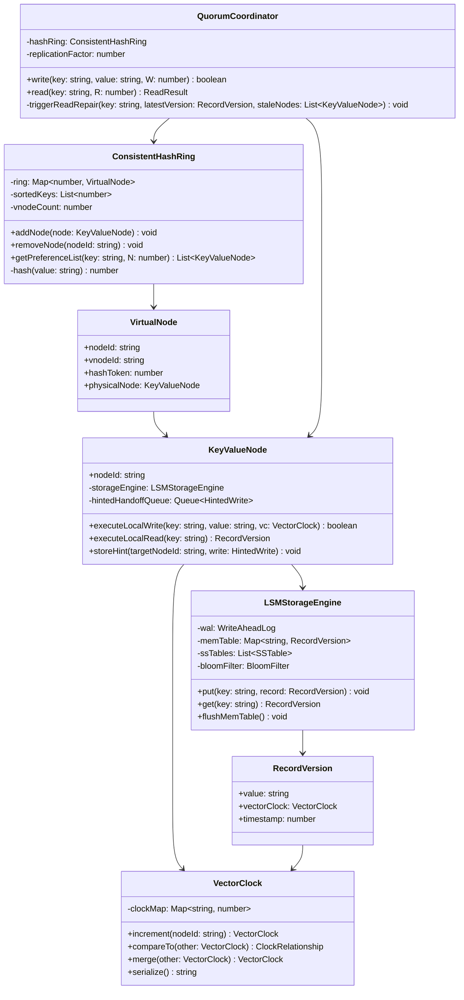
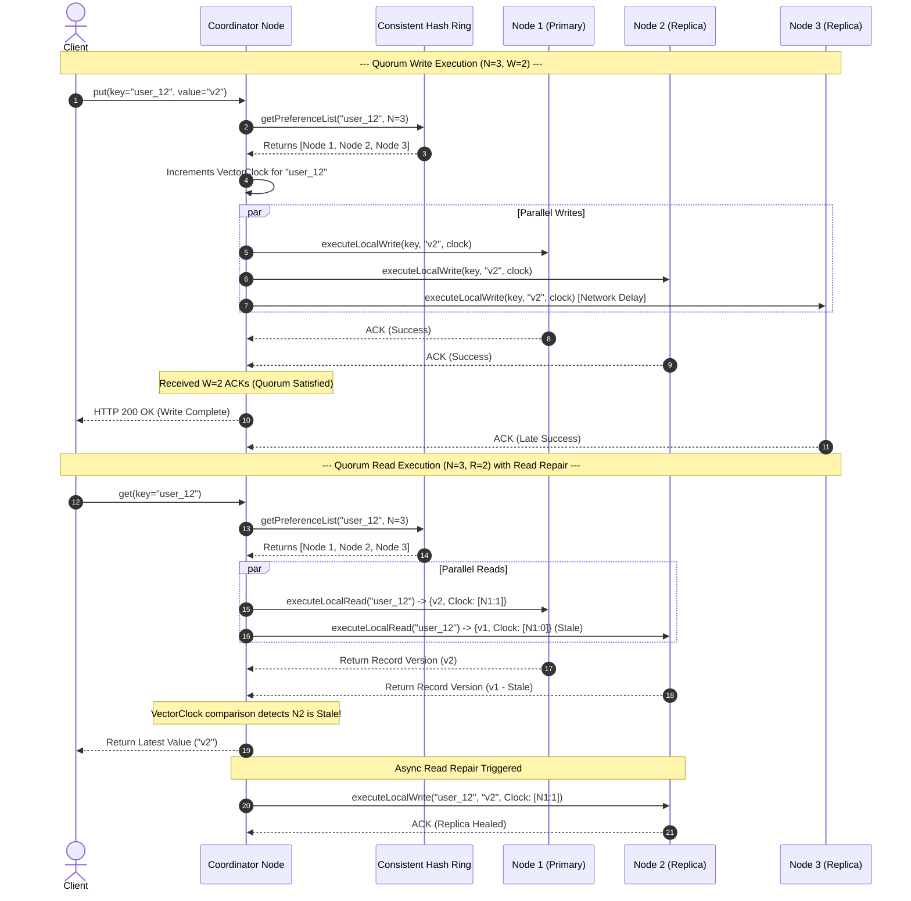
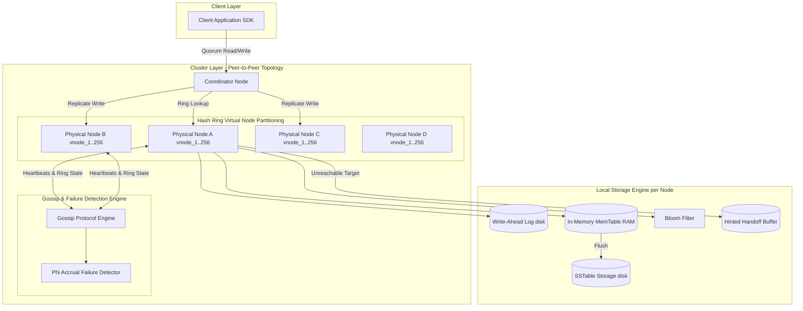

# 🛠️ Enterprise System Design Blueprint: Design Distributed Key-Value Store

> **Target Role:** Principal / Staff Architect / Senior LLD & HLD Engineers  
> **Product Perspective:** High-throughput, highly available, partition-tolerant distributed key-value storage engine (DynamoDB / Apache Cassandra style) capable of handling billions of keys, sub-10ms latencies, tunable quorum consistency ($R+W > N$), vector clock conflict resolution, consistent hash rings with virtual nodes, and gossip-based cluster coordination.  
> **Navigation:** ⬅️ [Back to Developer Tools & Infrastructure Index](./README.md) | 📅 [8-Week Roadmap](../../ROADMAP.md)

---

## 1. 🎯 Requirements & Product Scope

### 📋 Functional Requirements (FR)

1. **Core Key-Value Operations:** Expose low-latency `put(key, value, ttl?)`, `get(key)`, and `delete(key)` primitives with key-level TTL support.
2. **Tunable Quorum Consistency:** Support per-request configurable replication settings: Replication Factor ($N$), Read Quorum ($R$), and Write Quorum ($W$) (e.g., $R+W > N$ for strong consistency, $R+W \le N$ for eventual consistency).
3. **Automated Partitioning & Replication:** Automatically partition keys across cluster nodes using Consistent Hashing with Virtual Nodes (`vnodes`), replicating each key to $N$ consecutive distinct physical nodes on the ring.
4. **Conflict Resolution & Vector Clocks:** Detect concurrent non-causal writes across nodes using Vector Clocks (`Map<NodeID, Counter>`) and apply Last-Write-Wins (LWW) timestamp fallbacks or surface client-side conflict resolution interfaces.
5. **Fault Recovery & Anti-Entropy:** Handle short-term node outages gracefully via **Hinted Handoff** buffering and reconcile long-term replica divergences using **Anti-Entropy Merkle Trees** and **Read Repair**.

### ⚡ Non-Functional Requirements (NFR)

1. **Massive Scale & Throughput:** Store $\ge 1,000,000,000$ (1 Billion) keys with peak throughput of $\ge 100,000$ QPS (80,000 Reads/sec, 20,000 Writes/sec).
2. **High Availability & Fault Tolerance:** Achieve **99.999% availability** ("Five Nines") with a Masterless / Peer-to-Peer architecture containing zero Single Points of Failure (No SPoF).
3. **Ultra-Low Latency SLAs:** Sub-5ms write latency at P99 (via WAL + MemTable append-only writes) and sub-10ms read latency at P99 (via Bloom Filters + SSTable indexes).
4. **Decentralized Cluster Coordination:** Peer-to-peer Gossip protocol for node heartbeat propagation, dynamic node joins, leaves, and failure detection without relying on centralized orchestration (e.g., ZooKeeper).
5. **CAP & PACELC Compliance:** Configurable trade-offs complying with PACELC: If Partitioned (P), choose Availability (A) over Consistency (C); Else (E), choose Latency (L) over Consistency (C).

---

## 2. 🧮 Scale & Quantitative Estimates

```
Throughput & Data Scale:
- Total Keys Stored: 1 Billion keys (1,000,000,000)
- Average Key Size: 64 Bytes
- Average Value Size: 1 KB (1,024 Bytes)
- Metadata Overhead (Vector Clock + TTL + Hash Header): ~100 Bytes
- Total Record Size: ~1.18 KB per key-value entry

Storage Calculations:
- Raw Data Volume (1 Replica): 1B * 1.18 KB = ~1.18 TB
- Total Storage (Replication Factor N = 3): 1.18 TB * 3 = 3.54 TB total raw capacity
- Cluster Size: 10 Nodes -> ~354 GB storage per physical node

QPS & Network Bandwidth:
- Total Operations: 100,000 QPS (80% Reads = 80,000 QPS, 20% Writes = 20,000 QPS)
- Read Quorum Traffic (R = 2): 80,000 * 2 = 160,000 read queries processed across cluster/sec
- Write Quorum Traffic (W = 2): 20,000 * 2 = 40,000 write operations executed across cluster/sec
- Network IO Bandwidth (Inbound Writes): 20,000 * 1.18 KB = ~23.6 MB/s
- Network IO Bandwidth (Outbound Reads): 80,000 * 1 KB = ~80 MB/s
- Combined Cluster Network IO: ~103.6 MB/s

Memory Estimates per Node (RAM Allocation):
- Active MemTable Allocation: 4 GB RAM per node (buffers pending writes before SSTable flush)
- Bloom Filter Memory (10 bits per key, ~1% false positive rate):
  1B keys * 10 bits = 10 Gbits = 1.25 GB total -> ~125 MB RAM per node
- Consistent Hash Ring Metadata (256 vnodes * 10 nodes = 2,560 tokens): < 500 KB RAM
```

---

## 3. 🛠️ Tech Stack & Architectural Justifications

| Component | Technology Choice | Architectural Rationale |
| :--- | :--- | :--- |
| **Data Partitioning & Topology** | Consistent Hash Ring with Virtual Nodes (`vnodes`) | Murmur3 32-bit hashing distributes key space evenly across $2^{32}-1$ tokens. Virtual nodes prevent load hotspotting and enforce uniform redistribution when nodes join/leave. |
| **Node Storage Engine** | Log-Structured Merge-Tree (LSM-Tree) | Transforms random disk writes into sequential append-only operations (WAL + MemTable flush to SSTable), delivering ultra-fast $O(1)$ writes ($< 5\text{ms}$). |
| **Read Acceleration** | Bloom Filters & Sparse Indexes | Enables $O(1)$ check to confirm whether a key exists in an SSTable file on disk before performing disk I/O, reducing read latency to $< 10\text{ms}$. |
| **Cluster Coordination** | Peer-to-Peer Gossip Protocol | Epidemic push-pull protocol eliminates master node bottlenecks, guaranteeing $O(\log N)$ cluster state convergence and automatic failure detection. |
| **Conflict Resolution** | Vector Clocks (`Map<NodeID, Counter>`) | Tracks causal causality relationships between concurrent writes without reliance on synchronized physical hardware clocks (NTP drift invariant). |

---

## 4. 📐 Visual UML Diagrams

### 🏗️ Class Diagram (Core Storage Engine & Distributed Coordinator)



### 🔄 Sequence Diagram: Quorum Write & Read Operations with Read Repair



### 🧩 Component & System Architecture Diagram (HLD)



---

## 5. 🧱 OOP & SOLID Principles Mapping

- **Single Responsibility Principle (SRP):**
  - `ConsistentHashRing` handles node token mapping and key routing exclusively.
  - `LSMStorageEngine` manages local physical disk persistence (WAL, MemTable, SSTables).
  - `VectorClock` handles causality evaluation (`isConcurrent`, `isAncestor`) and merging.
  - `QuorumCoordinator` manages network fan-out, quorum counting, and read repair triggers.
- **Open/Closed Principle (OCP):**
  - `IStorageEngine` interface allows plugging in alternative storage engines (e.g., `BTreeStorageEngine`, `InMemoryStorageEngine`) without altering quorum coordination.
  - `IConflictResolver` interface allows switching between `VectorClockResolver` and `LastWriteWinsResolver`.
- **Liskov Substitution Principle (LSP):**
  - Any concrete implementation of `IStorageEngine` behaves consistently under `KeyValueNode` operations without degrading quorum invariants.
- **Interface Segregation Principle (ISP):**
  - Distinguish lean `IClientOperations` (`get`, `put`) from administrative `IClusterManagement` (`addNode`, `decommissionNode`, `rebalanceTokens`).
- **Dependency Inversion Principle (DIP):**
  - High-level coordinator classes depend on abstract `INodeRouter` and `INetworkTransport` abstractions rather than hardcoded TCP sockets or raw node arrays.

---

## 6. 🎨 Design Patterns Selection

1. **Consistent Hash Ring Pattern:** Maps keys and physical node vnodes onto a continuous circular hash space ($0$ to $2^{32}-1$), ensuring $O(\log N)$ lookup and minimal data movement ($O(K/N)$ key migrations) during scaling.
2. **Vector Clock / Version Vector Pattern:** Tracks causal relationships and concurrent updates across nodes without relying on synchronized system clocks.
3. **Strategy Pattern:** Enforces configurable read/write policies (`QuorumStrategy`, `AllStrategy`, `OneStrategy`) and conflict resolution rules (`VectorClockResolverStrategy`, `LWWResolverStrategy`).
4. **Command Pattern:** Encapsulates distributed read and write requests as `StorageCommand` objects dispatched asynchronously across worker pools.
5. **Observer / Gossip Pattern:** Nodes register as listeners to the local `GossipEngine` to react to node membership updates (`NODE_JOIN`, `NODE_SUSPECT`, `NODE_DEAD`).

---

## 7. 💻 Production Code Blueprint (TypeScript)

```typescript
import * as crypto from 'crypto';

// ==========================================
// 1. Vector Clock & Conflict Detection Types
// ==========================================

export enum ClockRelationship {
  EQUAL = 'EQUAL',
  ANCESTOR = 'ANCESTOR',   // Current is strictly before Other
  DESCENDANT = 'DESCENDANT', // Current is strictly after Other
  CONCURRENT = 'CONCURRENT' // Concurrent writes (Conflict)
}

export class VectorClock {
  private clockMap: Map<string, number>;

  constructor(initialMap?: Map<string, number>) {
    this.clockMap = new Map(initialMap || []);
  }

  public increment(nodeId: string): VectorClock {
    const newMap = new Map(this.clockMap);
    const currentVal = newMap.get(nodeId) || 0;
    newMap.set(nodeId, currentVal + 1);
    return new VectorClock(newMap);
  }

  public compareTo(other: VectorClock): ClockRelationship {
    let hasGreater = false;
    let hasSmaller = false;

    const allKeys = new Set([...this.clockMap.keys(), ...other.clockMap.keys()]);

    for (const key of allKeys) {
      const v1 = this.clockMap.get(key) || 0;
      const v2 = other.clockMap.get(key) || 0;

      if (v1 > v2) hasGreater = true;
      if (v1 < v2) hasSmaller = true;
    }

    if (hasGreater && hasSmaller) return ClockRelationship.CONCURRENT;
    if (hasGreater && !hasSmaller) return ClockRelationship.DESCENDANT;
    if (!hasGreater && hasSmaller) return ClockRelationship.ANCESTOR;
    return ClockRelationship.EQUAL;
  }

  public merge(other: VectorClock): VectorClock {
    const newMap = new Map(this.clockMap);
    for (const [key, value] of other.clockMap.entries()) {
      const currentVal = newMap.get(key) || 0;
      newMap.set(key, Math.max(currentVal, value));
    }
    return new VectorClock(newMap);
  }

  public getMap(): Map<string, number> {
    return new Map(this.clockMap);
  }
}

export interface RecordVersion {
  value: string;
  vectorClock: VectorClock;
  timestamp: number;
}

// ==========================================
// 2. Consistent Hash Ring with Virtual Nodes
// ==========================================

export interface VirtualNode {
  nodeId: string;
  vnodeId: string;
  hashToken: number;
  physicalNode: KeyValueNode;
}

export class ConsistentHashRing {
  private ring: Map<number, VirtualNode> = new Map();
  private sortedTokens: number[] = [];

  constructor(private vnodeCount: number = 3) {}

  private hash(input: string): number {
    const hash = crypto.createHash('md5').update(input).digest();
    return hash.readUInt32BE(0); // 32-bit unsigned integer token
  }

  public addNode(physicalNode: KeyValueNode): void {
    for (let i = 0; i < this.vnodeCount; i++) {
      const vnodeKey = `${physicalNode.nodeId}-vnode-${i}`;
      const token = this.hash(vnodeKey);
      const vnode: VirtualNode = {
        nodeId: physicalNode.nodeId,
        vnodeId: vnodeKey,
        hashToken: token,
        physicalNode,
      };
      this.ring.set(token, vnode);
      this.sortedTokens.push(token);
    }
    this.sortedTokens.sort((a, b) => a - b);
  }

  public removeNode(nodeId: string): void {
    this.sortedTokens = this.sortedTokens.filter(token => {
      const vnode = this.ring.get(token);
      if (vnode && vnode.nodeId === nodeId) {
        this.ring.delete(token);
        return false;
      }
      return true;
    });
  }

  public getPreferenceList(key: string, N: number): KeyValueNode[] {
    if (this.sortedTokens.length === 0) return [];

    const keyToken = this.hash(key);
    let index = this.binarySearchTokens(keyToken);

    const preferenceList: KeyValueNode[] = [];
    const seenPhysicalNodes = new Set<string>();

    for (let i = 0; i < this.sortedTokens.length; i++) {
      const tokenIndex = (index + i) % this.sortedTokens.length;
      const token = this.sortedTokens[tokenIndex];
      const vnode = this.ring.get(token)!;

      if (!seenPhysicalNodes.has(vnode.nodeId)) {
        seenPhysicalNodes.add(vnode.nodeId);
        preferenceList.push(vnode.physicalNode);
      }

      if (preferenceList.length === N) break;
    }

    return preferenceList;
  }

  private binarySearchTokens(target: number): number {
    let low = 0;
    let high = this.sortedTokens.length - 1;

    if (target > this.sortedTokens[high] || target <= this.sortedTokens[0]) {
      return 0;
    }

    while (low <= high) {
      const mid = Math.floor((low + high) / 2);
      if (this.sortedTokens[mid] >= target && (mid === 0 || this.sortedTokens[mid - 1] < target)) {
        return mid;
      }
      if (this.sortedTokens[mid] < target) {
        low = mid + 1;
      } else {
        high = mid - 1;
      }
    }
    return 0;
  }
}

// ==========================================
// 3. Local Storage Engine & Node Primitive
// ==========================================

export class KeyValueNode {
  private memoryStore = new Map<string, RecordVersion>();
  public isHealthy: boolean = true;

  constructor(public readonly nodeId: string) {}

  public executeLocalWrite(key: string, record: RecordVersion): boolean {
    if (!this.isHealthy) return false;

    const existing = this.memoryStore.get(key);
    if (!existing) {
      this.memoryStore.set(key, record);
      return true;
    }

    const rel = record.vectorClock.compareTo(existing.vectorClock);
    if (rel === ClockRelationship.DESCENDANT || rel === ClockRelationship.EQUAL) {
      this.memoryStore.set(key, record);
    } else if (rel === ClockRelationship.CONCURRENT) {
      // Tie-breaker fallback: Last-Write-Wins (LWW) via timestamp
      if (record.timestamp >= existing.timestamp) {
        this.memoryStore.set(key, record);
      }
    }
    return true;
  }

  public executeLocalRead(key: string): RecordVersion | null {
    if (!this.isHealthy) return null;
    return this.memoryStore.get(key) || null;
  }
}

// ==========================================
// 4. Distributed Quorum Coordinator Engine
// ==========================================

export class QuorumCoordinator {
  constructor(
    private ring: ConsistentHashRing,
    private defaultN: number = 3
  ) {}

  public put(key: string, value: string, W: number = 2): boolean {
    const preferenceList = this.ring.getPreferenceList(key, this.defaultN);
    if (preferenceList.length === 0) throw new Error('No available nodes in hash ring');

    // 1. Fetch current vector clock (Read phase for clock synthesis)
    const existingRecord = this.getLatestRecord(key, preferenceList);
    let newClock = existingRecord
      ? existingRecord.vectorClock
      : new VectorClock();

    // Increment clock using coordinator node ID
    newClock = newClock.increment(preferenceList[0].nodeId);

    const record: RecordVersion = {
      value,
      vectorClock: newClock,
      timestamp: Date.now(),
    };

    // 2. Dispatch write in parallel to N replicas
    let ackCount = 0;
    for (const node of preferenceList) {
      const success = node.executeLocalWrite(key, record);
      if (success) ackCount++;
    }

    // 3. Evaluate Write Quorum (W)
    return ackCount >= W;
  }

  public get(key: string, R: number = 2): string | null {
    const preferenceList = this.ring.getPreferenceList(key, this.defaultN);
    if (preferenceList.length === 0) return null;

    const readResponses: { node: KeyValueNode; record: RecordVersion | null }[] = [];

    // 1. Dispatch read to R replicas
    for (const node of preferenceList) {
      const record = node.executeLocalRead(key);
      if (record !== null) {
        readResponses.push({ node, record });
      }
    }

    // 2. Evaluate Read Quorum (R)
    if (readResponses.length < R) {
      console.warn(`[Quorum] Read quorum failed. Needed ${R}, got ${readResponses.length}`);
      return null;
    }

    // 3. Reconcile versions and detect stale replicas
    const latest = this.reconcileVersions(readResponses.map(r => r.record!));
    if (!latest) return null;

    // 4. Trigger Async Read Repair for stale nodes
    this.triggerReadRepair(key, latest, readResponses);

    return latest.value;
  }

  private getLatestRecord(key: string, nodes: KeyValueNode[]): RecordVersion | null {
    const records: RecordVersion[] = [];
    for (const node of nodes) {
      const rec = node.executeLocalRead(key);
      if (rec) records.push(rec);
    }
    return this.reconcileVersions(records);
  }

  private reconcileVersions(records: RecordVersion[]): RecordVersion | null {
    if (records.length === 0) return null;

    let newest = records[0];
    for (let i = 1; i < records.length; i++) {
      const rel = records[i].vectorClock.compareTo(newest.vectorClock);
      if (rel === ClockRelationship.DESCENDANT) {
        newest = records[i];
      } else if (rel === ClockRelationship.CONCURRENT) {
        if (records[i].timestamp > newest.timestamp) {
          newest = records[i];
        }
      }
    }
    return newest;
  }

  private triggerReadRepair(
    key: string,
    latestRecord: RecordVersion,
    responses: { node: KeyValueNode; record: RecordVersion | null }[]
  ): void {
    for (const resp of responses) {
      if (!resp.record || resp.record.vectorClock.compareTo(latestRecord.vectorClock) === ClockRelationship.ANCESTOR) {
        // Async update stale replica
        setTimeout(() => {
          resp.node.executeLocalWrite(key, latestRecord);
        }, 10);
      }
    }
  }
}

// ==========================================
// 5. Verification Test Driver
// ==========================================

function runDistributedKVStoreDemo() {
  console.log("=== Initializing Distributed Key-Value Cluster ===");
  const ring = new ConsistentHashRing(3); // 3 vnodes per physical node

  const nodeA = new KeyValueNode("Node-A");
  const nodeB = new KeyValueNode("Node-B");
  const nodeC = new KeyValueNode("Node-C");

  ring.addNode(nodeA);
  ring.addNode(nodeB);
  ring.addNode(nodeC);

  const coordinator = new QuorumCoordinator(ring, 3);

  console.log("\n--- Executing Quorum Write (N=3, W=2) ---");
  const writeSuccess = coordinator.put("user_session_99", "AUTH_TOKEN_ABC123", 2);
  console.log(`Write Success (W=2): ${writeSuccess}`);

  console.log("\n--- Executing Quorum Read (N=3, R=2) ---");
  const val = coordinator.get("user_session_99", 2);
  console.log(`Read Result (R=2): ${val}`);

  console.log("\n--- Simulating Replica Drift & Read Repair ---");
  // Inject stale version into Node-C manually
  nodeC.executeLocalWrite("user_session_99", {
    value: "STALE_TOKEN_OLD",
    vectorClock: new VectorClock(new Map([["Node-A", 0]])),
    timestamp: Date.now() - 10000,
  });

  console.log("Reading value again (triggers Read Repair on Node-C)...");
  const valAfterDrift = coordinator.get("user_session_99", 2);
  console.log(`Read Result during drift: ${valAfterDrift}`);

  setTimeout(() => {
    console.log(`Node-C value after Read Repair: ${nodeC.executeLocalRead("user_session_99")?.value}`);
  }, 50);
}

runDistributedKVStoreDemo();
```

---

## 8. 🔀 High-Level Design (HLD) & Scale Bottlenecks

### 1. Quorum Consistency Equation ($R + W > N$)
To guarantee strict read-your-writes consistency under network partitioning, the cluster enforces the **Pigeonhole Principle**:
$$\text{Read Quorum }(R) + \text{Write Quorum }(W) > \text{Replication Factor }(N)$$
- **Strong Consistency Configuration ($N=3, R=2, W=2$):** $2 + 2 = 4 > 3$. At least one node in the read quorum is guaranteed to overlap with the write quorum, assuring freshest value returns.
- **Fast Read Workloads ($N=3, R=1, W=3$):** Instant sub-millisecond reads from any single replica, but writes require unanimous acknowledgement across all 3 nodes.
- **Fast Write Workloads ($N=3, R=3, W=1$):** Instant writes acknowledging a single local node, but reads require collecting responses from all 3 replicas to resolve conflict.

### 2. Hinted Handoff Architecture (Transient Failure Toleration)
When physical Node $B$ is temporarily unreachable due to network blips:
1. The Coordinator routes the write to a healthy neighbor Node $C$.
2. Node $C$ stores the update in a dedicated **Hint Bucket** containing: `(TargetNodeId: B, OriginalKey, Value, VectorClock, TTL)`.
3. Node $C$'s background Gossip worker polls for Node $B$'s recovery.
4. Upon receiving a positive heartbeat from Node $B$, Node $C$ streams the buffered hints to Node $B$ and deletes the hints upon ACK.

### 3. Anti-Entropy with Merkle Trees (Background Synchronization)
For long-term out-of-sync nodes (e.g. node down for days exceeding Hint TTL):
- Each node constructs a **Hierarchical Merkle Tree** (Hash Tree) for key ranges owned by its token slots.
- Parents in the Merkle tree are hashes of their children.
- During background anti-entropy checks, nodes exchange only the root hashes of their Merkle trees:
  - If Root Hashes match $\rightarrow$ Key ranges are 100% identical ($O(1)$ network check).
  - If Root Hashes differ $\rightarrow$ Nodes traverse child branches to pinpoint exact divergent keys in $O(\log K)$ steps, avoiding full database scans.

---

## 9. 🧠 Collapsed Senior/Staff Level Grill Q&A

<details>
<summary>❓ How do you prevent Vector Clock size explosion ("Clock Drift") when nodes join and leave?</summary>

**Answer:**  
As system nodes dynamically join, leave, or restart over years, Vector Clocks accumulate stale `Map<NodeID, Counter>` entries. To prevent clock sizes from ballooning:
1. Implement **Vector Clock Trimming (Threshold GC)**: Set a maximum clock size limit (e.g., $K=10$ entries) alongside timestamp metadata `(NodeID, Counter, Timestamp)`.
2. When clock length exceeds $K$, purge the oldest timestamp entry.
3. *Architectural Trade-off:* Purging clock entries can convert ancestor relationships into false concurrent updates, forcing fallback to Last-Write-Wins (LWW) timestamp reconciliation.

</details>

<details>
<summary>❓ Why use Virtual Nodes (`vnodes`) instead of standard physical node tokens on the Consistent Hash Ring?</summary>

**Answer:**  
Standard consistent hashing maps each physical server to a single token on the ring. This creates two fatal production vulnerabilities:
1. **Non-Uniform Data Distribution:** Hashing servers directly results in uneven token gaps, leading to severe load imbalance (hotspots).
2. **Cascading Failures:** When Node $B$ dies, 100% of its key space transfers to its immediate physical successor Node $C$. Node $C$ becomes overwhelmed by double traffic and dies, triggering a domino collapse.

**Virtual Nodes (`vnodes`) Solution:** Assign 256 distinct virtual token positions on the ring per physical server. When a physical server dies, its 256 vnodes are interspersed evenly across the ring, distributing failover load uniformly across **all remaining cluster nodes** (each node absorbing only ~$\frac{1}{N-1}$ of the traffic).

</details>

<details>
<summary>❓ How does LSM-Tree compaction balance Write Amplification, Read Amplification, and Space Amplification?</summary>

**Answer:**  
LSM-Tree compaction merges smaller SSTables into larger sorted disk files to eliminate duplicate keys and deleted tombstones:
- **Size-Tiered Compaction Strategy (STCS):** Flushes SSTables of similar sizes into larger tiers. Optimized for **Write-Heavy workloads** (Low Write Amplification), but high Read Amplification (must check many SSTables per read) and high Space Amplification (requires 50% free disk space for compaction).
- **Leveled Compaction Strategy (LCS):** Divides disk storage into fixed levels ($L_1, L_2, \dots$) where each level is $10\times$ larger than the previous, with strictly non-overlapping key ranges per level. Optimized for **Read-Heavy workloads** (Low Read Amplification, low space overhead), at the cost of higher Write Amplification during level merges.

</details>

<details>
<summary>❓ How does the Phi Accrual Failure Detector improve upon traditional fixed heartbeat timeouts in Gossip protocols?</summary>

**Answer:**  
Traditional binary failure detectors declare a node dead if no heartbeat arrives within a fixed threshold (e.g., 5 seconds). In fluctuating cross-datacenter networks, fixed timeouts cause false-positive node evictions during transient network congestion.

**Phi Accrual Failure Detector ($\Phi$):**  
Instead of binary `ALIVE` or `DEAD`, it calculates a continuous probabilistic scale value $\Phi$:
$$\Phi = -\log_{10}\left(P_{\text{later}}(t - t_{\text{last}})\right)$$
where $P_{\text{later}}(t)$ is the probability that a heartbeat arrives $t$ time units after the previous one, assuming an sliding window normal distribution. Application components set custom sensitivity thresholds:
- $\Phi \ge 8$: Trigger background ping re-tries.
- $\Phi \ge 10$: Mark node as `SUSPECT` and route reads to backup replicas.
- $\Phi \ge 12$: Mark node as `DEAD` and initiate Hinted Handoff.

</details>

<details>
<summary>❓ How do write operations handle deleted keys without causing zombie data during anti-entropy sync?</summary>

**Answer:**  
In distributed key-value stores, executing an immediate physical delete (`DELETE FROM memtable WHERE key=K`) causes deleted data to reappear ("zombie keys") when an out-of-sync replica re-populates the key during Read Repair or Anti-Entropy sync.

**Tombstone Resolution:**  
1. When `delete(key)` is invoked, the storage engine writes a special marker called a **Tombstone** containing a deletion timestamp.
2. The Tombstone is replicated across nodes like a normal write update.
3. During LSM compaction, Tombstones override older record versions.
4. Tombstones are garbage collected only after a configurable grace period (`gc_grace_seconds`, e.g., 10 days), guaranteeing that anti-entropy and hinted handoffs have propagated the deletion to all replicas before the marker is purged from disk.

</details>
