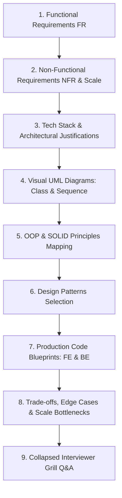

# ⚙️ Master System Design Problem Bank — Developer Tools & Infrastructure

> **Target Role:** Principal / Staff Architect / Senior LLD & HLD Engineers  
> **Framework:** Standardized 9-Step Breakdown (Functional Requirements, Scale & Estimates, Tech Stack, Visual UML Diagrams, OOP & SOLID Mapping, Design Patterns, Code Blueprints, Scale Bottlenecks, and Collapsed Grill Q&A).  
> **Navigation:** ⬅️ [Back to Master Problem Bank](../README.md) | 📅 [8-Week Roadmap](../../ROADMAP.md)

---

## 🧭 Category Overview: Developer Tools & Infrastructure (8 Problems)

| # | Problem Blueprint | Level | Key System Challenges & Architecture Focus | Master Guide Link |
|:---:|:---|:---:|:---|:---:|
| 1 | 📖 **Design URL Shortener** | `Medium` | Base62 Key Encoding, Key Generation Service (KGS), 301 vs 302 Redirection, Hot Cache | [01-Design-URL-Shortener.md](./01-Design-URL-Shortener.md) |
| 2 | 📖 **Design Logging Framework** | `Medium` | Severity Log Level Filter, Chain of Responsibility Appenders, Async Non-blocking Ring Buffer | [02-Design-Logging-Framework.md](./02-Design-Logging-Framework.md) |
| 3 | 📖 **Design Rate Limiter** | `Medium` | Token Bucket & Sliding Window Log Algorithms, Sub-1ms Latency, Redis Lua Scripts | [03-Design-Rate-Limiter.md](./03-Design-Rate-Limiter.md) |
| 4 | 📖 **Design In Memory File System** | `Hard` | Composite Pattern (Directory Tree & Files), Path Traversal Parser, Unix VFS Methods | [04-Design-In-Memory-File-System.md](./04-Design-In-Memory-File-System.md) |
| 5 | 📖 **Design Version Control System** | `Hard` | Content-Addressable Object Store (Blob, Tree, Commit), DAG History, Branch Pointer Head | [05-Design-Version-Control-System.md](./05-Design-Version-Control-System.md) |
| 6 | 📖 **Design Task Scheduler** | `Hard` | Min-Heap / DelayQueue Priority Queue, Cron Expression Parser, Worker Thread Pool Execution | [06-Design-Task-Scheduler.md](./06-Design-Task-Scheduler.md) |
| 7 | 📖 **Design Google Docs / Collaborative Editor** | `Hard` | Operational Transformation (OT) vs CRDTs, WebSocket Character Synchronization, Vector Clocks | [07-Design-Google-Docs-Collaborative-Editor.md](./07-Design-Google-Docs-Collaborative-Editor.md) |
| 8 | 📖 **Design Distributed Key-Value Store** | `Hard` | Consistent Hashing Ring, Tunable Quorum ($R + W > N$), Vector Clocks, Hinted Handoff | [08-Design-Distributed-Key-Value-Store.md](./08-Design-Distributed-Key-Value-Store.md) |

---

## 📐 Standardized 9-Step Problem Breakdown Framework

Every problem in this module strictly follows the enterprise 9-step system design workflow:

