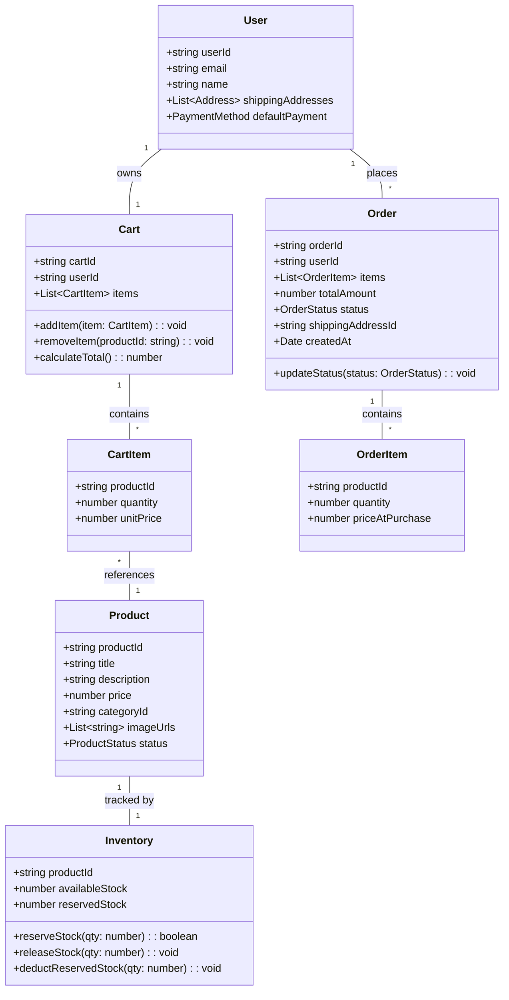
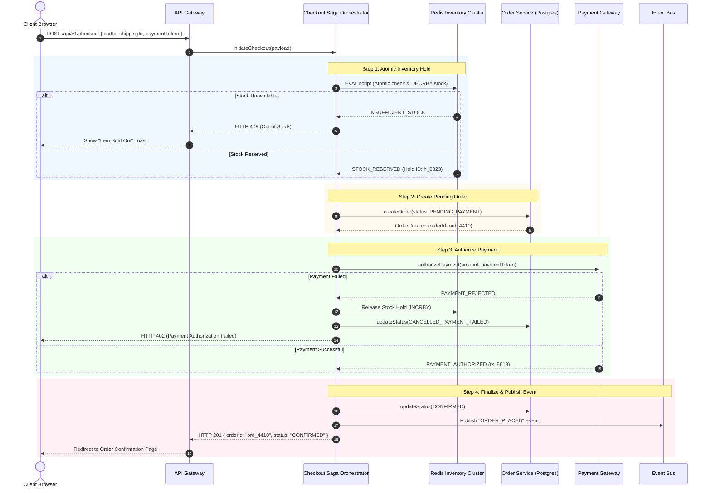
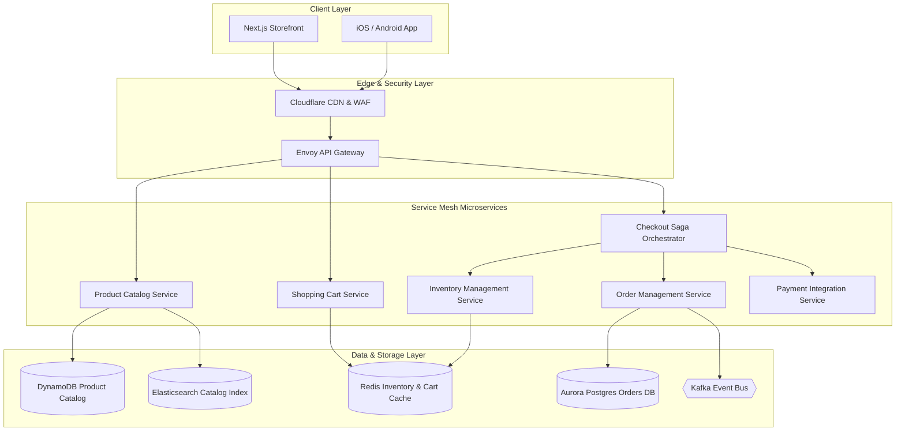

# 🛠️ Enterprise System Design Blueprint: Amazon (E-Commerce Platform)

> **Target Role:** Principal / Staff Architect / Senior LLD & HLD Engineers  
> **Product Perspective:** Building a multi-tenant, ultra-scalable e-commerce platform handling 300M active users, high-concurrency flash sales, real-time inventory management, and distributed order fulfillment.  
> **Navigation:** ⬅️ [Back to Category Index](./README.md) | ⬅️ [Back to Problem Bank Index](../README.md)

---

## 1. 🎯 Requirements & Product Scope

### 📋 Functional Requirements (FR)

1. **Product Catalog & Search:** Sellers can register items with categories, attributes, images, prices, and stock levels. Buyers can search and filter products by text keywords, categories, price range, and rating.
2. **Shopping Cart Management:** Users (guest or authenticated) can add, modify, and remove items in their persistent cart with real-time stock and price synchronization.
3. **Inventory & Flash Sale Management:** Atomic inventory reservation upon checkout initiation to prevent overselling, support for lightning deals and flash sales with time-bound holds.
4. **Order Processing & Saga Checkout:** Distributed order creation supporting payment processing, inventory deduction, seller notification, and shipping label generation using Saga Orchestration.
5. **Order Tracking & Fulfillment:** Order lifecycle state updates (Placed, Paid, Processing, Shipped, Out for Delivery, Delivered, Cancelled) with webhooks and customer notifications.
6. **Ratings & Reviews:** Verified purchasers can submit ratings (1-5 stars) and text reviews for products.

### ⚡ Non-Functional Requirements (NFR)

1. **High Availability & Fault Tolerance:** $99.999\%$ system availability ($<5.26$ minutes downtime per year) for critical checkout paths.
2. **Ultra-Low Latency:** Product catalog search $P_{99} < 50\text{ms}$; Order placement & inventory lock $P_{99} < 100\text{ms}$.
3. **Strict Data Consistency:** Zero overselling allowed (Strict serializability or pessimistic locking for inventory during flash sales). Eventual consistency acceptable for order tracking and recommendation feeds.
4. **Massive Scale Capacity:** 300 Million active users, 100,000 Peak Write QPS during Prime Day / Flash Sales, 1,000,000 Peak Read QPS for Product Pages.

---

## 2. 🧮 Scale & Quantitative Estimates

```
Traffic Estimates:
- Active Users: 300M DAU
- Daily Page Views: 3 Billion Views / day
- Average Read QPS: 3B / 86400 ≈ 34,700 QPS (Peak: 1,000,000 QPS)
- Daily Orders Created: 30 Million orders / day
- Average Write QPS: 30M / 86400 ≈ 350 QPS (Peak Checkout: 100,000 QPS during Flash Sales)

Storage Calculations (5-Year Projection):
- Product Catalog: 500 Million SKU items @ 5 KB avg size = 2.5 TB (DynamoDB / Cassandra)
- Order Records: 30M orders/day * 365 days * 5 years = 54.75 Billion Orders
- Order Payload: ~2 KB per order = 109.5 TB total order database storage
- Media / Product Images: 500M items * 5 images * 200 KB = 500 TB stored in S3 + CloudFront CDN

Bandwidth Estimates:
- Outbound Image / CDN Content: 1,000,000 QPS * 200 KB = 200 GB/sec (handled via CDN edge caching)
- API Payload Ingress/Egress: 100,000 QPS * 2 KB = 200 MB/sec ingress network bandwidth
```

---

## 3. 🛠️ Tech Stack & Architectural Justifications

| Layer / Component | Technology Choice | Architectural Rationale |
| :--- | :--- | :--- |
| **Client Layer** | Next.js 14 (App Router) + React | ISR (Incremental Static Regeneration) for static CDN delivery of product pages; dynamic hydration for cart and checkout. |
| **API Gateway** | Envoy / Kong | Rate limiting (Sliding Window Algorithm), JWT auth validation, gRPC-Web proxying, and request routing. |
| **Product Catalog DB** | Amazon DynamoDB / MongoDB | Document storage schema flexibility for varied product categories (electronics, apparel, groceries) with sub-10ms primary key lookups. |
| **Transactional DB** | PostgreSQL (Amazon Aurora) | Multi-AZ ACID compliant relational database for Order headers, Payments, and User Accounts. |
| **Distributed Cache & Locks** | Redis Cluster (ElastiCache) | Atomic counter decrements (`DECRBY`) and Redlock algorithm for lightning deal inventory reservation. |
| **Search Engine** | Elasticsearch Cluster | Inverted indices for fuzzy full-text search, multi-faceted filtering, and autocomplete queries. |
| **Event Bus & CDC** | Apache Kafka + Debezium | Distributed log for transaction CDC (Change Data Capture), Outbox Pattern events, order status streams, and microservice decoupling. |
| **Workflow Engine** | Temporal / AWS Step Functions | Distributed Saga Orchestration to manage multi-step checkout state transitions and saga rollbacks. |

---

## 4. 📐 Visual UML Diagrams

### 🏗️ Class Diagram (Low-Level Core Entities)



### 🔄 Sequence Diagram: Saga Orchestrated Checkout & Inventory Lock



### 🧩 Component & System Architecture Diagram (HLD)



---

## 5. 🧱 OOP & SOLID Principles Mapping

- **Single Responsibility Principle (SRP):** `InventoryService` strictly handles stock reservations and locks; `OrderService` handles persistence of order states; `PaymentService` manages third-party PSP interactions.
- **Open/Closed Principle (OCP):** Discount calculation uses a `DiscountStrategy` interface. Adding black friday deals, flash coupons, or tier-based prime discounts requires zero edits to `CheckoutEngine`.
- **Liskov Substitution Principle (LSP):** All payment processors (`StripeAdapter`, `PayPalAdapter`, `AmazonPayAdapter`) implement `PaymentGateway` and can be substituted without altering checkout workflow logic.
- **Interface Segregation Principle (ISP):** Clients depend on minimal interfaces (`ReadOnlyProductCatalog`, `InventoryReservationAPI`) rather than exposing full domain management methods.
- **Dependency Inversion Principle (DIP):** `CheckoutSagaOrchestrator` relies on high-level abstractions (`IInventoryRepository`, `IPaymentGateway`) injected via constructor interfaces.

---

## 6. 🎨 Design Patterns Applied

1. **Saga Pattern (Orchestration):** Coordinates multi-service checkout distributed transactions across Inventory, Payment, and Order domains with compensation rollback handlers on failures.
2. **Strategy Pattern:** Enforces customizable pricing rules via `DiscountStrategy` (Percentage, Fixed Amount, Buy-1-Get-1, Bundle Discount).
3. **Command Pattern:** Encapsulates order fulfillment state transitions (`ProcessOrderCommand`, `ShipOrderCommand`, `CancelOrderCommand`) allowing retry queues and audit trails.
4. **Factory Pattern:** `PaymentGatewayFactory` instantiates appropriate payment gateway adapters dynamically based on region and customer payment instrument.
5. **State Pattern:** Governs the `OrderStatus` transitions ensuring an order cannot transition directly from `PENDING` to `DELIVERED` without passing through `PAID` and `SHIPPED`.

---

## 7. 💻 Production Code Blueprint (TypeScript)

### 1. Domain Entities & Discount Strategy

```typescript
export enum OrderStatus {
  PENDING_PAYMENT = 'PENDING_PAYMENT',
  PAID = 'PAID',
  PROCESSING = 'PROCESSING',
  SHIPPED = 'SHIPPED',
  DELIVERED = 'DELIVERED',
  CANCELLED = 'CANCELLED',
}

export interface ProductItem {
  productId: string;
  price: number;
  quantity: number;
}

export interface DiscountStrategy {
  applyDiscount(items: ProductItem[], subtotal: number): number;
}

export class PrimeMemberDiscount implements DiscountStrategy {
  applyDiscount(items: ProductItem[], subtotal: number): number {
    // 10% discount for Prime members
    return subtotal * 0.90;
  }
}

export class PercentageCouponDiscount implements DiscountStrategy {
  constructor(private percentage: number) {}
  applyDiscount(items: ProductItem[], subtotal: number): number {
    return subtotal * (1 - this.percentage / 100);
  }
}
```

### 2. Redis-Based Atomic Inventory Hold Service

```typescript
import Redis from 'ioredis';

export class InventoryService {
  constructor(private redis: Redis) {}

  /**
   * Lua Script for Atomic Inventory Check and Reservation
   * Prevents Race Conditions during Flash Sales
   */
  private reservationScript = `
    local stockKey = KEYS[1]
    local holdKey = KEYS[2]
    local requestedQty = tonumber(ARGV[1])
    local ttlSeconds = tonumber(ARGV[2])

    local currentStock = tonumber(redis.call('GET', stockKey) or "0")
    if currentStock < requestedQty then
      return -1 -- Insufficient stock
    end

    redis.call('DECRBY', stockKey, requestedQty)
    redis.call('SET', holdKey, requestedQty, 'EX', ttlSeconds)
    return 1 -- Success
  `;

  async reserveStock(productId: string, holdId: string, quantity: number, ttlSeconds: number = 600): Promise<boolean> {
    const stockKey = `inventory:${productId}:stock`;
    const holdKey = `inventory:${productId}:hold:${holdId}`;

    const result = await this.redis.eval(
      this.reservationScript,
      2,
      stockKey,
      holdKey,
      quantity,
      ttlSeconds
    );

    return result === 1;
  }

  async releaseHold(productId: string, holdId: string, quantity: number): Promise<void> {
    const stockKey = `inventory:${productId}:stock`;
    const holdKey = `inventory:${productId}:hold:${holdId}`;

    const exists = await this.redis.del(holdKey);
    if (exists > 0) {
      await this.redis.incrby(stockKey, quantity);
    }
  }
}
```

### 3. Saga Checkout Orchestrator Implementation

```typescript
export interface PaymentGateway {
  authorize(amount: number, token: string): Promise<{ success: boolean; transactionId?: string }>;
}

export interface OrderRepository {
  createOrder(userId: string, items: ProductItem[], total: number): Promise<string>;
  updateStatus(orderId: string, status: OrderStatus): Promise<void>;
}

export class CheckoutSagaOrchestrator {
  constructor(
    private inventoryService: InventoryService,
    private paymentGateway: PaymentGateway,
    private orderRepo: OrderRepository,
    private discountStrategy: DiscountStrategy
  ) {}

  async executeCheckout(
    userId: string,
    items: ProductItem[],
    paymentToken: string
  ): Promise<{ success: boolean; orderId?: string; error?: string }> {
    const holdId = `hold_${Date.now()}_${userId}`;
    const reservedItems: ProductItem[] = [];

    // Step 1: Reserve Inventory for all items
    for (const item of items) {
      const reserved = await this.inventoryService.reserveStock(item.productId, holdId, item.quantity);
      if (!reserved) {
        // Rollback already reserved items
        for (const prev of reservedItems) {
          await this.inventoryService.releaseHold(prev.productId, holdId, prev.quantity);
        }
        return { success: false, error: `Item ${item.productId} is out of stock.` };
      }
      reservedItems.push(item);
    }

    // Step 2: Compute Total & Apply Discount
    const rawSubtotal = items.reduce((acc, curr) => acc + curr.price * curr.quantity, 0);
    const finalTotal = this.discountStrategy.applyDiscount(items, rawSubtotal);

    // Step 3: Create Pending Order in Postgres
    let orderId: string;
    try {
      orderId = await this.orderRepo.createOrder(userId, items, finalTotal);
    } catch (err) {
      // Compensating action: Release stock holds
      for (const item of reservedItems) {
        await this.inventoryService.releaseHold(item.productId, holdId, item.quantity);
      }
      return { success: false, error: 'Failed to record order.' };
    }

    // Step 4: Authorize Payment
    const paymentResult = await this.paymentGateway.authorize(finalTotal, paymentToken);
    if (!paymentResult.success) {
      // Compensating action: Release stock holds & cancel order
      for (const item of reservedItems) {
        await this.inventoryService.releaseHold(item.productId, holdId, item.quantity);
      }
      await this.orderRepo.updateStatus(orderId, OrderStatus.CANCELLED);
      return { success: false, error: 'Payment authorization failed.' };
    }

    // Step 5: Finalize Order Success
    await this.orderRepo.updateStatus(orderId, OrderStatus.PAID);
    return { success: true, orderId };
  }
}
```

---

## 8. 🔀 High-Level Design (HLD) & Scale Bottlenecks

### 1. Flash Sale Inventory Overselling Prevention
- **Problem:** During a Prime Day lightning deal (e.g. 1,000 units of a high-demand TV available at 90% discount), 500,000 requests hit the checkout endpoint within 1 second.
- **Solution:** 
  1. Pre-warm Redis counters with available stock before sale commencement (`SET inventory:item_123:stock 1000`).
  2. Execute atomic Lua scripts on Redis clusters to perform `DECRBY`. Redis runs on single-threaded event loops per shard, guaranteeing zero race conditions and zero overselling.
  3. Requests receiving negative responses are shed instantly at the API Gateway with HTTP 409.

### 2. Dual-Write Problem & Transactional Outbox Pattern
- **Problem:** Updating PostgreSQL Orders DB and publishing an event to Kafka in separate operations can lead to inconsistency if Kafka network times out after DB commit.
- **Solution:** Use the **Transactional Outbox Pattern**. Write the order record and an `outbox` record inside a single PostgreSQL ACID transaction (`BEGIN; INSERT INTO orders...; INSERT INTO outbox...; COMMIT;`). A Debezium CDC worker reads the Postgres WAL log and reliably streams outbox records into Kafka topics with at-least-once delivery guarantees.

---

## ❓ 9. Collapsed Senior/Staff Level Grill Q&A

<details>
<summary>❓ How do you prevent inventory leaks if a user holds an item in checkout but abandons payment or closes their browser?</summary>

**Answer:**  
Inventory holds are stored in Redis with an explicit TTL (e.g., 10 minutes) using `SET key value EX 600`. When a hold expires, Redis key eviction emits a KeySpace notification (`__keyevent@0__:expired`). A background cleanup worker listens to these notifications and automatically increments the main stock counter back (`INCRBY inventory:item_123:stock quantity`). Additionally, a scheduled cron job reconciles orphaned orders in `PENDING_PAYMENT` state older than 10 minutes against payment receipts.

</details>

<details>
<summary>❓ How do you handle database sharding for the Order DB as order volume hits billions of rows?</summary>

**Answer:**  
We shard PostgreSQL using `user_id` as the primary Hash Shard Key. This ensures all order history for a single user resides on the same database shard, enabling fast single-shard queries for customer order dashboards (`SELECT * FROM orders WHERE user_id = X`). For seller fulfillment queries (`SELECT * FROM order_items WHERE seller_id = Y`), we maintain an asynchronous secondary read-index in DynamoDB or Elasticsearch populated via Kafka change streams.

</details>

<details>
<summary>❓ Why choose Saga Orchestration over Saga Choreography for Amazon Checkout?</summary>

**Answer:**  
Saga Orchestration centralizes execution state within a dedicated workflow engine (e.g., Temporal / AWS Step Functions). In complex e-commerce checkouts involving 6+ microservices (Inventory, Pricing, Payment, Fraud, Tax, Shipping), choreography creates hard-to-trace event loops and implicit coupling. Orchestration provides explicit error handling, visible status tracking, structured compensating step rollbacks, and easier auditability for high-value financial operations.

</details>
