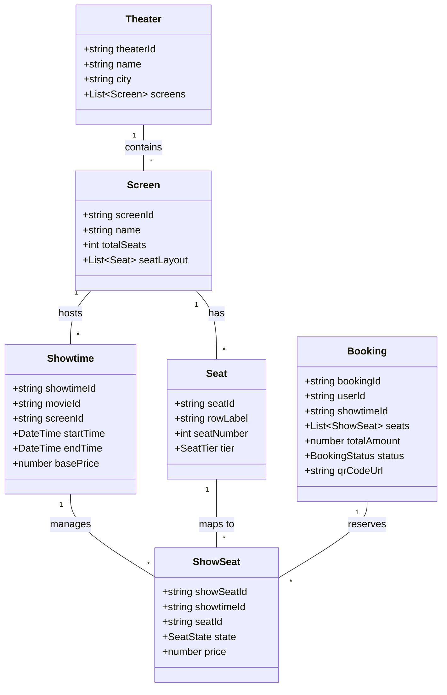
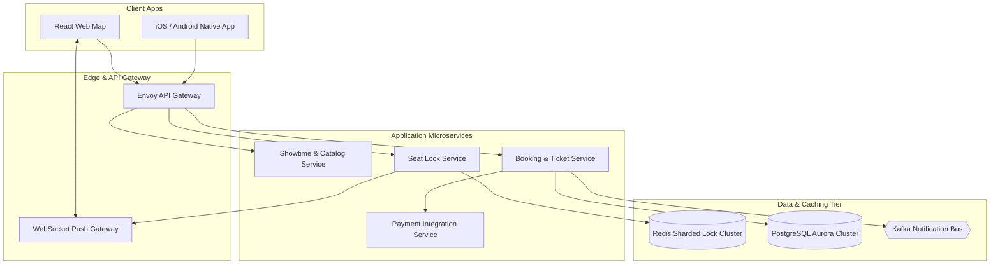

# 🛠️ Enterprise System Design Blueprint: Movie Booking System (BookMyShow / Fandango)

> **Target Role:** Principal / Staff Architect / Senior LLD & HLD Engineers  
> **Product Perspective:** Building a high-concurrency movie ticket reservation platform serving 10M DAU, handling blockbuster release seat spikes with zero double-bookings and sub-50ms seat map rendering.  
> **Navigation:** ⬅️ [Back to Category Index](./README.md) | ⬅️ [Back to Problem Bank Index](../README.md)

---

## 1. 🎯 Requirements & Product Scope

### 📋 Functional Requirements (FR)

1. **City, Theater & Showtime Management:** Users can search movies by city, select theaters, view available showtimes, and inspect screen formats (IMAX 3D, 4DX, 2D).
2. **Interactive Seat Map Grid:** Display real-time seat availability maps with distinct categories (VIP, Premium, Executive) and real-time status indicators (Available, Temporarily Locked, Booked).
3. **Atomic Seat Locking (10-Min Hold):** When a user selects 1-10 seats, the system places a temporary 10-minute hold lock. No other user can select these seats during this window.
4. **Checkout & Payment Integration:** Complete payment within the 10-minute hold window. Upon success, seats transition to `BOOKED` and digital tickets with QR codes are generated.
5. **Seat Hold Expiration:** If payment times out or fails, held seats automatically revert to `AVAILABLE` state instantly via distributed event triggers.
6. **Dynamic Pricing Strategy:** Ticket prices vary dynamically based on seat tier, showtime (weekend vs weekday, morning vs evening), and movie popularity.

### ⚡ Non-Functional Requirements (NFR)

1. **Strict Double-Booking Prevention:** 100% atomicity guarantee. Zero tolerance for double-booking the same physical seat for a showtime.
2. **Low Read & Seat Map Latency:** Seat map state retrieval $P_{99} < 30\text{ms}$; Seat hold reservation response $P_{99} < 50\text{ms}$.
3. **High Concurrency Capacity:** Handle blockbuster movie releases (e.g. Marvel/Avatar ticket drops) with peak load of 50,000 QPS hitting a single showtime seat map.
4. **Real-time WebSockets Sync:** Instant seat status updates pushed via WebSockets to all concurrent users viewing the same showtime seat layout.

---

## 2. 🧮 Scale & Quantitative Estimates

```
Traffic & Concurrency Estimates:
- Active Users: 10M DAU
- Daily Tickets Sold: 2 Million tickets / day
- Average Read QPS: 10,000 QPS
- Peak Ticket Drop QPS: 50,000 QPS focused on top 100 showtimes during blockbuster releases.

Storage Calculations (3-Year Projection):
- Cinemas & Screens: 5,000 Cinemas, 25,000 Screens total
- Showtimes: 100,000 Showtimes per day
- Seats per Screen: Avg 200 seats → 20 Million seat instances generated daily
- Booking Records: 2M bookings/day * 365 days * 3 years = 2.19 Billion records
- Booking Payload: ~1 KB per booking record = 2.19 TB (PostgreSQL cluster)
- Seat Map Caching: 100,000 active showtimes * 200 seats * 4 bytes = ~80 MB total hot memory footprint in Redis.
```

---

## 3. 🛠️ Tech Stack & Architectural Justifications

| Layer / Component | Technology Choice | Architectural Rationale |
| :--- | :--- | :--- |
| **Frontend Framework** | React / Next.js + WebSockets | Canvas/SVG rendering for fast interactive seat maps; WebSocket client for real-time seat lock state updates. |
| **API Gateway** | Kong / Envoy Gateway | JWT auth, TLS termination, IP rate limiting, and WebSocket connection upgrade management. |
| **Primary Relational DB** | PostgreSQL (Amazon Aurora) | Strict relational integrity and ACID transactions (`SELECT ... FOR UPDATE` or SQL constraints) for seat booking confirmations. |
| **Distributed Seat Lock Cache**| Redis Cluster (Single-threaded Shards) | Atomic Redis Bitmaps / Keys with 600-second TTL for zero-latency temporary seat locking. |
| **Real-time Push Gateway** | WebSocket Cluster (Socket.io / Go) | Broadcast seat lock state transitions to all active users viewing the same showtime grid. |
| **Async Message Bus** | Apache Kafka | Decoupled ticket generation, email/SMS notifications, and analytics processing. |

---

## 4. 📐 Visual UML Diagrams

### 🏗️ Class Diagram (Seat Reservation Entities)



### 🔄 Sequence Diagram: Seat Hold, Payment & Expiration Workflow

```mermaid
sequenceDiagram
    autonumber
    actor Customer as User Mobile App
    participant Gateway as API Gateway
    participant BookingSvc as Booking Service
    participant Redis as Redis Lock Cluster
    participant WS as WebSocket Gateway
    participant DB as PostgreSQL DB
    participant Payment as Payment Gateway

    Customer->>Gateway: POST /api/v1/showtimes/:id/hold-seats { seatIds: ["A1", "A2"] }
    Gateway->>BookingSvc: holdSeats(userId, showtimeId, seatIds)
    
    rect rgb(240, 248, 255)
        Note over BookingSvc,Redis: Atomic Redis Lock Execution
        BookingSvc->>Redis: EVAL lua_hold_seats(showtimeId, seatIds, userId, ttl: 600)
        alt Seats Already Locked/Booked
            Redis-->>BookingSvc: LOCK_FAILED
            BookingSvc-->>Customer: HTTP 409 (Seats Unavailable)
        else Lock Acquired Successfully
            Redis-->>BookingSvc: LOCK_SUCCESS (Expires in 600s)
            BookingSvc->>WS: Broadcast "SEATS_LOCKED" { showtimeId, seatIds }
            WS-->>Customer: Real-time UI Update (Seats orange)
            BookingSvc-->>Customer: HTTP 200 { holdToken: "ht_7721", expiresAt: 600 }
        end
    end

    rect rgb(255, 250, 240)
        Note over Customer,Payment: Customer Completes Checkout
        Customer->>Gateway: POST /api/v1/bookings/confirm { holdToken, paymentDetails }
        Gateway->>BookingSvc: confirmBooking(holdToken, paymentDetails)
        BookingSvc->>Payment: processPayment(amount)
        
        alt Payment Successful
            Payment-->>BookingSvc: PAYMENT_SUCCESS
            BookingSvc->>DB: BEGIN TX; INSERT INTO bookings; UPDATE show_seats SET state='BOOKED'; COMMIT;
            BookingSvc->>Redis: DEL hold keys; SET showtime:booked_seats
            BookingSvc->>WS: Broadcast "SEATS_BOOKED" { seatIds }
            BookingSvc-->>Customer: HTTP 201 { bookingId: "bk_9901", ticketQR }
        else Payment Failed / Expired
            Payment-->>BookingSvc: PAYMENT_FAILED
            BookingSvc->>Redis: DEL hold keys (Release Lock)
            BookingSvc->>WS: Broadcast "SEATS_RELEASED" { seatIds }
            BookingSvc-->>Customer: HTTP 400 (Booking Failed)
        end
    end
```

### 🧩 Component & System Architecture Diagram (HLD)



---

## 5. 🧱 OOP & SOLID Principles Mapping

- **Single Responsibility Principle (SRP):** `SeatLockManager` exclusively handles short-term distributed locks and Redis TTL; `BookingManager` manages database persistence; `TicketGenerator` creates QR PDF assets.
- **Open/Closed Principle (OCP):** Dynamic pricing uses `SeatPricingStrategy`. Adding student discounts, corporate bulk rates, or surge multipliers doesn't break existing ticket processing code.
- **Liskov Substitution Principle (LSP):** All pricing tier strategies (`VipPricingStrategy`, `RegularPricingStrategy`, `EarlyBirdPricingStrategy`) strictly conform to `PricingStrategy` signature.
- **Interface Segregation Principle (ISP):** Expose thin interfaces (`ISeatAvailabilityReader`, `ISeatLockWriter`) so query services cannot invoke lock mutation methods.
- **Dependency Inversion Principle (DIP):** `BookingService` relies on abstract `ILockProvider` and `IPaymentGateway` interfaces instead of concrete Redis/Stripe clients.

---

## 6. 🎨 Design Patterns Applied

1. **State Pattern:** Governs `ShowSeat` state transitions (`AvailableState` -> `HeldState` -> `BookedState` or back to `AvailableState`). Invalid transitions (e.g., directly from `Available` to `Booked` without a valid `HoldToken`) throw exceptions.
2. **Strategy Pattern:** Enforces seat pricing logic based on seat location tier, showtime, and demand volume.
3. **Command Pattern:** Encapsulates `HoldSeatCommand` and `ReleaseSeatCommand` for execution with automatic timer-driven undo capability on TTL expiry.
4. **Observer Pattern (WebSocket Broadcaster):** Seat status state updates act as events notifying connected client websockets to update seat grids live across all browsers.

---

## 7. 💻 Production Code Blueprint (TypeScript)

### 1. Domain Entities & Seat State Pattern

```typescript
export enum SeatState {
  AVAILABLE = 'AVAILABLE',
  HELD = 'HELD',
  BOOKED = 'BOOKED',
  OUT_OF_SERVICE = 'OUT_OF_SERVICE',
}

export enum SeatTier {
  REGULAR = 'REGULAR',
  PREMIUM = 'PREMIUM',
  VIP = 'VIP',
}

export interface PricingStrategy {
  calculatePrice(basePrice: number, tier: SeatTier, showtimeDate: Date): number;
}

export class DynamicSeatPricingStrategy implements PricingStrategy {
  calculatePrice(basePrice: number, tier: SeatTier, showtimeDate: Date): number {
    let price = basePrice;
    
    // Tier multipliers
    if (tier === SeatTier.PREMIUM) price *= 1.25;
    if (tier === SeatTier.VIP) price *= 1.60;

    // Weekend surge (Fri-Sun)
    const day = showtimeDate.getDay();
    if (day === 0 || day === 5 || day === 6) {
      price *= 1.15;
    }

    return Math.round(price * 100) / 100;
  }
}
```

### 2. Redis Atomic Multi-Seat Hold Lock Service

```typescript
import Redis from 'ioredis';

export class SeatLockService {
  constructor(private redis: Redis) {}

  /**
   * Atomic Lua Script for Multi-Seat Hold Reservation
   * Checks if ALL requested seats are FREE, then locks them atomically under a Hold Token.
   */
  private holdLuaScript = `
    local showtimeId = KEYS[1]
    local holdToken = ARGV[1]
    local ttlSeconds = tonumber(ARGV[2])
    local numSeats = #ARGV - 2

    -- Step 1: Check availability of ALL requested seats
    for i = 3, #ARGV do
      local seatId = ARGV[i]
      local seatKey = "showtime:" .. showtimeId .. ":seat:" .. seatId
      local status = redis.call('GET', seatKey)
      if status ~= false then
        return -1 -- Seat is already held or booked!
      end
    end

    -- Step 2: Acquire locks for ALL seats under Hold Token
    for i = 3, #ARGV do
      local seatId = ARGV[i]
      local seatKey = "showtime:" .. showtimeId .. ":seat:" .. seatId
      redis.call('SET', seatKey, holdToken, 'EX', ttlSeconds)
    end

    return 1 -- Success
  `;

  async acquireSeatHold(
    showtimeId: string,
    seatIds: string[],
    holdToken: string,
    ttlSeconds: number = 600
  ): Promise<boolean> {
    const keys = [showtimeId];
    const args = [holdToken, ttlSeconds.toString(), ...seatIds];

    const result = await this.redis.eval(this.holdLuaScript, keys.length, ...keys, ...args);
    return result === 1;
  }

  async releaseSeatHold(showtimeId: string, seatIds: string[]): Promise<void> {
    const pipeline = this.redis.pipeline();
    for (const seatId of seatIds) {
      pipeline.del(`showtime:${showtimeId}:seat:${seatId}`);
    }
    await pipeline.exec();
  }
}
```

### 3. Transactional Booking Confirmation Manager

```typescript
export interface DatabasePool {
  query(sql: string, params?: any[]): Promise<any>;
  getTransactionClient(): Promise<any>;
}

export class BookingManager {
  constructor(
    private seatLockService: SeatLockService,
    private dbPool: DatabasePool,
    private pricingStrategy: PricingStrategy
  ) {}

  async confirmBooking(
    userId: string,
    showtimeId: string,
    seatIds: string[],
    holdToken: string,
    basePrice: number,
    showtimeDate: Date
  ): Promise<{ bookingId: string; totalAmount: number }> {
    const client = await this.dbPool.getTransactionClient();
    try {
      await client.query('BEGIN');

      // 1. Double check SQL Row Lock for ShowSeats to guarantee persistent consistency
      const selectSeatsQuery = `
        SELECT seat_id, tier, state 
        FROM show_seats 
        WHERE showtime_id = $1 AND seat_id = ANY($2) 
        FOR UPDATE
      `;
      const seatRows = await client.query(selectSeatsQuery, [showtimeId, seatIds]);

      if (seatRows.rows.length !== seatIds.length) {
        throw new Error('Invalid seat selection');
      }

      for (const row of seatRows.rows) {
        if (row.state === SeatState.BOOKED) {
          throw new Error(`Seat ${row.seat_id} is already permanently booked.`);
        }
      }

      // 2. Calculate Total Price
      let totalAmount = 0;
      for (const row of seatRows.rows) {
        totalAmount += this.pricingStrategy.calculatePrice(basePrice, row.tier, showtimeDate);
      }

      // 3. Insert Booking Record
      const bookingId = `bk_${Date.now()}_${Math.floor(Math.random() * 1000)}`;
      await client.query(
        `INSERT INTO bookings (id, user_id, showtime_id, total_amount, status, created_at) VALUES ($1, $2, $3, $4, 'CONFIRMED', NOW())`,
        [bookingId, userId, showtimeId, totalAmount]
      );

      // 4. Update ShowSeats state to BOOKED
      await client.query(
        `UPDATE show_seats SET state = 'BOOKED', booking_id = $1 WHERE showtime_id = $2 AND seat_id = ANY($3)`,
        [bookingId, showtimeId, seatIds]
      );

      await client.query('COMMIT');

      // 5. Cleanup Redis Temporary Locks
      await this.seatLockService.releaseSeatHold(showtimeId, seatIds);

      return { bookingId, totalAmount };
    } catch (error) {
      await client.query('ROLLBACK');
      throw error;
    } finally {
      client.release();
    }
  }
}
```

---

## 8. 🔀 High-Level Design (HLD) & Scale Bottlenecks

### 1. Blockbuster Release Thundering Herd Problem
- **Problem:** 100,000 requests hit the seat layout endpoint of a single IMAX screening within 5 seconds of opening.
- **Solution:** 
  1. Cache the entire seat map structure (static geometry, seat numbers, tiers) on CDN edge nodes.
  2. Cache dynamic availability state as a Redis Bitfield/Bitmap (`GETBIT showtime:123:availability seat_index`).
  3. When seats are held, update the bit (`SETBIT showtime:123:availability seat_index 1`) in single-digit microseconds.

### 2. Synchronization of Real-time Seat Maps Across Clients
- **Problem:** User A holds Seat F10. User B, C, D looking at the same showtime grid must see F10 turn orange instantly without constantly polling the backend.
- **Solution:** Publish seat status events to a Redis Pub/Sub topic channel `showtime:123:events`. WebSocket gateway instances subscribed to this topic broadcast `{ type: "SEAT_HOLD", seatId: "F10" }` frames down open WebSocket channels to connected clients.

---

## ❓ 9. Collapsed Senior/Staff Level Grill Q&A

<details>
<summary>❓ How do you handle network failure right after the customer's payment succeeds, before your server confirms the booking?</summary>

**Answer:**  
We implement an **Idempotent Payment Callback Webhook**. The payment gateway sends an asynchronous server-to-server webhook containing the `holdToken` and `transactionId`. Even if the client's browser disconnected, the backend process consumes the webhook, verifies the active Redis seat hold using the `holdToken`, acquires SQL `FOR UPDATE` row locks, converts the seats to `BOOKED`, and emails/SMS the ticket QR code to the registered user.

</details>

<details>
<summary>❓ Why use Redis Bitmaps / Keys for temporary seat holds instead of storing holds directly in PostgreSQL?</summary>

**Answer:**  
PostgreSQL row locks during heavy seat reservation competition cause high database connection pool exhaustion, lock contention, and high latencies (>500ms). Redis holds locks in-memory using atomic Lua scripts in $<2\text{ms}$. Storing temporary locks in Redis protects the primary relational database from read/write query storms, reserving PostgreSQL exclusively for durable, finalized bookings.

</details>

<details>
<summary>❓ How do you prevent users from writing automated scripts/bots to lock up entire theater seat maps?</summary>

**Answer:**  
1. **CAPTCHA Challenge:** Trigger Google reCAPTCHA / Cloudflare Turnstile prior to executing the `holdSeats` API call.
2. **Account Rate Limits:** Enforce sliding window limits (maximum 2 active hold tokens per user account; max 10 seat hold requests per hour per IP).
3. **Session Verification:** Require verified mobile phone number OTP prior to permitting seat holds during high-demand movie drops.

</details>
