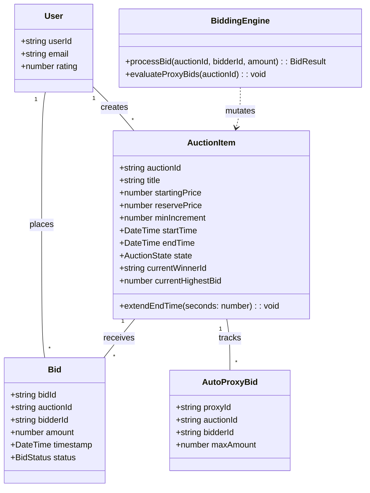
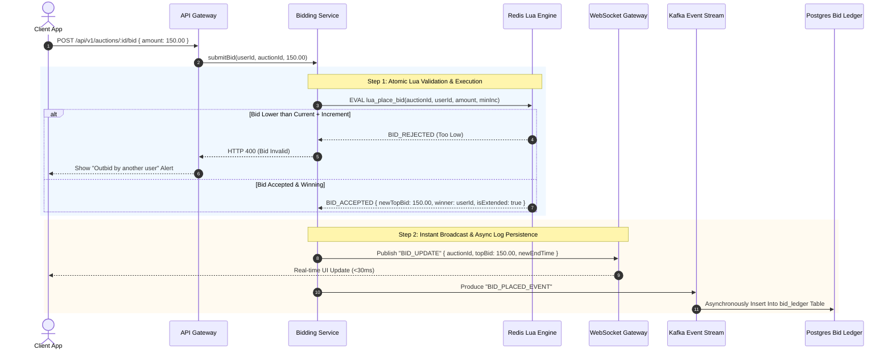
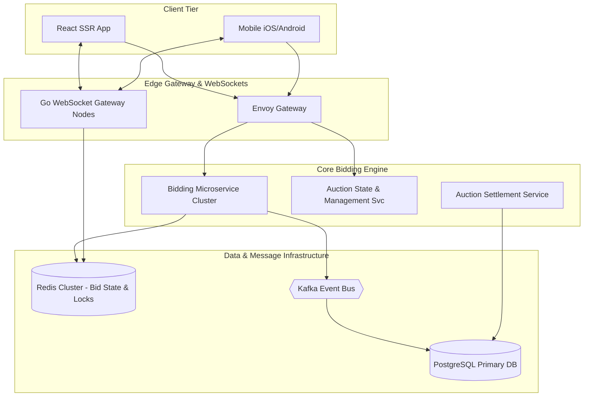

# 🛠️ Enterprise System Design Blueprint: Online Auction System (eBay / Sotheby's)

> **Target Role:** Principal / Staff Architect / Senior LLD & HLD Engineers  
> **Product Perspective:** Building an ultra-low-latency real-time online bidding platform serving 10M DAU, processing sub-20ms bid validations, auto-proxy bidding, anti-sniping extensions, and financial escrow settlements.  
> **Navigation:** ⬅️ [Back to Category Index](./README.md) | ⬅️ [Back to Problem Bank Index](../README.md)

---

## 1. 🎯 Requirements & Product Scope

### 📋 Functional Requirements (FR)

1. **Auction Listing Creation:** Sellers can list items with title, media, reserve price, starting bid price, bid increment rules, and scheduled start/end timestamps.
2. **Real-time Bid Placement:** Buyers can place manual bids or set up an **Auto-Proxy Maximum Bid** (system automatically places the minimal required incremental bid on their behalf up to their maximum threshold).
3. **Sub-20ms Bid Validation:** Atomic bid verification ensuring new bids exceed current highest bid + minimum increment step, with instantaneous execution.
4. **Anti-Sniping Protection:** If a valid bid is placed within the final 2 minutes of an auction, automatically extend the auction duration by an additional 5 minutes.
5. **Real-time Live Bid Broadcast:** Broadcast top bid changes, highest bidder masked identity, and updated countdown timers live to all connected bidders via WebSockets/SSE.
6. **Auction Settlement & Payment Escrow:** Upon auction expiration, automatically transition state to `ENDED`, lock winning bid, pre-authorize buyer payment, and initiate seller escrow payout.

### ⚡ Non-Functional Requirements (NFR)

1. **Strict Serializability & Determinism:** Exactly-once ordering of incoming bids for a single auction. Zero possibility of accepting two simultaneous bids at the same price.
2. **Sub-20ms Latency:** Bid placement confirmation response $P_{99} < 20\text{ms}$; WebSocket notification broadcast $P_{99} < 50\text{ms}$.
3. **High Concurrency Capacity:** Support 100,000 QPS bid submissions targeting a viral auction item in its final 60 seconds.
4. **Financial Durability:** 100% immutable audit log of all placed bids for dispute resolution and financial compliance.

---

## 2. 🧮 Scale & Quantitative Estimates

```
Traffic & Bid Volume:
- Active Users: 10M DAU
- Concurrent Active Auctions: 1 Million live auctions
- Daily Bids Placed: 50 Million bids / day
- Average Write QPS: 580 QPS (Normal load)
- Peak Hot Auction QPS: 100,000 QPS hitting top 50 expiring auctions simultaneously.

Storage Calculations (5-Year Projection):
- Auction Listings: 1M active * 365 days * 5 years = 1.825 Billion Auction Records @ 2 KB = 3.65 TB
- Bid Ledger: 50M bids/day * 365 days * 5 years = 91.25 Billion Bid Entries @ 200 bytes = 18.25 TB (TimescaleDB / Postgres Partitioned)
- In-Memory Cache (Redis): 1M active auctions * 100 bytes (current bid, leader user ID, max proxy, end timestamp) = ~100 MB memory footprint.
```

---

## 3. 🛠️ Tech Stack & Architectural Justifications

| Layer / Component | Technology Choice | Architectural Rationale |
| :--- | :--- | :--- |
| **Client Frontend** | Next.js 14 + React + Socket.io | Fast SSR for auction catalog; persistent WebSocket connection for real-time live bid feeds and countdown timer sync. |
| **API Gateway** | Envoy API Gateway | Handles gRPC / WebSocket proxying, rate limiting, and JWT authentication token inspection. |
| **In-Memory Bidding Engine** | Redis Cluster (Lua Scripting) | Executes atomic bid validation, auto-proxy calculations, and top-bid state updates in $<1\text{ms}$. |
| **Persistent Bid Ledger DB** | PostgreSQL / CockroachDB | Append-only partitioned table storing immutable bid logs with foreign key constraints to user and auction tables. |
| **Event Bus & Stream Processor**| Apache Kafka + Flink | Streams raw bid logs for real-time analytics, fraud detection (shill bidding detection), and search index updates. |
| **Real-time Push Gateway** | Go WebSocket Microservice | Dedicated lightweight Go WebSocket nodes subscribed to Redis Pub/Sub channels to broadcast top bids to millions of client devices. |

---

## 4. 📐 Visual UML Diagrams

### 🏗️ Class Diagram (Auction Core Domain)



### 🔄 Sequence Diagram: High-Concurrency Bid & Anti-Sniping Workflow



### 🧩 Component & System Architecture Diagram (HLD)



---

## 5. 🧱 OOP & SOLID Principles Mapping

- **Single Responsibility Principle (SRP):** `BiddingEngine` validates bid increments and atomic state; `ProxyBiddingManager` handles maximum bid calculations; `SettlementProcessor` coordinates escrow payment fulfillment.
- **Open/Closed Principle (OCP):** Incremental bidding logic uses a `BidIncrementStrategy` interface. Custom step schedules (e.g., $10 steps below $100, $50 steps above $1000) can be swapped without changing the core bid pipeline.
- **Liskov Substitution Principle (LSP):** All auto-bidding implementations (`StandardProxyBidder`, `ReservePriceProxyBidder`) adhere strictly to `ProxyBiddingStrategy`.
- **Interface Segregation Principle (ISP):** Clients depend on lean interfaces (`IBidReader`, `IBidWriter`) preventing direct access to sensitive administrative interfaces.
- **Dependency Inversion Principle (DIP):** `BiddingService` injects high-level `IBidLedgerStore` and `IRealtimeNotifier` abstractions.

---

## 6. 🎨 Design Patterns Applied

1. **Strategy Pattern:** Implements flexible bid increment rules and anti-sniping extension policies via `BidIncrementStrategy` and `AntiSnipingStrategy`.
2. **Command Pattern:** Encapsulates bid executions inside `PlaceBidCommand` objects, facilitating async queueing, audit logs, and transaction rollbacks.
3. **Observer Pattern:** Broadcasters monitor top bid mutations in Redis and publish events to client WebSockets, dynamically updating auction timers and active lead indicators across millions of UI views.
4. **State Pattern:** Manages `AuctionState` transitions (`DRAFT` -> `ACTIVE` -> `EXTENDED` -> `ENDED` -> `SETTLED`), ensuring no bids are accepted on non-active auctions.

---

## 7. 💻 Production Code Blueprint (TypeScript)

### 1. Domain Entities & Bidding Rules

```typescript
export enum AuctionState {
  DRAFT = 'DRAFT',
  ACTIVE = 'ACTIVE',
  EXTENDED = 'EXTENDED',
  ENDED = 'ENDED',
  SETTLED = 'SETTLED',
}

export interface BidResult {
  success: boolean;
  currentHighestBid: number;
  currentHighestBidderId: string;
  isExtended: boolean;
  newEndTime?: Date;
  error?: string;
}

export interface BidIncrementStrategy {
  getMinIncrement(currentBid: number): number;
}

export class StandardBidIncrementStrategy implements BidIncrementStrategy {
  getMinIncrement(currentBid: number): number {
    if (currentBid < 100) return 5;
    if (currentBid < 1000) return 25;
    if (currentBid < 10000) return 100;
    return 500;
  }
}
```

### 2. Redis Atomic Lua Bidding Engine

```typescript
import Redis from 'ioredis';

export class RedisBiddingEngine {
  constructor(private redis: Redis) {}

  /**
   * Atomic Lua Script for Bid Processing and Anti-Sniping Evaluation
   */
  private placeBidLuaScript = `
    local auctionKey = KEYS[1]
    local userId = ARGV[1]
    local newBidAmount = tonumber(ARGV[2])
    local minIncrement = tonumber(ARGV[3])
    local nowTimestamp = tonumber(ARGV[4])
    local antiSnipeWindowSeconds = tonumber(ARGV[5])
    local extensionSeconds = tonumber(ARGV[6])

    -- Step 1: Fetch Auction State
    local state = redis.call('HGET', auctionKey, 'state')
    if state ~= 'ACTIVE' and state ~= 'EXTENDED' then
      return {0, "AUCTION_NOT_ACTIVE", 0, "", 0}
    end

    local currentHighestBid = tonumber(redis.call('HGET', auctionKey, 'highestBid') or "0")
    local endTime = tonumber(redis.call('HGET', auctionKey, 'endTime'))

    if nowTimestamp >= endTime then
      redis.call('HSET', auctionKey, 'state', 'ENDED')
      return {0, "AUCTION_EXPIRED", currentHighestBid, "", 0}
    end

    -- Step 2: Validate Minimum Bid Step
    local requiredBid = currentHighestBid + minIncrement
    if newBidAmount < requiredBid then
      return {0, "BID_TOO_LOW", currentHighestBid, redis.call('HGET', auctionKey, 'highestBidder'), 0}
    end

    -- Step 3: Accept Bid & Update Highest Bidder
    redis.call('HSET', auctionKey, 'highestBid', newBidAmount)
    redis.call('HSET', auctionKey, 'highestBidder', userId)

    -- Step 4: Evaluate Anti-Sniping Extension
    local isExtended = 0
    local remainingTime = endTime - nowTimestamp
    if remainingTime <= antiSnipeWindowSeconds then
      endTime = endTime + extensionSeconds
      redis.call('HSET', auctionKey, 'endTime', endTime)
      redis.call('HSET', auctionKey, 'state', 'EXTENDED')
      isExtended = 1
    end

    return {1, "SUCCESS", newBidAmount, userId, endTime, isExtended}
  `;

  async submitBid(
    auctionId: string,
    userId: string,
    amount: number,
    minIncrement: number
  ): Promise<BidResult> {
    const auctionKey = `auction:${auctionId}`;
    const now = Math.floor(Date.now() / 1000);
    const antiSnipeWindowSeconds = 120; // 2 minutes
    const extensionSeconds = 300; // 5 minutes

    const res = await this.redis.eval(
      this.placeBidLuaScript,
      1,
      auctionKey,
      userId,
      amount,
      minIncrement,
      now,
      antiSnipeWindowSeconds,
      extensionSeconds
    );

    const [status, code, highestBid, highestBidder, newEndTime, isExtended] = res;

    if (status === 0) {
      return {
        success: false,
        currentHighestBid: Number(highestBid),
        currentHighestBidderId: String(highestBidder),
        isExtended: false,
        error: String(code),
      };
    }

    return {
      success: true,
      currentHighestBid: Number(highestBid),
      currentHighestBidderId: String(highestBidder),
      isExtended: Number(isExtended) === 1,
      newEndTime: new Date(Number(newEndTime) * 1000),
    };
  }
}
```

### 3. Auto-Proxy Bidding Manager

```typescript
export class ProxyBiddingManager {
  constructor(
    private biddingEngine: RedisBiddingEngine,
    private incrementStrategy: BidIncrementStrategy
  ) {}

  async processAutoProxy(
    auctionId: string,
    newBidderId: string,
    maxProxyAmount: number,
    currentHighestBid: number
  ): Promise<BidResult> {
    const minInc = this.incrementStrategy.getMinIncrement(currentHighestBid);
    const nextBidAmount = currentHighestBid + minInc;

    if (nextBidAmount > maxProxyAmount) {
      return {
        success: false,
        currentHighestBid,
        currentHighestBidderId: '',
        isExtended: false,
        error: 'Max proxy amount is below required minimum increment.',
      };
    }

    // Submit minimal increment on behalf of proxy user
    return await this.biddingEngine.submitBid(
      auctionId,
      newBidderId,
      nextBidAmount,
      minInc
    );
  }
}
```

---

## 8. 🔀 High-Level Design (HLD) & Scale Bottlenecks

### 1. Eliminating Race Conditions on High-Frequency Bidding
- **Problem:** Thousands of bids arrive concurrently in the last 10 seconds of a high-value auction. SQL-based `UPDATE auctions SET price = X` queries cause deadlock cascading and lost updates.
- **Solution:** Process incoming bids in memory on single-threaded Redis Lua scripts. Redis processes commands sequentially per key, guaranteeing strict serializability. Bids are acknowledged back to clients in $<5\text{ms}$ while an asynchronous Kafka pipeline streams bids to disk PostgreSQL databases.

### 2. Anti-Sniping Timer Drift across Client WebSockets
- **Problem:** Client devices running local Javascript timers experience clock drift, leading to confusion when an auction is extended by anti-sniping rules.
- **Solution:** Client applications display remaining time calculated strictly against server UNIX timestamps returned via WebSocket messages. Server pushes explicit `AUCTION_EXTENDED` event payloads with authoritative `newEndTime` values to synchronize all active clients.

---

## ❓ 9. Collapsed Senior/Staff Level Grill Q&A

<details>
<summary>❓ How do you prevent "Shill Bidding" (sellers using fake accounts to bump up auction prices)?</summary>

**Answer:**  
We employ an asynchronous Flink/Kafka Machine Learning Pipeline that analyzes bidding behavior patterns. Flags are triggered if:
1. Two accounts share identical IP addresses or device fingerprints.
2. A bidder frequently bids on a specific seller's items but retracts or loses payments 100% of the time.
3. Bid amounts escalate rapidly without standard market increments. Suspicious accounts are automatically frozen from placing further bids pending fraud review.

</details>

<details>
<summary>❓ What happens if the Redis master node hosting an active auction crashes during the final seconds of a bidding war?</summary>

**Answer:**  
We use **Redis Sentinel / Redis Cluster with Synchronous Replication (WAIT command)** or Multi-Region Distributed State Engines (like Dragonfly / Redis Enterprise Active-Active). Furthermore, if a Redis master node fails, the Envoy API gateway temporarily pauses bid execution for 2 seconds while failover occurs. If failover takes longer than 5 seconds, an emergency system circuit breaker automatically extends all expiring auctions by 15 minutes once the cluster recovers.

</details>

<details>
<summary>❓ How do you handle buyer payment failure after an auction officially ends?</summary>

**Answer:**  
1. Upon placing a bid, the system executes a **Payment Pre-Authorization Hold** (e.g. $10% of bid amount or credit card card check).
2. When the auction ends, if the primary winner's full charge fails after 24 hours, the system automatically triggers a **Second-Chance Offer** to the second-highest bidder at their highest submitted bid price via Saga execution.

</details>
