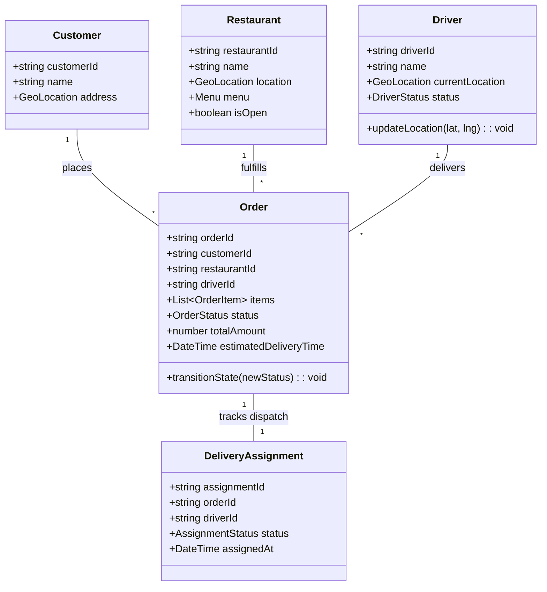
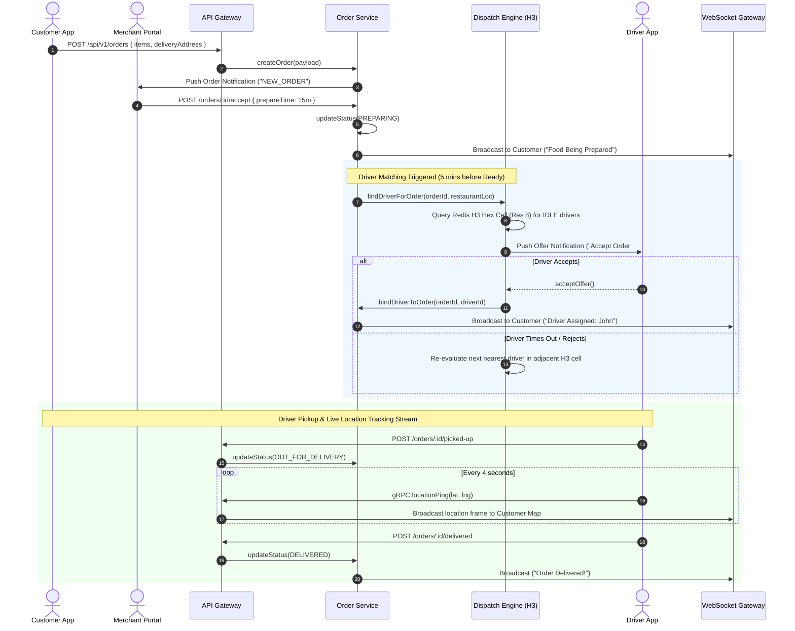
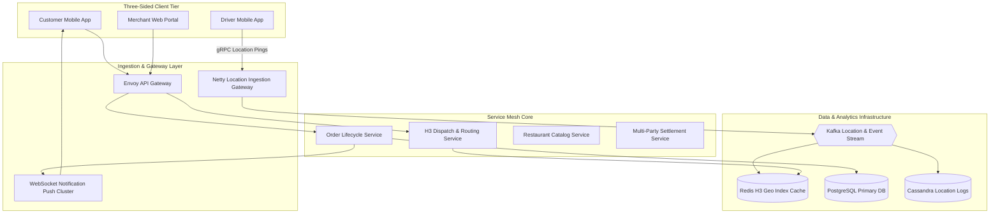

# 🛠️ Enterprise System Design Blueprint: Online Food Delivery Service (DoorDash / Uber Eats / Zomato)

> **Target Role:** Principal / Staff Architect / Senior LLD & HLD Engineers  
> **Product Perspective:** Building a three-sided marketplace platform (Customers, Restaurants, Drivers) serving 20M DAU, handling 125,000 location pings/sec, dynamic driver dispatch via Uber H3 spatial indexing, and sub-second order tracking.  
> **Navigation:** ⬅️ [Back to Category Index](./README.md) | ⬅️ [Back to Problem Bank Index](../README.md)

---

## 1. 🎯 Requirements & Product Scope

### 📋 Functional Requirements (FR)

1. **Restaurant & Menu Browsing:** Customers can search nearby restaurants based on current GPS location, view menus with options/customizations, and inspect live preparation ETAs.
2. **Multi-Item Cart & Checkout:** Customers can build orders, apply promo codes, choose delivery addresses, and initiate payments.
3. **Restaurant Partner Portal:** Restaurants receive real-time incoming order notifications, accept/reject orders, and update preparation status (`PREPARING`, `READY_FOR_PICKUP`).
4. **Geospatial Driver Matching & Dispatch:** Automatically match ready orders with optimal nearby delivery drivers based on proximity (Uber H3 Spatial Index), current load, and route efficiency.
5. **Real-time Live Order & Driver Tracking:** Stream driver GPS location pings to customer and restaurant UI maps smoothly via WebSockets.
6. **Multi-Party Financial Settlement:** Automatically split transaction payments into restaurant payout, driver delivery fee + tip, and platform commission.

### ⚡ Non-Functional Requirements (NFR)

1. **High Ingestion Throughput:** Handle 125,000 location pings/sec emitted by 500,000 active delivery drivers every 4 seconds.
2. **Sub-Second Dispatch Execution:** Driver assignment algorithms must match an order within $<2$ seconds of kitchen mark as ready.
3. **High Availability & Fault Tolerance:** $99.99\%$ availability during lunch and dinner surge peaks (12-2 PM, 7-9 PM).
4. **Strict Isolation & State Safety:** Prevent duplicate driver assignments to a single order; guarantee payment settlement atomicity.

---

## 2. 🧮 Scale & Quantitative Estimates

```
Traffic & Location Ingestion Estimates:
- Active Users: 20M DAU
- Active Drivers: 500,000 active drivers
- Daily Orders: 5 Million orders / day
- Driver Location Pings: 500,000 drivers * 1 ping / 4 seconds = 125,000 Location Write QPS
- Order Peak QPS: (5M orders / 86400) * 4 (peak lunch multiplier) ≈ 230 Write QPS (Peak: 5,000 Order QPS)

Storage & Data Calculations (3-Year Projection):
- Driver Location Logs: 125k pings/sec * 86400 * 365 = 3.93 Trillion pings/year (Stored in Apache Cassandra / ClickHouse)
- Location Payload: 50 bytes per ping (driverId, lat, lng, timestamp) = ~196 TB / year
- Active Spatial Index: Uber H3 Resolution 8 cells stored in Redis = ~500 MB memory footprint.
- Orders DB: 5M orders/day * 365 * 3 = 5.47 Billion Order Records = 5.47 TB in PostgreSQL.
```

---

## 3. 🛠️ Tech Stack & Architectural Justifications

| Layer / Component | Technology Choice | Architectural Rationale |
| :--- | :--- | :--- |
| **Mobile & Web Apps** | React Native (iOS/Android) + Next.js | Shared cross-platform UI code for Customer, Driver, and Merchant apps; Native Mapbox integration. |
| **API & Ingestion Gateway** | Netty / gRPC Gateway | High-throughput async Netty gateway handling 125,000 TCP/gRPC location pings/sec with minimal overhead. |
| **Spatial Indexing & Cache** | Redis Geospatial + Uber H3 Index | Maps lat/lng to H3 hexagonal cell indices for $O(1)$ fast spatial proximity queries (`GEORADIUS` / H3 cells). |
| **Core Relational DB** | PostgreSQL (Amazon Aurora) | ACID transactions for Order states, Menus, Payments, and Merchant profiles. |
| **Location History Storage** | Apache Cassandra / ClickHouse | Write-heavy columnar database optimized for append-only driver GPS trajectory logging. |
| **Dispatch & Routing Engine** | Go Microservice + OSRM (Open Source Routing Machine) | Computes real-time road distances, routing ETAs, and optimal driver assignment matching. |
| **Event Stream & Messaging** | Apache Kafka | Decouples location ping streams, order lifecycle transitions, and notification dispatchers. |

---

## 4. 📐 Visual UML Diagrams

### 🏗️ Class Diagram (Food Delivery Micro-Domain)



### 🔄 Sequence Diagram: Order Lifecycle & Dispatch Engine



### 🧩 Component & System Architecture Diagram (HLD)



---

## 5. 🧱 OOP & SOLID Principles Mapping

- **Single Responsibility Principle (SRP):** `LocationIngestionService` writes raw driver pings; `H3SpatialGridManager` maintains spatial indexing; `DispatchEngine` calculates optimal driver-order assignments.
- **Open/Closed Principle (OCP):** Driver dispatch matching uses a `DispatchStrategy` interface (Nearest Neighbor, Batched Traveling Salesperson, Surge-weighted Dispatch) without modifying order processing code.
- **Liskov Substitution Principle (LSP):** All distance calculators (`EuclideanDistance`, `HaversineDistance`, `OSRMRoadDistance`) implement `DistanceCalculator` interchangeably.
- **Interface Segregation Principle (ISP):** Expose minimal interfaces (`ICustomerOrderTracking`, `IDriverAssignmentAPI`) preventing cross-boundary domain coupling.
- **Dependency Inversion Principle (DIP):** `DispatchEngine` relies on high-level `ISpatialIndex` and `IRoutingProvider` abstractions.

---

## 6. 🎨 Design Patterns Applied

1. **Geospatial QuadTree / Uber H3 Index:** Divides earth surface into hexagonal spatial cells (H3) allowing $O(1)$ lookup of available drivers surrounding a restaurant.
2. **State Pattern:** Encapsulates `OrderState` transitions (`PlacedState` -> `AcceptedState` -> `PreparingState` -> `OutForDeliveryState` -> `DeliveredState`), preventing unlawful status skips.
3. **Strategy Pattern:** Implements customizable driver matching algorithms via `DispatchStrategy`.
4. **Observer Pattern:** Driver location streams publish to Redis channels which notify WebSocket gateway nodes to update customer tracking map pins in real time.
5. **Saga Pattern (Choreography/Orchestration):** Coordinates multi-party payout settlement across customer charge, restaurant payout, and driver tip allocation.

---

## 7. 💻 Production Code Blueprint (TypeScript)

### 1. Order Domain Entities & State Engine

```typescript
export enum OrderStatus {
  PLACED = 'PLACED',
  ACCEPTED_BY_RESTAURANT = 'ACCEPTED_BY_RESTAURANT',
  PREPARING = 'PREPARING',
  DRIVER_ASSIGNED = 'DRIVER_ASSIGNED',
  OUT_FOR_DELIVERY = 'OUT_FOR_DELIVERY',
  DELIVERED = 'DELIVERED',
  CANCELLED = 'CANCELLED',
}

export interface GeoLocation {
  latitude: number;
  longitude: number;
}

export interface DispatchStrategy {
  findBestDriver(restaurantLoc: GeoLocation, availableDrivers: { driverId: string; location: GeoLocation }[]): string | null;
}

export class NearestDriverStrategy implements DispatchStrategy {
  findBestDriver(restaurantLoc: GeoLocation, availableDrivers: { driverId: string; location: GeoLocation }[]): string | null {
    if (availableDrivers.length === 0) return null;

    let bestDriverId: string | null = null;
    let minDistance = Infinity;

    for (const driver of availableDrivers) {
      const dist = this.haversineDistance(restaurantLoc, driver.location);
      if (dist < minDistance) {
        minDistance = dist;
        bestDriverId = driver.driverId;
      }
    }

    return bestDriverId;
  }

  private haversineDistance(loc1: GeoLocation, loc2: GeoLocation): number {
    const R = 6371; // km
    const dLat = ((loc2.latitude - loc1.latitude) * Math.PI) / 180;
    const dLon = ((loc2.longitude - loc1.longitude) * Math.PI) / 180;
    const a =
      Math.sin(dLat / 2) * Math.sin(dLat / 2) +
      Math.cos((loc1.latitude * Math.PI) / 180) *
        Math.cos((loc2.latitude * Math.PI) / 180) *
        Math.sin(dLon / 2) *
        Math.sin(dLon / 2);
    return R * 2 * Math.atan2(Math.sqrt(a), Math.sqrt(1 - a));
  }
}
```

### 2. Redis Geospatial Driver Index & Matcher

```typescript
import Redis from 'ioredis';

export class RedisSpatialGridManager {
  constructor(private redis: Redis) {}

  private geoKey = 'drivers:locations';

  async updateDriverLocation(driverId: string, location: GeoLocation): Promise<void> {
    // Stores driver location into Redis Geospatial Index
    await this.redis.geoadd(
      this.geoKey,
      location.longitude,
      location.latitude,
      driverId
    );
    // Also record status
    await this.redis.hset(`driver:${driverId}:status`, 'last_ping', Date.now());
  }

  async findNearbyDrivers(
    restaurantLoc: GeoLocation,
    radiusKm: number = 3
  ): Promise<{ driverId: string; location: GeoLocation }[]> {
    // GEORADIUS query returning nearby drivers within radius
    const results = await this.redis.georadius(
      this.geoKey,
      restaurantLoc.longitude,
      restaurantLoc.latitude,
      radiusKm,
      'km',
      'WITHCOORD'
    );

    return (results as any[]).map(([driverId, [lng, lat]]) => ({
      driverId,
      location: { latitude: parseFloat(lat), longitude: parseFloat(lng) },
    }));
  }

  async removeDriver(driverId: string): Promise<void> {
    await this.redis.zrem(this.geoKey, driverId);
  }
}
```

### 3. Dispatch Matcher Implementation

```typescript
export class DispatchEngine {
  constructor(
    private spatialManager: RedisSpatialGridManager,
    private dispatchStrategy: DispatchStrategy,
    private redis: Redis
  ) {}

  async assignDriverToOrder(
    orderId: string,
    restaurantLocation: GeoLocation
  ): Promise<{ success: boolean; assignedDriverId?: string }> {
    const radiusSteps = [2, 5, 8]; // Search radius expansion in km

    for (const radius of radiusSteps) {
      const candidates = await this.spatialManager.findNearbyDrivers(restaurantLocation, radius);
      
      // Filter out busy drivers
      const availableCandidates = [];
      for (const candidate of candidates) {
        const isBusy = await this.redis.get(`driver:${candidate.driverId}:busy`);
        if (!isBusy) {
          availableCandidates.push(candidate);
        }
      }

      const selectedDriverId = this.dispatchStrategy.findBestDriver(restaurantLocation, availableCandidates);

      if (selectedDriverId) {
        // Atomic Lock: Reserve driver for 30s offer period
        const locked = await this.redis.set(
          `driver:${selectedDriverId}:busy`,
          orderId,
          'EX',
          30,
          'NX'
        );

        if (locked === 'OK') {
          return { success: true, assignedDriverId: selectedDriverId };
        }
      }
    }

    return { success: false }; // No driver available, retry queue
  }
}
```

---

## 8. 🔀 High-Level Design (HLD) & Scale Bottlenecks

### 1. Ingestion Bottleneck of 125,000 Driver Pings/Sec
- **Problem:** Updating PostgreSQL with 125,000 driver GPS coordinates every second will crash database disk I/O immediately.
- **Solution:** 
  1. Driver mobile apps emit compressed binary gRPC location frames every 4 seconds to lightweight Netty ingestion proxy servers.
  2. Netty streams pings directly into a high-throughput Kafka topic (`driver-locations-raw`).
  3. A Flink stream processor updates the Redis Geospatial cache in real time for instant dispatching queries while flushing historical raw coordinates asynchronously into Cassandra in 10-second micro-batches.

### 2. Handling Driver Offer Rejections (The Cascade Problem)
- **Problem:** If a driver rejects an order offer or ignores the 30-second notification window during peak dinner rush, order preparation cools down while waiting for matching.
- **Solution:** Implement **Batch Multi-Offer Pre-Calculation**. The dispatch engine ranks top 3 candidate drivers simultaneously. If Driver 1 rejects or times out after 15 seconds, the engine instantly transitions the notification offer to pre-fetched Driver 2 without re-running spatial routing algorithms.

---

## ❓ 9. Collapsed Senior/Staff Level Grill Q&A

<details>
<summary>❓ How do you compute real-time ETA when accounting for weather, traffic, and kitchen preparation delays?</summary>

**Answer:**  
ETA is calculated as a composite formula:  
$$\text{Total ETA} = \text{Prep Time} (T_{\text{prep}}) + \text{Driver-to-Restaurant Travel Time} (T_{\text{pickup}}) + \text{Restaurant-to-Customer Travel Time} (T_{\text{delivery}})$$
1. $T_{\text{prep}}$ is predicted using a Machine Learning model trained on historic merchant completion times for specific menu items and current kitchen queue length.
2. $T_{\text{pickup}}$ and $T_{\text{delivery}}$ are calculated using OSRM / Google Maps Distance Matrix APIs weighted by real-time traffic speeds obtained from driver movement vectors.

</details>

<details>
<summary>❓ Why use Uber H3 Spatial Index over standard GeoHash or QuadTrees?</summary>

**Answer:**  
Standard GeoHash quadrangles produce variable cell areas near the poles and severe edge-discontinuity artifacts where neighboring points fall into completely different string prefixes. Uber H3 uses regular hexagonal cells. Hexagons have uniform distance between cell centroids and all 6 adjacent neighbor cells, simplifying smooth spatial radial search algorithms and continuous surge pricing map overlays without edge distortion.

</details>

<details>
<summary>❓ How do you guarantee exact multi-party payment settlement between Platform, Merchant, and Driver?</summary>

**Answer:**  
We utilize the **Saga Pattern with Transactional Ledger DB**. Payments are held in a platform Escrow account. Upon driver marking `DELIVERED`, an asynchronous Saga orchestrator emits accounting ledger transactions into an immutable double-entry ledger table (PostgreSQL / AWS QLDB):
- Debit Platform Escrow: \$30.00
- Credit Merchant Balance: \$22.00
- Credit Driver Balance: \$5.00 (Fee) + \$3.00 (Tip)
Payouts are settled daily via ACH / Stripe Connect transfers.

</details>
