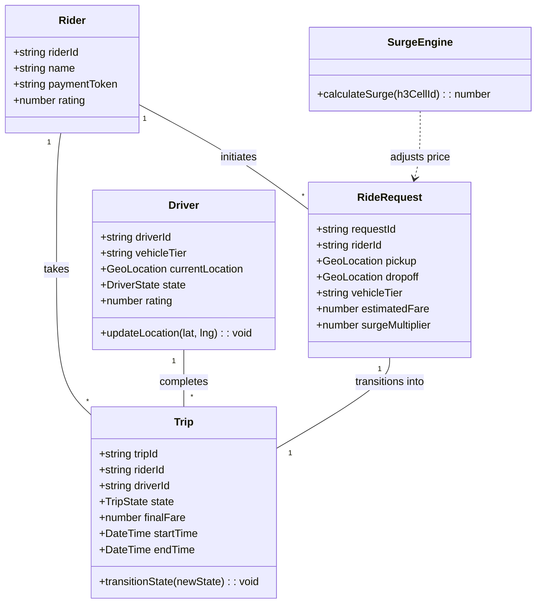
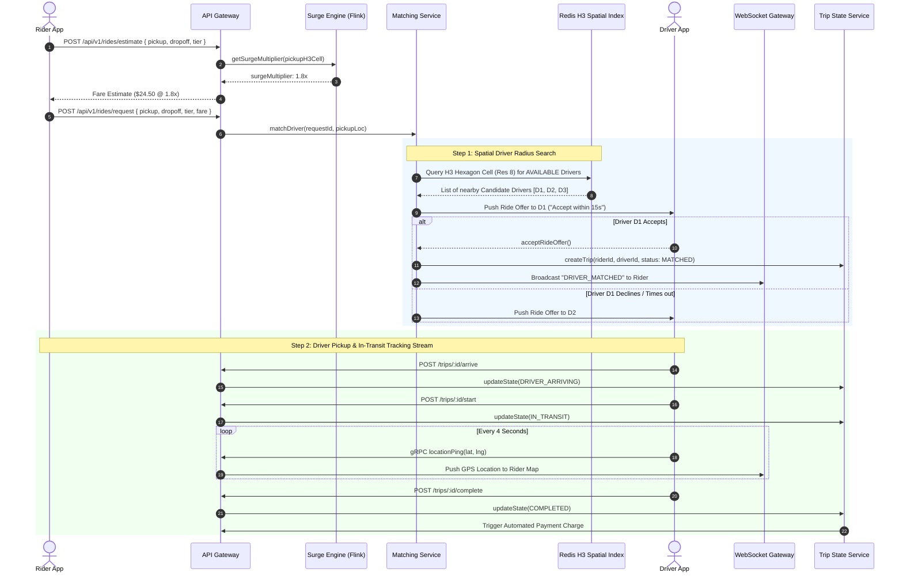
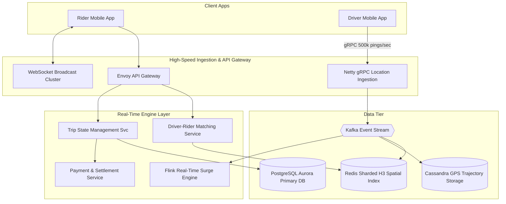

# 🛠️ Enterprise System Design Blueprint: Ride-Hailing Service (Uber / Lyft)

> **Target Role:** Principal / Staff Architect / Senior LLD & HLD Engineers  
> **Product Perspective:** Building a global real-time ride-hailing architecture serving 50M DAU, ingesting 500,000 driver pings/sec, processing dynamic surge pricing heatmaps via Flink, and executing sub-second driver-rider matching.  
> **Navigation:** ⬅️ [Back to Category Index](./README.md) | ⬅️ [Back to Problem Bank Index](../README.md)

---

## 1. 🎯 Requirements & Product Scope

### 📋 Functional Requirements (FR)

1. **Ride Request & Route Fare Estimation:** Riders input pickup and drop-off coordinates, inspect upfront fare estimates across vehicle categories (UberX, Comfort, XL), and request a ride.
2. **Dynamic Surge Pricing:** Automatically adjust fares based on real-time supply (active available drivers) vs demand (active ride requests) computed within Uber H3 hexagonal spatial cells.
3. **Low-Latency Driver Location Ingestion:** Ingest gRPC location pings emitted by 2 Million active drivers every 4 seconds.
4. **Intelligent Driver-Rider Matching Engine:** Match requested rides with optimal nearby drivers based on ETA, driver rating, vehicle tier, and direction of travel.
5. **Real-time Trip State Management:** Enforce deterministic trip state transitions (`REQUESTED`, `MATCHED`, `DRIVER_ARRIVING`, `IN_TRANSIT`, `COMPLETED`, `CANCELLED`).
6. **Live Driver Trajectory Broadcast:** Stream driver GPS movement continuously to rider mobile apps with low latency (<50ms).

### ⚡ Non-Functional Requirements (NFR)

1. **Massive Location Ingestion Capacity:** Handle 500,000 location pings/sec continuous write throughput globally.
2. **Sub-3 Second Match Latency:** Match ride requests to candidate drivers within $<3$ seconds.
3. **Strict Single Assignment:** Zero possibility of matching a single driver to two simultaneous non-shared rides.
4. **High Availability:** $99.999\%$ uptime for critical core trip dispatch services ($<5.26$ minutes downtime/year).

---

## 2. 🧮 Scale & Quantitative Estimates

```
Traffic & Ingestion Estimates:
- Active Riders: 50M DAU
- Active Drivers: 2 Million active drivers
- Daily Completed Trips: 20 Million rides / day
- Location Ping QPS: 2,000,000 drivers * 1 ping / 4s = 500,000 Ingestion Write QPS
- Ride Request QPS: 20M rides / 86400 ≈ 230 QPS (Peak: 5,000 QPS)

Data & Storage Calculations (3-Year Projection):
- Trajectory Logs: 500,000 pings/sec * 86400 * 365 = 15.76 Trillion location rows/year (Cassandra / ClickHouse)
- Trajectory Payload: 60 bytes per ping = ~945 TB / year (Compressed & tiered storage)
- Active Ride DB: 20M rides/day * 365 * 3 = 21.9 Billion Ride Records = ~21.9 TB in PostgreSQL Cluster.
- Memory Footprint (Redis H3 Index): 2M active drivers * 64 bytes = ~128 MB active in-memory spatial index.
```

---

## 3. 🛠️ Tech Stack & Architectural Justifications

| Layer / Component | Technology Choice | Architectural Rationale |
| :--- | :--- | :--- |
| **Mobile Applications** | React Native (iOS/Android) | Cross-platform framework with native C++ bridges for map rendering and WebSockets. |
| **Location Ingestion Proxy** | Netty / gRPC Gateway (Go / C++) | Non-blocking NIO gateway maintaining 2M persistent TCP connections for 500,000 pings/sec. |
| **Real-time Spatial Cache** | Redis Cluster + Uber H3 | In-memory spatial index storing driver coordinates inside H3 hexagonal cell buckets for $O(1)$ spatial lookup. |
| **Stream Analytics Engine** | Apache Flink | Aggregates real-time driver density vs rider search density over sliding windows to compute live Surge Multipliers. |
| **Primary Relational DB** | PostgreSQL (Amazon Aurora) | ACID transactions for user profiles, payment tokens, and final trip billing records. |
| **Trajectory Storage DB** | Apache Cassandra / ClickHouse | Columnar write-heavy database optimized for high-speed time-series append-only GPS pings. |
| **Event Bus** | Apache Kafka | Central event pipeline for location streams, match events, and payment dispatch events. |

---

## 4. 📐 Visual UML Diagrams

### 🏗️ Class Diagram (Ride Domain Entities)



### 🔄 Sequence Diagram: Ride Matching & Real-Time Tracking Flow



### 🧩 Component & System Architecture Diagram (HLD)



---

## 5. 🧱 OOP & SOLID Principles Mapping

- **Single Responsibility Principle (SRP):** `LocationIngestor` streams GPS points; `SurgeEngine` calculates dynamic pricing multipliers; `RideMatcher` executes driver selection algorithms.
- **Open/Closed Principle (OCP):** Dynamic fare calculation uses a `FareCalculationStrategy` interface (Standard, Surge, Shared/Pool, Premium Black). Adding new ride tiers requires no modifications to trip dispatch controllers.
- **Liskov Substitution Principle (LSP):** All surge calculation providers (`DemandSupplySurgeStrategy`, `WeatherSurgeStrategy`) conform to `SurgeStrategy` contract.
- **Interface Segregation Principle (ISP):** Expose minimal endpoints (`IRiderTripView`, `IDriverDispatchView`) preventing leak of internal routing parameters.
- **Dependency Inversion Principle (DIP):** `RideMatcher` depends on abstract `ISpatialGrid` and `INotificationChannel` abstractions.

---

## 6. 🎨 Design Patterns Applied

1. **Geospatial H3 Spatial Indexing:** Maps world coordinates into H3 hexagonal cell IDs enabling $O(1)$ neighboring driver discovery.
2. **Strategy Pattern:** Enforces customizable surge pricing rules and driver ranking algorithms via `SurgePricingStrategy` and `DriverMatchingStrategy`.
3. **State Pattern:** Governs `TripState` transitions (`Requested` -> `Matched` -> `DriverArriving` -> `InTransit` -> `Completed`), strictly rejecting illegal transitions.
4. **Observer Pattern:** Broadcasters ingest driver location updates and push live coordinates to active rider WebSockets.
5. **Saga Pattern:** Coordinates multi-step trip settlement (Authorize Fare -> Complete Trip -> Charge Credit Card -> Credit Driver Account -> Pay Referral Bonus).

---

## 7. 💻 Production Code Blueprint (TypeScript)

### 1. Domain Entities & State Engine

```typescript
export enum TripState {
  REQUESTED = 'REQUESTED',
  MATCHED = 'MATCHED',
  DRIVER_ARRIVING = 'DRIVER_ARRIVING',
  IN_TRANSIT = 'IN_TRANSIT',
  COMPLETED = 'COMPLETED',
  CANCELLED = 'CANCELLED',
}

export interface GeoLocation {
  latitude: number;
  longitude: number;
}

export interface FareCalculationStrategy {
  calculateFare(baseFare: number, distanceKm: number, durationMinutes: number, surgeMultiplier: number): number;
}

export class StandardRideFareStrategy implements FareCalculationStrategy {
  calculateFare(baseFare: number, distanceKm: number, durationMinutes: number, surgeMultiplier: number): number {
    const distanceRate = 1.25; // $1.25 per km
    const timeRate = 0.35; // $0.35 per minute
    
    const subtotal = baseFare + (distanceKm * distanceRate) + (durationMinutes * timeRate);
    return Math.round((subtotal * surgeMultiplier) * 100) / 100;
  }
}
```

### 2. Redis H3 Spatial Driver Matcher

```typescript
import Redis from 'ioredis';

export class RedisDriverMatcher {
  constructor(private redis: Redis) {}

  /**
   * Updates Driver Location in Redis Geospatial Index
   */
  async updateDriverLocation(driverId: string, location: GeoLocation): Promise<void> {
    const geoKey = 'drivers:spatial_index';
    await this.redis.geoadd(geoKey, location.longitude, location.latitude, driverId);
  }

  /**
   * Atomic Search and Lock Candidate Driver
   */
  async findAndLockNearestDriver(
    pickup: GeoLocation,
    radiusKm: number = 3
  ): Promise<string | null> {
    const geoKey = 'drivers:spatial_index';

    // 1. Query Redis for drivers within radius
    const drivers = await this.redis.georadius(
      geoKey,
      pickup.longitude,
      pickup.latitude,
      radiusKm,
      'km',
      'ASC'
    );

    const candidates = drivers as string[];

    // 2. Iterate and atomically lock the first non-busy driver
    for (const driverId of candidates) {
      const lockKey = `driver:${driverId}:lock`;
      const acquired = await this.redis.set(lockKey, 'BUSY', 'EX', 15, 'NX');

      if (acquired === 'OK') {
        return driverId; // Successfully matched & locked for 15s offer
      }
    }

    return null; // No driver available
  }
}
```

### 3. Flink-Inspired Dynamic Surge Engine

```typescript
export class DynamicSurgeEngine {
  constructor(private redis: Redis) {}

  async calculateSurgeMultiplier(h3CellId: string): Promise<number> {
    // Fetch active demand (rider search count) and supply (available drivers count) in H3 cell
    const demandCount = parseInt(await this.redis.get(`h3:${h3CellId}:demand`) || '0', 10);
    const supplyCount = parseInt(await this.redis.get(`h3:${h3CellId}:supply`) || '0', 10);

    if (supplyCount === 0 && demandCount > 0) {
      return 3.0; // Maximum Cap
    }

    const ratio = demandCount / Math.max(supplyCount, 1);

    if (ratio <= 1.0) return 1.0; // Normal Fare
    if (ratio <= 2.0) return 1.4;
    if (ratio <= 4.0) return 2.0;
    return 3.0;
  }
}
```

---

## 8. 🔀 High-Level Design (HLD) & Scale Bottlenecks

### 1. Ingesting 500,000 Driver Location Pings/Sec
- **Problem:** Conventional HTTP/REST APIs incur high TCP handshake and HTTP header overhead at 500,000 QPS.
- **Solution:** 
  1. Drivers establish long-lived HTTP/2 gRPC channels to Netty ingestion proxies.
  2. Protocol Buffers (protobuf) serialize location payloads into compact 40-byte binary blobs.
  3. Netty delegates payloads asynchronously to local Kafka topic partitions partitioned by `driver_id`.

### 2. Computing Dynamic Surge Heatmaps in Real Time
- **Problem:** Re-computing surge pricing across millions of riders and drivers using SQL queries is computationally infeasible.
- **Solution:** Use **Apache Flink Stream Aggregations**. Flink consumes the Kafka location and search event stream using sliding windows (e.g. 2-minute sliding window evaluated every 10 seconds). Flink calculates the demand/supply ratio for every Uber H3 cell and updates the Redis surge cache key `h3:{cell_id}:surge` instantly.

---

## ❓ 9. Collapsed Senior/Staff Level Grill Q&A

<details>
<summary>❓ How do you prevent two ride requests from being matched to the exact same driver simultaneously?</summary>

**Answer:**  
We enforce atomic locking using Redis `SET driver:123:lock BUSY EX 15 NX`. When the matching service identifies a candidate driver, it executes this atomic Redis command. If another matching thread attempts to assign the same driver at the same millisecond, Redis returns `NULL`, forcing the second request thread to skip to the next candidate driver in the spatial radius search.

</details>

<details>
<summary>❓ What happens if a rider's credit card declines after a trip is completed?</summary>

**Answer:**  
1. Upon ride request, we perform an **Upfront Credit Card Pre-Authorization** for the estimated amount.
2. If final fare exceeds pre-authorization (e.g., severe traffic detour) and payment fails post-trip:
   - The driver is paid immediately from Uber's platform liquidity pool (driver risk protection).
   - The rider's account is placed in `PAYMENT_UNPAID` state with a temporary block, preventing new ride requests until the outstanding balance is settled.

</details>

<details>
<summary>❓ How do you ensure smooth driver marker animation on the rider's map UI despite network jitter?</summary>

**Answer:**  
The client app does not jump the vehicle marker directly on raw GPS coordinates. It implements **Map Matching & Dead Reckoning Interpolation**. Incoming GPS pings are snapped to the nearest road network polyline (using Mapbox/OSRM Map Matching). The UI uses linear interpolation (lerp) over a 4-second animation buffer to glide the vehicle icon smoothly along the road polyline.

</details>
