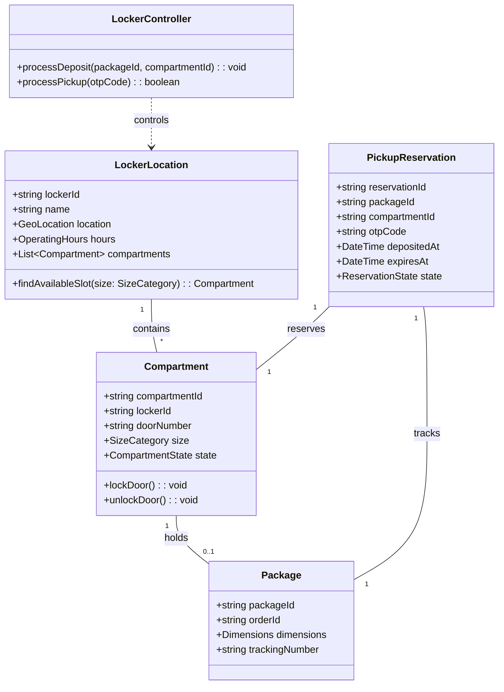
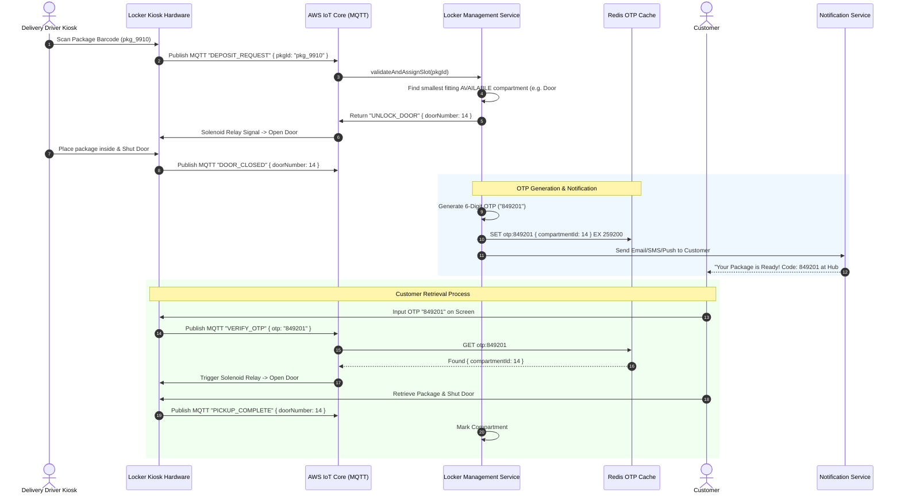

# 🛠️ Enterprise System Design Blueprint: Amazon Locker (Automated Package Pickup System)

> **Target Role:** Principal / Staff Architect / Senior LLD & HLD Engineers  
> **Product Perspective:** Building a distributed automated locker system managing 50,000 physical locker sites, 1 Million smart compartments, real-time spatial allocation, IoT door actuator control, and offline Bluetooth emergency unlock protocols.  
> **Navigation:** ⬅️ [Back to Category Index](./README.md) | ⬅️ [Back to Problem Bank Index](../README.md)

---

## 1. 🎯 Requirements & Product Scope

### 📋 Functional Requirements (FR)

1. **Locker Location Search:** Customers can search nearby Amazon Lockers based on geographic address, operating hours, and current package size availability during checkout.
2. **Optimal Compartment Fitting:** Automatically allocate the smallest available compartment tier (Small, Medium, Large, Extra Large) matching package volume dimensions.
3. **Courier Package Deposit:** Delivery drivers scan package barcode at locker kiosk; system unlocks matching compartment door; courier deposits item and shuts door.
4. **Secure Pickup Code Generation:** Generate a cryptographically secure 6-digit OTP passcode and barcode payload sent to customer via SMS, Email, and Push Notification upon package deposit.
5. **Customer Package Retrieval:** Customer enters 6-digit OTP, scans barcode, or triggers Bluetooth low-energy (BLE) unlock via Amazon app; compartment door pops open automatically.
6. **Package Expiration & Return Workflow:** If package remains uncollected after 3 business days (72 hours), mark compartment as `EXPIRED`, generate courier return ticket, and notify driver to retrieve item.

### ⚡ Non-Functional Requirements (NFR)

1. **Hardware Reliability & Offline Operation:** Locker hardware must support offline pickup validation via BLE / local HMAC cryptography if internet connectivity drops.
2. **Sub-Second Door Response:** Door actuator trigger latency $<500\text{ms}$ upon valid OTP entry.
3. **Zero Package Over-Allocation:** Prevent reserving more compartments than physically available at any given locker location.
4. **Physical Fault Tolerant:** Detect jammed doors, unclosed compartments, or hardware solenoid failures with automatic fallback slot assignment.

---

## 2. 🧮 Scale & Quantitative Estimates

```
Scale & Infrastructure Estimates:
- Physical Locker Locations: 50,000 locations globally
- Compartments per Locker: Average 40 compartments (20 Small, 10 Medium, 7 Large, 3 XL)
- Total Smart Compartments: 2,000,000 physical compartments globally
- Daily Package Pickups: 500,000 packages processed / day
- Average Write QPS: 10 QPS (Low global write QPS, localized hardware spikes)
- Peak Pickup QPS: 2,000 QPS (Evening rush hours 5 PM - 8 PM)

Storage Calculations (5-Year Projection):
- Locker Location Metadata: 50k * 2 KB = 100 MB
- Package Pickups History: 500k packages/day * 365 * 5 = 912.5 Million Records ~ 180 GB (PostgreSQL Cluster)
- OTP Redis Cache: 500,000 active packages * 100 bytes = ~50 MB in-memory hot cache.
```

---

## 3. 🛠️ Tech Stack & Architectural Justifications

| Layer / Component | Technology Choice | Architectural Rationale |
| :--- | :--- | :--- |
| **Kiosk Hardware OS** | Embedded Linux / Android Enterprise | Microcontroller interface managing solenoid door locks, barcode scanner, touchscreen, and BLE beacon. |
| **IoT Connectivity Broker**| AWS IoT Core (MQTT Protocol) | Lightweight bi-directional pub/sub protocol maintaining persistent device connections to 50,000 lockers. |
| **API & Service Gateway** | Envoy API Gateway | Handles authentication, rate limiting, and REST/gRPC routing between backend services and kiosks. |
| **Primary Relational DB** | PostgreSQL (Amazon Aurora) | ACID transactions for Locker master records, Compartment dimensions, Package tracking, and Audit logs. |
| **Fast OTP Cache** | Redis Cluster | Stores encrypted active OTP passcodes mapped to locker compartment IDs with strict 72-hour TTL expiration. |
| **Event Bus & Messaging** | Apache Kafka | Streams package lifecycle events (Deposited, Retrieved, Expired) to notification and analytics microservices. |

---

## 4. 📐 Visual UML Diagrams

### 🏗️ Class Diagram (Locker Hardware Domain)



### 🔄 Sequence Diagram: Courier Deposit & Customer OTP Pickup Workflow



### 🧩 Component & System Architecture Diagram (HLD)

```mermaid
graph TB
    subgraph Physical Locker Hardware Kiosk
        Touchscreen[Kiosk Touch UI]
        BarcodeScanner[Barcode / QR Reader]
        SolenoidRelays[Solenoid Lock Relays]
        BLEModule[Bluetooth Low Energy Controller]
    end

    subgraph IoT Cloud Connectivity
        AWSIoT[AWS IoT Core MQTT Broker]
    end

    subgraph Backend Microservices
        LockerSvc[Locker Allocation Service]
        OTPSvc[OTP Cryptographic Generator]
        NotifSvc[Customer Notification Service]
        ExpirySvc[Package Expiration Worker]
    end

    subgraph Data Stores
        RedisOTP[(Redis OTP Cache Cluster)]
        PostgresDB[(PostgreSQL Primary DB)]
        KafkaBus{{Kafka Event Stream}}
    end

    Touchscreen --> AWSIoT
    BarcodeScanner --> AWSIoT
    SolenoidRelays <-- MQTT Control Commands -- AWSIoT
    BLEModule <--> MobileApp[Customer Amazon Mobile App]

    AWSIoT --> LockerSvc
    LockerSvc --> OTPSvc
    OTPSvc --> RedisOTP
    LockerSvc --> PostgresDB
    LockerSvc --> KafkaBus
    KafkaBus --> NotifSvc
    ExpirySvc --> PostgresDB
```

---

## 5. 🧱 OOP & SOLID Principles Mapping

- **Single Responsibility Principle (SRP):** `SlotAllocationEngine` computes compartment size fitting; `DoorActuatorController` manages MQTT lock triggers; `OTPManager` generates cryptographically secure pickup passcodes.
- **Open/Closed Principle (OCP):** Slot selection algorithm uses a `SlotFittingStrategy` interface (Best Fit, Smallest Fit, Tiered Volume Fit). Adding extra large palette slot logic requires zero edits to core checkout controllers.
- **Liskov Substitution Principle (LSP):** All locker lock controllers (`MQTTHardwareController`, `BLEOfflineController`, `SimulatedTestController`) implement `ILockerHardwareController` interchangeably.
- **Interface Segregation Principle (ISP):** Expose thin interfaces (`ICustomerPickupAPI`, `ICourierDepositAPI`) preventing unauthorized courier access to administrative configuration APIs.
- **Dependency Inversion Principle (DIP):** `LockerManagementService` injects high-level `IIoTBroker` and `IOTPCache` abstractions.

---

## 6. 🎨 Design Patterns Applied

1. **Strategy Pattern:** Implements compartment size selection rules via `SlotFittingStrategy` (calculating package volume against compartment dimensions).
2. **State Pattern:** Governs `CompartmentState` transitions (`Available` -> `Reserved` -> `PackageDeposited` -> `PickedUp` -> `Expired` -> `Maintenance`).
3. **Command Pattern:** Encapsulates door unlock commands (`OpenCompartmentDoorCommand`) allowing execution tracking, retry queues, and emergency hardware fallbacks.
4. **Factory Pattern:** `PickupCodeFactory` generates secure 6-digit OTP codes or encrypted offline BLE tokens.

---

## 7. 💻 Production Code Blueprint (TypeScript)

### 1. Domain Entities & Size Fitting Strategy

```typescript
export enum SizeCategory {
  SMALL = 'SMALL',
  MEDIUM = 'MEDIUM',
  LARGE = 'LARGE',
  EXTRA_LARGE = 'EXTRA_LARGE',
}

export enum CompartmentState {
  AVAILABLE = 'AVAILABLE',
  RESERVED = 'RESERVED',
  PACKAGE_DEPOSITED = 'PACKAGE_DEPOSITED',
  PICKED_UP = 'PICKED_UP',
  EXPIRED = 'EXPIRED',
  MAINTENANCE = 'MAINTENANCE',
}

export interface Dimensions {
  widthCm: number;
  heightCm: number;
  depthCm: number;
}

export interface SlotFittingStrategy {
  selectCompartment(packageDimensions: Dimensions, availableSlots: { compartmentId: string; size: SizeCategory; dimensions: Dimensions }[]): string | null;
}

export class BestFitSlotStrategy implements SlotFittingStrategy {
  selectCompartment(packageDimensions: Dimensions, availableSlots: { compartmentId: string; size: SizeCategory; dimensions: Dimensions }[]): string | null {
    // Sort available slots by volume ascending to pick smallest fitting slot
    const suitableSlots = availableSlots.filter(slot =>
      slot.dimensions.widthCm >= packageDimensions.widthCm &&
      slot.dimensions.heightCm >= packageDimensions.heightCm &&
      slot.dimensions.depthCm >= packageDimensions.depthCm
    ).sort((a, b) => {
      const volA = a.dimensions.widthCm * a.dimensions.heightCm * a.dimensions.depthCm;
      const volB = b.dimensions.widthCm * b.dimensions.heightCm * b.dimensions.depthCm;
      return volA - volB;
    });

    return suitableSlots.length > 0 ? suitableSlots[0].compartmentId : null;
  }
}
```

### 2. Redis OTP Management Service

```typescript
import Redis from 'ioredis';
import crypto from 'crypto';

export class OTPPickupService {
  constructor(private redis: Redis) {}

  /**
   * Generates a Cryptographically Secure 6-Digit OTP Code
   */
  generateOTP(): string {
    const randomBytes = crypto.randomBytes(3);
    const num = (randomBytes.readUIntBE(0, 3) % 900000) + 100000;
    return num.toString();
  }

  async registerPackageDeposit(
    packageId: string,
    lockerId: string,
    compartmentId: string,
    ttlSeconds: number = 259200 // 72 hours
  ): Promise<string> {
    const otp = this.generateOTP();
    const otpKey = `otp:${lockerId}:${otp}`;

    const payload = JSON.stringify({
      packageId,
      compartmentId,
      createdAt: Date.now(),
    });

    // Store in Redis with TTL
    await this.redis.set(otpKey, payload, 'EX', ttlSeconds);
    return otp;
  }

  async verifyAndConsumeOTP(
    lockerId: string,
    inputOtp: string
  ): Promise<{ valid: boolean; compartmentId?: string; packageId?: string }> {
    const otpKey = `otp:${lockerId}:${inputOtp}`;

    const data = await this.redis.get(otpKey);
    if (!data) {
      return { valid: false }; // Invalid or Expired Code
    }

    // Single-use code: Delete after verification
    await this.redis.del(otpKey);

    const parsed = JSON.parse(data);
    return {
      valid: true,
      compartmentId: parsed.compartmentId,
      packageId: parsed.packageId,
    };
  }
}
```

### 3. Locker Controller Hardware Manager

```typescript
export interface IoTBroker {
  publish(topic: string, message: any): Promise<void>;
}

export class LockerHardwareManager {
  constructor(
    private iotBroker: IoTBroker,
    private otpService: OTPPickupService,
    private slotStrategy: SlotFittingStrategy
  ) {}

  async handleCustomerPickup(lockerId: string, inputOtp: string): Promise<boolean> {
    const result = await this.otpService.verifyAndConsumeOTP(lockerId, inputOtp);
    if (!result.valid || !result.compartmentId) {
      return false;
    }

    // Publish MQTT unlock signal to physical kiosk
    const unlockTopic = `lockers/${lockerId}/commands/unlock`;
    await this.iotBroker.publish(unlockTopic, {
      compartmentId: result.compartmentId,
      action: 'OPEN_DOOR',
      timestamp: Date.now(),
    });

    return true;
  }
}
```

---

## 8. 🔀 High-Level Design (HLD) & Scale Bottlenecks

### 1. Offline Kiosk Operation (Network Disconnection Fallback)
- **Problem:** If a physical Amazon Locker site loses internet connectivity (cellular/Wi-Fi outage), customers visiting the kiosk cannot verify OTP codes against cloud Redis servers.
- **Solution:** Implement **BLE Offline Cryptographic Authorization**.
  1. Customer mobile app establishes a local Bluetooth Low Energy (BLE) pairing with the offline locker hardware beacon.
  2. The mobile app passes an offline token signed by Amazon's Private Key containing `(lockerId, compartmentId, timestamp, HMAC_signature)`.
  3. The embedded micro-controller verifies the signature locally using Amazon's Public Key burnt into hardware firmware and triggers the door relay directly without internet.

### 2. Hardware Solenoid Jamming & Fault Handling
- **Problem:** The solenoid relay fires to unlock Door #14, but the door physical spring fails to open or is blocked by an obstruction.
- **Solution:** Lockers are equipped with optical door position sensors. If `DOOR_OPEN` signal is not detected within 3 seconds of sending `UNLOCK_DOOR`, the kiosk automatically flags Door #14 as `HARDWARE_FAULT`, selects an alternative available compartment, transfers the deposit reservation, and pops Door #15 while alerting field technicians via Kafka event.

---

## ❓ 9. Collapsed Senior/Staff Level Grill Q&A

<details>
<summary>❓ How do you prevent brute-force OTP guessing on physical kiosk touchscreens?</summary>

**Answer:**  
1. **Local Rate Limiting:** The kiosk software allows a maximum of 3 incorrect OTP entries per 5 minutes. After 3 failures, the kiosk screen locks input for 10 minutes and triggers a CAPTCHA or mandatory barcode scan.
2. **Kiosk Sharding:** OTP passcodes are namespaced per physical `lockerId` (`otp:locker_44:849201`). Thus, an OTP is valid ONLY at a specific physical locker location, reducing collision space to zero.

</details>

<details>
<summary>❓ What happens if a customer opens the door, takes their package, but leaves the door pushed open?</summary>

**Answer:**  
If the optical sensor detects door remains unlatched for $>60$ seconds post-pickup, the kiosk emits an audible audio chime (`"Please shut door 14"`). If unclosed after 3 minutes, the kiosk publishes an MQTT alert to AWS IoT Core. The backend marks the compartment state as `DOOR_UNLATCHED` and excludes it from future checkout reservation algorithms until closed or verified by a technician.

</details>

<details>
<summary>❓ How do you handle 72-hour package expirations efficiently across 2 million compartments?</summary>

**Answer:**  
We avoid polling database queries (`SELECT * FROM reservations WHERE expires_at < NOW()`). Instead, we leverage **Redis Key Expiration Events (`__keyevent@0__:expired`)**. When an OTP key `otp:locker_44:849201` expires after 72 hours, Redis fires an event to a Kafka consumer group. An `ExpiryWorker` sets the compartment state to `EXPIRED`, generates a return routing label, and appends the item to the delivery driver's next dropoff/pickup manifest.

</details>
