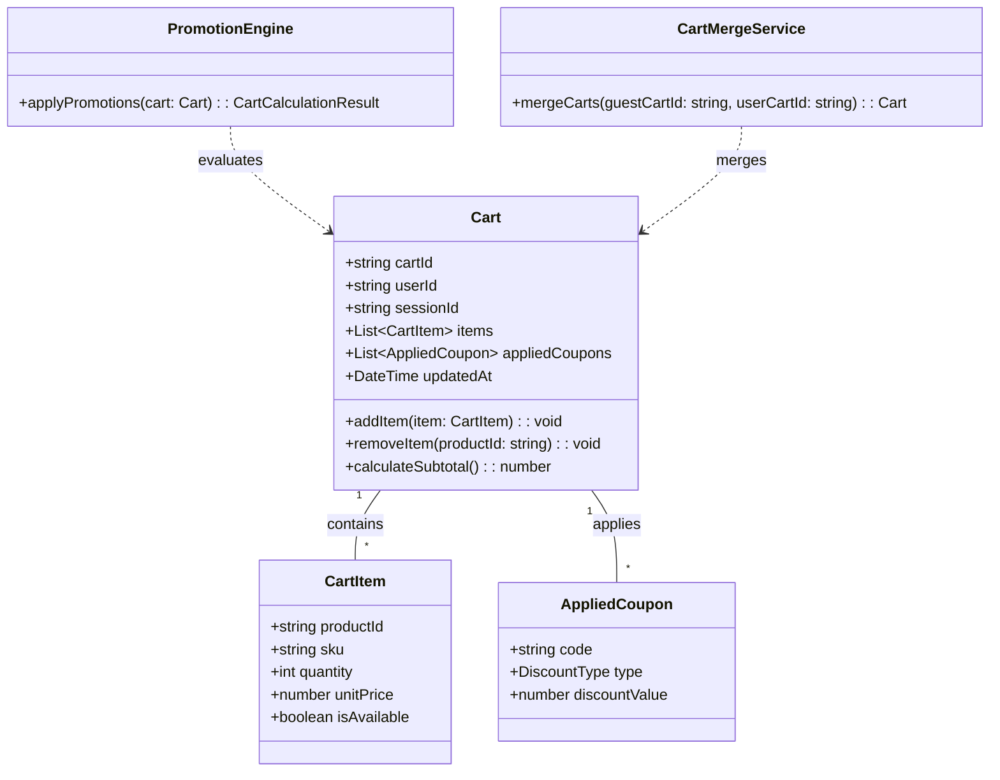
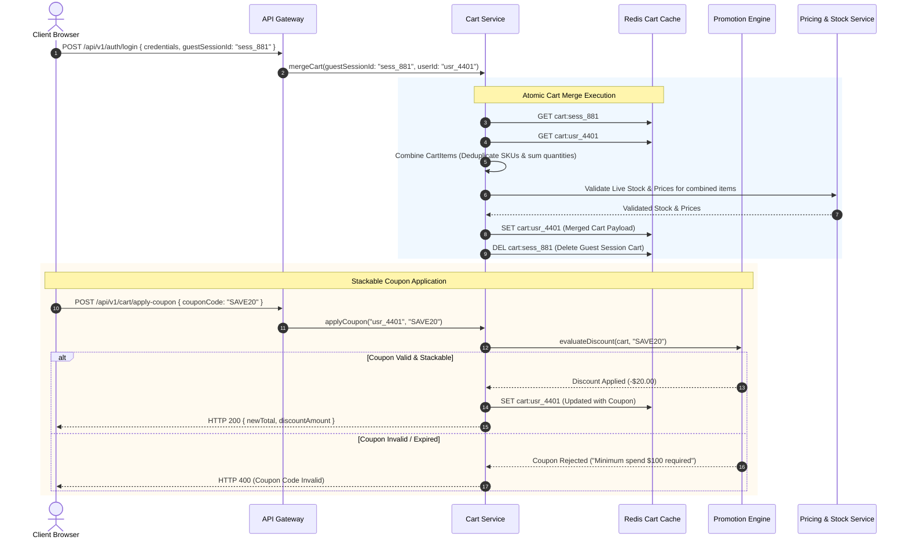
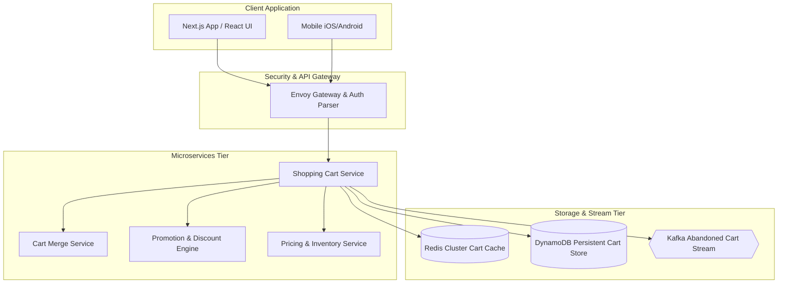

# 🛠️ Enterprise System Design Blueprint: Shopping Cart System (Amazon / Shopify)

> **Target Role:** Principal / Staff Architect / Senior LLD & HLD Engineers  
> **Product Perspective:** Building a high-throughput multi-tenant shopping cart engine serving 50M DAU, processing sub-20ms cart mutations, guest-to-user session cart merging, dynamic promo code stacking, and live price/inventory validation.  
> **Navigation:** ⬅️ [Back to Category Index](./README.md) | ⬅️ [Back to Problem Bank Index](../README.md)

---

## 1. 🎯 Requirements & Product Scope

### 📋 Functional Requirements (FR)

1. **Guest & Anonymous Shopping Cart:** Unauthenticated guest users can add, update, and remove items stored against an encrypted HTTP-only session cookie or UUID token.
2. **Seamless Guest-to-User Cart Merge:** Upon user login or account registration, automatically merge anonymous guest cart items into the user's persistent user cart without losing items or duplicating SKUs.
3. **Real-Time Price & Inventory Sync:** Validate item stock availability and update unit prices in real time when cart items are viewed or updated.
4. **Stackable Coupon & Discount Engine:** Apply promotional coupon codes, percentage discounts, fixed tier deals, and buy-X-get-Y offers with rules validation.
5. **Multi-Currency & Tax Estimation:** Calculate real-time cart subtotal, estimated shipping fees, and regional sales tax across multiple currencies.
6. **Cart Persistence & TTL Expiration:** Cart state persists across devices for logged-in users; guest carts expire automatically after 30 days of inactivity.

### ⚡ Non-Functional Requirements (NFR)

1. **Ultra-Low Latency:** Cart read/write operations $P_{99} < 20\text{ms}$.
2. **High Availability:** $99.999\%$ system availability for cart operations ($<5.26$ minutes downtime/year).
3. **High Write Concurrency:** Handle 100,000 QPS peak cart updates during global shopping events (Black Friday / Cyber Monday).
4. **Eventual Consistency with Strict Checkout Lock:** Cart state can be eventually consistent during browsing, but must acquire strict price & inventory locks upon transitioning to checkout.

---

## 2. 🧮 Scale & Quantitative Estimates

```
Traffic & Concurrency Estimates:
- Active Users: 50M DAU
- Total Stored Carts: 100 Million active carts (Guest + User)
- Daily Cart Mutations: 500 Million add/update/remove operations / day
- Average Write QPS: 5,800 QPS
- Peak Write QPS: 100,000 QPS during peak sale events.

Storage & Memory Calculations (3-Year Projection):
- Cart Item Payload: Average 5 items per cart @ 200 bytes per item = 1 KB per cart
- Active Cart Cache (Redis Cluster): 100M active carts * 1 KB = 100 GB in-memory RAM footprint
- Persistent Cart DB (DynamoDB / Cassandra): 100M records = 100 GB primary storage.
```

---

## 3. 🛠️ Tech Stack & Architectural Justifications

| Layer / Component | Technology Choice | Architectural Rationale |
| :--- | :--- | :--- |
| **Frontend State** | React + Zustand / Redux Toolkit | Optimistic UI updates for immediate cart state changes before server HTTP confirmation. |
| **API Gateway** | Envoy API Gateway | Handles guest session cookie parsing, JWT user auth verification, rate limiting, and CORS headers. |
| **Primary Cart Cache** | Redis Cluster (ElastiCache) | Ultra-fast in-memory JSON document storage (`JSON.SET` / Hash maps) for sub-5ms cart reads and writes. |
| **Persistent Cart DB** | Amazon DynamoDB / Cassandra | Distributed NoSQL database providing single-digit millisecond latency key-value persistence partitioned by `userId` or `sessionId`. |
| **Pricing & Stock Service** | gRPC Microservices | Provides real-time unit price and stock availability checks prior to cart render and checkout initiation. |
| **Event Bus** | Apache Kafka | Streams cart abandonment events for retargeting emails and analytics pipelines. |

---

## 4. 📐 Visual UML Diagrams

### 🏗️ Class Diagram (Shopping Cart Micro-Domain)



### 🔄 Sequence Diagram: Guest Cart Merge & Coupon Application Flow



### 🧩 Component & System Architecture Diagram (HLD)



---

## 5. 🧱 OOP & SOLID Principles Mapping

- **Single Responsibility Principle (SRP):** `CartManager` manages cart item mutation; `CartMergeManager` handles guest-to-user consolidation logic; `PromotionEvaluator` executes coupon discounting rules.
- **Open/Closed Principle (OCP):** Promotion processing uses a `DiscountRule` interface. Adding BOGO deals, free shipping vouchers, or tier-based percentage discounts requires zero changes to core cart persistence.
- **Liskov Substitution Principle (LSP):** All discount models (`PercentageDiscount`, `FixedAmountDiscount`, `FreeShippingDiscount`) conform to `DiscountStrategy`.
- **Interface Segregation Principle (ISP):** Expose minimal interfaces (`ICartReader`, `ICartWriter`) preventing external systems from mutating internal cart state directly.
- **Dependency Inversion Principle (DIP):** `CartService` depends on abstract `ICartRepository` and `IPromotionEngine` abstractions.

---

## 6. 🎨 Design Patterns Applied

1. **Decorator Pattern:** Wraps base cart subtotal with dynamic discount decorators (`PercentageDiscountDecorator`, `TaxCalculatorDecorator`, `ShippingFeeDecorator`).
2. **Strategy Pattern:** Enforces customizable coupon evaluation rules via `CouponStrategy`.
3. **Factory Pattern:** `CartFactory` instantiates empty or merged cart objects depending on session token state.
4. **Observer Pattern:** Cart mutation events trigger background workers via Kafka to identify abandoned carts after 24 hours of inactivity.

---

## 7. 💻 Production Code Blueprint (TypeScript)

### 1. Domain Entities & Decorator Pattern for Cart Pricing

```typescript
export interface CartItem {
  productId: string;
  sku: string;
  quantity: number;
  unitPrice: number;
}

export interface ICartCalculator {
  calculateTotal(items: CartItem[]): number;
}

export class BaseCartCalculator implements ICartCalculator {
  calculateTotal(items: CartItem[]): number {
    return items.reduce((acc, item) => acc + item.unitPrice * item.quantity, 0);
  }
}

// Decorator Base Class
export abstract class CartCalculatorDecorator implements ICartCalculator {
  constructor(protected wrapped: ICartCalculator) {}
  abstract calculateTotal(items: CartItem[]): number;
}

// Concrete Decorator 1: Percentage Discount
export class PercentageDiscountDecorator extends CartCalculatorDecorator {
  constructor(wrapped: ICartCalculator, private percentage: number) {
    super(wrapped);
  }

  calculateTotal(items: CartItem[]): number {
    const base = this.wrapped.calculateTotal(items);
    return base * (1 - this.percentage / 100);
  }
}

// Concrete Decorator 2: Sales Tax
export class TaxDecorator extends CartCalculatorDecorator {
  constructor(wrapped: ICartCalculator, private taxRate: number) {
    super(wrapped);
  }

  calculateTotal(items: CartItem[]): number {
    const base = this.wrapped.calculateTotal(items);
    return base * (1 + this.taxRate);
  }
}
```

### 2. Redis Session Cart Storage Manager

```typescript
import Redis from 'ioredis';

export interface CartPayload {
  cartId: string;
  userId?: string;
  items: CartItem[];
  appliedCoupons: string[];
  updatedAt: number;
}

export class RedisCartRepository {
  constructor(private redis: Redis) {}

  private getCartKey(cartId: string): string {
    return `cart:${cartId}`;
  }

  async getCart(cartId: string): Promise<CartPayload | null> {
    const data = await this.redis.get(this.getCartKey(cartId));
    if (!data) return null;
    return JSON.parse(data) as CartPayload;
  }

  async saveCart(cart: CartPayload, ttlSeconds: number = 2592000): Promise<void> {
    const key = this.getCartKey(cart.cartId);
    cart.updatedAt = Date.now();
    await this.redis.set(key, JSON.stringify(cart), 'EX', ttlSeconds);
  }

  async deleteCart(cartId: string): Promise<void> {
    await this.redis.del(this.getCartKey(cartId));
  }
}
```

### 3. Guest-to-User Cart Merge Service

```typescript
export class CartMergeService {
  constructor(private cartRepo: RedisCartRepository) {}

  async mergeGuestCartIntoUserCart(
    guestSessionId: string,
    userId: string
  ): Promise<CartPayload> {
    const guestCart = await this.cartRepo.getCart(guestSessionId);
    let userCart = await this.cartRepo.getCart(userId);

    if (!guestCart || guestCart.items.length === 0) {
      return userCart || { cartId: userId, userId, items: [], appliedCoupons: [], updatedAt: Date.now() };
    }

    if (!userCart) {
      userCart = {
        cartId: userId,
        userId,
        items: [],
        appliedCoupons: [],
        updatedAt: Date.now(),
      };
    }

    // Merge Items (Deduplicate by SKU)
    const itemMap = new Map<string, CartItem>();

    for (const item of userCart.items) {
      itemMap.set(item.sku, { ...item });
    }

    for (const item of guestCart.items) {
      if (itemMap.has(item.sku)) {
        const existing = itemMap.get(item.sku)!;
        existing.quantity += item.quantity;
      } else {
        itemMap.set(item.sku, { ...item });
      }
    }

    userCart.items = Array.from(itemMap.values());
    userCart.appliedCoupons = Array.from(new Set([...userCart.appliedCoupons, ...guestCart.appliedCoupons]));

    // Persist merged cart and purge guest cart
    await this.cartRepo.saveCart(userCart);
    await this.cartRepo.deleteCart(guestSessionId);

    return userCart;
  }
}
```

---

## 8. 🔀 High-Level Design (HLD) & Scale Bottlenecks

### 1. Stale Cart Prices & Out-of-Stock Checkout Failures
- **Problem:** A user leaves an item in their cart for 2 weeks. The merchant raises the price from \$50 to \$80 or out-of-stock occurs.
- **Solution:** Do NOT lock price or stock inside the long-lived cart repository. Cart items store `productId`, `sku`, and `quantity`. When the user fetches their cart or transitions to checkout, the Cart Service calls the Pricing & Inventory service in parallel (`Promise.all`) to re-hydrate current live unit prices and stock availability badges.

### 2. High Memory Footprint on 100 Million Active Carts
- **Problem:** Storing 100 Million full JSON cart documents in Redis consumes massive RAM.
- **Solution:** 
  1. Compress JSON payloads using Gzip / MessagePack before saving to Redis.
  2. Implement a two-tiered caching model: Active cart keys stay in Redis with a 7-day LRU eviction policy; inactive carts persist in DynamoDB NoSQL database, re-hydrated back into Redis only on user request.

---

## ❓ 9. Collapsed Senior/Staff Level Grill Q&A

<details>
<summary>x❓ How do you prevent race conditions when a user adds items to their cart simultaneously from multiple browser tabs?</summary>

**Answer:**  
We use **Optimistic Locking with Versioning / ETag Headers** or Redis Lua scripts for atomic updates. Each cart update request submits the `version` number (`ETag`). If another tab mutated the cart payload in Redis first, the version check fails with HTTP 412 (Precondition Failed), prompting the client UI to refetch the latest cart state and re-apply the mutation.

</details>

<details>
<summary>❓ How do you handle coupon stacking abuse (e.g. combining two mutually exclusive 50% coupons)?</summary>

**Answer:**  
Every coupon entity possesses a `stackableCategory` and `exclusivityGroup` property. The `PromotionEngine` evaluates coupon arrays against an immutable dependency rules engine. If a user attempts to add an exclusive coupon code to a cart already containing a restricted promo, the engine rejects the addition and returns an explicit policy error code (`COUPON_MUTUALLY_EXCLUSIVE`).

</details>

<details>
<summary>❓ How do you detect and trigger Abandoned Cart email campaigns without querying the main database?</summary>

**Answer:**  
We leverage **Kafka Delay Queues / TTL Event Streams**. When a cart is updated, we publish a `CART_UPDATED` event to Kafka with a 24-hour delay window. If no `CHECKOUT_COMPLETED` event is received for that `userId` within 24 hours, an downstream `AbandonedCartWorker` reads the message from the delay topic, fetches the cart payload, and triggers a personalized discount reminder email.

</details>
