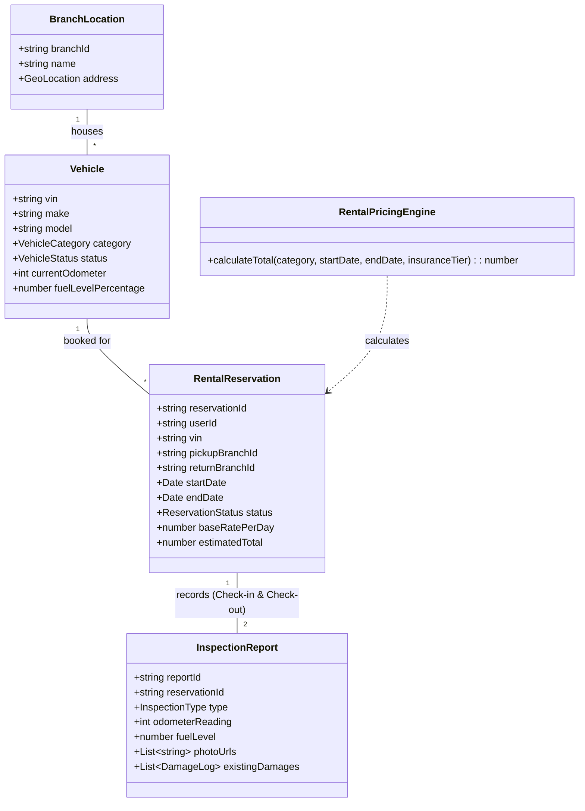
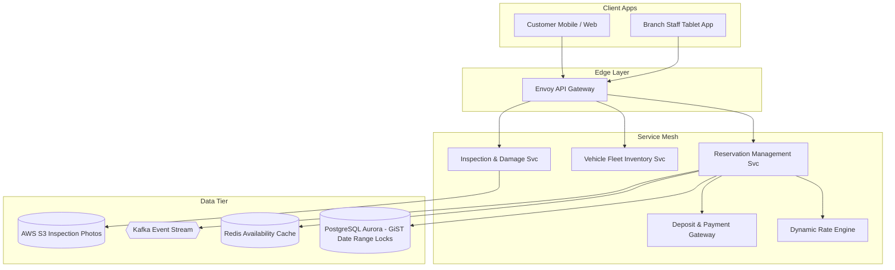

# 🛠️ Enterprise System Design Blueprint: Car Rental System (Hertz / Enterprise / Turo)

> **Target Role:** Principal / Staff Architect / Senior LLD & HLD Engineers  
> **Product Perspective:** Building a global vehicle fleet reservation and rental lifecycle platform managing 500,000 vehicles, 10,000 branch locations, sub-50ms availability searches, date-range lock isolation, and damage deposit settlements.  
> **Navigation:** ⬅️ [Back to Category Index](./README.md) | ⬅️ [Back to Problem Bank Index](../README.md)

---

## 1. 🎯 Requirements & Product Scope

### 📋 Functional Requirements (FR)

1. **Vehicle Fleet Inventory & Search:** Search available vehicles across pickup/dropoff branches, rental date ranges, vehicle classes (Sedan, SUV, Luxury, Electric), and features.
2. **Date-Range Overlap Prevention:** Guarantee that a physical vehicle (VIN) or category slot is reserved atomically with zero date-range double bookings.
3. **Dynamic Daily Rate & Insurance Options:** Calculate rental charges based on base daily rate, dynamic seasonal demand multipliers, rental duration tiers, and optional insurance/add-on coverage.
4. **Security Deposit Pre-Authorization:** Pre-authorize credit card hold for security deposit upon booking confirmation, converted to final charge upon vehicle return.
5. **Pickup Check-in & Vehicle Inspection:** Digital check-in recording vehicle mileage, fuel/battery level, existing cosmetic damage photos, and key release.
6. **Return Check-out & Settlement:** Inspect return condition, calculate excess mileage/fuel surcharges, compute late return penalties, and process deposit release/charge.

### ⚡ Non-Functional Requirements (NFR)

1. **Zero Double-Booking Guarantee:** 100% isolation constraint enforcing non-overlapping reservation date ranges per vehicle VIN (`tstzrange` SQL exclusion constraints).
2. **Low Search Latency:** Availability search response $P_{99} < 50\text{ms}$.
3. **High System Availability:** $99.99\%$ uptime across global branch reservation desks.
4. **Audit Durability:** Immutable record of pre/post rental inspection photos, odometer logs, and financial transactions.

---

## 2. 🧮 Scale & Quantitative Estimates

```
Scale & Traffic Estimates:
- Total Fleet Size: 500,000 vehicles globally
- Global Branch Locations: 10,000 locations
- Daily Active Reservations: 100,000 reservations / day
- Average Search QPS: 2,500 QPS (Peak: 15,000 QPS during holiday booking surges)
- Booking Write QPS: ~50 QPS (Low write QPS, high business value isolation)

Storage & Data Calculations (5-Year Projection):
- Vehicle Inventory DB: 500,000 rows @ 2 KB = 1 GB (Primary Postgres DB)
- Reservation Ledger: 100,000 reservations/day * 365 * 5 = 182.5 Million Records ~ 50 GB
- Inspection Photos: 100k rentals/day * 6 photos * 500 KB = 300 GB / day stored in AWS S3 with CloudFront CDN.
```

---

## 3. 🛠️ Tech Stack & Architectural Justifications

| Layer / Component | Technology Choice | Architectural Rationale |
| :--- | :--- | :--- |
| **Branch & Web Apps** | Next.js 14 + React Native | Responsive web app for consumer bookings; tablet-optimized Native app for branch vehicle inspection check-in. |
| **API Gateway** | Envoy API Gateway | Handles JWT authentication, TLS termination, rate limiting, and branch desk request routing. |
| **Primary Relational DB** | PostgreSQL (Amazon Aurora) | Native support for range data types (`tstzrange`) and GiST indexes to guarantee zero date-range overlap. |
| **Availability Cache** | Redis Cluster | Bitmaps / Date Hash sets for fast pre-filtering of available vehicle categories per location. |
| **Media Storage** | AWS S3 + CloudFront CDN | Distributed object store for high-resolution vehicle damage inspection photos. |
| **Event Bus & Stream** | Apache Kafka | Decouples reservation events, late return warnings, maintenance alerts, and billing settlement. |

---

## 4. 📐 Visual UML Diagrams

### 🏗️ Class Diagram (Car Rental Domain)



### 🔄 Sequence Diagram: Reservation, Pickup Inspection & Return Settlement

```mermaid
sequenceDiagram
    autonumber
    actor Customer as Customer / Mobile App
    actor Staff as Branch Desk Staff
    participant Gateway as API Gateway
    participant ResSvc as Reservation Service
    participant DB as PostgreSQL DB (GiST Index)
    participant Payment as Payment Gateway

    Customer->>Gateway: POST /api/v1/reservations { category, pickupBranch, startDate, endDate }
    Gateway->>ResSvc: createReservation(payload)
    
    rect rgb(240, 248, 255)
        Note over ResSvc,DB: SQL Date-Range Overlap Lock Execution
        ResSvc->>DB: INSERT INTO reservations VALUES (...) WITH EXCLUDE USING gist (vin WITH =, tstzrange(start, end) WITH &&)
        alt Overlapping Reservation Exists
            DB-->>ResSvc: EXCLUSION_VIOLATION (23P01)
            ResSvc-->>Customer: HTTP 409 (Vehicle Category Unavailable for dates)
        else Reservation Locked
            DB-->>ResSvc: Reservation Created (res_9901)
            ResSvc->>Payment: Pre-authorize Deposit ($500 Hold)
            Payment-->>ResSvc: Pre-auth Token (tx_hold_77)
            ResSvc-->>Customer: HTTP 201 { reservationId: "res_9901" }
        end
    end

    rect rgb(240, 255, 240)
        Note over Staff,ResSvc: Vehicle Pickup & Check-in
        Staff->>Gateway: POST /api/v1/inspections/check-in { reservationId, odometer, photos }
        Gateway->>ResSvc: recordCheckIn()
        ResSvc->>DB: UPDATE vehicle SET status='IN_RENTAL'; INSERT INTO inspection_reports;
    end

    rect rgb(255, 250, 240)
        Note over Staff,Payment: Vehicle Return & Final Settlement
        Staff->>Gateway: POST /api/v1/inspections/check-out { reservationId, returnOdometer, fuelLevel }
        Gateway->>ResSvc: processReturn()
        ResSvc->>ResSvc: Calculate excess mileage & fuel surcharge
        ResSvc->>Payment: Capture Pre-auth Hold ($500 -> Charge $320 final rental fee, release $180)
        ResSvc->>DB: UPDATE vehicle SET status='AVAILABLE'; UPDATE reservation SET status='COMPLETED';
        ResSvc-->>Customer: Digital Receipt Emailed
    end
```

### 🧩 Component & System Architecture Diagram (HLD)



---

## 5. 🧱 OOP & SOLID Principles Mapping

- **Single Responsibility Principle (SRP):** `ReservationEngine` strictly handles date isolation and booking records; `InspectionService` processes mileage/fuel damage reports; `PricingEngine` calculates daily rates.
- **Open/Closed Principle (OCP):** Daily rate calculation uses a `RateCalculationStrategy` interface. Adding holiday peak pricing, long-term monthly discounts, or corporate rate contracts does not modify core booking code.
- **Liskov Substitution Principle (LSP):** All vehicle categories (`SedanVehicle`, `ElectricVehicle`, `LuxuryVehicle`) implement `IVehicle` and conform to state machine contracts.
- **Interface Segregation Principle (ISP):** Branch tablet applications use `IBranchInspectionAPI` while consumers use `IConsumerBookingAPI`.
- **Dependency Inversion Principle (DIP):** `ReservationService` injects high-level `IReservationRepository` and `IPaymentGateway` abstractions.

---

## 6. 🎨 Design Patterns Applied

1. **State Pattern:** Manages `VehicleStatus` transitions (`Available` -> `Reserved` -> `InRental` -> `UnderMaintenance` -> `OutOfService`), ensuring a vehicle under maintenance cannot be assigned to active reservations.
2. **Strategy Pattern:** Enforces flexible daily rate calculations via `RentalPricingStrategy` (Seasonal multipliers, weekend surcharges, duration discounts).
3. **Factory Pattern:** `VehicleFactory` instantiates vehicle objects with appropriate category-specific inspection checklists (e.g. EV battery state for Electrics vs fuel level for Gas vehicles).
4. **Command Pattern:** Encapsulates `CheckInCommand` and `CheckOutCommand` for audit trail tracking and transaction execution.

---

## 7. 💻 Production Code Blueprint (TypeScript)

### 1. Domain Entities & State Engine

```typescript
export enum VehicleStatus {
  AVAILABLE = 'AVAILABLE',
  RESERVED = 'RESERVED',
  IN_RENTAL = 'IN_RENTAL',
  UNDER_MAINTENANCE = 'UNDER_MAINTENANCE',
  OUT_OF_SERVICE = 'OUT_OF_SERVICE',
}

export enum VehicleCategory {
  COMPACT = 'COMPACT',
  SEDAN = 'SEDAN',
  SUV = 'SUV',
  LUXURY = 'LUXURY',
  ELECTRIC = 'ELECTRIC',
}

export interface RentalPricingStrategy {
  calculateRentalFee(
    baseDailyRate: number,
    startDate: Date,
    endDate: Date,
    insuranceTierRate: number
  ): number;
}

export class StandardRentalPricingStrategy implements RentalPricingStrategy {
  calculateRentalFee(
    baseDailyRate: number,
    startDate: Date,
    endDate: Date,
    insuranceTierRate: number
  ): number {
    const diffTime = Math.abs(endDate.getTime() - startDate.getTime());
    const rentalDays = Math.max(Math.ceil(diffTime / (1000 * 60 * 60 * 24)), 1);

    let dailyRate = baseDailyRate;

    // Apply duration discount (>7 days = 15% off)
    if (rentalDays >= 7) {
      dailyRate *= 0.85;
    }

    const subtotal = (dailyRate + insuranceTierRate) * rentalDays;
    return Math.round(subtotal * 100) / 100;
  }
}
```

### 2. PostgreSQL Date-Range Overlap Lock Reservation Service

```typescript
export interface DatabaseClient {
  query(sql: string, params?: any[]): Promise<any>;
}

export class ReservationService {
  constructor(
    private db: DatabaseClient,
    private pricingStrategy: RentalPricingStrategy
  ) {}

  /**
   * Executes Reservation creation with PostgreSQL GiST Date Range Overlap Lock
   */
  async createReservation(
    userId: string,
    vin: string,
    pickupBranchId: string,
    returnBranchId: string,
    startDate: Date,
    endDate: Date,
    baseDailyRate: number,
    insuranceRate: number
  ): Promise<{ success: boolean; reservationId?: string; totalAmount?: number; error?: string }> {
    const totalAmount = this.pricingStrategy.calculateRentalFee(
      baseDailyRate,
      startDate,
      endDate,
      insuranceRate
    );

    const reservationId = `res_${Date.now()}_${Math.floor(Math.random() * 1000)}`;

    // PostgreSQL Exclusion Constraint Query preventing date overlap
    const insertSQL = `
      INSERT INTO reservations (
        id, user_id, vin, pickup_branch_id, return_branch_id, booking_period, total_amount, status
      ) VALUES (
        $1, $2, $3, $4, $5, tstzrange($6, $7, '[]'), $8, 'CONFIRMED'
      )
      RETURNING id;
    `;

    try {
      await this.db.query(insertSQL, [
        reservationId,
        userId,
        vin,
        pickupBranchId,
        returnBranchId,
        startDate.toISOString(),
        endDate.toISOString(),
        totalAmount,
      ]);

      return { success: true, reservationId, totalAmount };
    } catch (err: any) {
      // Catch SQL Exclusion Constraint Violation (23P01)
      if (err.code === '23P01' || err.message?.includes('exclusion constraint')) {
        return {
          success: false,
          error: 'The requested vehicle is already reserved for the selected date range.',
        };
      }
      throw err;
    }
  }
}
```

---

## 8. 🔀 High-Level Design (HLD) & Scale Bottlenecks

### 1. Eliminating Double-Bookings using PostgreSQL GiST Indexes
- **Problem:** Conventional `SELECT * FROM reservations WHERE vin = X AND start <= newEnd AND end >= newStart` queries suffer from race conditions under high concurrent booking volume.
- **Solution:** Configure PostgreSQL table with an explicit Exclusion Constraint using GiST index:
  ```sql
  CREATE EXTENSION IF NOT EXISTS btree_gist;
  
  CREATE TABLE reservations (
    id VARCHAR(64) PRIMARY KEY,
    vin VARCHAR(32) NOT NULL,
    booking_period TSTZRANGE NOT NULL,
    EXCLUDE USING gist (vin WITH =, booking_period WITH &&)
  );
  ```
  The database engine natively enforces zero date-range overlaps (`&&` operator) at the storage level with $O(\log N)$ performance.

### 2. Managing Late Returns & Cascading Reservation Collisions
- **Problem:** Customer A is scheduled to return a car at 10 AM, but delays return until 4 PM. Customer B is scheduled to pick up the same car at 11 AM.
- **Solution:** Implement **Buffer Windows & Auto-Reassignment Engine**.
  1. The system adds a mandatory 3-hour cleanup/turnaround buffer to all booking periods (`tstzrange(start, end + INTERVAL '3 hours')`).
  2. If Customer A fails to return vehicle within 30 minutes of expiration, a Kafka event triggers the `ReassignmentWorker`. The worker automatically re-assigns Customer B to an upgraded vehicle in the same branch location at no extra charge.

---

## ❓ 9. Collapsed Senior/Staff Level Grill Q&A

<details>
<summary>❓ How do you handle unrecorded cosmetic damage disputes between consecutive renters?</summary>

**Answer:**  
We mandate high-resolution 6-point photo uploads via the branch mobile app during both Pickup Check-in and Return Check-out. Photos are stamped with cryptographic EXIF metadata (GPS coordinates, time, employee ID) and stored in AWS S3. If damage is reported post-return, an automated image diff tool compares check-in vs check-out photos. The renter is only held liable if damage is verifiably absent in the check-in photo set.

</details>

<details>
<summary>❓ How do you structure vehicle inventory search across 500,000 cars for arbitrary date ranges?</summary>

**Answer:**  
Searching availability per vehicle VIN across dates is pre-filtered at the Category & Branch level. We maintain a Redis Bitset for each `branchId:category:date`. Each vehicle VIN corresponds to a bit offset. If a vehicle is reserved on Date D, its bit is set to `1`. An availability search for a 3-day range executes a fast bitwise `BITOP OR` across the 3 date bitsets in Redis in $<2\text{ms}$.

</details>

<details>
<summary>❓ Why pre-authorize security deposits instead of executing a direct charge and refund later?</summary>

**Answer:**  
Direct charges incur two sets of non-refundable credit card processing fees (interchange fees on charge + refund) and subject the customer to 3-5 business day bank refund delays. Pre-authorization holds validate credit availability without capturing funds. Upon return, the exact final rental fee is captured against the hold, releasing remaining credit line instantly with zero excess interchange fee overhead.

</details>
