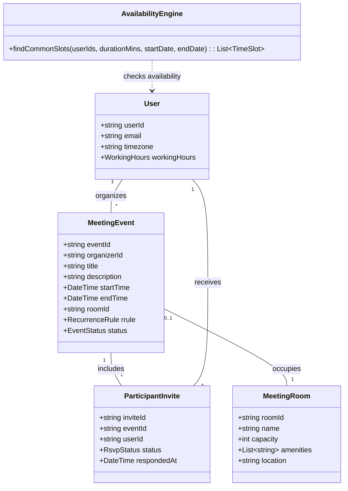
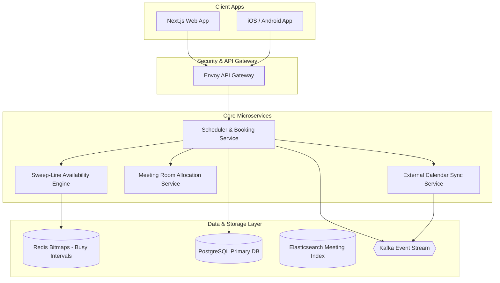

# 🛠️ Enterprise System Design Blueprint: Meeting Scheduler (Calendly / Google Calendar)

> **Target Role:** Principal / Staff Architect / Senior LLD & HLD Engineers  
> **Product Perspective:** Building a high-performance meeting scheduling engine serving 10M DAU, discovering mutual free time slots across multi-participant timezones using Sweep-Line algorithms in $<50\text{ms}$, managing room allocations, and iCal RSVP state synchronization.  
> **Navigation:** ⬅️ [Back to Category Index](./README.md) | ⬅️ [Back to Problem Bank Index](../README.md)

---

## 1. 🎯 Requirements & Product Scope

### 📋 Functional Requirements (FR)

1. **User & Calendar Integration:** Users connect personal/work calendars (Google Calendar, Outlook) with defined working hours and timezone preferences.
2. **Mutual Free/Busy Slot Discovery:** Given a list of participants and desired meeting duration (e.g., 30 mins), automatically calculate and return overlapping available time slots using interval intersection algorithms.
3. **Meeting Room Allocation:** Allocate physical meeting rooms based on participant capacity, required equipment (Video Conf, Whiteboard), and location proximity.
4. **Booking & iCal Invite Dispatch:** Schedule meetings, generate standard `.ics` / CalDAV invite payloads, and dispatch calendar invites via Email and Push Notifications.
5. **RSVP Lifecycle Management:** Track participant RSVP responses (`ACCEPTED`, `DECLINED`, `TENTATIVE`, `PENDING`) with real-time meeting status updates.
6. **Recurring Meeting Series (RRule):** Support recurring meeting rules (Daily, Weekly, Monthly, Exclusions) without inflating database row storage.

### ⚡ Non-Functional Requirements (NFR)

1. **Sub-50ms Slot Discovery:** Overlapping slot finding algorithms must execute in $P_{99} < 50\text{ms}$ for up to 50 participants.
2. **Zero Double-Booking Guarantee:** Prevent booking conflicting meetings or physical rooms for overlapping time intervals.
3. **Multi-Timezone Precision:** 100% accuracy in DST (Daylight Saving Time) conversions and offset calculations.
4. **High Availability:** $99.99\%$ uptime for critical enterprise calendar scheduling endpoints.

---

## 2. 🧮 Scale & Quantitative Estimates

```
Traffic & Concurrency Estimates:
- Active Users: 10M DAU
- Daily Calendar Events: 50 Million meeting events / day
- Slot Discovery Searches: 20 Million slot search queries / day
- Average Search QPS: 230 QPS (Peak: 5,000 QPS during enterprise morning hours)
- Booking Write QPS: ~580 QPS

Storage Calculations (5-Year Projection):
- Calendar Events DB: 50M events/day * 365 * 5 = 91.25 Billion Event Rows ~ 18.25 TB (PostgreSQL Partitioned)
- Participant Invites: 50M events * 4 attendees = 200M invite status rows/day = 73 TB Total storage.
- In-Memory Availability Cache (Redis): 10M users * 30 days * 48 half-hour slots = 14.4 Billion bits ~ 1.8 GB RAM footprint.
```

---

## 3. 🛠️ Tech Stack & Architectural Justifications

| Layer / Component | Technology Choice | Architectural Rationale |
| :--- | :--- | :--- |
| **Frontend Framework** | Next.js 14 + FullCalendar.js | Fast SSR calendar grid views; interactive drag-and-drop meeting slot selection; client timezone parsing. |
| **API Gateway** | Envoy API Gateway | Handles OAuth2 token refresh, rate limiting, and gRPC routing. |
| **Primary Relational DB** | PostgreSQL (Amazon Aurora) | Relational integrity for Events, Attendees, Rooms, and SQL Range Types (`tstzrange`) for room lock isolation. |
| **Availability Cache** | Redis Bitmaps / Redlock | In-memory 48-bit daily availability masks per user for sub-millisecond bitwise `AND` slot computations. |
| **Event Bus & Worker** | Apache Kafka + Celery / Go Workers | Asynchronous calendar synchronization (Google/Outlook APIs), notification dispatch, and RRule expansion. |
| **Search Engine** | Elasticsearch | Indexing meeting topics, participant availability indices, and room metadata for fast enterprise queries. |

---

## 4. 📐 Visual UML Diagrams

### 🏗️ Class Diagram (Meeting Scheduler Core)



### 🔄 Sequence Diagram: Mutual Free Slot Discovery & Booking Workflow

```mermaid
sequenceDiagram
    autonumber
    actor Organizer as Organizer Client App
    participant Gateway as API Gateway
    participant SchedSvc as Scheduler Service
    participant AvailEngine as Availability Engine (Sweep-Line)
    participant Redis as Redis Availability Cache
    participant DB as PostgreSQL DB
    participant SyncWorker as External Calendar Sync Worker

    Organizer->>Gateway: POST /api/v1/slots/find { participantIds: ["U1","U2","U3"], duration: 30m, date: "2026-08-15" }
    Gateway->>SchedSvc: findFreeSlots(payload)
    
    rect rgb(240, 248, 255)
        Note over SchedSvc,Redis: In-Memory Sweep-Line Execution
        SchedSvc->>Redis: MGET user:U1:busy user:U2:busy user:U3:busy
        Redis-->>SchedSvc: Bitmaps / Busy Intervals for U1, U2, U3
        SchedSvc->>AvailEngine: executeSweepLine(intervals, duration: 30m)
        AvailEngine-->>SchedSvc: Common Available Slots ["10:00-10:30", "14:30-15:00"]
        SchedSvc-->>Organizer: HTTP 200 { availableSlots }
    end

    rect rgb(255, 250, 240)
        Note over Organizer,SyncWorker: Confirm Meeting & Dispatch Invites
        Organizer->>Gateway: POST /api/v1/meetings/create { title, startTime, endTime, participants, roomId }
        Gateway->>SchedSvc: createMeeting(payload)
        SchedSvc->>DB: BEGIN TX; INSERT INTO events; INSERT INTO invites; COMMIT;
        SchedSvc->>DB: Lock Room via tstzrange Exclusion Constraint
        SchedSvc->>SyncWorker: Dispatch Kafka "EVENT_CREATED"
        SyncWorker->>SyncWorker: Generate iCal .ics payload & Sync with Google/Outlook APIs
        SchedSvc-->>Organizer: HTTP 201 { eventId: "evt_8801", status: "SCHEDULED" }
    end
```

### 🧩 Component & System Architecture Diagram (HLD)



---

## 5. 🧱 OOP & SOLID Principles Mapping

- **Single Responsibility Principle (SRP):** `AvailabilityEngine` computes free/busy interval intersections; `RoomManager` manages room asset features; `iCalExporter` generates standard `.ics` payloads.
- **Open/Closed Principle (OCP):** Slot discovery uses a `SlotDiscoveryStrategy` interface (Sweep-Line, Bitwise AND Grid, Segment Tree). Upgrading to a new algorithm doesn't alter scheduling API controllers.
- **Liskov Substitution Principle (LSP):** All RSVP state handlers (`AcceptedState`, `DeclinedState`, `TentativeState`) implement `IInviteState` consistently.
- **Interface Segregation Principle (ISP):** External calendar integrations depend on `ICalendarSyncProvider` rather than full internal user model objects.
- **Dependency Inversion Principle (DIP):** `SchedulerService` injects high-level `IAvailabilityStore` and `INotificationGateway` abstractions.

---

## 6. 🎨 Design Patterns Applied

1. **Sweep-Line Algorithm / Interval Tree Strategy:** Computes mutual free time slots by sorting interval start/end events in $O(N \log N)$ time complexity.
2. **State Pattern:** Governs `RsvpStatus` transitions (`Pending` -> `Accepted` / `Declined` / `Tentative`), automatically updating meeting quorum thresholds.
3. **Command Pattern:** Encapsulates meeting actions (`ScheduleMeetingCommand`, `RescheduleMeetingCommand`, `CancelMeetingCommand`) for undo capability and audit logging.
4. **Observer Pattern:** Triggers notification workers on RSVP updates to adjust participant statuses across client interfaces in real time.

---

## 7. 💻 Production Code Blueprint (TypeScript)

### 1. Sweep-Line Free Slot Discovery Engine

```typescript
export interface TimeInterval {
  start: number; // Unix timestamp in seconds
  end: number;
}

export interface SlotDiscoveryStrategy {
  findCommonSlots(
    participantBusyIntervals: TimeInterval[][],
    windowStart: number,
    windowEnd: number,
    durationSeconds: number
  ): TimeInterval[];
}

export class SweepLineSlotDiscoveryStrategy implements SlotDiscoveryStrategy {
  findCommonSlots(
    participantBusyIntervals: TimeInterval[][],
    windowStart: number,
    windowEnd: number,
    durationSeconds: number
  ): TimeInterval[] {
    const numParticipants = participantBusyIntervals.length;
    if (numParticipants === 0) return [];

    // Step 1: Merge all busy intervals into a unified event list
    enum EventType { BUSY_START = 1, BUSY_END = -1 }
    interface PointEvent {
      time: number;
      type: EventType;
    }

    const events: PointEvent[] = [];

    for (const userIntervals of participantBusyIntervals) {
      for (const interval of userIntervals) {
        // Clamp to search window
        const s = Math.max(interval.start, windowStart);
        const e = Math.min(interval.end, windowEnd);
        if (s < e) {
          events.push({ time: s, type: EventType.BUSY_START });
          events.push({ time: e, type: EventType.BUSY_END });
        }
      }
    }

    // Sort events chronologically (End events before Start events if timestamps match)
    events.sort((a, b) => a.time === b.time ? a.type - b.type : a.time - b.time);

    // Step 2: Sweep line across window to find periods where activeBusyCount == 0
    const freeSlots: TimeInterval[] = [];
    let activeBusyCount = 0;
    let currentFreeStart = windowStart;

    for (const event of events) {
      if (activeBusyCount === 0 && event.time > currentFreeStart) {
        const slotDuration = event.time - currentFreeStart;
        if (slotDuration >= durationSeconds) {
          freeSlots.push({ start: currentFreeStart, end: event.time });
        }
      }

      activeBusyCount += event.type === EventType.BUSY_START ? 1 : -1;

      if (activeBusyCount === 0) {
        currentFreeStart = event.time;
      }
    }

    // Final trailing check
    if (activeBusyCount === 0 && windowEnd > currentFreeStart) {
      if (windowEnd - currentFreeStart >= durationSeconds) {
        freeSlots.push({ start: currentFreeStart, end: windowEnd });
      }
    }

    return freeSlots;
  }
}
```

### 2. Meeting Scheduler Core Service

```typescript
export interface MeetingPayload {
  organizerId: string;
  title: string;
  startTime: Date;
  endTime: Date;
  participantIds: string[];
  roomId?: string;
}

export class SchedulerService {
  constructor(
    private slotStrategy: SlotDiscoveryStrategy,
    private db: any,
    private kafkaBus: any
  ) {}

  async scheduleMeeting(payload: MeetingPayload): Promise<{ eventId: string }> {
    const eventId = `evt_${Date.now()}_${Math.floor(Math.random() * 1000)}`;

    // Begin PostgreSQL Transaction
    await this.db.query('BEGIN');

    try {
      // 1. Check physical room availability if room requested
      if (payload.roomId) {
        const roomLockQuery = `
          INSERT INTO room_bookings (id, room_id, event_id, booking_period)
          VALUES ($1, $2, $3, tstzrange($4, $5, '[]'))
        `;
        await this.db.query(roomLockQuery, [
          `rb_${eventId}`,
          payload.roomId,
          eventId,
          payload.startTime.toISOString(),
          payload.endTime.toISOString(),
        ]);
      }

      // 2. Insert Meeting Event Header
      await this.db.query(
        `INSERT INTO meeting_events (id, organizer_id, title, start_time, end_time, status) VALUES ($1, $2, $3, $4, $5, 'SCHEDULED')`,
        [eventId, payload.organizerId, payload.title, payload.startTime, payload.endTime]
      );

      // 3. Insert Participant Invites
      for (const pid of payload.participantIds) {
        await this.db.query(
          `INSERT INTO participant_invites (id, event_id, user_id, status) VALUES ($1, $2, $3, 'PENDING')`,
          [`inv_${eventId}_${pid}`, eventId, pid]
        );
      }

      await this.db.query('COMMIT');

      // 4. Emit Async Event to Kafka for Calendar Sync & Emails
      await this.kafkaBus.publish('MEETING_SCHEDULED_TOPIC', { eventId, payload });

      return { eventId };
    } catch (err) {
      await this.db.query('ROLLBACK');
      throw err;
    }
  }
}
```

---

## 8. 🔀 High-Level Design (HLD) & Scale Bottlenecks

### 1. Computing Common Slots for Large Groups (50+ Attendees)
- **Problem:** Fetching full event histories for 50 attendees across 30 days from SQL results in heavy database read I/O.
- **Solution:** Store user availability as **Redis 48-bit Daily Bitmaps**. Each bit represents a 30-minute interval (24 hours = 48 slots). `0` represents free, `1` represents busy. Computing common free slots across 50 attendees reduces to executing an atomic Redis `BITOP OR destination_key key1 key2 ... key50` command in $<1\text{ms}$.

### 2. Handling Recurrence Rules (RRule) without Storage Inflation
- **Problem:** Storing 5 years of daily recurring meetings explicitly creates 1,825 individual database rows per user.
- **Solution:** Store a single master event record with an RFC 5545 `rrule` string (`RRULE:FREQ=WEEKLY;BYDAY=MO,WE,FR`). An in-memory expansion worker dynamically expands RRule instances on-the-fly for the requested query window (e.g. 7 days), storing exceptions (e.g. cancelled instances) in a compact `rrule_exceptions` table.

---

## ❓ 9. Collapsed Senior/Staff Level Grill Q&A

<details>
<summary>❓ How do you handle Daylight Saving Time (DST) transitions when scheduling meetings months in advance?</summary>

**Answer:**  
We strictly store all event start and end timestamps in **UTC UNIX Epoch Timestamps** alongside the user's explicit IANA Timezone identifier (e.g. `America/New_York`). During slot display, the frontend converts UTC timestamps into local wall-clock time using the IANA Timezone Database (tzdb), accounting for historical and future DST shifts automatically.

</details>

<details>
<summary>❓ How do you prevent meeting room double-bookings when two organizers click "Book Room" at the exact same millisecond?</summary>

**Answer:**  
We enforce a PostgreSQL Exclusion Constraint on the `room_bookings` table using SQL Range Types:
```sql
CREATE TABLE room_bookings (
  id VARCHAR(64) PRIMARY KEY,
  room_id VARCHAR(64) NOT NULL,
  booking_period TSTZRANGE NOT NULL,
  EXCLUDE USING gist (room_id WITH =, booking_period WITH &&)
);
```
If two transactions attempt to insert overlapping `booking_period` values for the same `room_id`, PostgreSQL rejects the second transaction with a `23P01` exclusion violation error, guaranteeing zero room double bookings.

</details>

<details>
<summary>❓ How do you synchronize meeting updates with external calendars like Google Calendar and Microsoft Outlook reliably?</summary>

**Answer:**  
We implement the **Transactional Outbox Pattern with Exponential Backoff Retries**. When a meeting is modified, we save the update event in an `outbox` database table within the local transaction. An asynchronous Kafka worker picks up outbox records and calls external REST APIs (Google Calendar API / Microsoft Graph API). If external APIs rate limit or time out, Kafka retries with exponential backoff and dead-letter queues (DLQ).

</details>
