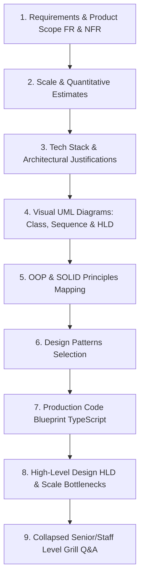

# 🛒 Master System Design Problem Bank — E-Commerce & Booking Systems

> **Target Role:** Principal / Staff Architect / Senior LLD & HLD Engineers  
> **Framework:** Standardized 9-Step Breakdown (Requirements & Product Scope, Scale & Estimates, Tech Stack Justifications, Visual UML Diagrams, OOP & SOLID Mapping, Design Patterns Selection, Production Code Blueprint, HLD & Bottlenecks, and Collapsed Grill Q&A).  
> **Navigation:** ⬅️ [Back to Master Problem Bank Index](../README.md) | 📅 [8-Week Roadmap](../../ROADMAP.md)

---

## 🧭 Category Overview: E-Commerce & Booking Systems (9 Problems)

| # | Problem Blueprint | Level | Key System & LLD Challenges | Master Blueprint Link |
|:---:|:---|:---:|:---|:---:|
| 1 | 📖 **Design Amazon** | `Hard` | Flash Sale Inventory Locks, Distributed Saga Checkout, Outbox Pattern, Multi-Tenant Catalog | [01-Design-Amazon.md](./01-Design-Amazon.md) |
| 2 | 📖 **Design Movie Booking System** | `Hard` | Zero Double-Booking Guarantee, Redis 10-Min Temporary Seat Locks, WebSocket Live Seat Map Sync | [02-Design-Movie-Booking-System.md](./02-Design-Movie-Booking-System.md) |
| 3 | 📖 **Design Online Auction System** | `Hard` | Sub-20ms Atomic Lua Bidding Engine, Auto-Proxy Maximum Bidding, Anti-Sniping Timer Extensions | [03-Design-Online-Auction-System.md](./03-Design-Online-Auction-System.md) |
| 4 | 📖 **Design Online Food Delivery Service** | `Hard` | Three-Sided Marketplace, Driver Matching via Uber H3 Spatial Index, 125k Location Pings/sec | [04-Design-Online-Food-Delivery-Service.md](./04-Design-Online-Food-Delivery-Service.md) |
| 5 | 📖 **Design Ride-Hailing Service** | `Hard` | 500k Location Pings/sec gRPC Ingestion, Flink Dynamic Surge Heatmaps, Single Driver Lock | [05-Design-Ride-Hailing-Service.md](./05-Design-Ride-Hailing-Service.md) |
| 6 | 📖 **Design Amazon Locker** | `Medium` | Package Size Fitting Strategy, Secure 6-Digit OTP Cache, IoT Solenoid Door Controls, BLE Offline Unlock | [06-Design-Amazon-Locker.md](./06-Design-Amazon-Locker.md) |
| 7 | 📖 **Design Shopping Cart** | `Medium` | Guest-to-User Session Cart Merging, Stackable Coupon Decorator Engine, Real-time Price & Stock Hydration | [07-Design-Shopping-Cart.md](./07-Design-Shopping-Cart.md) |
| 8 | 📖 **Design Car Rental System** | `Hard` | PostgreSQL GiST Date Range (`tstzrange`) Overlap Locks, Dynamic Rates, Digital Damage Inspection | [08-Design-Car-Rental-System.md](./08-Design-Car-Rental-System.md) |
| 9 | 📖 **Design Meeting Scheduler** | `Hard` | Sweep-Line Multi-Participant Free Slot Discovery ($<50\text{ms}$), Room Allocation, iCal RSVP Sync | [09-Design-Meeting-Scheduler.md](./09-Design-Meeting-Scheduler.md) |

---

## 📐 Standardized 9-Step Problem Breakdown Framework

Every blueprint in this module strictly adheres to the enterprise 9-step architect breakdown:

---

## 🧠 Core Architectural Patterns in E-Commerce & Booking Systems

1. **Saga Orchestration Pattern:** Coordinates multi-service distributed transactions (Inventory Hold -> Payment Authorization -> Order Confirmation -> Delivery Dispatch) with automatic compensating step rollbacks on failure.
2. **Geospatial Uber H3 / QuadTree Indexing:** Partitions geographic space into hexagonal cell buckets enabling $O(1)$ fast proximity discovery of available delivery drivers and ride-hailing vehicles.
3. **Distributed Locks & Short-TTL Bitfields:** Utilizes single-threaded Redis Lua scripts to execute atomic inventory decrements, 10-minute temporary seat locks, and microsecond bid execution without database lock contention.
4. **PostgreSQL GiST Date-Range Exclusion Locks:** Employs `tstzrange` column types with PostgreSQL `EXCLUDE USING gist` constraints to natively guarantee zero date-range overlaps for car rentals and meeting rooms at the database engine level.
5. **Sweep-Line / Interval Intersection Algorithms:** Sorts busy time intervals chronologically to discover common overlapping free meeting slots across multi-participant enterprise schedules in $O(N \log N)$ time complexity.
6. **Decorator & Strategy Patterns:** Encapsulates dynamic pricing rules, promotional coupon stacking, surge multipliers, and vehicle rate calculation strategies without mutating core business domain entities.
