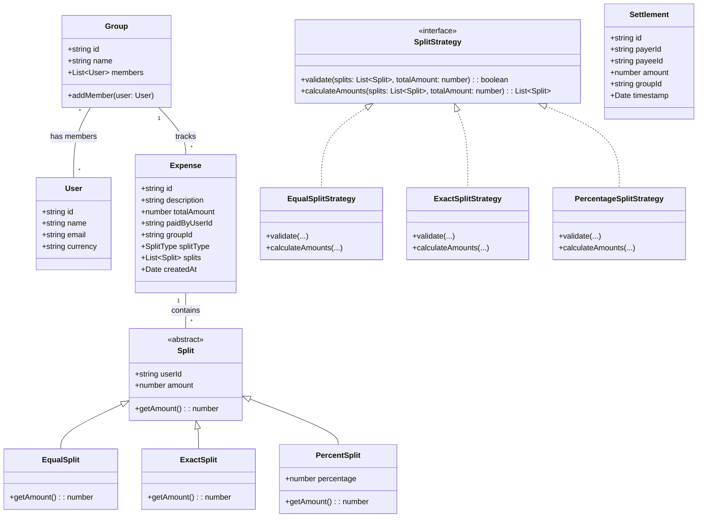
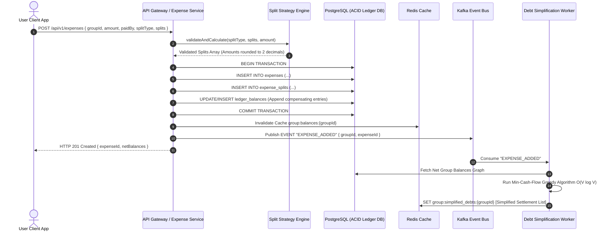
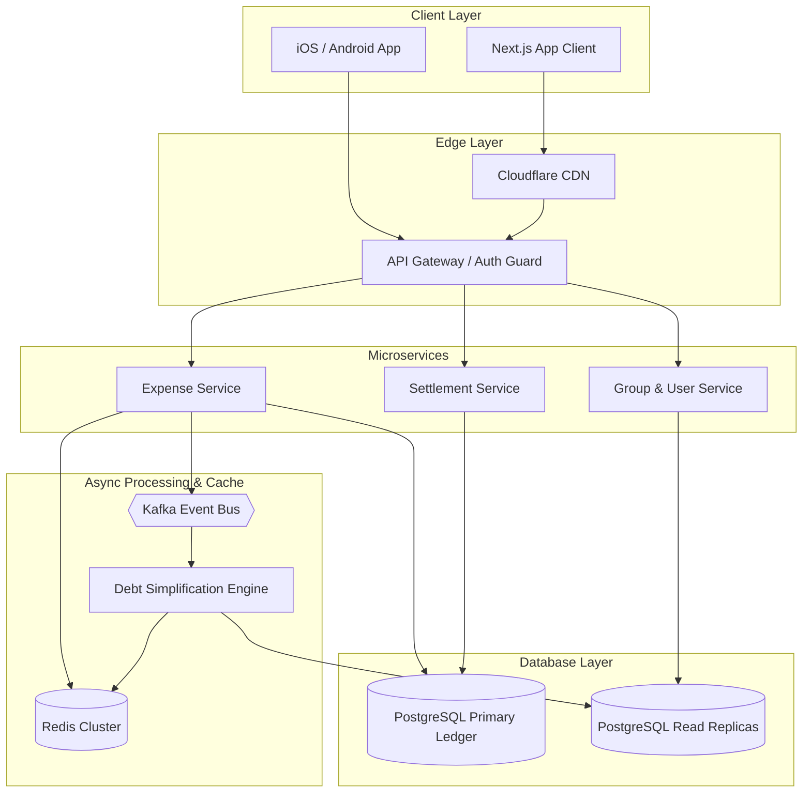

# 🛠️ Enterprise System Design Blueprint: Splitwise

> **Target Role:** Principal / Staff Architect / Senior LLD & HLD Engineers  
> **Product Perspective:** Multi-tenant expense-sharing platform serving 10M DAU, handling complex group ledgers, split strategies, multi-currency conversions, and optimal minimum cash flow debt simplification.  
> **Navigation:** ⬅️ [Back to Financial & Payment Systems Index](./README.md) | 📅 [8-Week Roadmap](../../ROADMAP.md)

---

## 1. 🎯 Requirements & Product Scope

### 📋 Functional Requirements (FR)

1. **User & Group Management:** Users can register, create groups (e.g., "Trip to Japan", "Apartment 4B"), invite members, and track individual or group ledgers.
2. **Flexible Expense Addition:** A user can add an expense with a total amount, paid-by user(s), and split details among group members using 3 primary split strategies:
   - **Equal Split:** Divide total amount equally among participants (handling remainder cents).
   - **Exact Split:** Specify exact currency amounts for each participant (must sum to total).
   - **Percentage Split:** Specify exact percentage shares for each participant (must sum to $100\%$).
3. **Double-Entry Ledger & Balance Tracking:** Maintain an immutable ledger recording net balances between every pair of users.
4. **Minimum Cash Flow Settlement (Debt Simplification):** Automatically compute the minimum number of transactions needed to settle all debts within a group (e.g., if A owes B $10 and B owes C $10, A should directly pay C $10).
5. **Settlement Processing:** Record full or partial debt settlements between users, updating group net balances accordingly.
6. **Activity Stream & Notifications:** Real-time updates and historical activity feed for expenses added, edited, or settled.

### ⚡ Non-Functional Requirements (NFR)

1. **Strict Financial Consistency:** $100\%$ ACID guarantees for ledger balance updates. No money can be created or lost due to floating-point rounding errors or race conditions.
2. **Low Read Latency:** Group summary & balance sheet queries must return in $P_{99} < 50\text{ms}$.
3. **Scale Capacity:** Support 10 Million DAU, 5 Million daily expense entries, 2 Million daily debt settlements.
4. **Auditability & Immutability:** Historical expenses and ledger entries are append-only. Edits are processed as compensating ledger entries.
5. **Idempotency:** Prevent duplicate expense creation on network retries using unique client-generated idempotency keys.

---

## 2. 🧮 Scale & Quantitative Estimates

```
Read / Write Ratio: 5:1 (Read-heavy for balance checking, write-intensive during peak trip/event hours)
Total Users: 10M DAU
Daily Expenses Added: 5,000,000 / day
Daily Settlements: 2,000,000 / day

QPS Calculations:
- Average Write QPS: (7M writes / 86,400s) ≈ 81 QPS
- Peak Write QPS (2.5x multiplier): ~1,500 QPS
- Average Read QPS: 400 QPS
- Peak Read QPS: ~5,000 QPS

Storage Estimates (5 Years):
- Expense Record: ~500 bytes
  - 5M * 365 * 5 = 9.125 Billion rows → ~4.56 TB
- Expense Splits: avg 4 splits per expense → 36.5 Billion rows → ~7.3 TB
- Ledger Entries (Append-only): ~200 bytes per entry → ~3.6 TB
Total Storage Required (5 Years): ~15.5 TB (Sharded PostgreSQL cluster / CockroachDB).
```

---

## 3. 🛠️ Tech Stack & Architectural Justifications

| Component | Technology Choice | Architectural Rationale |
| :--- | :--- | :--- |
| **Frontend Framework** | Next.js 14 (App Router) + React | SSR/ISR for quick dashboard load, React Query for optimistic balance updates. |
| **API Gateway** | Kong / Envoy | JWT validation, rate limiting, and idempotency key forwarding. |
| **Primary Database** | PostgreSQL (Relational) | Strong ACID transactions, multi-table JOINs for group balances, pessimistic locking support (`SELECT FOR UPDATE`). |
| **Caching Layer** | Redis Cluster | Caching pre-computed net group balances and user session tokens ($P_{99} < 10\text{ms}$). |
| **Graph / Async Worker** | Node.js / Go Background Workers | Offloading $O(V \log V)$ Minimum Cash Flow debt simplification logic out of the main HTTP request/response cycle. |
| **Event Bus / Message Queue**| Apache Kafka / RabbitMQ | Decoupled notifications, audit log streams, and async graph re-computation triggers. |

---

## 4. 📐 Visual UML Diagrams

### 🏗️ Class Diagram (Low-Level Entities & Split Strategies)



### 🔄 Sequence Diagram: Add Expense & Async Debt Simplification



### 🧩 Component & System Architecture Diagram (HLD)



---

## 5. 🧱 OOP & SOLID Principles Mapping

- **Single Responsibility Principle (SRP):** `ExpenseService` handles expense lifecycle; `SplitStrategy` handles distribution math & validation; `MinCashFlowOptimizer` handles graph reduction algorithms.
- **Open/Closed Principle (OCP):** New split strategies (e.g., `SharesSplitStrategy`, `AdjustmentSplitStrategy`) can be added by implementing the `SplitStrategy` interface without altering core `ExpenseService` code.
- **Liskov Substitution Principle (LSP):** Any concrete `SplitStrategy` (`EqualSplitStrategy`, `PercentageSplitStrategy`) can replace the generic strategy interface seamlessly.
- **Interface Segregation Principle (ISP):** Clients interact with focused interfaces like `ISplitValidator` and `IDebtSimplifier` rather than a monolithic service.
- **Dependency Inversion Principle (DIP):** `ExpenseService` depends on abstractions (`ILedgerRepository`, `IKVStore`) rather than concrete database clients.

---

## 6. 🎨 Design Patterns Selection

1. **Strategy Pattern:** Decouples split calculation logic (`EqualSplitStrategy`, `ExactSplitStrategy`, `PercentageSplitStrategy`) from expense orchestration.
2. **Factory Pattern:** `SplitStrategyFactory` returns the appropriate split strategy based on `SplitType` enum.
3. **Command Pattern:** `AddExpenseCommand` and `SettleDebtCommand` encapsulate balance operations, enabling easy rollback and audit logging.
4. **Observer Pattern:** Event Bus triggers notifications (`EmailWorker`, `PushNotificationWorker`) and async balance cache invalidations upon ledger mutations.

---

## 7. 💻 Production Code Blueprint (TypeScript)

```typescript
// ============================================================================
// 1. DOMAIN MODELS & ENUMS
// ============================================================================

export enum SplitType {
  EQUAL = 'EQUAL',
  EXACT = 'EXACT',
  PERCENTAGE = 'PERCENTAGE',
}

export interface User {
  id: string;
  name: string;
  email: string;
}

export interface Split {
  userId: string;
  amount: number; // Final calculated monetary value in cents
  percentage?: number;
}

export interface ExpenseRequest {
  id: string;
  groupId: string;
  description: string;
  totalAmount: number; // Stored in cents to avoid floating point issues (e.g., $10.50 -> 1050)
  paidByUserId: string;
  splitType: SplitType;
  splits: Split[];
}

export interface DebtEdge {
  fromUser: string; // Debtor
  toUser: string;   // Creditor
  amount: number;   // Stored in cents
}

// ============================================================================
// 2. STRATEGY PATTERN FOR SPLIT CALCULATIONS
// ============================================================================

export interface ISplitStrategy {
  validateAndCompute(totalAmount: number, splits: Split[]): Split[];
}

export class EqualSplitStrategy implements ISplitStrategy {
  validateAndCompute(totalAmount: number, splits: Split[]): Split[] {
    const numMembers = splits.length;
    if (numMembers === 0) throw new Error('Splits array cannot be empty');

    const baseAmount = Math.floor(totalAmount / numMembers);
    let remainder = totalAmount % numMembers; // Handle extra cents gracefully

    return splits.map((split) => {
      let extra = 0;
      if (remainder > 0) {
        extra = 1;
        remainder--;
      }
      return {
        ...split,
        amount: baseAmount + extra,
      };
    });
  }
}

export class ExactSplitStrategy implements ISplitStrategy {
  validateAndCompute(totalAmount: number, splits: Split[]): Split[] {
    const sum = splits.reduce((acc, curr) => acc + curr.amount, 0);
    if (sum !== totalAmount) {
      throw new Error(`Sum of exact splits (${sum}) does not match total amount (${totalAmount})`);
    }
    return splits;
  }
}

export class PercentageSplitStrategy implements ISplitStrategy {
  validateAndCompute(totalAmount: number, splits: Split[]): Split[] {
    const totalPercentage = splits.reduce((acc, curr) => acc + (curr.percentage || 0), 0);
    if (Math.abs(totalPercentage - 100) > 0.01) {
      throw new Error(`Total percentages (${totalPercentage}%) must sum to 100%`);
    }

    let calculatedSum = 0;
    const computedSplits = splits.map((split, index) => {
      if (index === splits.length - 1) {
        // Last split gets remaining cents to guarantee sum == totalAmount
        return { ...split, amount: totalAmount - calculatedSum };
      }
      const amount = Math.round((totalAmount * (split.percentage || 0)) / 100);
      calculatedSum += amount;
      return { ...split, amount };
    });

    return computedSplits;
  }
}

// ============================================================================
// 3. FACTORY PATTERN
// ============================================================================

export class SplitStrategyFactory {
  private static strategies: Map<SplitType, ISplitStrategy> = new Map([
    [SplitType.EQUAL, new EqualSplitStrategy()],
    [SplitType.EXACT, new ExactSplitStrategy()],
    [SplitType.PERCENTAGE, new PercentageSplitStrategy()],
  ]);

  public static getStrategy(type: SplitType): ISplitStrategy {
    const strategy = this.strategies.get(type);
    if (!strategy) throw new Error(`Unsupported split type: ${type}`);
    return strategy;
  }
}

// ============================================================================
// 4. MINIMUM CASH FLOW DEBT SIMPLIFICATION ALGORITHM
// ============================================================================

export class MinCashFlowOptimizer {
  /**
   * Computes the minimum debt settlement transactions required for a group.
   * Time Complexity: O(V log V) using Greedy Net-Balance Heap Strategy.
   */
  public static simplifyDebts(netBalances: Map<string, number>): DebtEdge[] {
    // Separate users into debtors (< 0) and creditors (> 0)
    const debtors: { userId: string; balance: number }[] = [];
    const creditors: { userId: string; balance: number }[] = [];

    netBalances.forEach((balance, userId) => {
      if (balance < 0) debtors.push({ userId, balance: Math.abs(balance) });
      else if (balance > 0) creditors.push({ userId, balance });
    });

    // Sort descending by magnitude to greedily match largest debtor with largest creditor
    debtors.sort((a, b) => b.balance - a.balance);
    creditors.sort((a, b) => b.balance - a.balance);

    const result: DebtEdge[] = [];
    let i = 0, j = 0;

    while (i < debtors.length && j < creditors.length) {
      const debtor = debtors[i];
      const creditor = creditors[j];

      const settledAmount = Math.min(debtor.balance, creditor.balance);
      result.push({
        fromUser: debtor.userId,
        toUser: creditor.userId,
        amount: settledAmount,
      });

      debtor.balance -= settledAmount;
      creditor.balance -= settledAmount;

      if (debtor.balance === 0) i++;
      if (creditor.balance === 0) j++;
    }

    return result;
  }
}

// ============================================================================
// 5. EXPENSE SERVICE ORCHESTRATOR
// ============================================================================

export class ExpenseService {
  constructor(
    private dbClient: any,
    private redisClient: any,
    private eventBus: any
  ) {}

  public async createExpense(req: ExpenseRequest): Promise<ExpenseRequest> {
    // 1. Obtain split strategy & validate amounts
    const strategy = SplitStrategyFactory.getStrategy(req.splitType);
    const computedSplits = strategy.validateAndCompute(req.totalAmount, req.splits);
    req.splits = computedSplits;

    // 2. Perform DB transaction (Double-Entry Bookkeeping Ledger Update)
    await this.dbClient.transaction(async (tx: any) => {
      // Save Expense Metadata
      await tx.query(
        `INSERT INTO expenses (id, group_id, description, total_amount, paid_by_user_id, split_type)
         VALUES ($1, $2, $3, $4, $5, $6)`,
        [req.id, req.groupId, req.description, req.totalAmount, req.paidByUserId, req.splitType]
      );

      // Record Splits & Ledger Entries
      for (const split of computedSplits) {
        await tx.query(
          `INSERT INTO expense_splits (expense_id, user_id, amount) VALUES ($1, $2, $3)`,
          [req.id, split.userId, split.amount]
        );

        // Payer gets credited, participants get debited
        if (split.userId !== req.paidByUserId) {
          await tx.query(
            `INSERT INTO ledger_entries (group_id, expense_id, debtor_id, creditor_id, amount)
             VALUES ($1, $2, $3, $4, $5)`,
            [req.groupId, req.id, split.userId, req.paidByUserId, split.amount]
          );
        }
      }
    });

    // 3. Invalidate group cache & notify async graph worker
    await this.redisClient.del(`group:balances:${req.groupId}`);
    await this.eventBus.publish('EXPENSE_CREATED', { groupId: req.groupId, expenseId: req.id });

    return req;
  }
}
```

---

## 8. 🔀 High-Level Design (HLD) & Scale Bottlenecks

### 1. Precision & Integer Cent Storage
Floating-point arithmetic in JavaScript/Python (`0.1 + 0.2 = 0.30000000000000004`) causes severe balance drift over millions of transactions.
- **Solution:** All monetary amounts are stored strictly as **integers representing the lowest currency unit (cents/paise)**. Remainder cents in equal or percentage splits are deterministically allocated to the first $N$ participants.

### 2. Double-Entry Bookkeeping Ledger
Mutating net balances directly via `UPDATE user_balances SET balance = balance + X` leads to deadlocks under high concurrency and leaves zero audit trail.
- **Solution:** Append-only ledger model (`ledger_entries` table). Net balance is a derived view computed via `SUM(amount)` grouped by user, backed by a Redis cached snapshot.

### 3. Asynchronous Debt Simplification
Executing the Minimum Cash Flow algorithm ($O(V \log V)$) synchronously inside the `POST /expense` handler blocks HTTP threads for large groups.
- **Solution:** Calculate raw pairwise debts synchronously. Trigger an asynchronous Kafka event to recompute simplified group graph debts into Redis for UI consumption.

---

## ❓ 9. Collapsed Senior/Staff Level Grill Q&A

<details>
<summary>❓ 1. How do you resolve floating-point rounding errors when splitting $100 among 3 users ($33.33 x 3 = $99.99)?</summary>

**Answer:**
We represent all currency values as **integers in cents** ($100 \rightarrow 10000\text{ cents}$). When dividing $10000$ by $3$, `baseAmount = Math.floor(10000 / 3) = 3333` ($33.33), and `remainder = 10000 % 3 = 1` cent. The split algorithm deterministically distributes the remaining $1\text{ cent}$ to the first member in the list, returning splits of $3334, 3333, 3333$ ($33.34 + $33.33 + $33.33 = $100.00).

</details>

<details>
<summary>❓ 2. Is the Minimum Cash Flow debt simplification algorithm NP-hard, and how do you scale it for large groups?</summary>

**Answer:**
Finding the global minimum number of transactions across sub-groups is equivalent to the Subset-Sum Problem (NP-Hard). However, for real-world Splitwise groups ($V < 100$), a **greedy net-balance heap approach** runs in $O(V \log V)$ time and produces optimal or near-optimal results ($V-1$ transactions max). For large communities, we partition group graphs into strongly connected sub-components before running the greedy optimizer.

</details>

<details>
<summary>❓ 3. How do you prevent double-spending or duplicate expenses when a user double-taps "Submit"?</summary>

**Answer:**
We enforce strict idempotency at the API Gateway level. The frontend generates a unique `idempotencyKey` (UUIDv4) sent in the header `Idempotency-Key`. The API Gateway stores this key in Redis via `SET key token NX EX 60`. If a duplicate request arrives, Redis returns `BUSY` or returns the cached HTTP response of the completed initial transaction.

</details>

<details>
<summary>❓ 4. How do you handle multi-currency expenses inside the same group (e.g., USD and EUR)?</summary>

**Answer:**
We maintain multi-currency ledgers separately per currency pair within the group, or select a **Group Base Currency**. When an expense is added in EUR to a USD group, we fetch the real-time FX rate snapshot from an external service at the exact transaction timestamp, store both `original_amount` + `fx_rate` in the expense record, and record the ledger entry in the group's base currency.

</details>
