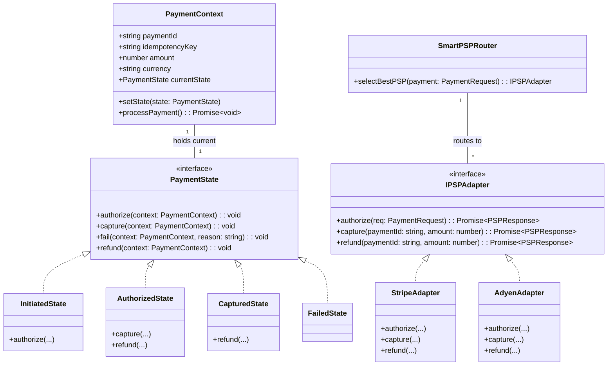
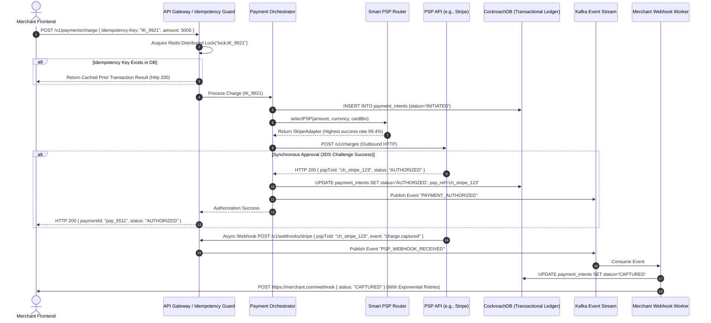
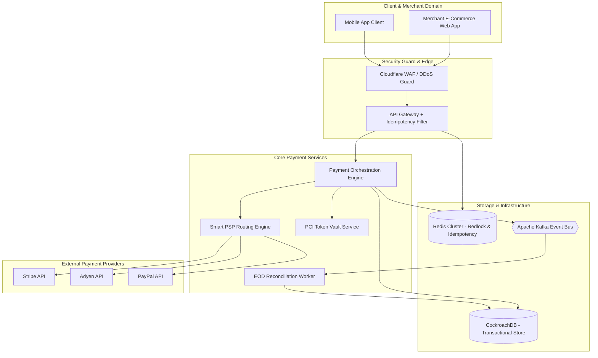

# 🛠️ Enterprise System Design Blueprint: Payment Gateway

> **Target Role:** Principal / Staff Architect / Senior LLD & HLD Engineers  
> **Product Perspective:** Building a resilient, multi-tenant Payment Gateway & PSP Orchestrator handling 100M daily transactions, zero double-charges, 99.999% uptime, smart routing, and Saga-based distributed reconciliation.  
> **Navigation:** ⬅️ [Back to Financial & Payment Systems Index](./README.md) | 📅 [8-Week Roadmap](../../ROADMAP.md)

---

## 1. 🎯 Requirements & Product Scope

### 📋 Functional Requirements (FR)

1. **Payment Orchestration & Multi-PSP Routing:** Accept payments via Credit/Debit Cards, UPI, NetBanking, and Digital Wallets, dynamically routing requests to underlying Payment Service Providers (PSPs e.g., Stripe, Adyen, PayPal, Razorpay) based on cost, health, and success rate metrics.
2. **Idempotent Payment Intent Lifecycle:** Create, authorize, capture, fail, or refund payment intents with absolute idempotency ($1\text{ key} = 1\text{ charge}$).
3. **Payment State Machine:** Strict lifecycle states (`INITIATED` $\rightarrow$ `PENDING` $\rightarrow$ `AUTHORIZED` $\rightarrow$ `CAPTURED` / `FAILED` / `REFUNDED`).
4. **Asynchronous Webhook Engine:** Handle asynchronous payment completion webhooks from third-party PSPs with at-least-once delivery guarantees to merchant webhooks.
5. **Reconciliation Engine:** Automated End-Of-Day (EOD) matching between Gateway logs, PSP settlement reports, and Bank settlement files.

### ⚡ Non-Functional Requirements (NFR)

1. **Zero Double-Charging Guarantee:** Exactly-once execution semantics enforced via distributed locks, database idempotency keys, and transaction boundary guards.
2. **High Availability ($99.999\%$):** Gateway core must maintain uptime even during full outages of a specific payment provider by auto-failing over to alternative PSPs.
3. **Low Latency:** $P_{99} < 300\text{ms}$ processing latency (excluding customer 3DS authentication flow).
4. **PCI-DSS Level 1 Compliance:** Zero raw Primary Account Numbers (PAN) stored in application logs or primary relational database. Tokens are stored in a dedicated isolated PCI Vault.
5. **Scale Capacity:** 100 Million daily transactions (~1,150 average QPS, 5,000 peak QPS).

---

## 2. 🧮 Scale & Quantitative Estimates

```
Daily Transactions: 100,000,000 / day
Peak Write QPS: 5,000 QPS (Flash sales / peak hours)
Webhook Delivery QPS: 10,000 QPS

QPS Breakdown:
- Payment Intent Initialization: 5,000 QPS
- PSP API Outbound Requests: 5,000 QPS
- Inbound PSP Webhooks: 10,000 QPS

Storage Estimates (5 Years):
- Payment Intent Record: ~1.5 KB (includes audit trace, state history, metadata)
  - 100M * 365 * 5 = 18.25 Billion records → ~27.37 TB
- Transaction Audit Log: ~500 bytes → ~9.12 TB
Total Active DB Storage: ~36.5 TB (Partitioned CockroachDB / Sharded PostgreSQL + S3 Glacier Data Lake).
```

---

## 3. 🛠️ Tech Stack & Architectural Justifications

| Component | Technology Choice | Architectural Rationale |
| :--- | :--- | :--- |
| **API Gateway** | Kong / Envoy | Client rate limiting, TLS termination, WAF (Web Application Firewall), and HMAC signature verification. |
| **Core Payment Orchestrator** | Node.js (TypeScript) / Go | High concurrency non-blocking I/O for external PSP API requests, strict typing. |
| **Primary Transaction DB** | CockroachDB / PostgreSQL | Distributed SQL with serializable transaction isolation (`SERIALIZABLE`) and multi-region replication. |
| **Distributed Lock & Idempotency**| Redis Cluster (Redlock) | Atomic key validation (`SETNX`) with TTL for sub-10ms idempotency verification. |
| **Message Queue / Webhook Bus** | Apache Kafka | Partitioned by `merchant_id` for ordered webhook processing and resilient DLQ (Dead Letter Queue) retries. |
| **PCI Vault** | HashiCorp Vault / Tokenization Service | Isolated hardware/software vault storing encrypted card PANs and issuing non-sensitive tokens. |

---

## 4. 📐 Visual UML Diagrams

### 🏗️ Class Diagram (Payment Intent State Machine & PSP Adapters)



### 🔄 Sequence Diagram: Idempotent Payment Authorization & Webhook Flow



### 🧩 Component & System Architecture Diagram (HLD)



---

## 5. 🧱 OOP & SOLID Principles Mapping

- **Single Responsibility Principle (SRP):** `PaymentContext` maintains payment intent state; `SmartPSPRouter` selects payment routes; `StripeAdapter` handles raw API protocol translation.
- **Open/Closed Principle (OCP):** Adding a new payment provider (e.g., `RazorpayAdapter`) only requires implementing `IPSPAdapter` without modifying payment orchestrator logic.
- **Liskov Substitution Principle (LSP):** Any PSP adapter conforming to `IPSPAdapter` can be injected and executed interchangeably by the routing engine.
- **Interface Segregation Principle (ISP):** Clients depend on lean interfaces (`IPSPAuthorizer`, `IPSPCapturer`, `IPSPRefunder`) rather than monolithic giant structures.
- **Dependency Inversion Principle (DIP):** High-level payment workflow depends on the `IPSPAdapter` interface, not concrete vendor SDK classes.

---

## 6. 🎨 Design Patterns Selection

1. **State Pattern:** Encapsulates payment lifecycle transitions (`Initiated`, `Pending`, `Authorized`, `Captured`, `Failed`, `Refunded`), preventing illegal state mutations (e.g., refunding an un-captured payment).
2. **Strategy / Adapter Pattern:** `IPSPAdapter` standardizes vendor-specific payload formats into unified payment requests.
3. **Saga Pattern (Orchestration):** Manages multi-system distributed transactions (Merchant balance hold $\rightarrow$ Third-party PSP charge $\rightarrow$ Internal ledger update) with automatic compensating transactions (canceling authorization or refunding).
4. **Idempotency Guard Pattern:** Atomic distributed locking via Redis `SET key token NX EX 30` to prevent duplicate parallel executions.

---

## 7. 💻 Production Code Blueprint (TypeScript)

```typescript
// ============================================================================
// 1. DOMAIN MODELS & PAYMENT STATE TYPES
// ============================================================================

export type PaymentStatus = 'INITIATED' | 'PENDING' | 'AUTHORIZED' | 'CAPTURED' | 'FAILED' | 'REFUNDED';

export interface PaymentRequest {
  paymentId: string;
  merchantId: string;
  idempotencyKey: string;
  amount: number; // Stored in lowest currency unit (cents)
  currency: string;
  cardToken: string;
}

export interface PSPResponse {
  success: boolean;
  pspReference: string;
  errorCode?: string;
  errorMessage?: string;
}

// ============================================================================
// 2. STATE PATTERN IMPLEMENTATION FOR PAYMENT INTENT
// ============================================================================

export interface IPaymentState {
  authorize(context: PaymentContext, adapter: IPSPAdapter): Promise<void>;
  capture(context: PaymentContext, adapter: IPSPAdapter): Promise<void>;
  refund(context: PaymentContext, adapter: IPSPAdapter): Promise<void>;
}

export class PaymentContext {
  private state: IPaymentState;
  public status: PaymentStatus;
  public pspReference?: string;

  constructor(
    public readonly request: PaymentRequest,
    initialState?: IPaymentState
  ) {
    this.state = initialState || new InitiatedState();
    this.status = 'INITIATED';
  }

  public setState(state: IPaymentState, status: PaymentStatus): void {
    this.state = state;
    this.status = status;
  }

  public async authorize(adapter: IPSPAdapter): Promise<void> {
    await this.state.authorize(this, adapter);
  }

  public async capture(adapter: IPSPAdapter): Promise<void> {
    await this.state.capture(this, adapter);
  }

  public async refund(adapter: IPSPAdapter): Promise<void> {
    await this.state.refund(this, adapter);
  }
}

export class InitiatedState implements IPaymentState {
  async authorize(context: PaymentContext, adapter: IPSPAdapter): Promise<void> {
    const res = await adapter.authorize(context.request);
    if (res.success) {
      context.pspReference = res.pspReference;
      context.setState(new AuthorizedState(), 'AUTHORIZED');
    } else {
      context.setState(new FailedState(), 'FAILED');
      throw new Error(`Authorization failed: ${res.errorMessage}`);
    }
  }

  async capture(): Promise<void> {
    throw new Error('Cannot capture payment in INITIATED state. Must be AUTHORIZED first.');
  }

  async refund(): Promise<void> {
    throw new Error('Cannot refund payment in INITIATED state.');
  }
}

export class AuthorizedState implements IPaymentState {
  async authorize(): Promise<void> {
    throw new Error('Payment is already AUTHORIZED.');
  }

  async capture(context: PaymentContext, adapter: IPSPAdapter): Promise<void> {
    const res = await adapter.capture(context.pspReference!, context.request.amount);
    if (res.success) {
      context.setState(new CapturedState(), 'CAPTURED');
    } else {
      context.setState(new FailedState(), 'FAILED');
      throw new Error(`Capture failed: ${res.errorMessage}`);
    }
  }

  async refund(context: PaymentContext, adapter: IPSPAdapter): Promise<void> {
    // Void / Cancel authorization
    await adapter.refund(context.pspReference!, context.request.amount);
    context.setState(new RefundedState(), 'REFUNDED');
  }
}

export class CapturedState implements IPaymentState {
  async authorize(): Promise<void> { throw new Error('Payment already CAPTURED'); }
  async capture(): Promise<void> { throw new Error('Payment already CAPTURED'); }

  async refund(context: PaymentContext, adapter: IPSPAdapter): Promise<void> {
    const res = await adapter.refund(context.pspReference!, context.request.amount);
    if (res.success) {
      context.setState(new RefundedState(), 'REFUNDED');
    } else {
      throw new Error(`Refund failed: ${res.errorMessage}`);
    }
  }
}

export class FailedState implements IPaymentState {
  async authorize(): Promise<void> { throw new Error('Cannot authorize FAILED payment'); }
  async capture(): Promise<void> { throw new Error('Cannot capture FAILED payment'); }
  async refund(): Promise<void> { throw new Error('Cannot refund FAILED payment'); }
}

export class RefundedState implements IPaymentState {
  async authorize(): Promise<void> { throw new Error('Payment already REFUNDED'); }
  async capture(): Promise<void> { throw new Error('Payment already REFUNDED'); }
  async refund(): Promise<void> { throw new Error('Payment already REFUNDED'); }
}

// ============================================================================
// 3. ADAPTER PATTERN FOR PSP INTEGRATION
// ============================================================================

export interface IPSPAdapter {
  readonly name: string;
  authorize(req: PaymentRequest): Promise<PSPResponse>;
  capture(pspRef: string, amount: number): Promise<PSPResponse>;
  refund(pspRef: string, amount: number): Promise<PSPResponse>;
}

export class StripeAdapter implements IPSPAdapter {
  readonly name = 'Stripe';

  async authorize(req: PaymentRequest): Promise<PSPResponse> {
    // Simulate API call to Stripe /v1/payment_intents
    return { success: true, pspReference: `pi_stripe_${Date.now()}` };
  }

  async capture(pspRef: string, amount: number): Promise<PSPResponse> {
    return { success: true, pspReference: pspRef };
  }

  async refund(pspRef: string, amount: number): Promise<PSPResponse> {
    return { success: true, pspReference: `re_stripe_${Date.now()}` };
  }
}

export class AdyenAdapter implements IPSPAdapter {
  readonly name = 'Adyen';

  async authorize(req: PaymentRequest): Promise<PSPResponse> {
    return { success: true, pspReference: `adyen_ref_${Date.now()}` };
  }

  async capture(pspRef: string, amount: number): Promise<PSPResponse> {
    return { success: true, pspReference: pspRef };
  }

  async refund(pspRef: string, amount: number): Promise<PSPResponse> {
    return { success: true, pspReference: `adyen_refund_${Date.now()}` };
  }
}

// ============================================================================
// 4. SMART PSP ROUTING ENGINE
// ============================================================================

export class SmartPSPRouter {
  private adapters: IPSPAdapter[];

  constructor(adapters: IPSPAdapter[]) {
    this.adapters = adapters;
  }

  public selectOptimalPSP(req: PaymentRequest): IPSPAdapter {
    // Dynamic routing strategy based on success rate, vendor cost, & payment method
    if (req.currency === 'USD') {
      return this.adapters.find(a => a.name === 'Stripe') || this.adapters[0];
    }
    return this.adapters.find(a => a.name === 'Adyen') || this.adapters[0];
  }
}

// ============================================================================
// 5. IDEMPOTENCY GUARD & PAYMENT ORCHESTRATOR
// ============================================================================

export class PaymentOrchestrator {
  constructor(
    private router: SmartPSPRouter,
    private redisClient: any,
    private dbClient: any
  ) {}

  public async processPayment(req: PaymentRequest): Promise<{ paymentId: string; status: PaymentStatus }> {
    const lockKey = `lock:idempotency:${req.idempotencyKey}`;
    
    // 1. Acquire Distributed Lock (SET key token NX EX 30)
    const acquired = await this.redisClient.set(lockKey, 'LOCKED', 'NX', 'EX', 30);
    if (!acquired) {
      throw new Error('Concurrent transaction in progress for this idempotency key');
    }

    try {
      // 2. Check Database for Existing Transaction Record
      const existing = await this.dbClient.query(
        `SELECT payment_id, status FROM payments WHERE idempotency_key = $1`,
        [req.idempotencyKey]
      );

      if (existing.rows.length > 0) {
        return {
          paymentId: existing.rows[0].payment_id,
          status: existing.rows[0].status,
        };
      }

      // 3. Select PSP Adapter & Execute Authorization
      const adapter = this.router.selectOptimalPSP(req);
      const context = new PaymentContext(req);

      await context.authorize(adapter);
      await context.capture(adapter);

      // 4. Persist Final Payment State to Database
      await this.dbClient.query(
        `INSERT INTO payments (payment_id, merchant_id, idempotency_key, amount, currency, status, psp_reference)
         VALUES ($1, $2, $3, $4, $5, $6, $7)`,
        [req.paymentId, req.merchantId, req.idempotencyKey, req.amount, req.currency, context.status, context.pspReference]
      );

      return { paymentId: req.paymentId, status: context.status };
    } finally {
      // Release Distributed Lock
      await this.redisClient.del(lockKey);
    }
  }
}
```

---

## 8. 🔀 High-Level Design (HLD) & Scale Bottlenecks

### 1. Exactly-Once Processing & Idempotency Key Lifecycle
Network timeouts during payment processing present a severe risk of double-charging.
- **Solution:** A two-tier idempotency guard:
  1. **Fast Guard:** Redis `SETNX` distributed lock with 30s expiry during in-flight processing.
  2. **Durable Guard:** PostgreSQL/CockroachDB unique constraint on `idempotency_key`. If a retry arrives after 1 minute, the database returns the original transaction record instantly without calling the PSP API again.

### 2. Handling Out-of-Order Webhooks vs API Responses
Under high network latency, a PSP webhook notification (`PAYMENT_CAPTURED`) can reach the gateway **BEFORE** the synchronous API HTTP response returns to the Gateway.
- **Solution:** Strict state machine enforcement. Webhooks check current DB status. If status is `INITIATED`, the state transitions directly to `CAPTURED`. Subsequent API responses check DB status and recognize the captured state safely.

### 3. Saga Pattern vs 2PC for Distributed Reconciliation
Two-Phase Commit (2PC) blocks database rows across third-party networks, causing extreme lock contention and latency spikes.
- **Solution:** **Orchestrated Saga Pattern**. Each step (Tokenization $\rightarrow$ Authorization $\rightarrow$ Ledger Capture) commits locally. If PSP authorization fails, the orchestrator triggers compensating actions (`CancelAuth`, `ReleaseHold`).

---

## ❓ 9. Collapsed Senior/Staff Level Grill Q&A

<details>
<summary>❓ 1. How do you prevent double-charging if the PSP API call times out after 10 seconds?</summary>

**Answer:**
If an outbound API request to Stripe/Adyen times out, the Gateway **cannot** assume the transaction failed. The Orchestrator sets payment status to `PENDING` and places an inquiry message into a delay queue. A worker executes a **PSP Status Query API** (`GET /v1/charges/{idempotencyKey}`) to verify whether the charge was authorized on the PSP side before retrying or failing.

</details>

<details>
<summary>❓ 2. How do you achieve PCI-DSS Level 1 compliance when handling raw credit card details?</summary>

**Answer:**
Raw card numbers (PAN) never touch application memory or primary databases. The frontend client uses **Client-Side Encryption (CSE)** or Hosted iFrames (Stripe Elements / Adyen Drop-in) to directly send card data to an isolated, PCI-compliant Tokenization Vault. The Vault returns a ephemeral non-sensitive token (`tok_991283`) which is the only value passed to our API.

</details>

<details>
<summary>❓ 3. How does the automated End-Of-Day (EOD) Reconciliation Engine detect missing funds?</summary>

**Answer:**
The Reconciliation Engine executes a **3-Way Match Algorithm** comparing:
1. Internal Payment Gateway Transaction Logs.
2. PSP Settlement CSV/Parquet Reports (downloaded via SFTP/S3).
3. Bank Settlement Statements.

Discrepancies (e.g., Gateway logged `CAPTURED`, but PSP logged `REFUNDED`) are flagged automatically into an Audit Queue for financial ops review.

</details>

<details>
<summary>❓ 4. Why use CockroachDB / Distributed SQL over traditional MySQL for payment transactions?</summary>

**Answer:**
CockroachDB provides native multi-region active-active replication with `SERIALIZABLE` isolation guarantees. This prevents split-brain anomalies and phantom reads across geographical data centers, ensuring strict ledger correctness even during full regional cloud provider outages.

</details>
