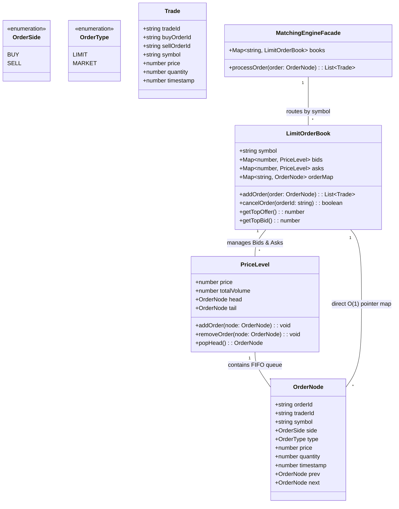
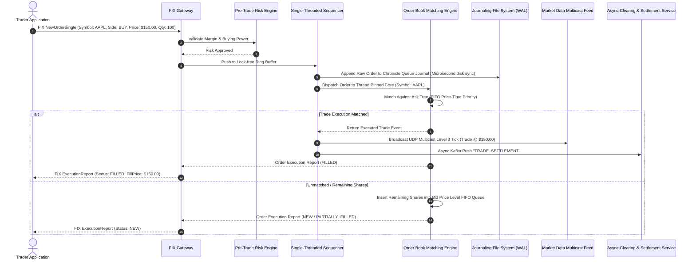

# 🛠️ Enterprise System Design Blueprint: Online Stock Exchange

> **Target Role:** Principal / Staff Architect / Senior LLD & HLD Engineers  
> **Product Perspective:** Building an ultra-low-latency electronic stock trading exchange (e.g., NASDAQ / LMAX matching core) capable of executing 500,000 orders/second at sub-millisecond $P_{99}$ latency with strict Price-Time priority and deterministic journaling.  
> **Navigation:** ⬅️ [Back to Financial & Payment Systems Index](./README.md) | 📅 [8-Week Roadmap](../../ROADMAP.md)

---

## 1. 🎯 Requirements & Product Scope

### 📋 Functional Requirements (FR)

1. **Order Placement & Types:** Support Limit Orders (buy/sell at specified price or better) and Market Orders (buy/sell immediately at best available price).
2. **Order Cancellation & Modification:** Traders can cancel unexecuted open orders or modify order quantities in $O(1)$ time.
3. **Limit Order Book Matching Engine:** Match orders using **Price-Time Priority (FIFO)** matching rules:
   - **Price Priority:** Highest Bid (buy) matches lowest Ask (sell).
   - **Time Priority:** Older orders at the same price level are executed first.
4. **Trade Execution & Ledger Settlement:** Generate trade execution records, reserving and settling user cash/asset ledger balances atomically.
5. **Real-Time Market Data Ticker Feed:** Broadcast Level 1 (Top of Book), Level 2 (Depth of 10 Price Levels), and Level 3 (Full Order Depth) tick feeds to trading clients.

### ⚡ Non-Functional Requirements (NFR)

1. **Ultra-Low Latency:** In-memory matching engine latency $P_{99} < 100\mu\text{s}$ ($0.1\text{ms}$), end-to-end order placement to execution receipt $P_{99} < 5\text{ms}$.
2. **High Throughput:** 500,000 orders/sec peak capacity per ticker matching partition.
3. **Strict Determinism & Zero Data Loss:** Single-threaded Sequencer with Write-Ahead Logging (WAL) / Chronicle Queue ensuring $100\%$ deterministic replay upon engine crash.
4. **Fairness & Non-Preemptability:** Zero lock contention; FIFO execution order strictly guaranteed per symbol.

---

## 2. 🧮 Scale & Quantitative Estimates

```
Daily Trading Volume: 500,000,000 orders / day
Peak Matching QPS: 500,000 QPS (during market open/close bell volatility)
Active Tickers: 5,000 traded stocks (e.g., AAPL, GOOGL, NVDA)

Latency Budget Breakdown (End-to-End < 5ms):
- Network Ingress (TCP/FIX Protocol Gateway): 0.5 ms
- Risk Engine & Margin Verification: 0.3 ms
- Sequencer & Ring Buffer Ingestion: 0.2 ms
- In-Memory Matching Engine Execution: 0.08 ms (80 microseconds)
- Asynchronous Ledger & Market Data Broadcast: 0.5 ms

Memory Footprint (5,000 Active Tickers):
- 10,000 open orders per ticker symbol = 50,000,000 active open orders in RAM.
- Order Record Size: ~128 bytes (compact C++/TypeScript struct).
Total In-Memory Matching Heap: ~6.4 GB RAM (Fits comfortably in high-speed CPU L3 cache / RAM).
```

---

## 3. 🛠️ Tech Stack & Architectural Justifications

| Component | Technology Choice | Architectural Rationale |
| :--- | :--- | :--- |
| **Ingress Gateway** | C++ / Rust (FIX Protocol Engine) | Zero-copy TCP socket handling using kernel bypass (Solarflare OpenOnload NICs). |
| **Inter-Process Messaging**| LMAX Disruptor (Lock-free Ring Buffer)| Lock-free ring buffer yielding tens of millions of ops/sec without mutex lock overhead. |
| **Matching Engine Core** | C++ / Native Rust / Low-GC Node.js | Memory-aligned struct pre-allocation (zero garbage collection pauses). |
| **Deterministic Journaling**| Chronicle Queue / Raft WAL | Append-only memory-mapped file logging before engine execution for sub-microsecond crash recovery. |
| **Market Data Broadcast** | UDP Multicast / WebSockets | UDP Multicast for ultra-fast institutional feeds, WebSocket gateways for retail apps. |
| **Historical Tick Storage** | ClickHouse / TimescaleDB | Columnar time-series database handling billions of daily trade ticks for chart rendering. |

---

## 4. 📐 Visual UML Diagrams

### 🏗️ Class Diagram (Limit Order Book & Price Level Doubly-Linked List)



### 🔄 Sequence Diagram: Order Lifecycle & Single-Threaded Matching Execution



### 🧩 Component & System Architecture Diagram (HLD)

```mermaid
graph TB
    subgraph Institutional & Retail Clients
        HFT[High-Frequency Trading FIX Client]
        Retail[Retail Mobile / Web Trading App]
    end

    subgraph Ingress & Gateway Layer
        FIXGW[FIX Protocol Gateway (Kernel Bypass)]
        WebGW[WebSocket Gateway Server]
    end

    subgraph Pre-Trade Risk & Sequencing Core
        RiskEngine[Pre-Trade Risk Engine]
        RingBuffer{{LMAX Disruptor Ring Buffer}}
        Sequencer[Single-Threaded Sequencer & WAL]
    end

    subgraph Core Matching Engine (Pinned CPU Cores)
        Book1[Matching Core: AAPL / NVDA]
        Book2[Matching Core: GOOGL / MSFT]
        Book3[Matching Core: AMZN / TSLA]
    end

    subgraph Post-Trade & Broadcast
        Multicast[UDP Multicast Feed Handler]
        KafkaBus{{Kafka Settlement Stream}}
        SettlementSvc[Clearing & Settlement Ledger DB]
        TickDB[(ClickHouse Time-Series Store)]
    end

    HFT --> FIXGW
    Retail --> WebGW
    FIXGW --> RiskEngine
    WebGW --> RiskEngine
    RiskEngine --> RingBuffer
    RingBuffer --> Sequencer

    Sequencer --> Book1
    Sequencer --> Book2
    Sequencer --> Book3

    Book1 --> Multicast
    Book1 --> KafkaBus
    KafkaBus --> SettlementSvc
    KafkaBus --> TickDB
```

---

## 5. 🧱 OOP & SOLID Principles Mapping

- **Single Responsibility Principle (SRP):** `PriceLevel` manages order sequence at a specific price; `LimitOrderBook` maintains price hierarchies; `MatchingEngineFacade` routes orders to matching partitions.
- **Open/Closed Principle (OCP):** Order execution behavior can be extended by adding new `MatchingStrategy` implementations (e.g., `IcebergOrderStrategy`, `FillOrKillStrategy`) without altering core order book traversal algorithms.
- **Liskov Substitution Principle (LSP):** All order variants (`LimitOrder`, `MarketOrder`) implement `OrderNode` and execute predictably inside the matching engine loop.
- **Interface Segregation Principle (ISP):** Read-only market data feeds consume `IOrderBookViewer` rather than having mutation capabilities on the matching engine.
- **Dependency Inversion Principle (DIP):** The matching engine relies on an `IExecutionPublisher` abstraction rather than directly binding to UDP Multicast or Kafka sockets.

---

## 6. 🎨 Design Patterns Selection

1. **Single-Threaded Event Loop / LMAX Disruptor Pattern:** Pinning one CPU core per ticker symbol to completely eliminate mutex locking, race conditions, and thread context switching overhead.
2. **Command Pattern:** `PlaceOrderCommand` and `CancelOrderCommand` encapsulate trading intent into fixed-size byte structs for deterministic zero-allocation execution & replay logging.
3. **Observer Pattern:** Decouples order matching from market data dissemination (`MarketDataPublisher` broadcasts ticker ticks asynchronously).
4. **State Pattern:** Order state transitions (`NEW` $\rightarrow$ `PARTIALLY_FILLED` $\rightarrow$ `FILLED` / `CANCELED`).
5. **Factory & Object Pool Pattern:** `OrderNodePool` reuses pre-allocated `OrderNode` objects to maintain zero-garbage collection (Zero-GC) overhead during high-frequency volatility spikes.

---

## 7. 💻 Production Code Blueprint (TypeScript)

```typescript
// ============================================================================
// 1. DOMAIN ENUMS & TYPES
// ============================================================================

export enum OrderSide {
  BUY = 'BUY',
  SELL = 'SELL',
}

export enum OrderType {
  LIMIT = 'LIMIT',
  MARKET = 'MARKET',
}

export enum OrderStatus {
  NEW = 'NEW',
  PARTIALLY_FILLED = 'PARTIALLY_FILLED',
  FILLED = 'FILLED',
  CANCELED = 'CANCELED',
  REJECTED = 'REJECTED',
}

export interface Trade {
  tradeId: string;
  symbol: string;
  buyOrderId: string;
  sellOrderId: string;
  price: number; // Stored in cents (e.g., $150.25 -> 15025)
  quantity: number;
  timestamp: number;
}

// ============================================================================
// 2. DOUBLY-LINKED LIST NODE & PRICE LEVEL FOR O(1) CANCEL & TIME PRIORITY
// ============================================================================

export class OrderNode {
  public prev: OrderNode | null = null;
  public next: OrderNode | null = null;
  public status: OrderStatus = OrderStatus.NEW;

  constructor(
    public readonly orderId: string,
    public readonly traderId: string,
    public readonly symbol: string,
    public readonly side: OrderSide,
    public readonly type: OrderType,
    public price: number, // Cents
    public quantity: number, // Remaining unfilled quantity
    public readonly timestamp: number = Date.now()
  ) {}
}

export class PriceLevel {
  public head: OrderNode | null = null;
  public tail: OrderNode | null = null;
  public totalVolume: number = 0;

  constructor(public readonly price: number) {}

  public append(node: OrderNode): void {
    node.prev = this.tail;
    node.next = null;

    if (this.tail) {
      this.tail.next = node;
    }
    this.tail = node;

    if (!this.head) {
      this.head = node;
    }

    this.totalVolume += node.quantity;
  }

  public remove(node: OrderNode): void {
    if (node.prev) {
      node.prev.next = node.next;
    } else {
      this.head = node.next; // Node was head
    }

    if (node.next) {
      node.next.prev = node.prev;
    } else {
      this.tail = node.prev; // Node was tail
    }

    node.prev = null;
    node.next = null;
    this.totalVolume -= node.quantity;
  }

  public isEmpty(): boolean {
    return this.head === null;
  }
}

// ============================================================================
// 3. LIMIT ORDER BOOK (BIDS: MAX PRICE PRIORITY, ASKS: MIN PRICE PRIORITY)
// ============================================================================

export class LimitOrderBook {
  // Price -> PriceLevel Mapping
  private bids: Map<number, PriceLevel> = new Map(); // Sorted descending
  private asks: Map<number, PriceLevel> = new Map(); // Sorted ascending
  
  // Direct Lookup Map for O(1) Cancellation: OrderId -> OrderNode
  private orderMap: Map<string, OrderNode> = new Map();

  constructor(public readonly symbol: string) {}

  /**
   * Main Matching Loop (Price-Time Priority)
   * Time Complexity: O(1) matching per level, O(N) sweep across crossed price levels.
   */
  public addOrder(order: OrderNode): Trade[] {
    const trades: Trade[] = [];

    if (order.side === OrderSide.BUY) {
      this.matchBuyOrder(order, trades);
    } else {
      this.matchSellOrder(order, trades);
    }

    // If limit order is not fully filled, insert remaining quantity into book
    if (order.quantity > 0 && order.type === OrderType.LIMIT) {
      this.insertOrderIntoBook(order);
    }

    return trades;
  }

  private matchBuyOrder(buyOrder: OrderNode, trades: Trade[]): void {
    const sortedAskPrices = Array.from(this.asks.keys()).sort((a, b) => a - b);

    for (const askPrice of sortedAskPrices) {
      if (buyOrder.quantity === 0) break;
      if (buyOrder.type === OrderType.LIMIT && buyOrder.price < askPrice) {
        break; // Price priority boundary reached (Buy limit price < Lowest Ask)
      }

      const priceLevel = this.asks.get(askPrice)!;
      let currentAskNode = priceLevel.head;

      while (currentAskNode && buyOrder.quantity > 0) {
        const fillQuantity = Math.min(buyOrder.quantity, currentAskNode.quantity);

        // Execute Trade at the Maker's (Ask) Price
        trades.push({
          tradeId: `trd_${Date.now()}_${Math.random().toString(36).substr(2, 5)}`,
          symbol: this.symbol,
          buyOrderId: buyOrder.orderId,
          sellOrderId: currentAskNode.orderId,
          price: askPrice,
          quantity: fillQuantity,
          timestamp: Date.now(),
        });

        buyOrder.quantity -= fillQuantity;
        currentAskNode.quantity -= fillQuantity;
        priceLevel.totalVolume -= fillQuantity;

        if (currentAskNode.quantity === 0) {
          currentAskNode.status = OrderStatus.FILLED;
          const nextNode = currentAskNode.next;
          priceLevel.remove(currentAskNode);
          this.orderMap.delete(currentAskNode.orderId);
          currentAskNode = nextNode;
        }
      }

      if (priceLevel.isEmpty()) {
        this.asks.delete(askPrice);
      }
    }

    if (buyOrder.quantity === 0) {
      buyOrder.status = OrderStatus.FILLED;
    } else {
      buyOrder.status = OrderStatus.PARTIALLY_FILLED;
    }
  }

  private matchSellOrder(sellOrder: OrderNode, trades: Trade[]): void {
    const sortedBidPrices = Array.from(this.bids.keys()).sort((a, b) => b - a);

    for (const bidPrice of sortedBidPrices) {
      if (sellOrder.quantity === 0) break;
      if (sellOrder.type === OrderType.LIMIT && sellOrder.price > bidPrice) {
        break; // Price priority boundary reached (Sell limit price > Highest Bid)
      }

      const priceLevel = this.bids.get(bidPrice)!;
      let currentBidNode = priceLevel.head;

      while (currentBidNode && sellOrder.quantity > 0) {
        const fillQuantity = Math.min(sellOrder.quantity, currentBidNode.quantity);

        trades.push({
          tradeId: `trd_${Date.now()}_${Math.random().toString(36).substr(2, 5)}`,
          symbol: this.symbol,
          buyOrderId: currentBidNode.orderId,
          sellOrderId: sellOrder.orderId,
          price: bidPrice,
          quantity: fillQuantity,
          timestamp: Date.now(),
        });

        sellOrder.quantity -= fillQuantity;
        currentBidNode.quantity -= fillQuantity;
        priceLevel.totalVolume -= fillQuantity;

        if (currentBidNode.quantity === 0) {
          currentBidNode.status = OrderStatus.FILLED;
          const nextNode = currentBidNode.next;
          priceLevel.remove(currentBidNode);
          this.orderMap.delete(currentBidNode.orderId);
          currentBidNode = nextNode;
        }
      }

      if (priceLevel.isEmpty()) {
        this.bids.delete(bidPrice);
      }
    }

    if (sellOrder.quantity === 0) {
      sellOrder.status = OrderStatus.FILLED;
    } else {
      sellOrder.status = OrderStatus.PARTIALLY_FILLED;
    }
  }

  private insertOrderIntoBook(order: OrderNode): void {
    const targetMap = order.side === OrderSide.BUY ? this.bids : this.asks;
    let priceLevel = targetMap.get(order.price);

    if (!priceLevel) {
      priceLevel = new PriceLevel(order.price);
      targetMap.set(order.price, priceLevel);
    }

    priceLevel.append(order);
    this.orderMap.set(order.orderId, order);
  }

  /**
   * Cancellation Execution in Strict O(1) Time
   */
  public cancelOrder(orderId: string): boolean {
    const orderNode = this.orderMap.get(orderId);
    if (!orderNode) return false;

    const targetMap = orderNode.side === OrderSide.BUY ? this.bids : this.asks;
    const priceLevel = targetMap.get(orderNode.price);

    if (priceLevel) {
      priceLevel.remove(orderNode);
      if (priceLevel.isEmpty()) {
        targetMap.delete(orderNode.price);
      }
    }

    orderNode.status = OrderStatus.CANCELED;
    this.orderMap.delete(orderId);
    return true;
  }
}

// ============================================================================
// 4. MATCHING ENGINE FACADE ORCHESTRATOR
// ============================================================================

export class MatchingEngineFacade {
  private books: Map<string, LimitOrderBook> = new Map();

  public getOrCreateBook(symbol: string): LimitOrderBook {
    let book = this.books.get(symbol);
    if (!book) {
      book = new LimitOrderBook(symbol);
      this.books.set(symbol, book);
    }
    return book;
  }

  public processOrder(order: OrderNode): Trade[] {
    const book = this.getOrCreateBook(order.symbol);
    return book.addOrder(order);
  }

  public cancelOrder(symbol: string, orderId: string): boolean {
    const book = this.books.get(symbol);
    if (!book) return false;
    return book.cancelOrder(orderId);
  }
}
```

---

## 8. 🔀 High-Level Design (HLD) & Scale Bottlenecks

### 1. Eliminating Lock Contention (CPU Pinned Single-Threaded Architecture)
Traditional multi-threaded database models using mutex locks (`pthread_mutex_lock`) collapse under high trading volumes due to thread context switching ($> 10\mu\text{s}$ per lock contention).
- **Solution:** **LMAX Disruptor Pattern**. Pin **one CPU core per ticker symbol**. A single thread processes all orders for `AAPL` sequentially out of a lock-free ring buffer, executing matching logic in $P_{99} < 100\text{ns}$ without any lock overhead.

### 2. $O(1)$ Order Placement, Execution & Cancellation Data Structures
Searching arrays or naive trees during cancellation causes $O(N)$ slowdowns.
- **Solution:** A composite data structure:
  1. **Map of Price Levels:** Fast lookup of active price points.
  2. **Doubly-Linked List per Price Level:** Maintains exact time priority (FIFO). $O(1)$ node insertion at tail, $O(1)$ removal at head during match execution.
  3. **Direct Order Pointer Map (`Map<OrderId, OrderNode>`):** Enables instant $O(1)$ order node unlinking during cancellations.

### 3. Ultra-Fast Market Data Dissemination (UDP Multicast vs WebSockets)
Broadcasting millions of price tick updates via TCP creates socket buffer bloat and head-of-line blocking.
- **Solution:** **UDP Multicast Feed Handler**. Institutional market data (Level 1/2/3) is pushed over UDP multicast with delta-compressed binary protocols (SBE - Simple Binary Encoding). Retail consumers receive throttled 100ms snapshot updates via WebSocket Edge Gateways.

---

## ❓ 9. Collapsed Senior/Staff Level Grill Q&A

<details>
<summary>❓ 1. Why do modern stock exchanges (e.g., LMAX, NASDAQ) use a single-threaded matching engine per symbol instead of multi-threading?</summary>

**Answer:**
Multi-threaded matching on a shared order book requires mutex or read-write locks across price levels. CPU context switches and cache-line invalidations (L1/L2 cache misses) incur latencies of $5\text{ to }50\mu\text{s}$. A single-threaded matching engine pinned to a dedicated CPU core with zero lock contention processes over $1,000,000\text{ orders/sec}$ at sub-microsecond latencies while guaranteeing $100\%$ deterministic execution ordering.

</details>

<details>
<summary>❓ 2. How do you guarantee zero data loss and exact deterministic state recovery if a matching engine crashes?</summary>

**Answer:**
Before any order touches the in-memory matching engine, a **Single-Threaded Sequencer** assigns a monotonically increasing 64-bit sequence number to the order payload and synchronously writes it to an append-only memory-mapped Write-Ahead Log (WAL / Chronicle Queue). Upon crash restart, the engine initializes an empty order book and replays the sequence log from the last snapshot, deterministically restoring the exact pre-crash order book state.

</details>

<details>
<summary>❓ 3. What is the difference between Level 1, Level 2, and Level 3 Market Data feeds?</summary>

**Answer:**
- **Level 1 (L1):** Broadcasts only the Top of Book (Best Bid Price/Qty and Best Ask Price/Qty).
- **Level 2 (L2):** Broadcasts the top $N$ price levels (typically top 5 or 10 bid/ask depth prices and aggregated volumes).
- **Level 3 (L3):** Full order book depth broadcasting every individual open order, size, and queue position (used by high-frequency algorithmic traders).

</details>

<details>
<summary>❓ 4. How do you prevent front-running and guarantee fairness across different trading participants?</summary>

**Answer:**
Fairness is enforced through **Equal Fiber Distance Co-location** and strict **Sequencer Ordering**. At the exchange data center (e.g., Equinix NY4), all participant fiber cables are cut to the exact same physical length (e.g., 200 meters of spool) so light signals reach the Sequencer simultaneously. The Sequencer assigns atomic arrival timestamps and sequence IDs before routing to matching cores.

</details>
