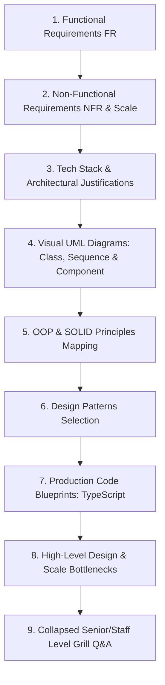

# 💳 Master System Design Problem Bank — Financial & Payment Systems

> **Target Role:** Principal / Staff Architect / Senior LLD & HLD Engineers  
> **Framework:** Standardized 9-Step Breakdown (Functional Requirements, Scale & Estimates, Tech Stack, Visual UML Diagrams, OOP & SOLID Mapping, Design Patterns, Code Blueprints, Scale Bottlenecks, and Collapsed Grill Q&A).  
> **Navigation:** ⬅️ [Back to Master Problem Bank](../README.md) | 📅 [8-Week Roadmap](../../ROADMAP.md)

---

## 🧭 Category Overview: Financial & Payment Systems (3 Master Problems)

| # | Problem Blueprint | Level | Key System Challenges & Architecture Focus | Master Guide Link |
|:---:|:---|:---:|:---|:---:|
| 1 | 📖 **Design Splitwise** | `Medium` | Minimum Cash Flow Graph Simplification Algorithm ($O(V \log V)$), Equal/Exact/Percentage Split Strategies, Immutable Double-Entry Ledger | [01-Design-Splitwise.md](./01-Design-Splitwise.md) |
| 2 | 📖 **Design Payment Gateway** | `Medium` | Idempotency Keys ($1\text{ Key} = 1\text{ Charge}$), Multi-PSP Smart Routing, Payment State Machine, Orchestrated Saga Distributed Transactions | [02-Design-Payment-Gateway.md](./02-Design-Payment-Gateway.md) |
| 3 | 📖 **Design Online Stock Exchange** | `Hard` | Sub-millisecond Limit Order Book Matching Engine ($O(1)$ Bids/Asks Price Level FIFO Queue), Single-Threaded Sequencer, LMAX Disruptor, UDP Multicast | [03-Design-Online-Stock-Exchange.md](./03-Design-Online-Stock-Exchange.md) |

---

## 📐 Standardized 9-Step Problem Breakdown Framework

Every problem blueprint in this category strictly adheres to the enterprise 9-step system design workflow:

---

## 🔑 Core Architectural Pillars of Financial & Payment Systems

1. **Integer Cent Storage & Double-Entry Bookkeeping:** Never store monetary values as floating point numbers. Use integer units (cents/paise) and append-only ledgers to prevent balance drift and provide complete auditability.
2. **Idempotency & Exactly-Once Processing:** Use multi-tiered idempotency guards (Fast Redis distributed locks + Durable DB unique constraints) to ensure zero duplicate charges under network retries.
3. **Finite State Machines (FSM):** Strict payment lifecycle states (`Initiated` $\rightarrow$ `Authorized` $\rightarrow$ `Captured` $\rightarrow$ `Refunded`) with guarded state transitions.
4. **Lock-Free Ultra-Low-Latency Data Structures:** CPU pinning, lock-free ring buffers (LMAX Disruptor), and composite Doubly-Linked List + HashMap data structures for $O(1)$ order book matching and zero lock contention.
