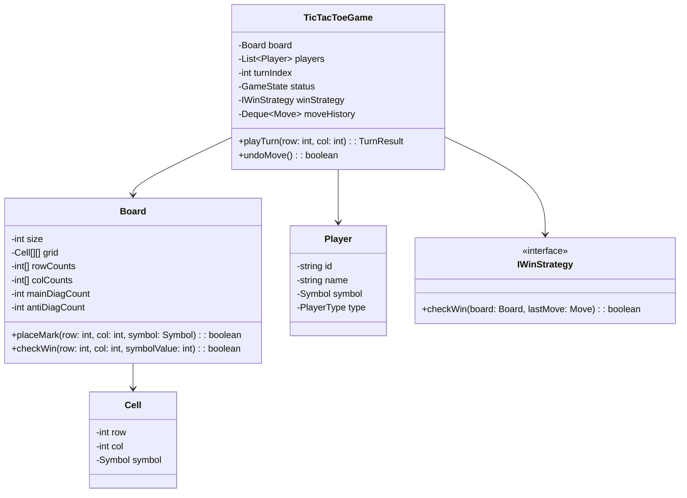

# 🛠️ Enterprise System Design & LLD Blueprint: Design Tic-Tac-Toe

> **Target Role:** Principal / Staff Architect / Senior LLD & HLD Engineers  
> **Category:** Games & Puzzles (Problem 1 of 4)  
> **Difficulty:** `Easy` / Core OOD Foundation  
> **Navigation:** ⬅️ [Back to Games & Puzzles Index](./README.md) | 📅 [Problem Bank Index](../README.md)

---

## 1. 🎯 Requirements & Scope

### 📋 Functional Requirements (FR)
1. **Customizable Grid Size:** Support $N \times N$ board sizes (default $3 \times 3$, scalable to $N=100$).
2. **Multi-Player Support:** Support 2 or $K$ players, each assigned a unique symbol (e.g. `X`, `O`, `△`).
3. **Move Validation & Execution:** Validate player moves (in-bounds, cell un-occupied). Update board state atomically.
4. **$O(1)$ Win Detection:** Determine game state (Active, Win, Draw) after every turn in $O(1)$ constant time complexity per move.
5. **Undo / Replay Functionality:** Allow players to undo previous moves or replay past moves from game history.
6. **Bot / AI Player:** Support pluggable AI bot difficulty levels (Random, Minimax).

### ⚡ Non-Functional Requirements (NFR)
1. **Low Latency:** Turn execution and win detection completed in $<1\text{ms}$.
2. **Memory Efficiency:** Minimal state footprint ($O(N)$ auxiliary space for $O(1)$ win checking).
3. **Extensibility & SOLID Principles:** Easily add new win conditions (e.g., 4-in-a-row on $10 \times 10$ grid) without modifying core board code.

---

## 2. 🧮 Scale & Quantitative Estimates

```
Board Size: N = 3 to 100
Players: K = 2
Storage per Game Instance:
- Grid storage: N x N cells ~ 3x3 = 9 bytes (or 100x100 = 10 KB)
- Auxiliary vectors for O(1) win checking: 2 * N (rows/cols) + 2 (diagonals) integers = 2N + 2 ints (~1 KB max)
Peak Scale:
- 1,000,000 concurrent active game sessions in memory ~ 1 GB RAM total.
- Sub-millisecond response time per turn validation.
```

---

## 3. 🛠️ Tech Stack & Architectural Justifications

| Component | Technology Choice | Rationale |
| :--- | :--- | :--- |
| **Language** | Java / TypeScript / C++ | Strong Object-Oriented polymorphism, static typing, and memory predictability. |
| **State Machine** | Enum / State Pattern | Explicit transition states: `WAITING`, `IN_PROGRESS`, `FINISHED_WIN`, `FINISHED_DRAW`. |
| **Win Checking** | Prefix / Count Arrays | $O(1)$ checking per move avoiding $O(N)$ row/col scanning loops. |
| **Bot Logic** | Strategy Pattern / Minimax | Pluggable algorithm execution for single-player vs AI mode. |

---

## 4. 📐 Visual UML Diagrams

### 🏗️ Class Diagram (Low-Level Design Entities)



---

## 5. 🧱 OOP & SOLID Mapping

- **S (Single Responsibility):** `Board` manages grid state; `TicTacToeGame` manages turn sequence; `IWinStrategy` computes win logic.
- **O (Open/Closed):** New winning rules (e.g. diagonal-only win or N-in-a-row) added via new implementation of `IWinStrategy` without altering `Board`.
- **L (Liskov Substitution):** `HumanPlayer` and `BotPlayer` derive from `Player` and can be substituted transparently.
- **I (Interface Segregation):** Granular interfaces for move validation vs game rendering.
- **D (Dependency Inversion):** High-level game controller depends on `IWinStrategy` abstraction, not concrete implementations.

---

## 6. 🎨 Design Patterns Applied

1. **Strategy Pattern:** Used for `IWinStrategy` (Standard 3x3 Win, N-in-a-row Win) and `IBotStrategy` (RandomBot, MinimaxBot).
2. **Command Pattern:** Encapsulates moves as `MoveCommand` objects to easily implement `undo()` and `redo()`.
3. **State Pattern:** Encapsulates game state transitions (`INIT`, `IN_PROGRESS`, `COMPLETED`).
4. **Builder Pattern:** Used to assemble customizable game configurations (custom dimensions, symbols, players).

---

## 7. 💻 Low-Level Code Blueprint (Production Ready TypeScript)

```typescript
export enum Symbol {
  X = 'X',
  O = 'O',
  EMPTY = '-'
}

export enum GameStatus {
  IN_PROGRESS = 'IN_PROGRESS',
  WON = 'WON',
  DRAW = 'DRAW'
}

export class Move {
  constructor(
    public readonly player: Player,
    public readonly row: number,
    public readonly col: number
  ) {}
}

export class Player {
  constructor(
    public readonly id: string,
    public readonly name: string,
    public readonly symbol: Symbol
  ) {}
}

export class Board {
  private grid: Symbol[][];
  private rowSum: number[];
  private colSum: number[];
  private diagSum: number = 0;
  private antiDiagSum: number = 0;

  constructor(public readonly size: number = 3) {
    this.grid = Array.from({ length: size }, () => Array(size).fill(Symbol.EMPTY));
    this.rowSum = new Array(size).fill(0);
    this.colSum = new Array(size).fill(0);
  }

  public makeMove(row: number, col: number, symbol: Symbol): boolean {
    if (row < 0 || row >= this.size || col < 0 || col >= this.size) return false;
    if (this.grid[row][col] !== Symbol.EMPTY) return false;

    this.grid[row][col] = symbol;
    const value = symbol === Symbol.X ? 1 : -1;

    this.rowSum[row] += value;
    this.colSum[col] += value;
    if (row === col) this.diagSum += value;
    if (row + col === this.size - 1) this.antiDiagSum += value;

    return true;
  }

  public isWinningMove(row: number, col: number): boolean {
    const target = this.size;
    return (
      Math.abs(this.rowSum[row]) === target ||
      Math.abs(this.colSum[col]) === target ||
      Math.abs(this.diagSum) === target ||
      Math.abs(this.antiDiagSum) === target
    );
  }

  public isFull(): boolean {
    return this.grid.every(row => row.every(cell => cell !== Symbol.EMPTY));
  }
}

export class TicTacToeGame {
  private board: Board;
  private players: Player[];
  private currentTurnIndex: number = 0;
  private history: Move[] = [];
  public status: GameStatus = GameStatus.IN_PROGRESS;
  public winner: Player | null = null;

  constructor(size: number, player1: Player, player2: Player) {
    this.board = new Board(size);
    this.players = [player1, player2];
  }

  public executeTurn(row: number, col: number): { success: boolean; message: string } {
    if (this.status !== GameStatus.IN_PROGRESS) {
      return { success: false, message: 'Game has already ended.' };
    }

    const currentPlayer = this.players[this.currentTurnIndex];
    const moveSuccess = this.board.makeMove(row, col, currentPlayer.symbol);

    if (!moveSuccess) {
      return { success: false, message: 'Invalid move: Cell occupied or out of bounds.' };
    }

    this.history.push(new Move(currentPlayer, row, col));

    if (this.board.isWinningMove(row, col)) {
      this.status = GameStatus.WON;
      this.winner = currentPlayer;
      return { success: true, message: `Game Over! ${currentPlayer.name} wins!` };
    }

    if (this.board.isFull()) {
      this.status = GameStatus.DRAW;
      return { success: true, message: 'Game Over! Draw!' };
    }

    this.currentTurnIndex = (this.currentTurnIndex + 1) % this.players.length;
    return { success: true, message: `Turn passed to ${this.players[this.currentTurnIndex].name}` };
  }
}
```

---

## 8. 🌐 High-Level Design (HLD) & Scalability Considerations

1. **Multi-room WebSocket Architecture:** State synchronization across clients via Socket.io / WebSockets.
2. **Session Persistence:** Store active game state in Redis key `game:{gameId}` with TTL.
3. **State Sync & Idempotency:** Validate turn sequence number (`turnId`) to avoid out-of-order execution or duplicate network packet requests.

---

## 9. 🎙️ Senior/Staff Level Grill Q&A

<details>
<summary><strong>Q1: How do you achieve O(1) win checking for an arbitrary N x N board?</strong></summary>

**Answer:** Rather than scanning all $N$ cells in a row/column on each turn ($O(N)$), maintain integer accumulators: `rowSum[N]`, `colSum[N]`, `diagSum`, and `antiDiagSum`. Assign $+1$ for Player 1 (`X`) and $-1$ for Player 2 (`O`). Upon placing a mark at `(r, c)`, update `rowSum[r] += val` and `colSum[c] += val`. A win is triggered when `|rowSum[r]| == N` or `|colSum[c]| == N`. This guarantees exact $O(1)$ constant time complexity and $O(N)$ space.
</details>

<details>
<summary><strong>Q2: How would you scale this design for 1,000,000 active concurrent games?</strong></summary>

**Answer:** Games are isolated, stateless domain entities. Store game state in an in-memory Redis cluster partitioned by `gameId`. Use WebSockets terminated at API Gateways with sticky sessions or Redis Pub/Sub event router to push state updates to players.
</details>
