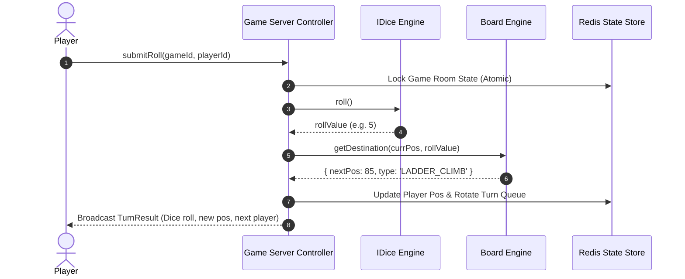
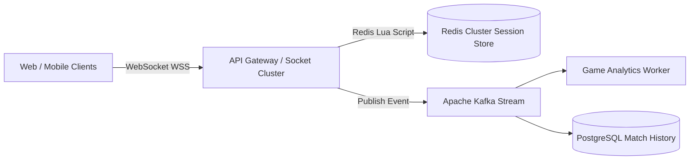

# 🛠️ Enterprise System Design Blueprint: Snake and Ladder Game

> **Target Role:** Principal / Staff Architect / Senior LLD & HLD Engineers  
> **Product Perspective:** Building a high-concurrency real-time multiplayer board game service serving 500,000 active sessions with sub-5ms turn latency.  
> **Navigation:** ⬅️ [Back to Games & Puzzles Index](./README.md) | 📅 [Problem Bank Index](../README.md)

---

## 1. 🎯 Requirements & Product Scope

### 📋 Functional Requirements (FR)
1. **Custom Board Setup:** Support arbitrary board sizes ($N \times N$ or 100 cells) with dynamic placement of snakes and ladders.
2. **Cycle Validation:** Graph validation engine to guarantee snake/ladder placements do not create infinite loops or deadlocks.
3. **Multi-Player Support:** Support 2 to $K$ players taking turns sequentially.
4. **Configurable Dice Engine:** Support 1 or multiple standard 6-sided dice, loaded/testing dice, or weighted dice strategy.
5. **Exact Terminal Landing:** Win condition requires reaching the exact end cell (cell 100). If dice roll exceeds 100, the move is skipped.

### ⚡ Non-Functional Requirements (NFR)
1. **Low Latency Execution:** Move processing and jump resolution in $P_{99} < 5\text{ms}$.
2. **Determinism & Thread Safety:** Concurrent move requests per game room are processed atomically.
3. **Extensibility:** Easily add custom board obstacles (e.g. Trampolines, Teleporters, Freeze Traps).

---

## 2. 🧮 Scale & Quantitative Estimates

```
Game Sessions: 500,000 active concurrent matches
Players per Room: 2 to 4 players
Roll Frequency: 1 roll / player every 4 seconds -> ~125,000 QPS Peak Moves
Memory per Session: 2 KB (Player queue + Board configuration + Jump HashMap)
Total RAM Requirement: 500k * 2 KB = 1 GB RAM total (Fits easily in a Redis cluster)
```

---

## 3. 🛠️ Tech Stack & Architectural Justifications

| Component | Technology Choice | Architectural Rationale |
|:---|:---|:---|
| **API Gateway & Sockets** | Socket.io / Node.js Cluster | Bidirectional event streaming for dice rolls, turn switching, and room broadcasts. |
| **Dice Generator Engine** | Strategy Pattern (C++ / TS) | Decouples random roll generation from loaded testing dice or multi-dice logic. |
| **Board Jump Lookup** | HashMap / Graph Adjacency | $O(1)$ constant time lookup for snake bite or ladder climb destinations. |
| **State Storage** | Redis Cluster | Low-latency in-memory session state storage with atomic Lua scripts. |
| **Cycle Validator** | Kahn's Algorithm / DFS | Detects circular jump dependencies during board creation ($O(V + E)$). |

---

## 4. 📐 Visual UML Diagrams

### 🏗️ Class Diagram (Low-Level Entities & Interfaces)

```mermaid
classDiagram
    class SnakeLadderGame {
        -string gameId
        -Board board
        -Queue~Player~ playerQueue
        -IDice dice
        -GameStatus status
        -Player winner
        +playTurn(): TurnResult
    }

    class Board {
        -int totalCells
        -Map~int, Jumper~ jumps
        +addSnake(start: int, end: int): void
        +addLadder(start: int, end: int): void
        +getDestination(currentPos: int, rollVal: int): JumpResult
    }

    class Jumper {
        <<abstract>>
        +int start
        +int end
        +JumperType type
        +{abstract} getDestination(): int
    }

    class Snake {
        +getDestination(): int
    }

    class Ladder {
        +getDestination(): int
    }

    class IDice {
        <<interface>>
        +roll(): int
    }

    class Player {
        -string id
        -string name
        -int position
    }

    Jumper <|-- Snake
    Jumper <|-- Ladder
    SnakeLadderGame "1" -- "1" Board
    SnakeLadderGame "1" -- "1" IDice
    SnakeLadderGame "1" -- "*" Player
    Board "1" -- "*" Jumper
```

### 🔄 Sequence Diagram: Player Turn Execution Flow



---

## 5. 🧱 OOP & SOLID Principles Mapping

- **Single Responsibility Principle (SRP):** `Board` manages grid cells and jump lookups; `IDice` handles random value generation; `SnakeLadderGame` orchestrates turn rotation.
- **Open/Closed Principle (OCP):** New board tiles (e.g., `TeleportTile`, `FreezeTile`) inherit from `Jumper` without modifying `Board`.
- **Liskov Substitution Principle (LSP):** Any implementation of `Jumper` (Snake, Ladder, Trampoline) can be processed polymorphically by `Board`.
- **Interface Segregation Principle (ISP):** Separate interfaces for `IBoardValidator` and `IGameRenderer`.
- **Dependency Inversion Principle (DIP):** Game controller depends on `IDice` abstraction rather than concrete `RandomDice`.

---

## 6. 🎨 Design Patterns Selection

1. **Strategy Pattern:** `IDice` implementations (`StandardDice`, `LoadedDice`, `MultiDice`).
2. **Factory & Builder Pattern:** `BoardBuilder` to assemble valid board instances and enforce non-cyclic jump topologies.
3. **Command Pattern:** Encapsulates turn rolls as `RollCommand` objects for move logs and replay streams.
4. **Observer Pattern:** Triggers notification listeners (`onSnakeBite`, `onLadderClimb`, `onGameWon`).

---

## 7. 💻 Production Code Blueprint (TypeScript)

```typescript
export interface IDice {
  roll(): number;
}

export class StandardDice implements IDice {
  constructor(private readonly count: number = 1, private readonly sides: number = 6) {}

  public roll(): number {
    let total = 0;
    for (let i = 0; i < this.count; i++) {
      total += Math.floor(Math.random() * this.sides) + 1;
    }
    return total;
  }
}

export enum JumperType {
  SNAKE = 'SNAKE',
  LADDER = 'LADDER'
}

export class Jumper {
  constructor(
    public readonly start: number,
    public readonly end: number,
    public readonly type: JumperType
  ) {}
}

export class Player {
  public position: number = 1;

  constructor(
    public readonly id: string,
    public readonly name: string
  ) {}
}

export class Board {
  private jumps: Map<number, Jumper> = new Map();

  constructor(public readonly size: number = 100) {}

  public addSnake(start: number, end: number): void {
    if (start <= end) throw new Error('Snake start position must be greater than end position.');
    this.jumps.set(start, new Jumper(start, end, JumperType.SNAKE));
  }

  public addLadder(start: number, end: number): void {
    if (start >= end) throw new Error('Ladder start position must be less than end position.');
    this.jumps.set(start, new Jumper(start, end, JumperType.LADDER));
  }

  public resolveMove(currentPos: number, roll: number): { nextPos: number; event: string } {
    let target = currentPos + roll;
    if (target > this.size) {
      return { nextPos: currentPos, event: 'EXCEEDS_BOARD_LIMIT' };
    }

    if (this.jumps.has(target)) {
      const jumper = this.jumps.get(target)!;
      return {
        nextPos: jumper.end,
        event: jumper.type === JumperType.SNAKE ? 'SNAKE_BITE' : 'LADDER_CLIMB'
      };
    }

    return { nextPos: target, event: 'NORMAL_MOVE' };
  }
}

export class SnakeLadderGame {
  private playerQueue: Player[] = [];
  public winner: Player | null = null;

  constructor(
    private readonly board: Board,
    players: Player[],
    private readonly dice: IDice = new StandardDice()
  ) {
    this.playerQueue = [...players];
  }

  public playTurn(): { player: Player; roll: number; newPosition: number; event: string } {
    if (this.winner) throw new Error('Game has already concluded.');

    const currentPlayer = this.playerQueue.shift()!;
    const rollValue = this.dice.roll();
    const { nextPos, event } = this.board.resolveMove(currentPlayer.position, rollValue);

    currentPlayer.position = nextPos;

    if (currentPlayer.position === this.board.size) {
      this.winner = currentPlayer;
    } else {
      // Rotate turn order unless extra turn rule applies
      this.playerQueue.push(currentPlayer);
    }

    return {
      player: currentPlayer,
      roll: rollValue,
      newPosition: currentPlayer.position,
      event
    };
  }
}
```

---

## 8. 🌐 High-Level Design (HLD) & Scale Bottlenecks



1. **Room State Locking:** Use Redis Lua scripts to execute turn validation atomically, preventing race conditions if multiple roll inputs arrive concurrently.
2. **WebSocket Fan-out:** Broadcast room state changes via Socket.io Redis adapter across horizontal server nodes.

---

## 9. 🎙️ Senior/Staff Level Grill Q&A

<details>
<summary><strong>Q1: How do you mathematically ensure that snake/ladder configurations do not create infinite cycles?</strong></summary>

**Answer:** Represent the board jump mapping as a directed graph $G = (V, E)$ where vertices are board cell numbers ($1 \dots 100$) and edges exist for normal movement ($i \to i+1$) and jump tiles ($start \to end$). Run cycle detection using DFS coloring or Topological Sort (Kahn's algorithm). If a back-edge is found during initialization, reject the board configuration.
</details>

<details>
<summary><strong>Q2: How would you scale this design to support 1 Million concurrent game rooms?</strong></summary>

**Answer:** Game rooms are completely decoupled state machines. Partition Redis state by `gameId` across a sharded Redis cluster. Terminate WebSockets at stateless gateway nodes and route messages to game instances using consistent hashing on `gameId`.
</details>
