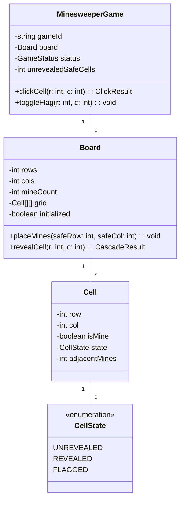
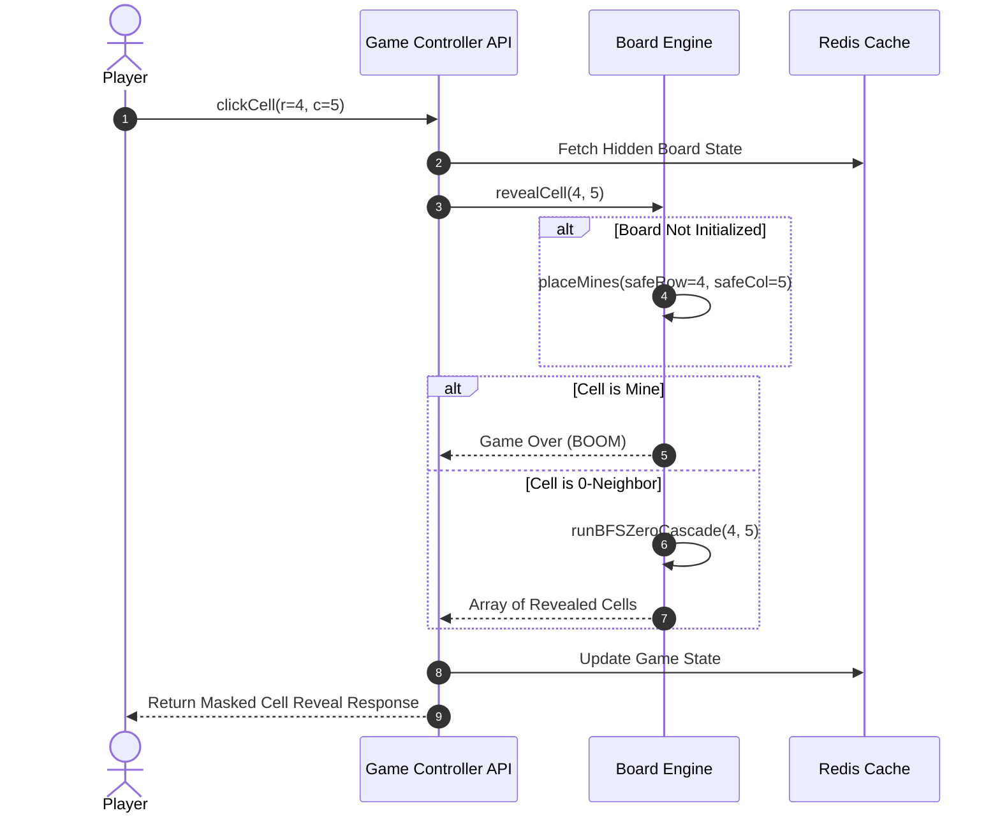

# 🛠️ Enterprise System Design Blueprint: Minesweeper Game Engine

> **Target Role:** Principal / Staff Architect / Senior LLD & HLD Engineers  
> **Product Perspective:** Building a production-grade Minesweeper engine supporting real-time online leaderboards, deferred mine generation, and efficient 0-neighbor BFS cascades.  
> **Navigation:** ⬅️ [Back to Games & Puzzles Index](./README.md) | 📅 [Problem Bank Index](../README.md)

---

## 1. 🎯 Requirements & Product Scope

### 📋 Functional Requirements (FR)
1. **Configurable Grid Dimensions:** Board size $M \times N$ with $K$ hidden mines (e.g. Beginner $9\times9$, Expert $30\times16$).
2. **Guaranteed First-Click Safety:** First cell clicked by player is guaranteed to never contain a mine. Mine initialization occurs after first click.
3. **Zero-Neighbor BFS Cascade Reveal:** Unearthing a cell with 0 adjacent mines automatically reveals all connected 0-neighbor regions via Breadth First Search (BFS) / Depth First Search (DFS).
4. **Flagging System:** Ability to flag/unflag suspect cells.
5. **Win / Loss State Evaluation:** Game ends in loss if mine is revealed; ends in victory when all non-mine cells are unearthed.

### ⚡ Non-Functional Requirements (NFR)
1. **Low Latency:** Cascade unearthing execution in $P_{99} < 2\text{ms}$.
2. **Memory Efficiency:** State per grid cell uses 1 byte flags array.
3. **Security:** Mine positions are never sent to client API until revealed or game ends (prevents memory inspection cheating).

---

## 2. 🧮 Scale & Quantitative Estimates

```
Grid Sizes: 30 x 16 = 480 cells max
Memory per Session: ~1 KB
Active Sessions: 100,000 active concurrent players
QPS Estimates: ~10,000 click requests / second
Data Footprint: 100k sessions * 1 KB = 100 MB RAM total
```

---

## 3. 🛠️ Tech Stack & Architectural Justifications

| Component | Technology Choice | Architectural Rationale |
|:---|:---|:---|
| **Cascade Engine** | BFS Algorithm (Queue) | Breadth First Search prevents stack overflow errors compared to recursive DFS on large boards. |
| **Grid Storage** | 2D Array / Bitmask | Compact in-memory array representation. |
| **Session Cache** | Redis Cluster | Stores hidden mine matrix server-side to prevent client-side inspect cheating. |

---

## 4. 📐 Visual UML Diagrams

### 🏗️ Class Diagram (Minesweeper Entities & State)



### 🔄 Sequence Diagram: Click & BFS Cascade Flow



---

## 5. 🧱 OOP & SOLID Principles Mapping

- **Single Responsibility Principle:** `Cell` represents atomic state; `Board` manages grid placement & BFS cascade; `MinesweeperGame` manages game loop & win/loss state.
- **Open/Closed Principle:** Extensible for custom cell types (e.g. Multi-life cells, Clue cells).
- **Interface Segregation:** Client API receives only masked cell views without exposing `isMine` flags.

---

## 6. 🎨 Design Patterns Selection

1. **State Pattern:** Encapsulates cell states (`UNREVEALED`, `REVEALED`, `FLAGGED`) and game status (`ACTIVE`, `WON`, `LOST`).
2. **Factory Pattern:** `BoardFactory` generates preset difficulty boards (Beginner, Intermediate, Expert).
3. **Command Pattern:** Encapsulates player clicks as `ClickCommand` objects for undo or time-lapse replay features.

---

## 7. 💻 Production Code Blueprint (TypeScript)

```typescript
export enum CellState {
  UNREVEALED = 'UNREVEALED',
  REVEALED = 'REVEALED',
  FLAGGED = 'FLAGGED'
}

export class Cell {
  public isMine: boolean = false;
  public state: CellState = CellState.UNREVEALED;
  public adjacentMines: number = 0;

  constructor(public readonly row: number, public readonly col: number) {}
}

export class MinesweeperBoard {
  public grid: Cell[][];
  private isInitialized: boolean = false;

  constructor(
    public readonly rows: number = 10,
    public readonly cols: number = 10,
    public readonly mineCount: number = 10
  ) {
    this.grid = Array.from({ length: rows }, (_, r) =>
      Array.from({ length: cols }, (_, c) => new Cell(r, c))
    );
  }

  public placeMines(safeRow: number, safeCol: number): void {
    let placed = 0;
    while (placed < this.mineCount) {
      const r = Math.floor(Math.random() * this.rows);
      const c = Math.floor(Math.random() * this.cols);

      // Guarantee safe first click cell is skipped
      if ((r === safeRow && c === safeCol) || this.grid[r][c].isMine) continue;

      this.grid[r][c].isMine = true;
      placed++;
    }

    // Compute 8-neighbor adjacent mine counts
    for (let r = 0; r < this.rows; r++) {
      for (let c = 0; c < this.cols; c++) {
        if (!this.grid[r][c].isMine) {
          this.grid[r][c].adjacentMines = this.countNeighborMines(r, c);
        }
      }
    }
    this.isInitialized = true;
  }

  private countNeighborMines(r: number, c: number): number {
    let count = 0;
    for (let dr = -1; dr <= 1; dr++) {
      for (let dc = -1; dc <= 1; dc++) {
        if (dr === 0 && dc === 0) continue;
        const nr = r + dr, nc = c + dc;
        if (nr >= 0 && nr < this.rows && nc >= 0 && nc < this.cols && this.grid[nr][nc].isMine) {
          count++;
        }
      }
    }
    return count;
  }

  public revealCell(r: number, c: number): { hitMine: boolean; revealedCells: Cell[] } {
    if (!this.isInitialized) {
      this.placeMines(r, c);
    }

    const cell = this.grid[r][c];
    if (cell.state !== CellState.UNREVEALED) return { hitMine: false, revealedCells: [] };

    cell.state = CellState.REVEALED;
    if (cell.isMine) return { hitMine: true, revealedCells: [cell] };

    const revealed: Cell[] = [cell];

    // Iterative BFS Queue for 0-neighbor cascade
    if (cell.adjacentMines === 0) {
      const queue: [number, number][] = [[r, c]];
      while (queue.length > 0) {
        const [currR, currC] = queue.shift()!;
        for (let dr = -1; dr <= 1; dr++) {
          for (let dc = -1; dc <= 1; dc++) {
            const nr = currR + dr, nc = currC + dc;
            if (nr >= 0 && nr < this.rows && nc >= 0 && nc < this.cols) {
              const neighbor = this.grid[nr][nc];
              if (neighbor.state === CellState.UNREVEALED && !neighbor.isMine) {
                neighbor.state = CellState.REVEALED;
                revealed.push(neighbor);
                if (neighbor.adjacentMines === 0) {
                  queue.push([nr, nc]);
                }
              }
            }
          }
        }
      }
    }

    return { hitMine: false, revealedCells: revealed };
  }
}
```

---

## 8. 🌐 High-Level Design (HLD) & Anti-Cheat Architecture

1. **Server-side Board Masking:** The client browser receives only cell states (`UNREVEALED`, `REVEALED`, `FLAGGED`) and revealed adjacent counts. The boolean `isMine` array remains securely cached inside Redis server-side to prevent inspect-element cheating.
2. **Leaderboard Engine:** Redis Sorted Sets (`ZSET`) store win completion times ordered by lowest seconds.

---

## 9. 🎙️ Senior/Staff Level Grill Q&A

<details>
<summary><strong>Q1: Why use BFS Queue instead of recursive DFS for 0-neighbor cascades?</strong></summary>

**Answer:** Deep recursive DFS can lead to `Maximum Call Stack Size Exceeded` errors on large grid sizes (e.g. $1000 \times 1000$). Iterative BFS using an explicit memory Queue guarantees $O(V + E)$ traversal while maintaining stack safety.
</details>
