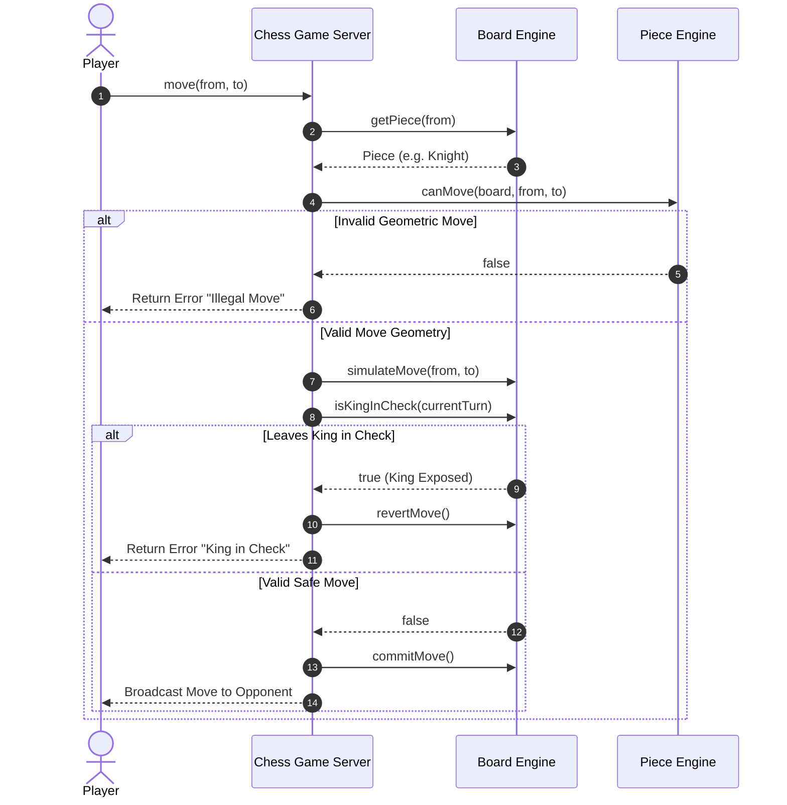

# 🛠️ Enterprise System Design Blueprint: Chess Game Engine

> **Target Role:** Principal / Staff Architect / Senior LLD & HLD Engineers  
> **Product Perspective:** Building a production-grade, multi-tenant Chess engine supporting millions of active games, move validation, PGN notation, and Checkmate state machines.  
> **Navigation:** ⬅️ [Back to Games & Puzzles Index](./README.md) | 📅 [Problem Bank Index](../README.md)

---

## 1. 🎯 Requirements & Product Scope

### 📋 Functional Requirements (FR)
1. **Polymorphic Piece & Board Representation:** $8 \times 8$ board supporting 6 piece types (King, Queen, Rook, Bishop, Knight, Pawn) with customized geometric move validation.
2. **Special Move Rules:** Support Castling (Kingside & Queenside), En Passant, and Pawn Promotion.
3. **Check / Checkmate / Stalemate Verification:** Evaluate check conditions after every turn by verifying if the active player's King is threatened.
4. **Move History & Notation:** Record moves in PGN (Portable Game Notation) with full undo/redo and game replay capability.

### ⚡ Non-Functional Requirements (NFR)
1. **Low Latency Validation:** Move validation and check evaluation in $P_{99} < 10\text{ms}$.
2. **State Determinism:** Thread-safe state transition per move.

---

## 2. 🧮 Scale & Quantitative Estimates

```
Active Matches: 200,000 concurrent online games
Moves per Match: ~80 moves
Storage per Session: ~5 KB (Board state + Move log array)
Total RAM Footprint: 200k * 5 KB = 1 GB (Cached in Redis Cluster)
```

---

## 3. 🛠️ Tech Stack & Architectural Justifications

| Component | Technology Choice | Architectural Rationale |
|:---|:---|:---|
| **Engine Framework** | Object-Oriented TS / C++ | Polymorphic piece classes with encapsulation of move rules. |
| **Move Validation** | Strategy Pattern | Decouples piece movement rules from board rendering. |
| **State Storage** | Redis Cluster | Low-latency state storage partitioned by `gameId`. |
| **Real-time Sync** | WebSockets (Socket.io) | Sub-50ms turn event broadcasting to white & black clients. |

---

## 4. 📐 Visual UML Diagrams

### 🏗️ Class Diagram (Chess Hierarchy & Invariants)

```mermaid
classDiagram
    class ChessGame {
        -string gameId
        -Board board
        -Player whitePlayer
        -Player blackPlayer
        -Color currentTurn
        -GameState state
        -List~Move~ moveHistory
        +playTurn(start: Position, end: Position): MoveResult
    }

    class Board {
        -Spot[][] grid
        +getPiece(pos: Position): Piece
        +setPiece(pos: Position, piece: Piece): void
        +isKingInCheck(color: Color): boolean
    }

    class Piece {
        <<abstract>>
        -Color color
        +{abstract} canMove(board: Board, start: Position, end: Position): boolean
    }

    class King {
        +canMove(board: Board, start: Position, end: Position): boolean
    }

    class Knight {
        +canMove(board: Board, start: Position, end: Position): boolean
    }

    class Pawn {
        +canMove(board: Board, start: Position, end: Position): boolean
    }

    Piece <|-- King
    Piece <|-- Knight
    Piece <|-- Pawn
    ChessGame "1" -- "1" Board
    Board "1" -- "64" Spot
    Spot "1" -- "0..1" Piece
```

### 🔄 Sequence Diagram: Move Execution & Check Validation



---

## 5. 🧱 OOP & SOLID Principles Mapping

- **Single Responsibility Principle:** `Piece` hierarchy defines move geometry; `Board` manages grid state & check evaluation; `ChessGame` controls turn order & PGN history.
- **Open/Closed Principle:** New fairy chess pieces (e.g., Archbishop, Chancellor) add new `Piece` subclasses without touching `Board`.
- **Liskov Substitution Principle:** Any subclass of `Piece` (Rook, Knight, Queen) is transparently evaluated by `Board.isKingInCheck()`.
- **Dependency Inversion Principle:** Board depends on abstract `Piece` class.

---

## 6. 🎨 Design Patterns Selection

1. **Strategy Pattern:** Polymorphic move strategies inside piece subclasses (`Knight`, `Rook`, `Bishop`, `Queen`).
2. **Command Pattern:** Encapsulates moves as `MoveCommand` objects for move history logging, undo/redo, and PGN export.
3. **State Pattern:** Encapsulates game state (`WHITE_TURN`, `BLACK_TURN`, `CHECK`, `CHECKMATE`, `STALEMATE`).
4. **Factory Pattern:** `PieceFactory` initializes default 32 pieces on board setup.

---

## 7. 💻 Production Code Blueprint (TypeScript)

```typescript
export enum Color {
  WHITE = 'WHITE',
  BLACK = 'BLACK'
}

export class Position {
  constructor(public readonly row: number, public readonly col: number) {}

  public equals(other: Position): boolean {
    return this.row === other.row && this.col === other.col;
  }
}

export abstract class Piece {
  constructor(public readonly color: Color) {}

  public abstract canMove(board: Board, start: Position, end: Position): boolean;
}

export class Knight extends Piece {
  public canMove(board: Board, start: Position, end: Position): boolean {
    const targetPiece = board.getPiece(end);
    if (targetPiece && targetPiece.color === this.color) return false;

    const dRow = Math.abs(start.row - end.row);
    const dCol = Math.abs(start.col - end.col);
    return (dRow === 1 && dCol === 2) || (dRow === 2 && dCol === 1);
  }
}

export class Board {
  private grid: (Piece | null)[][];

  constructor() {
    this.grid = Array.from({ length: 8 }, () => Array(8).fill(null));
    this.setupBoard();
  }

  private setupBoard(): void {
    // Setup Knights
    this.grid[0][1] = new Knight(Color.BLACK);
    this.grid[0][6] = new Knight(Color.BLACK);
    this.grid[7][1] = new Knight(Color.WHITE);
    this.grid[7][6] = new Knight(Color.WHITE);
  }

  public getPiece(pos: Position): Piece | null {
    return this.grid[pos.row][pos.col];
  }

  public setPiece(pos: Position, piece: Piece | null): void {
    this.grid[pos.row][pos.col] = piece;
  }

  public isKingInCheck(color: Color): boolean {
    // 1. Find King position
    let kingPos: Position | null = null;
    for (let r = 0; r < 8; r++) {
      for (let c = 0; c < 8; c++) {
        const piece = this.grid[r][c];
        if (piece && piece.color === color && piece.constructor.name === 'King') {
          kingPos = new Position(r, c);
          break;
        }
      }
    }

    if (!kingPos) return false;

    // 2. Verify if any enemy piece can attack kingPos
    const enemyColor = color === Color.WHITE ? Color.BLACK : Color.WHITE;
    for (let r = 0; r < 8; r++) {
      for (let c = 0; c < 8; c++) {
        const piece = this.grid[r][c];
        if (piece && piece.color === enemyColor) {
          if (piece.canMove(this, new Position(r, c), kingPos)) {
            return true;
          }
        }
      }
    }
    return false;
  }
}

export class ChessGame {
  private board: Board = new Board();
  private turn: Color = Color.WHITE;

  public playTurn(start: Position, end: Position): boolean {
    const piece = this.board.getPiece(start);
    if (!piece || piece.color !== this.turn) return false;

    if (!piece.canMove(this.board, start, end)) return false;

    // Simulate move to ensure King is not left in check
    const originalTarget = this.board.getPiece(end);
    this.board.setPiece(end, piece);
    this.board.setPiece(start, null);

    if (this.board.isKingInCheck(this.turn)) {
      // Revert illegal move exposing King
      this.board.setPiece(start, piece);
      this.board.setPiece(end, originalTarget);
      return false;
    }

    this.turn = this.turn === Color.WHITE ? Color.BLACK : Color.WHITE;
    return true;
  }
}
```

---

## 8. 🌐 High-Level Design (HLD) & Distributed Matchmaking

1. **State Partitioning:** Store game state JSON in Redis mapped to `chess:game:{gameId}`.
2. **Real-time WebSockets:** Edge nodes broadcast opponent moves using Socket.io Redis adapter.

---

## 9. 🎙️ Senior/Staff Level Grill Q&A

<details>
<summary><strong>Q1: How do you differentiate Checkmate from Stalemate?</strong></summary>

**Answer:** If `isKingInCheck(color)` is `true` and every possible legal move for all pieces of `color` still leaves the King in check, the result is **Checkmate** (Win for opponent). If `isKingInCheck(color)` is `false` but the active player has zero valid legal moves available, the result is **Stalemate** (Draw).
</details>
