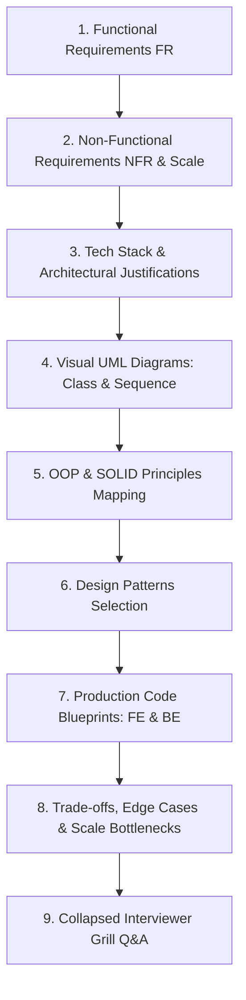

# 🎮 Master System Design Problem Bank — Games & Puzzles

> **Target Role:** Principal / Staff Architect / Senior LLD & HLD Engineers  
> **Framework:** Standardized 9-Step Breakdown (Functional Requirements, Scale & Estimates, Tech Stack, Visual UML Diagrams, OOP & SOLID Mapping, Design Patterns, Code Blueprints, Scale Bottlenecks, and Collapsed Grill Q&A).  
> **Navigation:** ⬅️ [Back to Master Problem Bank](../README.md) | 📅 [8-Week Roadmap](../../ROADMAP.md)

---

## 🧭 Category Overview: Games & Puzzles (4 Problems)

| # | Problem Blueprint | Level | Key System Challenges & Architecture Focus | Master Guide Link |
|:---:|:---|:---:|:---|:---:|
| 1 | 📖 **Design Tic Tac Toe** | `Easy` | $O(1)$ Turn & Win Verification, Strategy Pattern, Command Undo/Redo | [01-Design-Tic-Tac-Toe.md](./01-Design-Tic-Tac-Toe.md) |
| 2 | 📖 **Design Snake and Ladder Game** | `Easy` | Graph Cycle Detection (Snake/Ladder Validation), Dice Strategy, Sequential Turn Queue | [02-Design-Snake-and-Ladder.md](./02-Design-Snake-and-Ladder.md) |
| 3 | 📖 **Design Minesweeper Game** | `Medium` | Deferred Safe First Click, BFS/DFS Zero-Neighbor Cascade Reveal, Grid State Machine | [03-Design-Minesweeper.md](./03-Design-Minesweeper.md) |
| 4 | 📖 **Design Chess Game** | `Hard` | Polymorphic Piece Movement Rules, Check/Checkmate/Stalemate Detection, Castling & En Passant | [04-Design-Chess-Game.md](./04-Design-Chess-Game.md) |

---

## 📐 Standardized 9-Step Problem Breakdown Framework

Every problem in this module strictly follows the enterprise 9-step system design workflow:

