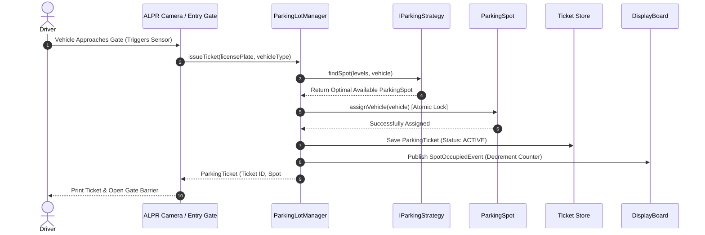

# 🛠️ Enterprise System Design Blueprint: Multi-Level Parking Lot System

> **Target Role:** Principal / Staff Architect / Senior LLD & HLD Engineers  
> **Product Perspective:** Designing a highly available, extensible, concurrent multi-level parking lot management system supporting real-time spot allocation, dynamic pricing, barrier control, and automated exit ticketing.  
> **Navigation:** ⬅️ [Back to Category Index](./README.md) | 📅 [8-Week Roadmap](../../ROADMAP.md)

---

## 1. 🎯 Requirements & Product Scope

### 📋 Functional Requirements (FR)

1. **Multi-Level Infrastructure:** Support multiple parking levels ($L_1, L_2, \dots, L_n$), each containing distinct entry/exit gates, display boards, and designated parking spots categorized by size: *Motorcycle*, *Compact*, *Large (Bus/Truck)*, and *EV Charging Spots*.
2. **Automated Ticket Issuance:** Upon arrival at an entry gate, the system reads vehicle details (license plate, type), allocates an optimal available spot, issues a timestamped `ParkingTicket` with barcode/RFID, and opens the entry barrier.
3. **Spot Allocation Strategy:** Intelligently allocate parking spots based on configured strategies (e.g., *Nearest to Entry Gate*, *Lowest Level First*, or *Vehicle Size Optimization*).
4. **Checkout & Fee Calculation:** Upon exit, scan the ticket at an exit terminal, compute the total elapsed duration, apply vehicle/spot-specific pricing rules, process payment, update spot status to *Available*, and raise the exit barrier.
5. **Real-Time Display Boards:** Dynamically reflect spot availability count per vehicle type per floor on entry gates and level signage.
6. **Concurrent Safety:** Prevent overbooking or double-allocation of a single spot when multiple entry gates operate simultaneously.

### ⚡ Non-Functional Requirements (NFR)

1. **Low Latency:** Ticket generation and gate barrier control in $P_{99} < 100\text{ms}$.
2. **High Availability & Fault Tolerance:** $99.99\%$ uptime. Offline fallback mode allowing gates to issue offline signed barcode tickets if network connection to central server drops.
3. **Concurrency & Thread Safety:** Guaranteed atomic spot allocation under high peak loads (e.g., stadium or airport parking with 50 concurrent gate readers).
4. **Extensibility & Maintainability:** Easy plug-and-play addition of new vehicle types (e.g., Electric Truck), new spot types, or custom pricing strategies (e.g., surge pricing, subscription passes) without modifying core allocation logic (Open/Closed Principle).

---

## 2. 🧮 Scale & Quantitative Estimates

```
Parking Lot Capacity Assumptions:
- Total Levels: 5 Levels
- Spots per Level: 500 spots (Total Capacity = 2,500 spots)
  - Motorcycle (15%): 375 spots
  - Compact/Sedan (60%): 1,500 spots
  - Large/SUV (20%): 500 spots
  - EV Spots (5%): 125 spots

Peak Operational Throughput:
- Daily Vehicles Served: 10,000 vehicles/day
- Peak Entry Throughput: 30 vehicles/minute = 0.5 entries/sec (Normal)
- Event Peak Surge (Stadium/Airport): 20 concurrent gates, 10 entries/sec peak

Storage & Memory Estimates:
- Parking Ticket Record: ~500 bytes (Ticket ID, License Plate, Spot ID, Entry Timestamp, Exit Timestamp, Fee Paid)
- Daily Database Storage: 10,000 * 500 bytes = 5 MB / day
- Annual Database Storage: 5 MB * 365 = ~1.82 GB / year (Extremely light DB footprint)
- In-Memory Cache (Redis) State: 2,500 spots state bitmap + metadata ~ < 5 MB RAM required
```

---

## 3. 🛠️ Tech Stack & Architectural Justifications

| Component | Technology Choice | Architectural Rationale |
| :--- | :--- | :--- |
| **Core Service / LLD** | TypeScript / Node.js (or Java/Go) | Strongly typed domain model, asynchronous I/O handling gate hardware requests efficiently. |
| **API Layer** | gRPC / REST API over HTTP/2 | Sub-10ms binary serialization for hardware controllers (barrier gates, ALPR cameras). |
| **Primary Store** | PostgreSQL | Relational schema with ACID guarantees for historical tickets, transactions, and audit logs. |
| **In-Memory Cache / Lock** | Redis Cluster | Atomic `Lua` scripts or `SETNX` distributed locks for zero-race spot reservation and live counters. |
| **Message Broker** | Apache Kafka / RabbitMQ | Pub/Sub event distribution for updating level display boards and sending telemetry data to analytics. |
| **Hardware Layer (Edge)** | ALPR Camera + IoT Microcontroller | Automatic License Plate Recognition (ALPR) for camera-driven frictionless gate entry. |

---

## 4. 📐 Visual UML Diagrams

### 🏗️ Class Diagram (Low-Level Entities & Strategy Patterns)

```mermaid
classDiagram
    class Vehicle {
        <<abstract>>
        +string licensePlate
        +VehicleType type
    }
    class Car { +VehicleType type }
    class Motorcycle { +VehicleType type }
    class Truck { +VehicleType type }
    class ElectricCar { +VehicleType type }
    Vehicle <|-- Car
    Vehicle <|-- Motorcycle
    Vehicle <|-- Truck
    Vehicle <|-- ElectricCar

    class ParkingSpot {
        <<abstract>>
        +string spotId
        +number levelNumber
        +ParkingSpotType spotType
        +boolean isOccupied
        +Vehicle currentVehicle
        +assignVehicle(vehicle: Vehicle) boolean
        +removeVehicle() void
    }
    class CompactSpot { +canFitVehicle(vehicle: Vehicle) boolean }
    class LargeSpot { +canFitVehicle(vehicle: Vehicle) boolean }
    class MotorcycleSpot { +canFitVehicle(vehicle: Vehicle) boolean }
    class EVSpot { +canFitVehicle(vehicle: Vehicle) boolean }
    ParkingSpot <|-- CompactSpot
    ParkingSpot <|-- LargeSpot
    ParkingSpot <|-- MotorcycleSpot
    ParkingSpot <|-- EVSpot

    class ParkingTicket {
        +string ticketId
        +string licensePlate
        +string spotId
        +Date entryTime
        +Date exitTime
        +number totalFee
        +TicketStatus status
        +markPaid(fee: number) void
    }

    class IParkingStrategy {
        <<interface>>
        +findSpot(levels: ParkingLevel[], vehicle: Vehicle) ParkingSpot
    }
    class NearestToEntryStrategy {
        +findSpot(levels: ParkingLevel[], vehicle: Vehicle) ParkingSpot
    }
    class LowestLevelFirstStrategy {
        +findSpot(levels: ParkingLevel[], vehicle: Vehicle) ParkingSpot
    }
    IParkingStrategy <|.. NearestToEntryStrategy
    IParkingStrategy <|.. LowestLevelFirstStrategy

    class IPricingStrategy {
        <<interface>>
        +calculateFee(ticket: ParkingTicket) number
    }
    class HourlyPricingStrategy {
        +calculateFee(ticket: ParkingTicket) number
    }
    class DynamicSurgePricingStrategy {
        +calculateFee(ticket: ParkingTicket) number
    }
    IPricingStrategy <|.. HourlyPricingStrategy
    IPricingStrategy <|.. DynamicSurgePricingStrategy

    class DisplayBoard {
        +string boardId
        +Map~ParkingSpotType, number~ freeSpotCounts
        +updateCounts(level: ParkingLevel) void
    }

    class ParkingLotManager {
        -static ParkingLotManager instance
        -List~ParkingLevel~ levels
        -IParkingStrategy parkingStrategy
        -IPricingStrategy pricingStrategy
        +issueTicket(vehicle: Vehicle) ParkingTicket
        +processExit(ticketId: string) number
    }

    ParkingLotManager "1" o-- "*" ParkingTicket
    ParkingLotManager "1" o-- "1" IParkingStrategy
    ParkingLotManager "1" o-- "1" IPricingStrategy
    ParkingLevel "1" o-- "*" ParkingSpot
    ParkingLevel "1" o-- "1" DisplayBoard
```



### 🔄 Sequence Diagram: Automated Entry & Spot Allocation Flow



---

## 5. 🧱 OOP & SOLID Principles Mapping

- **Single Responsibility Principle (SRP):**
  - `ParkingSpot` handles spot state representation and occupancy tracking.
  - `IPricingStrategy` handles fee calculation rules exclusively.
  - `DisplayBoard` handles visual presentation of availability metrics.
- **Open/Closed Principle (OCP):**
  - New vehicle types (e.g., *ElectricBus*) or spot types can be introduced without modifying `ParkingLotManager`.
  - New pricing algorithms (e.g., *Flat Weekend Rate*, *EV Charge Time Added*) implement `IPricingStrategy` without altering checkout flows.
- **Liskov Substitution Principle (LSP):**
  - Subclasses of `ParkingSpot` (e.g., `EVSpot`, `LargeSpot`) conform strictly to `ParkingSpot` invariants and can be evaluated interchangeably by allocation algorithms.
- **Interface Segregation Principle (ISP):**
  - Gate hardware controllers interact with a minimal `IGateBarrierController` interface rather than exposing administrative configuration APIs.
- **Dependency Inversion Principle (DIP):**
  - `ParkingLotManager` relies on abstract interfaces (`IParkingStrategy`, `IPricingStrategy`) rather than hardcoded concrete implementations.

---

## 6. 🎨 Design Patterns Selection

| Pattern Name | Application in Parking Lot System | Architectural Benefit |
| :--- | :--- | :--- |
| **Singleton Pattern** | `ParkingLotManager` | Ensures a single centralized control point managing physical inventory state across levels. |
| **Factory Method Pattern** | `VehicleFactory`, `SpotFactory` | Instantiates appropriate domain objects dynamically based on ALPR camera sensor payload. |
| **Strategy Pattern** | `IParkingStrategy`, `IPricingStrategy` | Swappable spot allocation strategies (Nearest, Lowest Level) and fee rules (Hourly, Dynamic). |
| **Observer Pattern** | `DisplayBoard`, `AuditLogger` | Event-driven updates trigger display board count re-rendering whenever spots are assigned or vacated. |

---

## 7. 💻 Production Code Blueprint (TypeScript)

```typescript
// ============================================================================
// DOMAIN ENUMS & INTERFACES
// ============================================================================

export enum VehicleType {
  MOTORCYCLE = 'MOTORCYCLE',
  COMPACT = 'COMPACT',
  LARGE = 'LARGE',
  ELECTRIC = 'ELECTRIC',
}

export enum ParkingSpotType {
  MOTORCYCLE = 'MOTORCYCLE',
  COMPACT = 'COMPACT',
  LARGE = 'LARGE',
  EV = 'EV',
}

export enum TicketStatus {
  ACTIVE = 'ACTIVE',
  PAID = 'PAID',
  COMPLETED = 'COMPLETED',
}

export abstract class Vehicle {
  constructor(
    public readonly licensePlate: string,
    public readonly type: VehicleType
  ) {}
}

export class Car extends Vehicle {
  constructor(licensePlate: string) {
    super(licensePlate, VehicleType.COMPACT);
  }
}

export class Motorcycle extends Vehicle {
  constructor(licensePlate: string) {
    super(licensePlate, VehicleType.MOTORCYCLE);
  }
}

export class Truck extends Vehicle {
  constructor(licensePlate: string) {
    super(licensePlate, VehicleType.LARGE);
  }
}

export class ElectricCar extends Vehicle {
  constructor(licensePlate: string) {
    super(licensePlate, VehicleType.ELECTRIC);
  }
}

// ============================================================================
// PARKING SPOT DOMAIN ENTITIES
// ============================================================================

export abstract class ParkingSpot {
  private occupiedVehicle: Vehicle | null = null;

  constructor(
    public readonly spotId: string,
    public readonly levelNumber: number,
    public readonly spotType: ParkingSpotType
  ) {}

  public isAvailable(): boolean {
    return this.occupiedVehicle === null;
  }

  public abstract canFitVehicle(vehicle: Vehicle): boolean;

  public assignVehicle(vehicle: Vehicle): boolean {
    if (!this.isAvailable() || !this.canFitVehicle(vehicle)) {
      return false;
    }
    this.occupiedVehicle = vehicle;
    return true;
  }

  public vacate(): void {
    this.occupiedVehicle = null;
  }

  public getVehicle(): Vehicle | null {
    return this.occupiedVehicle;
  }
}

export class CompactSpot extends ParkingSpot {
  constructor(spotId: string, levelNumber: number) {
    super(spotId, levelNumber, ParkingSpotType.COMPACT);
  }

  public canFitVehicle(vehicle: Vehicle): boolean {
    return vehicle.type === VehicleType.COMPACT || vehicle.type === VehicleType.MOTORCYCLE;
  }
}

export class LargeSpot extends ParkingSpot {
  constructor(spotId: string, levelNumber: number) {
    super(spotId, levelNumber, ParkingSpotType.LARGE);
  }

  public canFitVehicle(vehicle: Vehicle): boolean {
    return true; // Large spots fit all vehicle types
  }
}

export class MotorcycleSpot extends ParkingSpot {
  constructor(spotId: string, levelNumber: number) {
    super(spotId, levelNumber, ParkingSpotType.MOTORCYCLE);
  }

  public canFitVehicle(vehicle: Vehicle): boolean {
    return vehicle.type === VehicleType.MOTORCYCLE;
  }
}

export class EVSpot extends ParkingSpot {
  constructor(spotId: string, levelNumber: number) {
    super(spotId, levelNumber, ParkingSpotType.EV);
  }

  public canFitVehicle(vehicle: Vehicle): boolean {
    return vehicle.type === VehicleType.ELECTRIC;
  }
}

// ============================================================================
// STRATEGY PATTERNS (ALLOCATION & PRICING)
// ============================================================================

export interface IParkingStrategy {
  findSpot(levels: ParkingLevel[], vehicle: Vehicle): ParkingSpot | null;
}

export class LowestLevelFirstStrategy implements IParkingStrategy {
  public findSpot(levels: ParkingLevel[], vehicle: Vehicle): ParkingSpot | null {
    for (const level of levels) {
      for (const spot of level.spots) {
        if (spot.isAvailable() && spot.canFitVehicle(vehicle)) {
          return spot;
        }
      }
    }
    return null;
  }
}

export interface IPricingStrategy {
  calculateFee(ticket: ParkingTicket): number;
}

export class HourlyPricingStrategy implements IPricingStrategy {
  private readonly hourlyRates: Record<VehicleType, number> = {
    [VehicleType.MOTORCYCLE]: 2.0,
    [VehicleType.COMPACT]: 5.0,
    [VehicleType.LARGE]: 10.0,
    [VehicleType.ELECTRIC]: 7.0,
  };

  public calculateFee(ticket: ParkingTicket): number {
    const exitTime = ticket.exitTime || new Date();
    const durationMs = exitTime.getTime() - ticket.entryTime.getTime();
    const hours = Math.max(1, Math.ceil(durationMs / (1000 * 60 * 60)));
    const rate = this.hourlyRates[ticket.vehicle.type] || 5.0;
    return hours * rate;
  }
}

// ============================================================================
// TICKET & LEVEL AGGREGATES
// ============================================================================

export class ParkingTicket {
  public readonly ticketId: string;
  public readonly vehicle: Vehicle;
  public readonly spot: ParkingSpot;
  public readonly entryTime: Date;
  public exitTime: Date | null = null;
  public feePaid: number = 0;
  public status: TicketStatus = TicketStatus.ACTIVE;

  constructor(ticketId: string, vehicle: Vehicle, spot: ParkingSpot) {
    this.ticketId = ticketId;
    this.vehicle = vehicle;
    this.spot = spot;
    this.entryTime = new Date();
  }

  public completeCheckout(fee: number): void {
    this.exitTime = new Date();
    this.feePaid = fee;
    this.status = TicketStatus.COMPLETED;
  }
}

export class ParkingLevel {
  public readonly spots: ParkingSpot[] = [];

  constructor(public readonly levelNumber: number) {}

  public addSpot(spot: ParkingSpot): void {
    this.spots.push(spot);
  }

  public getFreeSpotCount(type: ParkingSpotType): number {
    return this.spots.filter((s) => s.spotType === type && s.isAvailable()).length;
  }
}

// ============================================================================
// SINGLETON SYSTEM CONTROLLER
// ============================================================================

export class ParkingLotManager {
  private static instance: ParkingLotManager;
  private levels: ParkingLevel[] = [];
  private activeTickets: Map<string, ParkingTicket> = new Map();
  private parkingStrategy: IParkingStrategy;
  private pricingStrategy: IPricingStrategy;

  private constructor() {
    this.parkingStrategy = new LowestLevelFirstStrategy();
    this.pricingStrategy = new HourlyPricingStrategy();
  }

  public static getInstance(): ParkingLotManager {
    if (!ParkingLotManager.instance) {
      ParkingLotManager.instance = new ParkingLotManager();
    }
    return ParkingLotManager.instance;
  }

  public setParkingStrategy(strategy: IParkingStrategy): void {
    this.parkingStrategy = strategy;
  }

  public setPricingStrategy(strategy: IPricingStrategy): void {
    this.pricingStrategy = strategy;
  }

  public addLevel(level: ParkingLevel): void {
    this.levels.push(level);
  }

  public issueTicket(vehicle: Vehicle): ParkingTicket {
    const spot = this.parkingStrategy.findSpot(this.levels, vehicle);
    if (!spot) {
      throw new Error(`Parking Lot Full: No available spot for vehicle type ${vehicle.type}`);
    }

    const assigned = spot.assignVehicle(vehicle);
    if (!assigned) {
      throw new Error(`Concurrent Allocation Collision on spot ${spot.spotId}`);
    }

    const ticketId = `TKT-${Date.now()}-${Math.floor(Math.random() * 1000)}`;
    const ticket = new ParkingTicket(ticketId, vehicle, spot);
    this.activeTickets.set(ticketId, ticket);

    console.log(`[ENTRY GATE] Issued Ticket ${ticketId} to Vehicle ${vehicle.licensePlate} at Spot ${spot.spotId} (L${spot.levelNumber})`);
    return ticket;
  }

  public processExit(ticketId: string): number {
    const ticket = this.activeTickets.get(ticketId);
    if (!ticket) {
      throw new Error(`Invalid or Unknown Ticket ID: ${ticketId}`);
    }

    const fee = this.pricingStrategy.calculateFee(ticket);
    ticket.completeCheckout(fee);
    ticket.spot.vacate();
    this.activeTickets.delete(ticketId);

    console.log(`[EXIT GATE] Ticket ${ticketId} Processed. Duration: Paid $${fee}. Spot ${ticket.spot.spotId} is now VACANT.`);
    return fee;
  }
}

// ============================================================================
// VERIFICATION & EXECUTION TEST SUITE
// ============================================================================

function runParkingLotTest() {
  console.log('--- INITIALIZING PARKING LOT SYSTEM ---');
  const manager = ParkingLotManager.getInstance();

  const level1 = new ParkingLevel(1);
  level1.addSpot(new CompactSpot('L1-C1', 1));
  level1.addSpot(new EVSpot('L1-EV1', 1));
  level1.addSpot(new LargeSpot('L1-L1', 1));

  manager.addLevel(level1);

  const tesla = new ElectricCar('TESLA-EV-01');
  const ticket1 = manager.issueTicket(tesla);

  const truck = new Truck('BIG-TRUCK-99');
  const ticket2 = manager.issueTicket(truck);

  console.log('\n--- PROCESSING EXIT ---');
  manager.processExit(ticket1.ticketId);
  manager.processExit(ticket2.ticketId);
}

runParkingLotTest();
```

---

## 8. 🌐 High-Level Design (HLD) & Scale Bottlenecks

### 🏗️ Distributed Edge & Cloud Architecture

```mermaid
graph TB
    subgraph Edge Layer (Parking Facility)
        EntryGate[Entry Gate Controller + ALPR Camera]
        ExitGate[Exit Gate Controller + Scanner]
        LocalEdge[Edge Server & Redis Cache]
    end

    subgraph Cloud Backend Infrastructure
        Gateway[API Gateway / gRPC Router]
        AllocSvc[Spot Allocation Microservice]
        PaymentSvc[Payment & Billing Microservice]
        CloudDB[(PostgreSQL Primary DB)]
        Kafka{{Kafka Event Bus}}
        DisplayWorker[Display Board Sync Service]
    end

    EntryGate -->|gRPC Check-In| LocalEdge
    LocalEdge -->|Sync Fallback| Gateway
    Gateway --> AllocSvc
    AllocSvc --> CloudDB
    AllocSvc --> Kafka
    Kafka --> DisplayWorker
    ExitGate -->|gRPC Checkout| PaymentSvc
```

### ⚡ Critical Scale Bottlenecks & Architectural Fixes

1. **Race Conditions on Concurrent Gate Entries (Thundering Herd):**
   - *Problem:* 10 entry gates simultaneously attempt to claim the last available spot on Level 1.
   - *Solution:* Execute atomic spot reservations using Redis `Lua` scripts with compare-and-set operations, or utilize PostgreSQL pessimistic row locking (`SELECT * FROM spots WHERE status = 'FREE' FOR UPDATE SKIP LOCKED LIMIT 1`).
2. **Offline Resilience (Internet Outage):**
   - *Problem:* Cloud backend connectivity drops while vehicles line up at entry gates.
   - *Solution:* Deploy Edge Nodes inside each parking building containing a synchronized Redis cache. Entry gates generate cryptographically signed barcode tickets containing `(VehicleID, SpotID, Timestamp, Signature)` valid locally without central server confirmation.

---

## ❓ 9. Collapsed Senior/Staff Level Grill Q&A

<details>
<summary>❓ How do you prevent double-booking of a single parking spot when 50 gates check in simultaneously?</summary>

**Answer:**
We prevent double-booking using a two-tiered isolation model:
1. **In-Memory Atomicity (Primary):** Spot states are mirrored in a Redis Cluster. Spot allocation runs inside a Redis `Lua` script executing `SPOP` or searching a bitset atomically. Since Redis single-threads command execution per shard, race conditions are eliminated at the memory layer.
2. **Database Fallback Constraint (Secondary):** In PostgreSQL, the `parking_spots` table contains a conditional unique index: `CREATE UNIQUE INDEX idx_single_occupancy ON parking_spots (spot_id) WHERE is_occupied = TRUE;`. If two concurrent transactions bypass cache, one will fail with a unique index violation and automatically retry.

</details>

<details>
<summary>❓ How would you implement dynamic surge pricing when parking occupancy exceeds 90%?</summary>

**Answer:**
We leverage the **Strategy Pattern** paired with real-time occupancy metrics:
```typescript
export class DynamicSurgePricingStrategy implements IPricingStrategy {
  constructor(private baseStrategy: IPricingStrategy, private occupancyRatio: number) {}

  public calculateFee(ticket: ParkingTicket): number {
    const baseFee = this.baseStrategy.calculateFee(ticket);
    if (this.occupancyRatio > 0.9) return baseFee * 2.0; // 100% Surge multiplier
    if (this.occupancyRatio > 0.75) return baseFee * 1.5;
    return baseFee;
  }
}
```
Occupancy statistics are updated asynchronously via Kafka stream aggregations every 30 seconds.

</details>
