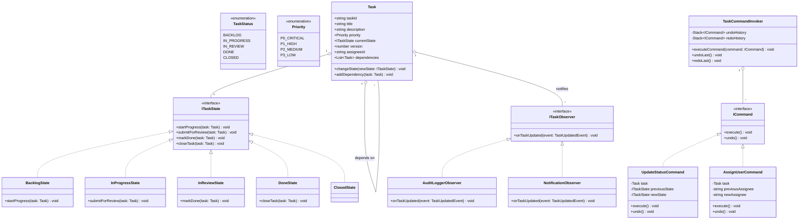
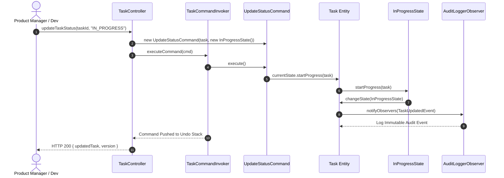
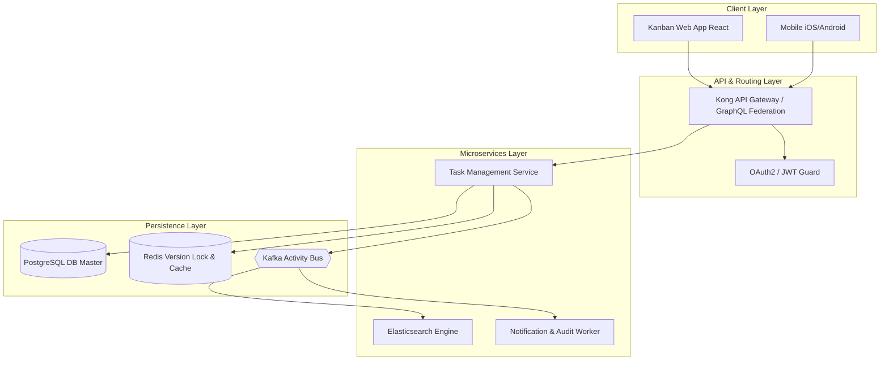

# 🛠️ Enterprise System Design Blueprint: Task Management System

> **Target Role:** Principal / Staff Architect / Senior LLD & HLD Engineers  
> **Product Perspective:** Building an enterprise-grade Jira/Asana-style Task Management System supporting flexible workflows, task dependencies, status state machines, undo/redo operations, and real-time activity auditing.  
> **Navigation:** ⬅️ [Back to Category Index](./README.md) | 📅 [8-Week Roadmap](../../ROADMAP.md)

---

## 1. 🎯 Requirements & Product Scope

### 📋 Functional Requirements (FR)

1. **Project & Task Hierarchy:** Support Projects containing epic, story, task, and subtask hierarchies. Tasks contain titles, markdown descriptions, assignees, priorities ($P_0, P_1, P_2, P_3$), tags, and due dates.
2. **State Machine Workflow:** Enforce strict status lifecycle transitions: `BACKLOG` $\rightarrow$ `IN_PROGRESS` $\rightarrow$ `IN_REVIEW` $\rightarrow$ `DONE` $\rightarrow$ `CLOSED`. Prevent invalid illegal transitions (e.g., directly from `BACKLOG` to `CLOSED`).
3. **Undo/Redo Command Operations:** Support executable task mutations (status change, assignee assignment, priority update) with full rollback/redo capabilities.
4. **Task Dependency Graph:** Allow tasks to be blocked by prerequisite tasks. Warn or block closing a task if dependent blocker tasks remain open.
5. **Activity Log & Audit Trail:** Automatically capture historical audit trails whenever any task state changes, and notify assignees/watchers.
6. **Filtering & Searching:** Enable multi-attribute search and sorting across tasks by priority, status, assignee, and tags.

### ⚡ Non-Functional Requirements (NFR)

1. **Low Latency:** Task state updates and UI updates in $P_{99} < 50\text{ms}$.
2. **High Availability:** $99.99\%$ uptime for task reads and real-time collaboration.
3. **Concurrency Control:** Optimistic concurrency control (versioning) to prevent overwrite anomalies when multiple team members edit a task concurrently.
4. **Audit Immutability:** Audit trail events must be strictly append-only and immutable.

---

## 2. 🧮 Scale & Quantitative Estimates

```
Scale Assumptions:
- Total Enterprise Organizations: 10,000 Companies
- Active Monthly Users (MAU): 5 Million Users
- Daily Active Users (DAU): 1 Million Users
- Total Tasks Created / Day: 500,000 tasks/day
- Task Status Mutations / Day: 3,000,000 updates/day

Throughput Calculations:
- Average Read QPS: (50M reads / 86400s) = ~580 QPS (Peak 2,500 QPS)
- Average Write QPS: (3.5M writes / 86400s) = ~40 QPS (Peak 300 QPS)

Storage Estimates (5 Years):
- Average Task Record Size: ~2 KB (Metadata, Description, Comments, References)
- Tasks per Year: 500,000 * 365 = 182.5 Million tasks/year
- Annual Database Storage: 182.5M * 2 KB = ~365 GB / year
- 5-Year Data Footprint: ~1.8 TB (Fits comfortably in partitioned PostgreSQL + ElasticSearch)
```

---

## 3. 🛠️ Tech Stack & Architectural Justifications

| Component | Technology Choice | Architectural Rationale |
| :--- | :--- | :--- |
| **Frontend Framework** | React / Next.js + Zustand | Optimistic UI updates for instant drag-and-drop kanban board state transitions. |
| **Backend API** | Node.js / TypeScript (GraphQL + REST) | Unified schema querying complex project-task-user relationships without over-fetching. |
| **Primary Database** | PostgreSQL | Relational integrity, transactional guarantees, and JSONB support for dynamic task custom fields. |
| **Audit Log Store** | Cassandra / DynamoDB | Append-only write-heavy store for high-throughput immutable task history events. |
| **Search Engine** | Elasticsearch | Inverted indexing for instant fuzzy text search and multi-facet filtering across millions of tasks. |
| **Real-time Engine** | Socket.io / WebSockets | Bi-directional streaming for live board updates when teammates update tasks. |

---

## 4. 📐 Visual UML Diagrams

### 🏗️ Class Diagram (Low-Level Entities & State/Command Patterns)



### 🔄 Sequence Diagram: Task State Transition & Command Execution



---

## 5. 🧱 OOP & SOLID Principles Mapping

- **Single Responsibility Principle (SRP):**
  - `Task` entity encapsulates internal task attributes and state reference.
  - Concrete State classes (`InProgressState`, `DoneState`) validate state transition rules exclusively.
  - `AuditLoggerObserver` handles immutable audit logging without bloating task business logic.
- **Open/Closed Principle (OCP):**
  - New task states (e.g., `BLOCKED` or `QA_TESTING`) can be added by implementing `ITaskState` without modifying existing state transition handlers.
  - New undoable operations implement `ICommand` without touching `TaskCommandInvoker`.
- **Liskov Substitution Principle (LSP):**
  - All state objects implement `ITaskState` transparently; `Task` calls state methods without needing runtime type casts.
- **Interface Segregation Principle (ISP):**
  - Observers receive lean event objects (`TaskUpdatedEvent`) rather than being granted full write access to the `Task` entity.
- **Dependency Inversion Principle (DIP):**
  - `TaskCommandInvoker` relies on the abstract `ICommand` interface, decoupled from specific implementation detail logic.

---

## 6. 🎨 Design Patterns Selection

| Pattern Name | Application in Task Management System | Architectural Benefit |
| :--- | :--- | :--- |
| **State Pattern** | Task Lifecycle (`ITaskState`) | Encapsulates status transition validation into dedicated state objects, preventing massive `if-else` branching. |
| **Command Pattern** | `TaskCommandInvoker`, `ICommand` | Decouples status/assignee mutations into executable objects, providing clean multi-level Undo/Redo functionality. |
| **Observer Pattern** | `ITaskObserver`, `AuditLogger` | Event-driven architecture triggering activity logs and WebSocket alerts when tasks change state. |
| **Factory Method Pattern** | `TaskFactory` | Centralizes task instantiation (epics, stories, bugs) with initial state injection. |

---

## 7. 💻 Production Code Blueprint (TypeScript)

```typescript
// ============================================================================
// DOMAIN ENUMS & EVENTS
// ============================================================================

export enum TaskPriority {
  P0_CRITICAL = 'P0_CRITICAL',
  P1_HIGH = 'P1_HIGH',
  P2_MEDIUM = 'P2_MEDIUM',
  P3_LOW = 'P3_LOW',
}

export enum TaskStatusName {
  BACKLOG = 'BACKLOG',
  IN_PROGRESS = 'IN_PROGRESS',
  IN_REVIEW = 'IN_REVIEW',
  DONE = 'DONE',
  CLOSED = 'CLOSED',
}

export interface TaskUpdatedEvent {
  taskId: string;
  action: string;
  timestamp: Date;
  details: Record<string, any>;
}

// ============================================================================
// OBSERVER PATTERN (AUDIT & NOTIFICATIONS)
// ============================================================================

export interface ITaskObserver {
  onTaskUpdated(event: TaskUpdatedEvent): void;
}

export class AuditLoggerObserver implements ITaskObserver {
  public onTaskUpdated(event: TaskUpdatedEvent): void {
    console.log(`[AUDIT LOG] Task ${event.taskId} | Action: ${event.action} | Time: ${event.timestamp.toISOString()} | Details:`, event.details);
  }
}

export class NotificationObserver implements ITaskObserver {
  public onTaskUpdated(event: TaskUpdatedEvent): void {
    console.log(`[NOTIFICATION] Alerting team watchers on task ${event.taskId}: ${event.action}`);
  }
}

// ============================================================================
// STATE PATTERN (TASK LIFECYCLE WORKFLOW)
// ============================================================================

export interface ITaskState {
  readonly name: TaskStatusName;
  startProgress(task: Task): void;
  submitForReview(task: Task): void;
  markDone(task: Task): void;
  closeTask(task: Task): void;
}

export class BacklogState implements ITaskState {
  public readonly name = TaskStatusName.BACKLOG;

  public startProgress(task: Task): void {
    task.setState(new InProgressState());
  }
  public submitForReview(task: Task): void {
    throw new Error('Invalid Transition: Cannot submit for review directly from BACKLOG');
  }
  public markDone(task: Task): void {
    throw new Error('Invalid Transition: Cannot mark DONE directly from BACKLOG');
  }
  public closeTask(task: Task): void {
    task.setState(new ClosedState());
  }
}

export class InProgressState implements ITaskState {
  public readonly name = TaskStatusName.IN_PROGRESS;

  public startProgress(task: Task): void {
    /* Already in progress */
  }
  public submitForReview(task: Task): void {
    task.setState(new InReviewState());
  }
  public markDone(task: Task): void {
    task.setState(new DoneState());
  }
  public closeTask(task: Task): void {
    throw new Error('Invalid Transition: Cannot close task directly from IN_PROGRESS');
  }
}

export class InReviewState implements ITaskState {
  public readonly name = TaskStatusName.IN_REVIEW;

  public startProgress(task: Task): void {
    task.setState(new InProgressState()); // Rejected back to Dev
  }
  public submitForReview(task: Task): void {
    /* Already in review */
  }
  public markDone(task: Task): void {
    task.setState(new DoneState());
  }
  public closeTask(task: Task): void {
    throw new Error('Invalid Transition: Cannot close task directly from IN_REVIEW');
  }
}

export class DoneState implements ITaskState {
  public readonly name = TaskStatusName.DONE;

  public startProgress(task: Task): void {
    task.setState(new InProgressState()); // Re-opened
  }
  public submitForReview(task: Task): void {
    throw new Error('Invalid Transition: Cannot submit for review from DONE');
  }
  public markDone(task: Task): void {
    /* Already done */
  }
  public closeTask(task: Task): void {
    task.setState(new ClosedState());
  }
}

export class ClosedState implements ITaskState {
  public readonly name = TaskStatusName.CLOSED;

  public startProgress(task: Task): void {
    task.setState(new InProgressState()); // Re-opened
  }
  public submitForReview(task: Task): void {
    throw new Error('Invalid Transition: Cannot review a CLOSED task');
  }
  public markDone(task: Task): void {
    throw new Error('Invalid Transition: Cannot mark DONE on a CLOSED task');
  }
  public closeTask(task: Task): void {
    /* Already closed */
  }
}

// ============================================================================
// TASK DOMAIN AGGREGATE
// ============================================================================

export class Task {
  private state: ITaskState;
  private observers: ITaskObserver[] = [];
  public version: number = 1;
  public assigneeId: string | null = null;
  public dependencies: Task[] = [];

  constructor(
    public readonly taskId: string,
    public title: string,
    public description: string,
    public priority: TaskPriority
  ) {
    this.state = new BacklogState();
  }

  public getState(): ITaskState {
    return this.state;
  }

  public setState(newState: ITaskState): void {
    const oldState = this.state.name;
    this.state = newState;
    this.version++;
    this.notifyObservers({
      taskId: this.taskId,
      action: `STATUS_CHANGED: ${oldState} -> ${newState.name}`,
      timestamp: new Date(),
      details: { oldState, newState: newState.name, version: this.version },
    });
  }

  public addObserver(observer: ITaskObserver): void {
    this.observers.push(observer);
  }

  public notifyObservers(event: TaskUpdatedEvent): void {
    for (const observer of this.observers) {
      observer.onTaskUpdated(event);
    }
  }

  public addDependency(task: Task): void {
    this.dependencies.push(task);
  }

  public hasUnresolvedDependencies(): boolean {
    return this.dependencies.some((dep) => dep.getState().name !== TaskStatusName.CLOSED && dep.getState().name !== TaskStatusName.DONE);
  }
}

// ============================================================================
// COMMAND PATTERN (UNDO / REDO)
// ============================================================================

export interface ICommand {
  execute(): void;
  undo(): void;
}

export class UpdateStatusCommand implements ICommand {
  private previousState: ITaskState;

  constructor(
    private task: Task,
    private targetState: ITaskState
  ) {
    this.previousState = task.getState();
  }

  public execute(): void {
    if (this.targetState.name === TaskStatusName.DONE && this.task.hasUnresolvedDependencies()) {
      throw new Error(`Cannot complete Task ${this.task.taskId}: Unresolved blocker dependencies exist!`);
    }
    this.previousState = this.task.getState();
    this.task.setState(this.targetState);
  }

  public undo(): void {
    console.log(`[UNDO COMMAND] Reverting status on task ${this.task.taskId} back to ${this.previousState.name}`);
    this.task.setState(this.previousState);
  }
}

export class TaskCommandInvoker {
  private undoStack: ICommand[] = [];
  private redoStack: ICommand[] = [];

  public executeCommand(command: ICommand): void {
    command.execute();
    this.undoStack.push(command);
    this.redoStack = []; // Clear redo stack on new operation
  }

  public undo(): void {
    const command = this.undoStack.pop();
    if (command) {
      command.undo();
      this.redoStack.push(command);
    } else {
      console.log('No commands left to undo.');
    }
  }

  public redo(): void {
    const command = this.redoStack.pop();
    if (command) {
      command.execute();
      this.undoStack.push(command);
    } else {
      console.log('No commands left to redo.');
    }
  }
}

// ============================================================================
// EXECUTION & VERIFICATION TEST
// ============================================================================

function runTaskManagementTest() {
  console.log('--- INITIALIZING TASK MANAGEMENT SYSTEM ---');

  const task1 = new Task('TASK-101', 'Setup Database Schema', 'Create initial PostgreSQL tables', TaskPriority.P0_CRITICAL);
  const task2 = new Task('TASK-102', 'Implement API Endpoint', 'Build GraphQL resolvers', TaskPriority.P1_HIGH);

  const auditLogger = new AuditLoggerObserver();
  const notifier = new NotificationObserver();

  task1.addObserver(auditLogger);
  task1.addObserver(notifier);
  task2.addObserver(auditLogger);

  // Link dependency: Task 2 depends on Task 1
  task2.addDependency(task1);

  const invoker = new TaskCommandInvoker();

  console.log('\n--- EXECUTING STATUS TRANSITIONS ---');
  const cmd1 = new UpdateStatusCommand(task1, new InProgressState());
  invoker.executeCommand(cmd1);

  const cmd2 = new UpdateStatusCommand(task1, new DoneState());
  invoker.executeCommand(cmd2);

  console.log('\n--- TESTING DEPENDENCY BLOCKER SAFEGUARD ---');
  const cmd3 = new UpdateStatusCommand(task2, new InProgressState());
  invoker.executeCommand(cmd3);

  console.log('\n--- TESTING UNDO OPERATION ---');
  invoker.undo(); // Undo task2 status change
}

runTaskManagementTest();
```

---

## 8. 🌐 High-Level Design (HLD) & Scale Bottlenecks

### 🏗️ Microservice & Event-Driven Architecture



### ⚡ Critical Scale Bottlenecks & Architectural Fixes

1. **Lost Update Anomaly on Concurrent Edits:**
   - *Problem:* Two developers edit Task #402 descriptions simultaneously. Developer B overwrites Developer A's changes without realizing it.
   - *Solution:* Enforce **Optimistic Concurrency Control (OCC)** using a version field (`WHERE task_id = $1 AND version = $2`). If version check fails, reject write with HTTP 409 Conflict.
2. **High-Frequency Graph Dependency Traversal:**
   - *Problem:* Complex nested project dependencies cause deep SQL query recursion.
   - *Solution:* Store task dependency graphs using adjacency lists cached in Redis, or utilize PostgreSQL `WITH RECURSIVE` CTEs bounded to max depth 10.

---

## ❓ 9. Collapsed Senior/Staff Level Grill Q&A

<details>
<summary>❓ How do you prevent circular dependency deadlocks when linking tasks (e.g. Task A depends on B, B depends on A)?</summary>

**Answer:**
Before persisting a new dependency edge $A \rightarrow B$, perform a Depth-First Search (DFS) cycle detection traversal starting from node $B$. If node $A$ is reachable in the existing graph from $B$, abort insertion with a `CircularDependencyException`.

```typescript
function detectCycle(startNodeId: string, targetNodeId: string, graph: Map<string, string[]>): boolean {
  if (startNodeId === targetNodeId) return true;
  const neighbors = graph.get(startNodeId) || [];
  for (const neighbor of neighbors) {
    if (detectCycle(neighbor, targetNodeId, graph)) return true;
  }
  return false;
}
```

</details>

<details>
<summary>❓ How do you maintain sub-10ms search filters when millions of tasks are updated concurrently?</summary>

**Answer:**
We decouple write path from read search queries using **CQRS (Command Query Responsibility Segregation)**. Task writes update PostgreSQL primary DB and emit a `TaskUpdated` event to Apache Kafka. Elasticsearch workers ingest the event asynchronously, maintaining inverted indices on custom fields without slowing primary write API responses.

</details>
