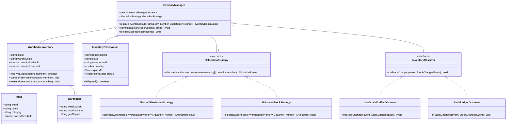
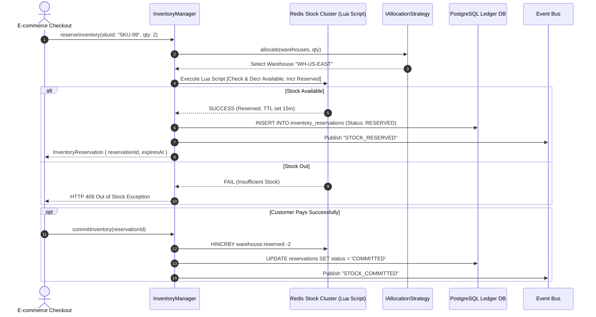
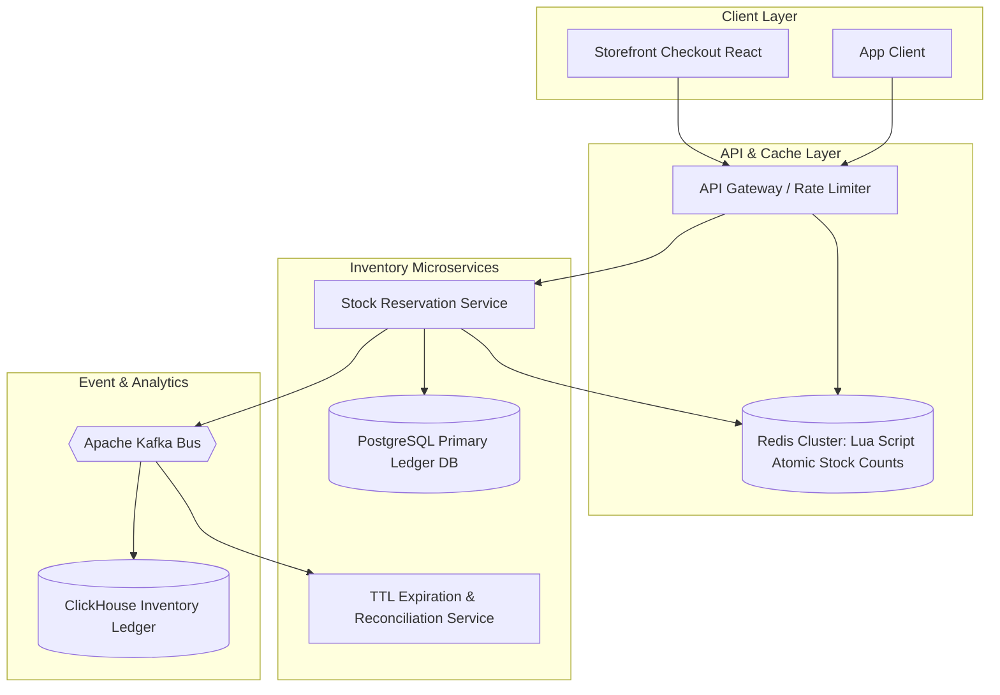

# 🛠️ Enterprise System Design Blueprint: Multi-Warehouse Inventory Management System

> **Target Role:** Principal / Staff Architect / Senior LLD & HLD Engineers  
> **Product Perspective:** Designing a high-throughput, multi-tenant inventory management system supporting multi-warehouse stock reservation, TTL cart holds, low-stock reordering alerts, and oversell prevention.  
> **Navigation:** ⬅️ [Back to Category Index](./README.md) | 📅 [8-Week Roadmap](../../ROADMAP.md)

---

## 1. 🎯 Requirements & Product Scope

### 📋 Functional Requirements (FR)

1. **SKU & Multi-Warehouse Tracking:** Catalog items by Stock Keeping Unit (SKU). Track inventory quantities across multiple geographic warehouses: *Total Quantity*, *Available Quantity*, *Reserved Quantity (Cart Hold)*, and *In-Transit Quantity*.
2. **Flash Sale Reservation Hold (TTL):** Support 15-minute temporary inventory reservations during checkout. If customer completes payment, convert reservation to committed sale; if checkout expires, automatically release held stock back to available pool.
3. **Multi-Warehouse Allocation Strategy:** Intelligently allocate item fulfillment from warehouses based on selectable policies (e.g., *Nearest Warehouse to Customer*, *FIFO / Oldest Batch First*, *Single Warehouse Fulfillment Optimization*).
4. **Low-Stock Alerting & Auto-Reorder:** Trigger automated notification alerts and purchase order recommendations when SKU stock drops below a predefined safety threshold.
5. **Stock Adjustment & Audit Trail:** Track stock movements (restock, return, shrinkage, damage, transfer) with complete audit trail and ledger reconciliation.

### ⚡ Non-Functional Requirements (NFR)

1. **Strict Oversell Prevention (Zero Double Allocation):** Zero inventory overselling under high concurrency (e.g., 100,000 customers buying 1,000 limited items simultaneously).
2. **Sub-50ms Reservation Latency:** Cart reserve operations execute in $P_{99} < 50\text{ms}$.
3. **High Availability:** $99.99\%$ read availability for stock queries during high-traffic promotional sales.
4. **Eventual Ledger Consistency:** Financial inventory balances reconciled asynchronously with zero lost stock state.

---

## 2. 🧮 Scale & Quantitative Estimates

```
System Capacity & Traffic Assumptions:
- Total Products (SKUs): 10,000,000 active SKUs
- Warehouses: 50 Fulfillment Centers worldwide
- Daily Checkout Transactions: 2,000,000 orders/day
- Flash Sale Peak Load: 50,000 checkouts/second

QPS & Throughput Calculations:
- Average Stock View QPS: 10,000 QPS (Normal) -> 100,000 QPS Peak
- Reservation Write QPS: (2M checkouts / 86400s) = ~23 QPS (Normal) -> 10,000 QPS Flash Sale Peak

Storage & Ledger Footprint:
- SKU Warehouse Inventory Row: ~200 bytes (SKU ID, Warehouse ID, Quantity Available, Quantity Reserved, Safety Threshold)
- Total Inventory Matrix Rows: 10M SKUs * 50 Warehouses = 500 Million Records ~ 100 GB Data
- Inventory Audit Ledger Event: ~500 bytes per transaction
- Daily Audit Log Generation: 5,000,000 stock changes/day * 500 B = 2.5 GB / day (~912 GB / year)
```

---

## 3. 🛠️ Tech Stack & Architectural Justifications

| Component | Technology Choice | Architectural Rationale |
| :--- | :--- | :--- |
| **Backend Framework** | Go / TypeScript Node.js | Low-overhead concurrent execution handling high-throughput cart reservations. |
| **In-Memory Buffer Lock** | Redis Cluster + Lua Scripts | Atomic operations (`DECRBY`, `HINCRBY`) preventing overselling with zero lock contention overhead. |
| **Primary Relational DB** | PostgreSQL (Partitioned) | Transactional ACID updates for committed purchase orders and inventory ledger entries. |
| **Event Streaming Bus** | Apache Kafka | Event-driven architecture publishing `StockReserved`, `StockReleased`, and `LowStockDetected` events. |
| **Analytical Store** | ClickHouse / Snowflake | High-speed columnar analytics running inventory valuation and shrinkage reports across warehouses. |

---

## 4. 📐 Visual UML Diagrams

### 🏗️ Class Diagram (Low-Level Entities & Strategy Patterns)



### 🔄 Sequence Diagram: Flash Sale Reservation Hold & Commit Flow



---

## 5. 🧱 OOP & SOLID Principles Mapping

- **Single Responsibility Principle (SRP):**
  - `WarehouseInventory` strictly encapsulates single-location stock numbers.
  - `IAllocationStrategy` encapsulates selection algorithms across multiple warehouses.
  - `LowStockNotifierObserver` triggers supplier reorders without modifying inventory state transitions.
- **Open/Closed Principle (OCP):**
  - New allocation strategies (e.g., *Cross-Docking Direct Ship*, *Expiry Date FEFO*) implement `IAllocationStrategy` without altering checkout flows.
  - New alert mechanisms (e.g., Slack webhook, SMS trigger) add new observers implementing `IInventoryObserver`.
- **Liskov Substitution Principle (LSP):**
  - All warehouse allocation implementations fulfill `IAllocationStrategy` contracts predictably.
- **Interface Segregation Principle (ISP):**
  - Read-only clients rely on an `IStockReader` interface to query stock without exposing mutation APIs.
- **Dependency Inversion Principle (DIP):**
  - `InventoryManager` relies on abstract storage contracts (`IStockRepository`) rather than binding directly to Redis or PostgreSQL drivers.

---

## 6. 🎨 Design Patterns Selection

| Pattern Name | Application in Inventory Management System | Architectural Benefit |
| :--- | :--- | :--- |
| **Strategy Pattern** | `IAllocationStrategy` | Flexible warehouse selection (Nearest location vs stock balancing). |
| **Observer Pattern** | `IInventoryObserver` | Decouples low-stock reorder alerts and audit log writing from reservation execution path. |
| **Command Pattern** | `StockAdjustmentCommand` | Encapsulates stock movement operations with rollback capability during audit reconciliations. |
| **Singleton Pattern** | `InventoryManager` | Centralizes cache locking and reservation state coordination across memory spaces. |

---

## 7. 💻 Production Code Blueprint (TypeScript)

```typescript
// ============================================================================
// DOMAIN ENUMS & INTERFACES
// ============================================================================

export enum ReservationStatus {
  RESERVED = 'RESERVED',
  COMMITTED = 'COMMITTED',
  EXPIRED = 'EXPIRED',
  CANCELLED = 'CANCELLED',
}

export interface StockChangedEvent {
  skuId: string;
  warehouseId: string;
  previousQty: number;
  newQty: number;
  action: string;
  timestamp: Date;
}

// ============================================================================
// OBSERVER PATTERN (ALERTS & AUDIT)
// ============================================================================

export interface IInventoryObserver {
  onStockChanged(event: StockChangedEvent): void;
}

export class LowStockNotifierObserver implements IInventoryObserver {
  constructor(private safetyThreshold: number) {}

  public onStockChanged(event: StockChangedEvent): void {
    if (event.newQty <= this.safetyThreshold) {
      console.log(`[LOW STOCK ALERT] SKU ${event.skuId} at Warehouse ${event.warehouseId} dropped to ${event.newQty} (Threshold: ${this.safetyThreshold}). Auto-triggering Purchase Order!`);
    }
  }
}

export class AuditLedgerObserver implements IInventoryObserver {
  public onStockChanged(event: StockChangedEvent): void {
    console.log(`[LEDGER AUDIT] ${event.timestamp.toISOString()} | SKU: ${event.skuId} | WH: ${event.warehouseId} | Action: ${event.action} | Delta: ${event.newQty - event.previousQty}`);
  }
}

// ============================================================================
// DOMAIN ENTITIES
// ============================================================================

export class WarehouseInventory {
  constructor(
    public readonly skuId: string,
    public readonly warehouseId: string,
    public availableQuantity: number,
    public reservedQuantity: number = 0
  ) {}

  public reserve(amount: number): boolean {
    if (this.availableQuantity < amount) {
      return false;
    }
    this.availableQuantity -= amount;
    this.reservedQuantity += amount;
    return true;
  }

  public commit(amount: number): void {
    if (this.reservedQuantity < amount) {
      throw new Error('Invalid Commit: Requested commit amount exceeds reserved pool');
    }
    this.reservedQuantity -= amount;
  }

  public release(amount: number): void {
    if (this.reservedQuantity < amount) {
      throw new Error('Invalid Release: Requested release amount exceeds reserved pool');
    }
    this.reservedQuantity -= amount;
    this.availableQuantity += amount;
  }
}

export class InventoryReservation {
  public status: ReservationStatus = ReservationStatus.RESERVED;

  constructor(
    public readonly reservationId: string,
    public readonly skuId: string,
    public readonly warehouseId: string,
    public readonly quantity: number,
    public readonly expiresAt: Date
  ) {}

  public isExpired(): boolean {
    return new Date() > this.expiresAt && this.status === ReservationStatus.RESERVED;
  }
}

// ============================================================================
// ALLOCATION STRATEGY PATTERN
// ============================================================================

export interface IAllocationStrategy {
  allocate(inventories: WarehouseInventory[], requestedQty: number): WarehouseInventory | null;
}

export class NearestWarehouseStrategy implements IAllocationStrategy {
  public allocate(inventories: WarehouseInventory[], requestedQty: number): WarehouseInventory | null {
    // Finds first warehouse with sufficient stock
    for (const inv of inventories) {
      if (inv.availableQuantity >= requestedQty) {
        return inv;
      }
    }
    return null;
  }
}

// ============================================================================
// INVENTORY MANAGER SYSTEM CONTROLLER
// ============================================================================

export class InventoryManager {
  private static instance: InventoryManager;
  private inventoryMap: Map<string, WarehouseInventory[]> = new Map(); // SKU -> WarehouseInventory[]
  private reservations: Map<string, InventoryReservation> = new Map();
  private observers: IInventoryObserver[] = [];
  private allocationStrategy: IAllocationStrategy;

  private constructor() {
    this.allocationStrategy = new NearestWarehouseStrategy();
  }

  public static getInstance(): InventoryManager {
    if (!InventoryManager.instance) {
      InventoryManager.instance = new InventoryManager();
    }
    return InventoryManager.instance;
  }

  public addObserver(observer: IInventoryObserver): void {
    this.observers.push(observer);
  }

  public addWarehouseStock(inventory: WarehouseInventory): void {
    const existing = this.inventoryMap.get(inventory.skuId) || [];
    existing.push(inventory);
    this.inventoryMap.set(inventory.skuId, existing);
  }

  public reserveStock(skuId: string, quantity: number, ttlMinutes: number = 15): InventoryReservation {
    const warehouses = this.inventoryMap.get(skuId) || [];
    const selectedWarehouse = this.allocationStrategy.allocate(warehouses, quantity);

    if (!selectedWarehouse) {
      throw new Error(`Oversell Prevented: Insufficient inventory across warehouses for SKU ${skuId}`);
    }

    const prevQty = selectedWarehouse.availableQuantity;
    const reservedSuccess = selectedWarehouse.reserve(quantity);
    if (!reservedSuccess) {
      throw new Error(`Concurrent Lock Collision on SKU ${skuId}`);
    }

    const expiresAt = new Date(Date.now() + ttlMinutes * 60 * 1000);
    const reservationId = `RES-${Date.now()}-${Math.floor(Math.random() * 10000)}`;
    const reservation = new InventoryReservation(reservationId, skuId, selectedWarehouse.warehouseId, quantity, expiresAt);

    this.reservations.set(reservationId, reservation);

    // Notify Observers
    this.notifyObservers({
      skuId,
      warehouseId: selectedWarehouse.warehouseId,
      previousQty: prevQty,
      newQty: selectedWarehouse.availableQuantity,
      action: 'RESERVE_STOCK',
      timestamp: new Date(),
    });

    console.log(`[RESERVATION SUCCESS] Reserved ${quantity} of SKU ${skuId} at WH ${selectedWarehouse.warehouseId}. Reservation ID: ${reservationId}`);
    return reservation;
  }

  public commitReservation(reservationId: string): void {
    const reservation = this.reservations.get(reservationId);
    if (!reservation || reservation.status !== ReservationStatus.RESERVED) {
      throw new Error(`Invalid or already processed reservation: ${reservationId}`);
    }

    const warehouses = this.inventoryMap.get(reservation.skuId) || [];
    const targetWH = warehouses.find((w) => w.warehouseId === reservation.warehouseId);

    if (!targetWH) throw new Error('Warehouse not found');

    targetWH.commit(reservation.quantity);
    reservation.status = ReservationStatus.COMMITTED;

    console.log(`[COMMIT SUCCESS] Committed ${reservation.quantity} of SKU ${reservation.skuId} for Reservation ${reservationId}`);
  }

  public releaseExpiredReservations(): void {
    for (const [id, res] of this.reservations.entries()) {
      if (res.isExpired()) {
        const warehouses = this.inventoryMap.get(res.skuId) || [];
        const targetWH = warehouses.find((w) => w.warehouseId === res.warehouseId);
        if (targetWH) {
          targetWH.release(res.quantity);
          res.status = ReservationStatus.EXPIRED;
          console.log(`[TTL EXPIRED] Automatically released ${res.quantity} stock back to available pool for SKU ${res.skuId}`);
        }
      }
    }
  }

  private notifyObservers(event: StockChangedEvent): void {
    for (const obs of this.observers) {
      obs.onStockChanged(event);
    }
  }
}

// ============================================================================
// VERIFICATION TEST SUITE
// ============================================================================

function runInventoryTest() {
  console.log('--- INITIALIZING MULTI-WAREHOUSE INVENTORY SYSTEM ---');
  const manager = InventoryManager.getInstance();

  const lowStockAlert = new LowStockNotifierObserver(5); // Alert if stock <= 5
  const auditLogger = new AuditLedgerObserver();
  manager.addObserver(lowStockAlert);
  manager.addObserver(auditLogger);

  const whEast = new WarehouseInventory('IPHONE-15-PRO', 'WH-EAST', 10);
  const whWest = new WarehouseInventory('IPHONE-15-PRO', 'WH-WEST', 50);

  manager.addWarehouseStock(whEast);
  manager.addWarehouseStock(whWest);

  console.log('\n--- EXECUTING FLASH SALE RESERVATIONS ---');
  const res1 = manager.reserveStock('IPHONE-15-PRO', 6);
  manager.commitReservation(res1.reservationId);

  console.log('\n--- TESTING LOW STOCK TRIGGER ---');
  const res2 = manager.reserveStock('IPHONE-15-PRO', 3); // Drops WH-EAST available to 1 (triggers alert)
}

runInventoryTest();
```

---

## 8. 🌐 High-Level Design (HLD) & Scale Bottlenecks

### 🏗️ Flash Sale High-Throughput System Architecture



### ⚡ Critical Scale Bottlenecks & Architectural Fixes

1. **Redis Hot Key Bottleneck during Flash Sales:**
   - *Problem:* 100,000 requests per second hit a single Redis key for a viral item (`stock:SKU-VIRAL`).
   - *Solution:* Implement **Key Partitioning / Stock Splitting**. Divide stock into 10 virtual buckets (`stock:SKU-VIRAL:bucket_1` to `10`) across Redis cluster shards. Routers direct checkout traffic randomly across buckets, multiplying throughput linearly.
2. **Ghost Inventory / Unreleased Cart Holds:**
   - *Problem:* Application server crashes after reserving Redis stock, leaving reservations permanently locked.
   - *Solution:* Attach explicit TTLs directly to Redis key reservations using `SET SKU-VIRAL:res:123 "HOLD" EX 900`. Redis automatically drops expired holds if central server misses heartbeat.

---

## ❓ 9. Collapsed Senior/Staff Level Grill Q&A

<details>
<summary>❓ How do you prevent inventory overselling using Redis Lua scripts?</summary>

**Answer:**
We execute atomic evaluation in a Redis `Lua` script. Because Redis executes Lua scripts atomically in a single thread, no two concurrent requests can interleave execution between reading the current stock and decrementing it.

```lua
local available = tonumber(redis.call('GET', KEYS[1]))
local requested = tonumber(ARGV[1])

if available >= requested then
    redis.call('DECRBY', KEYS[1], requested)
    redis.call('HINCRBY', KEYS[2], 'reserved', requested)
    return 1 -- Success
else
    return 0 -- Insufficient Stock
end
```

</details>

<details>
<summary>❓ How do you handle asynchronous ledger reconciliation when physical warehouse stock doesn't match database counts (shrinkage/damage)?</summary>

**Answer:**
We follow an **Append-Only Double-Entry Bookkeeping Pattern**. Stock is never overwritten directly with `UPDATE inventory SET qty = X`. Instead, audit adjustments post compensating delta transactions (`TYPE: SHRINKAGE`, `DELTA: -2`). Periodically, a background job calculates `SUM(deltas)` and compares against physical inventory counts, raising variance alerts for manual supervisor approval.

</details>
