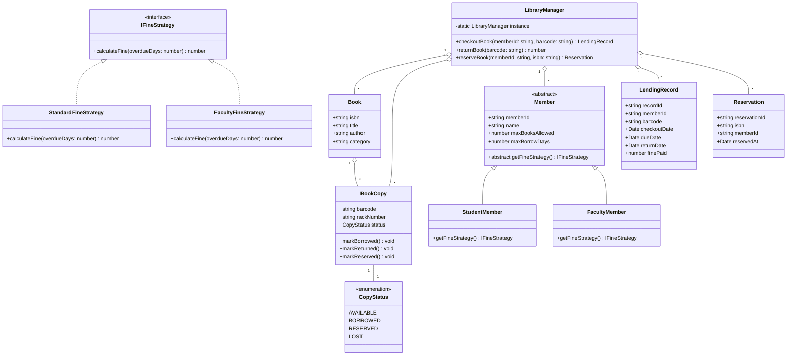
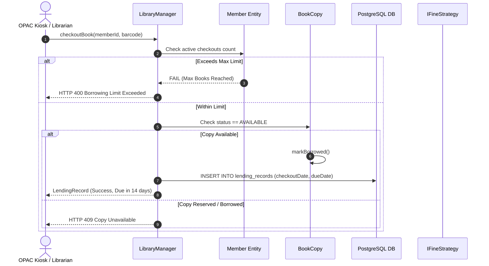
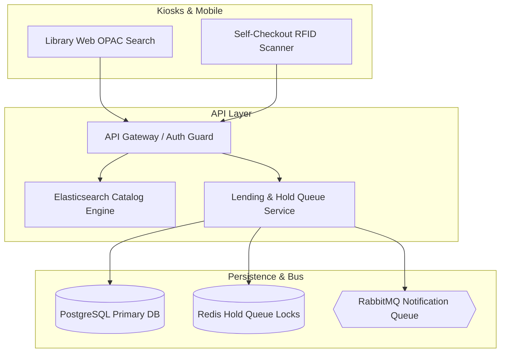

# 🛠️ Enterprise System Design Blueprint: Library Management System

> **Target Role:** Principal / Staff Architect / Senior LLD & HLD Engineers  
> **Product Perspective:** Designing a scalable university/public library management system handling multi-catalog book search, barcode physical copy tracking, borrowing limits, automated hold queues, and fine calculations.  
> **Navigation:** ⬅️ [Back to Category Index](./README.md) | 📅 [8-Week Roadmap](../../ROADMAP.md)

---

## 1. 🎯 Requirements & Product Scope

### 📋 Functional Requirements (FR)

1. **Catalog vs Copy Model:** Separate conceptual `Book` metadata (ISBN, Title, Authors, Subject) from physical `BookCopy` records (Barcode ID, Rack Location, Copy Status: *Available*, *Borrowed*, *Reserved*, *Lost*).
2. **Member Account Management:** Support distinct member types (*Student*, *Faculty*, *Regular User*) with enforced business limits (e.g., Student: max 5 books for 14 days; Faculty: max 10 books for 30 days).
3. **Checkout, Renewal & Return:** Process book checkouts, renewals (if no holds exist), and returns. Automatically calculate late return fines based on member-specific fine strategies.
4. **Reservation Hold Queue:** Allow members to place reservations on currently checked-out titles. Maintain a FIFO reservation queue; when a copy is returned, transition copy status to *Reserved* for the head member of the hold queue.
5. **Catalog Search & Discovery:** Fast multi-attribute catalog search by title, author, category, or ISBN.

### ⚡ Non-Functional Requirements (NFR)

1. **Sub-100ms Search Response:** Catalog search and barcode scanning checkouts respond in $P_{99} < 100\text{ms}$.
2. **Hold Queue Fairness & Concurrency:** Zero race conditions when multiple members attempt to claim a returned reserved copy simultaneously.
3. **High Availability:** $99.99\%$ read availability for catalog browsing across mobile apps and web OPAC kiosks.
4. **Data Integrity:** Strict foreign key and transaction controls ensuring copy status mirrors actual physical physical library inventory.

---

## 2. 🧮 Scale & Quantitative Estimates

```
Scale Assumptions:
- Total Library System Network: 50 Regional Campus Branches
- Total Catalog Items (ISBNs): 1,000,000 unique titles
- Total Physical Book Copies: 10,000,000 physical copies (Avg 10 copies/ISBN)
- Registered Members: 500,000 active members
- Daily Borrowing Transactions: 50,000 checkouts/returns per day

Throughput Calculations:
- Average Read QPS (Catalog Search): 200 QPS (Normal) -> 1,000 QPS Peak
- Average Write QPS (Checkout/Return): (100k transactions / 86400s) = ~1.2 QPS (Peak 50 QPS)

Storage Estimates (5 Years):
- Book ISBN Record: ~1 KB
- Physical Copy Record: ~200 bytes
- Daily Transaction History: 50,000 * 300 bytes = 15 MB / day
- 5-Year Database Storage: ~35 GB (Extremely lightweight, easily cached in Redis RAM)
```

---

## 3. 🛠️ Tech Stack & Architectural Justifications

| Component | Technology Choice | Architectural Rationale |
| :--- | :--- | :--- |
| **Backend Framework** | Node.js / TypeScript | Clean object-oriented domain abstraction for complex borrowing rules and state machines. |
| **Primary Relational DB** | PostgreSQL | Strict ACID guarantees for checkout transactions, reservation queues, and fine ledgers. |
| **Search Engine** | Elasticsearch | Inverted index search with fuzzy matching, prefix completion, and faceted filtering (Author, Genre). |
| **In-Memory Cache** | Redis | Caching popular catalog searches and holding distributed locks during copy reservation checkout. |
| **Notification Engine** | RabbitMQ / Kafka | Asynchronous queue dispatching SMS/Email alerts for overdue books and reserved item availability. |

---

## 4. 📐 Visual UML Diagrams

### 🏗️ Class Diagram (Low-Level Entities & Strategy/State Patterns)



### 🔄 Sequence Diagram: Book Checkout Flow with Limit & Fine Checks



---

## 5. 🧱 OOP & SOLID Principles Mapping

- **Single Responsibility Principle (SRP):**
  - `Book` manages catalog metadata.
  - `BookCopy` manages physical location and barcode copy state.
  - `IFineStrategy` handles monetary fine penalty calculations exclusively.
- **Open/Closed Principle (OCP):**
  - New membership tiers (e.g., *Senior Researcher*, *Guest*) implement `Member` subclassing without modifying checkout core code.
  - New fine policies (e.g., *Holiday Grace Period*, *Lost Book Flat Fee*) implement `IFineStrategy` seamlessly.
- **Liskov Substitution Principle (LSP):**
  - `StudentMember` and `FacultyMember` can be substituted wherever a base `Member` reference is expected.
- **Interface Segregation Principle (ISP):**
  - Self-service OPAC Kiosks interact with `ICatalogSearch` interfaces without possessing administrative member management privileges.
- **Dependency Inversion Principle (DIP):**
  - `LibraryManager` depends on abstract `IFineStrategy` interfaces rather than hardcoding static monetary rates inside borrowing handlers.

---

## 6. 🎨 Design Patterns Selection

| Pattern Name | Application in Library System | Architectural Benefit |
| :--- | :--- | :--- |
| **Strategy Pattern** | `IFineStrategy` | Member-specific overdue fine calculation algorithms (Student vs Faculty rates). |
| **State Pattern** | `CopyStatus` | Manages physical book availability transitions (`AVAILABLE`, `BORROWED`, `RESERVED`). |
| **Observer Pattern** | `HoldQueueNotifier` | Automatically alerts the next waiting member in line when a reserved title is returned. |
| **Factory Method Pattern** | `MemberFactory` | Instantiates member domain objects with default borrowing limits. |

---

## 7. 💻 Production Code Blueprint (TypeScript)

```typescript
// ============================================================================
// DOMAIN ENUMS & INTERFACES
// ============================================================================

export enum CopyStatus {
  AVAILABLE = 'AVAILABLE',
  BORROWED = 'BORROWED',
  RESERVED = 'RESERVED',
  LOST = 'LOST',
}

export interface IFineStrategy {
  calculateFine(overdueDays: number): number;
}

export class StandardFineStrategy implements IFineStrategy {
  public calculateFine(overdueDays: number): number {
    if (overdueDays <= 0) return 0;
    return overdueDays * 0.5; // $0.50 per day
  }
}

export class FacultyFineStrategy implements IFineStrategy {
  public calculateFine(overdueDays: number): number {
    if (overdueDays <= 3) return 0; // 3 Days Grace Period for Faculty
    return (overdueDays - 3) * 0.25; // $0.25 per day
  }
}

// ============================================================================
// MEMBER DOMAIN ENTITIES
// ============================================================================

export abstract class Member {
  public activeCheckoutBarcodes: Set<string> = new Set();

  constructor(
    public readonly memberId: string,
    public readonly name: string,
    public readonly maxBooksAllowed: number,
    public readonly maxBorrowDays: number
  ) {}

  public abstract getFineStrategy(): IFineStrategy;

  public canBorrow(): boolean {
    return this.activeCheckoutBarcodes.size < this.maxBooksAllowed;
  }
}

export class StudentMember extends Member {
  constructor(memberId: string, name: string) {
    super(memberId, name, 5, 14); // 5 Books, 14 Days
  }

  public getFineStrategy(): IFineStrategy {
    return new StandardFineStrategy();
  }
}

export class FacultyMember extends Member {
  constructor(memberId: string, name: string) {
    super(memberId, name, 10, 30); // 10 Books, 30 Days
  }

  public getFineStrategy(): IFineStrategy {
    return new FacultyFineStrategy();
  }
}

// ============================================================================
// BOOK & PHYSICAL COPY ENTITIES
// ============================================================================

export class Book {
  constructor(
    public readonly isbn: string,
    public readonly title: string,
    public readonly author: string
  ) {}
}

export class BookCopy {
  public status: CopyStatus = CopyStatus.AVAILABLE;

  constructor(
    public readonly barcode: string,
    public readonly isbn: string,
    public readonly rackNumber: string
  ) {}

  public markBorrowed(): void {
    if (this.status !== CopyStatus.AVAILABLE) {
      throw new Error(`Cannot borrow copy ${this.barcode}: Status is ${this.status}`);
    }
    this.status = CopyStatus.BORROWED;
  }

  public markReturned(): void {
    this.status = CopyStatus.AVAILABLE;
  }

  public markReserved(): void {
    this.status = CopyStatus.RESERVED;
  }
}

export class LendingRecord {
  public returnDate: Date | null = null;
  public fineAmount: number = 0;

  constructor(
    public readonly recordId: string,
    public readonly memberId: string,
    public readonly barcode: string,
    public readonly checkoutDate: Date,
    public readonly dueDate: Date
  ) {}

  public completeReturn(returnDate: Date, fine: number): void {
    this.returnDate = returnDate;
    this.fineAmount = fine;
  }
}

// ============================================================================
// LIBRARY SYSTEM CONTROLLER
// ============================================================================

export class LibraryManager {
  private static instance: LibraryManager;
  private books: Map<string, Book> = new Map(); // ISBN -> Book
  private copies: Map<string, BookCopy> = new Map(); // Barcode -> BookCopy
  private members: Map<string, Member> = new Map(); // MemberId -> Member
  private lendingRecords: Map<string, LendingRecord> = new Map();
  private reservationQueues: Map<string, string[]> = new Map(); // ISBN -> MemberId[]

  private constructor() {}

  public static getInstance(): LibraryManager {
    if (!LibraryManager.instance) {
      LibraryManager.instance = new LibraryManager();
    }
    return LibraryManager.instance;
  }

  public registerBook(book: Book): void {
    this.books.set(book.isbn, book);
  }

  public addCopy(copy: BookCopy): void {
    this.copies.set(copy.barcode, copy);
  }

  public registerMember(member: Member): void {
    this.members.set(member.memberId, member);
  }

  public checkoutBook(memberId: string, barcode: string): LendingRecord {
    const member = this.members.get(memberId);
    const copy = this.copies.get(barcode);

    if (!member) throw new Error(`Member not found: ${memberId}`);
    if (!copy) throw new Error(`Book Copy not found: ${barcode}`);

    if (!member.canBorrow()) {
      throw new Error(`Borrowing Limit Reached for member ${member.name} (${member.maxBooksAllowed} max)`);
    }

    copy.markBorrowed();
    member.activeCheckoutBarcodes.add(barcode);

    const now = new Date();
    const dueDate = new Date(now.getTime() + member.maxBorrowDays * 24 * 60 * 60 * 1000);
    const recordId = `LEND-${Date.now()}-${Math.floor(Math.random() * 1000)}`;

    const record = new LendingRecord(recordId, memberId, barcode, now, dueDate);
    this.lendingRecords.set(barcode, record);

    console.log(`[CHECKOUT SUCCESS] ${member.name} checked out '${barcode}'. Due on ${dueDate.toISOString().split('T')[0]}`);
    return record;
  }

  public returnBook(barcode: string, returnDate: Date = new Date()): number {
    const copy = this.copies.get(barcode);
    const record = this.lendingRecords.get(barcode);

    if (!copy || !record) throw new Error(`No active lending record found for barcode ${barcode}`);

    const member = this.members.get(record.memberId)!;
    copy.markReturned();
    member.activeCheckoutBarcodes.delete(barcode);

    // Calculate Overdue Fines
    const overdueMs = returnDate.getTime() - record.dueDate.getTime();
    const overdueDays = Math.max(0, Math.ceil(overdueMs / (1000 * 60 * 60 * 24)));
    const fineStrategy = member.getFineStrategy();
    const fine = fineStrategy.calculateFine(overdueDays);

    record.completeReturn(returnDate, fine);

    console.log(`[RETURN SUCCESS] Barcode ${barcode} returned. Overdue: ${overdueDays} days. Fine Assessed: $${fine.toFixed(2)}`);

    // Check Reservation Queue for this ISBN
    const queue = this.reservationQueues.get(copy.isbn) || [];
    if (queue.length > 0) {
      const nextMemberId = queue.shift()!;
      copy.markReserved();
      console.log(`[HOLD NOTIFICATION] Book ISBN ${copy.isbn} marked RESERVED for next member in queue: ${nextMemberId}`);
    }

    return fine;
  }

  public reserveBook(memberId: string, isbn: string): void {
    const queue = this.reservationQueues.get(isbn) || [];
    queue.push(memberId);
    this.reservationQueues.set(isbn, queue);
    console.log(`[RESERVATION QUEUED] Member ${memberId} added to hold queue for ISBN ${isbn} (Position: ${queue.length})`);
  }
}

// ============================================================================
// VERIFICATION TEST SUITE
// ============================================================================

function runLibraryTest() {
  console.log('--- INITIALIZING LIBRARY MANAGEMENT SYSTEM ---');
  const manager = LibraryManager.getInstance();

  const book = new Book('ISBN-978-0132350884', 'Clean Code', 'Robert C. Martin');
  const copy1 = new BookCopy('BARCODE-CC-01', book.isbn, 'RACK-A1');

  manager.registerBook(book);
  manager.addCopy(copy1);

  const student = new StudentMember('STU-101', 'Alice Johnson');
  const faculty = new FacultyMember('FAC-201', 'Dr. Bob Smith');

  manager.registerMember(student);
  manager.registerMember(faculty);

  console.log('\n--- EXECUTING CHECKOUT ---');
  manager.checkoutBook(student.memberId, copy1.barcode);

  console.log('\n--- QUEUING RESERVATION FOR BORROWED TITLE ---');
  manager.reserveBook(faculty.memberId, book.isbn);

  console.log('\n--- PROCESSING OVERDUE RETURN ---');
  const lateReturnDate = new Date(Date.now() + 20 * 24 * 60 * 60 * 1000); // 20 days later (6 days overdue)
  manager.returnBook(copy1.barcode, lateReturnDate);
}

runLibraryTest();
```

---

## 8. 🌐 High-Level Design (HLD) & Scale Bottlenecks

### 🏗️ Enterprise Multi-Branch Architecture



### ⚡ Critical Scale Bottlenecks & Architectural Fixes

1. **Race Conditions on Hold Queue Fulfillment:**
   - *Problem:* When a popular book is returned, two librarians scan it at different desks simultaneously.
   - *Solution:* Wrap return processing inside a Redis distributed lock `SET lock:isbn:123 NX EX 5` or database row-level locking (`SELECT * FROM book_copies WHERE barcode = $1 FOR UPDATE`).
2. **Catalog Full-Text Search Latency:**
   - *Problem:* Searching 1M titles with fuzzy text matching causes high CPU load in SQL databases.
   - *Solution:* Offload search to Elasticsearch clusters utilizing ngram tokenizers for real-time keystroke suggestions under 20ms.

---

## ❓ 9. Collapsed Senior/Staff Level Grill Q&A

<details>
<summary>❓ How do you handle lost books and unreturned items after 60 days?</summary>

**Answer:**
A scheduled cron worker queries `lending_records` where `return_date IS NULL AND current_date > due_date + INTERVAL '60 days'`. The copy status transitions to `LOST`, the member's account is suspended (`can_borrow = FALSE`), and a flat replacement fee is charged to their account ledger.

</details>

<details>
<summary>❓ How do you ensure hold queue fairness when a member with an active reservation cancels their hold?</summary>

**Answer:**
Hold queues are stored as Redis `LIST` structures or linked tables ordered by timestamp. If member at rank #1 cancels, we atomically popped the head of the list (`LPOP queue:isbn`) and re-assign the copy to rank #2, publishing a notification event immediately.

</details>
