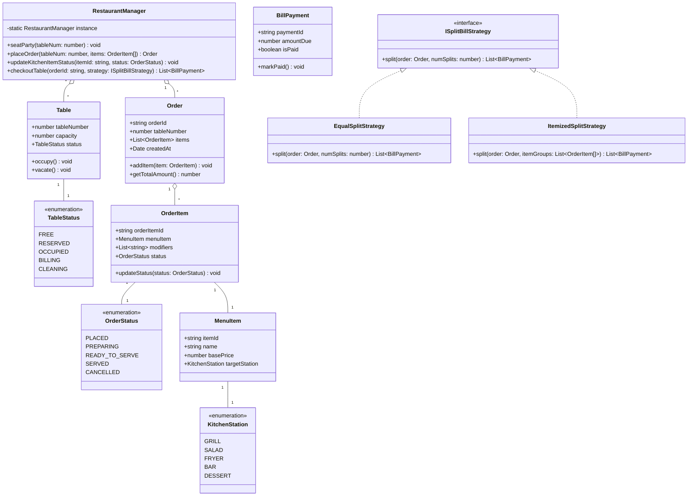
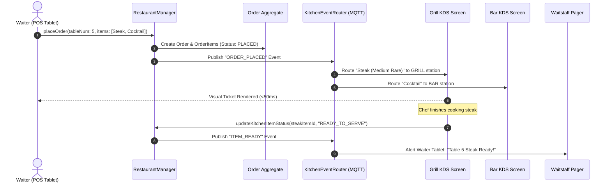

# 🛠️ Enterprise System Design Blueprint: Restaurant Management System & Kitchen Display System (KDS)

> **Target Role:** Principal / Staff Architect / Senior LLD & HLD Engineers  
> **Product Perspective:** Building an enterprise-grade digital restaurant management system, real-time Kitchen Display System (KDS), split-bill payment engine, and table allocation machine.  
> **Navigation:** ⬅️ [Back to Category Index](./README.md) | 📅 [8-Week Roadmap](../../ROADMAP.md)

---

## 1. 🎯 Requirements & Product Scope

### 📋 Functional Requirements (FR)

1. **Table Layout & Reservation Management:** Manage multi-zone floor layouts (Indoor, Patio, VIP Booths). Track dynamic table states: `FREE`, `RESERVED`, `OCCUPIED`, `BILLING`, `CLEANING`. Automatically allocate tables based on party size.
2. **Order Placement & Kitchen Routing (KDS):** Allow waitstaff to place orders containing items with custom modifiers (e.g., *Medium Rare*, *No Onion*, *Extra Cheese*). Route ticket items dynamically to designated kitchen prep stations (*Grill*, *Salad/Cold*, *Fryer*, *Bar*).
3. **Real-Time Order Lifecycle State Machine:** Track order item states: `PLACED` $\rightarrow$ `PREPARING` $\rightarrow$ `READY_TO_SERVE` $\rightarrow$ `SERVED` $\rightarrow$ `CANCELLED`. Notify waitstaff via handheld pagers when order items are marked `READY_TO_SERVE`.
4. **Flexible Bill Splitting Engine:** Support complex split-billing strategies: *Equal N-Way Split*, *Itemized Split*, *Seat-based Split*, or *Custom Amount Split*, applying configurable tax rates and tip percentages.
5. **Offline POS Resilience:** Maintain full POS ordering capability locally when internet connectivity drops, syncing completed transactions upon reconnection.

### ⚡ Non-Functional Requirements (NFR)

1. **Sub-100ms Kitchen Display Latency:** Orders placed by waitstaff appear on Kitchen Display System (KDS) monitors in $P_{99} < 100\text{ms}$.
2. **Strict Double-Booking Prevention:** Zero race conditions when two hostesses attempt to seat different parties at the same table simultaneously.
3. **High Availability & Fault Tolerance:** $99.999\%$ uptime for POS ordering terminals; offline local SQLite sync ensuring zero dinner-rush disruptions.
4. **Transactional Billing Integrity:** Payment transactions must strictly satisfy ACID guarantees; double splits or uncollected balances strictly forbidden.

---

## 2. 🧮 Scale & Quantitative Estimates

```
Enterprise Chain Scale Assumptions:
- Restaurant Chain Locations: 500 Franchise Outlets
- Tables per Outlet: 50 Tables (Total 25,000 active tables)
- Daily Customers Served: 250,000 diners/day
- Orders per Outlet per Hour (Friday Dinner Peak): 150 orders/hour

Throughput Calculations:
- Total Chain KDS Message Events: (250,000 orders * 8 status updates/order) = 2,000,000 events/day
- Peak KDS Event QPS (Entire Chain): 500 events/sec (Normal) -> 2,500 events/sec Peak
- Local Outlet WebSocket Connections: 20 active POS handhelds + 5 KDS screens per restaurant

Storage Estimates (5 Years):
- Average Order Payload: ~3 KB (Items, Modifiers, Station Routing, Payments)
- Daily Chain Order Storage: 250,000 * 3 KB = 750 MB / day
- Annual Database Storage: 750 MB * 365 = ~273 GB / year (~1.36 TB over 5 Years)
```

---

## 3. 🛠️ Tech Stack & Architectural Justifications

| Component | Technology Choice | Architectural Rationale |
| :--- | :--- | :--- |
| **Edge Hardware Controller** | Local Outlet Edge Server (Node.js/Go) | On-premise server guaranteeing sub-10ms KDS rendering and zero internet dependency. |
| **Real-time Protocol** | WebSockets (Socket.io) / gRPC Streams | Instant bi-directional streaming for order tickets between Waiter Tablets and KDS displays. |
| **Primary Relational DB** | PostgreSQL | Complex relational joins for floor layouts, menu catalog modifiers, and split payments. |
| **Local Offline Cache** | SQLite + IndexedDB | Embedded store enabling offline POS operations during network outages. |
| **Event Broker** | Redis Pub/Sub / MQTT | Lightweight low-latency messaging routing ticket items to specific kitchen station monitors. |

---

## 4. 📐 Visual UML Diagrams

### 🏗️ Class Diagram (Low-Level Entities & State/Strategy Patterns)



### 🔄 Sequence Diagram: Order Placement, Kitchen Routing & KDS Update



---

## 5. 🧱 OOP & SOLID Principles Mapping

- **Single Responsibility Principle (SRP):**
  - `Table` handles physical table state transitions (`FREE`, `OCCUPIED`, `CLEANING`).
  - `OrderItem` tracks item preparation status.
  - `ISplitBillStrategy` handles payment splitting arithmetic exclusively.
- **Open/Closed Principle (OCP):**
  - New kitchen stations (e.g., *Sushi Bar*, *Pizza Oven*) add values to `KitchenStation` without altering core ordering workflows.
  - New billing split methods (e.g., *Seat-based Split*, *Custom Dollar Amount Split*) implement `ISplitBillStrategy` seamlessly.
- **Liskov Substitution Principle (LSP):**
  - Concrete split bill strategies (`EqualSplitStrategy`, `ItemizedSplitStrategy`) can be used interchangeably by the payment processor.
- **Interface Segregation Principle (ISP):**
  - Kitchen staff screens consume an `IKitchenDisplayView` exposing status toggles without giving access to bill processing APIs.
- **Dependency Inversion Principle (DIP):**
  - `RestaurantManager` depends on abstract `IKitchenNotifier` interfaces rather than hardcoding specific hardware screen drivers.

---

## 6. 🎨 Design Patterns Selection

| Pattern Name | Application in Restaurant Management System | Architectural Benefit |
| :--- | :--- | :--- |
| **State Pattern** | `TableStatus`, `OrderStatus` | Prevents illegal state transitions (e.g., seating a party at an `OCCUPIED` table). |
| **Strategy Pattern** | `ISplitBillStrategy` | Flexible payment splitting algorithms (Equal division vs itemized grouping). |
| **Observer Pattern** | `KitchenEventObserver` | Publishes live ticket notifications to KDS screens and waiter handhelds on status change. |
| **Command Pattern** | `OrderModifierCommand` | Encapsulates order changes (cancel dish, add extra sauce) with audit trails for manager approval. |

---

## 7. 💻 Production Code Blueprint (TypeScript)

```typescript
// ============================================================================
// DOMAIN ENUMS & INTERFACES
// ============================================================================

export enum TableStatus {
  FREE = 'FREE',
  RESERVED = 'RESERVED',
  OCCUPIED = 'OCCUPIED',
  BILLING = 'BILLING',
  CLEANING = 'CLEANING',
}

export enum OrderStatus {
  PLACED = 'PLACED',
  PREPARING = 'PREPARING',
  READY_TO_SERVE = 'READY_TO_SERVE',
  SERVED = 'SERVED',
  CANCELLED = 'CANCELLED',
}

export enum KitchenStation {
  GRILL = 'GRILL',
  SALAD = 'SALAD',
  FRYER = 'FRYER',
  BAR = 'BAR',
}

export class MenuItem {
  constructor(
    public readonly itemId: string,
    public readonly name: string,
    public readonly price: number,
    public readonly targetStation: KitchenStation
  ) {}
}

// ============================================================================
// DOMAIN ENTITIES & STATE MACHINES
// ============================================================================

export class Table {
  public status: TableStatus = TableStatus.FREE;

  constructor(
    public readonly tableNumber: number,
    public readonly capacity: number
  ) {}

  public occupy(): void {
    if (this.status !== TableStatus.FREE && this.status !== TableStatus.RESERVED) {
      throw new Error(`Cannot occupy Table ${this.tableNumber}: Status is ${this.status}`);
    }
    this.status = TableStatus.OCCUPIED;
  }

  public markBilling(): void {
    this.status = TableStatus.BILLING;
  }

  public vacate(): void {
    this.status = TableStatus.CLEANING;
  }

  public markCleaned(): void {
    this.status = TableStatus.FREE;
  }
}

export class OrderItem {
  public status: OrderStatus = OrderStatus.PLACED;

  constructor(
    public readonly orderItemId: string,
    public readonly menuItem: MenuItem,
    public readonly modifiers: string[] = []
  ) {}

  public updateStatus(newStatus: OrderStatus): void {
    this.status = newStatus;
  }
}

export class Order {
  public items: OrderItem[] = [];

  constructor(
    public readonly orderId: string,
    public readonly tableNumber: number,
    public readonly createdAt: Date = new Date()
  ) {}

  public addItem(item: OrderItem): void {
    this.items.push(item);
  }

  public getTotalAmount(): number {
    return this.items.reduce((sum, item) => sum + item.menuItem.price, 0);
  }
}

// ============================================================================
// STRATEGY PATTERN (BILL SPLITTING)
// ============================================================================

export class BillPayment {
  public isPaid: boolean = false;

  constructor(
    public readonly paymentId: string,
    public readonly amountDue: number
  ) {}

  public markPaid(): void {
    this.isPaid = true;
  }
}

export interface ISplitBillStrategy {
  split(order: Order, param?: any): BillPayment[];
}

export class EqualSplitStrategy implements ISplitBillStrategy {
  public split(order: Order, numSplits: number): BillPayment[] {
    const total = order.getTotalAmount();
    const splitAmount = parseFloat((total / numSplits).toFixed(2));
    const payments: BillPayment[] = [];

    for (let i = 0; i < numSplits; i++) {
      payments.push(new BillPayment(`PAY-${order.orderId}-SPLIT-${i + 1}`, splitAmount));
    }
    return payments;
  }
}

export class ItemizedSplitStrategy implements ISplitBillStrategy {
  public split(order: Order, itemGroups: OrderItem[][]): BillPayment[] {
    return itemGroups.map((group, idx) => {
      const groupTotal = group.reduce((sum, item) => sum + item.menuItem.price, 0);
      return new BillPayment(`PAY-${order.orderId}-GROUP-${idx + 1}`, groupTotal);
    });
  }
}

// ============================================================================
// RESTAURANT MANAGEMENT SYSTEM CONTROLLER
// ============================================================================

export class RestaurantManager {
  private static instance: RestaurantManager;
  private tables: Map<number, Table> = new Map();
  private activeOrders: Map<string, Order> = new Map();

  private constructor() {}

  public static getInstance(): RestaurantManager {
    if (!RestaurantManager.instance) {
      RestaurantManager.instance = new RestaurantManager();
    }
    return RestaurantManager.instance;
  }

  public addTable(table: Table): void {
    this.tables.set(table.tableNumber, table);
  }

  public seatParty(tableNumber: number): void {
    const table = this.tables.get(tableNumber);
    if (!table) throw new Error(`Table ${tableNumber} does not exist`);
    table.occupy();
    console.log(`[TABLE SEATED] Table ${tableNumber} is now OCCUPIED.`);
  }

  public placeOrder(tableNumber: number, items: OrderItem[]): Order {
    const table = this.tables.get(tableNumber);
    if (!table || table.status !== TableStatus.OCCUPIED) {
      throw new Error(`Cannot place order: Table ${tableNumber} is not occupied.`);
    }

    const orderId = `ORD-${Date.now()}-${Math.floor(Math.random() * 1000)}`;
    const order = new Order(orderId, tableNumber);

    for (const item of items) {
      order.addItem(item);
      console.log(`[KDS ROUTER] Routed '${item.menuItem.name}' to ${item.menuItem.targetStation} station (Status: PLACED)`);
    }

    this.activeOrders.set(orderId, order);
    return order;
  }

  public updateKitchenItemStatus(orderId: string, orderItemId: string, newStatus: OrderStatus): void {
    const order = this.activeOrders.get(orderId);
    if (!order) throw new Error(`Order ${orderId} not found`);

    const item = order.items.find((i) => i.orderItemId === orderItemId);
    if (!item) throw new Error(`OrderItem ${orderItemId} not found`);

    item.updateStatus(newStatus);
    console.log(`[KDS UPDATE] Item '${item.menuItem.name}' updated to ${newStatus}`);

    if (newStatus === OrderStatus.READY_TO_SERVE) {
      console.log(`[WAITER ALERT] Paging waiter for Table ${order.tableNumber}: ${item.menuItem.name} is READY!`);
    }
  }

  public checkoutTable(orderId: string, splitStrategy: ISplitBillStrategy, param?: any): BillPayment[] {
    const order = this.activeOrders.get(orderId);
    if (!order) throw new Error(`Order ${orderId} not found`);

    const table = this.tables.get(order.tableNumber)!;
    table.markBilling();

    const payments = splitStrategy.split(order, param);
    console.log(`[BILLING] Order ${orderId} total $${order.getTotalAmount()} split into ${payments.length} payment(s):`);
    payments.forEach((p) => console.log(`  - ${p.paymentId}: $${p.amountDue}`));

    table.vacate();
    console.log(`[TABLE VACATED] Table ${table.tableNumber} status is now CLEANING.`);
    return payments;
  }
}

// ============================================================================
// VERIFICATION TEST SUITE
// ============================================================================

function runRestaurantTest() {
  console.log('--- INITIALIZING RESTAURANT MANAGEMENT SYSTEM ---');
  const manager = RestaurantManager.getInstance();

  const table5 = new Table(5, 4);
  manager.addTable(table5);

  const steak = new MenuItem('M-1', 'Ribeye Steak', 45.0, KitchenStation.GRILL);
  const wine = new MenuItem('M-2', 'Cabernet Sauvignon', 15.0, KitchenStation.BAR);

  console.log('\n--- SEATING PARTY & PLACING ORDER ---');
  manager.seatParty(5);

  const orderItem1 = new OrderItem('OI-101', steak, ['Medium Rare', 'Peppercorn Sauce']);
  const orderItem2 = new OrderItem('OI-102', wine);

  const order = manager.placeOrder(5, [orderItem1, orderItem2]);

  console.log('\n--- KITCHEN PROGRESSES PREPARATION ---');
  manager.updateKitchenItemStatus(order.orderId, orderItem1.orderItemId, OrderStatus.PREPARING);
  manager.updateKitchenItemStatus(order.orderId, orderItem1.orderItemId, OrderStatus.READY_TO_SERVE);

  console.log('\n--- CHECKOUT WITH EQUAL 2-WAY SPLIT ---');
  const splitStrategy = new EqualSplitStrategy();
  manager.checkoutTable(order.orderId, splitStrategy, 2);
}

runRestaurantTest();
```

---

## 8. 🌐 High-Level Design (HLD) & Scale Bottlenecks

### 🏗️ Local Edge & Cloud Hybrid Architecture

```mermaid
graph TB
    subgraph On-Premise Restaurant Outlet (Local LAN)
        POS1[Waiter Tablet 1]
        POS2[Waiter Tablet 2]
        GrillScreen[Kitchen Display System - Grill]
        EdgeServer[On-Premises Edge Gateway + Local DB]
    end

    subgraph Corporate Cloud Backend
        CloudGW[Cloud API Gateway]
        CentralDB[(PostgreSQL Primary HQ DB)]
        Analytics[(Snowflake Business Intelligence)]
    end

    POS1 -->|WebSocket| EdgeServer
    POS2 -->|WebSocket| EdgeServer
    EdgeServer -->|Real-time LAN Push| GrillScreen
    EdgeServer -->|Async Batch Sync| CloudGW
    CloudGW --> CentralDB
    CloudGW --> Analytics
```

### ⚡ Critical Scale Bottlenecks & Architectural Fixes

1. **Internet Connection Outage during Dinner Rush:**
   - *Problem:* Cloud connectivity drops; waiters cannot place orders or collect bills.
   - *Solution:* Deploy **Local Edge Gateway (On-Premises Server)**. POS tablets communicate with the edge server over local Wi-Fi LAN using SQLite / IndexedDB. Orders continue seamlessly. When internet restores, Edge Server reconciles transaction logs to the cloud DB asynchronously.
2. **KDS Broadcast Lag on Busy Friday Nights:**
   - *Problem:* 50 orders submitted per minute cause lag on KDS screens due to unoptimized WebSocket fan-out.
   - *Solution:* Utilize lightweight MQTT pub/sub topics partitioned by station (`outlet_12/kitchen/grill`, `outlet_12/kitchen/bar`). KDS screens subscribe only to relevant topics, reducing network payload by 80%.

---

## ❓ 9. Collapsed Senior/Staff Level Grill Q&A

<details>
<summary>❓ How do you prevent double-seating a table when two hostesses select Table 12 at the exact same instant?</summary>

**Answer:**
Table state updates use **Optimistic Locking with Versioning** or an atomic compare-and-set in local storage:
`UPDATE tables SET status = 'OCCUPIED', version = version + 1 WHERE table_number = 12 AND status = 'FREE' AND version = 5;`. If row count updated is `0`, the second hostess UI receives a collision notice and refreshes the floor plan display.

</details>

<details>
<summary>❓ How do you handle itemized bill splits when two guests order a shared item (e.g. a $30 appetizer shared between 3 people)?</summary>

**Answer:**
We support **Fractional Line Item Ownership**. The `OrderItem` contains a `splits: Map<GuestID, Percentage>` attribute. When calculating individual bills, the payment strategy multiplies item price by fractional share ($\text{Price} \times 0.33$), allocating remaining penny rounding errors to the primary host ticket.

</details>
