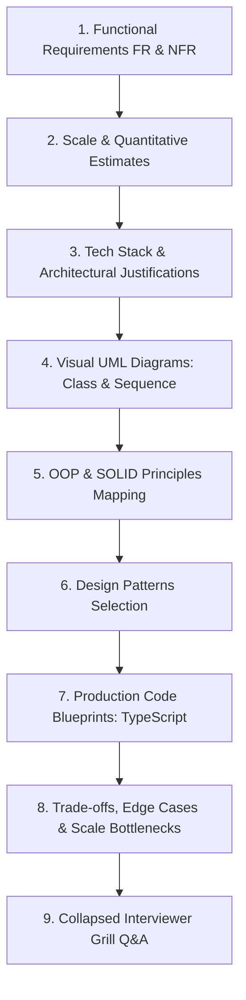

# 🏢 Master System Design Problem Bank — Management Systems

> **Target Role:** Principal / Staff Architect / Senior LLD & HLD Engineers  
> **Framework:** Standardized 9-Step Breakdown (Functional Requirements, Scale & Estimates, Tech Stack, Visual UML Diagrams, OOP & SOLID Mapping, Design Patterns, Code Blueprints, Scale Bottlenecks, and Collapsed Grill Q&A).  
> **Navigation:** ⬅️ [Back to Master Problem Bank](../README.md) | 📅 [8-Week Roadmap](../../ROADMAP.md)

---

## 🧭 Category Overview: Management Systems (5 Problems)

| # | Problem Blueprint | Level | Key System Challenges & Architecture Focus | Master Guide Link |
|:---:|:---|:---:|:---|:---:|
| 1 | 📖 **Design Parking Lot** | `Easy` | Multi-level spot allocation, Strategy-driven dynamic pricing, Barcode/RFID tickets, Barrier gate hardware integration | [01-Design-Parking-Lot.md](./01-Design-Parking-Lot.md) |
| 2 | 📖 **Design Task Management System** | `Easy` | Task state machine lifecycle, Undo/Redo command history, Dependency cycle detection, Event-driven audit logging | [02-Design-Task-Management-System.md](./02-Design-Task-Management-System.md) |
| 3 | 📖 **Design Inventory Management System** | `Medium` | Multi-warehouse stock reservation, Flash sale TTL cart holds, Strict oversell prevention, Low-stock auto-reordering | [03-Design-Inventory-Management-System.md](./03-Design-Inventory-Management-System.md) |
| 4 | 📖 **Design Library Management System** | `Medium` | Catalog ISBN vs Physical Copy model, FIFO reservation hold queue, Fine calculation strategies, Multi-attribute search | [04-Design-Library-Management-System.md](./04-Design-Library-Management-System.md) |
| 5 | 📖 **Design Restaurant Management System** | `Hard` | Multi-zone table allocation, Real-time KDS kitchen routing, Split-bill payment engine, Offline POS LAN resilience | [05-Design-Restaurant-Management-System.md](./05-Design-Restaurant-Management-System.md) |

---

## 📐 Standardized 9-Step Problem Breakdown Framework

Every problem in this module strictly follows the enterprise 9-step system design workflow:

