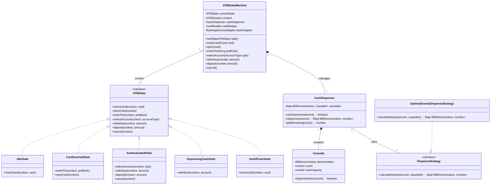
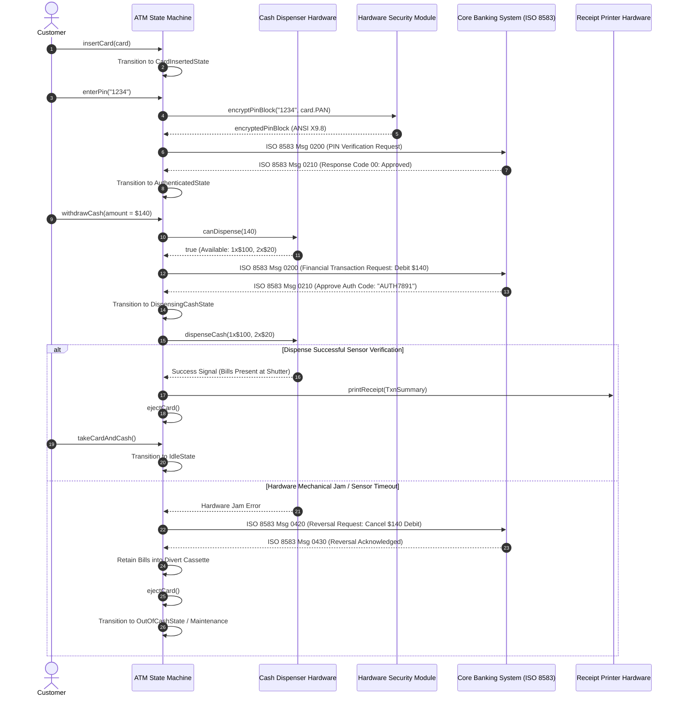
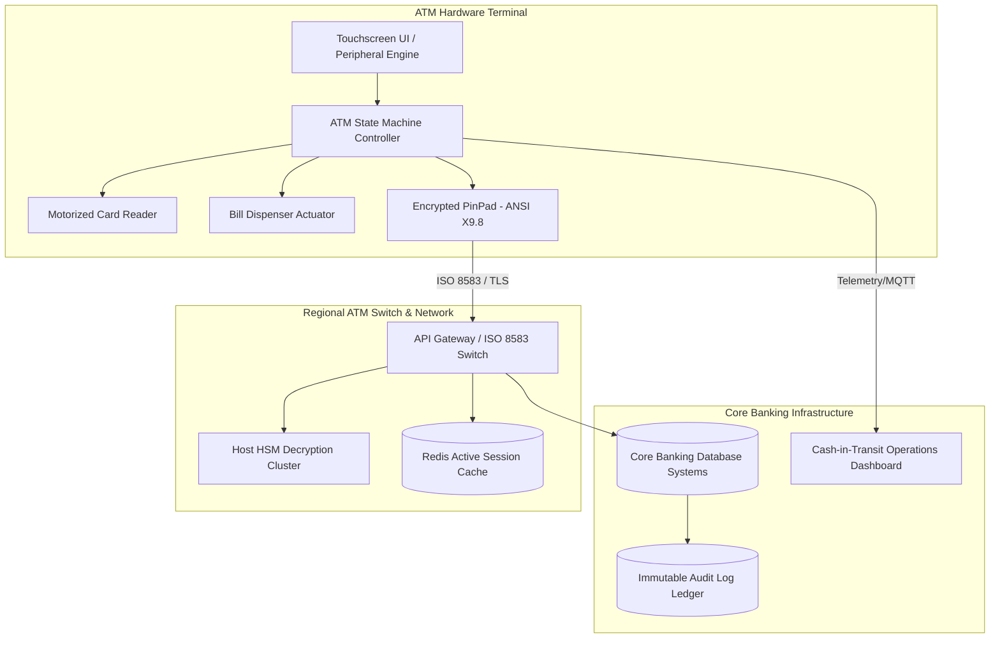

# 🛠️ Enterprise System Design Blueprint: ATM (Automated Teller Machine) State Machine

> **Target Role:** Principal / Staff Architect / Senior LLD & HLD Engineers
> **Product Perspective:** Building an enterprise-grade, fault-tolerant Automated Teller Machine (ATM) software system supporting debit card transactions, PIN security, cash dispensing algorithms, and core banking network synchronization.
> **Navigation:** ⬅️ [Back to Category Index](./README.md) | 📅 [Problem Bank Index](../README.md)

---

## 1. 🎯 Requirements & Product Scope

### 📋 Functional Requirements (FR)

1. **Card Processing & Authentication:**
   - Authenticate customer identity via chip/magnetic stripe card reading and 4-6 digit PIN verification.
   - Enforce account lockout after 3 consecutive invalid PIN attempts, returning or retaining the card based on bank security policy.
2. **Transaction Operations:**
   - Support Cash Withdrawal, Balance Inquiry, Cash Deposit, and Funds Transfer.
   - Select account type (Checking, Savings).
3. **Cash Dispensation & Inventory Management:**
   - Dispense requested cash amount using optimal bill denomination breakdown ($100, $50, $20, $10).
   - Reject withdrawal requests if ATM cash inventory is insufficient or cannot satisfy exact bill denominations.
   - Print or offer digital receipt upon transaction completion.
4. **State Transitions & Hardware Lifecycle:**
   - Maintain strict, immutable state transitions (`Idle`, `CardInserted`, `PinVerified`, `OptionSelected`, `DispensingCash`, `TransactionCompleted`, `OutOfCash`, `Maintenance`).
   - Automatically eject card and reset to `Idle` on transaction cancellation or session timeout (30 seconds of user inactivity).

### ⚡ Non-Functional Requirements (NFR)

1. **Safety & Atomicity:** 
   - $100\%$ transaction atomicity (ACID). If cash dispensing hardware jams or fails midway, debit operation must be rolled back immediately via Core Banking ISO 8583 reverse transaction protocol.
2. **Security & Compliance:**
   - End-to-end PCI-DSS and HSM (Hardware Security Module) encryption for PIN blocks (ANSI X9.8 format). PIN must never exist in plaintext in application memory.
3. **Availability & Resilience:**
   - $99.999\%$ system uptime ($< 5.26$ minutes downtime/year). Supports offline transaction queueing for low-risk operations during bank network degradation.
4. **Latency:**
   - Local hardware response time (card read, keypress feedback) $< 50\text{ms}$; remote Core Banking authorization $P_{99} < 1.5\text{s}$.

---

## 2. 🧮 Scale & Quantitative Estimates

```
ATM Fleet Size: 10,000 active physical terminals across nationwide network
Daily Active Users per ATM: 200 transactions/day
Total Network Daily Transactions: 10,000 * 200 = 2,000,000 transactions/day

Peak Operations Calculator:
- Operating Window: 24 Hours (86,400 seconds)
- Average Network QPS: 2,000,000 / 86,400 ≈ 23.15 QPS
- Peak Multiplier: 5x during paydays/holidays -> Peak QPS = ~115 QPS Core Banking requests

Hardware Capacity & Cash Dispenser Specs:
- Cassette Capacity: 4 Cassettes per ATM (e.g., 2000 notes per cassette = 8,000 bills max capacity)
- Max Notes Per Dispense Cycle: 40 bills max per transaction physically (mechanical shutter constraint)
- Average Withdrawal Amount: $140
- Daily Cash Requirement per ATM: 200 transactions * $140 = $28,000/day
- Replenishment Threshold: Trigger alert to Cash-in-Transit (CIT) service when total cash < $5,000 or any bill cassette reaches < 10% capacity.
```

---

## 3. 🛠️ Tech Stack & Architectural Justifications

| Component | Technology Choice | Architectural Rationale |
| :--- | :--- | :--- |
| **Runtime Environment** | Node.js / TypeScript (Electron / Embedded Linux runtime) | Asynchronous event-driven architecture handles hardware peripheral I/O (card reader, PIN pad, cash dispenser) without blocking the UI thread. |
| **State Machine Engine** | Finite State Machine (FSM) via State Pattern | Prevents invalid operational transitions (e.g. dispensing cash before PIN verification or card insertion). Ensures hardware safety. |
| **Banking Protocol** | ISO 8583 / AS 2805 over TLS | Standard financial transaction messaging protocol for communication between ATM Switch / Core Banking System (CBS) and Hardware Security Module (HSM). |
| **Local Audit Database** | Embedded SQLite / LevelDB with AES-256 | Stores encrypted local transaction logs, journal records, and hardware fault logs for physical auditability and offline reconciliation. |
| **Hardware Interfacing** | XFS (Extensions for Financial Services) / J/XFS API | Standardized middleware layer enabling C++/TypeScript integration with hardware sensors, card motorized readers, and bill dispensers. |
| **Telemetry & Alerts** | MQTT / gRPC | Lightweight pub/sub protocol transmitting real-time cash levels, paper status, and tamper sensor alerts to the central ATM Operations Center. |

---

## 4. 📐 Visual UML Diagrams

### 🏗️ Class Diagram (Domain Model & State Machine)



### 🔄 Sequence Diagram: Cash Withdrawal Lifecycle



---

## 5. 🧱 OOP & SOLID Principles Mapping

- **Single Responsibility Principle (SRP):**
  - `ATMStateMachine` is strictly responsible for driving valid operational state transitions.
  - `CashDispenser` handles physical cassette management and hardware bill counting.
  - `BankingServiceAdapter` isolates network protocol encoding/decoding (ISO 8583).
- **Open/Closed Principle (OCP):**
  - New states (e.g., `BiometricVerificationState` or `CardlessNFCState`) can be added by implementing the `ATMState` interface without altering existing state machine logic.
  - New cash distribution rules (e.g. `UserPreferredDenominationStrategy`) implement `DispenseStrategy` without modifying `CashDispenser`.
- **Liskov Substitution Principle (LSP):**
  - Any concrete `ATMState` implementation can be passed to the state machine context. Calling `withdraw()` on `IdleState` throws a structured exception without crashing the system thread.
- **Interface Segregation Principle (ISP):**
  - `CardReaderListener`, `PINPadListener`, and `DispenserListener` provide narrow hardware interfaces rather than one monolithic hardware event listener.
- **Dependency Inversion Principle (DIP):**
  - `ATMStateMachine` depends on the `BankingServiceAdapter` abstraction, not concrete HTTP or TCP network driver implementations.

---

## 6. 🎨 Design Patterns Selection

1. **State Pattern (Primary):** Encapsulates behavior that changes based on internal state. Converts nested `if/else` checks into polymorphic `ATMState` object calls.
2. **Strategy Pattern:** `DispenseStrategy` calculates denomination note breakdown ($100, $50, $20, $10) dynamically based on user request and remaining cassette inventory.
3. **Chain of Responsibility Pattern:** Bill dispensing cassettes form a chain ($100 Cassette $\to$ $50 Cassette $\to$ $20 Cassette $\to$ $10 Cassette$) to satisfy requested funds.
4. **Command Pattern:** Encapsulates transaction requests (`WithdrawCommand`, `DepositCommand`, `TransferCommand`) enabling audit logging, queued execution, and reverse execution (rollback).
5. **Observer Pattern:** Sensor observers (`LowCashObserver`, `PaperOutObserver`, `TamperSensorObserver`) monitor hardware and fire real-time telemetry events to central monitoring systems.

---

## 7. 📂 Production Code Blueprint (TypeScript)

```typescript
// ==========================================
// 1. Domain Types & Enums
// ==========================================

export enum BillDenomination {
  ONE_HUNDRED = 100,
  FIFTY = 50,
  TWENTY = 20,
  TEN = 10,
}

export enum AccountType {
  CHECKING = 'CHECKING',
  SAVINGS = 'SAVINGS',
}

export interface Card {
  cardNumber: string;
  cardHolderName: string;
  expirationDate: string;
  chipData: string;
}

export interface TransactionResult {
  success: boolean;
  transactionId: string;
  dispensedNotes?: Map<BillDenomination, number>;
  remainingBalance?: number;
  errorMessage?: string;
}

// ==========================================
// 2. State Pattern Interfaces
// ==========================================

export interface IATMStateMachine {
  setState(state: IATMState): void;
  getCard(): Card | null;
  setCard(card: Card | null): void;
  getPinBlock(): string | null;
  setPinBlock(pin: string | null): void;
  getSelectedAccount(): AccountType | null;
  setSelectedAccount(account: AccountType | null): void;
  getCashDispenser(): CashDispenser;
  getBankingAdapter(): IBankingServiceAdapter;
  resetSession(): void;
}

export interface IATMState {
  readonly name: string;
  insertCard(context: IATMStateMachine, card: Card): void;
  ejectCard(context: IATMStateMachine): void;
  enterPin(context: IATMStateMachine, pin: string): Promise<boolean>;
  selectAccount(context: IATMStateMachine, account: AccountType): void;
  withdrawCash(context: IATMStateMachine, amount: number): Promise<TransactionResult>;
  cancelTransaction(context: IATMStateMachine): void;
}

// Base State with default Guard Failures
export abstract class BaseATMState implements IATMState {
  abstract readonly name: string;

  insertCard(context: IATMStateMachine, card: Card): void {
    throw new Error(`Cannot insert card in ${this.name} state.`);
  }

  ejectCard(context: IATMStateMachine): void {
    throw new Error(`Cannot eject card in ${this.name} state.`);
  }

  async enterPin(context: IATMStateMachine, pin: string): Promise<boolean> {
    throw new Error(`Cannot enter PIN in ${this.name} state.`);
  }

  selectAccount(context: IATMStateMachine, account: AccountType): void {
    throw new Error(`Cannot select account in ${this.name} state.`);
  }

  async withdrawCash(context: IATMStateMachine, amount: number): Promise<TransactionResult> {
    throw new Error(`Cannot withdraw cash in ${this.name} state.`);
  }

  cancelTransaction(context: IATMStateMachine): void {
    context.resetSession();
  }
}

// ==========================================
// 3. Strategy Pattern: Cash Dispenser Algorithm
// ==========================================

export interface IDispenseStrategy {
  calculate(amount: number, inventory: Map<BillDenomination, number>): Map<BillDenomination, number>;
}

export class GreedyDispenseStrategy implements IDispenseStrategy {
  calculate(amount: number, inventory: Map<BillDenomination, number>): Map<BillDenomination, number> {
    if (amount <= 0 || amount % 10 !== 0) {
      throw new Error('Requested amount must be a positive multiple of $10.');
    }

    const result = new Map<BillDenomination, number>();
    let remaining = amount;
    const sortedDenoms = [
      BillDenomination.ONE_HUNDRED,
      BillDenomination.FIFTY,
      BillDenomination.TWENTY,
      BillDenomination.TEN,
    ];

    for (const denom of sortedDenoms) {
      const availableNotes = inventory.get(denom) || 0;
      if (availableNotes === 0) continue;

      const neededNotes = Math.floor(remaining / denom);
      const notesToTake = Math.min(neededNotes, availableNotes);

      if (notesToTake > 0) {
        result.set(denom, notesToTake);
        remaining -= notesToTake * denom;
      }
    }

    if (remaining > 0) {
      throw new Error('ATM cash cassettes cannot satisfy the exact amount requested with available denominations.');
    }

    return result;
  }
}

export class CashDispenser {
  private cassettes: Map<BillDenomination, number> = new Map();
  private strategy: IDispenseStrategy;

  constructor(strategy: IDispenseStrategy) {
    this.strategy = strategy;
    this.cassettes.set(BillDenomination.ONE_HUNDRED, 500);
    this.cassettes.set(BillDenomination.FIFTY, 500);
    this.cassettes.set(BillDenomination.TWENTY, 1000);
    this.cassettes.set(BillDenomination.TEN, 1000);
  }

  getTotalCash(): number {
    let total = 0;
    for (const [denom, count] of this.cassettes.entries()) {
      total += denom * count;
    }
    return total;
  }

  canDispense(amount: number): boolean {
    try {
      this.strategy.calculate(amount, this.cassettes);
      return true;
    } catch {
      return false;
    }
  }

  dispense(amount: number): Map<BillDenomination, number> {
    const billBreakdown = this.strategy.calculate(amount, this.cassettes);
    
    // Deduct physical count
    for (const [denom, count] of billBreakdown.entries()) {
      const current = this.cassettes.get(denom) || 0;
      this.cassettes.set(denom, current - count);
    }

    return billBreakdown;
  }
}

// ==========================================
// 4. Banking Adapter Stub
// ==========================================

export interface IBankingServiceAdapter {
  verifyPin(cardNumber: string, pin: string): Promise<boolean>;
  authorizeWithdrawal(cardNumber: string, account: AccountType, amount: number): Promise<{ success: boolean; txnId: string; balance: number }>;
  rollbackTransaction(txnId: string): Promise<boolean>;
}

export class CoreBankingAdapter implements IBankingServiceAdapter {
  async verifyPin(cardNumber: string, pin: string): Promise<boolean> {
    // Simulated HSM check over ISO 8583
    return pin === '1234';
  }

  async authorizeWithdrawal(cardNumber: string, account: AccountType, amount: number) {
    return { success: true, txnId: `TXN-${Date.now()}`, balance: 5000 - amount };
  }

  async rollbackTransaction(txnId: string): Promise<boolean> {
    console.log(`[ISO 8583 Msg 0420] Reversal sent for ${txnId}`);
    return true;
  }
}

// ==========================================
// 5. Concrete States
// ==========================================

export class IdleState extends BaseATMState {
  readonly name = 'IdleState';

  insertCard(context: IATMStateMachine, card: Card): void {
    console.log(`[State Transition] Card inserted: ${card.cardNumber.slice(-4)}`);
    context.setCard(card);
    context.setState(new CardInsertedState());
  }
}

export class CardInsertedState extends BaseATMState {
  readonly name = 'CardInsertedState';
  private pinAttempts = 0;

  async enterPin(context: IATMStateMachine, pin: string): Promise<boolean> {
    const card = context.getCard();
    if (!card) throw new Error('No card present in session');

    const isValid = await context.getBankingAdapter().verifyPin(card.cardNumber, pin);
    if (isValid) {
      console.log(`[State Transition] PIN verified. Moving to AuthenticatedState`);
      context.setPinBlock(pin);
      context.setState(new AuthenticatedState());
      return true;
    }

    this.pinAttempts++;
    console.log(`[Security Alert] Invalid PIN attempt ${this.pinAttempts}/3`);
    if (this.pinAttempts >= 3) {
      console.error(`[Security Action] Retaining card due to 3 invalid PIN attempts.`);
      context.resetSession();
    }
    return false;
  }

  ejectCard(context: IATMStateMachine): void {
    console.log(`[Hardware] Ejecting card...`);
    context.resetSession();
  }
}

export class AuthenticatedState extends BaseATMState {
  readonly name = 'AuthenticatedState';

  selectAccount(context: IATMStateMachine, account: AccountType): void {
    console.log(`[Session] Selected account: ${account}`);
    context.setSelectedAccount(account);
  }

  async withdrawCash(context: IATMStateMachine, amount: number): Promise<TransactionResult> {
    const card = context.getCard();
    const account = context.getSelectedAccount() || AccountType.CHECKING;
    const dispenser = context.getCashDispenser();

    if (!card) throw new Error('No active card');

    if (!dispenser.canDispense(amount)) {
      return { success: false, transactionId: '', errorMessage: 'ATM cannot dispense requested amount.' };
    }

    // 1. Authorize with Bank
    const auth = await context.getBankingAdapter().authorizeWithdrawal(card.cardNumber, account, amount);
    if (!auth.success) {
      return { success: false, transactionId: '', errorMessage: 'Bank authorization declined.' };
    }

    // 2. Move to Dispensing State
    context.setState(new DispensingCashState());
    return context.withdrawCash(context, amount);
  }

  ejectCard(context: IATMStateMachine): void {
    console.log(`[Hardware] Ejecting card...`);
    context.resetSession();
  }
}

export class DispensingCashState extends BaseATMState {
  readonly name = 'DispensingCashState';

  async withdrawCash(context: IATMStateMachine, amount: number): Promise<TransactionResult> {
    const dispenser = context.getCashDispenser();
    let dispensedNotes: Map<BillDenomination, number>;

    try {
      dispensedNotes = dispenser.dispense(amount);
      console.log(`[Hardware Dispenser] Dispensed notes:`, Array.from(dispensedNotes.entries()));
      
      // Auto eject card & finalize
      context.setState(new IdleState());
      context.resetSession();

      return {
        success: true,
        transactionId: `TXN-${Date.now()}`,
        dispensedNotes,
        remainingBalance: 4860,
      };
    } catch (err: any) {
      console.error(`[Hardware Emergency] Cash dispense failure! Initiating reversal protocol...`);
      await context.getBankingAdapter().rollbackTransaction(`TXN-FAILED`);
      context.setState(new OutOfCashState());
      throw err;
    }
  }
}

export class OutOfCashState extends BaseATMState {
  readonly name = 'OutOfCashState';

  insertCard(context: IATMStateMachine, card: Card): void {
    throw new Error('ATM is currently Out of Cash / Out of Service.');
  }
}

// ==========================================
// 6. ATM State Machine Controller
// ==========================================

export class ATMStateMachine implements IATMStateMachine {
  private currentState: IATMState;
  private currentCard: Card | null = null;
  private pinBlock: string | null = null;
  private selectedAccount: AccountType | null = null;
  private cashDispenser: CashDispenser;
  private bankAdapter: IBankingServiceAdapter;

  constructor(bankAdapter: IBankingServiceAdapter) {
    this.bankAdapter = bankAdapter;
    this.cashDispenser = new CashDispenser(new GreedyDispenseStrategy());
    this.currentState = new IdleState();
  }

  setState(state: IATMState): void {
    this.currentState = state;
  }

  getCard(): Card | null { return this.currentCard; }
  setCard(card: Card | null): void { this.currentCard = card; }
  getPinBlock(): string | null { return this.pinBlock; }
  setPinBlock(pin: string | null): void { this.pinBlock = pin; }
  getSelectedAccount(): AccountType | null { return this.selectedAccount; }
  setSelectedAccount(account: AccountType | null): void { this.selectedAccount = account; }
  getCashDispenser(): CashDispenser { return this.cashDispenser; }
  getBankingAdapter(): IBankingServiceAdapter { return this.bankAdapter; }

  resetSession(): void {
    this.currentCard = null;
    this.pinBlock = null;
    this.selectedAccount = null;
    this.currentState = new IdleState();
  }

  // Delegation methods
  insertCard(card: Card): void { this.currentState.insertCard(this, card); }
  ejectCard(): void { this.currentState.ejectCard(this); }
  async enterPin(pin: string): Promise<boolean> { return this.currentState.enterPin(this, pin); }
  selectAccount(account: AccountType): void { this.currentState.selectAccount(this, account); }
  async withdraw(amount: number): Promise<TransactionResult> { return this.currentState.withdrawCash(this, amount); }
  cancel(): void { this.currentState.cancelTransaction(this); }
}
```

---

## 8. 🔀 High-Level Design (HLD) & Scale Bottlenecks



### ⚠️ Scalability & Hardware Bottlenecks Deep Dive

1. **Physical Jam During Cash Dispensation (Double-Debit Risk):**
   - *Problem:* Core Banking debits $200 from customer account, but the ATM dispenser motor jams on note 3.
   - *Resolution:* Hardware optical sensors verify bills passing through the shutter. If sensor fails within $5000\text{ms}$, the local controller emits an ISO 8583 `Msg 0420` (Financial Reversal) with exact Auth Code. The transaction is reversed atomically, and un-dispensed notes are pushed into the internal locked **Divert Cassette**.
2. **Network Disconnection During Active Session:**
   - *Problem:* ATM loses cellular/WAN link after card insertion and PIN entry.
   - *Resolution:* Session watchdog timer (30s). If TCP heartbeat fails, the ATM state machine automatically executes `cancelTransaction()`, ejects the motorized card, and transitions to `OfflineState` (only allowing balance inquiry or queued emergency withdrawals with strict local hardware limits).

---

## ❓ 9. Collapsed Senior/Staff Level Grill Q&A

<details>
<summary>❓ 1. How do you handle exact bill denomination when cassettes have unequal bill counts (e.g. 0x $100, 2x $50, 10x $20)?</summary>

**Answer:**
A simple greedy algorithm fails when larger bills are depleted or when a combination requires non-greedy branching (e.g., dispensing $60 when $50 notes are available but no $10 note exists, requiring 3x $20). 
We implement a **Dynamic Programming / Unbounded Knapsack variant Strategy** (`ExactChangeDispenseStrategy`). If greedy calculation leaves a non-zero remainder, the strategy backtracks using dynamic programming to find valid bill combinations. If no combination matches, `canDispense()` returns `false`, prompting the UI to ask the user if they accept alternative available amounts.

</details>

<details>
<summary>❓ 2. How do you prevent race conditions if a user attempts simultaneous ATM withdrawals using duplicate cloned cards at two different ATMs?</summary>

**Answer:**
State isolation at the individual ATM is insufficient for multi-terminal account balance race conditions.
1. **Core Banking Pessimistic Lock:** During ISO 8583 `Msg 0200` authorization, the Core Banking System acquires a database row lock (`SELECT FOR UPDATE`) on `accounts WHERE account_id = X`.
2. **Distributed Transaction ID & Idempotency Key:** Every transaction generates a unique GUID combining `ATM_ID + TIMESTAMP + SEQUENCE_NO`. The switch deduplicates requests within a 60-second sliding window in Redis.

</details>

<details>
<summary>❓ 3. How is physical security maintained for PIN blocks traversing from the Keypad to the Bank?</summary>

**Answer:**
The ATM PIN Pad is an EPP (Encrypting PIN Pad) containing a tamper-responsive physical secure cryptographic module. When the customer enters their PIN:
1. The EPP immediately encrypts the raw PIN with a Master/Session key or DUKPT (Derived Unique Key Per Transaction) inside hardware memory.
2. The raw PIN never enters the host ATM PC operating system or application RAM.
3. The host application only handles the encrypted **ANSI X9.8 PIN Block**, which can only be decrypted inside the Bank's Host HSM.

</details>
