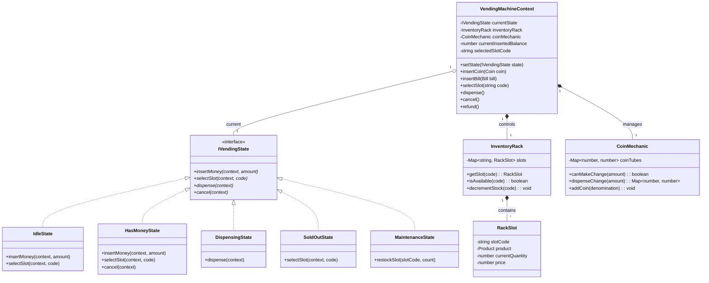
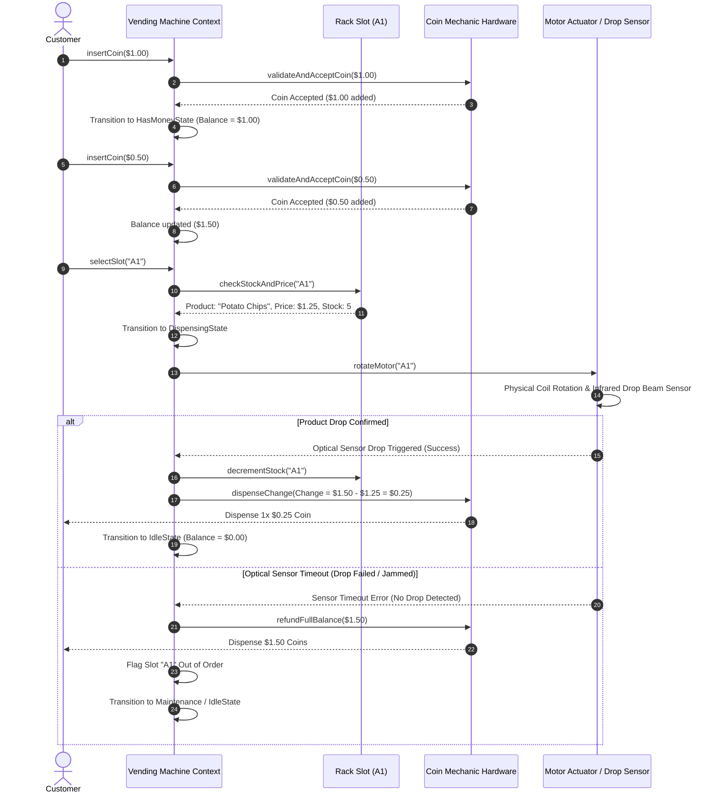
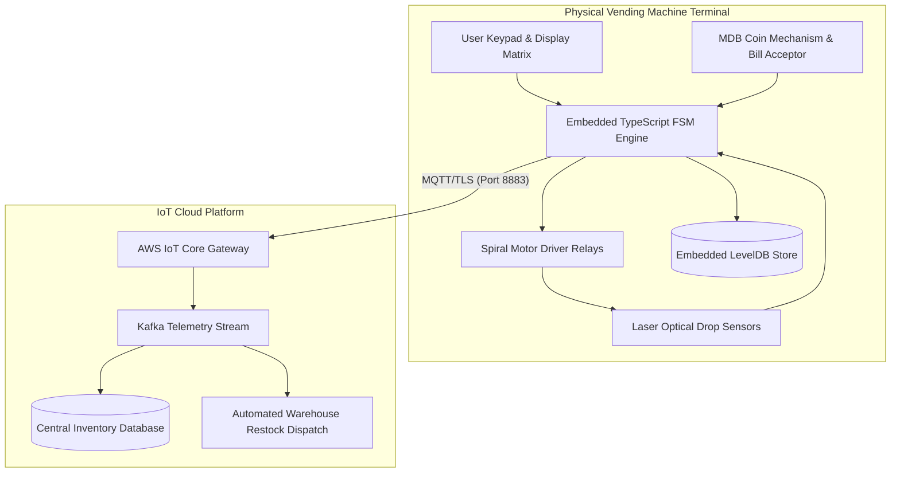

# 🛠️ Enterprise System Design Blueprint: Vending Machine State Machine

> **Target Role:** Principal / Staff Architect / Senior LLD & HLD Engineers
> **Product Perspective:** Designing a production-grade, IoT-connected Vending Machine state machine system supporting multi-currency cash/coin insertion, product selection, motorized rack dispensing with optical drop verification, and exact change return.
> **Navigation:** ⬅️ [Back to Category Index](./README.md) | 📅 [Problem Bank Index](../README.md)

---

## 1. 🎯 Requirements & Product Scope

### 📋 Functional Requirements (FR)

1. **Money Insertion & Payment Handling:**
   - Accept physical coins ($0.10, $0.25, $0.50, $1.00) and paper bills ($1, $5, $10) via hardware validator.
   - Support contactless NFC / QR mobile payment API tokens.
   - Maintain running inserted cash balance in machine session state.
2. **Product Selection & Rack Inventory:**
   - Grid-based product code selection (e.g. `A1`, `A2`, `B5`).
   - Track inventory count, slot physical location, price, and item dimensions.
   - Prevent selection of out-of-stock items; display `SOLD OUT` indicator.
3. **Dispense & Hardware Verification:**
   - Trigger motorized rack spiral coil rotation for selected slot code.
   - Verify product drop into collection bin via infrared optical beam sensors.
   - Deduct product price from inserted money and return exact change using internal coin tube inventory.
4. **Cancellation & Idle Reset:**
   - Allow user to cancel transaction at any point prior to motor execution, returning $100\%$ of inserted money in coin tubes/bills.
   - Reset machine to `IdleState` upon dispensing completion or 45-second inactivity timeout.

### ⚡ Non-Functional Requirements (NFR)

1. **Deterministic State Invariants:**
   - Machine must never execute motor dispensing if `insertedMoney < productPrice`.
   - Motor execution must halt immediately if optical drop sensor fails to detect fallen product after 3 seconds (triggering automatic refund).
2. **Offline Hardware Availability:**
   - Vending machine state machine operates locally on embedded hardware with $100\%$ offline availability for cash transactions.
3. **Telemetry & Synchronization:**
   - Broadcast stock level changes, change reservoir low warnings, and motor jam alerts to central IoT cloud via MQTT every 5 minutes or on critical event.

---

## 2. 🧮 Scale & Quantitative Estimates

```
Fleet Footprint: 50,000 smart vending machines deployed globally (offices, transit stations, malls)
Transactions per Machine: 60 purchases/day
Total Daily Network Purchases: 50,000 * 60 = 3,000,000 transactions/day

Machine Hardware Capacity:
- Total Product Slots: 40 slots (A1-A10, B1-B10, C1-C10, D1-D10)
- Slot Quantity Capacity: 10 items per slot = 400 total items per machine maximum
- Coin Tube Capacity: 4 tubes ($0.10, $0.25, $0.50, $1.00) holding 100 coins each = 400 coins max
- Bill Stacker Capacity: 300 paper notes max

Telemetry Data Flow:
- Event Size per Transaction: ~500 bytes (timestamp, slotId, itemPrice, changeDispensed, sensorHealth)
- Daily Bandwidth per Machine: 60 * 500 bytes = 30 KB/day
- Total Cloud Data Ingestion: 3,000,000 * 500 B ≈ 1.5 GB / day (Extremely lightweight IoT payload)
```

---

## 3. 🛠️ Tech Stack & Architectural Justifications

| Component | Technology Choice | Architectural Rationale |
| :--- | :--- | :--- |
| **Embedded Runtime** | Node.js / TypeScript on Embedded Linux / Raspberry Pi Compute Module 4 | Event-driven non-blocking I/O handles serial GPIO hardware signals (coin validators, motor relays, laser sensors) seamlessly. |
| **State Controller** | Finite State Machine (State Pattern) | Guarantees strict operational sequence (`Idle` $\to$ `HasMoney` $\to$ `Dispensing` $\to$ `ReturningChange`). Prevents double dispense and unauthorized motor activation. |
| **Hardware Bus Protocol** | MDB/ICP (Multi-Drop Bus / Internal Communication Protocol) | Standardized vending industry protocol interfacing PC/Raspberry Pi controller with coin mechanisms, bill validators, and cashless card readers. |
| **Local Cache & Storage** | LevelDB / SQLite | Persists rack configuration, price matrix, cumulative sales audit logs, and coin tube inventory across unexpected power loss. |
| **Cloud Telemetry** | AWS IoT Core / MQTT over TLS 1.3 | Low-overhead pub/sub transport with persistent keep-alive, ideal for intermittent cellular connectivity. |

---

## 4. 📐 Visual UML Diagrams

### 🏗️ Class Diagram (Domain Model & State Pattern)



### 🔄 Sequence Diagram: Coin Insertion, Product Purchase & Change Dispense



---

## 5. 🧱 OOP & SOLID Principles Mapping

- **Single Responsibility Principle (SRP):**
  - `VendingMachineContext` manages state transitions and input delegation.
  - `CoinMechanic` isolates coin validation, tube count tracking, and greedy change dispensation.
  - `InventoryRack` handles physical slot code matrix mapping and stock decrementing.
- **Open/Closed Principle (OCP):**
  - Additional payment methods (e.g. `CryptoQRState` or `NFCContactlessState`) extend `IVendingState` without refactoring existing cash handling code.
  - New change distribution algorithms (e.g. `ExactTubePreservationStrategy`) extend `IChangeStrategy`.
- **Liskov Substitution Principle (LSP):**
  - All concrete states implement `IVendingState`. Substituting `HasMoneyState` for `IdleState` maintains system stability and returns structured error messages for invalid transitions.
- **Interface Segregation Principle (ISP):**
  - `ICoinValidatorListener`, `IMotorControlListener`, and `IDropSensorListener` provide modular hardware callbacks instead of a monolithic event bus.
- **Dependency Inversion Principle (DIP):**
  - `VendingMachineContext` relies on `IMotorController` and `ICoinMechanic` interfaces rather than raw hardware serial port bindings.

---

## 6. 🎨 Design Patterns Selection

1. **State Pattern (Primary):** Encapsulates machine behavior across distinct operational modes (`Idle`, `HasMoney`, `Dispensing`, `SoldOut`, `Maintenance`).
2. **Strategy Pattern:** `ChangeCalculationStrategy` evaluates coin tube inventory to calculate exact change combinations using dynamic greedy or exact-match algorithms.
3. **Factory Pattern:** `ProductFactory` creates initialized `RackSlot` instances from JSON configuration files during machine boot.
4. **Command Pattern:** Encapsulates motor rotation commands (`DispenseCommand`) with embedded retry and reverse motor unjamming capabilities.
5. **Observer Pattern:** Sensor observers monitor inventory levels and issue real-time MQTT alerts when any slot stock drops below 2 units.

---

## 7. 📂 Production Code Blueprint (TypeScript)

```typescript
// ==========================================
// 1. Domain Entities & Enums
// ==========================================

export enum Coin {
  DIME = 0.10,
  QUARTER = 0.25,
  HALF_DOLLAR = 0.50,
  DOLLAR = 1.00,
}

export interface Product {
  id: string;
  name: string;
  price: number;
}

export interface RackSlot {
  slotCode: string;
  product: Product;
  quantity: number;
  price: number;
}

// ==========================================
// 2. State Pattern Interfaces
// ==========================================

export interface IVendingMachineContext {
  setState(state: IVendingState): void;
  getInsertedBalance(): number;
  setInsertedBalance(balance: number): void;
  addBalance(amount: number): void;
  getInventory(): InventoryRack;
  getCoinMechanic(): CoinMechanic;
  getSelectedSlotCode(): string | null;
  setSelectedSlotCode(code: string | null): void;
  resetSession(): void;
}

export interface IVendingState {
  readonly name: string;
  insertCoin(context: IVendingMachineContext, coin: Coin): void;
  selectSlot(context: IVendingMachineContext, slotCode: string): void;
  dispense(context: IVendingMachineContext): Promise<boolean>;
  cancel(context: IVendingMachineContext): number;
}

// Base State with Guard Defaults
export abstract class BaseVendingState implements IVendingState {
  abstract readonly name: string;

  insertCoin(context: IVendingMachineContext, coin: Coin): void {
    throw new Error(`Cannot insert coin in ${this.name} state.`);
  }

  selectSlot(context: IVendingMachineContext, slotCode: string): void {
    throw new Error(`Cannot select product in ${this.name} state.`);
  }

  async dispense(context: IVendingMachineContext): Promise<boolean> {
    throw new Error(`Cannot dispense in ${this.name} state.`);
  }

  cancel(context: IVendingMachineContext): number {
    const balance = context.getInsertedBalance();
    context.resetSession();
    return balance;
  }
}

// ==========================================
// 3. Coin Mechanics & Inventory Rack
// ==========================================

export class CoinMechanic {
  private tubes: Map<number, number> = new Map();

  constructor() {
    this.tubes.set(Coin.DIME, 50);
    this.tubes.set(Coin.QUARTER, 50);
    this.tubes.set(Coin.HALF_DOLLAR, 20);
    this.tubes.set(Coin.DOLLAR, 20);
  }

  addCoin(coin: Coin): void {
    const current = this.tubes.get(coin) || 0;
    this.tubes.set(coin, current + 1);
  }

  canMakeChange(amount: number): boolean {
    try {
      this.calculateChange(amount);
      return true;
    } catch {
      return false;
    }
  }

  calculateChange(amount: number): Map<number, number> {
    let remaining = Math.round(amount * 100);
    const result = new Map<number, number>();
    const denoms = [100, 50, 25, 10]; // Cents

    for (const d of denoms) {
      const coinEnum = d / 100;
      const available = this.tubes.get(coinEnum) || 0;
      const needed = Math.floor(remaining / d);
      const toTake = Math.min(needed, available);

      if (toTake > 0) {
        result.set(coinEnum, toTake);
        remaining -= toTake * d;
      }
    }

    if (remaining > 0) {
      throw new Error('Exact change cannot be dispensed with current coin tube inventory.');
    }

    return result;
  }

  dispenseChange(amount: number): Map<number, number> {
    const changeMap = this.calculateChange(amount);
    for (const [coin, count] of changeMap.entries()) {
      const current = this.tubes.get(coin) || 0;
      this.tubes.set(coin, current - count);
    }
    return changeMap;
  }
}

export class InventoryRack {
  private slots: Map<string, RackSlot> = new Map();

  constructor() {
    this.slots.set('A1', {
      slotCode: 'A1',
      product: { id: 'P1', name: 'Classic Potato Chips', price: 1.25 },
      quantity: 5,
      price: 1.25,
    });
    this.slots.set('A2', {
      slotCode: 'A2',
      product: { id: 'P2', name: 'Chocolate Bar', price: 1.50 },
      quantity: 0, // Out of stock
      price: 1.50,
    });
  }

  getSlot(slotCode: string): RackSlot | undefined {
    return this.slots.get(slotCode);
  }

  isAvailable(slotCode: string): boolean {
    const slot = this.slots.get(slotCode);
    return !!slot && slot.quantity > 0;
  }

  decrementStock(slotCode: string): void {
    const slot = this.slots.get(slotCode);
    if (slot && slot.quantity > 0) {
      slot.quantity--;
    }
  }
}

// ==========================================
// 4. Concrete States
// ==========================================

export class IdleState extends BaseVendingState {
  readonly name = 'IdleState';

  insertCoin(context: IVendingMachineContext, coin: Coin): void {
    context.getCoinMechanic().addCoin(coin);
    context.addBalance(coin);
    console.log(`[State Transition] Coin inserted: $${coin.toFixed(2)}. Total: $${context.getInsertedBalance().toFixed(2)}`);
    context.setState(new HasMoneyState());
  }

  selectSlot(context: IVendingMachineContext, slotCode: string): void {
    const slot = context.getInventory().getSlot(slotCode);
    if (!slot) throw new Error('Invalid slot selection.');
    if (slot.quantity === 0) {
      console.log(`[Slot Alert] Slot ${slotCode} is SOLD OUT.`);
      context.setState(new SoldOutState());
      return;
    }
    console.log(`[Display] Selected ${slot.product.name} ($${slot.price.toFixed(2)}). Please insert money.`);
  }
}

export class HasMoneyState extends BaseVendingState {
  readonly name = 'HasMoneyState';

  insertCoin(context: IVendingMachineContext, coin: Coin): void {
    context.getCoinMechanic().addCoin(coin);
    context.addBalance(coin);
    console.log(`[State Update] Additional coin inserted. Total Balance: $${context.getInsertedBalance().toFixed(2)}`);
  }

  selectSlot(context: IVendingMachineContext, slotCode: string): void {
    const inventory = context.getInventory();
    const slot = inventory.getSlot(slotCode);

    if (!slot) throw new Error(`Slot ${slotCode} does not exist.`);
    if (slot.quantity === 0) {
      console.log(`[Slot Alert] Slot ${slotCode} is SOLD OUT.`);
      return;
    }

    const currentBalance = context.getInsertedBalance();
    if (currentBalance < slot.price) {
      console.log(`[Display] Insufficient funds. Price: $${slot.price.toFixed(2)}, Current: $${currentBalance.toFixed(2)}`);
      return;
    }

    const changeNeeded = currentBalance - slot.price;
    if (changeNeeded > 0 && !context.getCoinMechanic().canMakeChange(changeNeeded)) {
      console.error(`[Hardware Error] Cannot make exact change ($${changeNeeded.toFixed(2)}). Transaction aborted.`);
      return;
    }

    context.setSelectedSlotCode(slotCode);
    context.setState(new DispensingState());
    context.dispense();
  }
}

export class DispensingState extends BaseVendingState {
  readonly name = 'DispensingState';

  async dispense(context: IVendingMachineContext): Promise<boolean> {
    const slotCode = context.getSelectedSlotCode();
    if (!slotCode) throw new Error('No slot selected for dispensing.');

    const slot = context.getInventory().getSlot(slotCode)!;
    console.log(`[Hardware Actuator] Rotating coil motor for slot ${slotCode}...`);

    // Simulated hardware infrared optical drop sensor call
    const dropSuccessful = await this.verifyOpticalDropSensor();

    if (dropSuccessful) {
      console.log(`[Hardware Sensor] Drop confirmed: ${slot.product.name}`);
      context.getInventory().decrementStock(slotCode);

      const changeAmount = context.getInsertedBalance() - slot.price;
      if (changeAmount > 0) {
        const changeDispensed = context.getCoinMechanic().dispenseChange(changeAmount);
        console.log(`[Coin Hardware] Change dispensed ($${changeAmount.toFixed(2)}):`, Array.from(changeDispensed.entries()));
      }

      context.resetSession();
      context.setState(new IdleState());
      return true;
    } else {
      console.error(`[Hardware Fault] Drop beam NOT broken! Reversing coil motor...`);
      const fullRefund = context.cancel(context);
      console.log(`[Refund] Full refund issued: $${fullRefund.toFixed(2)}`);
      context.setState(new IdleState());
      return false;
    }
  }

  private async verifyOpticalDropSensor(): Promise<boolean> {
    // 95% success rate simulation
    return Math.random() > 0.05;
  }
}

export class SoldOutState extends BaseVendingState {
  readonly name = 'SoldOutState';

  selectSlot(context: IVendingMachineContext, slotCode: string): void {
    console.log(`[Display] Item is SOLD OUT. Select an alternative item.`);
  }
}

// ==========================================
// 5. Vending Machine Context Controller
// ==========================================

export class VendingMachineContext implements IVendingMachineContext {
  private currentState: IVendingState;
  private inventory: InventoryRack;
  private coinMechanic: CoinMechanic;
  private insertedBalance: number = 0;
  private selectedSlotCode: string | null = null;

  constructor() {
    this.inventory = new InventoryRack();
    this.coinMechanic = new CoinMechanic();
    this.currentState = new IdleState();
  }

  setState(state: IVendingState): void {
    this.currentState = state;
  }

  getInsertedBalance(): number { return this.insertedBalance; }
  setInsertedBalance(balance: number): void { this.insertedBalance = balance; }
  addBalance(amount: number): void { this.insertedBalance += amount; }
  getInventory(): InventoryRack { return this.inventory; }
  getCoinMechanic(): CoinMechanic { return this.coinMechanic; }
  getSelectedSlotCode(): string | null { return this.selectedSlotCode; }
  setSelectedSlotCode(code: string | null): void { this.selectedSlotCode = code; }

  resetSession(): void {
    this.insertedBalance = 0;
    this.selectedSlotCode = null;
  }

  // State delegation methods
  insertCoin(coin: Coin): void { this.currentState.insertCoin(this, coin); }
  selectSlot(slotCode: string): void { this.currentState.selectSlot(this, slotCode); }
  async dispense(): Promise<boolean> { return this.currentState.dispense(this); }
  cancel(): number { return this.currentState.cancel(this); }
}
```

---

## 8. 🔀 High-Level Design (HLD) & Scale Bottlenecks



### ⚠️ Scalability & Edge Case Bottlenecks

1. **Coin Tube Depletion Strategy (Change Lockout):**
   - *Problem:* Machine accumulates $10 bills but exhausts all $0.25 coins, blocking transactions requiring change.
   - *Resolution:* Pre-emptive change calculation verification in `HasMoneyState`. If change cannot be calculated for a product selection, the UI blocks selection and displays `EXACT CHANGE ONLY`.
2. **Motor Spiral Jam & Optical Sensor Fraud:**
   - *Problem:* A malicious user attempts to block the optical sensor with paper to get a free refund while product drops.
   - *Resolution:* Dual optical beam verification + motor current monitoring. If motor current spikes beyond normal rotation torque or sensor is blocked continuously before rotation begins, motor shuts down and machine transitions to `MaintenanceState`.

---

## ❓ 9. Collapsed Senior/Staff Level Grill Q&A

<details>
<summary>❓ 1. How do you handle exact change return when multiple bill/coin combinations satisfy the refund amount?</summary>

**Answer:**
We implement a **Coin Tube Preservation Strategy** using a weighted greedy approach. Instead of naively returning the largest denomination ($1.00 coin), the strategy checks coin tube fill percentages. If $0.25 coins are at $90\%$ capacity while $1.00 coins are at $10\%$ capacity, the dispenser prioritizes $0.25 coins to rebalance physical coin levels across the hardware tubes.

</details>

<details>
<summary>❓ 2. What happens if power drops while the spiral motor is mid-rotation dispensing an item?</summary>

**Answer:**
1. **Journaling & State Persistence:** Every state change and motor activation is logged to local LevelDB before sending the motor high signal.
2. **Boot Recovery Routine:** On boot, the embedded application checks motor encoder sensors. If motor $A1$ is not in home position ($360^\circ$ rotation complete mark), the machine executes a self-test cycle: completes the rotation, checks the optical drop sensor, adjusts local inventory, and clears transient session memory safely.

</details>
