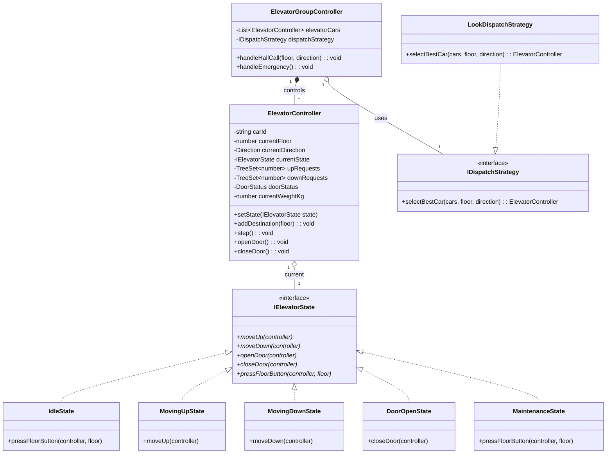
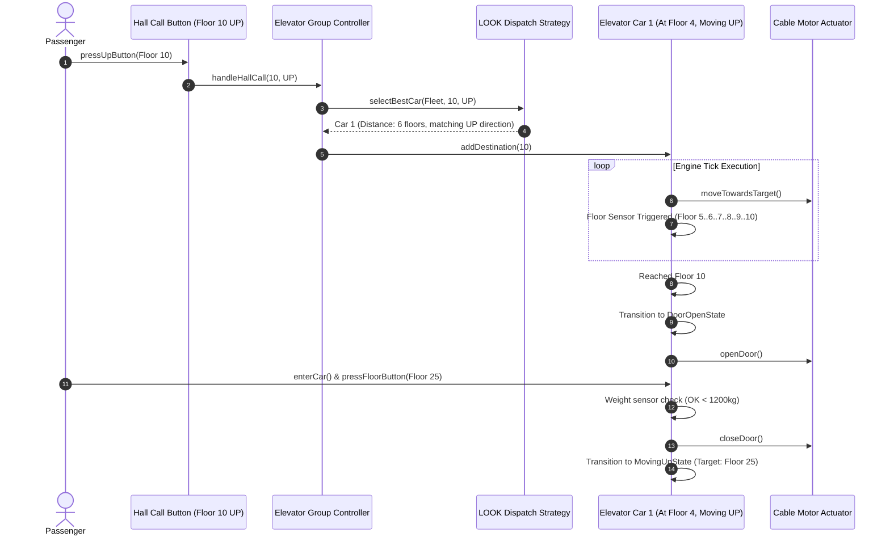

# 🛠️ Enterprise System Design Blueprint: Elevator Control System

> **Target Role:** Principal / Staff Architect / Senior LLD & HLD Engineers
> **Product Perspective:** Designing a high-performance, real-time Multi-Elevator Controller system for a 50-story commercial skyscraper implementing LOOK/SCAN dispatch algorithms, elevator car state machines, hall call optimization, and safety sensor management.
> **Navigation:** ⬅️ [Back to Category Index](./README.md) | 📅 [Problem Bank Index](../README.md)

---

## 1. 🎯 Requirements & Product Scope

### 📋 Functional Requirements (FR)

1. **Hall Calls (External Floor Buttons):**
   - Passengers request an elevator from any floor specifying direction (`UP` or `DOWN`).
   - Smart Dispatch Controller assigns the optimal elevator car based on proximity, current direction, and load factor.
2. **Car Calls (Internal Floor Buttons):**
   - Passengers inside elevator car select destination floor numbers.
   - Elevator adds floor to internal priority request queue.
3. **Elevator Car State Machine & Movement:**
   - Cars transition between states: `Idle`, `MovingUp`, `MovingDown`, `DoorOpen`, `Maintenance`, `EmergencyStop`.
   - Execute movement using **LOOK / SCAN scheduling algorithm** (service requests in current direction until no further requests exist, then reverse).
4. **Safety & Sensor Interlocks:**
   - Door obstruction sensor automatically reopens doors if blocked.
   - Overload weight sensor prevents door closure if weight exceeds maximum capacity ($1,500\text{ kg}$).
   - Fire Alarm / Power Outage forces all cars into `EmergencyStop`, navigating immediately to Ground Floor ($Floor\ 1$) and opening doors.

### ⚡ Non-Functional Requirements (NFR)

1. **Wait Time Optimization:**
   - Average passenger wait time $P_{95} < 30\text{ seconds}$ during peak traffic (Morning Up-peak, Evening Down-peak).
2. **High Concurrency & Low Latency Dispatch:**
   - Dispatch algorithm must select and assign elevator car within $< 20\text{ms}$ of hall call button press.
3. **Safety & Fault Tolerance:**
   - Single elevator car electrical/mechanical failure must isolate that car into `Maintenance` state without impacting the remaining elevator fleet.

---

## 2. 🧮 Scale & Quantitative Estimates

```
Building Profile: 50 Floors, 8 Elevator Cars (Group Controller Fleet)
Building Occupancy: 5,000 employees
Peak Traffic Load: Morning Up-Peak (8:00 AM - 9:00 AM) -> 60% of workforce arrives (3,000 passengers/hour)

Passenger Throughput Calculations:
- Hourly Peak Arrivals: 3,000 passengers / 3600 seconds = 0.83 passengers/sec
- Average Elevator Trip Time: 45 seconds (Load, travel 15 floors, unload)
- Elevator Car Capacity: 16 passengers max load (1,200 kg)
- Single Car Throughput: 16 passengers / 45s = ~0.35 passengers/sec
- Total 8 Car Fleet Capacity: 8 * 0.35 = 2.8 passengers/sec (Sufficient margin over 0.83 peak requirement)

Real-Time Telemetry QPS:
- 8 Elevator Cars emitting status updates (Floor, Speed, Weight, Door Status) every 100ms
- Telemetry Traffic: 8 * 10 = 80 QPS streaming updates to Dispatch Controller Dashboard.
```

---

## 3. 🛠️ Tech Stack & Architectural Justifications

| Component | Technology Choice | Architectural Rationale |
| :--- | :--- | :--- |
| **Control System Runtime** | Node.js / TypeScript / C++ Embedded Core | Ultra-low latency event loop processes real-time floor proximity interrupts and CAN bus hardware updates. |
| **Scheduling Engine** | LOOK Algorithm / Zone Allocation Strategy | Superior to naive FCFS (First Come First Served) and SSTF (Shortest Seek Time First). Prevents starvation by sweeping continuously upward and downward. |
| **Inter-Car Messaging** | Shared In-Memory Controller / Ring Buffer | Ultra-fast $< 1\text{ms}$ IPC (Inter-Process Communication) state synchronization between group dispatcher and individual car controllers. |
| **Real-time Monitoring** | WebSockets / Socket.IO | Pushes live 3D visual position and state updates of all 8 elevators to building security & facility management consoles. |

---

## 4. 📐 Visual UML Diagrams

### 🏗️ Class Diagram (Domain Entities & State Machine)



### 🔄 Sequence Diagram: External Hall Call & LOOK Dispatch Movement



---

## 5. 🧱 OOP & SOLID Principles Mapping

- **Single Responsibility Principle (SRP):**
  - `ElevatorController` manages individual elevator movement, door timer, and internal requests.
  - `ElevatorGroupController` routes external hall calls to the best car.
  - `LookDispatchStrategy` handles optimization algorithms independently.
- **Open/Closed Principle (OCP):**
  - Alternative dispatch strategies (`DestinationDispatchStrategy`, `EnergySavingStrategy`) implement `IDispatchStrategy` without modifying group controller logic.
- **Liskov Substitution Principle (LSP):**
  - All concrete states implement `IElevatorState`. Substituting `MovingUpState` with `MaintenanceState` gracefully rejects new floor targets without crashing the engine loop.
- **Interface Segregation Principle (ISP):**
  - Modular interfaces: `IDoorSensorListener`, `IWeightSensorListener`, and `IFloorSensorListener`.
- **Dependency Inversion Principle (DIP):**
  - `ElevatorGroupController` depends on `IDispatchStrategy` abstraction, allowing runtime switching between morning peak and off-peak algorithms.

---

## 6. 🎨 Design Patterns Selection

1. **State Pattern (Primary):** Manages lifecycle transitions of individual elevator cars (`Idle`, `MovingUp`, `MovingDown`, `DoorOpen`, `Maintenance`, `EmergencyStop`).
2. **Strategy Pattern:** `IDispatchStrategy` encapsulates selection algorithms (LOOK algorithm, Shortest Seek Time First, Morning Up-Peak Zone Allocation).
3. **Observer Pattern:** Sensor observers (`FloorSensorObserver`, `DoorObstructionObserver`, `WeightSensorObserver`) notify the car controller of physical state events.
4. **Command Pattern:** `FloorRequestCommand` decouples hall/car button presses from execution, enabling priority request queuing.
5. **Singleton / Registry Pattern:** `ElevatorGroupController` serves as a central manager for the building's fleet.

---

## 7. 📂 Production Code Blueprint (TypeScript)

```typescript
// ==========================================
// 1. Enums & Domain Interfaces
// ==========================================

export enum Direction {
  UP = 'UP',
  DOWN = 'DOWN',
  NONE = 'NONE',
}

export enum DoorStatus {
  CLOSED = 'CLOSED',
  OPENING = 'OPENING',
  OPEN = 'OPEN',
  CLOSING = 'CLOSING',
}

export interface HallCall {
  floor: number;
  direction: Direction;
}

// ==========================================
// 2. State Pattern Interface & Base Class
// ==========================================

export interface IElevatorController {
  setState(state: IElevatorState): void;
  getCurrentFloor(): number;
  setCurrentFloor(floor: number): void;
  getDirection(): Direction;
  setDirection(direction: Direction): void;
  getUpRequests(): Set<number>;
  getDownRequests(): Set<number>;
  addRequest(floor: number): void;
  removeRequest(floor: number): void;
  getDoorStatus(): DoorStatus;
  setDoorStatus(status: DoorStatus): void;
  getWeightKg(): number;
}

export interface IElevatorState {
  readonly name: string;
  step(context: IElevatorController): void;
  pressButton(context: IElevatorController, floor: number): void;
}

export abstract class BaseElevatorState implements IElevatorState {
  abstract readonly name: string;

  step(context: IElevatorController): void {
    // Default no-op step
  }

  pressButton(context: IElevatorController, floor: number): void {
    context.addRequest(floor);
  }
}

// ==========================================
// 3. Dispatch Strategy (LOOK Algorithm)
// ==========================================

export interface IDispatchStrategy {
  selectBestCar(cars: IElevatorController[], floor: number, direction: Direction): IElevatorController;
}

export class LookDispatchStrategy implements IDispatchStrategy {
  selectBestCar(cars: IElevatorController[], floor: number, direction: Direction): IElevatorController {
    let bestCar: IElevatorController | null = null;
    let minScore = Infinity;

    for (const car of cars) {
      const currentFloor = car.getCurrentFloor();
      const carDirection = car.getDirection();
      let distance = Math.abs(currentFloor - floor);
      let score = distance;

      // Penalty logic for cars moving in opposite direction
      if (carDirection === Direction.UP && direction === Direction.UP && currentFloor <= floor) {
        score = distance; // Ideal candidate
      } else if (carDirection === Direction.DOWN && direction === Direction.DOWN && currentFloor >= floor) {
        score = distance; // Ideal candidate
      } else if (carDirection === Direction.NONE) {
        score = distance + 1; // Idle car high preference
      } else {
        score = distance + 50; // High penalty for moving away
      }

      if (score < minScore) {
        minScore = score;
        bestCar = car;
      }
    }

    return bestCar || cars[0];
  }
}

// ==========================================
// 4. Concrete Elevator States
// ==========================================

export class IdleState extends BaseElevatorState {
  readonly name = 'IdleState';

  step(context: IElevatorController): void {
    const currentFloor = context.getCurrentFloor();
    const upRequests = context.getUpRequests();
    const downRequests = context.getDownRequests();

    if (upRequests.size === 0 && downRequests.size === 0) {
      context.setDirection(Direction.NONE);
      return;
    }

    // Determine initial direction
    const hasUpAbove = Array.from(upRequests).some(f => f > currentFloor) || Array.from(downRequests).some(f => f > currentFloor);
    if (hasUpAbove) {
      context.setDirection(Direction.UP);
      context.setState(new MovingUpState());
    } else {
      context.setDirection(Direction.DOWN);
      context.setState(new MovingDownState());
    }
  }
}

export class MovingUpState extends BaseElevatorState {
  readonly name = 'MovingUpState';

  step(context: IElevatorController): void {
    const current = context.getCurrentFloor();
    const upRequests = context.getUpRequests();

    // Check if target reached
    if (upRequests.has(current)) {
      console.log(`[Elevator] Arrived at Floor ${current} (UP)`);
      context.removeRequest(current);
      context.setState(new DoorOpenState());
      return;
    }

    // Check if higher requests exist
    const maxUpFloor = Math.max(...Array.from(upRequests), ...Array.from(context.getDownRequests()), -1);
    if (current < maxUpFloor) {
      context.setCurrentFloor(current + 1);
      console.log(`[Elevator] Moving UP -> Floor ${current + 1}`);
    } else {
      // Switch direction if no higher requests
      context.setState(new IdleState());
    }
  }
}

export class MovingDownState extends BaseElevatorState {
  readonly name = 'MovingDownState';

  step(context: IElevatorController): void {
    const current = context.getCurrentFloor();
    const downRequests = context.getDownRequests();

    if (downRequests.has(current)) {
      console.log(`[Elevator] Arrived at Floor ${current} (DOWN)`);
      context.removeRequest(current);
      context.setState(new DoorOpenState());
      return;
    }

    const minDownFloor = Math.min(...Array.from(downRequests), ...Array.from(context.getUpRequests()), Infinity);
    if (current > minDownFloor) {
      context.setCurrentFloor(current - 1);
      console.log(`[Elevator] Moving DOWN -> Floor ${current - 1}`);
    } else {
      context.setState(new IdleState());
    }
  }
}

export class DoorOpenState extends BaseElevatorState {
  readonly name = 'DoorOpenState';
  private timer = 0;

  step(context: IElevatorController): void {
    if (context.getWeightKg() > 1200) {
      console.warn(`[Safety Sensor] OVERLOAD DETECTED (${context.getWeightKg()} kg)! Doors holding open.`);
      return;
    }

    if (this.timer === 0) {
      context.setDoorStatus(DoorStatus.OPEN);
      console.log(`[Hardware] Elevator Doors OPENED at Floor ${context.getCurrentFloor()}`);
    }

    this.timer++;
    if (this.timer >= 2) { // 2 tick door dwell time
      context.setDoorStatus(DoorStatus.CLOSED);
      console.log(`[Hardware] Elevator Doors CLOSED`);
      context.setState(new IdleState());
    }
  }
}

export class MaintenanceState extends BaseElevatorState {
  readonly name = 'MaintenanceState';

  step(context: IElevatorController): void {
    console.log(`[System Alert] Elevator is in Maintenance Mode. Ignoring commands.`);
  }

  pressButton(context: IElevatorController, floor: number): void {
    console.warn(`Cannot register floor request. Elevator in maintenance.`);
  }
}

// ==========================================
// 5. Elevator Controller & Group Dispatcher
// ==========================================

export class ElevatorController implements IElevatorController {
  private carId: string;
  private currentFloor: number = 1;
  private direction: Direction = Direction.NONE;
  private currentState: IElevatorState;
  private upRequests: Set<number> = new Set();
  private downRequests: Set<number> = new Set();
  private doorStatus: DoorStatus = DoorStatus.CLOSED;
  private currentWeightKg: number = 250;

  constructor(carId: string) {
    this.carId = carId;
    this.currentState = new IdleState();
  }

  getCarId(): string { return this.carId; }
  setState(state: IElevatorState): void { this.currentState = state; }
  getCurrentFloor(): number { return this.currentFloor; }
  setCurrentFloor(floor: number): void { this.currentFloor = floor; }
  getDirection(): Direction { return this.direction; }
  setDirection(direction: Direction): void { this.direction = direction; }
  getUpRequests(): Set<number> { return this.upRequests; }
  getDownRequests(): Set<number> { return this.downRequests; }
  getDoorStatus(): DoorStatus { return this.doorStatus; }
  setDoorStatus(status: DoorStatus): void { this.doorStatus = status; }
  getWeightKg(): number { return this.currentWeightKg; }

  addRequest(floor: number): void {
    if (floor > this.currentFloor) this.upRequests.add(floor);
    else if (floor < this.currentFloor) this.downRequests.add(floor);
    else this.upRequests.add(floor); // Same floor
  }

  removeRequest(floor: number): void {
    this.upRequests.delete(floor);
    this.downRequests.delete(floor);
  }

  step(): void {
    this.currentState.step(this);
  }
}

export class ElevatorGroupController {
  private cars: ElevatorController[];
  private dispatchStrategy: IDispatchStrategy;

  constructor(carCount: number, strategy: IDispatchStrategy) {
    this.dispatchStrategy = strategy;
    this.cars = [];
    for (let i = 1; i <= carCount; i++) {
      this.cars.push(new ElevatorController(`CAR-${i}`));
    }
  }

  handleHallCall(floor: number, direction: Direction): void {
    const bestCar = this.dispatchStrategy.selectBestCar(this.cars, floor, direction);
    console.log(`[Group Dispatcher] Assigned Hall Call Floor ${floor} (${direction}) to ${bestCar.getCarId()}`);
    bestCar.addRequest(floor);
  }

  tick(): void {
    for (const car of this.cars) {
      car.step();
    }
  }
}
```

---

## 8. 🔀 High-Level Design (HLD) & Scale Bottlenecks

```mermaid
graph TB
    subgraph Floor Buttons & Sensors
        HallButtons[External Hall Call Panels (Floors 1-50)]
        CarButtons[Internal Car Touchscreens]
        Sensors[Weight / Laser Door Obstruction Sensors]
    end

    subgraph Central Elevator Dispatcher
        IPC[Shared Memory Bus / Ring Buffer]
        Dispatcher[Elevator Group Controller Engine]
        LOOK[LOOK / SCAN Dispatch Strategy Engine]
    end

    subgraph Elevator Physical Hardware
        Car1[Elevator Car 1 Motor & Brake Relay]
        Car2[Elevator Car 2 Motor & Brake Relay]
        CarN[Elevator Car N Motor & Brake Relay]
    end

    HallButtons --> IPC
    CarButtons --> IPC
    Sensors --> IPC
    IPC --> Dispatcher
    Dispatcher --> LOOK
    Dispatcher --> Car1
    Dispatcher --> Car2
    Dispatcher --> CarN
```

### ⚠️ Scalability & Edge Case Bottlenecks

1. **Morning Up-Peak Traffic Bottleneck (Starvation at Upper Floors):**
   - *Problem:* All passengers enter at Floor 1 going up. Higher floors experience extreme wait times for DOWN calls.
   - *Resolution:* **Zone Allocation Strategy**. 4 cars are statically assigned to lower floors (1-25) and 4 cars to upper floors (26-50), returning immediately to Floor 1 after discharging passengers.
2. **Elevator Churn & Energy Optimization:**
   - *Problem:* Moving a 2,000 kg elevator car for a single passenger consumes excessive energy.
   - *Resolution:* Dispatch controller enforces a 3-second request batching window in off-peak hours, grouping hall calls heading in the same direction before initiating motor movement.

---

## ❓ 9. Collapsed Senior/Staff Level Grill Q&A

<details>
<summary>❓ 1. Why is the LOOK scheduling algorithm preferred over SCAN or SSTF (Shortest Seek Time First)?</summary>

**Answer:**
- **SSTF** causes extreme passenger starvation: a car moving between floors 10-12 will continuously serve calls nearby, ignoring a passenger waiting at floor 50.
- **SCAN** moves all the way to the top floor (Floor 50) and bottom floor (Floor 1) regardless of whether requests exist at the extremities.
- **LOOK** resolves both: it services requests in the current direction of travel, but reverses direction immediately once no further requests exist ahead, minimizing empty travel distance and energy consumption.

</details>

<details>
<summary>❓ 2. How do you handle emergency fire alarm overrides across all 8 elevators concurrently?</summary>

**Answer:**
1. Fire Alarm System triggers an interrupt signal directly to the hardware bus (CAN bus broadcast).
2. `ElevatorGroupController.handleEmergency()` sets all car controllers to `EmergencyState`.
3. Existing destination request queues (`upRequests`, `downRequests`) are purged instantly.
4. Cars cancel current floor targets, navigate non-stop to Ground Floor ($Floor\ 1$), open doors, and disable further movement until manual key override by firefighters.

</details>
