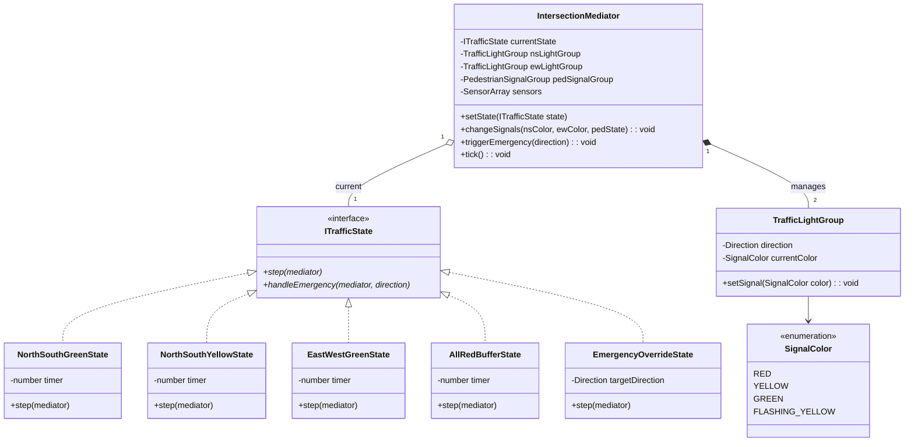
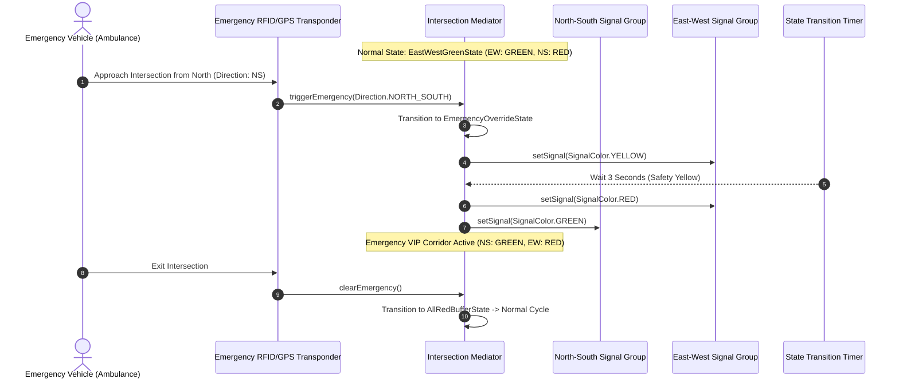
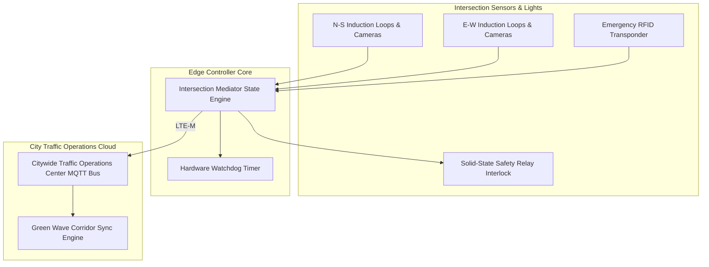

# 🛠️ Enterprise System Design Blueprint: Traffic Control System

> **Target Role:** Principal / Staff Architect / Senior LLD & HLD Engineers
> **Product Perspective:** Designing a safety-critical, smart Traffic Light Control System managing 4-way multi-phase intersections with dynamic sensor-based timing, pedestrian safety latching, emergency vehicle VIP green corridor overrides, and hardware watchdog fail-safes.
> **Navigation:** ⬅️ [Back to Category Index](./README.md) | 📅 [Problem Bank Index](../README.md)

---

## 1. 🎯 Requirements & Product Scope

### 📋 Functional Requirements (FR)

1. **4-Way Intersection Signal States:**
   - Coordinate North-South (N-S) and East-West (E-W) directional signal groups (Vehicular & Pedestrian lights).
   - Enforce strict state sequencing: `NS_Green` $\to$ `NS_Yellow` $\to$ `All_Red_Safety_Buffer` $\to$ `EW_Green` $\to$ `EW_Yellow` $\to$ `All_Red_Safety_Buffer`.
   - Never allow simultaneous GREEN or YELLOW signals on conflicting directions (N-S and E-W).
2. **Dynamic Timing & Sensor Adaptation:**
   - Adjust GREEN light duration dynamically based on real-time vehicle queue length reported by induction loop / camera sensors ($15\text{s}$ minimum to $90\text{s}$ maximum).
3. **Pedestrian Crossing Request Latching:**
   - Record pedestrian push-button requests and grant a dedicated pedestrian GREEN phase during the next safe directional cycle.
4. **Emergency Vehicle Priority (VIP Green Corridor):**
   - Override normal cyclic state machine when an emergency vehicle (Ambulance, Fire Truck, Police) approaches via RFID/GPS trigger, turning target lane GREEN immediately and all conflicting lanes RED.
5. **Hardware Fail-Safe Watchdog:**
   - Automatically fall back to `FlashingYellow` (Main Road) / `FlashingRed` (Side Road) if CPU controller crashes or signal conflict hardware sensor trips.

### ⚡ Non-Functional Requirements (NFR)

1. **Zero Conflict Invariant ($100\%$ Safety Guarantee):**
   - Hardwired interlock prevents N-S and E-W green lights from illuminating simultaneously under any software fault condition.
2. **Real-time Latency:**
   - Emergency vehicle corridor override response time $< 100\text{ms}$.
3. **High Uptime & Fault Tolerance:**
   - $99.9999\%$ system availability (24/7 continuous operational interlocks).

---

## 2. 🧮 Scale & Quantitative Estimates

```
City Footprint: 2,500 connected smart intersections in a major metropolitan area
Sensors per Intersection: 8 induction loops + 4 traffic cameras + 4 pedestrian push buttons

Sensor Ingestion Stream:
- Telemetry Sample Rate: 10 Hz (10 samples/sec per sensor)
- Events per Intersection: 16 sensors * 10 = 160 sensor events/sec
- Total Citywide Sensor Stream: 2,500 * 160 = 400,000 events/sec (Handled by distributed Kafka cluster)

Central Control Latency Budget:
- Local Microcontroller Decision Loop: 10ms (Runs state machine locally)
- Edge-to-Cloud Telemetry Sync: 100ms
- Central Emergency Overrides: < 50ms propagation delay
```

---

## 3. 🛠️ Tech Stack & Architectural Justifications

| Component | Technology Choice | Architectural Rationale |
| :--- | :--- | :--- |
| **Local Intersection Runtime** | C++ / TypeScript on Ruggedized Industrial Controller | Real-time POSIX OS execution guarantees deterministic state transition timers without garbage collection pauses. |
| **State Machine Engine** | Hierarchical State Machine (HSM) with Mediator Pattern | Mediates directional signal groups to guarantee atomic transition steps and absolute signal isolation. |
| **Hardware Interlock** | Solid-State Relay Interlock PCB | Independent physical hardware circuit that cuts power to green lights if conflicting current is detected. |
| **Communication Protocol** | MQTT over Mesh Wi-Fi / LTE-M | Allows adjacent intersections to exchange green wave corridor signals for synchronized traffic flow. |

---

## 4. 📐 Visual UML Diagrams

### 🏗️ Class Diagram (Domain Model & Mediator Pattern)



### 🔄 Sequence Diagram: Emergency Vehicle Corridor Override



---

## 5. 🧱 OOP & SOLID Principles Mapping

- **Single Responsibility Principle (SRP):**
  - `IntersectionMediator` acts as central coordinator preventing conflicting signals.
  - `TrafficLightGroup` encapsulates individual lamp actuation (RED/YELLOW/GREEN).
  - `SensorArray` isolates hardware induction loop counting and pedestrian button latches.
- **Open/Closed Principle (OCP):**
  - Adding a new phase (e.g. `ProtectedLeftTurnState`) extends `ITrafficState` without modifying mediator connection logic.
- **Liskov Substitution Principle (LSP):**
  - Concrete state classes handle `step()` polymorphic calls seamlessly.
- **Interface Segregation Principle (ISP):**
  - Separate listener interfaces: `IPedestrianButtonListener`, `IVehicleSensorListener`, and `IEmergencyTransponderListener`.
- **Dependency Inversion Principle (DIP):**
  - Mediator depends on `ITrafficState` interface, enabling dynamic timing strategy injections.

---

## 6. 🎨 Design Patterns Selection

1. **State Pattern (Primary):** Manages cyclic intersection phase transitions (`NS_Green`, `NS_Yellow`, `EW_Green`, `EW_Yellow`, `AllRed_Buffer`, `Emergency_Override`).
2. **Mediator Pattern:** `IntersectionMediator` centralizes communications between N-S signals, E-W signals, and pedestrian crossing lamps, guaranteeing conflicting green signals cannot occur.
3. **Strategy Pattern:** `TrafficTimingStrategy` calculates dynamic green light durations based on vehicle density.
4. **Observer Pattern:** Sensor observers notify the mediator when an emergency vehicle transponder approaches or a pedestrian button is pressed.
5. **Chain of Responsibility Pattern:** Hardware interlock relays form a safety chain verifying zero conflicting signal outputs before applying voltage to green lamps.

---

## 7. 📂 Production Code Blueprint (TypeScript)

```typescript
// ==========================================
// 1. Enums & Interfaces
// ==========================================

export enum Direction {
  NORTH_SOUTH = 'NORTH_SOUTH',
  EAST_WEST = 'EAST_WEST',
}

export enum SignalColor {
  RED = 'RED',
  YELLOW = 'YELLOW',
  GREEN = 'GREEN',
  FLASHING_YELLOW = 'FLASHING_YELLOW',
}

export enum PedestrianState {
  DONT_WALK = 'DONT_WALK',
  WALK = 'WALK',
  FLASHING_DONT_WALK = 'FLASHING_DONT_WALK',
}

// ==========================================
// 2. Hardware Signal Component
// ==========================================

export class TrafficLightGroup {
  private direction: Direction;
  private currentColor: SignalColor = SignalColor.RED;

  constructor(direction: Direction) {
    this.direction = direction;
  }

  getDirection(): Direction { return this.direction; }
  getColor(): SignalColor { return this.currentColor; }

  setSignal(color: SignalColor): void {
    this.currentColor = color;
    console.log(`[Hardware Lamp] Signal ${this.direction} switched to -> ${color}`);
  }
}

// ==========================================
// 3. State Pattern Interface
// ==========================================

export interface IIntersectionMediator {
  setState(state: ITrafficState): void;
  getNSLight(): TrafficLightGroup;
  getEWLight(): TrafficLightGroup;
  getPedestrianButtonLatched(): boolean;
  setPedestrianButtonLatched(latched: boolean): void;
  getVehicleCount(direction: Direction): number;
  triggerEmergency(direction: Direction): void;
}

export interface ITrafficState {
  readonly name: string;
  step(mediator: IIntersectionMediator): void;
  handleEmergency(mediator: IIntersectionMediator, direction: Direction): void;
}

export abstract class BaseTrafficState implements ITrafficState {
  abstract readonly name: string;

  step(mediator: IIntersectionMediator): void {}

  handleEmergency(mediator: IIntersectionMediator, direction: Direction): void {
    console.warn(`[EMERGENCY OVERRIDE] Vehicle detected on ${direction}! Locking out normal cycle.`);
    mediator.setState(new EmergencyOverrideState(direction));
  }
}

// ==========================================
// 4. Concrete Intersection States
// ==========================================

export class NorthSouthGreenState extends BaseTrafficState {
  readonly name = 'NorthSouthGreenState';
  private timer = 0;

  step(mediator: IIntersectionMediator): void {
    const nsLight = mediator.getNSLight();
    const ewLight = mediator.getEWLight();

    // Invariant Check
    if (ewLight.getColor() !== SignalColor.RED) {
      throw new Error('SAFETY VIOLATION: East-West signal must be RED while North-South is GREEN!');
    }

    if (this.timer === 0) {
      nsLight.setSignal(SignalColor.GREEN);
    }

    this.timer++;
    
    // Dynamic timing calculation (Base 5 ticks + 1 tick per vehicle queued up to 10 max)
    const extraTime = Math.min(mediator.getVehicleCount(Direction.NORTH_SOUTH), 5);
    const targetDuration = 5 + extraTime;

    if (this.timer >= targetDuration) {
      console.log(`[State Transition] N-S Green phase complete (${targetDuration}s). Moving to N-S Yellow.`);
      mediator.setState(new NorthSouthYellowState());
    }
  }
}

export class NorthSouthYellowState extends BaseTrafficState {
  readonly name = 'NorthSouthYellowState';
  private timer = 0;

  step(mediator: IIntersectionMediator): void {
    const nsLight = mediator.getNSLight();

    if (this.timer === 0) {
      nsLight.setSignal(SignalColor.YELLOW);
    }

    this.timer++;
    if (this.timer >= 2) { // 2 second yellow clearance
      nsLight.setSignal(SignalColor.RED);
      mediator.setState(new AllRedBufferState(Direction.EAST_WEST));
    }
  }
}

export class EastWestGreenState extends BaseTrafficState {
  readonly name = 'EastWestGreenState';
  private timer = 0;

  step(mediator: IIntersectionMediator): void {
    const nsLight = mediator.getNSLight();
    const ewLight = mediator.getEWLight();

    if (nsLight.getColor() !== SignalColor.RED) {
      throw new Error('SAFETY VIOLATION: North-South signal must be RED while East-West is GREEN!');
    }

    if (this.timer === 0) {
      ewLight.setSignal(SignalColor.GREEN);
    }

    this.timer++;
    const extraTime = Math.min(mediator.getVehicleCount(Direction.EAST_WEST), 5);
    const targetDuration = 5 + extraTime;

    if (this.timer >= targetDuration) {
      console.log(`[State Transition] E-W Green phase complete (${targetDuration}s). Moving to E-W Yellow.`);
      mediator.setState(new EastWestYellowState());
    }
  }
}

export class EastWestYellowState extends BaseTrafficState {
  readonly name = 'EastWestYellowState';
  private timer = 0;

  step(mediator: IIntersectionMediator): void {
    const ewLight = mediator.getEWLight();

    if (this.timer === 0) {
      ewLight.setSignal(SignalColor.YELLOW);
    }

    this.timer++;
    if (this.timer >= 2) {
      ewLight.setSignal(SignalColor.RED);
      mediator.setState(new AllRedBufferState(Direction.NORTH_SOUTH));
    }
  }
}

export class AllRedBufferState extends BaseTrafficState {
  readonly name = 'AllRedBufferState';
  private nextDirection: Direction;
  private timer = 0;

  constructor(nextDirection: Direction) {
    super();
    this.nextDirection = nextDirection;
  }

  step(mediator: IIntersectionMediator): void {
    if (this.timer === 0) {
      mediator.getNSLight().setSignal(SignalColor.RED);
      mediator.getEWLight().setSignal(SignalColor.RED);
      console.log(`[Safety Buffer] ALL RED buffer phase active (2 seconds).`);
    }

    this.timer++;
    if (this.timer >= 1) { // 1 second all red clearance
      if (this.nextDirection === Direction.NORTH_SOUTH) {
        mediator.setState(new NorthSouthGreenState());
      } else {
        mediator.setState(new EastWestGreenState());
      }
    }
  }
}

export class EmergencyOverrideState extends BaseTrafficState {
  readonly name = 'EmergencyOverrideState';
  private emergencyDirection: Direction;
  private timer = 0;

  constructor(emergencyDirection: Direction) {
    super();
    this.emergencyDirection = emergencyDirection;
  }

  step(mediator: IIntersectionMediator): void {
    if (this.timer === 0) {
      if (this.emergencyDirection === Direction.NORTH_SOUTH) {
        mediator.getEWLight().setSignal(SignalColor.RED);
        mediator.getNSLight().setSignal(SignalColor.GREEN);
      } else {
        mediator.getNSLight().setSignal(SignalColor.RED);
        mediator.getEWLight().setSignal(SignalColor.GREEN);
      }
      console.log(`[VIP CORRIDOR ACTIVE] ${this.emergencyDirection} locked GREEN for emergency vehicle.`);
    }

    this.timer++;
    if (this.timer >= 5) { // 5 second emergency passage window
      console.log(`[VIP CORRIDOR ENDED] Resuming normal intersection phase.`);
      mediator.setState(new AllRedBufferState(Direction.NORTH_SOUTH));
    }
  }
}

// ==========================================
// 5. Mediator Controller
// ==========================================

export class IntersectionMediator implements IIntersectionMediator {
  private currentState: ITrafficState;
  private nsLight: TrafficLightGroup;
  private ewLight: TrafficLightGroup;
  private pedButtonLatched: boolean = false;
  private vehicleCounts: Map<Direction, number> = new Map();

  constructor() {
    this.nsLight = new TrafficLightGroup(Direction.NORTH_SOUTH);
    this.ewLight = new TrafficLightGroup(Direction.EAST_WEST);
    this.vehicleCounts.set(Direction.NORTH_SOUTH, 3);
    this.vehicleCounts.set(Direction.EAST_WEST, 8);
    this.currentState = new NorthSouthGreenState();
  }

  setState(state: ITrafficState): void {
    this.currentState = state;
  }

  getNSLight(): TrafficLightGroup { return this.nsLight; }
  getEWLight(): TrafficLightGroup { return this.ewLight; }
  getPedestrianButtonLatched(): boolean { return this.pedButtonLatched; }
  setPedestrianButtonLatched(latched: boolean): void { this.pedButtonLatched = latched; }
  getVehicleCount(direction: Direction): number { return this.vehicleCounts.get(direction) || 0; }

  triggerEmergency(direction: Direction): void {
    this.currentState.handleEmergency(this, direction);
  }

  tick(): void {
    this.currentState.step(this);
  }
}
```

---

## 8. 🔀 High-Level Design (HLD) & Scale Bottlenecks



### ⚠️ Scalability & Hardware Safety Bottlenecks

1. **Software Crash / CPU Hang Safety:**
   - *Problem:* A software deadlock or unhandled exception leaves N-S signal GREEN permanently while E-W vehicles build up.
   - *Resolution:* **External Hardware Watchdog**. The TypeScript/C++ loop toggles a physical GPIO pin every $100\text{ms}$. If the watchdog timer does not receive a heartbeat for $1000\text{ms}$, physical relays drop power and force all directions into **Flashing Yellow / Flashing Red hardware mode**.

---

## ❓ 9. Collapsed Senior/Staff Level Grill Q&A

<details>
<summary>❓ 1. How do you prevent green light conflicts if two emergency vehicles approach from orthogonal directions simultaneously?</summary>

**Answer:**
1. **FIFO Priority Queueing:** The first transponder signal logged locks its corridor direction. The orthogonal direction emergency vehicle receives a RED signal until the first corridor clears ($5\text{s}$ window).
2. **All-Red Hold:** If transponders trip at the exact same millisecond, the mediator defaults to an **ALL RED** signal holding both emergency vehicles until speed sensors determine which vehicle reaches the intersection boundary first.

</details>

<details>
<summary>❓ 2. How is "Green Wave" corridor synchronization implemented across 10 sequential intersections?</summary>

**Answer:**
Intersections exchange MQTT time-sync messages over LTE-M. Based on target arterial speed ($50\text{ km/h}$), the central Green Wave engine computes a time offset ($\Delta t = \text{distance} / \text{speed}$). Intersection $N+1$ pre-emptively adjusts its `NorthSouthGreenState` timer to turn GREEN exactly 3 seconds before the lead vehicle platoon arrives from Intersection $N$.

</details>
