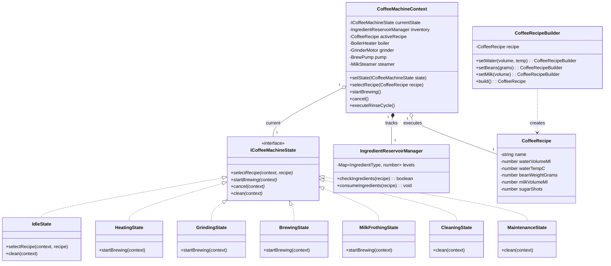
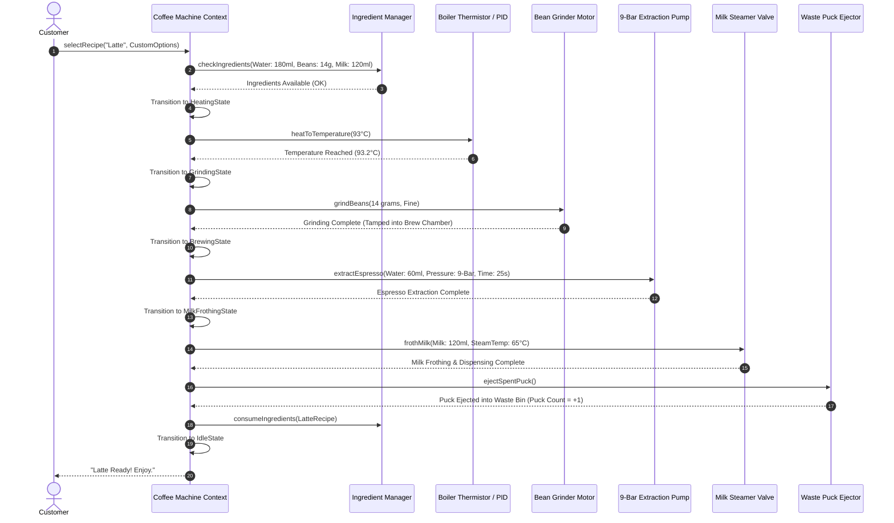
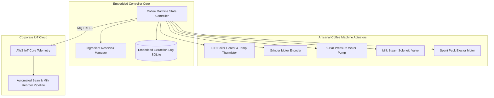

# 🛠️ Enterprise System Design Blueprint: Artisanal Coffee Vending Machine

> **Target Role:** Principal / Staff Architect / Senior LLD & HLD Engineers
> **Product Perspective:** Designing a high-precision, commercial-grade Artisanal Coffee & Espresso Vending Machine state machine system supporting custom beverage recipe creation, parallel actuator hardware orchestration, multi-reservoir ingredient tracking, self-cleaning diagnostic lifecycles, and predictive maintenance telemetry.
> **Navigation:** ⬅️ [Back to Category Index](./README.md) | 📅 [Problem Bank Index](../README.md)

---

## 1. 🎯 Requirements & Product Scope

### 📋 Functional Requirements (FR)

1. **Custom Beverage Recipe Building:**
   - Support standard base recipes (Espresso, Double Espresso, Americano, Cappuccino, Latte, Flat White, Hot Chocolate).
   - Allow granular user customizations: Water volume ($30\text{ ml} - 300\text{ ml}$), Water temperature ($85^\circ\text{C} - 96^\circ\text{C}$), Coffee grind weight ($7\text{g} - 20\text{g}$), Milk volume & froth ratio ($0\% - 100\%$), Sugar level ($0 - 4\text{ shots}$).
2. **Multi-Ingredient Inventory Tracking:**
   - Real-time level monitoring across 5 distinct reservoirs: Water Tank ($5.0\text{ L}$), Bean Hopper ($2.0\text{ kg}$), Fresh Milk Container ($3.0\text{ L}$), Cocoa/Sugar Dispensers ($1.0\text{ kg}$), and Spent Coffee Ground Waste Bin ($50\text{ pucks}$ max).
   - Block order placement if required ingredient levels are insufficient; display `REFILL INGREDIENTS` or `EMPTY WASTE BIN`.
3. **Multi-Step Hardware Brewing State Machine:**
   - Execute precise hardware actuator step sequencing: `Idle` $\to$ `HeatingBoiler` $\to$ `GrindingBeans` $\to$ `TampingGrounds` $\to$ `Brewing` $\to$ `MilkFrothing` $\to$ `Dispensing` $\to$ `EjectingPuck` $\to$ `Idle`.
4. **Automated Cleaning & Thermal Maintenance:**
   - Initiate high-temperature steam rinse cycle after every 10 milk beverages or after 30 minutes of idle time.
   - Maintain PID boiler temperature control ($92^\circ\text{C} \pm 1^\circ\text{C}$).

### ⚡ Non-Functional Requirements (NFR)

1. **Extraction Precision & Temperature Control:**
   - Pump pressure maintained at 9 bars ($\pm 0.2\text{ bar}$) during espresso extraction.
   - Water temperature variance $< 1.0^\circ\text{C}$ during brewing stream execution.
2. **High Throughput & Speed:**
   - Total single espresso extraction time $< 35\text{ seconds}$; Cappuccino preparation $< 55\text{ seconds}$.
3. **Safety & Sanitization:**
   - Milk container temperature held at $4^\circ\text{C}$ continuously using internal thermoelectric chiller. Lock machine if milk container temperature exceeds $8^\circ\text{C}$ for $> 15\text{ minutes}$.

---

## 2. 🧮 Scale & Quantitative Estimates

```
Fleet Footprint: 10,000 commercial coffee machines in corporate offices & airports
Cups Served per Machine: 200 cups/day
Total Daily Network Beverages: 10,000 * 200 = 2,000,000 cups/day

Daily Ingredient Consumption per Machine:
- Water: 200 cups * 150ml = 30 Liters/day (Requires plumbed water line or 6x manual refills)
- Coffee Beans: 200 cups * 12g = 2.4 kg/day
- Milk: 100 milk drinks * 150ml = 15 Liters/day
- Waste Puck Bin Fill Rate: 200 pucks / 50 puck max = Requires 4 empty cycles/day

Telemetry Data Payload:
- Brew Metrics Payload: 2 KB per cup (Extraction curve, pressure graph, grind time, water temp)
- Network Data Volume: 2,000,000 * 2 KB = 4.0 GB / day telemetry ingestion.
```

---

## 3. 🛠️ Tech Stack & Architectural Justifications

| Component | Technology Choice | Architectural Rationale |
| :--- | :--- | :--- |
| **Control System Core** | Node.js / TypeScript on Linux Embedded (ARM Cortex-A72) | Non-blocking event loop handles asynchronous sensor sampling (PID temperature control, flow meters) alongside UI animations seamlessly. |
| **State Machine Framework** | Hierarchical Finite State Machine (HFSM) via State Pattern | Prevents invalid actuator sequences (e.g. running grinder without beans or opening steam valve when boiler temperature is low). |
| **Hardware Driver Interface** | GPIO / Modbus RTU over RS-485 | Standard industrial automation protocol controlling motor drivers, solenoid valves, thermistors, and pressure transducers. |
| **Local Audit Database** | SQLite with WAL (Write-Ahead Logging) | Logs individual cup extraction profiles, error state history, and cleaning timestamps for local diagnostic analysis. |

---

## 4. 📐 Visual UML Diagrams

### 🏗️ Class Diagram (Domain Model & State Machine)



### 🔄 Sequence Diagram: Multi-Step Latte Preparation Lifecycle



---

## 5. 🧱 OOP & SOLID Principles Mapping

- **Single Responsibility Principle (SRP):**
  - `CoffeeMachineContext` handles state transitions and hardware execution workflows.
  - `IngredientReservoirManager` monitors physical liquid levels and waste bin capacities.
  - `CoffeeRecipeBuilder` isolates beverage customization parameters.
- **Open/Closed Principle (OCP):**
  - New beverage types (e.g. `ColdBrewRecipe` or `MatchaLatteRecipe`) extend `CoffeeRecipe` without altering boiler/grinder driver code.
  - New extraction methods (e.g. `NitroColdBrewStrategy`) extend `IBrewingStrategy`.
- **Liskov Substitution Principle (LSP):**
  - All concrete machine states implement `ICoffeeMachineState`. Substituting `HeatingState` for `IdleState` rejects invalid commands without throwing unhandled exceptions.
- **Interface Segregation Principle (ISP):**
  - Narrow hardware interfaces: `IBoilerListener`, `IGrinderListener`, and `IFlowMeterListener`.
- **Dependency Inversion Principle (DIP):**
  - State machine depends on `IActuatorController` abstractions rather than hardcoding raw C-bindings.

---

## 6. 🎨 Design Patterns Selection

1. **State Pattern (Primary):** Manages complex multi-step beverage preparation lifecycle (`Idle`, `Heating`, `Grinding`, `Brewing`, `MilkFrothing`, `Dispensing`, `Cleaning`, `Maintenance`).
2. **Builder Pattern:** `CoffeeRecipeBuilder` constructs custom recipe objects with flexible parameters (water, beans, milk, sugar, temp).
3. **Chain of Responsibility Pattern:** `IngredientCheckHandler` validates reservoirs sequentially (Water Check $\to$ Bean Check $\to$ Milk Check $\to$ Waste Bin Check) before allowing brew execution.
4. **Strategy Pattern:** `IBrewingStrategy` selects distinct extraction profiles (High-Pressure Espresso Extraction vs Low-Pressure Drip Extraction vs Cold Extraction).
5. **Observer Pattern:** Sensors (`BoilerTempObserver`, `WasteBinSensorObserver`) notify the machine context of threshold breaches in real time.

---

## 7. 📂 Production Code Blueprint (TypeScript)

```typescript
// ==========================================
// 1. Domain Entities & Enums
// ==========================================

export enum IngredientType {
  WATER = 'WATER',
  BEANS = 'BEANS',
  MILK = 'MILK',
  SUGAR = 'SUGAR',
  WASTE_BIN = 'WASTE_BIN',
}

export interface CoffeeRecipe {
  name: string;
  waterVolumeMl: number;
  waterTempC: number;
  beanWeightGrams: number;
  milkVolumeMl: number;
  sugarShots: number;
}

// Builder Pattern for Recipe Creation
export class CoffeeRecipeBuilder {
  private recipe: CoffeeRecipe;

  constructor(name: string) {
    this.recipe = {
      name,
      waterVolumeMl: 30,
      waterTempC: 93,
      beanWeightGrams: 9,
      milkVolumeMl: 0,
      sugarShots: 0,
    };
  }

  setWater(volumeMl: number, tempC: number = 93): this {
    this.recipe.waterVolumeMl = volumeMl;
    this.recipe.waterTempC = tempC;
    return this;
  }

  setBeans(grams: number): this {
    this.recipe.beanWeightGrams = grams;
    return this;
  }

  setMilk(volumeMl: number): this {
    this.recipe.milkVolumeMl = volumeMl;
    return this;
  }

  setSugar(shots: number): this {
    this.recipe.sugarShots = shots;
    return this;
  }

  build(): CoffeeRecipe {
    return { ...this.recipe };
  }
}

// ==========================================
// 2. Ingredient Manager & Chain of Responsibility
// ==========================================

export class IngredientReservoirManager {
  private levels: Map<IngredientType, number> = new Map();
  private maxCapacities: Map<IngredientType, number> = new Map();

  constructor() {
    this.levels.set(IngredientType.WATER, 3000); // 3000 ml
    this.levels.set(IngredientType.BEANS, 1000);  // 1000 g
    this.levels.set(IngredientType.MILK, 1500);   // 1500 ml
    this.levels.set(IngredientType.SUGAR, 500);   // 500 g
    this.levels.set(IngredientType.WASTE_BIN, 5); // 5 pucks currently inside (max 50)

    this.maxCapacities.set(IngredientType.WASTE_BIN, 50);
  }

  checkIngredients(recipe: CoffeeRecipe): { ok: boolean; missingIngredient?: IngredientType } {
    if ((this.levels.get(IngredientType.WATER) || 0) < recipe.waterVolumeMl) {
      return { ok: false, missingIngredient: IngredientType.WATER };
    }
    if ((this.levels.get(IngredientType.BEANS) || 0) < recipe.beanWeightGrams) {
      return { ok: false, missingIngredient: IngredientType.BEANS };
    }
    if ((this.levels.get(IngredientType.MILK) || 0) < recipe.milkVolumeMl) {
      return { ok: false, missingIngredient: IngredientType.MILK };
    }
    if ((this.levels.get(IngredientType.WASTE_BIN) || 0) >= (this.maxCapacities.get(IngredientType.WASTE_BIN) || 50)) {
      return { ok: false, missingIngredient: IngredientType.WASTE_BIN };
    }

    return { ok: true };
  }

  consumeIngredients(recipe: CoffeeRecipe): void {
    this.levels.set(IngredientType.WATER, (this.levels.get(IngredientType.WATER) || 0) - recipe.waterVolumeMl);
    this.levels.set(IngredientType.BEANS, (this.levels.get(IngredientType.BEANS) || 0) - recipe.beanWeightGrams);
    this.levels.set(IngredientType.MILK, (this.levels.get(IngredientType.MILK) || 0) - recipe.milkVolumeMl);
    this.levels.set(IngredientType.WASTE_BIN, (this.levels.get(IngredientType.WASTE_BIN) || 0) + 1); // 1 puck added
  }

  emptyWasteBin(): void {
    this.levels.set(IngredientType.WASTE_BIN, 0);
    console.log(`[Maintenance] Spent puck waste bin emptied.`);
  }
}

// ==========================================
// 3. State Pattern Interface
// ==========================================

export interface ICoffeeMachineContext {
  setState(state: ICoffeeMachineState): void;
  getInventory(): IngredientReservoirManager;
  getActiveRecipe(): CoffeeRecipe | null;
  setActiveRecipe(recipe: CoffeeRecipe | null): void;
  executeRinseCycle(): Promise<void>;
  resetSession(): void;
}

export interface ICoffeeMachineState {
  readonly name: string;
  selectRecipe(context: ICoffeeMachineContext, recipe: CoffeeRecipe): void;
  startBrewing(context: ICoffeeMachineContext): Promise<boolean>;
  clean(context: ICoffeeMachineContext): Promise<void>;
}

export abstract class BaseCoffeeMachineState implements ICoffeeMachineState {
  abstract readonly name: string;

  selectRecipe(context: ICoffeeMachineContext, recipe: CoffeeRecipe): void {
    throw new Error(`Cannot select recipe in ${this.name} state.`);
  }

  async startBrewing(context: ICoffeeMachineContext): Promise<boolean> {
    throw new Error(`Cannot start brewing in ${this.name} state.`);
  }

  async clean(context: ICoffeeMachineContext): Promise<void> {
    throw new Error(`Cannot execute cleaning in ${this.name} state.`);
  }
}

// ==========================================
// 4. Concrete States
// ==========================================

export class IdleState extends BaseCoffeeMachineState {
  readonly name = 'IdleState';

  selectRecipe(context: ICoffeeMachineContext, recipe: CoffeeRecipe): void {
    const check = context.getInventory().checkIngredients(recipe);
    if (!check.ok) {
      console.error(`[Inventory Error] Cannot prepare ${recipe.name}. Missing/Full: ${check.missingIngredient}`);
      if (check.missingIngredient === IngredientType.WASTE_BIN) {
        context.setState(new MaintenanceState());
      }
      return;
    }

    console.log(`[Recipe Selected] Selected: ${recipe.name} (${recipe.waterVolumeMl}ml water, ${recipe.beanWeightGrams}g beans)`);
    context.setActiveRecipe(recipe);
    context.setState(new HeatingState());
    context.startBrewing(context);
  }

  async clean(context: ICoffeeMachineContext): Promise<void> {
    context.setState(new CleaningState());
    await context.executeRinseCycle();
    context.setState(new IdleState());
  }
}

export class HeatingState extends BaseCoffeeMachineState {
  readonly name = 'HeatingState';

  async startBrewing(context: ICoffeeMachineContext): Promise<boolean> {
    const recipe = context.getActiveRecipe();
    if (!recipe) throw new Error('No active recipe');

    console.log(`[Hardware Boiler] Heating water to ${recipe.waterTempC}°C...`);
    // Simulated PID delay
    console.log(`[Hardware Boiler] Target temperature reached (${recipe.waterTempC}°C).`);
    
    context.setState(new GrindingState());
    return context.startBrewing(context);
  }
}

export class GrindingState extends BaseCoffeeMachineState {
  readonly name = 'GrindingState';

  async startBrewing(context: ICoffeeMachineContext): Promise<boolean> {
    const recipe = context.getActiveRecipe()!;

    console.log(`[Hardware Grinder] Grinding ${recipe.beanWeightGrams}g beans...`);
    console.log(`[Hardware Tamper] Tamping coffee grounds into portafilter chamber...`);

    context.setState(new BrewingState());
    return context.startBrewing(context);
  }
}

export class BrewingState extends BaseCoffeeMachineState {
  readonly name = 'BrewingState';

  async startBrewing(context: ICoffeeMachineContext): Promise<boolean> {
    const recipe = context.getActiveRecipe()!;

    console.log(`[Hardware Pump] Extracting espresso (${recipe.waterVolumeMl}ml at 9-Bar pressure)...`);
    
    if (recipe.milkVolumeMl > 0) {
      context.setState(new MilkFrothingState());
      return context.startBrewing(context);
    } else {
      return this.finalizeBrew(context);
    }
  }

  private async finalizeBrew(context: ICoffeeMachineContext): Promise<boolean> {
    const recipe = context.getActiveRecipe()!;
    context.getInventory().consumeIngredients(recipe);
    console.log(`[Hardware Ejector] Ejecting spent coffee puck to waste bin.`);
    console.log(`[Beverage Complete] ${recipe.name} is ready!`);
    context.resetSession();
    context.setState(new IdleState());
    return true;
  }
}

export class MilkFrothingState extends BaseCoffeeMachineState {
  readonly name = 'MilkFrothingState';

  async startBrewing(context: ICoffeeMachineContext): Promise<boolean> {
    const recipe = context.getActiveRecipe()!;

    console.log(`[Hardware Steamer] Steaming and frothing ${recipe.milkVolumeMl}ml milk...`);
    console.log(`[Beverage Dispenser] Combining espresso and micro-foam milk...`);

    context.getInventory().consumeIngredients(recipe);
    console.log(`[Hardware Ejector] Ejecting spent coffee puck.`);
    console.log(`[Beverage Complete] Artisanal ${recipe.name} is ready!`);
    
    context.resetSession();
    context.setState(new IdleState());
    return true;
  }
}

export class CleaningState extends BaseCoffeeMachineState {
  readonly name = 'CleaningState';

  async startBrewing(context: ICoffeeMachineContext): Promise<boolean> {
    throw new Error('Machine is currently executing cleaning cycle.');
  }
}

export class MaintenanceState extends BaseCoffeeMachineState {
  readonly name = 'MaintenanceState';

  selectRecipe(context: ICoffeeMachineContext, recipe: CoffeeRecipe): void {
    console.error(`[System Lockout] Machine in Maintenance State. Please empty waste bin / refill ingredients.`);
  }
}

// ==========================================
// 5. Coffee Machine Context Controller
// ==========================================

export class CoffeeMachineContext implements ICoffeeMachineContext {
  private currentState: ICoffeeMachineState;
  private inventory: IngredientReservoirManager;
  private activeRecipe: CoffeeRecipe | null = null;

  constructor() {
    this.inventory = new IngredientReservoirManager();
    this.currentState = new IdleState();
  }

  setState(state: ICoffeeMachineState): void {
    this.currentState = state;
  }

  getInventory(): IngredientReservoirManager { return this.inventory; }
  getActiveRecipe(): CoffeeRecipe | null { return this.activeRecipe; }
  setActiveRecipe(recipe: CoffeeRecipe | null): void { this.activeRecipe = recipe; }

  async executeRinseCycle(): Promise<void> {
    console.log(`[Hardware Sanitization] Flushing steam lines with 95°C water...`);
  }

  resetSession(): void {
    this.activeRecipe = null;
  }

  // Delegation
  selectRecipe(recipe: CoffeeRecipe): void { this.currentState.selectRecipe(this, recipe); }
  async startBrewing(): Promise<boolean> { return this.currentState.startBrewing(this); }
  async clean(): Promise<void> { return this.currentState.clean(this); }
}
```

---

## 8. 🔀 High-Level Design (HLD) & Scale Bottlenecks



### ⚠️ Scalability & Hardware Thermal Bottlenecks

1. **Boiler Thermal Loss Under High-Volume Rush (Airport Peak):**
   - *Problem:* Machine serves 60 espressos back-to-back. Fresh cold water entering the boiler drops water temperature below $88^\circ\text{C}$, souring espresso extraction.
   - *Resolution:* **Dual-Boiler Architecture**. Dedicated Espresso Boiler ($93^\circ\text{C}$) and dedicated Steam Boiler ($125^\circ\text{C}$) with predictive feedforward PID heating triggered as soon as the pump starts.
2. **Milk Hygiene & Bacterial Growth Risk:**
   - *Problem:* Residual milk inside the steam wand spoils if unused for 30 minutes.
   - *Resolution:* Automated **Steam Auto-Purge**. If no milk beverage is ordered within $15\text{ minutes}$, the state machine enters a 3-second steam purge cycle, flushing steam through the wand into a drip tray.

---

## ❓ 9. Collapsed Senior/Staff Level Grill Q&A

<details>
<summary>❓ 1. How do you prevent grinder motor burn-out if a stone or non-coffee object jams the burrs?</summary>

**Answer:**
1. **Motor Current Transducer Monitoring:** The grinder motor driver continuously measures current consumption ($I$).
2. **Over-Current Interrupt:** If current exceeds $3.5\text{ Amps}$ (indicating mechanical burr jam), the hardware driver triggers an instant hardware interrupt, halting the motor within $< 10\text{ms}$.
3. **Automated Reverse & Lockout:** The state machine executes 3 reverse motor pulses ($100\text{ms}$) to dislodge the object. If current remains high, the machine flags `GrinderFault` and transitions to `MaintenanceState`.

</details>

<details>
<summary>❓ 2. How do you handle coffee grind size and extraction pressure tuning dynamically for consistent taste?</summary>

**Answer:**
We implement an **AI-Driven PID Extraction Profiler**:
1. Flow sensors measure flow rate ($\text{ml/sec}$) during extraction.
2. If extraction time for 30ml exceeds 35 seconds (under-extraction / grind too fine), the system automatically adjusts the electronic grinder stepper motor +0.05mm coarser for the next cup.
3. If extraction finishes in $< 18$ seconds (channeling / grind too coarse), the stepper motor adjusts -0.05mm finer.

</details>
