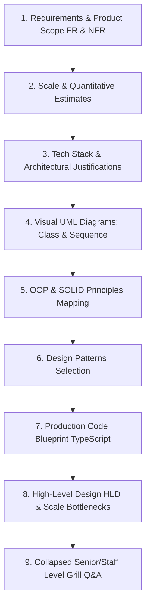

# 🤖 Master System Design Problem Bank — Managing States

> **Target Role:** Principal / Staff Architect / Senior LLD & HLD Engineers  
> **Framework:** Standardized 9-Step Breakdown (Requirements & Product Scope, Scale & Estimates, Tech Stack Justifications, Visual UML Diagrams, OOP & SOLID Mapping, Design Patterns Selection, Production Code Blueprint, HLD & Bottlenecks, and Collapsed Grill Q&A).  
> **Navigation:** ⬅️ [Back to Master Problem Bank](../README.md) | 📅 [8-Week Roadmap](../../ROADMAP.md)

---

## 🧭 Category Overview: Managing States (5 Problems)

| # | Problem Blueprint | Level | Key System Challenges & Architecture Focus | Master Guide Link |
|:---:|:---|:---:|:---|:---:|
| 1 | 📖 **Design ATM** | `Medium` | Finite State Machine, Chain of Responsibility Note Dispenser, ISO 8583 Banking Switch Sync | [01-Design-ATM.md](./01-Design-ATM.md) |
| 2 | 📖 **Design Vending Machine** | `Medium` | State Pattern (Idle, HasMoney, Dispensing), Inventory Rack Grid Allocation, Change Return Algorithm | [02-Design-Vending-Machine.md](./02-Design-Vending-Machine.md) |
| 3 | 📖 **Design Elevator System** | `Medium` | LOOK / SCAN Dispatch Scheduling, Directional Car State Machines, Multi-Elevator Group Controller | [03-Design-Elevator-System.md](./03-Design-Elevator-System.md) |
| 4 | 📖 **Design Traffic Control System** | `Medium` | 4-Way Intersection Signal States, Dynamic Sensor Timing, Emergency VIP Green Corridor Override | [04-Design-Traffic-Control-System.md](./04-Design-Traffic-Control-System.md) |
| 5 | 📖 **Design Coffee Vending Machine** | `Hard` | Custom Beverage Recipe Builder, Multi-Boiler Thermal Management, Parallel Actuator State Engine | [05-Design-Coffee-Vending-Machine.md](./05-Design-Coffee-Vending-Machine.md) |

---

## 📐 Standardized 9-Step Problem Breakdown Framework

Every problem in this module strictly follows the enterprise 9-step system design workflow:

---

## 🧠 Core Architectural Patterns in State Management

1. **State Pattern:** Encapsulates state-dependent behavior inside polymorphic state objects, eliminating monolithic `if/else` or `switch` statements and guaranteeing deterministic hardware transitions.
2. **Strategy Pattern:** Decouples dynamic algorithms (such as cash denomination dispensing, elevator dispatch scheduling, dynamic traffic signal timing, and coffee extraction pressure) from state execution context.
3. **Mediator Pattern:** Centralizes communication between conflicting hardware entities (e.g. 4-way signal lamps in Traffic Control) to guarantee safety invariants.
4. **Observer Pattern:** Connects hardware sensors (optical drop beams, floor proximity interrupts, weight load sensors, thermistors) to state machine context drivers in real time.
5. **Chain of Responsibility Pattern:** Sequentially evaluates hardware validation routines (bill cassette denomination matching, ingredient level verification, hardware interlocks) prior to transaction execution.
