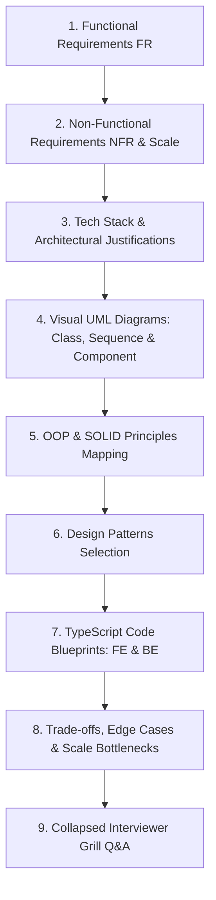

# 🎯 Master System Design Problem Bank — Social & Content Platforms

> **Target Role:** Principal / Staff Architect / Senior LLD & HLD Engineers  
> **Framework:** FUN-SCALE Framework (FR, NFR, Scale Estimates, Tech Stack Justifications, Visual UML Diagrams, OOP & SOLID Mapping, Design Patterns, TypeScript Code Blueprints, Trade-offs & Bottlenecks, and Collapsed Grill Q&A).  
> **Navigation:** ⬅️ [Back to Master Index](../README.md) | 📅 [8-Week Roadmap](../ROADMAP.md)

---

## 🧭 Category: Social & Content Platforms (6 Master Problems)

| # | Problem Blueprint | Level | Key System Challenges | Master Guide Link |
|:---:|:---|:---:|:---|:---:|
| 1 | 📖 **Design Stack Overflow** | `Medium` | Q&A Voting, Reputation Engine, Search Indexing, Tagging | [01-Design-Stack-Overflow.md](./01-Design-Stack-Overflow.md) |
| 2 | 📖 **Design a Social Network** | `Medium` | News Feed Generation (Push vs Pull), Social Graph, Like/Comment Fan-out | [02-Design-Social-Network.md](./02-Design-Social-Network.md) |
| 3 | 📖 **Design Learning Platform** | `Medium` | Video Chunk Streaming, Course Progress Tracking, Quiz Engine, Certificate Minting | [03-Design-Learning-Platform.md](./03-Design-Learning-Platform.md) |
| 4 | 📖 **Design Cricinfo** | `Hard` | Sub-second Live Ball-by-Ball Score Broadcasting, Websocket Fan-out, Thundering Herd | [04-Design-Cricinfo.md](./04-Design-Cricinfo.md) |
| 5 | 📖 **Design LinkedIn** | `Hard` | 2nd/3rd Degree Connection Graph, Job Search Indexing, Feed Ranking | [05-Design-LinkedIn.md](./05-Design-LinkedIn.md) |
| 6 | 📖 **Design Spotify** | `Hard` | Low-latency Audio Chunking/Caching, Offline PWA Playback, Collaborative Playlists | [06-Design-Spotify.md](./06-Design-Spotify.md) |

---

## 📐 Standardized 9-Step Problem Breakdown Framework

Every problem blueprint strictly adheres to this 9-step architect breakdown:

