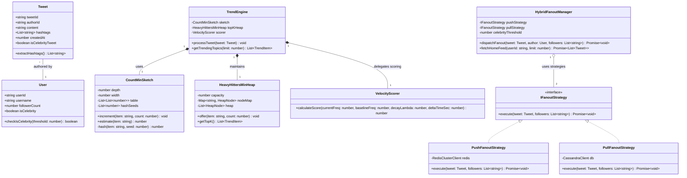
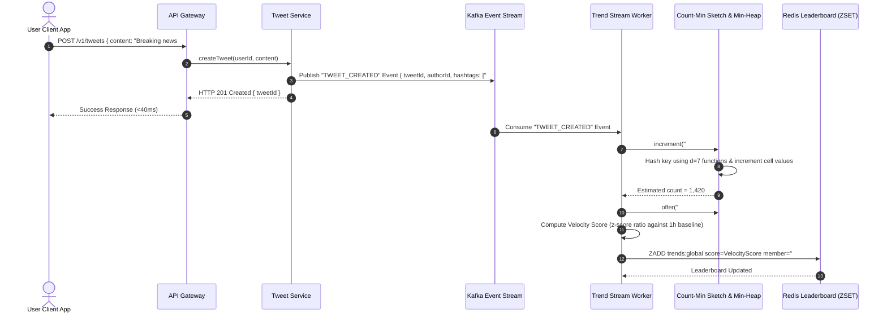
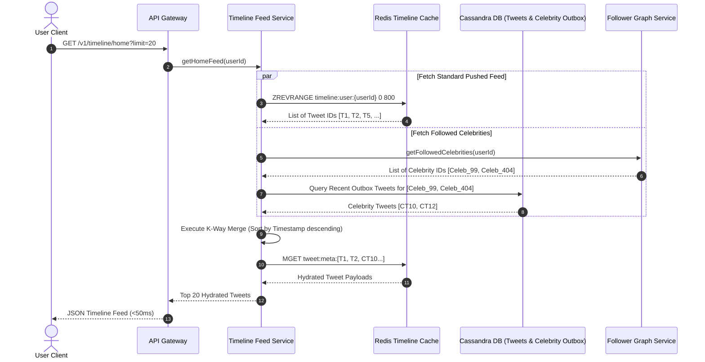

# 🛠️ Enterprise System Design Blueprint: X (Twitter) Trends & Hybrid Timeline System

> **Target Role:** Principal / Staff Architect / Senior LLD & HLD Engineers  
> **Product Perspective:** Real-time trending topic detection engine (Count-Min Sketch + Sliding Window Velocity) & hybrid push/pull timeline feed serving 100M DAU with 500M daily tweets.  
> **Navigation:** ⬅️ [Back to Social & Content Platforms Index](./README.md) | 📅 [8-Week Roadmap](../../ROADMAP.md)

---

## 1. 🎯 Requirements & Product Scope

### 📋 Functional Requirements (FR)

1. **Tweet Ingestion & Tag Extraction:** Users can publish tweets (text up to 280 chars, media references, mentions, and `#hashtags`). The system automatically extracts, normalizes, and tokenizes hashtags and key entities.
2. **Real-time Trending Topics Engine:** Compute top-$K$ trending topics across customizable sliding windows ($5\text{ mins}$, $1\text{ hour}$, $24\text{ hours}$) based on acceleration/velocity rather than raw absolute volume.
3. **Hybrid Timeline Feed Generation:** Provide users with a personalized "Home Feed" containing tweets from followed users, combining real-time push (for standard users) and pull on read (for high-follower celebrity accounts).
4. **Trend Lookup & Details:** Users can inspect a trending topic to view metadata, relative volume surge, velocity metrics, and a curated feed of top/recent tweets containing that hashtag.
5. **Geographic & Categorical Filtering:** Support trend segmentation by country, city, and topic category (e.g., Sports, Technology, News).

### ⚡ Non-Functional Requirements (NFR)

1. **Low Read Latency:** 
   - Trending Topics API $P_{99} < 30\text{ ms}$.
   - Home Timeline Feed API $P_{99} < 50\text{ ms}$.
2. **High Availability & Fault Tolerance:** $99.99\%$ uptime ($< 52.5\text{ mins}$ downtime/year) with graceful degradation under traffic surges.
3. **High Write Throughput:** Ingest $500\text{ Million tweets/day}$ ($\sim 5,787\text{ avg write QPS}$, peak $25,000\text{ write QPS}$) and process up to $1\text{ Billion entity events/day}$.
4. **Real-Time Freshness:** Trends must reflect new viral spikes within $\le 5\text{ seconds}$ of event publication.
5. **Bounded Memory Overhead:** Stream processing algorithms must use sub-linear space ($O(\log N)$ or $O(K)$ bounded memory) using probabilistic data structures.

---

## 2. 🧮 Scale & Quantitative Estimates

```
================================================================================
                    TRAFFIC & DATA CAPACITY MATH (100M DAU)
================================================================================

1. TRAFFIC VOLUME & QPS:
   - Daily Active Users (DAU): 100,000,000
   - Tweets Created per Day: 500,000,000 tweets/day
   - Read to Write Ratio: 20:1
   - Average Tweet Ingestion QPS: 500,000,000 / 86,400s = 5,787 QPS
   - Peak Tweet Ingestion QPS (4.3x multiplier): ~25,000 QPS
   - Average Timeline Read QPS: 5,787 * 20 = 115,740 QPS
   - Peak Timeline Read QPS: 115,740 * 4.3 = ~500,000 QPS
   - Event Stream Throughput (avg 2 entities/hashtags per tweet):
     * 500M * 2 = 1,000,000,000 events/day
     * Avg Event Processing QPS: 11,574 events/sec
     * Peak Event Processing QPS: ~50,000 events/sec

2. STORAGE ESTIMATES (5 Years):
   - Tweet Payload Size: 
     * Tweet ID (8B) + User ID (8B) + Content (280 chars ~ 300B) + Metadata (100B) = ~500 Bytes
   - Daily Tweet Data Volume: 500M * 500 Bytes = 250 GB / day
   - 5-Year Persistent Storage (Raw Tweets): 250 GB * 365 * 5 = ~456.25 TB (Stored in Cassandra/ScyllaDB)
   - Media Metadata Index: ~50 GB / day -> ~91.25 TB (5 Years)

3. RAM CAPACITY & MEMORY FOR TRENDS (Count-Min Sketch):
   - Frequency Error Parameter (ε): 0.001 (0.1% tolerance)
   - Confidence Parameter (δ): 0.001 (99.9% accuracy guarantee)
   - Matrix Depth (d) = ⌈ln(1/δ)⌉ = ⌈ln(1000)⌉ = 7 hash functions
   - Matrix Width (w) = ⌈e/ε⌉ = ⌈2.71828 / 0.001⌉ = 2,719 columns
   - Total Counters per Sketch: 7 * 2,719 = 19,033 counters (32-bit uint = 4 bytes)
   - Single Count-Min Sketch Memory Size: 19,033 * 4 Bytes = ~76.13 KB!
   - 60 Sliding Time Window Buckets (1 min each for 1h window):
     * 60 * 76.13 KB = ~4.56 MB RAM for raw frequency tracking!
   - Top-K Min-Heap (K=1000 elements): ~128 KB RAM
   - Total Trend Engine Memory per Datacenter: < 10 MB RAM (Fits entirely in CPU L3 cache/Fast RAM)

4. TIMELINE CACHE STORAGE (Redis Cluster):
   - Active User Timelines Cached: 100M users * 20% active cache = 20M hot timelines
   - Max Tweet IDs per User Feed: 800 tweet IDs
   - Memory per Timeline: 800 * 8 Bytes (uint64 ID) = 6.4 KB
   - Total Redis Memory Required: 20M * 6.4 KB = 128 GB RAM (Fits in small 4-node Redis Cluster)
```

---

## 3. 🛠️ Tech Stack & Architectural Justifications

| Component | Technology Choice | Architectural Rationale & Trade-offs |
| :--- | :--- | :--- |
| **API & Edge Layer** | Envoy Proxy + API Gateway (Go/Rust) | Sub-millisecond SSL termination, gRPC-Web proxying, global rate-limiting (Token Bucket), and route protection against DDoS. |
| **Event Stream Buffer** | Apache Kafka | Distributed partition-based append log providing durable, ordered event queues. Handles 50,000+ peak event writes/sec with multi-subscriber decoupling. |
| **Stream Processing Engine** | Custom Node.js/TypeScript Worker or Apache Flink | Executes continuous windowed aggregations, sliding time-decay computations, and updating probabilistic structures. |
| **In-Memory Cache & Leaderboard** | Redis Cluster (ZSET) | Stores pre-computed trending topics leaderboard keyed by score (`ZADD`/`ZREVRANGE`). Also holds hot push-fanout timelines. |
| **Probabilistic Data Structure** | Count-Min Sketch + Heavy Hitters Min-Heap | Bounded memory ($O(1)$ space) frequency estimation for unbounded streaming data, eliminating heavy DB queries or giant hashtables. |
| **Primary Persistent Storage** | Apache Cassandra / ScyllaDB | Masterless wide-column distributed NoSQL DB. Optimized for append-heavy write workloads ($25\text{k QPS}$) with tunable consistency (`LOCAL_QUORUM`). |
| **Celebrity Outbox & Metadata** | PostgreSQL (Sharded with Citus) | Strict ACID compliance for User Profiles, Follower Graph edges, and Celebrity Tweet Outboxes with indexing. |

---

## 4. 📐 Visual UML & Architecture Diagrams

### 🏗️ Class Diagram (Low-Level Domain Models & Design Contracts)



---

### 🔄 Sequence Diagram 1: Real-Time Trend Ingestion & Count-Min Sketch Update



---

### 🔄 Sequence Diagram 2: Hybrid Timeline Fan-out & Feed Retrieval



---

### 🧩 Component & System Architecture Diagram (HLD)

```mermaid
graph TB
    subgraph Client Layer
        Web[Web Client App]
        Mobile[Mobile iOS/Android App]
    end

    subgraph Edge & API Gateway Layer
        Envoy[Envoy API Gateway / Auth Guard]
        RL[Redis Token Bucket Rate Limiter]
    end

    subgraph Event Streaming & Messaging Layer
        Kafka{{Kafka Ingestion Cluster}}
        TopicTweets[Topic: tweet-created-events]
        TopicFanout[Topic: timeline-fanout-tasks]
    end

    subgraph Real-Time Trend Engine
        Flink[Trend Stream Worker / Flink]
        CMS[Count-Min Sketch Engine]
        Heap[Heavy Hitters Min-Heap]
        VelCalc[Velocity Scorer & Window Manager]
    end

    subgraph Fan-Out & Timeline Subsystem
        FanoutWorker[Fanout Async Worker Pool]
        CelebrityGuard[Celebrity Fanout Router]
    end

    subgraph Data & Storage Layer
        RedisCluster[(Redis Cluster: ZSET Trends & Push Timelines)]
        Cassandra[(Cassandra NoSQL: Raw Tweets & Celebrity Outbox)]
        UserGraph[(PostgreSQL Sharded: User Profiles & Follow Graph)]
    end

    Web --> Envoy
    Mobile --> Envoy
    Envoy --> RL
    Envoy --> Kafka
    
    Kafka --> TopicTweets
    TopicTweets --> Flink
    TopicTweets --> FanoutWorker

    Flink --> CMS
    CMS --> Heap
    Heap --> VelCalc
    VelCalc -->|ZADD Score| RedisCluster

    FanoutWorker --> CelebrityGuard
    CelebrityGuard -->|< 10k Followers (Push)| RedisCluster
    CelebrityGuard -->|> 10k Followers (Pull Outbox)| Cassandra
    FanoutWorker --> UserGraph

    Envoy -->|Fetch Home Feed| RedisCluster
    Envoy -->|Fetch Celebrity Tweets| Cassandra
```

---

## 5. 🧱 OOP & SOLID Principles Mapping

- **Single Responsibility Principle (SRP):**
  - `CountMinSketch`: Strictly handles probabilistic frequency estimations in fixed memory.
  - `VelocityScorer`: Exclusively calculates acceleration and decay mathematical models without coupling to storage engines.
  - `HybridFanoutManager`: Dedicated solely to orchestrating timeline delivery strategies.
- **Open/Closed Principle (OCP):**
  - Timeline delivery is defined by an `IFanoutStrategy` interface. Adding a new `TieredFanoutStrategy` (e.g., region-aware edge fan-out) extends the architecture without modifying core timeline handlers.
- **Liskov Substitution Principle (LSP):**
  - `PushFanoutStrategy` and `PullFanoutStrategy` implement `IFanoutStrategy` cleanly. `HybridFanoutManager` treats both strategies polymorphically without side effects.
- **Interface Segregation Principle (ISP):**
  - `ITrendQueryable` exposes `getTopK()` for read APIs, while `ITrendIngestor` exposes `recordEvent()` for ingestion workers, preventing stream processors from depending on query interfaces.
- **Dependency Inversion Principle (DIP):**
  - `TrendEngine` depends on abstract abstractions (`ICountMinSketch`, `IVelocityScorer`, `ITrendStore`) rather than concrete Redis or Kafka SDK classes, allowing seamless mock injection during unit tests.

---

## 6. 🎨 Design Patterns Selection

1. **Strategy Pattern:** Used in `HybridFanoutManager` to switch between `PushFanoutStrategy` (write-heavy push to Redis for low-follower users) and `PullFanoutStrategy` (read-time outbox query for celebrities).
2. **Observer Pattern:** Implemented via Apache Kafka event topics where multiple independent microservices (`TrendEngine`, `FanoutWorker`, `SearchIndexer`, `AnalyticsEngine`) react asynchronously to `TWEET_CREATED` events.
3. **Command Pattern:** `FanoutCommand` encapsulates fan-out payloads (tweet ID, target follower batch, author ID) into background tasks queued in worker thread pools.
4. **Sliding Window Pattern:** Maintained by the Trend Engine to track hashtag frequencies across discrete time buckets ($1\text{-minute}$ buckets across a $60\text{-minute}$ rolling window) for velocity decay calculations.
5. **Decorator Pattern:** Wraps `TrendEngine` with `BotProtectionDecorator` and `GeoFilterDecorator` to filter spam and add spatial tag metadata without altering baseline frequency calculations.

---

## 7. 💻 Production Code Blueprint (TypeScript Implementation)

### 1️⃣ Count-Min Sketch Data Structure (`CountMinSketch.ts`)

```typescript
/**
 * Production-Grade Count-Min Sketch Implementation
 * Provides O(1) time complexity for frequency updates and estimations with O(1) sub-linear memory space.
 */
export class CountMinSketch {
  private readonly depth: number;
  private readonly width: number;
  private readonly table: Uint32Array[];
  private readonly hashSeeds: number[];

  /**
   * @param epsilon Frequency error tolerance (e.g., 0.001 = 0.1% error)
   * @param delta Confidence parameter (e.g., 0.001 = 99.9% confidence)
   */
  constructor(epsilon: number = 0.001, delta: number = 0.001) {
    this.width = Math.ceil(Math.E / epsilon);
    this.depth = Math.ceil(Math.log(1 / delta));
    this.table = Array.from({ length: this.depth }, () => new Uint32Array(this.width));
    
    // Generate distinct hash seeds for independent Murmur/FNV hash variants
    this.hashSeeds = Array.from({ length: this.depth }, (_, i) => (i + 1) * 0x9e3779b9);
  }

  /**
   * Fast FNV-1a Hash function variant with custom seed.
   */
  private hash(item: string, seed: number): number {
    let hash = seed ^ 0x811c9dc5;
    for (let i = 0; i < item.length; i++) {
      hash ^= item.charCodeAt(i);
      hash = Math.imul(hash, 0x01000193);
    }
    return (hash >>> 0) % this.width;
  }

  /**
   * Increments item frequency in the sketch table using Conservative Update.
   */
  public increment(item: string, count: number = 1): void {
    const key = item.toLowerCase();
    const currentMin = this.estimate(key);
    
    for (let i = 0; i < this.depth; i++) {
      const col = this.hash(key, this.hashSeeds[i]);
      // Conservative Update Rule: Only increment counters that match the minimum current estimate
      if (this.table[i][col] <= currentMin) {
        this.table[i][col] += count;
      }
    }
  }

  /**
   * Estimates item frequency by returning the minimum across hash rows.
   */
  public estimate(item: string): number {
    const key = item.toLowerCase();
    let min = Infinity;

    for (let i = 0; i < this.depth; i++) {
      const col = this.hash(key, this.hashSeeds[i]);
      min = Math.min(min, this.table[i][col]);
    }

    return min === Infinity ? 0 : min;
  }

  public getDimensions(): { depth: number; width: number; bytes: number } {
    const totalCounters = this.depth * this.width;
    return {
      depth: this.depth,
      width: this.width,
      bytes: totalCounters * Uint32Array.BYTES_PER_ELEMENT,
    };
  }
}
```

---

### 2️⃣ Heavy-Hitters Min-Heap & Trend Engine (`TrendEngine.ts`)

```typescript
import { CountMinSketch } from './CountMinSketch';

export interface TrendItem {
  hashtag: string;
  frequency: number;
  velocityScore: number;
  updatedAt: number;
}

export class HeavyHittersMinHeap {
  private heap: TrendItem[] = [];
  private indexMap: Map<string, number> = new Map();

  constructor(private readonly capacity: number = 1000) {}

  public offer(item: TrendItem): void {
    const existingIndex = this.indexMap.get(item.hashtag);

    if (existingIndex !== undefined) {
      this.heap[existingIndex] = item;
      this.bubbleDown(existingIndex);
      this.bubbleUp(existingIndex);
    } else if (this.heap.length < this.capacity) {
      this.heap.push(item);
      const newIndex = this.heap.length - 1;
      this.indexMap.set(item.hashtag, newIndex);
      this.bubbleUp(newIndex);
    } else if (item.velocityScore > this.heap[0].velocityScore) {
      this.indexMap.delete(this.heap[0].hashtag);
      this.heap[0] = item;
      this.indexMap.set(item.hashtag, 0);
      this.bubbleDown(0);
    }
  }

  public getTopK(): TrendItem[] {
    return [...this.heap].sort((a, b) => b.velocityScore - a.velocityScore);
  }

  private bubbleUp(idx: number): void {
    while (idx > 0) {
      const parent = Math.floor((idx - 1) / 2);
      if (this.heap[idx].velocityScore < this.heap[parent].velocityScore) {
        this.swap(idx, parent);
        idx = parent;
      } else break;
    }
  }

  private bubbleDown(idx: number): void {
    const len = this.heap.length;
    while (true) {
      let smallest = idx;
      const left = 2 * idx + 1;
      const right = 2 * idx + 2;

      if (left < len && this.heap[left].velocityScore < this.heap[smallest].velocityScore) {
        smallest = left;
      }
      if (right < len && this.heap[right].velocityScore < this.heap[smallest].velocityScore) {
        smallest = right;
      }
      if (smallest !== idx) {
        this.swap(idx, smallest);
        idx = smallest;
      } else break;
    }
  }

  private swap(i: number, j: number): void {
    this.indexMap.set(this.heap[i].hashtag, j);
    this.indexMap.set(this.heap[j].hashtag, i);
    const temp = this.heap[i];
    this.heap[i] = this.heap[j];
    this.heap[j] = temp;
  }
}

/**
 * Calculates acceleration/velocity score for hashtag surge detection.
 * Score = (CurrentFrequency - HistoricalBaseline) / sqrt(HistoricalBaseline + 1)
 */
export class VelocityScorer {
  public calculateZScoreVelocity(currentFreq: number, baselineFreq: number): number {
    const expected = Math.max(baselineFreq, 1);
    const delta = currentFreq - expected;
    // Normalized acceleration ratio avoiding division by zero
    return delta / Math.sqrt(expected);
  }
}

export class RealtimeTrendEngine {
  private currentSketch: CountMinSketch;
  private baselineSketch: CountMinSketch;
  private minHeap: HeavyHittersMinHeap;
  private scorer: VelocityScorer;

  constructor() {
    this.currentSketch = new CountMinSketch(0.001, 0.001);
    this.baselineSketch = new CountMinSketch(0.001, 0.001);
    this.minHeap = new HeavyHittersMinHeap(1000);
    this.scorer = new VelocityScorer();
  }

  public processHashtags(hashtags: string[]): void {
    const now = Date.now();
    for (const tag of hashtags) {
      const cleanTag = tag.startsWith('#') ? tag : `#${tag}`;
      this.currentSketch.increment(cleanTag);
      
      const currentFreq = this.currentSketch.estimate(cleanTag);
      const baselineFreq = this.baselineSketch.estimate(cleanTag);
      const velocityScore = this.scorer.calculateZScoreVelocity(currentFreq, baselineFreq);

      this.minHeap.offer({
        hashtag: cleanTag,
        frequency: currentFreq,
        velocityScore,
        updatedAt: now,
      });
    }
  }

  public getTrendingLeaderboard(limit: number = 50): TrendItem[] {
    return this.minHeap.getTopK().slice(0, limit);
  }
}
```

---

### 3️⃣ Hybrid Push/Pull Timeline Fan-out (`HybridFanoutManager.ts`)

```typescript
export interface TweetPayload {
  tweetId: string;
  authorId: string;
  content: string;
  timestamp: number;
}

export interface UserProfile {
  userId: string;
  followerCount: number;
  isCelebrity: boolean;
}

export interface IFanoutStrategy {
  execute(tweet: TweetPayload, followerIds: string[]): Promise<void>;
}

export class PushFanoutStrategy implements IFanoutStrategy {
  constructor(private redisCluster: any) {}

  public async execute(tweet: TweetPayload, followerIds: string[]): Promise<void> {
    const pipeline = this.redisCluster.pipeline();
    for (const followerId of followerIds) {
      const key = `timeline:user:${followerId}`;
      // Push tweet ID onto follower timeline ZSET sorted by timestamp
      pipeline.zadd(key, tweet.timestamp, tweet.tweetId);
      // Trim timeline to maintain max 800 recent tweets
      pipeline.zremrangebyrank(key, 0, -801);
    }
    await pipeline.exec();
  }
}

export class PullFanoutStrategy implements IFanoutStrategy {
  constructor(private cassandraDb: any) {}

  public async execute(tweet: TweetPayload): Promise<void> {
    // Write tweet payload into author's Celebrity Outbox table in Cassandra
    const query = `
      INSERT INTO celebrity_outbox (author_id, tweet_id, content, created_at)
      VALUES (?, ?, ?, ?)
    `;
    await this.cassandraDb.execute(query, [
      tweet.authorId,
      tweet.tweetId,
      tweet.content,
      new Date(tweet.timestamp),
    ]);
  }
}

export class HybridFanoutManager {
  private readonly CELEBRITY_FOLLOWER_THRESHOLD = 10000;

  constructor(
    private pushStrategy: PushFanoutStrategy,
    private pullStrategy: PullFanoutStrategy,
    private userGraphService: any,
    private redisClient: any,
    private cassandraDb: any
  ) {}

  public async dispatchTweet(tweet: TweetPayload, author: UserProfile): Promise<void> {
    if (author.followerCount >= this.CELEBRITY_FOLLOWER_THRESHOLD || author.isCelebrity) {
      // Celebrity User -> Write to Celebrity Outbox (PULL Strategy)
      await this.pullStrategy.execute(tweet, []);
    } else {
      // Standard User -> Fan-out to all followers' Redis Timelines (PUSH Strategy)
      const followers = await this.userGraphService.getFollowerIds(author.userId);
      await this.pushStrategy.execute(tweet, followers);
    }
  }

  /**
   * Merges Pushed Redis Timelines with Pulled Celebrity Outboxes on feed read.
   */
  public async getHomeFeed(userId: string, limit: number = 20): Promise<TweetPayload[]> {
    // 1. Fetch pushed timeline tweet IDs from Redis
    const pushedTweetIds: string[] = await this.redisClient.zrevrange(`timeline:user:${userId}`, 0, 100);

    // 2. Fetch list of celebrities followed by this user
    const followedCelebrityIds: string[] = await this.userGraphService.getFollowedCelebrities(userId);

    // 3. Fetch recent outbox tweets for followed celebrities from Cassandra
    const celebrityTweets: TweetPayload[] = [];
    if (followedCelebrityIds.length > 0) {
      const query = `SELECT * FROM celebrity_outbox WHERE author_id IN ? LIMIT 50`;
      const result = await this.cassandraDb.execute(query, [followedCelebrityIds]);
      for (const row of result.rows) {
        celebrityTweets.push({
          tweetId: row.tweet_id,
          authorId: row.author_id,
          content: row.content,
          timestamp: new Date(row.created_at).getTime(),
        });
      }
    }

    // 4. Hydrate pushed tweet metadata
    const pushedTweets: TweetPayload[] = await this.hydrateTweets(pushedTweetIds);

    // 5. K-Way Merge & Sort by Timestamp Descending
    const combined = [...pushedTweets, ...celebrityTweets];
    combined.sort((a, b) => b.timestamp - a.timestamp);

    return combined.slice(0, limit);
  }

  private async hydrateTweets(tweetIds: string[]): Promise<TweetPayload[]> {
    if (tweetIds.length === 0) return [];
    const keys = tweetIds.map((id) => `tweet:meta:${id}`);
    const rawData = await this.redisClient.mget(keys);
    return rawData.filter(Boolean).map((str: string) => JSON.parse(str));
  }
}
```

---

## 8. 🏗️ High-Level Design (HLD) & Scale Bottlenecks Deep Dive

### 1️⃣ Celebrity Fan-out Protection ("The Justin Bieber Problem")
- **The Bottleneck:** When an account with $100\text{ Million followers}$ posts a tweet, executing a naive push fan-out requires $100\text{ Million Redis writes}$. At $50\text{k QPS}$, a single celebrity tweet locks/saturates Redis nodes for minutes, causing severe cascading queue backpressure.
- **Architectural Solution (Hybrid Push/Pull Model):**
  - **Dynamic Thresholding:** Accounts with $> 10,000\text{ followers}$ are flagged as `isCelebrity = true`.
  - **Push Strategy (< 10k Followers):** Tweets are asynchronously pushed into every follower's Redis timeline list (`ZADD timeline:user:{followerId}`).
  - **Pull Strategy (> 10k Followers):** Celebrity tweets bypass follower fan-out completely. They are written to a single row in the `celebrity_outbox` table in Cassandra.
  - **Read-Time K-Way Merge:** When a reader calls `GET /v1/timeline/home`, the Feed Service fetches their pushed Redis timeline and queries Cassandra for recent tweets from the subset of celebrities they follow, performing a $O(N \log K)$ merge-sort in memory before returning top $20$ items.

```
       [ Tweet Published ]
               |
     Is Author Followers >= 10k?
          /         \
    (Yes / Pull)   (No / Push)
        /             \
 [ Write 1 Row to ]   [ Fan-out to 500 Followers ]
 [ Cassandra Outbox]  [ Redis Timelines In Parallel]
```

---

### 2️⃣ Count-Min Sketch Accuracy & Frequency Overestimation
- **The Bottleneck:** Probabilistic hashing in Count-Min Sketch can lead to hash collisions between unrelated tags (e.g., `#IPL2026` colliding with `#Crypto`), artificially inflating estimates for lower-frequency tags.
- **Architectural Solution:**
  - **Conservative Update Rule:** When incrementing counters across $d=7$ rows, estimate the current minimum value $M = \min_{i} T[i][h_i(x)]$. Only increment table cells where $T[i][h_i(x)] == M$. This reduces overestimation error by up to $80\%$.
  - **Heavy Hitters Validation:** The Min-Heap stores verified candidates. Every candidate offered to the heap must pass a validation check against historical baselines to prevent noise items from polluting the top-$K$ array.

---

### 3️⃣ Real-Time Velocity vs Absolute Volume (Surge Detection Algorithm)
- **The Bottleneck:** Raw count algorithms cause static high-volume tags (e.g., `#GoodMorning`, `#Cricket`) to permanently lock out breaking news topics (e.g., `#Earthquake`, `#SuperBowl`).
- **Architectural Solution (Z-Score Acceleration Score):**
  - Compute a rolling velocity score comparing current window frequency ($F_{\text{current}}$, $5\text{ mins}$) against an exponential moving average historical baseline ($F_{\text{baseline}}$, $1\text{ hour}$):

$$S = \frac{F_{\text{current}} - F_{\text{baseline}}}{\sqrt{F_{\text{baseline}} + 1}} \cdot e^{-\lambda \Delta t}$$

  - A sudden jump from $10$ to $5,000$ mentions yields a massive velocity score surge, outranking a static tag holding steady at $50,000$ mentions.

---

### 4️⃣ Anti-Gaming & Bot Prevention Engine
- **The Bottleneck:** Malicious botnets spam targeted hashtags to artificially force topics onto global trends.
- **Architectural Solution:**
  - **Unique Author Filtering:** Count-Min Sketch ingestion workers ignore duplicate tweets from the same `userId` for a given hashtag within a $15\text{-minute}$ window using a Redis Bloom Filter (`BF.ADD tag:user:{userId} {hashtag}`).
  - **Account Reputation Weighting:** Tweets from newly created or unverified accounts carry a fractional weight ($0.1$), whereas verified accounts carry full weight ($1.0$).

---

## 9. ❓ Collapsed Senior/Staff Level Grill Q&A

<details>
<summary>❓ 1. How do you handle Count-Min Sketch frequency inflation caused by heavy hash collisions in streaming data?</summary>

**Answer:**
Count-Min Sketch naturally guarantees **no false negatives**, but suffers from **false positives (overestimation)** due to hash collisions. We mitigate inflation through three production techniques:

1. **Conservative Update Algorithm:** During `increment(key, count)`, compute the current estimate $M = \text{estimate}(key)$. Only increment counters in rows where `table[row][col] == M`. This prevents high-frequency items from inflating counters of lower-frequency items in shared hash buckets.
2. **Optimal Parameter Tuning:** Set matrix depth $d = \lceil\ln(1/\delta)\rceil = 7$ (using independent Murmur3 seeds) and width $w = \lceil e/\epsilon\rceil = 2,719$, guaranteeing that errors exceed $\epsilon N$ with probability at most $\delta = 0.1\%$.
3. **Decayed Sliding Windows:** Maintain separate 1-minute bucket sketches. Frequency for a 1-hour window is computed by summing across buckets rather than maintaining a single monolithic counters table, allowing stale collision counts to naturally drop off.

</details>

<details>
<summary>❓ 2. What happens when a user crosses the 10,000 followers threshold while online? How do you prevent timeline feed inconsistencies?</summary>

**Answer:**
Transitioning a user from Standard (PUSH) to Celebrity (PULL) status is handled via a **Soft Buffer & Async Migration Worker**:

1. **Hysteresis Thresholding:** To prevent rapid toggling for users hovering around $10,000$ followers, we use hysteresis bounds (Promote to Celebrity at $> 12,000$ followers; Demote to Standard at $< 8,000$ followers).
2. **Async Profile Flag Update:** An Event Worker listens to `FOLLOWER_ADDED` events. When a user crosses $12,000$, it sets `user.is_celebrity = true` in PostgreSQL and invalidates the user's profile cache in Redis.
3. **Graceful Timeline Migration:** 
   - New tweets immediately switch to writing to `celebrity_outbox` in Cassandra.
   - A background thread schedules purging of the author's previous tweets from followers' Redis timelines over a 24-hour window, while the Read Aggregator handles fallback deduplication by checking tweet IDs against both sources during feed fetching.

</details>

<details>
<summary>❓ 3. How do you mathematically prevent persistent high-volume tags (e.g. #GoodMorning) from permanently dominating real-time breaking news trends?</summary>

**Answer:**
We decouple raw volume from **Velocity Acceleration**:

$$S_{\text{trend}} = \frac{C_{\text{current}} - \mu_{\text{historical}}}{\sigma_{\text{historical}} + \epsilon}$$

- $C_{\text{current}}$ is the mention count in the current 5-minute sliding window.
- $\mu_{\text{historical}}$ and $\sigma_{\text{historical}}$ represent the 24-hour moving average and standard deviation for that specific tag.
- `#GoodMorning` has a high $C_{\text{current}}$ ($50,000$), but also a high $\mu_{\text{historical}}$ ($49,500$), yielding a Z-Score near $0$.
- A breaking news event (`#Earthquake`) jumping from $\mu_{\text{historical}} = 5$ to $C_{\text{current}} = 8,000$ yields a massive Z-Score ($> 3,500$), immediately propelling it to the top of the Redis ZSET leaderboard.

</details>

<details>
<summary>❓ 4. High-frequency tweet deletions cause severe Tombstone Read Latency degradation in Cassandra. How do you mitigate this?</summary>

**Answer:**
In Cassandra, `DELETE` operations write **Tombstone markers**. When querying a partition with thousands of tombstones, read latencies spike dramatically ($> 500\text{ ms}$) due to scanning deleted SSTable slices. We mitigate this via:

1. **Soft Deletes in Redis Cache:** Tweet deletions write a fast bitmask flag in Redis (`SET tweet:deleted:{id} 1 EX 86400`). Read aggregators filter out deleted IDs prior to rendering.
2. **Short GC Grace Seconds:** Set `gc_grace_seconds = 86400` ($1\text{ day}$) on `celebrity_outbox` tables (down from default 10 days) alongside `LeveledCompactionStrategy (LCS)` to aggressively compact and clear tombstones.
3. **Partition Truncation by Time Window:** Instead of deleting individual rows, tables are partitioned by day (`celebrity_outbox_yyyy_mm_dd`). Expired partitions are dropped instantly via `DROP TABLE`, bypassing row tombstones completely.

</details>

<details>
<summary>❓ 5. How do you replicate trending topic leaderboards across multi-region datacenters (US East, EU West, Asia Pacific) without cross-region write lock contention?</summary>

**Answer:**
We implement **Local Ingestion with Asynchronous Global CRDT Aggregation**:

1. **Local Regional Ingestion:** Each region runs independent Kafka clusters and Local Count-Min Sketch workers processing local user tweets locally with $< 5\text{ ms}$ latency.
2. **Kafka MirrorMaker 2.0 Streaming:** Raw regional top-1000 trend metrics are aggregated locally every 5 seconds and published over Kafka MM2 to a Global Trend Aggregator datacenter.
3. **Commutative Count Merge:** Since Count-Min Sketch tables are additive matrix counters, the Global Aggregator performs a simple matrix addition across regional sketch arrays ($T_{\text{global}} = T_{\text{US}} + T_{\text{EU}} + T_{\text{APAC}}$) and computes unified velocity scores.
4. **Edge CDN Distribution:** Global ZSET leaderboards are pushed back to regional Redis clusters and cached at Cloudflare/Fastly edge nodes with a $5\text{-second}$ TTL, ensuring ultra-low $P_{99} < 20\text{ ms}$ global read response times.

</details>
