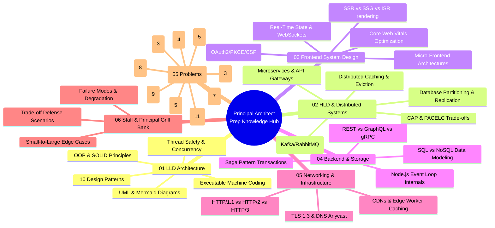

# 🎯 Principal & Staff Architect System Design Knowledge Hub

> **Target Roles:** Staff Engineer / Principal Engineer / Systems Architect  
> **Structure:** 80% Frontend Depth | 20% Backend Awareness | 55 Master Blueprints | LLD + HLD + Networks + Systems  
> **Interactive Web App:** [`LLD/`](file:///Users/atulkumarawasthi/projects/SystemDesign/LLD/src/data/problemsData.js) (Interactive React Playground & Visual Simulator)

---

## 🧭 System Preparation Master Navigation Portal

> [!TIP]
> **How to Navigate:** Use the interactive tables below to jump directly to any topic, theory module, or production-grade problem blueprint. Every file includes functional/non-functional requirements, Mermaid diagrams, production TypeScript/JavaScript code, and Staff/Principal level interview grill Q&A.

| Module | Core Domain Focus | Sub-Topics & Master Guides | Direct Index Link |
| :--- | :--- | :--- | :--- |
| **01-LLD** | Low-Level Design & Object-Oriented Architecture | OOP Pillars, S.O.L.I.D. Principles, 10 Design Patterns, Machine Coding, UML Diagrams, Concurrency | 📖 [01-LLD/README.md](./01-LLD/README.md) |
| **02-HLD** | High-Level Design & Distributed Systems | Microservices, Caching Strategies, Database Sharding, Messaging Queues, Consensus, CAP/PACELC | 📖 [02-HLD/README.md](./02-HLD/README.md) |
| **03-Frontend-SD** | Frontend System Design & Web Architecture | Core Web Vitals, Rendering Strategies (SSR/SSG/ISR), React Internals, Micro-Frontends, Web Security | 📖 [03-Frontend-SD/README.md](./03-Frontend-SD/README.md) |
| **04-Backend-Awareness** | Backend Engineering for FE/Fullstack Architects | Async I/O Event Loop, REST/GraphQL/gRPC, SQL vs NoSQL, Distributed Saga Transactions | 📖 [04-Backend-Awareness/README.md](./04-Backend-Awareness/README.md) |
| **05-Networks-Web** | Network Protocols & Web Infrastructure | HTTP/1.1 vs HTTP/2 vs HTTP/3, TLS 1.3 Handshake, DNS Routing, CDNs, WebSockets vs SSE | 📖 [05-Networks-Web/README.md](./05-Networks-Web/README.md) |
| **06-Interview-QA** | Staff/Principal Level Scenario & Grill Bank | Scenario Edge Cases Bank (Thundering Herd, Race Conditions), Staff Behavioral & System Grill Q&A | 📖 [06-Interview-QA/README.md](./06-Interview-QA/README.md) |
| **07-Problem-Bank** | 55 Master System Design & LLD Blueprints | 9 Categories, 55 Production Blueprints, Domain Search Architecture Comparison Guide | 📖 [07-Problem-Bank/README.md](./07-Problem-Bank/README.md) |

---

## 🗺️ Visual Architecture Map



---

## 🏆 Master System Design & LLD Problem Bank (55 Blueprints across 9 Categories)

👉 🔍 **[Special Guide: Search Architecture Across Tech Giants (Google vs Amazon vs Social Search)](./07-Problem-Bank/DOMAIN-SEARCH-COMPARISON.md)**

### Category 1: 🎮 Games & Puzzles (4 Problems) — [Index](./07-Problem-Bank/Games%20&%20Puzzles/README.md)
* 📖 **[Design Tic Tac Toe](./07-Problem-Bank/Games%20&%20Puzzles/01-Design-Tic-Tac-Toe.md)** (`Easy`) — $O(1)$ turn & win verification, Strategy pattern.
* 📖 **[Design Snake and Ladder Game](./07-Problem-Bank/Games%20&%20Puzzles/02-Design-Snake-and-Ladder.md)** (`Easy`) — Graph cycle detection, dice strategy.
* 📖 **[Design Minesweeper Game](./07-Problem-Bank/Games%20&%20Puzzles/03-Design-Minesweeper.md)** (`Medium`) — Safe first click, BFS zero-cascade reveal.
* 📖 **[Design Chess Game](./07-Problem-Bank/Games%20&%20Puzzles/04-Design-Chess-Game.md)** (`Hard`) — Polymorphic piece movement, checkmate detection.

### Category 2: 🌿 Data Structures & Search (11 Problems) — [Index](./07-Problem-Bank/Data%20Structures%20&%20Search/README.md)
* 📖 **[Design LRU Cache](./07-Problem-Bank/Data%20Structures%20&%20Search/01-Design-LRU-Cache.md)** (`Easy`) — $O(1)$ Hash + Doubly LinkedList eviction, lock partitioning.
* 📖 **[Design Bloom Filter](./07-Problem-Bank/Data%20Structures%20&%20Search/02-Design-Bloom-Filter.md)** (`Easy`) — Bit vector allocation, 0% false negatives.
* 📖 **[Design Search Autocomplete System](./07-Problem-Bank/Data%20Structures%20&%20Search/03-Design-Search-Autocomplete.md)** (`Easy`) — Trie prefix tree, top-K suggestion nodes.
* 📖 **[Design Simple Search Engine](./07-Problem-Bank/Data%20Structures%20&%20Search/04-Design-Simple-Search-Engine.md)** (`Medium`) — Inverted index posting lists, TF-IDF ranking.
* 📖 **[Design LFU Cache](./07-Problem-Bank/Data%20Structures%20&%20Search/05-Design-LFU-Cache.md)** (`Hard`) — $O(1)$ min-frequency hash map + Doubly LinkedList.
* 📖 **[Design Trie with Fuzzy Search](./07-Problem-Bank/Data%20Structures%20&%20Search/06-Design-Trie-Fuzzy-Search.md)** (`Medium`) — Wildcard `.` matching, Levenshtein edit distance.
* 📖 **[Design Streaming Median Finder](./07-Problem-Bank/Data%20Structures%20&%20Search/07-Design-Streaming-Median-Finder.md)** (`Hard`) — Two-Heap balance (MaxHeap + MinHeap), $O(1)$ median.
* 📖 **[Design Consistent Hash Ring](./07-Problem-Bank/Data%20Structures%20&%20Search/08-Design-Consistent-Hash-Ring.md)** (`Medium`) — Virtual nodes distribution, binary search ring lookup.
* 📖 **[Design Segment Tree & BIT](./07-Problem-Bank/Data%20Structures%20&%20Search/09-Design-Segment-Tree-BIT.md)** (`Hard`) — $O(\log N)$ range min/sum queries & point updates.
* 📖 **[Design Skiplist Data Structure](./07-Problem-Bank/Data%20Structures%20&%20Search/10-Design-Skiplist.md)** (`Medium`) — Multi-level probabilistic skiplist, $O(\log N)$ search/insert.
* 📖 **[Design Concurrent Lock-Free Ring Buffer](./07-Problem-Bank/Data%20Structures%20&%20Search/11-Design-Concurrent-Lockfree-Ring-Buffer.md)** (`Hard`) — Atomic CAS sequence pointers, LMAX Disruptor pattern.

### Category 3: 🤖 Managing States (5 Problems) — [Index](./07-Problem-Bank/Managing%20States/README.md)
* 📖 **[Design ATM](./07-Problem-Bank/Managing%20States/01-Design-ATM.md)** (`Medium`) — Finite state machine, Chain of Responsibility dispenser.
* 📖 **[Design Vending Machine](./07-Problem-Bank/Managing%20States/02-Design-Vending-Machine.md)** (`Medium`) — State pattern, greedy coin change.
* 📖 **[Design Elevator System](./07-Problem-Bank/Managing%20States/03-Design-Elevator-System.md)** (`Medium`) — LOOK / SCAN seek algorithm, car state machine.
* 📖 **[Design Traffic Control System](./07-Problem-Bank/Managing%20States/04-Design-Traffic-Control-System.md)** (`Medium`) — 4-way intersection states, emergency overrides.
* 📖 **[Design Coffee Vending Machine](./07-Problem-Bank/Managing%20States/05-Design-Coffee-Vending-Machine.md)** (`Hard`) — Decorator customizers, multi-boiler state machine.

### Category 4: 🏢 Management Systems (5 Problems) — [Index](./07-Problem-Bank/Management%20Systems/README.md)
* 📖 **[Design Parking Lot](./07-Problem-Bank/Management%20Systems/01-Design-Parking-Lot.md)** (`Easy`) — Spot allocation strategy, vehicle size polymorphism.
* 📖 **[Design Task Management System](./07-Problem-Bank/Management%20Systems/02-Design-Task-Management-System.md)** (`Easy`) — Status workflow state machine, Command Undo/Redo.
* 📖 **[Design Inventory Management System](./07-Problem-Bank/Management%20Systems/03-Design-Inventory-Management-System.md)** (`Medium`) — Atomic stock locks, SKU reorder observers.
* 📖 **[Design Library Management System](./07-Problem-Bank/Management%20Systems/04-Design-Library-Management-System.md)** (`Medium`) — Book ISBN abstraction, overdue fine strategy.
* 📖 **[Design Restaurant Management System](./07-Problem-Bank/Management%20Systems/05-Design-Restaurant-Management-System.md)** (`Hard`) — Kitchen Order Ticket (KOT) workflow, table allocation.

### Category 5: 💬 Communication & Messaging (3 Problems) — [Index](./07-Problem-Bank/Communication%20&%20Messaging/README.md)
* 📖 **[Design Notification System](./07-Problem-Bank/Communication%20&%20Messaging/01-Design-Notification-System.md)** (`Easy`) — Multi-channel providers, rate limiting, circuit breaker fallback.
* 📖 **[Design Pub Sub System](./07-Problem-Bank/Communication%20&%20Messaging/02-Design-Pub-Sub-System.md)** (`Medium`) — Distributed topic broker, consumer group offsets.
* 📖 **[Design Chat Application](./07-Problem-Bank/Communication%20&%20Messaging/03-Design-Chat-Application.md)** (`Medium`) — 10M concurrent WebSockets, receipt state machine.

### Category 6: 💲 Financial & Payment Systems (3 Problems) — [Index](./07-Problem-Bank/Financial%20&%20Payment%20Systems/README.md)
* 📖 **[Design Splitwise](./07-Problem-Bank/Financial%20&%20Payment%20Systems/01-Design-Splitwise.md)** (`Medium`) — Equal/Exact/Percentage splits, $O(V \log V)$ debt minimizer.
* 📖 **[Design Payment Gateway](./07-Problem-Bank/Financial%20&%20Payment%20Systems/02-Design-Payment-Gateway.md)** (`Medium`) — Idempotency keys, multi-PSP router, Saga rollbacks.
* 📖 **[Design Online Stock Exchange](./07-Problem-Bank/Financial%20&%20Payment%20Systems/03-Design-Online-Stock-Exchange.md)** (`Hard`) — Price-Time Priority (FIFO) matching engine, sub-100$\mu\text{s}$ latency.

### Category 7: 🛍️ E-commerce & Booking Systems (9 Problems) — [Index](./07-Problem-Bank/E-commerce%20&%20Booking%20Systems/README.md)
* 📖 **[Design Amazon](./07-Problem-Bank/E-commerce%20&%20Booking%20Systems/01-Design-Amazon.md)** (`Hard`) — Catalog search, inventory reservation, Saga checkout.
* 📖 **[Design Movie Booking System](./07-Problem-Bank/E-commerce%20&%20Booking%20Systems/02-Design-Movie-Booking-System.md)** (`Hard`) — 10-min temporary seat lock in Redis, seat map grid.
* 📖 **[Design Online Auction System](./07-Problem-Bank/E-commerce%20&%20Booking%20Systems/03-Design-Online-Auction-System.md)** (`Hard`) — Atomic bid processing, proxy bidding engine, WebSocket live price.
* 📖 **[Design Online Food Delivery Service](./07-Problem-Bank/E-commerce%20&%20Booking%20Systems/04-Design-Online-Food-Delivery-Service.md)** (`Hard`) — Geospatial driver matching (QuadTree/H3), order state machine.
* 📖 **[Design Ride Hailing Service](./07-Problem-Bank/E-commerce%20&%20Booking%20Systems/05-Design-Ride-Hailing-Service.md)** (`Hard`) — Spatial driver indexing (Geohash), surge pricing strategy.
* 📖 **[Design Amazon Locker](./07-Problem-Bank/E-commerce%20&%20Booking%20Systems/06-Design-Amazon-Locker.md)** (`Medium`) — Locker size matching (S/M/L/XL), OTP validation.
* 📖 **[Design Shopping Cart](./07-Problem-Bank/E-commerce%20&%20Booking%20Systems/07-Design-Shopping-Cart.md)** (`Medium`) — Decorator coupon discounts, quantity calculator.
* 📖 **[Design Car Rental System](./07-Problem-Bank/E-commerce%20&%20Booking%20Systems/08-Design-Car-Rental-System.md)** (`Hard`) — Date-range overlap checker, add-on options decorator.
* 📖 **[Design Meeting Scheduler](./07-Problem-Bank/E-commerce%20&%20Booking%20Systems/09-Design-Meeting-Scheduler.md)** (`Hard`) — Interval tree overlap detection, room capacity reservation.

### Category 8: ⚙️ Developer Tools & Infrastructure (8 Problems) — [Index](./07-Problem-Bank/Developer%20Tools%20&%20Infrastructure/README.md)
* 📖 **[Design URL Shortener](./07-Problem-Bank/Developer%20Tools%20&%20Infrastructure/01-Design-URL-Shortener.md)** (`Medium`) — Base62 Key Generation Service, 301 vs 302 redirect.
* 📖 **[Design Logging Framework](./07-Problem-Bank/Developer%20Tools%20&%20Infrastructure/02-Design-Logging-Framework.md)** (`Medium`) — Chain of Responsibility appenders, lock-free ring buffer.
* 📖 **[Design Rate Limiter](./07-Problem-Bank/Developer%20Tools%20&%20Infrastructure/03-Design-Rate-Limiter.md)** (`Medium`) — Token Bucket & Sliding Window, Redis Lua scripts.
* 📖 **[Design In Memory File System](./07-Problem-Bank/Developer%20Tools%20&%20Infrastructure/04-Design-In-Memory-File-System.md)** (`Hard`) — Composite Inode tree (`FileNode`, `DirectoryNode`), Unix VFS methods.
* 📖 **[Design Version Control System](./07-Problem-Bank/Developer%20Tools%20&%20Infrastructure/05-Design-Version-Control-System.md)** (`Hard`) — Content-Addressable Storage (SHA-256), DAG history, 3-way merge.
* 📖 **[Design Task Scheduler](./07-Problem-Bank/Developer%20Tools%20&%20Infrastructure/06-Design-Task-Scheduler.md)** (`Hard`) — Min-Heap / DelayQueue priority queue, Cron parser.
* 📖 **[Design Google Docs / Collaborative Editor](./07-Problem-Bank/Developer%20Tools%20&%20Infrastructure/07-Design-Google-Docs-Collaborative-Editor.md)** (`Hard`) — Operational Transformation (OT) vs CRDTs, Vector Clocks.
* 📖 **[Design Distributed Key-Value Store](./07-Problem-Bank/Developer%20Tools%20&%20Infrastructure/08-Design-Distributed-Key-Value-Store.md)** (`Hard`) — Consistent Hashing Ring, Tunable Quorum ($R + W > N$), Vector Clocks.

### Category 9: 📱 Social & Content Platforms (7 Problems) — [Index](./07-Problem-Bank/Social%20&%20Content%20Platforms/README.md)
* 📖 **[Design Stack Overflow](./07-Problem-Bank/Social%20&%20Content%20Platforms/01-Design-Stack-Overflow.md)** (`Medium`) — Q&A voting, reputation engine, tag indexing.
* 📖 **[Design a Social Network](./07-Problem-Bank/Social%20&%20Content%20Platforms/02-Design-Social-Network.md)** (`Medium`) — News feed generation (Push vs Pull hybrid), social graph.
* 📖 **[Design Learning Platform](./07-Problem-Bank/Social%20&%20Content%20Platforms/03-Design-Learning-Platform.md)** (`Medium`) — Video chunk streaming, course progress tracking.
* 📖 **[Design Cricinfo](./07-Problem-Bank/Social%20&%20Content%20Platforms/04-Design-Cricinfo.md)** (`Hard`) — Sub-second live ball-by-ball score broadcasting, WebSocket fan-out.
* 📖 **[Design LinkedIn](./07-Problem-Bank/Social%20&%20Content%20Platforms/05-Design-LinkedIn.md)** (`Hard`) — 2nd/3rd degree connection graph, job search indexing.
* 📖 **[Design Spotify](./07-Problem-Bank/Social%20&%20Content%20Platforms/06-Design-Spotify.md)** (`Hard`) — Audio chunking/caching, offline PWA playback.
* 📖 **[Design X (Twitter) & Trends Engine](./07-Problem-Bank/Social%20&%20Content%20Platforms/07-Design-X-Twitter-Trends.md)** (`Hard`) — Hybrid timeline fan-out, Count-Min Sketch heavy hitters.

---

## 📅 Recommended 8-Week Study Roadmap
👉 **[View Full 8-Week Actionable Timeline](./ROADMAP.md)**

```text
Week 1-3: Low-Level Design (LLD), OOP, SOLID, 10 Patterns & Machine Coding
Week 4-5: High-Level Design (HLD), Distributed Caching, Storage & System Bottlenecks
Week 6-7: Frontend Architecture, Rendering (SSR/SSG/ISR), CWV & Web Security
Week 8: Full Synthesis, 55 Problem Bank Practice & Mock Interview Drills
```
