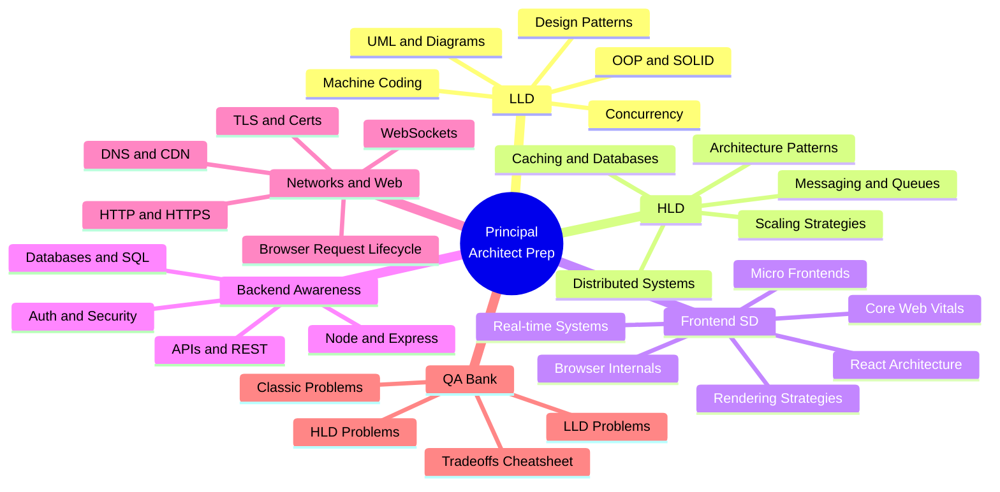

# 🎯 Principal Staff Architect — Complete Preparation System

> **80% Frontend | 20% Backend Awareness | LLD + HLD + System Design + Networks**  
> Built for engineers targeting Principal, Staff, or Architect-level roles at product-first companies.  
> This is not a "definitions list" — it's a **reasoning and tradeoffs** system.

---

🚀 **Primary Study Navigation Hub:**
- 🗺️ **Master Index:** [`Prep/README.md`](./README.md)
- 📅 **8-Week Master Schedule:** [`Prep/ROADMAP.md`](./ROADMAP.md) (Week-by-week schedule + clickable file links)
- 🏆 **Social & Content Platforms Problem Bank:** [`Prep/07-Problem-Bank/README.md`](./07-Problem-Bank/README.md) (Stack Overflow, Social Network, Learning Platform, Cricinfo, LinkedIn, Spotify)
- 🎨 **Master Design Patterns Guide:** [`Prep/01-LLD/04-Design-Patterns.md`](./01-LLD/04-Design-Patterns.md) (10 High-Frequency Patterns + Algomaster Links + FE/BE Code)
- 📐 **Master UML Diagrams Guide:** [`Prep/01-LLD/05-UML-Diagrams.md`](./01-LLD/05-UML-Diagrams.md) (Class, Sequence, Component & State Machine Diagrams + FUN-SCALE)
- 🧱 **Standalone SOLID Principles Master Guide:** [`Prep/01-LLD/SOLID.md`](./01-LLD/SOLID.md) (S.O.L.I.D. FE & BE Code, Diagrams, Enterprise Case Study)
- 🌟 **Master OOP & Principles Guide:** [`Prep/01-LLD/MASTER-OOP-DESIGN-PRINCIPLES.md`](./01-LLD/MASTER-OOP-DESIGN-PRINCIPLES.md) (DRY, KISS, YAGNI, Law of Demeter, Coupling & Cohesion)
- 🔬 **Small-to-Large Edge Cases:** [`Prep/06-Interview-QA/SCENARIO-EDGE-CASES-BANK.md`](./06-Interview-QA/SCENARIO-EDGE-CASES-BANK.md) (Double submit, Multi-tab desync, SW cache lock, Thundering herd)
- 🎯 **Advanced Principal Gaps:** [`Prep/03-Frontend-SD/ADVANCED-PRINCIPAL-GAPS.md`](./03-Frontend-SD/ADVANCED-PRINCIPAL-GAPS.md) (OpenTelemetry RUM, OAuth2 PKCE, Trusted Types XSS, Design Tokens, Tree-Shaking)
- 🔥 **Hot FE Practice Bank:** [`Prep/03-Frontend-SD/HOT-FE-INTERVIEW-PRACTICE.md`](./03-Frontend-SD/HOT-FE-INTERVIEW-PRACTICE.md) (Collaborative Whiteboard, Micro Frontend Platform, Offline Task PWA)
- 📄 **FE Master Catalog & Blueprints:** [`Prep/03-Frontend-SD/11-Frontend-Systems-Catalog.md`](./03-Frontend-SD/11-Frontend-Systems-Catalog.md) (Uber Live Map, Dropbox Upload, VS Code Web, Toast Center)

---

## 🗺️ Study System at a Glance



---

## 🧭 What is a Principal/Staff Architect?

### The Title vs The Job

| Dimension              | Senior Engineer    | Principal / Staff Architect      |
| ---------------------- | ------------------ | -------------------------------- |
| **Scope**              | Feature-level      | System or org-level              |
| **Decision type**      | Implementation     | Architecture + Strategy          |
| **Ambiguity**          | Low – given a spec | High – you define the spec       |
| **Mentorship**         | Optional           | Expected                         |
| **Tradeoff reasoning** | Within a story     | Across quarters, systems, teams  |
| **Communication**      | Team               | Cross-team, leadership, external |
| **Review scope**       | PR reviews         | Tech radar, architecture reviews |

### What Interviewers Actually Test

At the senior level: _"Can you design a URL shortener?"_

At the principal level:

- _"Why did you choose a hash approach over a counter?"_
- _"What breaks at 10M req/day? What breaks at 1B?"_
- _"If the cache layer is lost, what is the degraded experience?"_
- _"What's the cost implication of your caching strategy vs. strong consistency?"_
- _"How does your choice affect the on-call burden?"_
- _"How would you migrate an existing system to this design?"_

> **🔑 Principal-Level Signal:** You are not expected to produce a perfect design. You are expected to **reason about tradeoffs, failure modes, cost, and evolution paths** in real-time.

---

## 📚 How to Use This Repo

### Core Philosophy

This repo follows the **Feynman Technique** applied to system design:

1. **Read** the concept (with context and diagrams)
2. **Explain it back** in simple terms (Q&A sections)
3. **Apply it** to a concrete problem (code + design exercise)
4. **Stress-test it** — what breaks? what's the cost? what's the alternative?

### The 80/20 Rule Applied

| Section                 | Time Allocation | Why                                                     |
| ----------------------- | --------------- | ------------------------------------------------------- |
| Frontend System Design  | 35%             | Your primary domain — go deep                           |
| LLD (Low-Level Design)  | 25%             | Machine coding is 60% of FE interviews                  |
| HLD (High-Level Design) | 20%             | Needed for "design an API / feed / notification system" |
| Networks and Browser    | 10%             | Critical for performance + debugging interviews         |
| Backend Awareness       | 10%             | Enough to collaborate, not to compete with BEs          |

---

## 📂 All Sections Index

### 01 — Low-Level Design (LLD)

> _OOP, Design Patterns, Machine Coding, UML, Concurrency_

| File                                                               | Description                                 | Key Concepts                                                 |
| ------------------------------------------------------------------ | ------------------------------------------- | ------------------------------------------------------------ |
| 📖 [`01-OOP-Concepts.md`](./01-LLD/01-OOP-Concepts.md)             | The 4 OOP pillars in depth                  | Encapsulation, Abstraction, Inheritance, Polymorphism        |
| 📖 [`02-SOLID.md`](./01-LLD/02-SOLID.md)                           | All 5 SOLID principles with TS examples     | SRP, OCP, LSP, ISP, DIP + Case Study                         |
| 📖 [`03-Design-Principles.md`](./01-LLD/03-Design-Principles.md)   | Core design principles                      | DRY, KISS, YAGNI, Law of Demeter, Coupling & Cohesion        |
| 📖 [`04-Design-Patterns.md`](./01-LLD/04-Design-Patterns.md)       | Creational, Structural, Behavioral patterns | Factory, Singleton, Adapter, Decorator, Strategy, Observer   |
| 📖 [`05-UML-Diagrams.md`](./01-LLD/05-UML-Diagrams.md)             | Visual modeling & requirements              | Class, Sequence, Component Diagrams & FUN-SCALE Framework    |
| 📖 [`06-Machine-Coding.md`](./01-LLD/06-Machine-Coding.md)         | Machine coding challenges                   | Executable LRU Cache, Splitwise Debt Minimizer, Rate Limiter |
| 📖 [`07-Concurrency-Design.md`](./01-LLD/07-Concurrency-Design.md) | Synchronization primitives                  | Mutex, Semaphore, Async Queue, Lock-free CAS Atomics         |

### 02 — High-Level Design (HLD)

> _Architecture, Distributed Systems, Caching, Databases, Scale_

| File                                                                     | Description                               | Key Concepts                                          |
| ------------------------------------------------------------------------ | ----------------------------------------- | ----------------------------------------------------- |
| 📖 [`01-Architecture-Patterns.md`](./02-HLD/01-Architecture-Patterns.md) | Monolith → Microservices → Serverless     | Monolith vs Microservices, Event-Driven, BFF, DDD     |
| 📖 [`02-Distributed-Systems.md`](./02-HLD/02-Distributed-Systems.md)     | Distributed systems theorems & algorithms | CAP, PACELC, Consistent Hashing, Saga, CRDT           |
| 📖 [`11-Classic-Problems.md`](./02-HLD/11-Classic-Problems.md)           | Full HLD Blueprints (FUN-SCALE)           | Rate Limiter, Twitter Feed System, WhatsApp Messaging |

### 03 — Frontend System Design (80% Primary Focus)

> _Rendering, Performance, Architecture, Real-time, Browser Internals_

| File                                                                                   | Description                           | Key Concepts                                                   |
| -------------------------------------------------------------------------------------- | ------------------------------------- | -------------------------------------------------------------- |
| 📖 [`01-Rendering-Strategies.md`](./03-Frontend-SD/01-Rendering-Strategies.md)         | All Web Rendering Strategies          | CSR, SSR, SSG, ISR, Streaming SSR, RSC, Islands                |
| 📖 [`02-Performance-CWV.md`](./03-Frontend-SD/02-Performance-CWV.md)                   | Core Web Vitals & Web Performance     | LCP, INP, CLS, TTFB, Resource Hints, Yielding Main Thread      |
| 📖 [`03-Browser-Internals.md`](./03-Frontend-SD/03-Browser-Internals.md)               | Event Loop & Rendering Pipeline       | Event Loop, Reflow vs Repaint, Layout Thrashing, Memory Leaks  |
| 📖 [`04-React-Architecture.md`](./03-Frontend-SD/04-React-Architecture.md)             | React Fiber Engine & Concurrency      | Fiber, 32-bit Lanes, `useSyncExternalStore`, React 19 Compiler |
| 📖 [`10-Frontend-Classic.md`](./03-Frontend-SD/10-Frontend-Classic.md)                 | Classic FE System Designs (FUN-SCALE) | YouTube Player, Virtualized Feed, Search Autocomplete          |
| 📖 [`11-Frontend-Systems-Catalog.md`](./03-Frontend-SD/11-Frontend-Systems-Catalog.md) | FE Master Catalog & Blueprints        | Uber Live Map, Dropbox Upload, VS Code Web, Toast Center       |
| 🔥 [`HOT-FE-INTERVIEW-PRACTICE.md`](./03-Frontend-SD/HOT-FE-INTERVIEW-PRACTICE.md)     | Hot FE Practice Bank                  | Figma Whiteboard, Micro Frontend Platform, Offline Task PWA    |
| 🎯 [`ADVANCED-PRINCIPAL-GAPS.md`](./03-Frontend-SD/ADVANCED-PRINCIPAL-GAPS.md)         | Advanced Principal Gaps               | OpenTelemetry RUM, OAuth2 PKCE, Trusted Types, Design Tokens   |

### 04 — Backend Awareness (20% Focus)

> _Enough backend knowledge to be a great frontend architect_

| File                                                                               | Description                                           | Key Concepts                                             |
| ---------------------------------------------------------------------------------- | ----------------------------------------------------- | -------------------------------------------------------- |
| 📖 [`01-Node-Express-Basics.md`](./04-Backend-Awareness/01-Node-Express-Basics.md) | Node event loop, middleware, streaming, rate limiting | Event Loop, Streams, Rate Limiter Lua, BE Red Flags, Q&A |

### 05 — Networks & Web

> _DNS, HTTP, TLS, WebSockets, browser request lifecycle_

| File                                                          | Description                                        | Key Concepts                                                  |
| ------------------------------------------------------------- | -------------------------------------------------- | ------------------------------------------------------------- |
| 📖 [`01-DNS-to-HTTP.md`](./05-Networks-Web/01-DNS-to-HTTP.md) | Complete request lifecycle from DNS to HTTP/3 QUIC | DNS, TCP 3-Way Handshake, TLS 1.3 0-RTT, HTTP/1/2/3, L4/L7 LB |

### 06 — Interview Q&A Bank & Tradeoffs

> _166 Collapsed self-test questions, tradeoffs cheatsheets, interview simulations_

| File                                                                              | Description                           | Key Concepts                                                    |
| --------------------------------------------------------------------------------- | ------------------------------------- | --------------------------------------------------------------- |
| 📖 [`LLD-QA.md`](./06-Interview-QA/LLD-QA.md)                                     | 30 LLD questions with answers         | OOP, SOLID, Patterns, Concurrency                               |
| 📖 [`HLD-QA.md`](./06-Interview-QA/HLD-QA.md)                                     | 30 HLD questions with answers         | Distributed Systems, DB Sharding, Caching                       |
| 📖 [`FE-SD-QA.md`](./06-Interview-QA/FE-SD-QA.md)                                 | 30 Frontend SD questions with answers | Rendering, Web Vitals, Security, Real-time                      |
| 🔬 [`SCENARIO-EDGE-CASES-BANK.md`](./06-Interview-QA/SCENARIO-EDGE-CASES-BANK.md) | Small-to-Large Scenario Edge Cases    | Double submit, Multi-tab desync, SW cache lock, Thundering herd |
| 🎯 [`Principal-Level-QA.md`](./06-Interview-QA/Principal-Level-QA.md)             | 20 Principal architectural scenarios  | "Why This Over That?" Tradeoffs                                 |
| ⚡ [`Tradeoffs-Cheatsheet.md`](./06-Interview-QA/Tradeoffs-Cheatsheet.md)         | X vs Y Quick Reference Matrix         | SQL vs NoSQL, REST vs GraphQL, CSR vs SSR                       |

---

## 📅 8-Week Study Plan

| Week  | Focus Area                       | Files to Study                                                    | Practice Problems                            | Hours/Day |
| ----- | -------------------------------- | ----------------------------------------------------------------- | -------------------------------------------- | --------- |
| **1** | LLD Foundation                   | `01-LLD/01-OOP-SOLID`, `02-Design-Patterns`                       | Parking Lot, LRU Cache                       | 2–3 hrs   |
| **2** | Design Patterns + Machine Coding | `01-LLD/02-Design-Patterns`, `03-Machine-Coding`                  | Observer pattern, Command pattern, Undo-Redo | 2–3 hrs   |
| **3** | UML + Concurrency + Requirements | `01-LLD/04-UML-Diagrams`, `05-Concurrency-Patterns`               | Elevator, Chess, Booking System              | 2–3 hrs   |
| **4** | HLD Foundation                   | `02-HLD/01-Architecture-Patterns`, `02-Distributed-Systems`       | URL Shortener, Pastebin                      | 2–3 hrs   |
| **5** | HLD Advanced                     | `02-HLD/03-Caching`, `04-Databases`, `05-Messaging`, `06-Scaling` | Twitter Feed, Notification System            | 2–3 hrs   |
| **6** | Frontend SD — Rendering + Perf   | `03-Frontend-SD/01-Rendering`, `02-CWV`, `03-Browser-Internals`   | Design a news feed, YouTube homepage         | 2–3 hrs   |
| **7** | Frontend SD Advanced             | `03-Frontend-SD/04-React-Arch`, `05-Micro-FE`, `06-Real-time`     | Google Docs, Uber Map, Collaborative editor  | 2–3 hrs   |
| **8** | Mock Interviews + Review         | All `06-QA-Bank` files                                            | Full end-to-end mock sessions                | 3–4 hrs   |

> **Tip:** Don't study every file cover-to-cover in Week 1. Follow the sequence — concepts build on each other intentionally.

---

## 🔁 Daily Practice Loop

The most effective preparation is a **consistent daily habit**, not weekend cramming.

### The 3-Step Daily Loop (45–60 min)

```
Step 1 — PICK  (5 min)
  → Choose 1 LLD problem or 1 HLD problem from the index
  → Do NOT look at the answer yet

Step 2 — DESIGN  (25–35 min)
  → Whiteboard or draw.io or text file
  → Write: requirements, components, interfaces, data flow
  → Identify: failure modes, scaling bottlenecks, cost drivers

Step 3 — SPEAK  (10–15 min)
  → Narrate your design aloud as if presenting to a panel
  → Explicitly say: "I chose X over Y because..."
  → Explicitly say: "This breaks when..."
  → Explicitly say: "At 10x scale, I would change..."
```

### LLD Daily Problems (rotate through)

| Day | Problem                | What to Practice                       |
| --- | ---------------------- | -------------------------------------- |
| Mon | Parking Lot            | Classes, interfaces, strategy pattern  |
| Tue | LRU Cache              | HashMap + DLL, O(1) operations         |
| Wed | Elevator System        | State machine, queue, scheduling       |
| Thu | Chess / Snake & Ladder | Board abstraction, polymorphism        |
| Fri | Pub-Sub System         | Observer, decoupling, event bus        |
| Sat | Hotel Booking System   | Booking logic, concurrency, locks      |
| Sun | Rate Limiter           | Token bucket, sliding window algorithm |

### HLD Daily Problems (rotate through)

| Day | Problem                   | What to Practice                         |
| --- | ------------------------- | ---------------------------------------- |
| Mon | URL Shortener             | Hashing, redirects, analytics, scaling   |
| Tue | Twitter Feed              | Fan-out, celebrity problem, timeline     |
| Wed | Notification System       | Push/pull, channels, prioritization      |
| Thu | Google Drive / Dropbox    | Chunking, sync, conflict resolution      |
| Fri | Ride-sharing App          | Geo-queries, matching, surge pricing     |
| Sat | Video Streaming (YouTube) | CDN, encoding pipeline, adaptive bitrate |
| Sun | Chat App (WhatsApp)       | Presence, delivery receipts, group chat  |

---

## 🎓 Principal-Level Difference — What They're Actually Testing

At a Principal/Staff level, every question has a **"so what?"** expected after your answer.

### The 5 Principal-Level Questions Behind Every Design

```
1. "Why this over that?"
   → You must know at least 2 alternatives and articulate why you ruled them out.
   → Example: "I chose Redis over Memcached because we need pub-sub and sorted sets."

2. "What breaks at scale?"
   → Single points of failure, hot partitions, queue depth, thundering herd.
   → Example: "At 1M users, the fan-out-on-write approach hits write amplification."

3. "What happens on failure?"
   → Graceful degradation, circuit breakers, fallback strategies.
   → Example: "If the cache is down, we fall back to DB with a timeout + return stale data."

4. "Cost vs. performance?"
   → Memory costs money. Compute costs money. Engineers cost money.
   → Example: "We could store pre-computed timelines but that's 10x storage cost."

5. "How do you migrate to this?"
   → No system is greenfield. How do you roll this out without downtime?
   → Example: "We'd run dual writes for 2 weeks, then flip the read path with a flag."
```

> **🔑 Principal-Level Signal:** The interviewer already knows the "right" answer. They want to see your **reasoning process**, not your memorized solution. A confident "I don't know, but here's how I'd figure it out" beats a wrong confident answer every time.

---

## ⚡ Quick Reference Links

| Resource                 | Link                                                                             | When to Use                           |
| ------------------------ | -------------------------------------------------------------------------------- | ------------------------------------- |
| **Q&A Bank — LLD**       | [`06-QA-Bank/LLD-QA-Bank.md`](./06-QA-Bank/LLD-QA-Bank.md)                       | Daily self-test for LLD               |
| **Q&A Bank — HLD**       | [`06-QA-Bank/HLD-QA-Bank.md`](./06-QA-Bank/HLD-QA-Bank.md)                       | Daily self-test for HLD               |
| **Frontend SD Q&A**      | [`06-QA-Bank/Frontend-SD-QA-Bank.md`](./06-QA-Bank/Frontend-SD-QA-Bank.md)       | Pre-interview FE review               |
| **Tradeoffs Cheatsheet** | [`06-QA-Bank/Tradeoffs-Cheatsheet.md`](./06-QA-Bank/Tradeoffs-Cheatsheet.md)     | Last-day-before-interview review      |
| **Classic Problems**     | [`06-QA-Bank/Classic-Problems-Index.md`](./06-QA-Bank/Classic-Problems-Index.md) | Pick your daily practice problem      |
| **Backend Awareness**    | [`04-Backend-Awareness/README.md`](./04-Backend-Awareness/README.md)             | Before any cross-functional interview |
| **Networks Overview**    | [`05-Networks-Web/README.md`](./05-Networks-Web/README.md)                       | Network/performance interview prep    |
| **8-Week Roadmap**       | [`ROADMAP.md`](./ROADMAP.md)                                                     | Your weekly study schedule            |

---

## 🔗 Useful External Resources

- 🎨 **Design Patterns Repository:** [kumaratul60/design-patterns](https://github.com/kumaratul60/design-patterns)
- ⚛️ **React Web Development Notes:** [kumaratul60/web-dev/Notes](https://github.com/kumaratul60/web-dev/tree/main/Notes)
- ⚡ **JavaScript In-Depth Interview Prep:** [kumaratul60/javascript-interview](https://github.com/kumaratul60/javascript-interview)
- 🌐 **System Design Core Repository:** [kumaratul60/System-Design](https://github.com/kumaratul60/System-Design)

---

## 🧱 Repository Philosophy

This repository is built on three beliefs:

1. **Tradeoffs over solutions** — A correct answer with no reasoning is worth less than a thoughtful answer with explicit tradeoffs.

2. **Depth over breadth** — It is better to deeply understand 10 patterns than to superficially know 50.

3. **Speak before you write** — At the principal level, communication _is_ the skill. Every design session should end with you having narrated the design aloud.

---

_Last updated: August 2026 — Principal/Staff Architect Prep System v1.0_
