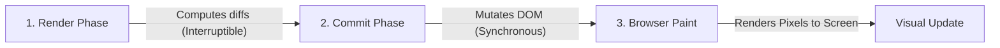
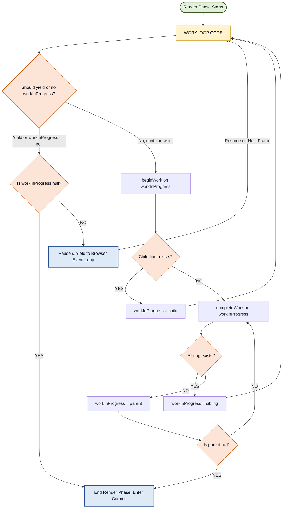

# React Internals: The Evolution from Stack to Fiber

This guide provides an in-depth exploration of React's internal architecture, tracking the paradigm shift from the synchronous **Stack Reconciler** to the asynchronous, interruptible **Fiber Reconciler**.

## Table of Contents

- [React Internals: The Evolution from Stack to Fiber](#react-internals-the-evolution-from-stack-to-fiber)
  - [Table of Contents](#table-of-contents)
  - [Executive Summary: React's Rendering Engine at a Glance](#executive-summary-reacts-rendering-engine-at-a-glance)
  - [1. The Stack Reconciler Era (Pre-v16)](#1-the-stack-reconciler-era-pre-v16)
    - [The Main Thread Hostage Crisis](#the-main-thread-hostage-crisis)
    - [The 16.67ms Frame Budget](#the-1667ms-frame-budget)
    - [Why Tree Recursion is Uninterruptible](#why-tree-recursion-is-uninterruptible)
  - [2. The Fiber Reconciler Revolution (v16+)](#2-the-fiber-reconciler-revolution-v16)
    - [The Key Insight](#the-key-insight)
    - [What is a "Fiber"?](#what-is-a-fiber)
      - [Real-world Anatomy: How a Fiber Node looks in Console](#real-world-anatomy-how-a-fiber-node-looks-in-console)
    - [The Linked List Tree Structure \& Depth-First Traversal](#the-linked-list-tree-structure--depth-first-traversal)
      - [How the Depth-First Traversal Works:](#how-the-depth-first-traversal-works)
    - [Core Reconciliation Rules during Traversal](#core-reconciliation-rules-during-traversal)
    - [What Fiber Added: Interruptibility \& Incremental Execution](#what-fiber-added-interruptibility--incremental-execution)
      - [Why This Matters to Architects:](#why-this-matters-to-architects)
    - [Double Buffering (Current vs. WorkInProgress Trees)](#double-buffering-current-vs-workinprogress-trees)
  - [3. The Three-Stage Rendering Pipeline](#3-the-three-stage-rendering-pipeline)
    - [Deep Dive: The Render Phase](#deep-dive-the-render-phase)
      - [Anatomy of React's Render Phase (Flowchart)](#anatomy-of-reacts-render-phase-flowchart)
      - [1. `beginWork`](#1-beginwork)
      - [2. `completeWork`](#2-completework)
    - [Phase 2: Commit (Synchronous \& Uninterruptible)](#phase-2-commit-synchronous--uninterruptible)
      - [1. How the Effects List is Compiled (Bottom-Up)](#1-how-the-effects-list-is-compiled-bottom-up)
      - [2. The Commit Phase Execution Loops](#2-the-commit-phase-execution-loops)
      - [3. Why the Effects List is Important](#3-why-the-effects-list-is-important)
    - [Phase 3: Browser Paint](#phase-3-browser-paint)
      - [Why This 3-Phase Split Matters to Architects:](#why-this-3-phase-split-matters-to-architects)
  - [4. The Scheduler \& Time Slicing Mechanics](#4-the-scheduler--time-slicing-mechanics)
    - [The Shift to Cooperative Rendering](#the-shift-to-cooperative-rendering)
    - [What Time Slicing Enables](#what-time-slicing-enables)
    - [Why Not requestIdleCallback?](#why-not-requestidlecallback)
    - [The MessageChannel Work Loop](#the-messagechannel-work-loop)
      - [Why This Matters to Architects:](#why-this-matters-to-architects-1)
  - [5. Concurrency \& Modern React (v18+)](#5-concurrency--modern-react-v18)
    - [Priority Lanes Model](#priority-lanes-model)
      - [1. What are Lanes?](#1-what-are-lanes)
      - [2. What are `childLanes`?](#2-what-are-childlanes)
      - [3. Automatic Update Batching \& Scheduling via Lanes](#3-automatic-update-batching--scheduling-via-lanes)
      - [4. How Lanes \& childLanes Optimize Traversals](#4-how-lanes--childlanes-optimize-traversals)
      - [Why This Matters to Architects:](#why-this-matters-to-architects-2)
    - [Suspense \& startTransition](#suspense--starttransition)
  - [6. The React 19 Compiler Integration](#6-the-react-19-compiler-integration)
  - [7. How an Architect Audits \& Verifies React Internals](#7-how-an-architect-audits--verifies-react-internals)
    - [The Architect's Audit Checklist](#the-architects-audit-checklist)
      - [1. Verifying Work Loop Yielding (Chrome DevTools Performance Panel)](#1-verifying-work-loop-yielding-chrome-devtools-performance-panel)
      - [2. Profiling Concurrent Interruptions (React DevTools Profiler)](#2-profiling-concurrent-interruptions-react-devtools-profiler)
      - [3. Real-User Monitoring (RUM) for React Interaction to Next Paint (INP)](#3-real-user-monitoring-rum-for-react-interaction-to-next-paint-inp)
      - [4. Memory Leak Auditing (Heap Snapshots \& Closure Traps)](#4-memory-leak-auditing-heap-snapshots--closure-traps)
  - [8. Senior / Staff Level "Grill" Questions](#8-senior--staff-level-grill-questions)
    - [Q1: If the JavaScript Engine call stack is synchronous, how does React "pause" rendering in the middle of a function?](#q1-if-the-javascript-engine-call-stack-is-synchronous-how-does-react-pause-rendering-in-the-middle-of-a-function)
    - [Q2: Why does mutating fiber.alternate make double-buffering fast, and how does it prevent memory leaks?](#q2-why-does-mutating-fiberalternate-make-double-buffering-fast-and-how-does-it-prevent-memory-leaks)
    - [Q3: How does React's Lane Priority system resolve Priority Inversion?](#q3-how-does-reacts-lane-priority-system-resolve-priority-inversion)
    - [Q4: Compare Svelte's compile-time reactivity with React 19's React Compiler. What is the fundamental architectural difference?](#q4-compare-sveltes-compile-time-reactivity-with-react-19s-react-compiler-what-is-the-fundamental-architectural-difference)
    - [Q5: How does an architect inspect Chrome DevTools to verify that updates are time-sliced rather than synchronous?](#q5-how-does-an-architect-inspect-chrome-devtools-to-verify-that-updates-are-time-sliced-rather-than-synchronous)
    - [Q6: How can you detect and measure Hydration Mismatch overhead programmatically in production monitoring?](#q6-how-can-you-detect-and-measure-hydration-mismatch-overhead-programmatically-in-production-monitoring)
    - [Q7: Why does passing a reference-stable callback via `useCallback` do nothing to prevent child component re-renders if the child is not wrapped in `React.memo`?](#q7-why-does-passing-a-reference-stable-callback-via-usecallback-do-nothing-to-prevent-child-component-re-renders-if-the-child-is-not-wrapped-in-reactmemo)
    - [Q8: Explain the "children as props" rendering bailout optimization. Why does passing a child element as a prop (e.g., `children` or `content={<Child />}`) prevent re-renders, even when the parent component re-renders and the child is NOT wrapped in `React.memo`?](#q8-explain-the-children-as-props-rendering-bailout-optimization-why-does-passing-a-child-element-as-a-prop-eg-children-or-contentchild--prevent-re-renders-even-when-the-parent-component-re-renders-and-the-child-is-not-wrapped-in-reactmemo)
    - [Q9: How does wrapping a function in `useCallback` prevent unnecessary execution loops in `useEffect` hooks?](#q9-how-does-wrapping-a-function-in-usecallback-prevent-unnecessary-execution-loops-in-useeffect-hooks)

## Executive Summary: React's Rendering Engine at a Glance

Every time a re-render is triggered, React coordinates updates across three distinct stages:

1. **Render Phase:** React evaluates components, runs reconciliation, and computes changes. (Interruptible & asynchronous).
2. **Commit Phase:** React applies computed changes to the DOM. (Synchronous & uninterruptible).
3. **Painting Phase:** The browser calculates styles, runs layout rules, and paints/rasterizes pixels onto the screen.

Here is a quick architectural recap of the key systems that make this rendering engine work under the hood:

- **React Fiber & Fiber Nodes:** React's internal architecture that breaks rendering work into small, incremental chunks. Every component, DOM tag, and UI element is represented by a heap-allocated **Fiber Node** tracking its state, props, parent/child links, and side-effects.
- **Depth-First Traversal (DFS):** During reconciliation, React walks the Fiber tree using a predictable, top-down Depth-First Search (DFS) on the singly-linked list structure. This guarantees that each component and its children are processed before React moves to siblings.
- **The WorkLoop, beginWork & completeWork:** The work loop is the core of reconciliation, processing one node at a time. For each node, `beginWork` determines what changes are needed (creating child fibers or skipping/reusing unchanged components), and `completeWork` finalizes the node (building DOM nodes in memory and compiling side-effect flags into the **Effects List**).
- **Time Slicing:** A cooperative multitasking design that checks the remaining time budget (5ms slices) per fiber. If the budget is exhausted, React yields control back to the browser event loop to handle user inputs, then resumes rendering on the next frame without losing progress.
- **Lanes & ChildLanes:** A bitmask priority representation. **Lanes** assign priority levels to individual updates, enabling React to batch similar updates or prioritize urgent typing tasks while deferring lower-priority transition updates. **ChildLanes** bubble up priority flags, enabling React to check subtree updates and skip traversing entire un-updated subtrees in $O(1)$ time.

---

## 1. The Stack Reconciler Era (Pre-v16)

Before React 16, UI rendering and updates were coordinated by the **Stack Reconciler**.

### The Main Thread Hostage Crisis

Under the Stack Reconciler, React operated on a simple, recursive design:

- Every state update triggered a recursive traversal of the virtual DOM tree.
- Once the recursion started, it could not be paused, prioritized, or aborted. It ran from start to finish, holding the browser's single main thread hostage.

During this time, any user input, animation frame request, or layout paint was blocked until React completed the entire tree evaluation.

```
[State Update] ──> [Synchronous Tree Recursion (Stack Reconciler)] ──> [DOM Commits]
                         │ (Main thread blocked, no user interaction allowed)
                         ▼
                  *Frame Dropped* / UI Freeze
```

### The 16.67ms Frame Budget

Modern browsers target a refresh rate of **60 frames per second (fps)**, which leaves exactly **16.67ms** per frame. Within this tiny window, the browser must execute all pending JavaScript, perform style calculations, compute layouts (reflow), and paint the pixels (rasterization) to the screen.

```
┌─────────────────────────────────────────────────────────────┐
│                      16.67ms Frame Window                   │
├───────────────┬─────────────────┬───────────┬───────────────┤
│  JS Execution │ Style Recalc    │ Layout    │ Paint         │
│ (React Render)│ (CSSOM)         │ (Reflow)  │ (Repaint)     │
└───────────────┴─────────────────┴───────────┴───────────────┘
```

If React's synchronous rendering work took **30ms** on a complex UI tree, the browser was forced to skip the frame, causing visible UI freezes and stuttering.

### Why Tree Recursion is Uninterruptible

The fundamental limitation of the Stack Reconciler was its reliance on the **JavaScript Engine Call Stack**.

```javascript
// Conceptual representation of the Stack Reconciler's recursive traversal
function reconcileComponent(instance) {
  const nextElement = instance.render();
  const prevElement = instance.prevRenderedElement;

  if (shouldUpdateComponent(prevElement, nextElement)) {
    reconcileChildren(instance, nextElement.props.children);
  }
}
```

Because recursive functions push frames onto the native execution stack, there is no way to stop execution midway, return to the browser event loop, and then return back to the exact same position on the stack. The only way to stop is to complete the recursion or throw an error.

---

## 2. The Fiber Reconciler Revolution (v16+)

React Fiber isn't just a performance update. It's a complete rewrite of React's rendering engine.

At its core, **React Fiber is a scheduler**. It is an engine that breaks rendering into small, discrete units called **fiber nodes**, and manages how those units are processed over time.

### The Key Insight

- **Rendering is no longer a single, uninterruptible operation.**
- React can process a unit of work (one fiber node), check available time, and either continue or yield back to the browser's main thread.

This unlocked capabilities that were previously impossible in the Stack Reconciler era:

- **Incremental Rendering:** Splitting rendering work into chunks so the UI stays responsive even during large updates.
- **Pausing and Resuming:** React stops mid-render and picks up exactly where it left off.
- **Priority-Based Scheduling:** User interactions (like keystrokes or clicks) can interrupt low-priority background rendering work.
- **Concurrency Primitives:** Serves as the foundation for modern capabilities like `Suspense`, `startTransition`, and Concurrent Mode.

---

### What is a "Fiber"?

Every element in your React application—every component, DOM element, fragment, or portal—gets its own Fiber node. Think of it as a virtual stack frame and a dedicated "worker" assigned to manage that specific piece of the UI.

Here is the TypeScript declaration of a Fiber node and what its key fields represent:

```typescript
interface Fiber {
  // Instance Identity
  tag: WorkTag; // Internal type (e.g., 5 = HostComponent like <div>, 0 = FunctionComponent)
  type: any; // The actual component function, class, or string DOM tag to render
  stateNode: any; // The actual DOM node for host components, class instance for class components, null for functional components

  // Pointers that form the Singly-Linked List Tree Structure
  return: Fiber | null; // Pointer to the parent fiber
  child: Fiber | null; // Pointer to the first child fiber
  sibling: Fiber | null; // Pointer to the next sibling fiber

  // Work State & Memoization
  pendingProps: any; // Props React is preparing to use in the current render pass
  memoizedProps: any; // Props from the last committed render (React diffs these two to check for changes)
  memoizedState: any; // Linked list representing hooks state (useState, useReducer, etc.)
  updateQueue: mixed; // Queue of pending state transitions to apply

  // Concurrency & Double Buffering
  lanes: Lanes; // Bitmask representing priority levels
  alternate: Fiber | null; // Pointer to the clone representing the double-buffer counterpart
}
```

#### Real-world Anatomy: How a Fiber Node looks in Console

When debugging React internals, logging a Fiber node reveals its direct JavaScript properties. Here is the mapped representation of a live Fiber node for an `<h1>` element based on a browser console inspector:

```javascript
// console.log(reactFiberNode)
{
  tag: 5,                                 // 5 = HostComponent (e.g. <h1>)
  key: null,
  elementType: "h1",
  type: "h1",                             // Element Type Info
  stateNode: h1#h1-id,                    // Reference to The Real DOM Node

  child: null,                            // Pointer to First Nested Child node (currently leaf, so null)
  sibling: Object { tag: 5, ... },        // Next Element at Same Level (sibling)
  return: Object { tag: 5, ... },         // Parent Fiber Node (ascends back to it)

  memoizedProps: {                        // Props from last completed render
    id: "h1-id",
    children: "Hello World!!"
  },
  pendingProps: {                         // Props React is preparing to use in current render
    id: "h1-id",
    children: "Hello World!!"
  },

  memoizedState: null,                    // Hooks state linked list
  lanes: 0,                               // Priority lane bitmask
  alternate: null,                        // Double-buffering draft counterpart node
  // ... debug metadata
}
```

### The Linked List Tree Structure & Depth-First Traversal

React doesn't randomly walk your component tree. It follows a strict, predictable pattern using **Depth-First Traversal (DFS)** on the singly-linked list structure. Understanding this traversal pattern changes how you think about re-renders.

Instead of representing relationships via parent-child arrays, Fiber structures the entire tree using `child`, `sibling`, and `return` pointers.

```
       [Parent Fiber] (return)
             │
             ▼ (child)
       [Child Fiber 1] ──(sibling)──> [Child Fiber 2] ──(sibling)──> [Child Fiber 3]
             │                              │                              │
             ▼ (return)                     ▼ (return)                     ▼ (return)
       [Parent Fiber]                 [Parent Fiber]                 [Parent Fiber]
```

#### How the Depth-First Traversal Works:

1. **Start at the root fiber.**
2. **Go deep:** Traverse down through the first `child`, then its `child`, until hitting the deepest leaf node.
3. **Return back up:** When hitting a node with no child, complete work for that node, return to its parent (`return`), then check for `sibling` nodes.
4. **Move to siblings:** Move to the sibling and dive down its branch.
5. **Repeat** until the entire tree is traversed.

This gives React an **$O(N)$ traversal** where every node is visited exactly once.

---

### Core Reconciliation Rules during Traversal

As React walks the tree, it enforces two critical rules:

- **Type-Driven Pruning:** If a node's type changes (e.g., `<div>` is replaced by `<span>`, or `CustomHeader` becomes `PromoHeader`), React discards the entire old subtree. It does not attempt to reconcile it or diff its children; it destroys the subtree and mounts the new one from scratch.
- **Key-Driven List Reordering:** For siblings (such as lists), React uses the developer-supplied `key` prop to map and reuse existing elements rather than destroying and recreating them. Missing or unstable keys cause React to fall back to index matching, which degrades performance and wipes local DOM/component states.

---

### What Fiber Added: Interruptibility & Incremental Execution

Before Fiber, this DFS traversal was synchronous and recursive (all-or-nothing). A large component tree would block the browser for tens of milliseconds.

Fiber changed this traversal to be iterative and interruptible:

- **Interruptible:** React can pause mid-traversal to handle high-priority tasks (e.g., user typing), then resume.
- **Incremental:** When React resumes, it picks up exactly where it stopped, rather than restarting from the root.

This is possible because the Fiber tree is a **persistent data structure** maintained in heap memory. React always preserves its current position pointer (`workInProgress`) and knows the next unit of work to process.

```javascript
let workInProgress = rootFiber;

function workLoop() {
  // Traverse iteratively rather than recursively
  while (workInProgress !== null && !shouldYield()) {
    workInProgress = performUnitOfWork(workInProgress);
  }
}
```

If `shouldYield()` returns `true`, the loop exits. The current state is preserved in the pointer variable `workInProgress`. When the browser yields control back to React, it resumes the loop from the exact point it paused.

#### Why This Matters to Architects:

- **Re-render Propagation:** Moving a component higher in the tree causes its rendering to trigger earlier in the DFS pass, potentially cascading re-renders down its entire child/sibling branch.
- **Key Placement:** Key selection on lists is a critical performance and state-preservation decision, not just a React warning.
- **Incremental Updates:** React does not "restart" rendering on every frame update; it resumes from its current heap-allocated unit of work.

### Double Buffering (Current vs. WorkInProgress Trees)

To prevent users from seeing partially rendered or inconsistent UI states, React Fiber uses a graphics rendering technique called **Double Buffering**.

React maintains two trees simultaneously:

1. **Current Tree:** Represents the state currently visible on the screen.
2. **WorkInProgress (WIP) Tree:** A draft tree constructed in memory during the Render phase.

```
    [Current Tree] (Rendered on Screen)
          │▲
          ││ (alternate pointers)
          ▼│
  [WorkInProgress Tree] (Constructed in Memory)
```

When updates occur, React iterates over the current tree, cloning nodes to create the `WorkInProgress` tree. All diffs, hooks execution, and lifecycle evaluations are performed on the WIP tree.

Once the WIP tree is completely constructed and ready, React performs a pointer swap: the WIP tree instantly becomes the `Current` tree, and the changes are committed to the DOM in a single flush. The old current tree is then recycled for the next update cycle.

---

## 3. The Three-Stage Rendering Pipeline

Every re-render in React passes through three distinct, sequential stages before any changes actually appear on the screen. Most developers are unaware of all these steps:



1. **Render Phase:** React evaluates components, computes state changes, runs diffing algorithms, and constructs the in-memory tree. **No DOM updates occur here.**
2. **Commit Phase:** React reads the mutation list and applies the changes directly to the live browser DOM.
3. **Browser Paint:** The browser engine recalculates layout geometries (reflow) and rasterizes/paints the changes onto the display.

---

### Deep Dive: The Render Phase

At the core of the Render phase is the **Work Loop**. Rather than traversing the entire component tree synchronously in one go, the work loop processes **one fiber node at a time**, checking if time is available in its frame budget after evaluating each node.

```
Pick one fiber node ──► Process it ──► Time still available?
                             ▲                 │
                             │ (YES)           ▼ (NO)
                             └──────────────── Yield to browser
```

#### Anatomy of React's Render Phase (Flowchart)

This flowchart illustrates the step-by-step logic React's iterative DFS traversal executes during the Render Phase:



#### 1. `beginWork`

For every fiber node the work loop processes, it calls `beginWork(current, workInProgress, renderLanes)`. This function is responsible for determining what updates are needed for the fiber:

- **Initial/Mount Render:** All child fibers are created from scratch based on the returned JSX element.
- **Updates/Re-renders:** React compares the new props and state against the previous values (`memoizedProps` vs `pendingProps`).
  - **No changes detected:** React short-circuits, reuses existing child fibers as-is, and **skips the entire child subtree**.
  - **Changes detected:** React evaluates the element, computes updates, and constructs/updates the child fibers.

> [!NOTE]
> **Memoization Mechanics:**
>
> - This is exactly where `React.memo` operates. When a component is wrapped in `React.memo`, `beginWork` runs a shallow comparison of props. If they match, React skips rendering that component and reuses its entire child branch.
> - In **React 19 with the React Compiler**, this caching logic is injected directly into component ASTs during compilation. As a result, components perform self-memoization checks at runtime, making manual `React.memo` wrapping obsolete.

#### 2. `completeWork`

Once React has finished diving down a branch and hits a leaf node (no more child fibers), it calls `completeWork(current, workInProgress, renderLanes)` as it ascends back up the tree. It performs two critical jobs:

- **DOM Node Creation in Memory:** For host components (e.g. `<div>`, `<span>`), React checks if a DOM node exists. On mount, it instantiates the actual browser DOM element in memory and assigns it to `fiber.stateNode`. Note that this node is **not yet attached** to the live, visible document DOM.
- **Flagging Side Effects (The Effects List):** React inspects the properties that changed and flags the fiber with side-effect bits (e.g. `Placement` for new nodes, `Update` for attribute modifications, `Deletion` for removal, `Passive` or `Layout` for effects). These flags are stored in **`fiber.flags`** (previously `fiber.effectTag`).
  Along with assigning these flags, React compiles all fibers with pending changes into a linked list called the **Effects List** (linked by `nextEffect` in older releases, and bubbled up via `subtreeFlags` in React 18+). This list acts as a queue, allowing the Commit phase to bypass traversing the clean, unchanged parts of the tree and jump directly to the nodes requiring updates.

```
beginWork    ──► Decides what changes are needed (creates/reuses child fibers, bails out on unchanged components)
completeWork ──► Finalizes the fiber, instantiates DOM nodes in memory, and queues side-effects in the form of a linked list (Effects List)
```

---

### Phase 2: Commit (Synchronous & Uninterruptible)

Once the Render phase finishes and the WorkInProgress tree is ready, React enters the **Commit phase**.

The main challenge for the Commit phase is speed: it cannot yield, and it must update the DOM atomically. React solves this by consuming the **Effects List** (compiled during the `completeWork` step).

#### 1. How the Effects List is Compiled (Bottom-Up)

Instead of re-analyzing or re-traversing the entire tree in the Commit phase, React uses the linear Effects List built during the `completeWork` ascent.

During the Render Phase, the work loop executes DFS traversal via `performUnitOfWork`:

- **`beginWork` (Pre-Order):** Evaluated top-down as React descends the tree.
- **`completeWork` (Post-Order):** Evaluated bottom-up as React ascends back up, starting at the deepest leaf nodes.

Due to this post-order processing:

- **Bottom-Up Construction:** The Effects List begins compilation at leaf nodes.
- **Parent Collection:** Each parent Fiber node collects the Effects List of its children, merges them, and appends its own effect flag (if dirty) to the end of the list.
- **Root Finalization:** By the time the work loop returns to the root fiber, a single, flat linked list of all fibers requiring side effects (and only those fibers) is complete. Clean fibers are entirely bypassed.

```mermaid
graph TD
    subgraph FiberTree["1. Fiber Tree Reconciliation & Effect Collection (DFS Ascent)"]
        Root[Root Fiber]
        ChildA[Child Fiber A]
        LeafA1[Leaf Fiber A1]
        ChildB[Child Fiber B]
        LeafB1[Leaf Fiber B1]

        Root -- "beginWork (Down)" --> ChildA
        ChildA -- "beginWork (Down)" --> LeafA1

        LeafA1 -. "completeWork & bubble effect (Up)" .-> ChildA
        ChildA -. "completeWork & bubble effect (Up)" .-> Root

        Root -- "beginWork (Down)" --> ChildB
        ChildB -- "beginWork (Down)" --> LeafB1

        LeafB1 -. "completeWork & bubble effect (Up)" .-> ChildB
        ChildB -. "completeWork & bubble effect (Up)" .-> Root

        classDef dirty fill:#fff2cc,stroke:#d6b656,stroke-width:2px,color:#111827;
        class LeafA1,ChildA,LeafB1,ChildB,Root dirty;
    end

    subgraph EffectsList["2. Resulting Compiled Effects List (Execution Plan)"]
        ListStart[Leaf Fiber A1] --> ListNext1[Child Fiber A]
        ListNext1 --> ListNext2[Leaf Fiber B1]
        ListNext2 --> ListNext3[Child Fiber B]
        ListNext3 --> ListEnd[Root Fiber]

        classDef listNode fill:#f2f2f2,stroke:#595959,stroke-width:1px,color:#111827;
        class ListStart,ListNext1,ListNext2,ListNext3,ListEnd listNode;
    end
```



---

#### 2. The Commit Phase Execution Loops

The Commit phase walks the completed **Effects List** and executes updates across three sequential loops (sub-phases):

1. **Before Mutation Phase:** Walks the list to execute pre-commit side effects, such as reading the current DOM layout via `getSnapshotBeforeUpdate()`.
2. **Mutation Phase (DOM Writes):** Walks the list to perform the actual imperative DOM mutations. Unlike the Render Phase where processing order is determined by node visit sequences, the Commit Phase applies mutations in a strict, segregated order:
   - **`Deletions` Happen First:** Walks the list to detach deleted DOM elements and trigger component unmount cleanup hooks first. Removing old nodes clears the layout space before placing new elements.
   - **`Placements` Happen Second:** Inserts new DOM nodes (created during `completeWork` in memory) into their correct layout positions in the live tree.
   - **`Updates` Happen Third:** Applies updates (property modifications, attribute updates, text content changes) to existing elements.
3. **Layout Phase:** Walks the list to execute layout and post-mutation effects:
   - Synchronously executes **Layout Effects (`useLayoutEffect`)**. Because these run synchronously before repaint, they block browser painting, allowing layout measurements to occur without visual flickering.
   - Registers and schedules **Passive Effects (`useEffect`)** to run asynchronously in a post-paint macro-task.
   - Binds component DOM references (`refs`).

---

#### 3. Why the Effects List is Important

- **Efficiency:** Bypasses full tree re-traversals. The Commit phase walks a clean, flat list of dirty nodes rather than traversing thousands of clean nodes.
- **Order Preservation:** Effects are compiled bottom-up, guaranteeing they execute in correct logical order (child effects run before parent effects).
- **Selective Work:** Only fibers with pending side effects are touched.
- **Phase Separation:** Decouples decisions ("what changes are needed" in the Render phase) from execution ("performing the DOM write" in the Commit phase).

---

### Phase 3: Browser Paint

After React releases the main thread from the Commit phase, the browser takes over:

1. **Style Recalculation (CSSOM):** Parses the DOM updates and applies CSS rules.
2. **Layout Calculation (Reflow):** Computes geometric dimensions and coordinate boundaries of all elements.
3. **Repaint (Rasterization):** Colors in pixels and draws the frame onto the display.
4. **Passive Effects execution:** Once painting is complete, React's Scheduler is notified, and it fires the accumulated `Passive` (`useEffect`) callback queue asynchronously.

#### Why This 3-Phase Split Matters to Architects:

- **Memoization Scope:** `React.memo` (and the React Compiler) doesn't just save a single component call—it short-circuits the entire `beginWork` traversal of its descendant subtree, preventing hundreds of fiber checks.
- **Off-screen DOM Construction:** The creation of DOM structures in memory during `completeWork` reduces reflow recalculations because everything is constructed off-screen and inserted into the active tree in one unified batch during the Commit phase.
- **Safe Pauses:** The Render phase is completely decoupled from browser paints. This design is what makes Concurrent mode safe: React can pause, discard, or run speculative calculations on WIP trees without fear of flashing incomplete mutations to the user's screen.

---

## 4. The Scheduler & Time Slicing Mechanics

Your React application runs on a **single thread**. In a single-threaded environment, executing heavy rendering tasks can easily freeze the user interface. React solves this limitation through a cooperative multitasking mechanism called **Time Slicing**.

### The Shift to Cooperative Rendering

- **Before Fiber: Blocking Rendering:** The Stack Reconciler was a greedy, blocking renderer. It ran the entire render traversal in one synchronous execution frame. If a large component tree took 80ms to render, the main thread was completely locked for 80ms. Any user keystrokes, mouse clicks, or animations were frozen, leading to visible stuttering and frame drops.
- **With Fiber: Cooperative Time Slicing:** Fiber breaks rendering into small, self-contained units of work (individual fiber nodes). After processing each node, React checks the remaining frame budget by calling `shouldYield()`, a function internal to React's **Scheduler** package.

```
                  Stack Reconciler: Greedy / Blocking
[Start Render] ──────────────────────────────────────────► [DOM Commit (80ms)]
                (Main Thread Locked - UI Frozen)

                Fiber + Time Slicing: Cooperative
[Start] ──► [Fiber 1] ──► [shouldYield? NO] ──► [Fiber 2] ──► [shouldYield? YES] ──► [Yield to Browser] ──► [Resume next frame]
```

- **`shouldYield() === false`:** Rendering time remains in the current slice. React immediately proceeds to process the next sibling/child fiber node.
- **`shouldYield() === true`:** The time budget (normally **5ms**) is exhausted. React pauses, saves the current `workInProgress` pointer, yields control back to the browser's event loop, and schedules a callback to resume on the next macro-task.

This cooperative yielding design ensures React shares the main thread with the browser rather than monopolizing it.

---

### What Time Slicing Enables

1. **Continuous UI Responsiveness:** Because React yields control back to the browser before dropping a frame, scrolling and animations remain fluid even during massive background DOM reconciliation updates.
2. **Interruptible Rendering:** High-priority updates (like keyboard typing or button clicks) can pre-empt and abort active, low-priority background updates (like rendering a filtered search result list).
3. **No Dropped Animation Frames:** React checks its budget per individual fiber node, rather than evaluating the entire tree at once, ensuring frames are updated smoothly.

> [!IMPORTANT]
> **Internal API:**
> `shouldYield()` is an internal method within the `Scheduler` package. It is not exposed as a public API for developers to call directly; React manages this lifecycle entirely under the hood.

| Feature / Model           | Stack Reconciler         | Fiber + Time Slicing                      |
| :------------------------ | :----------------------- | :---------------------------------------- |
| **Multitasking Paradigm** | Preemptive / Blocking    | Cooperative / Time-Sliced                 |
| **Execution Flow**        | All-or-nothing recursion | Iterative, step-by-step loop              |
| **Thread Control**        | Monopolizes main thread  | Yields to browser event queue             |
| **Interruptibility**      | No                       | Yes (pre-empted by high-priority updates) |

---

### Why Not requestIdleCallback?

Historically, browsers introduced `requestIdleCallback` (rIC) to run low-priority background tasks during idle periods. However, React could not rely on it because:

1. **Low Support:** Safari did not support `requestIdleCallback`.
2. **Coarse Timing:** rIC fires infrequently (often capped at 20fps in active tabs) and behaves unpredictably during active scrolling or animations, causing dropped frames.
3. **Control Lack:** React needed fine-grained control over scheduling priorities and deadline thresholds.

To bypass these limitations, the React team built their own Scheduler utilizing a polyfill based on `MessageChannel` and `requestAnimationFrame` (rAF).

---

### The MessageChannel Work Loop

The Scheduler runs a loop that breaks large tasks into **Time Slices** (normally **5ms** long). It works like this:

1. React requests a callback block from the Scheduler.
2. The Scheduler schedules a macro-task using `MessageChannel.port1.postMessage()`.
3. The browser processes its layout, styling, and paint pipelines.
4. The macro-task is picked up from the browser's event queue. The Scheduler runs React's work loop.
5. In the loop, React checks `shouldYield()`.
6. `shouldYield()` measures if **5ms** has elapsed since the work segment began.
7. If 5ms is reached, React pauses execution, stores the `workInProgress` pointer, and posts another message via `MessageChannel` to queue the next segment.
8. The browser event loop picks up the new message, allowing user interactions (clicks, keyboard input) to be processed in between the two messages.

```
[Start 5ms Frame]
      │
      ├─► Run workInProgress unit
      ├─► Run workInProgress unit
      │
[5ms Elapsed] ──► shouldYield() === true
                      │
                      ├─► Pause workInProgress pointer
                      ├─► postMessage() (Queue next micro-frame)
                      └─► Yield to browser for click/scroll events
```

#### Why This Matters to Architects:

- **Large UI Scaling:** Explains why complex rendering subtrees do not block rendering and cause the page to freeze.
- **Transition Internals:** Explains why `startTransition` behaves smoothly. It tags the states in a lower priority lane, allowing `shouldYield()` to interrupt rendering whenever higher priority tasks enter the queue.
- **Concurrent Foundations:** Time Slicing is the technical foundation of Concurrent React; Concurrent Mode would be structurally impossible without cooperative yielding.

---

## 5. Concurrency & Modern React (v18+)

With Fiber acting as the foundation, React 18 introduced **Concurrent Rendering**, enabling the framework to render multiple versions of the UI simultaneously in memory.

### Priority Lanes Model

React doesn't treat all updates equally. A button click and a background data fetch represent completely different priority profiles. React determines what to prioritize and schedule using a system of **Lanes**.

Every Fiber node contains a `lanes` field and a `childLanes` field representing pending updates:

#### 1. What are Lanes?

Lanes are implemented as **32-bit bitmasks** (integers where each bit corresponds to a distinct priority level). The smaller the binary bit value (or index), the more urgent the update is considered.

React's built-in priority lanes (ordered from most to least urgent):

- **`SyncLane` (0b0001):** Updates that must execute immediately (e.g., text typing, click handlers).
- **`InputContinuousLane` (0b0010):** Continuous user interactions (e.g., touch dragging, scroll listeners).
- **`DefaultLane` (0b1100):** Standard state updates, promise resolutions, and data fetches.
- **`TransitionLane` (0b110000):** Lower-priority rendering scheduled using `startTransition`.
- **`IdleLane`:** Work that can be safely deferred until the browser thread is completely idle.

By implementing priorities as bitmasks, React can check, group, merge, or exclude multiple lanes using high-speed, $O(1)$ bitwise operations:

```typescript
const isWorkScheduled = (workInProgressLanes & renderLanes) !== NoLanes;
```

#### 2. What are `childLanes`?

While `lanes` represents the priority of pending updates directly on the _current_ fiber, **`childLanes`** represents the aggregated union of all pending updates across the fiber's entire descendant subtree (children, grandchildren, etc.).

- **The Bubbling Mechanism:** When a component deep in the tree schedules a state update, that update's Lane is immediately merged into the `childLanes` of its parent, grandparent, and every ancestor node all the way up to the root fiber.
- **Why this matters:** During traversal, React can check a fiber node's `childLanes` in $O(1)$ time to determine if any descendant has pending work. If `childLanes` is empty, React can safely skip traversing the entire subtree without visiting a single descendant node.

```
       [Ancestor Fiber] (childLanes = TransitionLane)
              │
              ▼ (DFS walk checks childLanes)
       [Memoized Component] (lanes = NoLanes, childLanes = TransitionLane)
              │ (beginWork sees childLanes contains work: descends further)
              ▼
       [Deep Descendant Component] (lanes = TransitionLane) <-- scheduled update here
```

> [!NOTE]
> **Context and `React.memo` Bypass (The `useContext` Scenario):**
>
> - **The Problem:** If a parent component is memoized using `React.memo`, React skips its execution when props remain unchanged. If a child component deep within its subtree consumes a Context via `useContext`, and the Context value updates, how does React guarantee the child re-renders without the memoized parent blocking the rendering pass?
> - **The Solution:** The `childLanes` architecture. When the Context value changes, React schedules work on the child consumer, flagging its fiber node's `lanes`. This pending lane bit is immediately bubbled up and merged into the `childLanes` bitmask of the memoized parent.
> - **The Result:** During DFS traversal, when `beginWork` processes the memoized parent component, it sees that its props have not changed but its `childLanes` is not empty. React skips re-rendering the parent component itself, but **does not skip traversing the subtree**. It continues descending down the DFS walk, reaches the child consuming the context, and successfully re-renders it. This allows React to skip parent work in $O(1)$ time without missing deep child updates.

#### 3. Automatic Update Batching & Scheduling via Lanes

Lanes act as the coordinator for update batching and priority-based task scheduling:

- **State Update Batching:** When multiple `setState` calls are executed within the same browser event handler, React assigns them the **same Lane priority**. Because they share a lane, React batches them together and triggers only a **single render pass** once the event handler finishes.
- **Urgent vs. Deferred Scheduling:** If updates are assigned to different lanes (e.g., typing schedules an update on `SyncLane` while a transition schedules an update on `TransitionLane`), React executes the `SyncLane` render first and defers the `TransitionLane` update, scheduling its render pass for a later frame.

#### 4. How Lanes & childLanes Optimize Traversals

Together, this dual-bitmask architecture makes tree traversal highly efficient:

1. **Skips subtrees with no pending work:** A parent Fiber node can check its `childLanes` in $O(1)$ time. If no bits match the active render lane, React skips the entire subtree, avoiding wasted rendering passes down the tree.
2. **Batches multiple updates:** Groups states sharing a lane into a single commit cycle.
3. **Prioritizes urgent interactions:** Allows high-priority events (e.g., keyboard input) to preempt and defer less urgent work.

#### Why This Matters to Architects:

- **Instant Interactions:** A button click or typing event (SyncLane) will preempt and suspend a background rendering task (TransitionLane) that is currently mid-render.
- **Low-Priority Deferral:** `startTransition` behaves smoothly because it schedules updates on a `TransitionLane`, which forces the work loop to yield to any higher-priority tasks.
- **Reliable Memoization:** Component memoization never breaks state updates or Context propagation in children because updates are bubbled up via `childLanes`.

### Suspense & startTransition

Lanes and Fiber enable two major features:

1. **`startTransition`:** Tells React that a state update is non-urgent.

   ```javascript
   import { useTransition } from 'react';

   const [isPending, startTransition] = useTransition();

   // Typing updates instantly (SyncLane)
   setInputValue(text);

   // Filtering renders in background (TransitionLane)
   startTransition(() => {
     setSearchQuery(text);
   });
   ```

   If the user updates the input again before the transition finish rendering, React aborts the stale background transition rendering and starts a new one with the latest value.

2. **Suspense:** Allows React to pause the rendering of a component tree while it waits for an asynchronous resource (like data fetching or code splitting).
   - When a component suspends, it throws a Promise.
   - React catches this Promise, pauses rendering for that subtree, and mounts the nearest `<Suspense>` fallback.
   - Behind the scenes, React continues rendering the suspended components in a separate `WorkInProgress` fiber branch. When the Promise resolves, it swaps the finished branch into the active tree.

---

## 6. The React 19 Compiler Integration

Prior to React 19, devs had to manually manage memoization using `React.memo`, `useMemo`, and `useCallback` to avoid unnecessary rendering overhead.

The **React Compiler** (introduced in React 19) shifts this optimization work to compile-time.

```
[Raw JSX/Code] ──► [React Compiler (Build Time)] ──► [Self-Memoizing JavaScript]
                                                          │
                                                          ▼
                                            (Bypasses unnecessary reconciler passes)
```

The compiler parses the Abstract Syntax Tree (AST) of components and automatically inserts dependency validation arrays and memoization caches into the compiled code.

```javascript
// Compiled output (conceptual representation)
let memoizedValue = useMemoCache(2);
if (memoizedValue[0] !== stateVal) {
  // If dependency changed, evaluate and update cache
  memoizedValue[0] = stateVal;
  memoizedValue[1] = computeExpensiveValue(stateVal);
}
const result = memoizedValue[1];
```

By ensuring components are self-memoizing, the compiler drastically reduces the number of nodes React's Fiber reconciler must visit during the Render phase, maximizing the efficiency of time-sliced reconciliation loops.

---

## 7. How an Architect Audits & Verifies React Internals

For a systems architect, theoretical understanding is insufficient. You must verify and profile these rendering internals to ensure application stability, prevent performance regressions, and identify rendering bottlenecks under heavy loads.

### The Architect's Audit Checklist

```mermaid
graph TD
    A[Audit React Performance] --> B[DevTools Profiling]
    A --> C[Production Monitoring (RUM)]
    A --> D[Memory Leak Auditing]

    B --> B1[Identify Sync vs. Time-Sliced tasks in Flame Graph]
    B --> B2[Detect Render-Phase Side Effects & Unnecessary Re-renders]

    C --> C1[Track INP Metrics using PerformanceObserver]
    C --> C2[Catch Hydration Mismatches at scale in console.error]

    D --> D1[Inspect Heap Snapshots for Detached DOM Nodes]
    D --> D2[Find stale Hook Closures holding Fiber references]
```

#### 1. Verifying Work Loop Yielding (Chrome DevTools Performance Panel)

- **What to check:** Verify that heavy renders are broken into 5ms intervals (time slicing) instead of presenting as a single, unbroken "Long Task" ($> 50\text{ms}$).
- **How to check:**
  1. Record a performance trace in Chrome DevTools while performing an interaction (e.g. typing that triggers a filtered list render).
  2. Locate the **Main Thread Flame Chart**.
  3. Look for multiple contiguous tasks labeled **Task** under the `MessageLoop`. In Concurrent mode, instead of a solid red bar indicating a long block, you will see a dotted pattern of ~5ms execution blocks, each separated by a short yielding gap where the browser can run layout/paint or process inputs.

#### 2. Profiling Concurrent Interruptions (React DevTools Profiler)

- **What to check:** Verify that high-priority input events interrupt active lower-priority transition rendering.
- **How to check:**
  1. Open the **React Profiler** tab in DevTools.
  2. Enable "Record why each component rendered" in the profiler settings.
  3. Record an interaction where a user typing interrupts a slow search results render.
  4. Look for the **discarded commits**. You should see that the first render attempt for the slow list has been discarded/interrupted, and a new render pass has begun with the latest state value from the keyboard input.

#### 3. Real-User Monitoring (RUM) for React Interaction to Next Paint (INP)

- **What to check:** Measure the exact delay between user action (click/key press) and the next frame paint.
- **How to check:** Implement the standard `PerformanceObserver` API to capture INP and filter by interaction type:

  ```javascript
  const observer = new PerformanceObserver((list) => {
    for (const entry of list.getEntries()) {
      const delay = entry.duration; // Total time from user interaction to paint
      if (delay > 200) {
        console.warn(`[INP Warning] Long interaction detected: ${delay}ms`, {
          type: entry.name,
          target: entry.target,
          processingStart: entry.processingStart,
          processingEnd: entry.processingEnd,
        });
      }
    }
  });

  observer.observe({ type: 'first-input', buffered: true });
  observer.observe({ type: 'event', durationThreshold: 16, buffered: true });
  ```

#### 4. Memory Leak Auditing (Heap Snapshots & Closure Traps)

- **What to check:** Verify that unmounted components and their corresponding DOM nodes are garbage-collected and do not persist in heap memory.
- **How to check:**
  1. Open the **Memory** panel in Chrome DevTools.
  2. Select **Heap Snapshot** and record a baseline snapshot.
  3. Perform a mount/unmount cycle (e.g. open and close a complex modal or navigate to a new route and back).
  4. Record a second heap snapshot.
  5. Use the class filter search to locate **`Detached HTMLDivElement`** (or other elements). If you find detached DOM nodes, it means elements have been deleted from the visible tree but JavaScript variables are still retaining references to them.
  6. Inspect the **Retainers Tree** at the bottom of the pane. Trace the retention path upward. Often, you will find references pointing back to a `FiberNode` via its `memoizedState` (hooks) or from a stale callback closure in a global event listener/subscription (`window.addEventListener`) that was never cleaned up.

---

## 8. Senior / Staff Level "Grill" Questions

### Q1: If the JavaScript Engine call stack is synchronous, how does React "pause" rendering in the middle of a function?

> **Answer:** React **cannot** pause a running JavaScript function execution frame on the native engine stack. If a component function has started, it must run to completion.
>
> React pauses at the **boundary between component evaluations**.
> Because the Fiber tree is traversed iteratively using a work loop, React evaluates one component (one Fiber node), checks the elapsed time, and if it must yield, it stores the pointer to the **next** sibling/child Fiber in memory. It then exits its work loop.
>
> The individual component functions run synchronously, but the traversal of the component _tree_ is broken down into discrete, step-by-step tasks.

### Q2: Why does mutating fiber.alternate make double-buffering fast, and how does it prevent memory leaks?

> **Answer:** React avoids allocating memory for a complete set of new Fiber nodes during every render cycle. Instead, it reuses existing Fibers via the `alternate` property.
>
> Every Fiber node on the `Current` tree has a pointer to its counterpart on the `WorkInProgress` tree via `fiber.alternate`.
> During an update, React looks at the `alternate` node. If it exists, React mutates and updates its existing properties rather than allocating a new object.
>
> This technique (recycling nodes via double-buffering) keeps memory allocations flat, reduces garbage collection runs, and prevents memory leaks by maintaining a stable pool of paired Fiber objects.

### Q3: How does React's Lane Priority system resolve Priority Inversion?

> **Answer:** **Priority Inversion** occurs when a low-priority task (e.g. rendering a complex table) holds a lock or blocks a high-priority task (e.g. rendering user typing) from completing.
>
> React resolves this via the Lanes system and cooperative scheduling:
>
> 1. **Cooperative Interruption:** When a high-priority update (SyncLane) arrives while a low-priority render (TransitionLane) is running, React's Scheduler checks `shouldYield()`. The low-priority loop yields immediately.
> 2. **Discarding/Bailing Out:** React checks the incoming update lane. If it's a higher priority, React pauses and temporarily saves the WIP tree. It then starts a new render pass targeting _only_ the SyncLane update.
> 3. **Lane Merging:** If the low-priority task has dependencies required by the high-priority task, React merges the lanes, raising the priority of the low-priority task (Priority Inheritance) to ensure both finish together, resolving the conflict.

### Q4: Compare Svelte's compile-time reactivity with React 19's React Compiler. What is the fundamental architectural difference?

> **Answer:**
>
> - **Svelte:** Discards the virtual DOM entirely. Svelte compiles templates into direct, imperative DOM manipulation updates (`element.textContent = val`). The reactivity is fine-grained and push-based at the variable level.
> - **React Compiler:** Does **not** bypass the Virtual DOM or the Fiber reconciler. React is pull-based. The React Compiler automatically inserts caching optimization (`useMemo`/`useCallback`) into the component code at build-time.
>
> **The Key Difference:** The React Compiler optimizes the _creation_ of the Virtual DOM, ensuring React only runs reconciliation when strictly necessary. However, the final rendering still runs through the Fiber reconciler, keeping the virtual DOM, time-slicing scheduler, and commit phases intact.

### Q5: How does an architect inspect Chrome DevTools to verify that updates are time-sliced rather than synchronous?

> **Answer:** An architect can verify time-slicing by running a CPU performance trace while triggering a rendering update:
>
> 1. Under the **Performance** tab, set CPU throttling to **4x or 6x slowdown** to exaggerate rendering overhead.
> 2. Record a trace while triggering the update (e.g., executing a transition).
> 3. Inspect the **Main Thread Flame Chart**. If time-slicing is working, the workload will present as a series of short, repeated blocks capped at **5ms** in length, separated by a brief gap.
> 4. If time-slicing is _not_ working (or if updates are accidentally running synchronously in `SyncLane` instead of a transition), the trace will display a single, solid red-hatched **Long Task** (e.g., lasting 150ms), blocking user interactions and rendering frames.

### Q6: How can you detect and measure Hydration Mismatch overhead programmatically in production monitoring?

> **Answer:** Hydration mismatches are catastrophic for performance because React must discard the server-rendered HTML for that subtree and perform a full client-side render from scratch.
>
> To audit this in production, you can capture browser console warnings programmatically:
>
> ```javascript
> if (typeof window !== 'undefined') {
>   const originalError = console.error;
>   console.error = function (...args) {
>     const msg = args[0];
>     if (
>       typeof msg === 'string' &&
>       (msg.includes('Hydration failed') || msg.includes('did not match') || msg.includes('Server-rendered HTML'))
>     ) {
>       // Log mismatch details to your monitoring service (e.g. Sentry, Datadog)
>       trackErrorToMonitoringService('HydrationMismatch', {
>         message: msg,
>         url: window.location.href,
>         userAgent: navigator.userAgent,
>         stack: new Error().stack,
>       });
>     }
>     originalError.apply(console, args);
>   };
> }
> ```
>
> This allows architects to aggregate hydration failure rates across real users, isolating specific pages or components causing expensive DOM reconciler bails.

### Q7: Why does passing a reference-stable callback via `useCallback` do nothing to prevent child component re-renders if the child is not wrapped in `React.memo`?

> **Answer:** Wrapping a function in `useCallback` only guarantees its referential stability. When the parent component re-renders, it re-evaluates its entire JSX body. A child element declaration like `<Child callback={callback} />` compiles down to a dynamic creation call: `React.createElement(Child, { callback })`.
>
> If `<Child />` is not wrapped in `React.memo`, React's reconciler runs in its default mode: when the parent renders, React recursively processes the child subtree during DFS `beginWork` traversal, evaluating its render function _regardless of whether its props (including the callback) changed_.
>
> **The Rule:** `useCallback` is completely useless for avoiding child re-renders unless the child component is wrapped in `React.memo`. To optimize, you must pair them:
>
> 1. Wrap the child component in `React.memo` to skip traversal on prop equality.
> 2. Wrap props like event callbacks in `useCallback` to maintain referential identity across parent renders, preventing the memoization check from failing.

### Q8: Explain the "children as props" rendering bailout optimization. Why does passing a child element as a prop (e.g., `children` or `content={<Child />}`) prevent re-renders, even when the parent component re-renders and the child is NOT wrapped in `React.memo`?

> **Answer:** This is due to React's **Element Reference Stability** (also known as Same-Element Bailout).
>
> When you render a child directly in a component's JSX block:
>
> ```javascript
> function Parent() {
>   const [count, setCount] = useState(0);
>   return <Child />; // Compiles to React.createElement(Child, null), returning a NEW object reference on every render
> }
> ```
>
> Every time `Parent` re-renders, it creates a new React element object for `Child`. React sees a new object reference, which forces the reconciler to run `beginWork` on the child.
>
> However, if you pass `<Child />` as a prop from an ancestor component:
>
> ```javascript
> function Parent({ children }) {
>   const [count, setCount] = useState(0);
>   return (
>     <div>
>       <button onClick={() => setCount(count + 1)}>Update ({count})</button>
>       {children}
>     </div>
>   );
> }
> ```
>
> When `Parent` re-renders due to its own state updates, the `children` element object has already been instantiated by the _ancestor_ component. `Parent` merely receives and returns the exact same object reference (`oldProps.children === newProps.children`).
>
> During the DFS traversal, React checks if the element's object reference changed. Since the reference is identical, React skips processing the child component subtree entirely (**Same-Element Bailout**), preventing unnecessary re-renders **without needing `React.memo`**.
>
> **The Architect's Caveat:** While passing children as props is a clean and lightweight optimization for static elements, it becomes complex if the child needs to consume dynamic props directly from the parent component. In those dynamic scenarios, sticking to the standard `React.memo` and `useCallback` pair is preferred to avoid complex state synchronization patterns.

### Q9: How does wrapping a function in `useCallback` prevent unnecessary execution loops in `useEffect` hooks?

> **Answer:** If a function is defined in a component body and is consumed inside a `useEffect` hook, the function must be listed in the effect's dependency array.
>
> Because JavaScript functions are objects, they are recreated with a new memory reference on every single render cycle. If the function is not wrapped in `useCallback`, the `useEffect` hook will register a dependency change on every render, triggering an infinite execution loop or unnecessary side-effect runs.
>
> **Solutions:**
>
> 1. **`useCallback`:** Wrap the function in `useCallback` to preserve its reference across renders, making it safe to put in the dependency array.
> 2. **In-Effect Definition:** Define the function _inside_ the body of the `useEffect` itself. This removes the function from the component body closure scope, eliminating it from the dependency array entirely.
